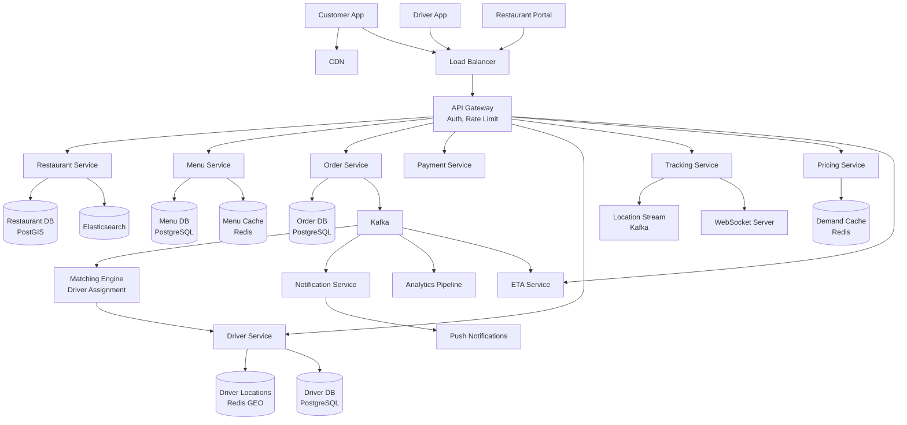
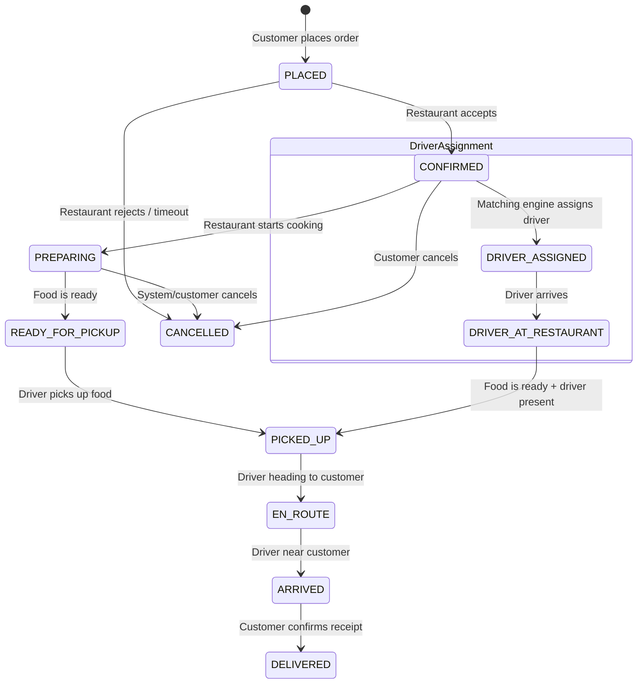
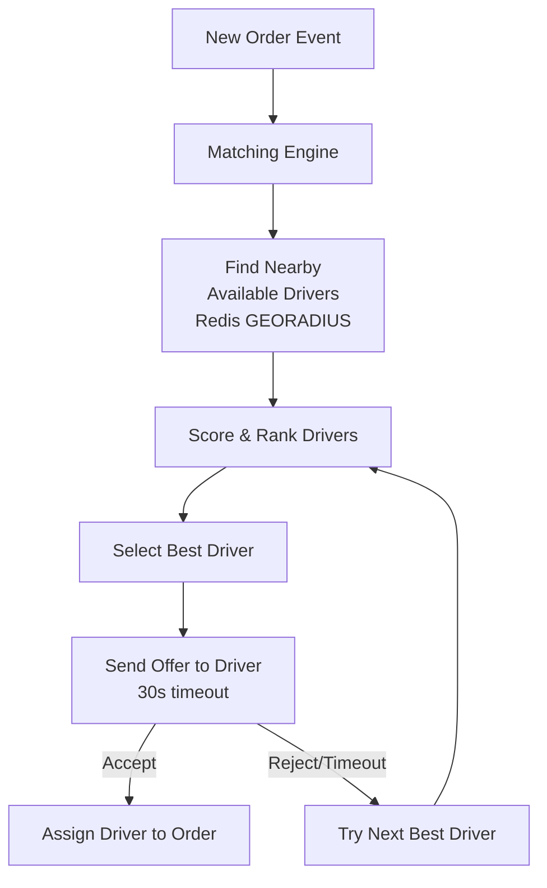
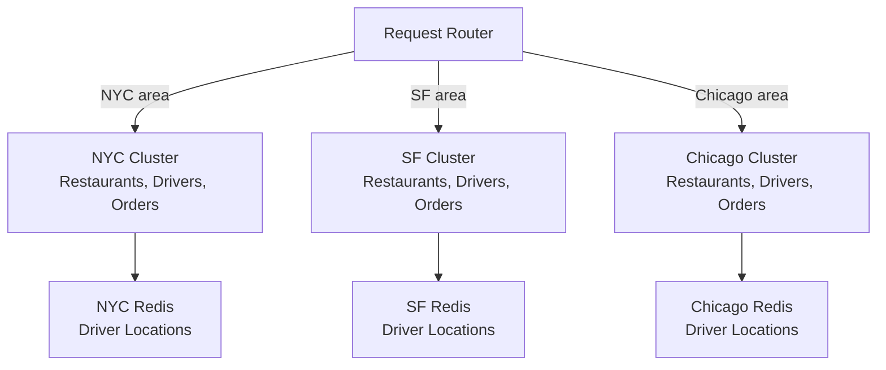

# Design DoorDash / Swiggy (Food Delivery)

## 1. Problem Statement & Requirements

Design a food delivery platform where users browse nearby restaurants, place orders, and get food delivered by drivers with real-time tracking.

### Functional Requirements

| # | Requirement |
|---|-------------|
| FR-1 | Restaurant discovery with location-based search |
| FR-2 | Menu browsing with real-time availability |
| FR-3 | Order placement and payment |
| FR-4 | Real-time order tracking (preparation, pickup, delivery) |
| FR-5 | Driver assignment (matching) |
| FR-6 | Surge pricing during peak demand |
| FR-7 | ETA prediction (food preparation + delivery) |
| FR-8 | Ratings and reviews |
| FR-9 | Restaurant management portal (menu, hours, availability) |

### Non-Functional Requirements

| # | Requirement | Target |
|---|-------------|--------|
| NFR-1 | Availability | 99.99% |
| NFR-2 | Restaurant search latency | p99 < 200 ms |
| NFR-3 | Order placement latency | p99 < 2 s |
| NFR-4 | Location update frequency | Every 4 seconds |
| NFR-5 | Driver assignment time | < 30 seconds |
| NFR-6 | DAU | 50 million |
| NFR-7 | Concurrent active deliveries | 2 million (peak) |

---

## 2. Back-of-Envelope Estimation

### Traffic

- DAU: 50 million
- Orders per day: 20 million
- Restaurant searches per user per session: 10
- Sessions per user per day: 1.5

$$
\text{Search QPS} = \frac{50 \times 10^6 \times 1.5 \times 10}{86400} \approx 8{,}681 \text{ QPS}
$$

$$
\text{Peak search QPS} \approx 5 \times 8{,}681 \approx 43{,}403 \text{ QPS}
$$

$$
\text{Order TPS} = \frac{20 \times 10^6}{86400} \approx 231 \text{ TPS}
$$

$$
\text{Peak order TPS} \approx 10 \times 231 \approx 2{,}315 \text{ TPS}
$$

### Location Updates (Active Deliveries)

- 2 million active deliveries
- Location update every 4 seconds

$$
\text{Location QPS} = \frac{2 \times 10^6}{4} = 500{,}000 \text{ QPS}
$$

### Storage

- Order record: ~3 KB
- Daily orders: 20 million

$$
\text{Order storage/day} = 20 \times 10^6 \times 3 \text{ KB} = 60 \text{ GB/day}
$$

- Restaurant records: 5 million restaurants x 50 KB = 250 GB
- Driver location history: 500K QPS x 100 bytes x 86400s = 4.3 TB/day (sampled)

### Bandwidth

$$
\text{Search responses} = 43{,}403 \times 10 \text{ KB} = 434 \text{ MB/s (peak)}
$$

$$
\text{Location updates} = 500{,}000 \times 100 \text{ bytes} = 50 \text{ MB/s}
$$

---

## 3. High-Level Design



### API Design

```typescript
// GET /v1/restaurants?lat=12.97&lng=77.59&radius=5000&cuisine=indian&sort=rating
interface RestaurantSearchRequest {
  lat: number;
  lng: number;
  radius?: number;           // Meters (default 5000)
  cuisine?: string;
  sort?: 'rating' | 'distance' | 'delivery_time' | 'popularity';
  priceRange?: number[];     // [1, 2] = $ and $$
  dietaryFilter?: string[];  // 'vegetarian', 'vegan', 'gluten_free'
  page?: number;
}

interface RestaurantResponse {
  restaurantId: string;
  name: string;
  cuisines: string[];
  rating: number;
  reviewCount: number;
  priceLevel: number;
  deliveryFee: number;
  estimatedDeliveryMinutes: number;
  distanceMeters: number;
  isOpen: boolean;
  imageUrl: string;
  promotions?: Promotion[];
}

// POST /v1/orders
interface CreateOrderRequest {
  restaurantId: string;
  items: OrderItemRequest[];
  deliveryAddress: Address;
  paymentMethodId: string;
  promoCode?: string;
  specialInstructions?: string;
}

interface OrderItemRequest {
  menuItemId: string;
  quantity: number;
  customizations?: Customization[];
}

// GET /v1/orders/:orderId/track
interface OrderTrackingResponse {
  orderId: string;
  status: OrderStatus;
  driver?: DriverInfo;
  driverLocation?: LatLng;
  eta: ETAInfo;
  timeline: OrderTimelineEvent[];
}

type OrderStatus =
  | 'PLACED'
  | 'CONFIRMED'
  | 'PREPARING'
  | 'READY_FOR_PICKUP'
  | 'DRIVER_ASSIGNED'
  | 'DRIVER_AT_RESTAURANT'
  | 'PICKED_UP'
  | 'EN_ROUTE'
  | 'ARRIVED'
  | 'DELIVERED'
  | 'CANCELLED';
```

---

## 4. Database Schema

### Restaurants

```sql
CREATE TABLE restaurants (
    restaurant_id   UUID PRIMARY KEY,
    name            VARCHAR(200) NOT NULL,
    description     TEXT,
    location        GEOMETRY(Point, 4326) NOT NULL,
    address         TEXT NOT NULL,
    phone           VARCHAR(20),
    cuisines        TEXT[] NOT NULL,
    price_level     SMALLINT CHECK (price_level BETWEEN 1 AND 4),
    rating          DECIMAL(2,1) DEFAULT 0,
    review_count    INT DEFAULT 0,
    avg_prep_time   INT DEFAULT 20,          -- Minutes
    is_active       BOOLEAN DEFAULT TRUE,
    opening_hours   JSONB,                   -- Per day hours
    delivery_radius INT DEFAULT 5000,        -- Meters
    commission_rate DECIMAL(4,2) DEFAULT 25.00,
    image_url       VARCHAR(500),
    created_at      TIMESTAMPTZ DEFAULT NOW()
);

CREATE INDEX idx_restaurant_location ON restaurants
    USING GIST (location);
CREATE INDEX idx_restaurant_cuisines ON restaurants
    USING GIN (cuisines);
CREATE INDEX idx_restaurant_active ON restaurants(is_active)
    WHERE is_active = TRUE;
```

### Menu Items

```sql
CREATE TABLE menu_items (
    item_id         UUID PRIMARY KEY,
    restaurant_id   UUID NOT NULL REFERENCES restaurants(restaurant_id),
    category        VARCHAR(100) NOT NULL,   -- 'Starters', 'Main Course', etc.
    name            VARCHAR(200) NOT NULL,
    description     TEXT,
    price           BIGINT NOT NULL,         -- In cents
    image_url       VARCHAR(500),
    is_available    BOOLEAN DEFAULT TRUE,
    is_vegetarian   BOOLEAN DEFAULT FALSE,
    is_vegan        BOOLEAN DEFAULT FALSE,
    is_gluten_free  BOOLEAN DEFAULT FALSE,
    spice_level     SMALLINT,
    calories        INT,
    customization_groups JSONB,             -- Size, toppings, etc.
    sort_order      INT DEFAULT 0,
    created_at      TIMESTAMPTZ DEFAULT NOW()
);

CREATE INDEX idx_menu_restaurant ON menu_items(restaurant_id, is_available)
    WHERE is_available = TRUE;
```

### Orders

```sql
CREATE TABLE orders (
    order_id        UUID PRIMARY KEY,
    customer_id     UUID NOT NULL,
    restaurant_id   UUID NOT NULL,
    driver_id       UUID,
    status          VARCHAR(30) DEFAULT 'PLACED',
    subtotal        BIGINT NOT NULL,
    delivery_fee    BIGINT NOT NULL,
    service_fee     BIGINT NOT NULL,
    tax             BIGINT NOT NULL,
    tip             BIGINT DEFAULT 0,
    discount        BIGINT DEFAULT 0,
    total           BIGINT NOT NULL,
    promo_code      VARCHAR(50),
    delivery_address JSONB NOT NULL,
    special_instructions TEXT,
    payment_id      UUID,
    estimated_delivery TIMESTAMPTZ,
    placed_at       TIMESTAMPTZ DEFAULT NOW(),
    confirmed_at    TIMESTAMPTZ,
    prepared_at     TIMESTAMPTZ,
    picked_up_at    TIMESTAMPTZ,
    delivered_at    TIMESTAMPTZ,
    cancelled_at    TIMESTAMPTZ,
    cancel_reason   TEXT
) PARTITION BY RANGE (placed_at);

CREATE INDEX idx_orders_customer ON orders(customer_id, placed_at DESC);
CREATE INDEX idx_orders_restaurant ON orders(restaurant_id, placed_at DESC);
CREATE INDEX idx_orders_driver ON orders(driver_id, placed_at DESC);
CREATE INDEX idx_orders_status ON orders(status)
    WHERE status NOT IN ('DELIVERED', 'CANCELLED');
```

### Drivers

```sql
CREATE TABLE drivers (
    driver_id       UUID PRIMARY KEY,
    name            VARCHAR(100) NOT NULL,
    phone           VARCHAR(20) NOT NULL,
    vehicle_type    VARCHAR(20),             -- 'bicycle', 'motorcycle', 'car'
    license_plate   VARCHAR(20),
    rating          DECIMAL(2,1) DEFAULT 5.0,
    total_deliveries INT DEFAULT 0,
    is_active       BOOLEAN DEFAULT TRUE,
    is_online       BOOLEAN DEFAULT FALSE,
    current_order_id UUID,
    created_at      TIMESTAMPTZ DEFAULT NOW()
);

-- Real-time location stored in Redis GEO:
-- GEOADD drivers:locations <lng> <lat> <driver_id>
```

---

## 5. Detailed Component Design

### 5.1 Restaurant Search with Geospatial Queries

```typescript
class RestaurantSearchService {
  private elasticSearch: ElasticsearchClient;
  private restaurantCache: RedisCluster;

  async search(request: RestaurantSearchRequest): Promise<RestaurantResponse[]> {
    const query = {
      bool: {
        must: [
          { term: { is_active: true } },
          this.isCurrentlyOpen(),
        ],
        filter: [
          {
            geo_distance: {
              distance: `${request.radius ?? 5000}m`,
              location: {
                lat: request.lat,
                lon: request.lng,
              },
            },
          },
        ],
        should: [] as any[],
      },
    };

    // Apply filters
    if (request.cuisine) {
      query.bool.must.push({
        term: { cuisines: request.cuisine },
      });
    }

    if (request.priceRange) {
      query.bool.filter.push({
        terms: { price_level: request.priceRange },
      });
    }

    if (request.dietaryFilter?.includes('vegetarian')) {
      query.bool.must.push({
        term: { has_vegetarian_options: true },
      });
    }

    // Sort
    const sort = this.buildSort(request);

    const result = await this.elasticSearch.search({
      index: 'restaurants',
      body: {
        query,
        sort,
        from: ((request.page ?? 1) - 1) * 20,
        size: 20,
      },
    });

    // Enrich with real-time data
    const restaurants = await Promise.all(
      result.hits.hits.map(async (hit) => {
        const restaurant = hit._source;
        const [deliveryETA, isOpen, currentDeliveryFee] = await Promise.all([
          this.etaService.estimateDelivery(
            { lat: request.lat, lng: request.lng },
            restaurant.location
          ),
          this.checkIfOpen(restaurant.restaurantId),
          this.pricingService.getDeliveryFee(
            restaurant.restaurantId,
            { lat: request.lat, lng: request.lng }
          ),
        ]);

        return {
          ...restaurant,
          estimatedDeliveryMinutes: deliveryETA,
          isOpen,
          deliveryFee: currentDeliveryFee,
          distanceMeters: hit.sort?.[0] as number,
        };
      })
    );

    return restaurants;
  }

  private buildSort(request: RestaurantSearchRequest): any[] {
    switch (request.sort) {
      case 'distance':
        return [{
          _geo_distance: {
            location: { lat: request.lat, lon: request.lng },
            order: 'asc',
            unit: 'm',
          },
        }];
      case 'rating':
        return [{ rating: 'desc' }, { review_count: 'desc' }];
      case 'delivery_time':
        return [{ avg_prep_time: 'asc' }];
      default:
        // Popularity: combination of rating, orders, and distance
        return [
          {
            _score: 'desc',
          },
          {
            _geo_distance: {
              location: { lat: request.lat, lon: request.lng },
              order: 'asc',
            },
          },
        ];
    }
  }
}
```

### 5.2 Order Flow — State Machine



```typescript
class OrderService {
  private db: DatabasePool;
  private kafka: KafkaProducer;

  async createOrder(
    customerId: string,
    request: CreateOrderRequest
  ): Promise<OrderResponse> {
    // 1. Validate restaurant is open and items are available
    const restaurant = await this.restaurantService.getRestaurant(
      request.restaurantId
    );
    if (!restaurant.isOpen) {
      throw new Error('Restaurant is currently closed');
    }

    const menuItems = await this.menuService.validateItems(
      request.restaurantId,
      request.items
    );

    // 2. Calculate pricing
    const subtotal = this.calculateSubtotal(menuItems, request.items);
    const deliveryFee = await this.pricingService.getDeliveryFee(
      request.restaurantId,
      request.deliveryAddress
    );
    const serviceFee = Math.round(subtotal * 0.05); // 5% service fee
    const tax = Math.round(subtotal * 0.08);         // 8% tax

    // 3. Apply promo code
    let discount = 0;
    if (request.promoCode) {
      discount = await this.promoService.applyPromo(
        request.promoCode, customerId, subtotal
      );
    }

    const total = subtotal + deliveryFee + serviceFee + tax - discount;

    // 4. Process payment
    const payment = await this.paymentService.charge({
      amount: total,
      currency: 'USD',
      paymentMethodId: request.paymentMethodId,
      idempotencyKey: `order:${customerId}:${Date.now()}`,
    });

    // 5. Create order
    const orderId = crypto.randomUUID();
    const estimatedDelivery = await this.etaService.estimateFullETA(
      request.restaurantId,
      request.deliveryAddress
    );

    await this.db.transaction(async (tx) => {
      await tx.query(`
        INSERT INTO orders
          (order_id, customer_id, restaurant_id, status,
           subtotal, delivery_fee, service_fee, tax, discount, total,
           promo_code, delivery_address, special_instructions,
           payment_id, estimated_delivery)
        VALUES ($1, $2, $3, 'PLACED', $4, $5, $6, $7, $8, $9,
                $10, $11, $12, $13, $14)
      `, [orderId, customerId, request.restaurantId,
          subtotal, deliveryFee, serviceFee, tax, discount, total,
          request.promoCode, request.deliveryAddress,
          request.specialInstructions, payment.paymentId,
          estimatedDelivery]);

      for (const item of request.items) {
        const menuItem = menuItems.find(
          (m) => m.itemId === item.menuItemId
        )!;
        await tx.query(`
          INSERT INTO order_items
            (order_item_id, order_id, menu_item_id, name,
             quantity, unit_price, customizations)
          VALUES ($1, $2, $3, $4, $5, $6, $7)
        `, [crypto.randomUUID(), orderId, item.menuItemId,
            menuItem.name, item.quantity, menuItem.price,
            JSON.stringify(item.customizations)]);
      }
    });

    // 6. Publish order event
    await this.kafka.publish('orders', {
      type: 'ORDER_PLACED',
      orderId,
      restaurantId: request.restaurantId,
      customerId,
      deliveryAddress: request.deliveryAddress,
      estimatedPrepTime: restaurant.avgPrepTime,
      total,
    });

    return this.getOrder(orderId);
  }

  async updateOrderStatus(
    orderId: string,
    newStatus: OrderStatus,
    updatedBy: string
  ): Promise<void> {
    const order = await this.getOrder(orderId);
    const validTransitions = this.getValidTransitions(order.status);

    if (!validTransitions.includes(newStatus)) {
      throw new Error(
        `Invalid transition: ${order.status} -> ${newStatus}`
      );
    }

    const timestampColumn = this.getTimestampColumn(newStatus);
    await this.db.query(`
      UPDATE orders
      SET status = $1, ${timestampColumn} = NOW()
      WHERE order_id = $2
    `, [newStatus, orderId]);

    // Publish status change event
    await this.kafka.publish('order-status', {
      type: 'ORDER_STATUS_CHANGED',
      orderId,
      previousStatus: order.status,
      newStatus,
      updatedBy,
    });

    // Trigger actions based on new status
    switch (newStatus) {
      case 'CONFIRMED':
        await this.matchingEngine.requestDriver(orderId);
        break;
      case 'PICKED_UP':
        await this.notifyCustomer(orderId, 'Your food is on its way!');
        break;
      case 'DELIVERED':
        await this.completeDelivery(orderId);
        break;
      case 'CANCELLED':
        await this.handleCancellation(orderId);
        break;
    }
  }
}
```

### 5.3 Driver Matching Engine



```typescript
class DriverMatchingEngine {
  private redis: RedisCluster;
  private driverService: DriverService;
  private readonly SEARCH_RADIUS_METERS = 5000;
  private readonly OFFER_TIMEOUT_MS = 30_000;
  private readonly MAX_RETRIES = 5;

  async requestDriver(orderId: string): Promise<void> {
    const order = await this.orderService.getOrder(orderId);
    const restaurant = await this.restaurantService.getRestaurant(
      order.restaurantId
    );

    for (let attempt = 0; attempt < this.MAX_RETRIES; attempt++) {
      // 1. Find nearby available drivers
      const searchRadius = this.SEARCH_RADIUS_METERS *
        (1 + attempt * 0.5); // Expand radius on retries
      const nearbyDrivers = await this.findNearbyDrivers(
        restaurant.location,
        searchRadius
      );

      if (nearbyDrivers.length === 0) {
        // Wait and retry
        await new Promise((r) => setTimeout(r, 10_000));
        continue;
      }

      // 2. Score and rank drivers
      const rankedDrivers = await this.rankDrivers(
        nearbyDrivers,
        restaurant.location,
        order
      );

      // 3. Try each driver in order
      for (const driver of rankedDrivers) {
        const accepted = await this.offerToDriver(
          driver.driverId,
          orderId,
          order
        );

        if (accepted) {
          await this.assignDriver(orderId, driver.driverId);
          return;
        }
      }
    }

    // No driver found after all retries
    await this.handleNoDriverAvailable(orderId);
  }

  private async findNearbyDrivers(
    location: LatLng,
    radiusMeters: number
  ): Promise<DriverCandidate[]> {
    // Redis GEORADIUS: find all drivers within radius
    const results = await this.redis.georadius(
      'drivers:locations',
      location.lng,
      location.lat,
      radiusMeters,
      'm',
      'WITHCOORD',
      'WITHDIST',
      'ASC',
      'COUNT', 20
    );

    const candidates: DriverCandidate[] = [];
    for (const result of results) {
      const driverId = result[0];
      const distance = parseFloat(result[1]);
      const [lng, lat] = result[2].map(parseFloat);

      // Check if driver is available
      const isAvailable = await this.redis.get(
        `driver:status:${driverId}`
      );
      if (isAvailable !== 'AVAILABLE') continue;

      candidates.push({
        driverId,
        location: { lat, lng },
        distanceMeters: distance,
      });
    }

    return candidates;
  }

  private async rankDrivers(
    drivers: DriverCandidate[],
    restaurantLocation: LatLng,
    order: Order
  ): Promise<DriverCandidate[]> {
    const scored = await Promise.all(
      drivers.map(async (driver) => {
        const driverProfile = await this.driverService.getProfile(
          driver.driverId
        );

        // Scoring factors
        const distanceScore =
          1 - driver.distanceMeters / this.SEARCH_RADIUS_METERS;
        const ratingScore = (driverProfile.rating - 3) / 2; // 3-5 -> 0-1
        const acceptanceRate =
          driverProfile.acceptanceRate ?? 0.5;
        const vehicleFit =
          order.isLargeOrder && driverProfile.vehicleType === 'car'
            ? 1 : 0.5;

        const totalScore =
          distanceScore * 0.4 +
          ratingScore * 0.2 +
          acceptanceRate * 0.3 +
          vehicleFit * 0.1;

        return { ...driver, score: totalScore };
      })
    );

    return scored.sort((a, b) => b.score - a.score);
  }

  private async offerToDriver(
    driverId: string,
    orderId: string,
    order: Order
  ): Promise<boolean> {
    // Send push notification to driver
    await this.notificationService.sendToDriver(driverId, {
      type: 'DELIVERY_OFFER',
      orderId,
      restaurantName: order.restaurantName,
      deliveryAddress: order.deliveryAddress,
      estimatedEarnings: this.calculateDriverEarnings(order),
      expiresInSeconds: this.OFFER_TIMEOUT_MS / 1000,
    });

    // Wait for response (polling Redis for driver's decision)
    const responseKey = `offer:${orderId}:${driverId}`;
    const startTime = Date.now();

    while (Date.now() - startTime < this.OFFER_TIMEOUT_MS) {
      const response = await this.redis.get(responseKey);
      if (response === 'ACCEPTED') {
        await this.redis.del(responseKey);
        return true;
      }
      if (response === 'REJECTED') {
        await this.redis.del(responseKey);
        return false;
      }
      await new Promise((r) => setTimeout(r, 1000));
    }

    // Timeout = rejection
    await this.redis.del(responseKey);
    return false;
  }

  private async assignDriver(
    orderId: string,
    driverId: string
  ): Promise<void> {
    await this.db.transaction(async (tx) => {
      await tx.query(`
        UPDATE orders SET driver_id = $1, status = 'DRIVER_ASSIGNED'
        WHERE order_id = $2
      `, [driverId, orderId]);

      await tx.query(`
        UPDATE drivers SET current_order_id = $1
        WHERE driver_id = $2
      `, [orderId, driverId]);
    });

    // Update driver status in Redis
    await this.redis.set(`driver:status:${driverId}`, 'ON_DELIVERY');

    // Notify customer
    await this.notificationService.sendToCustomer(
      orderId,
      'Driver assigned! Your delivery is being picked up.'
    );
  }
}
```

### 5.4 Real-Time Tracking

```typescript
class TrackingService {
  private redis: RedisCluster;
  private wsManager: WebSocketManager;
  private kafka: KafkaProducer;

  /**
   * Process driver location updates (every 4 seconds).
   */
  async updateDriverLocation(
    driverId: string,
    location: LatLng
  ): Promise<void> {
    // 1. Update in Redis GEO index
    await this.redis.geoadd(
      'drivers:locations',
      location.lng,
      location.lat,
      driverId
    );

    // 2. Store latest location
    await this.redis.set(
      `driver:location:${driverId}`,
      JSON.stringify({ ...location, timestamp: Date.now() }),
      'EX', 60
    );

    // 3. If driver has an active order, notify the customer
    const currentOrderId = await this.redis.get(
      `driver:order:${driverId}`
    );
    if (currentOrderId) {
      await this.broadcastLocationToCustomer(
        currentOrderId,
        driverId,
        location
      );

      // Update ETA
      const order = await this.orderService.getOrder(currentOrderId);
      const newETA = await this.etaService.calculateDriverToCustomer(
        location,
        order.deliveryAddress
      );
      await this.broadcastETAUpdate(currentOrderId, newETA);
    }

    // 4. Publish to Kafka for analytics/tracking
    await this.kafka.publish('driver-locations', {
      driverId,
      location,
      timestamp: Date.now(),
    });
  }

  private async broadcastLocationToCustomer(
    orderId: string,
    driverId: string,
    location: LatLng
  ): Promise<void> {
    const channel = `order:${orderId}:tracking`;
    const message = JSON.stringify({
      type: 'DRIVER_LOCATION',
      driverId,
      location,
      timestamp: Date.now(),
    });

    // WebSocket broadcast via Redis pub/sub
    await this.redis.publish(channel, message);
  }

  /**
   * Customer subscribes to order tracking via WebSocket.
   */
  handleTrackingConnection(ws: WebSocket, orderId: string): void {
    const channel = `order:${orderId}:tracking`;

    const subscriber = this.redis.duplicate();
    subscriber.subscribe(channel, (message) => {
      if (ws.readyState === WebSocket.OPEN) {
        ws.send(message);
      }
    });

    ws.on('close', () => {
      subscriber.unsubscribe(channel);
      subscriber.quit();
    });

    // Send initial state
    this.sendInitialTrackingState(ws, orderId);
  }

  private async sendInitialTrackingState(
    ws: WebSocket,
    orderId: string
  ): Promise<void> {
    const order = await this.orderService.getOrder(orderId);
    if (order.driverId) {
      const location = await this.redis.get(
        `driver:location:${order.driverId}`
      );
      if (location) {
        ws.send(JSON.stringify({
          type: 'INITIAL_STATE',
          order: {
            status: order.status,
            driverId: order.driverId,
            driverLocation: JSON.parse(location),
          },
        }));
      }
    }
  }
}
```

### 5.5 Surge Pricing

```typescript
class SurgePricingService {
  private redis: RedisCluster;

  /**
   * Calculate surge multiplier based on supply/demand ratio.
   */
  async getSurgeMultiplier(
    location: LatLng,
    radiusMeters: number = 3000
  ): Promise<number> {
    // 1. Count active orders in the area (demand)
    const demand = await this.getActiveOrderCount(
      location, radiusMeters
    );

    // 2. Count available drivers in the area (supply)
    const supply = await this.getAvailableDriverCount(
      location, radiusMeters
    );

    if (supply === 0) return 2.5; // Max surge
    if (demand === 0) return 1.0; // No surge

    const ratio = demand / supply;

    // Surge tiers
    if (ratio <= 1.0) return 1.0;    // Balanced
    if (ratio <= 1.5) return 1.2;    // Light demand
    if (ratio <= 2.0) return 1.5;    // Moderate demand
    if (ratio <= 3.0) return 1.8;    // High demand
    if (ratio <= 5.0) return 2.0;    // Very high demand
    return 2.5;                       // Extreme demand (cap)
  }

  async getDeliveryFee(
    restaurantId: string,
    customerLocation: LatLng
  ): Promise<number> {
    const restaurant = await this.restaurantService.getRestaurant(
      restaurantId
    );

    // Base fee + distance component
    const distance = this.haversineDistance(
      restaurant.location,
      customerLocation
    );
    const baseFee = 199; // $1.99 in cents
    const perKmFee = 50; // $0.50 per km
    const distanceFee = Math.round(
      (distance / 1000) * perKmFee
    );

    const subtotalFee = baseFee + distanceFee;

    // Apply surge
    const surge = await this.getSurgeMultiplier(
      restaurant.location
    );

    return Math.round(subtotalFee * surge);
  }

  private async getActiveOrderCount(
    location: LatLng,
    radiusMeters: number
  ): Promise<number> {
    const count = await this.redis.get(
      `demand:${this.getZoneKey(location)}`
    );
    return parseInt(count ?? '0');
  }

  private async getAvailableDriverCount(
    location: LatLng,
    radiusMeters: number
  ): Promise<number> {
    const drivers = await this.redis.georadius(
      'drivers:locations',
      location.lng,
      location.lat,
      radiusMeters,
      'm',
      'COUNT', 1000
    );
    return drivers.length;
  }

  /**
   * Divide the city into zones (H3 hexagons or geohash cells)
   * for efficient demand tracking.
   */
  private getZoneKey(location: LatLng): string {
    // Use geohash with precision 5 (~5km cells)
    return this.geohash(location.lat, location.lng, 5);
  }
}
```

### 5.6 ETA Prediction

```typescript
class ETAService {
  private routingService: RoutingService;
  private mlModel: MLModelClient;

  /**
   * Full ETA = Prep time + Driver to restaurant + Restaurant to customer
   */
  async estimateFullETA(
    restaurantId: string,
    deliveryAddress: LatLng
  ): Promise<{ totalMinutes: number; breakdown: ETABreakdown }> {
    const restaurant = await this.restaurantService.getRestaurant(
      restaurantId
    );

    // 1. Prep time estimation
    const prepTime = await this.estimatePrepTime(restaurantId);

    // 2. Driver to restaurant (average from nearby drivers)
    const driverToRestaurant = await this.estimatePickupTime(
      restaurant.location
    );

    // 3. Restaurant to customer
    const deliveryTime = await this.estimateDeliveryTime(
      restaurant.location,
      deliveryAddress
    );

    const totalMinutes = prepTime + Math.max(driverToRestaurant, prepTime)
      - prepTime + deliveryTime;
    // Driver travels while food is being prepared:
    // effective pickup wait = max(0, driverTravel - prepTime)

    const effectiveTotal =
      Math.max(prepTime, driverToRestaurant) + deliveryTime;

    return {
      totalMinutes: Math.round(effectiveTotal),
      breakdown: {
        prepTimeMinutes: prepTime,
        pickupTimeMinutes: driverToRestaurant,
        deliveryTimeMinutes: deliveryTime,
      },
    };
  }

  private async estimatePrepTime(restaurantId: string): Promise<number> {
    // ML model based on:
    // - Restaurant's historical prep times
    // - Current order queue depth
    // - Time of day
    // - Menu item complexity
    const features = {
      avgPrepTime: await this.getAvgPrepTime(restaurantId),
      currentQueueSize: await this.getOrderQueue(restaurantId),
      hourOfDay: new Date().getHours(),
      dayOfWeek: new Date().getDay(),
    };

    const prediction = await this.mlModel.predict(features);
    return Math.round(prediction.prepTimeMinutes);
  }

  private async estimateDeliveryTime(
    from: LatLng,
    to: LatLng
  ): Promise<number> {
    const route = await this.routingService.getRoute(from, to, 'driving');
    // Add buffer for parking, finding entrance, etc.
    const routeMinutes = route.durationSeconds / 60;
    const buffer = 3; // minutes
    return Math.round(routeMinutes + buffer);
  }
}
```

### 5.7 Restaurant Management

```typescript
class RestaurantPortalService {
  /**
   * Real-time order management for restaurants.
   */
  async getActiveOrders(
    restaurantId: string
  ): Promise<RestaurantOrderView[]> {
    const orders = await this.db.query(`
      SELECT o.*, json_agg(oi.*) as items
      FROM orders o
      JOIN order_items oi ON o.order_id = oi.order_id
      WHERE o.restaurant_id = $1
        AND o.status IN ('PLACED', 'CONFIRMED', 'PREPARING')
      GROUP BY o.order_id
      ORDER BY o.placed_at ASC
    `, [restaurantId]);

    return orders.rows;
  }

  /**
   * Restaurant updates menu item availability in real-time.
   * E.g., "We're out of Paneer Tikka for today."
   */
  async updateItemAvailability(
    restaurantId: string,
    itemId: string,
    isAvailable: boolean
  ): Promise<void> {
    await this.db.query(`
      UPDATE menu_items
      SET is_available = $1
      WHERE item_id = $2 AND restaurant_id = $3
    `, [isAvailable, itemId, restaurantId]);

    // Invalidate menu cache
    await this.menuCache.del(`menu:${restaurantId}`);

    // Update search index
    await this.searchIndex.update(`item:${itemId}`, { is_available: isAvailable });
  }

  /**
   * Restaurant can pause accepting orders (too busy).
   */
  async toggleAcceptingOrders(
    restaurantId: string,
    accepting: boolean
  ): Promise<void> {
    await this.db.query(`
      UPDATE restaurants SET is_active = $1 WHERE restaurant_id = $2
    `, [accepting, restaurantId]);

    await this.searchIndex.update(
      restaurantId, { is_active: accepting }
    );
  }
}
```

---

## 6. Scaling & Bottlenecks

### What Breaks First?

| Bottleneck | Symptom | Solution |
|-----------|---------|----------|
| Driver location updates (500K QPS) | Redis memory/CPU | Shard by geohash prefix |
| Driver matching during peak | > 30s to find driver | Expand search radius, batch matching |
| WebSocket connections (2M concurrent) | Memory exhaustion | Sticky sessions, fan-out via pub/sub |
| Order DB writes during peak | Checkout latency | Shard by region/city |
| ETA calculation under load | Stale ETAs | Pre-compute for popular routes, cache |

### Geographic Sharding



::: tip City-Level Sharding
Food delivery is inherently local -- a driver in NYC will never deliver in SF. Shard everything by city/region: restaurants, drivers, orders, and real-time data. This provides natural isolation and independent scaling.
:::

---

## 7. Trade-offs & Alternatives

| Decision | Option A | Option B | Our Choice |
|----------|----------|----------|------------|
| Driver matching | Greedy (nearest driver) | Optimization (batch matching) | **Greedy** for simplicity, **batch** for efficiency at scale |
| Location storage | PostgreSQL PostGIS | Redis GEO | **Redis GEO** for real-time, **PostGIS** for analytics |
| Tracking updates | Polling | WebSocket | **WebSocket** for real-time, fallback to polling |
| Pricing | Fixed delivery fee | Dynamic surge | **Dynamic** -- balances supply/demand |
| Order data | Single DB | Sharded by city | **Sharded** -- food delivery is local |

---

## 8. Advanced Topics

### 8.1 Batch Order Optimization

Assign multiple orders to a single driver when pickup/delivery locations are close together (like Uber Pool for food).

```typescript
class BatchOptimizer {
  /**
   * Check if a new order can be batched with
   * an existing in-progress delivery.
   */
  async findBatchCandidate(
    newOrder: Order,
    restaurantLocation: LatLng
  ): Promise<string | null> {
    // Find drivers currently picking up from nearby restaurants
    const nearbyActiveDrivers = await this.redis.georadius(
      'drivers:locations',
      restaurantLocation.lng,
      restaurantLocation.lat,
      1000, // 1 km
      'm',
      'WITHCOORD',
      'ASC',
      'COUNT', 10
    );

    for (const driverEntry of nearbyActiveDrivers) {
      const driverId = driverEntry[0];
      const currentOrderId = await this.redis.get(
        `driver:order:${driverId}`
      );
      if (!currentOrderId) continue;

      const currentOrder = await this.orderService.getOrder(
        currentOrderId
      );

      // Check if deliveries are in the same direction
      if (this.isOnTheWay(
        currentOrder.deliveryAddress,
        newOrder.deliveryAddress,
        restaurantLocation
      )) {
        return driverId;
      }
    }

    return null;
  }
}
```

### 8.2 Fraud Detection

Monitor for: fake orders, driver GPS manipulation, promo code abuse, fake ratings, and identity fraud.

### 8.3 Kitchen Display System (KDS)

Real-time order display for restaurant kitchens showing order queue, preparation time targets, and item-level tracking.

### 8.4 Delivery Route Optimization

When a driver has multiple orders, optimize the pickup and delivery sequence using Traveling Salesman Problem heuristics.

---

## 9. Interview Tips

::: tip Focus on Real-Time
Food delivery's core challenge is real-time coordination between three parties (customer, restaurant, driver). Emphasize: location tracking, driver matching, and order state management.
:::

::: warning Common Mistakes
- Not discussing how drivers are matched to orders (the matching engine is critical)
- Forgetting about restaurant acceptance flow (orders can be rejected)
- Not handling the "no driver available" scenario
- Ignoring surge pricing (supply/demand balancing)
- Using a single database for everything (food delivery is naturally sharded by city)
- Not discussing batched deliveries (major efficiency gain)
:::

::: details Sample Interview Timeline (45 min)
| Time | Phase |
|------|-------|
| 0-5 min | Requirements & scope |
| 5-10 min | Back-of-envelope: QPS, location updates |
| 10-18 min | High-level architecture (three-sided marketplace) |
| 18-28 min | Deep dive: order flow state machine |
| 28-35 min | Driver matching engine |
| 35-40 min | Real-time tracking (WebSocket + Redis GEO) |
| 40-45 min | Surge pricing, ETA, trade-offs |
:::

### Key Talking Points

1. **Three-sided marketplace**: Customer, restaurant, and driver all have different needs. The system coordinates all three in real-time.
2. **Driver matching**: Use Redis GEORADIUS for spatial queries, score drivers by distance + rating + acceptance rate, offer with timeout + fallback.
3. **Why WebSocket for tracking?** Polling 2M active orders every 4 seconds = 500K QPS of wasted requests. WebSocket = 0 QPS when nothing changes.
4. **Why surge pricing?** When demand exceeds driver supply, higher prices incentivize more drivers to go online and moderate demand. Without it, wait times would spike.
5. **City-level sharding**: Food delivery is inherently local. A driver in NYC will never serve an SF order. Shard by city for natural isolation and independent scaling.
