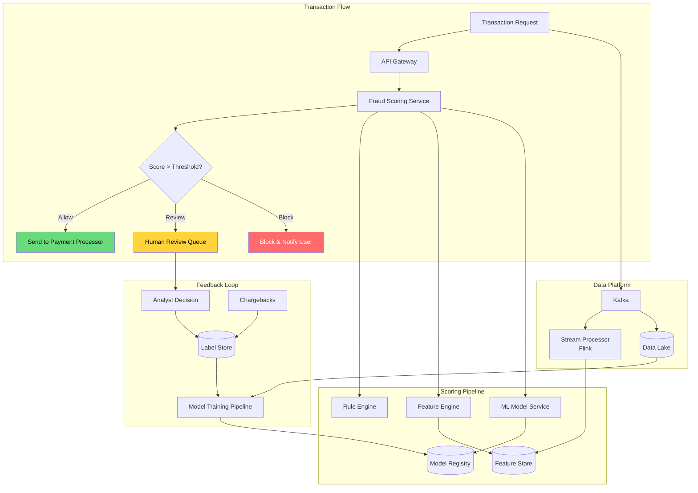
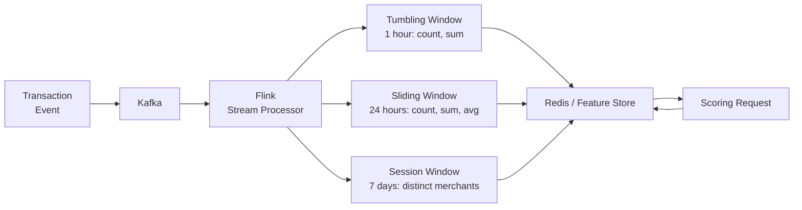
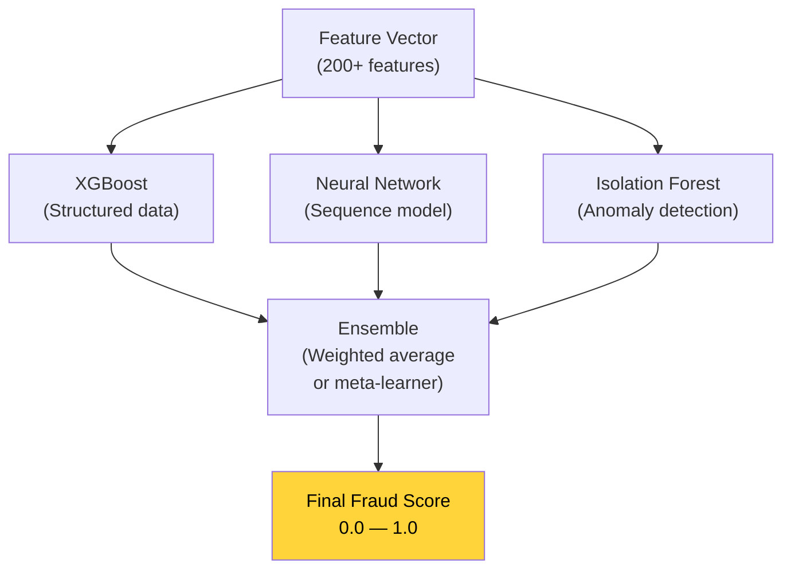
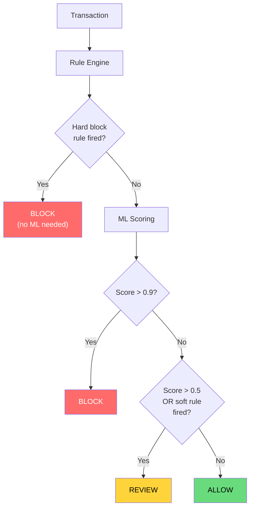
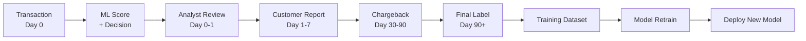
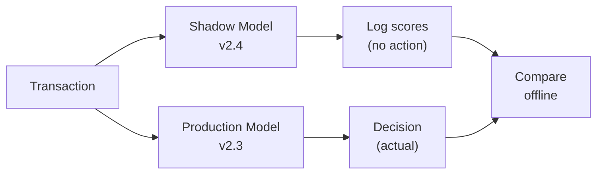
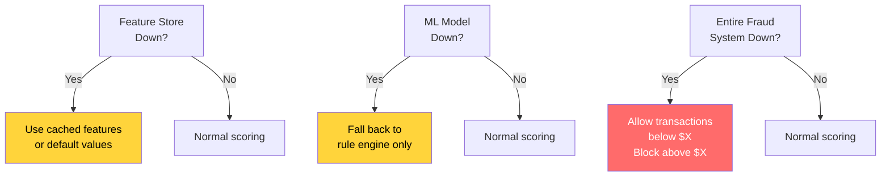

# Design Fraud Detection System

Fraud detection is the canonical ML system design problem. It requires real-time feature computation, model serving at low latency, a rule engine for deterministic checks, human review workflows, and feedback loops that account for delayed labels. The cost of false negatives (missed fraud) is financial loss; the cost of false positives (blocking legitimate users) is revenue loss and customer churn.

---

## 1. Problem Statement & Requirements

### Functional Requirements

1. **Real-time scoring** — Every transaction gets a fraud score before authorization (< 100 ms)
2. **Rule engine** — Apply deterministic rules (velocity checks, blocklists, amount thresholds)
3. **ML scoring** — Ensemble of models producing a fraud probability
4. **Feature computation** — Real-time aggregation of user behavior (last 1h, 24h, 7d spend)
5. **Case management** — Suspicious transactions route to human analysts for review
6. **Feedback loop** — Analyst decisions and chargebacks feed back into model training
7. **A/B testing** — Test new models on shadow traffic before production rollout
8. **Explainability** — Provide top contributing features for each fraud decision
9. **Alerting** — Notify users of blocked transactions, allow appeals

### Non-Functional Requirements

1. **Latency** — P99 < 100 ms for scoring (sits in the payment authorization path)
2. **Availability** — 99.99% (payment path is revenue-critical)
3. **Throughput** — 50K transactions per second at peak
4. **Accuracy** — Precision > 90% at 80% recall (catch most fraud without blocking too many legitimate users)
5. **Adaptability** — Model retraining within hours when new fraud patterns emerge
6. **Auditability** — Every decision logged with features, scores, and rules fired

### Clarifying Questions

::: tip Questions to Ask
- What is the average transaction volume and peak (Black Friday)?
- What is the current fraud rate (basis points)?
- Are we scoring all transaction types (card-present, card-not-present, ACH)?
- What is the average chargeback delay (how long until we know something was fraud)?
- Do we need to support multi-currency and international transactions?
- Is there an existing rule engine, or are we building from scratch?
- What is the acceptable false positive rate?
:::

---

## 2. Back-of-Envelope Estimation

### Traffic

- 50K TPS at peak, 20K TPS average
- Each transaction needs scoring: 20K scoring requests/second

$$
\text{Daily transactions} = 20{,}000 \times 86{,}400 = 1.73 \text{ billion/day}
$$

### Feature Computation

- Each user needs real-time aggregates: count, sum, average over 1h/24h/7d windows
- Assume 100M active users, ~10% transact daily
- Feature store must serve 20K reads/second with < 10 ms latency

### Storage

- Per transaction: ~500 bytes (amount, merchant, location, device, features, score, decision)
- Daily: 1.73B x 500B = 865 GB/day
- 90-day retention for online serving: ~78 TB
- Long-term archival for model training: years of data in cold storage

### Model Serving

- Model inference: 2-5 ms per transaction (GPU-optimized or quantized CPU model)
- Feature fetch: 3-5 ms from feature store
- Rule evaluation: 1-2 ms
- Total scoring budget: ~10-15 ms (well within 100 ms SLA including network)

---

## 3. High-Level Design



### API Design

```typescript
// POST /api/v1/transactions/score
interface FraudScoreRequest {
  transactionId: string;
  amount: number;
  currency: string;
  merchantId: string;
  merchantCategory: string;
  userId: string;
  cardId: string;
  deviceFingerprint: string;
  ipAddress: string;
  billingAddress: Address;
  shippingAddress: Address;
  timestamp: string;
}

interface FraudScoreResponse {
  transactionId: string;
  decision: 'ALLOW' | 'REVIEW' | 'BLOCK';
  score: number;            // 0.0 - 1.0
  rulesFired: string[];     // e.g., ["velocity_1h_exceeded", "new_device"]
  topFeatures: Array<{      // explainability
    name: string;
    value: number;
    contribution: number;   // SHAP value
  }>;
  latencyMs: number;
}
```

---

## 4. Deep Dive: Feature Engineering

Feature engineering is where fraud detection systems are won or lost. Raw transaction data alone is insufficient — the model needs behavioral context.

### Feature Categories

| Category | Examples | Computation |
|----------|---------|-------------|
| **Transaction** | Amount, currency, merchant category, channel | Directly from request |
| **Velocity** | Txn count in 1h/24h/7d, total spend in 1h/24h/7d | Real-time streaming aggregation |
| **Behavioral** | Avg txn amount, std dev, typical merchant types | Pre-computed, updated per txn |
| **Device** | Device age, # accounts on device, new device flag | Device fingerprint lookup |
| **Network** | # cards on this IP, IP geolocation vs billing address | Graph / IP enrichment |
| **Merchant** | Merchant fraud rate, category risk score | Batch-computed lookup |
| **Temporal** | Hour of day, day of week, time since last txn | Computed at scoring time |
| **Geographic** | Distance from last txn, impossible travel flag | Real-time computation |

### Real-Time Feature Computation

The most critical features are velocity aggregates — they detect when a stolen card is being used rapidly.



```python
# Flink-style pseudocode for velocity features
class VelocityFeatureProcessor:
    """Compute real-time velocity features per user."""

    def process(self, transaction):
        user_id = transaction.user_id

        # Increment counters in feature store
        features = {
            f"txn_count_1h:{user_id}": self.increment_windowed(
                user_id, window="1h"
            ),
            f"txn_sum_1h:{user_id}": self.sum_windowed(
                user_id, transaction.amount, window="1h"
            ),
            f"txn_count_24h:{user_id}": self.increment_windowed(
                user_id, window="24h"
            ),
            f"distinct_merchants_7d:{user_id}": self.count_distinct(
                user_id, transaction.merchant_id, window="7d"
            ),
        }

        # Impossible travel detection
        last_location = self.get_last_location(user_id)
        if last_location:
            distance_km = haversine(
                last_location.lat, last_location.lng,
                transaction.lat, transaction.lng
            )
            time_diff_hours = (
                transaction.timestamp - last_location.timestamp
            ).total_seconds() / 3600

            if time_diff_hours > 0:
                speed_kmh = distance_km / time_diff_hours
                features[f"travel_speed_kmh:{user_id}"] = speed_kmh
                features[f"impossible_travel:{user_id}"] = speed_kmh > 900

        self.feature_store.batch_set(features)
```

::: warning
Feature freshness is critical. If a fraudster makes 10 rapid transactions, the velocity features for transaction #5 must reflect transactions #1-4. Eventual consistency in the feature store can cause missed detections. Use read-your-own-writes or a synchronous feature path for velocity counters.
:::

---

## 5. Deep Dive: Model Architecture

### Ensemble Approach

No single model is optimal for all fraud patterns. Production systems use an ensemble:



| Model | Strength | Weakness |
|-------|----------|----------|
| **XGBoost/LightGBM** | Best on tabular features, fast inference | Cannot capture sequential patterns |
| **LSTM/Transformer** | Captures transaction sequences over time | Slower inference, needs more data |
| **Isolation Forest** | Detects novel/unseen fraud patterns | High false positive rate alone |
| **Logistic Regression** | Highly interpretable, fast | Low accuracy on complex patterns |

### Cost-Sensitive Learning

Fraud is highly imbalanced (typically 0.1-0.5% of transactions). Standard accuracy metrics are useless — a model that always predicts "not fraud" gets 99.5% accuracy.

```python
import xgboost as xgb
import numpy as np

# Cost matrix approach
# False negative (missed fraud): costs $500 average chargeback
# False positive (blocked legit): costs $5 in customer friction

fraud_cost = 500
legit_cost = 5
cost_ratio = fraud_cost / legit_cost  # 100x

# Option 1: Scale positive class weight
model = xgb.XGBClassifier(
    scale_pos_weight=cost_ratio,
    max_depth=8,
    n_estimators=500,
    learning_rate=0.05,
    eval_metric='aucpr',  # Use PR-AUC, not ROC-AUC
)

# Option 2: Custom loss function
def weighted_log_loss(y_pred, dtrain):
    y_true = dtrain.get_label()
    weights = np.where(y_true == 1, fraud_cost, legit_cost)
    grad = weights * (y_pred - y_true)
    hess = weights * y_pred * (1 - y_pred)
    return grad, hess
```

### Threshold Tuning

The score threshold determines the precision-recall tradeoff:

| Threshold | Precision | Recall | Action |
|-----------|----------|--------|--------|
| 0.9 | 98% | 45% | Block — very confident fraud |
| 0.7 | 92% | 65% | Review — likely fraud |
| 0.5 | 80% | 80% | Review — moderate suspicion |
| 0.3 | 60% | 92% | Review — cast wide net |

::: tip
Use multiple thresholds: **Block** above 0.9, **Review** between 0.5-0.9, **Allow** below 0.5. Adjust thresholds per merchant category — high-risk categories (digital goods, crypto) get lower thresholds.
:::

---

## 6. Deep Dive: Rule Engine

ML models catch patterns, but rules catch known threats immediately and provide deterministic, auditable decisions.

### Rule Types

```python
class RuleEngine:
    """Evaluate deterministic fraud rules before ML scoring."""

    def evaluate(self, txn, features) -> list[str]:
        fired = []

        # Blocklist rules
        if txn.card_hash in self.blocked_cards:
            fired.append("BLOCKED_CARD")
        if txn.ip_address in self.blocked_ips:
            fired.append("BLOCKED_IP")
        if txn.device_id in self.blocked_devices:
            fired.append("BLOCKED_DEVICE")

        # Velocity rules
        if features.get("txn_count_1h", 0) > 10:
            fired.append("VELOCITY_1H_HIGH")
        if features.get("txn_sum_24h", 0) > 10000:
            fired.append("SPEND_24H_HIGH")

        # Impossible travel
        if features.get("impossible_travel", False):
            fired.append("IMPOSSIBLE_TRAVEL")

        # Amount anomaly
        avg = features.get("avg_txn_amount_30d", 0)
        if avg > 0 and txn.amount > avg * 10:
            fired.append("AMOUNT_10X_AVERAGE")

        # New account + high amount
        if features.get("account_age_days", 999) < 7 and txn.amount > 500:
            fired.append("NEW_ACCOUNT_HIGH_AMOUNT")

        return fired
```

### Rule vs ML Decision Flow



---

## 7. Deep Dive: Feedback Loop

### The Delayed Label Problem

Fraud labels arrive weeks or months after the transaction:

| Label Source | Delay | Quality |
|-------------|-------|---------|
| **Analyst review** | Hours | High for reviewed cases, incomplete coverage |
| **Customer dispute** | Days | Moderate (some disputes are not fraud) |
| **Chargeback** | 30-90 days | High confidence but very delayed |
| **Account takeover confirmation** | Variable | High confidence |



### Handling Label Delay

```python
class LabelAggregator:
    """Aggregate fraud labels from multiple sources with different delays."""

    def compute_label(self, txn_id):
        signals = self.get_signals(txn_id)

        # Immediate signals
        if signals.get("analyst_confirmed_fraud"):
            return 1.0  # fraud

        if signals.get("analyst_confirmed_legit"):
            return 0.0  # not fraud

        # Delayed signals
        if signals.get("chargeback_received"):
            return 1.0  # fraud

        if signals.get("customer_disputed"):
            return 0.8  # likely fraud (some disputes are buyer's remorse)

        # No signal after maturation window
        txn_age_days = (now() - signals["txn_date"]).days
        if txn_age_days > 90:
            return 0.0  # assume legitimate if no fraud signal in 90 days

        return None  # label not yet mature, exclude from training
```

::: danger
Training on immature labels introduces bias. If you retrain daily using only analyst-reviewed cases, the model learns the analyst's selection bias, not the true fraud distribution. Always include a random sample of un-reviewed transactions that have matured past the chargeback window.
:::

---

## 8. Model Deployment: Shadow Mode and A/B Testing

### Shadow Mode

New models run in shadow mode first — they score every transaction but do not affect decisions:



### Champion-Challenger A/B Test

After shadow validation, run the new model on a small percentage of traffic:

```python
class ModelRouter:
    def __init__(self):
        self.champion = load_model("v2.3")       # 95% of traffic
        self.challenger = load_model("v2.4")      # 5% of traffic

    def score(self, features, txn_id):
        # Deterministic routing based on txn_id hash
        bucket = hash(txn_id) % 100
        if bucket < 5:
            model = self.challenger
            model_version = "v2.4"
        else:
            model = self.champion
            model_version = "v2.3"

        score = model.predict_proba(features)[0][1]

        # Always log both for comparison
        self.log_score(txn_id, model_version, score)
        return score, model_version
```

---

## 9. Monitoring and Alerting

### Key Metrics

| Metric | Target | Alert Threshold |
|--------|--------|-----------------|
| **Scoring latency P99** | < 100 ms | > 150 ms |
| **Model accuracy (daily)** | Precision > 90% | < 85% |
| **Rule fire rate** | Baseline +/- 20% | > 2x baseline |
| **Block rate** | ~0.5% of transactions | > 1% (blocking too many) |
| **Review queue depth** | < 500 pending | > 2,000 |
| **Feature freshness** | < 5 sec lag | > 30 sec lag |
| **False positive rate** | < 5% | > 10% |
| **Fraud dollar loss (daily)** | < $50K | > $100K |

### Drift Detection

```python
from scipy import stats

def detect_feature_drift(current_batch, reference_batch, feature_name):
    """Detect if feature distribution has shifted significantly."""
    stat, p_value = stats.ks_2samp(
        current_batch[feature_name],
        reference_batch[feature_name]
    )

    if p_value < 0.01:
        alert(
            f"Feature drift detected: {feature_name}, "
            f"KS statistic={stat:.4f}, p={p_value:.6f}"
        )
        return True
    return False

def detect_score_drift(scores_today, scores_baseline):
    """Alert if model score distribution shifts."""
    mean_today = np.mean(scores_today)
    mean_baseline = np.mean(scores_baseline)

    pct_change = abs(mean_today - mean_baseline) / mean_baseline
    if pct_change > 0.15:  # 15% shift
        alert(f"Score drift: {pct_change:.1%} change from baseline")
```

---

## 10. Scalability and Fault Tolerance

### Graceful Degradation



::: warning
Never let the fraud system become a single point of failure for payments. If the fraud service is completely unavailable, the payment system must have a fallback policy — typically allowing low-value transactions and blocking high-value ones, while queueing everything for retroactive scoring.
:::

---

## Key Takeaways

1. **Rule engine + ML ensemble** — rules catch known patterns instantly, ML catches novel patterns
2. **Feature engineering is king** — velocity aggregates, impossible travel, and behavioral profiles drive most of the model's predictive power
3. **Cost-sensitive learning** — fraud is imbalanced; optimize for dollar loss, not accuracy
4. **Delayed labels are the hardest problem** — chargebacks arrive 30-90 days later; do not retrain on immature labels
5. **Graceful degradation** — never let fraud scoring block all payments; have a fallback policy
6. **Shadow mode first** — always validate new models in shadow before routing real decisions
7. **Latency budget is tight** — the entire scoring pipeline must fit within 100 ms in the payment authorization path
