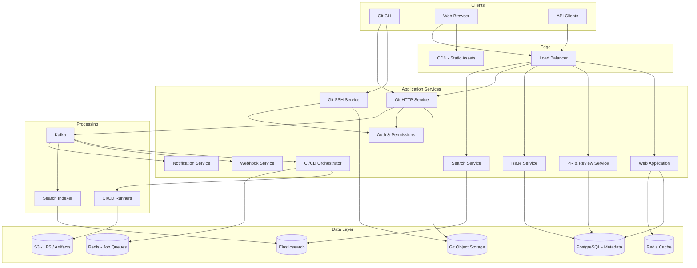
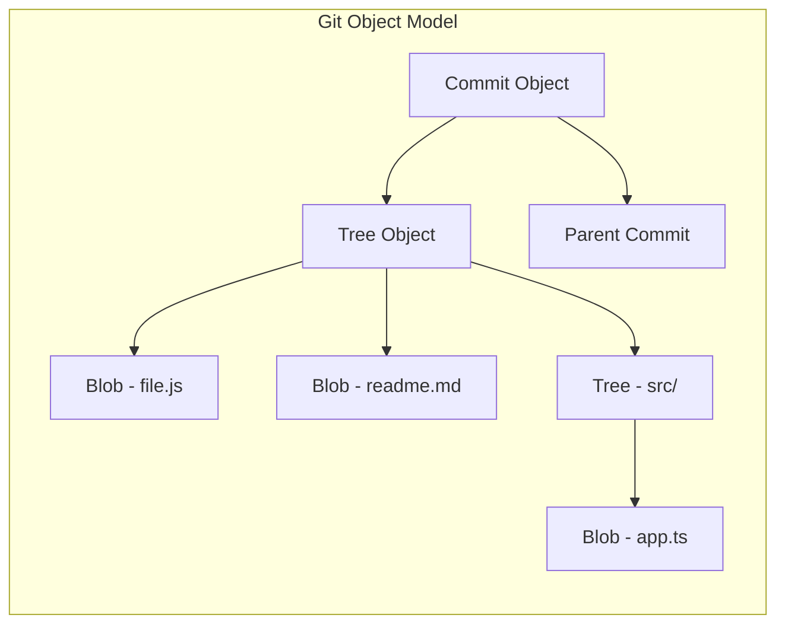
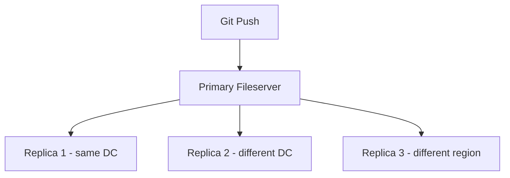
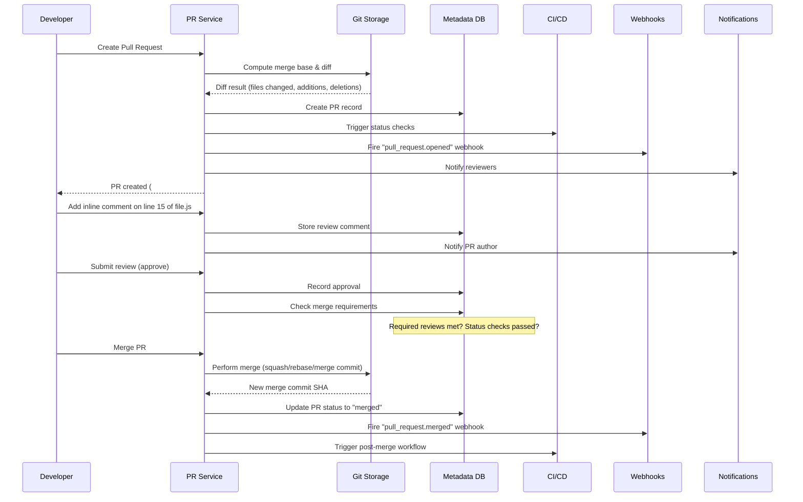
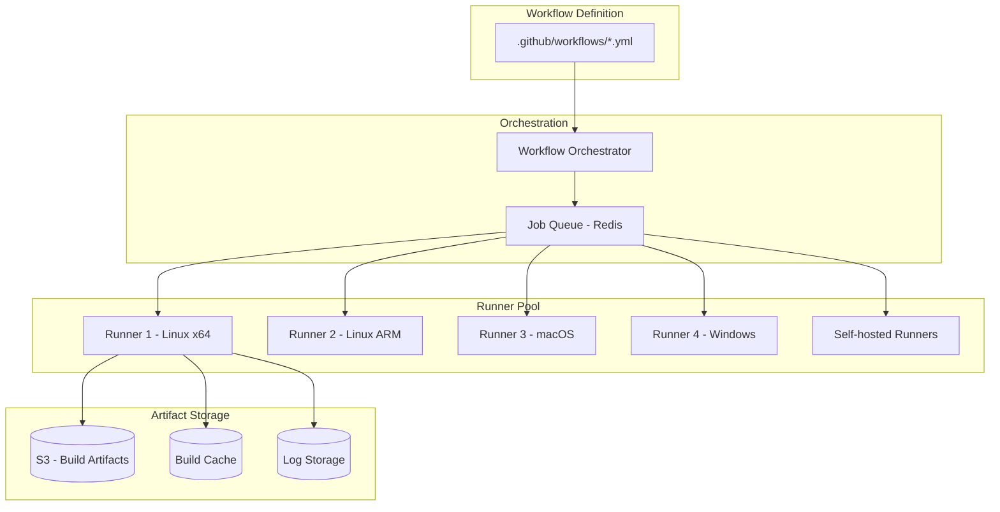
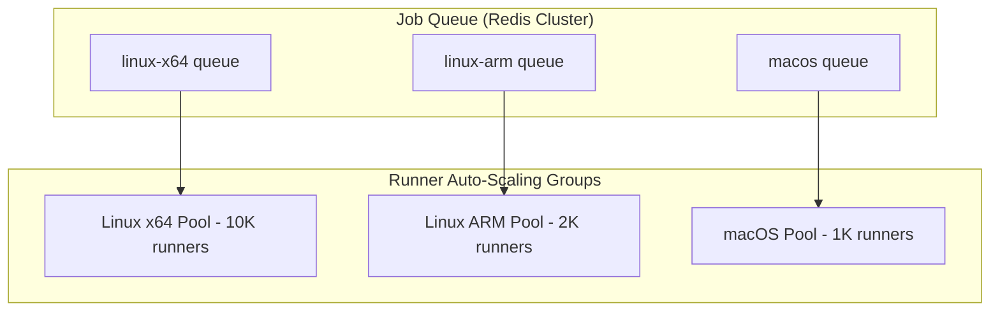

# Design GitHub

GitHub is the world's largest code hosting platform. Designing it covers Git object storage, repository management, pull requests and code review, issue tracking, CI/CD pipeline orchestration, webhooks, and collaboration at scale for 100M+ developers.

---

## 1. Requirements Clarification

### Functional Requirements

1. **Repository hosting** — Create, clone, push, pull Git repositories (public and private)
2. **Pull requests** — Open PRs, review code with inline comments, approve/request changes, merge
3. **Issues** — Create, assign, label, and close issues with markdown support
4. **CI/CD** — Define workflows (YAML), trigger builds on events, run jobs in containers
5. **Branch protection** — Required reviews, status checks, merge strategies (squash, rebase, merge)
6. **Code search** — Search across all repositories for code, files, and symbols
7. **Webhooks** — Notify external services on repository events (push, PR, issue)
8. **Organizations & permissions** — Teams, roles (read, write, admin), repository visibility
9. **Notifications** — Email and in-app notifications for subscribed events
10. **Code browsing** — View files, blame, history, diffs in the browser

### Non-Functional Requirements

1. **High availability** — 99.99% for Git operations (clone, push, pull)
2. **Low latency** — Clone/pull operations < 5s for average repos; page loads < 500ms
3. **Scale** — 100M users, 400M+ repositories, 4B+ commits, millions of pushes/day
4. **Durability** — Zero data loss for any committed code
5. **Consistency** — Strong consistency for push operations; eventual consistency acceptable for search indexes
6. **Global reach** — Low-latency access worldwide

### Clarifying Questions

::: tip Questions to Ask
- What is the average repository size?
- Do we need to support Git LFS (Large File Storage)?
- How many concurrent CI/CD jobs should we support?
- Should we support forking and cross-repository pull requests?
- Do we need wiki and project management features?
- What merge strategies should we support?
:::

---

## 2. Back-of-the-Envelope Estimation

### Traffic

- 100M monthly active users, 30M DAU
- 5M pushes/day, 20M clone/pull operations/day

$$
\text{Push QPS} = \frac{5M}{86400} \approx 58 \text{ QPS}
$$

$$
\text{Peak Push QPS} \approx 58 \times 5 = 290 \text{ QPS}
$$

$$
\text{Clone/Pull QPS} = \frac{20M}{86400} \approx 231 \text{ QPS}
$$

$$
\text{Peak Clone/Pull QPS} \approx 231 \times 3 = 693 \text{ QPS}
$$

$$
\text{API QPS (web, PRs, issues)} = \frac{30M \times 50}{86400} \approx 17{,}361 \text{ QPS}
$$

### Storage

**Git object storage:**
- 400M repositories, average size 50 MB (packed)

$$
\text{Total Git storage} = 400M \times 50 \text{ MB} = 20 \text{ PB}
$$

- Some repositories (monorepos) can be 10+ GB, but the median is small
- Daily new data: 5M pushes x 500 KB average delta = 2.5 TB/day

$$
\text{Annual growth} = 2.5 \text{ TB/day} \times 365 \approx 912 \text{ TB/year}
$$

**Metadata (issues, PRs, comments):**

$$
\text{Issues/PRs} = 2B \times 2 \text{ KB avg} = 4 \text{ TB}
$$

$$
\text{Comments} = 5B \times 500 \text{ B avg} = 2.5 \text{ TB}
$$

### Bandwidth

$$
\text{Clone egress} = 20M \times 50 \text{ MB} / 86400 \approx 11.6 \text{ GB/s} = 92.6 \text{ Gbps}
$$

---

## 3. High-Level Design



---

## 4. Detailed Design

### 4.1 Git Object Storage

Git stores data as four object types: **blobs** (file contents), **trees** (directories), **commits**, and **tags**. GitHub must store and serve these efficiently at massive scale.



**Storage architecture:**

```typescript
class GitStorageService {
  // GitHub uses a distributed filesystem for Git repos
  // Each repo is assigned to a storage shard (fileserver)

  async getRepoLocation(repoId: string): Promise<StorageNode> {
    // Consistent hashing to map repo -> fileserver
    const shardId = this.consistentHash.getNode(repoId);
    return this.storageDirectory.getNode(shardId);
  }

  async cloneRepo(repoId: string): Promise<PackFile> {
    const node = await this.getRepoLocation(repoId);

    // git-upload-pack: negotiate with client, send pack file
    // Pack files contain compressed Git objects
    return node.gitUploadPack(repoId, {
      thinPack: true,      // Only send objects client doesn't have
      compression: 'zlib',
      maxPackSize: '2GB',
    });
  }

  async receivePush(repoId: string, packFile: Buffer): Promise<PushResult> {
    const node = await this.getRepoLocation(repoId);

    // 1. Verify pack integrity
    await node.verifyPack(packFile);

    // 2. Check permissions and branch protections
    await this.authService.checkPushPermission(repoId);

    // 3. Index pack file into repo
    const refs = await node.gitReceivePack(repoId, packFile);

    // 4. Emit push event for CI/CD, webhooks, search indexing
    await this.kafka.send('repo-events', {
      key: repoId,
      value: {
        type: 'push',
        repoId,
        refs, // branch refs that were updated
        timestamp: Date.now(),
      },
    });

    return { status: 'ok', refs };
  }
}
```

**Repository replication for durability:**



- Every repository is replicated to 3 storage nodes
- Synchronous replication within the same datacenter
- Asynchronous replication to remote datacenters
- Checksums (SHA-1/SHA-256) guarantee integrity

### 4.2 Pull Request & Code Review System



```typescript
class PullRequestService {
  async createPR(params: CreatePRParams): Promise<PullRequest> {
    const { repoId, title, body, headBranch, baseBranch, authorId } = params;

    // 1. Compute diff stats
    const diff = await this.gitService.computeDiff(repoId, baseBranch, headBranch);

    // 2. Create PR record
    const pr = await this.db.query(`
      INSERT INTO pull_requests
        (repo_id, number, title, body, author_id, head_branch, base_branch,
         head_sha, base_sha, additions, deletions, changed_files, status)
      VALUES ($1, nextval('pr_number_seq_' || $1), $2, $3, $4, $5, $6,
              $7, $8, $9, $10, $11, 'open')
      RETURNING *
    `, [repoId, title, body, authorId, headBranch, baseBranch,
        diff.headSha, diff.baseSha, diff.additions, diff.deletions, diff.changedFiles]);

    // 3. Trigger CI checks
    await this.ciService.triggerChecks(repoId, pr.head_sha, 'pull_request');

    // 4. Emit events
    await this.kafka.send('repo-events', {
      key: repoId,
      value: { type: 'pull_request.opened', prId: pr.id, repoId },
    });

    return pr;
  }

  async mergePR(repoId: string, prNumber: number, strategy: MergeStrategy): Promise<MergeResult> {
    const pr = await this.getPR(repoId, prNumber);

    // 1. Verify merge requirements
    const checks = await this.verifyMergeRequirements(repoId, pr);
    if (!checks.canMerge) {
      throw new Error(`Cannot merge: ${checks.reasons.join(', ')}`);
    }

    // 2. Perform merge based on strategy
    let mergeResult: GitMergeResult;
    switch (strategy) {
      case 'merge':
        mergeResult = await this.gitService.merge(repoId, pr.head_branch, pr.base_branch);
        break;
      case 'squash':
        mergeResult = await this.gitService.squashMerge(repoId, pr.head_branch, pr.base_branch);
        break;
      case 'rebase':
        mergeResult = await this.gitService.rebaseMerge(repoId, pr.head_branch, pr.base_branch);
        break;
    }

    // 3. Update PR status
    await this.db.query(
      `UPDATE pull_requests SET status = 'merged', merged_at = NOW(),
       merge_commit_sha = $1 WHERE repo_id = $2 AND number = $3`,
      [mergeResult.commitSha, repoId, prNumber]
    );

    return mergeResult;
  }
}
```

### 4.3 CI/CD Pipeline Engine



```typescript
class CICDOrchestrator {
  async onPushEvent(event: PushEvent): Promise<void> {
    const { repoId, ref, headSha } = event;

    // 1. Find matching workflow files
    const workflows = await this.gitService.getWorkflowFiles(repoId, headSha);

    for (const workflow of workflows) {
      // 2. Check trigger conditions
      if (!this.matchesTrigger(workflow, event)) continue;

      // 3. Create workflow run
      const run = await this.db.query(`
        INSERT INTO workflow_runs (repo_id, workflow_id, trigger_event, head_sha, status)
        VALUES ($1, $2, $3, $4, 'queued') RETURNING *
      `, [repoId, workflow.id, 'push', headSha]);

      // 4. Parse job graph (respecting "needs" dependencies)
      const jobGraph = this.parseJobGraph(workflow);

      // 5. Enqueue jobs with no dependencies first
      for (const job of jobGraph.getRoots()) {
        await this.enqueueJob(run.id, job);
      }
    }
  }

  async enqueueJob(runId: string, job: WorkflowJob): Promise<void> {
    const jobRecord = await this.db.query(`
      INSERT INTO workflow_jobs (run_id, name, status, runner_label)
      VALUES ($1, $2, 'queued', $3) RETURNING *
    `, [runId, job.name, job.runsOn]);

    // Add to Redis queue for the appropriate runner type
    await this.redis.lpush(`job-queue:${job.runsOn}`, JSON.stringify({
      jobId: jobRecord.id,
      runId,
      steps: job.steps,
      env: job.env,
      services: job.services, // Docker services (e.g., postgres for tests)
    }));
  }

  async onJobCompleted(jobId: string, result: JobResult): Promise<void> {
    await this.db.query(
      `UPDATE workflow_jobs SET status = $1, conclusion = $2, completed_at = NOW()
       WHERE id = $3`,
      [result.status, result.conclusion, jobId]
    );

    // Check if dependent jobs can now start
    const run = await this.getRunForJob(jobId);
    const jobGraph = await this.getJobGraph(run.id);
    const readyJobs = jobGraph.getReadyJobs();

    for (const job of readyJobs) {
      await this.enqueueJob(run.id, job);
    }

    // Check if run is complete
    if (jobGraph.isComplete()) {
      const conclusion = jobGraph.getOverallConclusion();
      await this.db.query(
        `UPDATE workflow_runs SET status = 'completed', conclusion = $1 WHERE id = $2`,
        [conclusion, run.id]
      );
      // Post commit status
      await this.postCommitStatus(run.repo_id, run.head_sha, conclusion);
    }
  }
}
```

### 4.4 Webhook Delivery System

```typescript
class WebhookDeliveryService {
  async deliverWebhook(event: RepoEvent): Promise<void> {
    // 1. Find all webhook subscriptions for this repo and event type
    const hooks = await this.db.query(`
      SELECT * FROM webhooks
      WHERE repo_id = $1 AND $2 = ANY(events) AND active = true
    `, [event.repoId, event.type]);

    for (const hook of hooks) {
      // 2. Construct payload
      const payload = this.buildPayload(event, hook);
      const signature = this.signPayload(payload, hook.secret);

      // 3. Enqueue for delivery with retry
      await this.redis.lpush('webhook-delivery', JSON.stringify({
        hookId: hook.id,
        url: hook.url,
        payload,
        signature,
        attempt: 1,
        maxAttempts: 5,
      }));
    }
  }

  // Worker: deliver with exponential backoff
  async processDelivery(delivery: WebhookDelivery): Promise<void> {
    try {
      const response = await fetch(delivery.url, {
        method: 'POST',
        headers: {
          'Content-Type': 'application/json',
          'X-Hub-Signature-256': `sha256=${delivery.signature}`,
          'X-GitHub-Event': delivery.payload.event,
        },
        body: JSON.stringify(delivery.payload),
        signal: AbortSignal.timeout(30_000), // 30s timeout
      });

      await this.logDelivery(delivery, response.status, 'success');
    } catch (error) {
      if (delivery.attempt < delivery.maxAttempts) {
        // Exponential backoff: 1m, 5m, 30m, 3h
        const delay = Math.pow(5, delivery.attempt) * 60;
        await this.scheduleRetry(delivery, delay);
      } else {
        await this.logDelivery(delivery, 0, 'failed');
      }
    }
  }
}
```

---

## 5. Data Model

### PostgreSQL Schema (sharded by repo_id)

```sql
-- Repositories
CREATE TABLE repositories (
    id              BIGSERIAL PRIMARY KEY,
    owner_id        BIGINT NOT NULL,
    name            VARCHAR(255) NOT NULL,
    description     TEXT,
    visibility      VARCHAR(10) DEFAULT 'public', -- public, private, internal
    default_branch  VARCHAR(255) DEFAULT 'main',
    storage_node    VARCHAR(100) NOT NULL,         -- fileserver assignment
    disk_usage_kb   BIGINT DEFAULT 0,
    star_count      INT DEFAULT 0,
    fork_count      INT DEFAULT 0,
    is_fork         BOOLEAN DEFAULT FALSE,
    parent_repo_id  BIGINT,
    created_at      TIMESTAMP WITH TIME ZONE DEFAULT NOW(),
    updated_at      TIMESTAMP WITH TIME ZONE DEFAULT NOW(),
    UNIQUE(owner_id, name)
);

CREATE INDEX idx_repos_owner ON repositories(owner_id);
CREATE INDEX idx_repos_stars ON repositories(star_count DESC);

-- Pull Requests
CREATE TABLE pull_requests (
    id              BIGSERIAL PRIMARY KEY,
    repo_id         BIGINT NOT NULL,
    number          INT NOT NULL,
    title           VARCHAR(500) NOT NULL,
    body            TEXT,
    author_id       BIGINT NOT NULL,
    head_branch     VARCHAR(255) NOT NULL,
    base_branch     VARCHAR(255) NOT NULL,
    head_sha        CHAR(40),
    base_sha        CHAR(40),
    merge_commit_sha CHAR(40),
    status          VARCHAR(20) DEFAULT 'open',   -- open, closed, merged
    additions       INT DEFAULT 0,
    deletions       INT DEFAULT 0,
    changed_files   INT DEFAULT 0,
    merged_at       TIMESTAMP WITH TIME ZONE,
    closed_at       TIMESTAMP WITH TIME ZONE,
    created_at      TIMESTAMP WITH TIME ZONE DEFAULT NOW(),
    updated_at      TIMESTAMP WITH TIME ZONE DEFAULT NOW(),
    UNIQUE(repo_id, number)
);

CREATE INDEX idx_prs_repo_status ON pull_requests(repo_id, status, created_at DESC);
CREATE INDEX idx_prs_author ON pull_requests(author_id, created_at DESC);

-- Issues
CREATE TABLE issues (
    id              BIGSERIAL PRIMARY KEY,
    repo_id         BIGINT NOT NULL,
    number          INT NOT NULL,
    title           VARCHAR(500) NOT NULL,
    body            TEXT,
    author_id       BIGINT NOT NULL,
    assignee_id     BIGINT,
    status          VARCHAR(20) DEFAULT 'open',   -- open, closed
    created_at      TIMESTAMP WITH TIME ZONE DEFAULT NOW(),
    updated_at      TIMESTAMP WITH TIME ZONE DEFAULT NOW(),
    closed_at       TIMESTAMP WITH TIME ZONE,
    UNIQUE(repo_id, number)
);

CREATE INDEX idx_issues_repo_status ON issues(repo_id, status, created_at DESC);

-- Review Comments (inline on PR diffs)
CREATE TABLE review_comments (
    id              BIGSERIAL PRIMARY KEY,
    pr_id           BIGINT NOT NULL,
    author_id       BIGINT NOT NULL,
    path            VARCHAR(1000) NOT NULL,   -- file path in diff
    line            INT NOT NULL,
    side            VARCHAR(5),               -- LEFT or RIGHT
    body            TEXT NOT NULL,
    commit_sha      CHAR(40),
    created_at      TIMESTAMP WITH TIME ZONE DEFAULT NOW()
);

CREATE INDEX idx_review_comments_pr ON review_comments(pr_id, path);

-- CI/CD Workflow Runs
CREATE TABLE workflow_runs (
    id              BIGSERIAL PRIMARY KEY,
    repo_id         BIGINT NOT NULL,
    workflow_id     VARCHAR(255) NOT NULL,
    trigger_event   VARCHAR(50),
    head_sha        CHAR(40),
    status          VARCHAR(20) DEFAULT 'queued',
    conclusion      VARCHAR(20),              -- success, failure, cancelled
    started_at      TIMESTAMP WITH TIME ZONE,
    completed_at    TIMESTAMP WITH TIME ZONE,
    created_at      TIMESTAMP WITH TIME ZONE DEFAULT NOW()
);

CREATE INDEX idx_runs_repo ON workflow_runs(repo_id, created_at DESC);

-- Webhooks
CREATE TABLE webhooks (
    id              BIGSERIAL PRIMARY KEY,
    repo_id         BIGINT NOT NULL,
    url             VARCHAR(2000) NOT NULL,
    secret          VARCHAR(255),
    events          TEXT[] NOT NULL,           -- {'push', 'pull_request', 'issues'}
    active          BOOLEAN DEFAULT TRUE,
    created_at      TIMESTAMP WITH TIME ZONE DEFAULT NOW()
);

CREATE INDEX idx_webhooks_repo ON webhooks(repo_id) WHERE active = true;
```

---

## 6. API Design

```typescript
// Repository operations
// POST /api/v1/repos
interface CreateRepoRequest {
  name: string;
  description?: string;
  visibility: 'public' | 'private';
  autoInit: boolean;        // Initialize with README
  gitignoreTemplate?: string;
  licenseTemplate?: string;
}

// GET /api/v1/repos/:owner/:repo
// GET /api/v1/repos/:owner/:repo/contents/:path?ref=main
// GET /api/v1/repos/:owner/:repo/commits?sha=main&cursor=abc&limit=30

// Pull Request endpoints
// POST /api/v1/repos/:owner/:repo/pulls
interface CreatePullRequest {
  title: string;
  body?: string;
  head: string;     // branch name
  base: string;     // target branch
}

// GET /api/v1/repos/:owner/:repo/pulls?state=open&cursor=abc
// GET /api/v1/repos/:owner/:repo/pulls/:number
// GET /api/v1/repos/:owner/:repo/pulls/:number/files
// POST /api/v1/repos/:owner/:repo/pulls/:number/reviews
// PUT /api/v1/repos/:owner/:repo/pulls/:number/merge

interface MergePullRequest {
  mergeMethod: 'merge' | 'squash' | 'rebase';
  commitTitle?: string;
  commitMessage?: string;
}

// Issue endpoints
// POST /api/v1/repos/:owner/:repo/issues
// GET /api/v1/repos/:owner/:repo/issues?state=open&labels=bug&cursor=abc
// PATCH /api/v1/repos/:owner/:repo/issues/:number

// Search
// GET /api/v1/search/code?q=useState+language:typescript&cursor=abc
// GET /api/v1/search/repos?q=react+stars:>1000&sort=stars
// GET /api/v1/search/issues?q=bug+is:open+repo:facebook/react

// CI/CD
// GET /api/v1/repos/:owner/:repo/actions/runs
// GET /api/v1/repos/:owner/:repo/actions/runs/:id/jobs
// POST /api/v1/repos/:owner/:repo/actions/runs/:id/rerun

// Webhooks
// POST /api/v1/repos/:owner/:repo/hooks
interface CreateWebhook {
  url: string;
  secret?: string;
  events: string[];
  active: boolean;
}
```

---

## 7. Scaling

### Git Storage Scaling

| Scale | Challenge | Solution |
|-------|-----------|----------|
| 10M repos | Single fileserver capacity | Shard repos across fileservers via consistent hashing |
| 100M repos | Hot repos (linux kernel, large monorepos) | Dedicated high-IOPS nodes for hot repos |
| 400M+ repos | Cross-DC durability | 3-way replication with async cross-region sync |
| Monorepos (10+ GB) | Clone latency | Partial clone, shallow clone, sparse checkout support |

### Database Scaling

```
Repositories table:     Shard by owner_id (co-locate user's repos)
Pull Requests table:    Shard by repo_id (co-locate PR data per repo)
Issues table:           Shard by repo_id
Workflow Runs table:    Shard by repo_id, partition by created_at

Read replicas: 4 per shard for read-heavy operations (browsing, API)
```

### CI/CD Scaling



- Scale runners based on queue depth (Kubernetes HPA or EC2 auto-scaling)
- Ephemeral runners: spin up a fresh container per job, destroy after
- Caching: action caches and dependency caches stored in S3, keyed by hash
- Concurrent job limits per plan (free: 20, team: 40, enterprise: 500)

### Search Scaling

- Elasticsearch cluster: shard code index by repository
- Trigram index for code search (allows substring matching)
- Incremental re-indexing on push events via Kafka consumers
- Separate clusters for code search, repo search, and issue search

---

## 8. Trade-offs & Alternatives

### Git Storage: Filesystem vs Object Store

| Aspect | Distributed Filesystem (GitHub's approach) | Object Store (S3) |
|--------|-------------------------------------------|-------------------|
| Git compatibility | Native — bare repos on disk | Requires custom Git backend |
| Performance | Low-latency random reads | Higher latency per object |
| Cost | Expensive (SSD servers) | Cheaper per GB |
| Operations | Complex replication management | Managed by provider |
| **Verdict** | Better for Git-native operations | Better for archival/cold repos |

### Merge Strategy Comparison

| Strategy | History | Bisectability | Complexity |
|----------|---------|---------------|------------|
| Merge commit | Preserves full branch history | Good | Low |
| Squash merge | Single clean commit on base | Best | Medium |
| Rebase merge | Linear history, multiple commits | Good | High (conflict resolution) |

### CI/CD: Containers vs VMs

| Aspect | Containers (Docker) | VMs (Firecracker) |
|--------|--------------------|--------------------|
| Startup time | ~1 second | ~3-5 seconds |
| Isolation | Process-level (weaker) | Hardware-level (stronger) |
| Resource overhead | Low | Medium |
| Security | Risk of container escape | Strong isolation |
| **GitHub's choice** | Used for basic runners | Used for hosted runners (security) |

::: warning Security Consideration
CI/CD runners execute arbitrary user code. Strong isolation (microVMs like Firecracker) is essential for multi-tenant hosted runners. Self-hosted runners can use containers because the trust boundary is different.
:::

---

## 9. Common Interview Questions

::: details "How do you handle a push to a repository with 1000 open pull requests?"
Every push to a branch that is the head of an open PR triggers a PR update. Fan-out the push event through Kafka to update PR diff stats and re-trigger CI checks. Use a batch processor that groups PR updates for the same repo. Branch protection checks are evaluated lazily when the merge button is clicked, not on every push.
:::

::: details "How do you implement code search across 400M repositories?"
Use a trigram index in Elasticsearch. On every push, extract changed files and update the search index incrementally. Partition the index by repository for even distribution. For cross-repository search, scatter queries across all shards and merge results. Apply relevance scoring based on stars, recency, and language match. GitHub built a custom search engine (Blackbird) using a Rust-based trigram index for this purpose.
:::

::: details "How do you ensure Git data is never lost?"
Three-way replication across storage nodes with at least one replica in a different datacenter. A push is acknowledged only after the primary and at least one in-DC replica confirm the write. Use Git's built-in SHA integrity checks — every object is content-addressed, so corruption is detectable. Run periodic fsck (consistency checks) on all repos. Back up to cold storage (S3 Glacier) for disaster recovery.
:::

::: details "How do you handle a monorepo with 100GB of history?"
Support Git partial clone (blobless clone), shallow clone (limited history depth), and sparse checkout (only specific directories). Serve pack files from cache for popular repos. Use Git's reachability bitmaps to accelerate clone negotiation. For extreme cases (e.g., the Windows repo), use VFS for Git which virtualizes the working directory.
:::

::: details "How do you prevent CI/CD abuse (crypto mining on free runners)?"
Rate limit free-tier users to N concurrent jobs and M total minutes per month. Use anomaly detection on CPU usage patterns — crypto mining has a distinctive 100% CPU profile. Require account verification (email, CAPTCHA) before enabling CI. Implement a trust score system based on account age, activity, and past behavior.
:::

### Time Allocation (45-minute interview)

| Phase | Time | Focus |
|-------|------|-------|
| Requirements | 4 min | Scope: Git ops, PRs, CI/CD, webhooks |
| Estimation | 3 min | 400M repos, push QPS, storage |
| High-level design | 10 min | Git storage, app services, event bus |
| Git storage deep-dive | 8 min | Object model, replication, pack files |
| PR & code review | 7 min | Diff computation, review workflow, merge |
| CI/CD pipeline | 8 min | Workflow parsing, job scheduling, runners |
| Scaling | 5 min | Storage sharding, runner scaling, search |

---

## Summary

| Component | Technology | Scale |
|-----------|-----------|-------|
| Git Storage | Distributed filesystem (3x replicated) | 20 PB across 400M repos |
| Metadata | PostgreSQL (sharded by repo) | Billions of PRs/issues |
| Code Search | Custom trigram index / Elasticsearch | 400M+ repos indexed |
| CI/CD | Kafka + Redis queues + Firecracker VMs | 10K+ concurrent runners |
| Webhooks | Kafka + Redis + retry workers | Millions of deliveries/day |
| Cache | Redis Cluster | API responses, permissions |
| Artifacts | S3 | Build artifacts, LFS objects |
