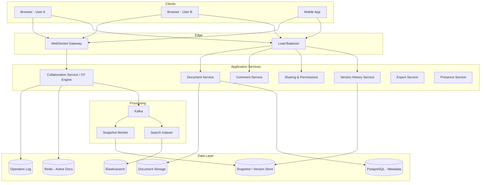
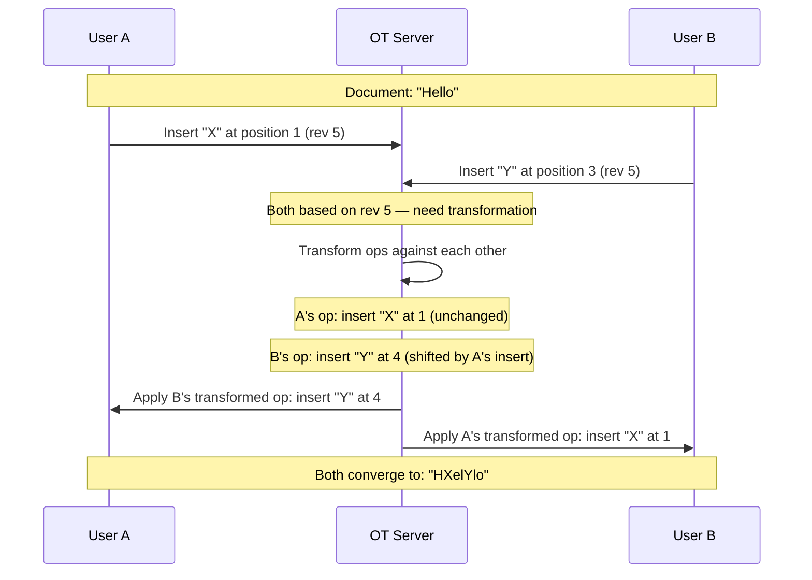
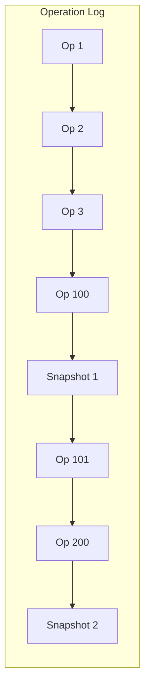
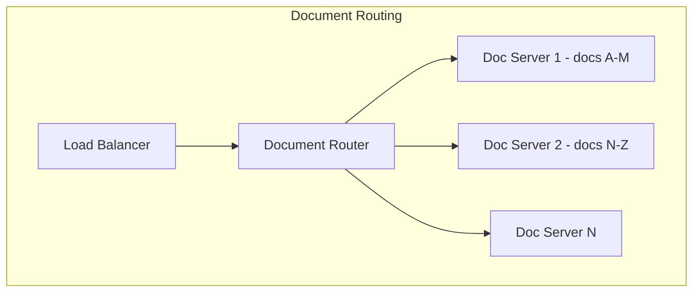

# Design Google Docs

Google Docs is a real-time collaborative document editor. Designing it covers the core challenge of concurrent editing by multiple users, conflict resolution using Operational Transformation (OT) or CRDTs, real-time synchronization via WebSockets, document versioning and history, commenting, suggestions mode, and offline editing with sync.

---

## 1. Requirements Clarification

### Functional Requirements

1. **Document editing** — Rich text editing (bold, italic, headings, lists, tables, images)
2. **Real-time collaboration** — Multiple users edit the same document simultaneously
3. **Conflict resolution** — Concurrent edits are merged without data loss
4. **Cursors & presence** — See other editors' cursor positions and selections
5. **Version history** — View and restore previous versions
6. **Comments & suggestions** — Inline comments and "suggesting" mode
7. **Sharing & permissions** — Share with viewer, commenter, editor roles
8. **Offline editing** — Edit without internet, sync when reconnected
9. **Auto-save** — Changes saved automatically, no explicit save
10. **Export** — Export to PDF, DOCX, ODT

### Non-Functional Requirements

1. **Real-time** — Edits appear on other users' screens within 200ms
2. **Consistency** — All users converge to the same document state
3. **High availability** — 99.99% uptime for editing
4. **Scale** — 3B documents, 50M DAU, up to 100 concurrent editors per document
5. **Durability** — Zero data loss, comprehensive revision history
6. **Offline support** — Full editing capability offline, seamless sync on reconnect
7. **Low bandwidth** — Send minimal data for each edit (operations, not full document)

### Clarifying Questions

::: tip Questions to Ask
- What is the maximum document size?
- How many concurrent editors per document do we need to support?
- How long should version history be retained?
- Do we need to support spreadsheets and presentations (Google Sheets, Slides)?
- Should we support real-time commenting?
- What export formats are required?
:::

---

## 2. Back-of-the-Envelope Estimation

### Traffic

- 50M DAU, average user edits 3 documents/day
- Average editing session: 20 minutes, ~5 operations per second (keystrokes, formatting)
- Average document has 1.5 concurrent editors

$$
\text{Active editing sessions} = \frac{50M \times 3 \times 20}{1440} \approx 2.08M \text{ concurrent sessions}
$$

$$
\text{Operations QPS} = 2.08M \times 5 = 10.4M \text{ ops/sec}
$$

$$
\text{WebSocket connections} = 2.08M \text{ concurrent}
$$

### Storage

**Documents:**

$$
\text{Avg document size} = 50 \text{ KB (text + formatting metadata)}
$$

$$
\text{Total document storage} = 3B \times 50 \text{ KB} = 150 \text{ TB}
$$

**Operation log (for version history):**
- Each operation: ~100 bytes
- Average document lifetime: 500K operations

$$
\text{Operation log} = 3B \times 500K \times 100 \text{ B} = 150 \text{ PB}
$$

::: warning
150 PB for the full operation log is enormous. In practice, operations are periodically compacted into snapshots. Only the last N versions and the operations since the last snapshot are kept.
:::

**With compaction (snapshots every 100 operations):**

$$
\text{Snapshots} = 3B \times 5{,}000 \text{ versions} \times 50 \text{ KB} = 750 \text{ TB}
$$

$$
\text{Recent ops} = 3B \times 100 \times 100 \text{ B} = 30 \text{ TB}
$$

### Bandwidth

$$
\text{Op broadcast bandwidth} = 10.4M \text{ ops/sec} \times 100 \text{ B} \times 1.5 \text{ (avg recipients)} = 1.56 \text{ GB/s}
$$

---

## 3. High-Level Design



---

## 4. Detailed Design

### 4.1 Operational Transformation (OT)

OT is Google Docs' approach to conflict resolution. Every edit is represented as an **operation**, and when concurrent operations arrive, they are **transformed** against each other to preserve intent.

**Operation types:**

```typescript
type Operation =
  | { type: 'insert'; position: number; text: string }
  | { type: 'delete'; position: number; count: number }
  | { type: 'retain'; count: number }  // skip N characters
  | { type: 'format'; position: number; length: number; attributes: Record<string, any> };
```

**Transformation example:**



```typescript
class OTEngine {
  // Transform operation B against operation A
  // Returns B' such that applying A then B' gives the same result as B then A'
  transform(opA: Operation, opB: Operation): [Operation, Operation] {
    if (opA.type === 'insert' && opB.type === 'insert') {
      if (opA.position <= opB.position) {
        // A inserts before or at B's position — shift B right
        return [
          opA,
          { ...opB, position: opB.position + opA.text.length },
        ];
      } else {
        // B inserts before A — shift A right
        return [
          { ...opA, position: opA.position + opB.text.length },
          opB,
        ];
      }
    }

    if (opA.type === 'insert' && opB.type === 'delete') {
      if (opA.position <= opB.position) {
        // Insert before delete — shift delete right
        return [
          opA,
          { ...opB, position: opB.position + opA.text.length },
        ];
      } else if (opA.position >= opB.position + opB.count) {
        // Insert after delete range — shift insert left
        return [
          { ...opA, position: opA.position - opB.count },
          opB,
        ];
      } else {
        // Insert inside delete range — split the delete
        return [
          opA,
          { ...opB, count: opB.count + opA.text.length }, // delete still removes same content
        ];
      }
    }

    if (opA.type === 'delete' && opB.type === 'delete') {
      // Both deleting — handle overlap
      return this.transformDeleteDelete(opA, opB);
    }

    // Handle other combinations (format + insert, etc.)
    return [opA, opB];
  }

  private transformDeleteDelete(a: Operation, b: Operation): [Operation, Operation] {
    // Complex case: overlapping deletes
    const aEnd = a.position + a.count;
    const bEnd = b.position + b.count;

    if (aEnd <= b.position) {
      // A entirely before B
      return [a, { ...b, position: b.position - a.count }];
    }
    if (bEnd <= a.position) {
      // B entirely before A
      return [{ ...a, position: a.position - b.count }, b];
    }
    // Overlapping — reduce counts to avoid double-deletion
    const overlapStart = Math.max(a.position, b.position);
    const overlapEnd = Math.min(aEnd, bEnd);
    const overlapCount = overlapEnd - overlapStart;

    return [
      { ...a, count: a.count - overlapCount, position: Math.min(a.position, b.position) },
      { ...b, count: b.count - overlapCount, position: Math.min(a.position, b.position) },
    ];
  }
}
```

### 4.2 Server-Side Collaboration Service

```typescript
class CollaborationService {
  // Each active document has an in-memory state on a "document server"
  private activeDocs: Map<string, ActiveDocument> = new Map();

  async handleOperation(docId: string, clientOp: ClientOperation): Promise<ServerAck> {
    let doc = this.activeDocs.get(docId);
    if (!doc) {
      doc = await this.loadDocument(docId);
      this.activeDocs.set(docId, doc);
    }

    const { operation, clientRevision, clientId } = clientOp;

    // 1. Transform the client's operation against all operations
    //    that have been applied since the client's revision
    let transformedOp = operation;
    const serverOps = doc.opLog.slice(clientRevision);

    for (const serverOp of serverOps) {
      [, transformedOp] = this.otEngine.transform(serverOp.operation, transformedOp);
    }

    // 2. Apply the transformed operation to the server document
    doc.content = this.applyOperation(doc.content, transformedOp);
    const newRevision = doc.opLog.length;
    doc.opLog.push({
      operation: transformedOp,
      clientId,
      revision: newRevision,
      timestamp: Date.now(),
    });

    // 3. Persist the operation
    await this.opLogStore.append(docId, {
      operation: transformedOp,
      revision: newRevision,
      clientId,
      timestamp: Date.now(),
    });

    // 4. Broadcast to other connected clients
    this.broadcastToDocument(docId, clientId, {
      type: 'operation',
      operation: transformedOp,
      revision: newRevision,
      authorId: clientId,
    });

    // 5. Trigger periodic snapshotting
    if (newRevision % 100 === 0) {
      await this.createSnapshot(docId, doc.content, newRevision);
    }

    // 6. ACK the client
    return { revision: newRevision, transformedOp };
  }

  private broadcastToDocument(docId: string, excludeClientId: string, message: any): void {
    const doc = this.activeDocs.get(docId);
    if (!doc) return;

    for (const [clientId, ws] of doc.connections) {
      if (clientId !== excludeClientId) {
        ws.send(JSON.stringify(message));
      }
    }
  }
}
```

### 4.3 OT vs CRDT Comparison

::: tip OT vs CRDT — The Key Trade-off
**OT (Operational Transformation)** — Used by Google Docs. Requires a central server to order operations. Simpler to implement for rich text. Well-understood and battle-tested.

**CRDT (Conflict-free Replicated Data Type)** — Used by Figma, Apple Notes. Decentralized — no central server needed. Better for offline and P2P. More complex data structures.
:::

| Aspect | OT (Google Docs) | CRDT (e.g., Yjs, Automerge) |
|--------|-----------------|---------------------------|
| Central server | Required | Not required |
| Offline editing | Complex (queue ops, transform on reconnect) | Natural (merge on reconnect) |
| Rich text support | Mature | Improving (Yjs, Peritext) |
| Memory overhead | Low (ops are small) | Higher (metadata per character) |
| Correctness | Proven (with careful implementation) | Proven (mathematically) |
| Latency | Low (server-mediated) | Very low (local-first) |
| **Production use** | Google Docs, Etherpad | Figma, Apple Notes, Linear |

### 4.4 Cursor & Presence Synchronization

```typescript
class PresenceService {
  async updateCursor(docId: string, userId: string, cursor: CursorPosition): Promise<void> {
    // Store cursor position and broadcast to other editors
    const presence: UserPresence = {
      userId,
      name: await this.getUserName(userId),
      color: this.assignColor(userId, docId),
      cursor: {
        position: cursor.position,
        selectionStart: cursor.selectionStart,
        selectionEnd: cursor.selectionEnd,
      },
      lastActive: Date.now(),
    };

    // Store in Redis for the document's presence set
    await this.redis.hset(`presence:${docId}`, userId, JSON.stringify(presence));
    await this.redis.expire(`presence:${docId}`, 300);

    // Broadcast to other editors (throttled — max 10 updates/sec per user)
    this.broadcastToDocument(docId, userId, {
      type: 'cursor_update',
      presence,
    });
  }

  async getDocumentPresence(docId: string): Promise<UserPresence[]> {
    const presenceMap = await this.redis.hgetall(`presence:${docId}`);
    const now = Date.now();

    return Object.values(presenceMap)
      .map(p => JSON.parse(p))
      .filter(p => now - p.lastActive < 60_000); // Active in last 60s
  }
}
```

### 4.5 Version History & Snapshots



```typescript
class VersionHistoryService {
  async getVersionHistory(docId: string, limit: number = 50): Promise<Version[]> {
    // Fetch snapshots (major versions) and significant operations between them
    const snapshots = await this.versionStore.query(`
      SELECT id, revision, content_hash, created_by, created_at
      FROM document_snapshots
      WHERE document_id = $1
      ORDER BY revision DESC
      LIMIT $2
    `, [docId, limit]);

    return snapshots.map(snap => ({
      id: snap.id,
      revision: snap.revision,
      editors: snap.editors,
      createdAt: snap.created_at,
    }));
  }

  async restoreVersion(docId: string, targetRevision: number): Promise<void> {
    // 1. Load the snapshot at or before targetRevision
    const snapshot = await this.getSnapshotAtRevision(docId, targetRevision);

    // 2. Replay operations from snapshot to targetRevision
    const ops = await this.opLogStore.getRange(docId, snapshot.revision, targetRevision);
    let content = snapshot.content;
    for (const op of ops) {
      content = this.applyOperation(content, op.operation);
    }

    // 3. Create a new operation that transforms current doc to restored state
    const currentDoc = await this.getDocument(docId);
    const restoreOp = this.computeDiff(currentDoc.content, content);

    // 4. Apply as a new operation (preserves forward history)
    await this.collaborationService.handleOperation(docId, {
      operation: restoreOp,
      clientRevision: currentDoc.revision,
      clientId: 'system:restore',
    });
  }

  async createSnapshot(docId: string, content: DocumentContent, revision: number): Promise<void> {
    // Snapshots are created every 100 operations
    await this.versionStore.query(`
      INSERT INTO document_snapshots (document_id, revision, content, content_hash, created_at)
      VALUES ($1, $2, $3, $4, NOW())
    `, [docId, revision, JSON.stringify(content), this.hash(content)]);

    // Compact old operation log entries (keep last 1000 ops, archive older ones)
    if (revision > 1000) {
      await this.archiveOps(docId, revision - 1000);
    }
  }
}
```

### 4.6 Offline Editing & Sync

```typescript
class OfflineSyncService {
  // Client-side: queue operations while offline

  async syncOnReconnect(docId: string, pendingOps: Operation[], lastKnownRevision: number): Promise<SyncResult> {
    // 1. Fetch all server operations since client's last known revision
    const serverOps = await this.opLogStore.getRange(docId, lastKnownRevision, Infinity);

    // 2. Transform client's pending ops against server ops
    let transformedClientOps = [...pendingOps];
    for (const serverOp of serverOps) {
      transformedClientOps = transformedClientOps.map(clientOp => {
        const [, transformed] = this.otEngine.transform(serverOp.operation, clientOp);
        return transformed;
      });
    }

    // 3. Apply transformed client ops to server
    for (const op of transformedClientOps) {
      await this.collaborationService.handleOperation(docId, {
        operation: op,
        clientRevision: lastKnownRevision + serverOps.length,
        clientId: 'offline-sync',
      });
    }

    // 4. Return the current document state
    const currentDoc = await this.getDocument(docId);
    return {
      document: currentDoc.content,
      revision: currentDoc.revision,
      transformedOps: transformedClientOps,
    };
  }
}
```

---

## 5. Data Model

```sql
-- Documents
CREATE TABLE documents (
    id              UUID PRIMARY KEY DEFAULT gen_random_uuid(),
    owner_id        BIGINT NOT NULL,
    title           VARCHAR(500),
    current_revision BIGINT DEFAULT 0,
    content_size    BIGINT DEFAULT 0,         -- bytes
    word_count      INT DEFAULT 0,
    is_trashed      BOOLEAN DEFAULT FALSE,
    created_at      TIMESTAMP WITH TIME ZONE DEFAULT NOW(),
    updated_at      TIMESTAMP WITH TIME ZONE DEFAULT NOW()
);

CREATE INDEX idx_docs_owner ON documents(owner_id, updated_at DESC);

-- Document Permissions
CREATE TABLE document_permissions (
    document_id     UUID NOT NULL,
    user_id         BIGINT,                   -- NULL for link sharing
    email           VARCHAR(255),             -- for pending invites
    role            VARCHAR(20) NOT NULL,     -- owner, editor, commenter, viewer
    link_share_role VARCHAR(20),              -- for "anyone with link" access
    created_at      TIMESTAMP WITH TIME ZONE DEFAULT NOW(),
    PRIMARY KEY (document_id, COALESCE(user_id, 0))
);

-- Operation Log (append-only, partitioned by document)
CREATE TABLE operation_log (
    document_id     UUID NOT NULL,
    revision        BIGINT NOT NULL,
    operation       JSONB NOT NULL,
    client_id       VARCHAR(100),
    user_id         BIGINT,
    created_at      TIMESTAMP WITH TIME ZONE DEFAULT NOW(),
    PRIMARY KEY (document_id, revision)
) PARTITION BY HASH (document_id);

-- Document Snapshots
CREATE TABLE document_snapshots (
    id              BIGSERIAL PRIMARY KEY,
    document_id     UUID NOT NULL,
    revision        BIGINT NOT NULL,
    content         JSONB NOT NULL,           -- full document state
    content_hash    CHAR(64),
    created_at      TIMESTAMP WITH TIME ZONE DEFAULT NOW()
);

CREATE INDEX idx_snapshots_doc ON document_snapshots(document_id, revision DESC);

-- Comments
CREATE TABLE document_comments (
    id              UUID PRIMARY KEY DEFAULT gen_random_uuid(),
    document_id     UUID NOT NULL,
    author_id       BIGINT NOT NULL,
    anchor_start    INT,                      -- position in document
    anchor_end      INT,
    quoted_text     TEXT,                     -- snapshot of selected text
    text            TEXT NOT NULL,
    parent_id       UUID,                     -- for threaded replies
    is_resolved     BOOLEAN DEFAULT FALSE,
    created_at      TIMESTAMP WITH TIME ZONE DEFAULT NOW()
);

CREATE INDEX idx_comments_doc ON document_comments(document_id, created_at);
```

---

## 6. API Design

```typescript
// Document management
// POST /api/v1/documents
interface CreateDocumentRequest {
  title?: string;
  templateId?: string;
}

// GET /api/v1/documents/:id
interface DocumentResponse {
  id: string;
  title: string;
  content: DocumentContent;   // Rich text structure
  revision: number;
  permissions: Permission[];
  lastModified: string;
  wordCount: number;
}

// GET /api/v1/documents?folderId=xyz&cursor=abc
// DELETE /api/v1/documents/:id (move to trash)

// Sharing
// POST /api/v1/documents/:id/permissions
interface ShareRequest {
  email: string;
  role: 'editor' | 'commenter' | 'viewer';
  message?: string;
}

// PUT /api/v1/documents/:id/link-sharing
interface LinkSharingRequest {
  enabled: boolean;
  role: 'editor' | 'commenter' | 'viewer';
}

// Version history
// GET /api/v1/documents/:id/versions?cursor=abc
// GET /api/v1/documents/:id/versions/:revision
// POST /api/v1/documents/:id/versions/:revision/restore

// Comments
// GET /api/v1/documents/:id/comments
// POST /api/v1/documents/:id/comments
interface CreateCommentRequest {
  anchorStart: number;
  anchorEnd: number;
  quotedText: string;
  text: string;
  parentId?: string;  // for replies
}

// POST /api/v1/documents/:id/comments/:commentId/resolve

// WebSocket protocol for real-time editing
type WSMessage =
  | { type: 'operation'; operation: Operation; revision: number }
  | { type: 'ack'; revision: number }
  | { type: 'cursor_update'; userId: string; position: CursorPosition }
  | { type: 'presence'; users: UserPresence[] }
  | { type: 'comment_added'; comment: Comment };

// Export
// GET /api/v1/documents/:id/export?format=pdf|docx|odt|html
```

---

## 7. Scaling

### Document Server Scaling

Each actively-edited document needs a single "document server" to serialize operations (OT requires a total ordering).



| Challenge | Solution |
|-----------|----------|
| Document-to-server affinity | Consistent hashing maps document IDs to servers |
| Server failure | Re-assign document to new server; replay op log from last snapshot |
| Hot documents (100 editors) | Single server handles up to 100 concurrent editors per doc |
| Cold documents (not being edited) | Evict from memory after 5 min idle; reload on next edit |

### WebSocket Connection Scaling

$$
\text{Concurrent connections} = 2.08M
$$

- Each WebSocket gateway handles ~50K connections
- Need ~42 gateway servers
- Gateway routes operations to the correct document server

### Operation Log Scaling

```
Partition by document_id (hash-based)
  - Each partition handles a subset of documents
  - Append-only writes are fast

Compaction strategy:
  - Every 100 operations: create snapshot, archive old ops
  - Keep last 1000 operations in hot storage
  - Archive older operations to cold storage (S3)
  - Restore from snapshot + recent ops on document open
```

### Storage Tiering

| Data | Hot Storage | Cold Storage |
|------|-----------|-------------|
| Active documents (edited in last 24h) | In-memory + SSD | — |
| Recent documents (last 30 days) | SSD PostgreSQL | — |
| Old documents | — | S3 + metadata in PostgreSQL |
| Old operation logs | — | S3 (compressed, archived) |

---

## 8. Trade-offs & Alternatives

### OT vs CRDT for Collaborative Editing

| Criterion | OT | CRDT |
|-----------|-----|------|
| Server requirement | Centralized (serialization point) | Decentralized |
| Complexity | Transform functions are tricky to get right | Data structure is complex |
| Performance | Low overhead per operation | Higher metadata overhead |
| Offline support | Requires transform on reconnect | Natural merge |
| Maturity for rich text | Very mature (Google Docs) | Growing (Yjs, Peritext) |
| **Best for** | Server-mediated collaboration | P2P and offline-first apps |

**Decision:** OT for a Google Docs clone. The centralized server model fits the architecture, and OT is proven at Google's scale.

### Document Storage: Single Blob vs Structured

| Approach | Edit Granularity | Storage Efficiency | Version History |
|----------|-----------------|-------------------|-----------------|
| Full document blob | Replace entire doc | Wastes space per version | Diff between blobs |
| **Operation log + snapshots** | Per-character operations | Efficient (small ops) | Natural (replay ops) |
| Block-based (Notion-style) | Per-block operations | Good for structured docs | Per-block history |

### WebSocket vs SSE vs Long Polling

| Protocol | Latency | Bidirectional | Reconnection | Browser Support |
|----------|---------|---------------|--------------|-----------------|
| **WebSocket** | Lowest | Yes | Must implement | Universal |
| SSE | Low | No (server -> client only) | Auto-reconnect | Universal |
| Long Polling | Higher | Simulated | Automatic | Universal |

**Decision:** WebSocket for bidirectional real-time editing. Operations flow both ways (client sends edits, server broadcasts others' edits). SSE would require a separate channel for client-to-server operations.

::: warning Consistency vs Availability
OT requires a total ordering of operations via a central server. If the server is down, editing pauses. This is a conscious trade-off: we sacrifice availability during server failures for strong consistency (all users see the same document state). CRDTs would allow editing to continue offline but with more complex merge semantics.
:::

---

## 9. Common Interview Questions

::: details "How do you handle 100 users editing the same document simultaneously?"
Each document has a single document server that serializes all operations using OT. The server processes operations sequentially, transforming each incoming operation against all operations that have been applied since the client's last known revision. For 100 concurrent editors at ~5 ops/sec each, the server processes ~500 ops/sec per document — well within a single server's capacity. Cursor updates are throttled and sent via a separate lightweight channel to avoid overwhelming the OT pipeline.
:::

::: details "What happens if the document server crashes?"
The server's state is recoverable from the operation log. On crash: (1) A new server is assigned to the document via consistent hashing failover. (2) Load the latest snapshot from the snapshot store. (3) Replay all operations since that snapshot from the operation log. (4) The document is now in the correct state. (5) Connected clients detect the WebSocket disconnect, reconnect, and sync from their last known revision. The recovery takes ~1-2 seconds.
:::

::: details "How does offline editing work?"
The client maintains a local copy of the document and a queue of pending operations. While offline, edits are applied locally and queued. On reconnect: (1) Client sends its last known revision to the server. (2) Server responds with all operations since that revision. (3) Client transforms its pending operations against the server operations. (4) Client applies server operations locally and sends its transformed pending operations. This is essentially the OT algorithm with a larger "gap" between client and server revisions.
:::

::: details "How do you implement 'Suggesting' mode?"
Suggestions are stored as special operations that don't directly modify the document. Instead, they create "suggestion markers" — annotations on ranges of text showing proposed insertions/deletions. When the document owner accepts a suggestion, the corresponding real operation is applied. When rejected, the suggestion markers are removed. Suggestions are stored alongside the operation log with a `suggestion` flag and the suggested operation payload.
:::

::: details "How do you handle comments when the text they reference moves?"
Comments are anchored to a text range using both position indices and a snapshot of the quoted text. As operations are applied, the comment's anchor positions are transformed using the same OT transform functions. If the anchored text is deleted, the comment becomes "orphaned" and is displayed separately. The `quoted_text` field serves as a fallback to show what the comment was originally referencing.
:::

### Time Allocation (45-minute interview)

| Phase | Time | Focus |
|-------|------|-------|
| Requirements | 4 min | Real-time editing, collaboration, versioning |
| Estimation | 3 min | 50M DAU, 10.4M ops/sec, storage |
| High-level design | 8 min | Document servers, WebSocket gateways, OT engine |
| OT deep-dive | 12 min | Transform functions, conflict resolution, examples |
| Version history | 5 min | Snapshots, operation log compaction |
| Offline sync | 5 min | Queued operations, reconnect transform |
| Scaling & trade-offs | 8 min | Document affinity, OT vs CRDT |

---

## Summary

| Component | Technology | Scale |
|-----------|-----------|-------|
| Real-Time Sync | WebSocket + OT Engine | 10.4M ops/sec |
| Document Servers | Stateful servers (consistent hashing) | 2M concurrent sessions |
| Operation Log | PostgreSQL (partitioned, append-only) | ~150 PB (with compaction: ~30 TB hot) |
| Snapshots | PostgreSQL + S3 (cold) | Every 100 operations per document |
| Document Storage | PostgreSQL + S3 | 3B documents, 150 TB |
| Presence | Redis + WebSocket broadcast | Real-time cursor positions |
| Permissions | PostgreSQL + Redis cache | Per-document ACL |
| Search | Elasticsearch | Full-text across 3B documents |
| Comments | PostgreSQL | Position-anchored threads |
