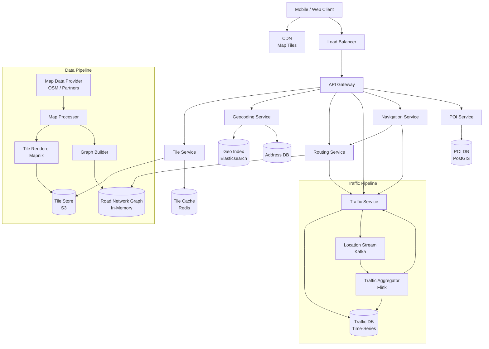
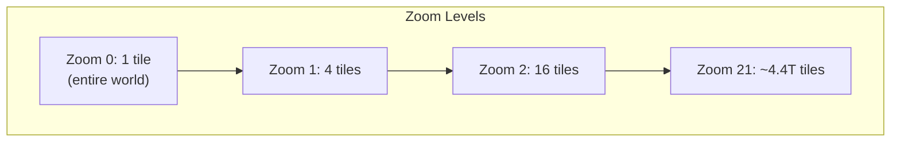
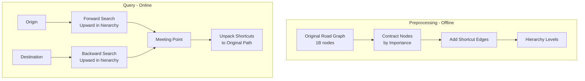
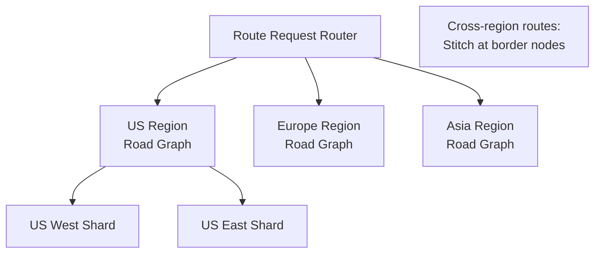

# Design Google Maps

## 1. Problem Statement & Requirements

Design a mapping and navigation system like Google Maps that renders interactive maps, computes driving/walking routes, provides real-time traffic data, and estimates arrival times.

### Functional Requirements

| # | Requirement |
|---|-------------|
| FR-1 | Display interactive map with pan/zoom |
| FR-2 | Search for places (POI) and addresses (geocoding) |
| FR-3 | Compute routes (driving, walking, cycling, transit) |
| FR-4 | Real-time traffic information |
| FR-5 | Estimated time of arrival (ETA) |
| FR-6 | Turn-by-turn navigation |
| FR-7 | Offline map support |
| FR-8 | Points of Interest (restaurants, gas stations, etc.) |
| FR-9 | Street View imagery |

### Non-Functional Requirements

| # | Requirement | Target |
|---|-------------|--------|
| NFR-1 | Map tile latency | p99 < 200 ms |
| NFR-2 | Route computation | p99 < 3 s (continent-scale) |
| NFR-3 | ETA accuracy | Within 10% of actual |
| NFR-4 | Availability | 99.99% |
| NFR-5 | DAU | 1 billion |
| NFR-6 | Map coverage | 200+ countries |

---

## 2. Back-of-Envelope Estimation

### Traffic

- DAU: 1 billion
- Map tile requests per session: 50 (pan/zoom)
- Sessions per user per day: 2

$$
\text{Tile QPS} = \frac{10^9 \times 2 \times 50}{86400} \approx 1{,}157{,}407 \text{ QPS}
$$

- Route requests per day: 500 million

$$
\text{Route QPS} = \frac{500 \times 10^6}{86400} \approx 5{,}787 \text{ QPS}
$$

- Active navigation sessions: 50 million concurrent (peak)
- Location updates per session: every 5 seconds

$$
\text{Location update QPS} = \frac{50 \times 10^6}{5} = 10{,}000{,}000 \text{ QPS}
$$

### Storage

**Map Tiles:**
- 21 zoom levels
- At zoom level 21: $2^{21} \times 2^{21} = 4.4 \times 10^{12}$ tiles
- Most tiles are ocean/empty, actual: ~100 billion tiles
- Average tile size: 20 KB (PNG/vector)

$$
\text{Tile storage} = 100 \times 10^9 \times 20 \text{ KB} = 2 \text{ PB}
$$

**Road Network Graph:**
- 1 billion road segments worldwide
- Each segment: ~200 bytes (coordinates, speed, name, type)

$$
\text{Road graph} = 10^9 \times 200 = 200 \text{ GB}
$$

### Bandwidth

$$
\text{Tile bandwidth (peak)} = 1{,}157{,}407 \times 20 \text{ KB} \approx 23 \text{ GB/s} \approx 185 \text{ Gbps}
$$

CDN handles 99%+ of tile traffic.

---

## 3. High-Level Design



### API Design

```typescript
// GET /v1/tiles/:z/:x/:y.pbf (Vector tile)
// GET /v1/tiles/:z/:x/:y.png (Raster tile)

// GET /v1/geocode?q=1600+Amphitheatre+Parkway
interface GeocodeResponse {
  results: GeocodeResult[];
}

interface GeocodeResult {
  formattedAddress: string;
  location: LatLng;
  placeId: string;
  types: string[];         // 'street_address', 'restaurant', etc.
}

// GET /v1/directions?origin=37.7749,-122.4194&destination=34.0522,-118.2437&mode=driving
interface DirectionsRequest {
  origin: LatLng | string;
  destination: LatLng | string;
  waypoints?: LatLng[];
  mode: 'driving' | 'walking' | 'cycling' | 'transit';
  departureTime?: string;
  avoidTolls?: boolean;
  avoidHighways?: boolean;
  alternatives?: boolean;    // Return multiple routes
}

interface DirectionsResponse {
  routes: Route[];
  geocodedWaypoints: GeocodeResult[];
}

interface Route {
  summary: string;
  distanceMeters: number;
  durationSeconds: number;
  durationInTraffic?: number;
  polyline: EncodedPolyline;
  steps: RouteStep[];
  warnings: string[];
}

interface RouteStep {
  instruction: string;       // "Turn left onto Main St"
  distanceMeters: number;
  durationSeconds: number;
  startLocation: LatLng;
  endLocation: LatLng;
  maneuver?: string;         // 'turn-left', 'merge', 'exit-right'
  polyline: EncodedPolyline;
}
```

---

## 4. Data Models

### Road Network Graph

```typescript
interface RoadSegment {
  segmentId: number;
  startNodeId: number;
  endNodeId: number;
  geometry: LatLng[];        // Polyline of the segment
  lengthMeters: number;
  roadType: RoadType;
  speedLimitKmh: number;
  name: string;
  oneway: boolean;
  tollRoad: boolean;
  restrictions: Restriction[];
}

type RoadType =
  | 'motorway'
  | 'trunk'
  | 'primary'
  | 'secondary'
  | 'tertiary'
  | 'residential'
  | 'service';

interface GraphNode {
  nodeId: number;
  location: LatLng;
  edges: GraphEdge[];
}

interface GraphEdge {
  targetNodeId: number;
  segmentId: number;
  weight: number;            // Travel time in seconds
  distanceMeters: number;
  roadType: RoadType;
}
```

### Points of Interest (PostGIS)

```sql
CREATE TABLE points_of_interest (
    poi_id          UUID PRIMARY KEY,
    name            VARCHAR(500) NOT NULL,
    category        VARCHAR(100) NOT NULL,
    subcategory     VARCHAR(100),
    location        GEOMETRY(Point, 4326) NOT NULL,
    address         TEXT,
    phone           VARCHAR(20),
    website         VARCHAR(500),
    hours           JSONB,
    rating          DECIMAL(2,1),
    review_count    INT DEFAULT 0,
    price_level     SMALLINT,               -- 1-4
    attributes      JSONB,
    created_at      TIMESTAMPTZ DEFAULT NOW()
);

CREATE INDEX idx_poi_location ON points_of_interest
    USING GIST (location);
CREATE INDEX idx_poi_category ON points_of_interest(category);
CREATE INDEX idx_poi_name ON points_of_interest
    USING GIN (to_tsvector('english', name));
```

### Traffic Data

```sql
CREATE TABLE traffic_segments (
    segment_id      BIGINT NOT NULL,
    timestamp       TIMESTAMPTZ NOT NULL,
    speed_kmh       REAL NOT NULL,
    confidence      REAL NOT NULL,           -- 0-1
    sample_count    INT NOT NULL,
    PRIMARY KEY (segment_id, timestamp)
) PARTITION BY RANGE (timestamp);

-- Current traffic (hot data) in Redis:
-- Key: traffic:{segment_id}
-- Value: { speedKmh, congestionLevel, updatedAt }
```

---

## 5. Detailed Component Design

### 5.1 Map Tile Rendering

Maps are rendered as a grid of tiles at different zoom levels, following the **Slippy Map** convention.



```typescript
class TileService {
  private cache: RedisCluster;
  private storage: S3Client;
  private renderer: TileRenderer;

  /**
   * Get a map tile by zoom/x/y coordinates.
   * Tile coordinates follow the Slippy Map format:
   *   x = [0, 2^z - 1] (left to right)
   *   y = [0, 2^z - 1] (top to bottom)
   */
  async getTile(
    z: number,
    x: number,
    y: number,
    format: 'pbf' | 'png'
  ): Promise<Buffer> {
    const key = `tile:${z}:${x}:${y}:${format}`;

    // 1. Check cache
    const cached = await this.cache.getBuffer(key);
    if (cached) return cached;

    // 2. Check persistent storage
    const stored = await this.storage.getObject(
      `tiles/${z}/${x}/${y}.${format}`
    );
    if (stored) {
      await this.cache.setex(key, 3600, stored);
      return stored;
    }

    // 3. Render on demand (rare for pre-rendered tiles)
    const tile = await this.renderer.render(z, x, y, format);
    await this.storage.putObject(
      `tiles/${z}/${x}/${y}.${format}`, tile
    );
    await this.cache.setex(key, 3600, tile);

    return tile;
  }

  /**
   * Convert lat/lng to tile coordinates at a given zoom level.
   */
  latLngToTile(lat: number, lng: number, zoom: number): { x: number; y: number } {
    const n = Math.pow(2, zoom);
    const x = Math.floor(((lng + 180) / 360) * n);
    const latRad = (lat * Math.PI) / 180;
    const y = Math.floor(
      ((1 - Math.log(Math.tan(latRad) + 1 / Math.cos(latRad)) / Math.PI) / 2) * n
    );
    return { x, y };
  }
}
```

::: tip Vector vs. Raster Tiles
**Raster tiles** (PNG): Pre-rendered images, simple but large files, style changes require re-rendering everything.
**Vector tiles** (Protobuf/MVT): Contain raw geometry data, rendered client-side, smaller files, dynamic styling, better for mobile. **Modern maps use vector tiles.**
:::

### 5.2 Routing: Shortest Path Algorithms

For short routes (within a city), **Dijkstra's** or **A\*** works fine. For long routes (cross-country), we need **Contraction Hierarchies** or **Highway Hierarchies**.

```typescript
class RoutingService {
  private graph: RoadGraph;
  private trafficService: TrafficService;

  async findRoute(
    origin: LatLng,
    destination: LatLng,
    mode: string,
    options: RouteOptions
  ): Promise<Route[]> {
    // 1. Snap origin/destination to nearest road nodes
    const startNode = await this.graph.findNearestNode(origin);
    const endNode = await this.graph.findNearestNode(destination);

    // 2. Choose algorithm based on distance
    const straightLineDistance = this.haversineDistance(
      origin, destination
    );

    let route: PathResult;
    if (straightLineDistance < 50_000) { // < 50 km
      route = await this.aStarSearch(startNode, endNode, options);
    } else {
      route = await this.contractionHierarchySearch(
        startNode, endNode, options
      );
    }

    // 3. Apply real-time traffic data
    const withTraffic = await this.applyTrafficData(route);

    // 4. Generate turn-by-turn directions
    const steps = this.generateDirections(withTraffic);

    return [{
      summary: this.generateSummary(withTraffic),
      distanceMeters: withTraffic.totalDistance,
      durationSeconds: withTraffic.totalDuration,
      durationInTraffic: withTraffic.durationWithTraffic,
      polyline: this.encodePolyline(withTraffic.path),
      steps,
      warnings: [],
    }];
  }

  /**
   * A* search: Dijkstra + heuristic (straight-line distance to goal).
   * Explores fewer nodes than Dijkstra by preferring nodes closer to goal.
   */
  private async aStarSearch(
    start: GraphNode,
    end: GraphNode,
    options: RouteOptions
  ): Promise<PathResult> {
    const openSet = new MinHeap<{
      nodeId: number;
      gScore: number;
      fScore: number;
    }>((a, b) => a.fScore - b.fScore);

    const gScore = new Map<number, number>();  // Cost from start
    const cameFrom = new Map<number, number>(); // Path reconstruction
    const visited = new Set<number>();

    gScore.set(start.nodeId, 0);
    openSet.push({
      nodeId: start.nodeId,
      gScore: 0,
      fScore: this.heuristic(start.location, end.location),
    });

    while (openSet.size() > 0) {
      const current = openSet.pop()!;

      if (current.nodeId === end.nodeId) {
        return this.reconstructPath(cameFrom, current.nodeId, gScore);
      }

      if (visited.has(current.nodeId)) continue;
      visited.add(current.nodeId);

      const node = this.graph.getNode(current.nodeId);
      for (const edge of node.edges) {
        if (visited.has(edge.targetNodeId)) continue;

        // Apply route options (avoid tolls, highways, etc.)
        if (options.avoidTolls && edge.tollRoad) continue;
        if (options.avoidHighways && edge.roadType === 'motorway') continue;

        const tentativeG = current.gScore + edge.weight;
        const previousG = gScore.get(edge.targetNodeId) ?? Infinity;

        if (tentativeG < previousG) {
          cameFrom.set(edge.targetNodeId, current.nodeId);
          gScore.set(edge.targetNodeId, tentativeG);

          const targetNode = this.graph.getNode(edge.targetNodeId);
          const h = this.heuristic(targetNode.location, end.location);

          openSet.push({
            nodeId: edge.targetNodeId,
            gScore: tentativeG,
            fScore: tentativeG + h,
          });
        }
      }
    }

    throw new Error('No route found');
  }

  /**
   * Heuristic: straight-line travel time estimate.
   * Assumes max speed (e.g., 130 km/h on highways).
   */
  private heuristic(from: LatLng, to: LatLng): number {
    const distanceKm = this.haversineDistance(from, to) / 1000;
    const maxSpeedKmh = 130; // Assume highway speed
    return (distanceKm / maxSpeedKmh) * 3600; // Seconds
  }

  private haversineDistance(a: LatLng, b: LatLng): number {
    const R = 6371000; // Earth radius in meters
    const dLat = this.toRad(b.lat - a.lat);
    const dLng = this.toRad(b.lng - a.lng);
    const lat1 = this.toRad(a.lat);
    const lat2 = this.toRad(b.lat);

    const h =
      Math.sin(dLat / 2) ** 2 +
      Math.cos(lat1) * Math.cos(lat2) * Math.sin(dLng / 2) ** 2;
    return R * 2 * Math.atan2(Math.sqrt(h), Math.sqrt(1 - h));
  }

  private toRad(deg: number): number {
    return (deg * Math.PI) / 180;
  }
}
```

### 5.3 Contraction Hierarchies

For long-distance routing, **Contraction Hierarchies (CH)** pre-processes the graph to enable query times of < 1 ms for any pair of nodes.



```typescript
class ContractionHierarchy {
  private nodeOrder: Map<number, number>; // nodeId -> importance level
  private upwardGraph: Map<number, GraphEdge[]>;
  private downwardGraph: Map<number, GraphEdge[]>;

  /**
   * Bidirectional search on the contracted graph.
   * Forward search from origin (only upward edges).
   * Backward search from destination (only upward edges).
   * Meet in the middle at a high-importance node.
   */
  search(startId: number, endId: number): PathResult {
    const forwardDist = new Map<number, number>();
    const backwardDist = new Map<number, number>();
    const forwardParent = new Map<number, number>();
    const backwardParent = new Map<number, number>();

    const forwardQueue = new MinHeap<{ nodeId: number; dist: number }>(
      (a, b) => a.dist - b.dist
    );
    const backwardQueue = new MinHeap<{ nodeId: number; dist: number }>(
      (a, b) => a.dist - b.dist
    );

    forwardDist.set(startId, 0);
    backwardDist.set(endId, 0);
    forwardQueue.push({ nodeId: startId, dist: 0 });
    backwardQueue.push({ nodeId: endId, dist: 0 });

    let bestDist = Infinity;
    let meetingNode = -1;

    while (forwardQueue.size() > 0 || backwardQueue.size() > 0) {
      // Forward step
      if (forwardQueue.size() > 0) {
        const { nodeId, dist } = forwardQueue.pop()!;
        if (dist > bestDist) break; // Pruning

        if (backwardDist.has(nodeId)) {
          const total = dist + backwardDist.get(nodeId)!;
          if (total < bestDist) {
            bestDist = total;
            meetingNode = nodeId;
          }
        }

        // Only explore upward edges
        const edges = this.upwardGraph.get(nodeId) ?? [];
        for (const edge of edges) {
          const newDist = dist + edge.weight;
          if (newDist < (forwardDist.get(edge.targetNodeId) ?? Infinity)) {
            forwardDist.set(edge.targetNodeId, newDist);
            forwardParent.set(edge.targetNodeId, nodeId);
            forwardQueue.push({ nodeId: edge.targetNodeId, dist: newDist });
          }
        }
      }

      // Backward step (symmetric)
      if (backwardQueue.size() > 0) {
        const { nodeId, dist } = backwardQueue.pop()!;
        if (dist > bestDist) break;

        if (forwardDist.has(nodeId)) {
          const total = dist + forwardDist.get(nodeId)!;
          if (total < bestDist) {
            bestDist = total;
            meetingNode = nodeId;
          }
        }

        const edges = this.upwardGraph.get(nodeId) ?? [];
        for (const edge of edges) {
          const newDist = dist + edge.weight;
          if (newDist < (backwardDist.get(edge.targetNodeId) ?? Infinity)) {
            backwardDist.set(edge.targetNodeId, newDist);
            backwardParent.set(edge.targetNodeId, nodeId);
            backwardQueue.push({ nodeId: edge.targetNodeId, dist: newDist });
          }
        }
      }
    }

    // Reconstruct path through meeting node
    return this.reconstructBidirectionalPath(
      forwardParent, backwardParent, meetingNode, bestDist
    );
  }
}
```

::: info Contraction Hierarchies Performance
- **Preprocessing**: 30-60 minutes for an entire country's road network
- **Query time**: < 1 ms for any pair of nodes (vs. 100+ ms for Dijkstra)
- **Space overhead**: ~2x the original graph (due to shortcut edges)
- **Trade-off**: Preprocessing is expensive, but queries are near-instant
:::

### 5.4 Real-Time Traffic

```typescript
class TrafficService {
  private redis: RedisCluster;
  private kafka: KafkaConsumer;
  private historicalDB: TimeSeriesDB;

  /**
   * Process location updates from active navigation sessions.
   * Millions of GPS points per second.
   */
  async processLocationUpdate(update: LocationUpdate): Promise<void> {
    // 1. Map-match: snap GPS point to road segment
    const segment = await this.mapMatch(update.location);
    if (!segment) return;

    // 2. Calculate speed on this segment
    const speed = this.calculateSpeed(update);

    // 3. Update real-time traffic (aggregated per segment)
    const key = `traffic:${segment.segmentId}`;
    await this.redis.eval(`
      local key = KEYS[1]
      local speed = tonumber(ARGV[1])
      local now = tonumber(ARGV[2])

      -- Exponential moving average
      local data = redis.call('HMGET', key, 'speed', 'count', 'updated')
      local prevSpeed = tonumber(data[1]) or speed
      local count = tonumber(data[2]) or 0
      local alpha = 0.1  -- Smoothing factor

      local newSpeed = prevSpeed * (1 - alpha) + speed * alpha
      redis.call('HMSET', key,
        'speed', tostring(newSpeed),
        'count', tostring(count + 1),
        'updated', tostring(now))
      redis.call('EXPIRE', key, 600)
      return 1
    `, 1, key, speed, Date.now() / 1000);
  }

  /**
   * Get current traffic speed for a road segment.
   * Falls back to historical data if no real-time data.
   */
  async getSegmentSpeed(segmentId: number): Promise<number> {
    // 1. Try real-time data
    const realtime = await this.redis.hget(
      `traffic:${segmentId}`, 'speed'
    );
    if (realtime) {
      return parseFloat(realtime);
    }

    // 2. Fall back to historical average for this time of day/week
    const now = new Date();
    const dayOfWeek = now.getDay();
    const hourOfDay = now.getHours();
    const historical = await this.historicalDB.query(
      segmentId, dayOfWeek, hourOfDay
    );

    return historical?.avgSpeed ?? this.getDefaultSpeed(segmentId);
  }

  /**
   * Get traffic overlay tiles for map display.
   * Color segments by congestion level.
   */
  async getTrafficTile(z: number, x: number, y: number): Promise<Buffer> {
    const bbox = this.tileToBoundingBox(z, x, y);
    const segments = await this.getSegmentsInBBox(bbox);

    const trafficData = await Promise.all(
      segments.map(async (seg) => ({
        segmentId: seg.segmentId,
        geometry: seg.geometry,
        speed: await this.getSegmentSpeed(seg.segmentId),
        freeFlowSpeed: seg.speedLimitKmh,
        congestion: this.getCongestionLevel(
          await this.getSegmentSpeed(seg.segmentId),
          seg.speedLimitKmh
        ),
      }))
    );

    return this.renderTrafficTile(trafficData);
  }

  private getCongestionLevel(
    currentSpeed: number,
    freeFlowSpeed: number
  ): 'FREE' | 'LIGHT' | 'MODERATE' | 'HEAVY' | 'STANDSTILL' {
    const ratio = currentSpeed / freeFlowSpeed;
    if (ratio > 0.8) return 'FREE';
    if (ratio > 0.6) return 'LIGHT';
    if (ratio > 0.4) return 'MODERATE';
    if (ratio > 0.15) return 'HEAVY';
    return 'STANDSTILL';
  }
}
```

### 5.5 ETA Prediction

```typescript
class ETAPredictor {
  private trafficService: TrafficService;
  private mlModel: MLModelClient;

  /**
   * Predict ETA along a route using segment-level traffic data
   * and ML model adjustments.
   */
  async predictETA(route: Route): Promise<{
    etaSeconds: number;
    confidence: number;
    breakdown: SegmentETA[];
  }> {
    const segmentETAs: SegmentETA[] = [];
    let totalETA = 0;

    for (const segment of route.segments) {
      const currentSpeed = await this.trafficService.getSegmentSpeed(
        segment.segmentId
      );

      // Base ETA from current traffic
      const baseETA = segment.lengthMeters / (currentSpeed / 3.6); // km/h -> m/s

      // ML adjustment for:
      // - Time of day patterns
      // - Day of week patterns
      // - Special events
      // - Weather impact
      // - Traffic light delays
      const adjustment = await this.mlModel.predict({
        segmentId: segment.segmentId,
        currentSpeed,
        hourOfDay: new Date().getHours(),
        dayOfWeek: new Date().getDay(),
        segmentLength: segment.lengthMeters,
        roadType: segment.roadType,
        numIntersections: segment.intersectionCount,
      });

      const adjustedETA = baseETA * adjustment.multiplier;
      totalETA += adjustedETA;

      segmentETAs.push({
        segmentId: segment.segmentId,
        etaSeconds: adjustedETA,
        speed: currentSpeed,
        congestion: this.trafficService.getCongestionLevel(
          currentSpeed, segment.speedLimitKmh
        ),
      });
    }

    return {
      etaSeconds: Math.round(totalETA),
      confidence: 0.9,
      breakdown: segmentETAs,
    };
  }
}
```

### 5.6 Geocoding Service

```typescript
class GeocodingService {
  private searchIndex: ElasticsearchClient;
  private addressDB: PostGISClient;

  async geocode(query: string): Promise<GeocodeResult[]> {
    // 1. Search in structured address index
    const results = await this.searchIndex.search({
      index: 'addresses',
      body: {
        query: {
          bool: {
            should: [
              { match_phrase: { full_address: { query, boost: 3 } } },
              { match: { full_address: { query, fuzziness: 'AUTO' } } },
              { match: { name: { query, boost: 2 } } },
            ],
          },
        },
        size: 10,
      },
    });

    return results.hits.hits.map((hit) => ({
      formattedAddress: hit._source.full_address,
      location: hit._source.location,
      placeId: hit._source.place_id,
      types: hit._source.types,
    }));
  }

  async reverseGeocode(location: LatLng): Promise<GeocodeResult> {
    const result = await this.addressDB.query(`
      SELECT place_id, full_address, types,
             ST_Distance(location, ST_SetSRID(ST_MakePoint($1, $2), 4326)) as dist
      FROM addresses
      WHERE ST_DWithin(
        location,
        ST_SetSRID(ST_MakePoint($1, $2), 4326),
        0.001  -- ~100 meters
      )
      ORDER BY dist
      LIMIT 1
    `, [location.lng, location.lat]);

    return result.rows[0];
  }
}
```

### 5.7 Offline Maps

```typescript
class OfflineMapService {
  /**
   * Package a region for offline download.
   * Includes tiles, road graph, and POI data.
   */
  async createOfflinePackage(
    region: BoundingBox,
    maxZoom: number = 16
  ): Promise<OfflinePackage> {
    // 1. Determine required tiles
    const tileList: TileCoord[] = [];
    for (let z = 0; z <= maxZoom; z++) {
      const tiles = this.getTilesInBBox(region, z);
      tileList.push(...tiles);
    }

    // 2. Download and compress tiles
    const tileData = await Promise.all(
      tileList.map(async ({ z, x, y }) => ({
        key: `${z}/${x}/${y}`,
        data: await this.tileService.getTile(z, x, y, 'pbf'),
      }))
    );

    // 3. Extract road graph for the region
    const roadGraph = await this.extractRegionalGraph(region);

    // 4. Extract POIs
    const pois = await this.poiService.getPOIsInBBox(region);

    // 5. Package everything
    const pkg: OfflinePackage = {
      region,
      tiles: tileData,
      roadGraph,
      pois,
      totalSizeBytes: this.calculateSize(tileData, roadGraph, pois),
      createdAt: new Date().toISOString(),
      expiresAt: new Date(
        Date.now() + 30 * 24 * 3600_000
      ).toISOString(),
    };

    return pkg;
  }
}
```

---

## 6. Scaling & Bottlenecks

### What Breaks First?

| Bottleneck | Symptom | Solution |
|-----------|---------|----------|
| Tile serving bandwidth (185 Gbps) | Slow map loading | CDN + aggressive caching |
| Location updates (10M QPS) | Traffic service overloaded | Kafka partitioning, sampling |
| Long-distance routing | > 3s computation | Contraction Hierarchies pre-processing |
| Map data updates | Stale maps | Incremental tile re-rendering |
| Road graph memory (200 GB) | Won't fit on one machine | Partition by geographic region |

### Geographic Sharding



---

## 7. Trade-offs & Alternatives

| Decision | Option A | Option B | Our Choice |
|----------|----------|----------|------------|
| Tile format | Raster (PNG) | Vector (Protobuf) | **Vector** -- smaller, dynamic styling |
| Routing | Dijkstra/A* | Contraction Hierarchies | **CH** for long routes, **A*** for short |
| Traffic data | GPS probes only | GPS + cameras + sensors | **GPS probes** (scale of crowdsourced data) |
| Map data | OpenStreetMap | Licensed (TomTom, HERE) | **Combination** |
| Graph storage | Relational DB | In-memory graph | **In-memory** -- routing must be fast |

---

## 8. Advanced Topics

### 8.1 Map Matching

Snapping noisy GPS coordinates to the actual road network using Hidden Markov Models.

### 8.2 Turn-by-Turn Navigation

Real-time recalculation when the driver deviates from the planned route, with voice instruction generation.

### 8.3 Multi-Modal Routing

Combining driving, walking, and public transit in a single route (e.g., "Drive to the train station, take the 9:15 express, walk to destination").

### 8.4 Predictive Traffic

Using historical patterns and ML to predict traffic conditions 30-60 minutes in the future for better ETA estimation.

---

## 9. Interview Tips

::: tip Focus Area
Maps is a very broad system. The interviewer will likely want you to focus on one of: (1) tile rendering, (2) routing algorithms, or (3) real-time traffic. Ask which area to prioritize.
:::

::: warning Common Mistakes
- Not mentioning Contraction Hierarchies (Dijkstra alone is too slow for continental routing)
- Forgetting CDN for tile serving (the system can't serve 185 Gbps directly)
- Not discussing how GPS data becomes traffic data (map matching, aggregation)
- Ignoring offline support (critical for mobile apps)
- Treating the road graph as a simple graph (turn restrictions, one-ways, time-dependent weights)
:::

::: details Sample Interview Timeline (45 min)
| Time | Phase |
|------|-------|
| 0-5 min | Requirements & scope |
| 5-10 min | Back-of-envelope: tile QPS, traffic data volume |
| 10-18 min | High-level architecture |
| 18-28 min | Deep dive: routing (A* + Contraction Hierarchies) |
| 28-35 min | Real-time traffic pipeline |
| 35-40 min | Tile serving + CDN strategy |
| 40-45 min | ETA prediction, trade-offs |
:::

### Key Talking Points

1. **Why tile-based maps?** You can't send the entire map to the client. Tiles allow loading only what's visible, at the appropriate detail level.
2. **Why Contraction Hierarchies?** A* explores ~100K nodes for a cross-country route. CH explores ~1000 nodes for the same route -- 100x faster.
3. **How does traffic work?** Millions of phones report GPS positions. These are map-matched to road segments, aggregated into speed estimates, and used to color-code the map.
4. **How accurate is ETA?** Segment-level traffic speeds combined with ML adjustment factors for time-of-day patterns, intersections, and weather. Typically within 10% of actual time.
5. **How to handle 1M tile QPS?** 99%+ served from CDN edge cache. Only cold/new tiles hit the origin tile server.
