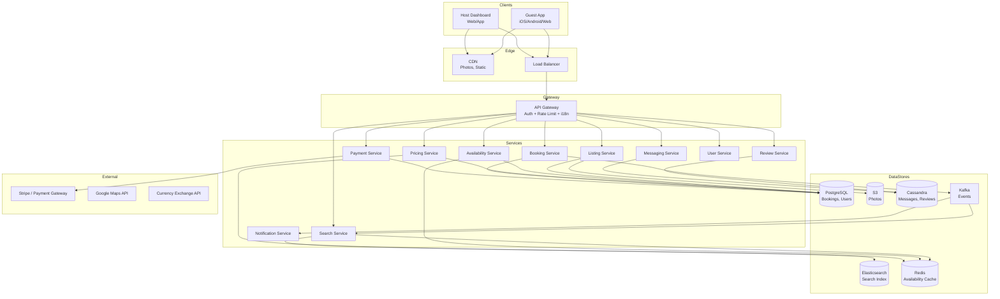
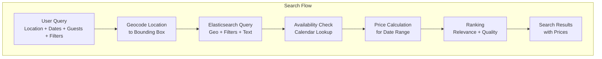
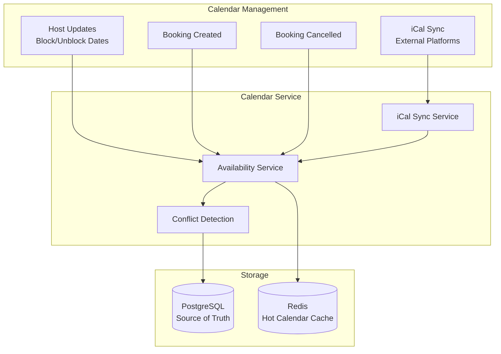
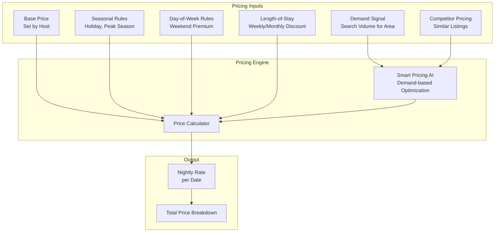
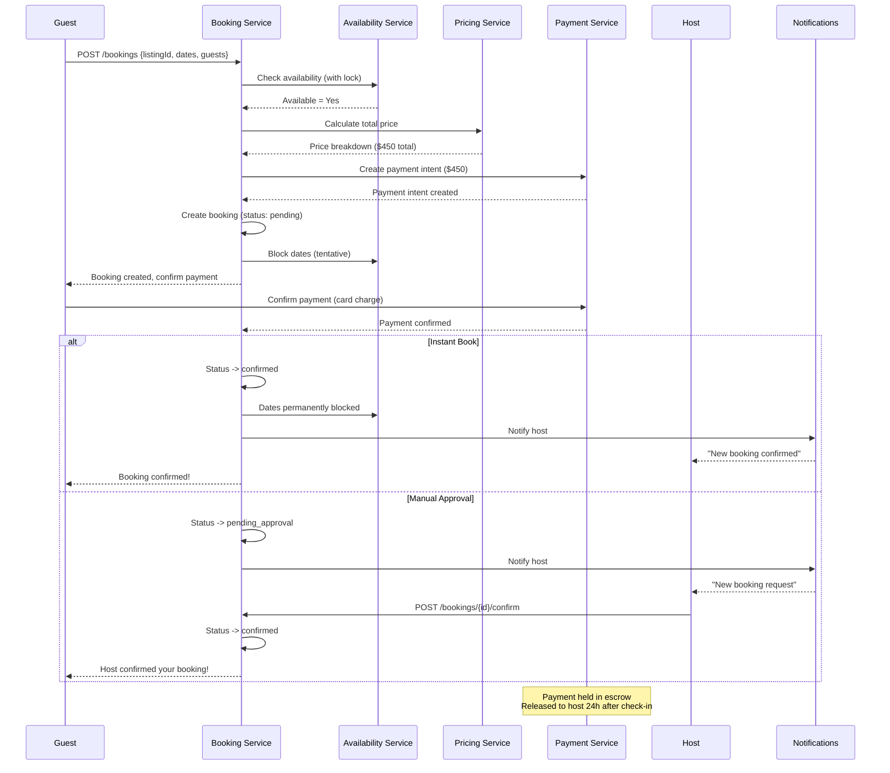

# Design Booking.com / Airbnb — Hotel & Property Booking Platform

## 1. Problem Statement & Requirements

### Functional Requirements

| # | Requirement | Details |
|---|-------------|---------|
| FR-1 | Property Listing | Hosts list properties with photos, amenities, rules, pricing |
| FR-2 | Search with Filters | Search by location, dates, guests, price range, amenities, ratings |
| FR-3 | Availability Calendar | Real-time availability for each property/room |
| FR-4 | Dynamic Pricing | Rates vary by demand, season, day of week, length of stay |
| FR-5 | Booking Flow | Select dates, review price, pay, confirm booking |
| FR-6 | Reviews & Ratings | Two-way reviews (guest reviews host, host reviews guest) |
| FR-7 | Host Dashboard | Manage listings, calendar, pricing, reservations, payouts |
| FR-8 | Payment Escrow | Hold funds until check-in, release to host after stay |
| FR-9 | Messaging | Pre/post booking communication between guest and host |
| FR-10 | Cancellation Policies | Flexible, moderate, strict cancellation with refund rules |

### Non-Functional Requirements

| # | Requirement | Target |
|---|-------------|--------|
| NFR-1 | Availability | 99.99% uptime |
| NFR-2 | Latency | Search results < 500ms |
| NFR-3 | Consistency | Strong consistency for bookings (no double-booking) |
| NFR-4 | Throughput | 1M+ searches/min, 10K+ bookings/min |
| NFR-5 | Scale | 7M+ active listings, 150M+ users |
| NFR-6 | Global | Multi-currency, multi-language, tax compliance |

---

## 2. Back-of-Envelope Estimation

### User Scale

$$
\text{Total Users} = 150M \quad \text{Active Listings} = 7M \quad \text{DAU} = 20M
$$

### Search Volume

$$
\text{Searches/Day} = 20M \times 10 = 200M
$$

$$
\text{Search QPS} = \frac{200M}{86{,}400} \approx 2{,}315 \text{ req/s}
$$

$$
\text{Peak Search QPS} \approx 2{,}315 \times 5 = 11{,}575 \text{ req/s}
$$

### Booking Volume

$$
\text{Daily Bookings} = 2M
$$

$$
\text{Booking QPS} = \frac{2M}{86{,}400} \approx 23 \text{ req/s}
$$

$$
\text{Peak Booking QPS} \approx 23 \times 10 = 230 \text{ req/s}
$$

### Storage Estimation

**Listings:**

$$
\text{Listing Metadata} = 7M \times 10 \text{ KB} = 70 \text{ GB}
$$

$$
\text{Listing Photos} = 7M \times 20 \text{ photos} \times 2 \text{ MB} = 280 \text{ TB}
$$

**Availability Calendar:**

$$
\text{Calendar Entries} = 7M \times 365 \text{ days} = 2.55B \text{ rows}
$$

$$
\text{Calendar Storage} = 2.55B \times 100 \text{ B} = 255 \text{ GB}
$$

**Reviews:**

$$
\text{Total Reviews} = 500M \times 500 \text{ B avg} = 250 \text{ GB}
$$

---

## 3. High-Level Design

### Architecture Diagram



### API Design

```typescript
// Search APIs
GET /api/v1/search?location={city}&check_in={date}&check_out={date}
    &guests={n}&min_price={n}&max_price={n}&amenities={list}
    &property_type={type}&rating_min={n}&sort={relevance|price|rating}
    &page={n}&limit=20

// Listing APIs
POST   /api/v1/listings
GET    /api/v1/listings/{listingId}
PUT    /api/v1/listings/{listingId}
POST   /api/v1/listings/{listingId}/photos
GET    /api/v1/listings/{listingId}/availability?from={date}&to={date}
PUT    /api/v1/listings/{listingId}/availability
       // Body: { dates: [{ date, available, price }] }

// Booking APIs
POST /api/v1/bookings
     // Body: { listingId, checkIn, checkOut, guests, paymentMethodId }
GET  /api/v1/bookings/{bookingId}
POST /api/v1/bookings/{bookingId}/cancel
POST /api/v1/bookings/{bookingId}/confirm  // Host confirms (instant or manual)

// Payment APIs
POST /api/v1/payments/intent
     // Body: { bookingId, amount, currency }
GET  /api/v1/hosts/{hostId}/payouts

// Review APIs
POST /api/v1/bookings/{bookingId}/reviews
     // Body: { rating, text, categories: { cleanliness, accuracy, ... } }
GET  /api/v1/listings/{listingId}/reviews?page={n}
```

---

## 4. Database Schema

### Listings Table (PostgreSQL)

```sql
CREATE TABLE listings (
    listing_id      UUID PRIMARY KEY DEFAULT gen_random_uuid(),
    host_id         UUID NOT NULL REFERENCES users(user_id),
    title           VARCHAR(200) NOT NULL,
    description     TEXT,
    property_type   VARCHAR(30) NOT NULL, -- apartment, house, villa, hotel_room
    room_type       VARCHAR(30) NOT NULL, -- entire_place, private_room, shared_room
    max_guests      SMALLINT NOT NULL,
    bedrooms        SMALLINT DEFAULT 1,
    beds            SMALLINT DEFAULT 1,
    bathrooms       DECIMAL(3,1) DEFAULT 1,
    latitude        DECIMAL(9,6) NOT NULL,
    longitude       DECIMAL(9,6) NOT NULL,
    city            VARCHAR(100),
    country         CHAR(2),
    amenities       TEXT[], -- ['wifi', 'pool', 'parking', 'kitchen', ...]
    house_rules     JSONB,
    cancellation_policy VARCHAR(20) DEFAULT 'moderate', -- flexible, moderate, strict
    base_price      DECIMAL(10,2) NOT NULL,
    currency        CHAR(3) DEFAULT 'USD',
    cleaning_fee    DECIMAL(10,2) DEFAULT 0,
    service_fee_pct DECIMAL(4,2) DEFAULT 14.0, -- Airbnb takes ~14%
    min_nights      SMALLINT DEFAULT 1,
    max_nights      SMALLINT DEFAULT 365,
    instant_book    BOOLEAN DEFAULT FALSE,
    status          VARCHAR(20) DEFAULT 'active', -- active, paused, deleted
    avg_rating      DECIMAL(3,2) DEFAULT 0,
    review_count    INT DEFAULT 0,
    created_at      TIMESTAMPTZ DEFAULT NOW(),
    updated_at      TIMESTAMPTZ DEFAULT NOW()
);

CREATE INDEX idx_listings_host ON listings(host_id);
CREATE INDEX idx_listings_location ON listings USING GIST (
    point(longitude, latitude)
);
CREATE INDEX idx_listings_city ON listings(city, status);
CREATE INDEX idx_listings_price ON listings(base_price);
CREATE INDEX idx_listings_rating ON listings(avg_rating DESC);
```

### Availability Calendar Table

```sql
CREATE TABLE availability_calendar (
    listing_id      UUID NOT NULL REFERENCES listings(listing_id),
    cal_date        DATE NOT NULL,
    available       BOOLEAN DEFAULT TRUE,
    price           DECIMAL(10,2),       -- Override price for this date
    min_nights      SMALLINT,            -- Override min nights
    booking_id      UUID REFERENCES bookings(booking_id),
    PRIMARY KEY (listing_id, cal_date)
);

-- Partition by month for performance
CREATE TABLE availability_calendar_2026_01 PARTITION OF availability_calendar
    FOR VALUES FROM ('2026-01-01') TO ('2026-02-01');
CREATE TABLE availability_calendar_2026_02 PARTITION OF availability_calendar
    FOR VALUES FROM ('2026-02-01') TO ('2026-03-01');
-- ... etc

CREATE INDEX idx_avail_date ON availability_calendar(cal_date, available);
```

### Bookings Table

```sql
CREATE TABLE bookings (
    booking_id      UUID PRIMARY KEY DEFAULT gen_random_uuid(),
    listing_id      UUID NOT NULL REFERENCES listings(listing_id),
    guest_id        UUID NOT NULL REFERENCES users(user_id),
    host_id         UUID NOT NULL REFERENCES users(user_id),
    check_in        DATE NOT NULL,
    check_out       DATE NOT NULL,
    guests          SMALLINT NOT NULL,
    nights          SMALLINT NOT NULL,
    nightly_rate    DECIMAL(10,2) NOT NULL,
    cleaning_fee    DECIMAL(10,2) DEFAULT 0,
    service_fee     DECIMAL(10,2) NOT NULL,
    taxes           DECIMAL(10,2) DEFAULT 0,
    total_price     DECIMAL(10,2) NOT NULL,
    currency        CHAR(3) DEFAULT 'USD',
    status          VARCHAR(20) DEFAULT 'pending',
    -- pending, confirmed, active, completed, cancelled, declined
    payment_intent_id VARCHAR(100),
    host_payout_id  VARCHAR(100),
    cancelled_by    UUID,
    cancellation_reason TEXT,
    created_at      TIMESTAMPTZ DEFAULT NOW(),
    updated_at      TIMESTAMPTZ DEFAULT NOW(),
    CONSTRAINT valid_dates CHECK (check_out > check_in)
);

CREATE INDEX idx_bookings_listing ON bookings(listing_id, check_in, check_out);
CREATE INDEX idx_bookings_guest ON bookings(guest_id, status);
CREATE INDEX idx_bookings_host ON bookings(host_id, status);
CREATE INDEX idx_bookings_status ON bookings(status) WHERE status IN ('pending', 'confirmed', 'active');
```

### Reviews Table (Cassandra for scale)

```sql
CREATE TABLE reviews (
    listing_id      UUID,
    review_id       TIMEUUID,
    booking_id      UUID,
    reviewer_id     UUID,
    reviewer_type   TEXT, -- 'guest' or 'host'
    overall_rating  SMALLINT, -- 1-5
    cleanliness     SMALLINT,
    accuracy        SMALLINT,
    communication   SMALLINT,
    location_rating SMALLINT,
    check_in_rating SMALLINT,
    value_rating    SMALLINT,
    text            TEXT,
    response_text   TEXT, -- Host's response
    created_at      TIMESTAMP,
    PRIMARY KEY ((listing_id), review_id)
) WITH CLUSTERING ORDER BY (review_id DESC);
```

### Pricing Rules Table

```sql
CREATE TABLE pricing_rules (
    rule_id         UUID PRIMARY KEY DEFAULT gen_random_uuid(),
    listing_id      UUID NOT NULL REFERENCES listings(listing_id),
    rule_type       VARCHAR(30) NOT NULL,
    -- weekend, weekly_discount, monthly_discount, seasonal, last_minute, early_bird
    day_of_week     SMALLINT[],          -- 0=Sun..6=Sat (for weekend pricing)
    start_date      DATE,                -- For seasonal pricing
    end_date        DATE,
    adjustment_type VARCHAR(10) NOT NULL, -- 'percentage' or 'fixed'
    adjustment_value DECIMAL(10,2) NOT NULL, -- e.g., -10 for 10% discount
    min_nights      SMALLINT,            -- For length-of-stay discounts
    created_at      TIMESTAMPTZ DEFAULT NOW()
);

CREATE INDEX idx_pricing_listing ON pricing_rules(listing_id);
```

---

## 5. Detailed Component Design

### 5.1 Search with Filters

The search system must handle complex multi-dimensional queries efficiently.



**Elasticsearch mapping:**

```typescript
const listingMapping = {
  properties: {
    listing_id: { type: 'keyword' },
    title: { type: 'text', analyzer: 'standard' },
    description: { type: 'text', analyzer: 'standard' },
    property_type: { type: 'keyword' },
    room_type: { type: 'keyword' },
    location: { type: 'geo_point' },
    city: { type: 'keyword' },
    country: { type: 'keyword' },
    max_guests: { type: 'integer' },
    bedrooms: { type: 'integer' },
    bathrooms: { type: 'float' },
    amenities: { type: 'keyword' }, // Array of keywords
    base_price: { type: 'float' },
    avg_rating: { type: 'float' },
    review_count: { type: 'integer' },
    instant_book: { type: 'boolean' },
    status: { type: 'keyword' },
    host_is_superhost: { type: 'boolean' },
  },
};
```

```typescript
class SearchService {
  async search(params: SearchParams): Promise<SearchResults> {
    // Step 1: Build Elasticsearch query
    const esQuery = this.buildQuery(params);

    // Step 2: Execute search (returns candidate listings)
    const candidates = await this.elasticsearch.search({
      index: 'listings',
      body: esQuery,
      size: params.limit * 3, // Over-fetch for availability filtering
    });

    // Step 3: Check availability for the date range
    const listingIds = candidates.hits.hits.map(h => h._id);
    const availability = await this.availabilityService.checkBulkAvailability(
      listingIds, params.checkIn, params.checkOut
    );

    const availableListings = candidates.hits.hits.filter(
      h => availability.get(h._id)?.available
    );

    // Step 4: Calculate prices for the date range
    const priced = await Promise.all(
      availableListings.map(async (listing) => {
        const price = await this.pricingService.calculateTotalPrice(
          listing._id, params.checkIn, params.checkOut, params.guests
        );
        return { ...listing._source, totalPrice: price };
      })
    );

    // Step 5: Rank and paginate
    const ranked = this.rank(priced, params.sort);
    const page = ranked.slice(params.offset, params.offset + params.limit);

    return {
      results: page,
      total: availability.size,
      page: params.page,
      hasMore: params.offset + params.limit < ranked.length,
    };
  }

  private buildQuery(params: SearchParams): object {
    const must: object[] = [];
    const filter: object[] = [];

    // Location filter (geo bounding box or radius)
    if (params.lat && params.lng) {
      filter.push({
        geo_distance: {
          distance: `${params.radiusKm ?? 20}km`,
          location: { lat: params.lat, lon: params.lng },
        },
      });
    } else if (params.location) {
      filter.push({ term: { city: params.location } });
    }

    // Guest capacity
    filter.push({ range: { max_guests: { gte: params.guests } } });

    // Price range
    if (params.minPrice || params.maxPrice) {
      const priceRange: Record<string, number> = {};
      if (params.minPrice) priceRange.gte = params.minPrice;
      if (params.maxPrice) priceRange.lte = params.maxPrice;
      filter.push({ range: { base_price: priceRange } });
    }

    // Amenities
    if (params.amenities?.length) {
      for (const amenity of params.amenities) {
        filter.push({ term: { amenities: amenity } });
      }
    }

    // Property type
    if (params.propertyType) {
      filter.push({ term: { property_type: params.propertyType } });
    }

    // Minimum rating
    if (params.ratingMin) {
      filter.push({ range: { avg_rating: { gte: params.ratingMin } } });
    }

    // Text search
    if (params.query) {
      must.push({
        multi_match: {
          query: params.query,
          fields: ['title^3', 'description', 'city^2'],
        },
      });
    }

    // Only active listings
    filter.push({ term: { status: 'active' } });

    return {
      query: {
        bool: { must, filter },
      },
      sort: this.getSortClause(params.sort),
    };
  }
}
```

### 5.2 Availability Calendar



```typescript
class AvailabilityService {
  async checkAvailability(
    listingId: string,
    checkIn: Date,
    checkOut: Date
  ): Promise<AvailabilityResult> {
    // Try cache first
    const cacheKey = `avail:${listingId}:${this.formatMonth(checkIn)}`;
    const cached = await this.redis.get(cacheKey);

    if (cached) {
      const calendar = JSON.parse(cached);
      return this.checkDatesInCalendar(calendar, checkIn, checkOut);
    }

    // Cache miss: query database
    const calendar = await this.db.query(`
      SELECT cal_date, available, price, min_nights
      FROM availability_calendar
      WHERE listing_id = $1
        AND cal_date >= $2
        AND cal_date < $3
      ORDER BY cal_date
    `, [listingId, checkIn, checkOut]);

    // All dates must be available
    const dates = calendar.rows;
    const allAvailable = dates.length === this.daysBetween(checkIn, checkOut)
      && dates.every(d => d.available);

    // Check minimum nights requirement
    const listing = await this.getListing(listingId);
    const nights = this.daysBetween(checkIn, checkOut);
    const minNights = dates[0]?.min_nights ?? listing.min_nights;

    return {
      available: allAvailable && nights >= minNights,
      dates: dates.map(d => ({
        date: d.cal_date,
        available: d.available,
        price: d.price,
      })),
      minNights,
      nights,
    };
  }

  async blockDates(
    listingId: string,
    checkIn: Date,
    checkOut: Date,
    bookingId: string
  ): Promise<boolean> {
    // Use advisory lock to prevent race conditions
    return await this.db.transaction(async (tx) => {
      // Lock the calendar rows
      const rows = await tx.query(`
        SELECT cal_date, available
        FROM availability_calendar
        WHERE listing_id = $1
          AND cal_date >= $2
          AND cal_date < $3
        FOR UPDATE
      `, [listingId, checkIn, checkOut]);

      // Verify all dates still available
      if (!rows.rows.every(r => r.available)) {
        return false; // Dates no longer available
      }

      // Block the dates
      await tx.query(`
        UPDATE availability_calendar
        SET available = FALSE, booking_id = $3
        WHERE listing_id = $1
          AND cal_date >= $2
          AND cal_date < $3
      `, [listingId, checkIn, checkOut, bookingId]);

      // Invalidate cache
      await this.invalidateCache(listingId, checkIn, checkOut);

      return true;
    });
  }

  // Bulk availability check for search results
  async checkBulkAvailability(
    listingIds: string[],
    checkIn: Date,
    checkOut: Date
  ): Promise<Map<string, { available: boolean }>> {
    const nights = this.daysBetween(checkIn, checkOut);
    const results = new Map<string, { available: boolean }>();

    // Query all at once
    const rows = await this.db.query(`
      SELECT listing_id, COUNT(*) as available_nights
      FROM availability_calendar
      WHERE listing_id = ANY($1)
        AND cal_date >= $2
        AND cal_date < $3
        AND available = TRUE
      GROUP BY listing_id
    `, [listingIds, checkIn, checkOut]);

    const availMap = new Map(rows.rows.map(r => [r.listing_id, r.available_nights]));

    for (const id of listingIds) {
      results.set(id, {
        available: (availMap.get(id) ?? 0) === nights,
      });
    }

    return results;
  }
}
```

### 5.3 Dynamic Pricing Engine



```typescript
class PricingEngine {
  async calculateTotalPrice(
    listingId: string,
    checkIn: Date,
    checkOut: Date,
    guests: number
  ): Promise<PriceBreakdown> {
    const listing = await this.getListing(listingId);
    const rules = await this.getPricingRules(listingId);
    const nights = this.daysBetween(checkIn, checkOut);

    let nightlyPrices: NightlyPrice[] = [];
    let currentDate = new Date(checkIn);

    while (currentDate < checkOut) {
      let price = listing.base_price;

      // Apply date-specific override from calendar
      const calendarPrice = await this.getCalendarPrice(listingId, currentDate);
      if (calendarPrice !== null) {
        price = calendarPrice;
      }

      // Apply day-of-week adjustment
      const dayOfWeek = currentDate.getDay();
      const weekendRule = rules.find(r =>
        r.rule_type === 'weekend' && r.day_of_week?.includes(dayOfWeek)
      );
      if (weekendRule) {
        price = this.applyAdjustment(price, weekendRule);
      }

      // Apply seasonal adjustment
      const seasonalRule = rules.find(r =>
        r.rule_type === 'seasonal'
        && r.start_date! <= currentDate
        && r.end_date! >= currentDate
      );
      if (seasonalRule) {
        price = this.applyAdjustment(price, seasonalRule);
      }

      // Apply Smart Pricing (demand-based)
      if (listing.smart_pricing_enabled) {
        const demandMultiplier = await this.getSmartPricingMultiplier(listing, currentDate);
        price = Math.round(price * demandMultiplier * 100) / 100;

        // Respect host's min/max bounds
        price = Math.max(listing.smart_price_min ?? price * 0.5, price);
        price = Math.min(listing.smart_price_max ?? price * 2.0, price);
      }

      nightlyPrices.push({ date: new Date(currentDate), price });
      currentDate.setDate(currentDate.getDate() + 1);
    }

    // Apply length-of-stay discounts
    let subtotal = nightlyPrices.reduce((sum, np) => sum + np.price, 0);
    let discount = 0;

    const weeklyRule = rules.find(r => r.rule_type === 'weekly_discount' && nights >= 7);
    const monthlyRule = rules.find(r => r.rule_type === 'monthly_discount' && nights >= 28);

    if (monthlyRule) {
      discount = subtotal * Math.abs(monthlyRule.adjustment_value) / 100;
    } else if (weeklyRule) {
      discount = subtotal * Math.abs(weeklyRule.adjustment_value) / 100;
    }

    const nightlySubtotal = subtotal - discount;
    const cleaningFee = listing.cleaning_fee;
    const serviceFee = Math.round(nightlySubtotal * listing.service_fee_pct / 100 * 100) / 100;
    const taxes = await this.calculateTaxes(listing, nightlySubtotal + cleaningFee);

    return {
      nightlyPrices,
      nights,
      avgNightlyRate: Math.round(nightlySubtotal / nights * 100) / 100,
      subtotal: nightlySubtotal,
      cleaningFee,
      serviceFee,
      taxes,
      total: Math.round((nightlySubtotal + cleaningFee + serviceFee + taxes) * 100) / 100,
      currency: listing.currency,
      discount: discount > 0 ? { type: monthlyRule ? 'monthly' : 'weekly', amount: discount } : undefined,
    };
  }

  // AI-powered demand-based pricing
  private async getSmartPricingMultiplier(listing: Listing, date: Date): Promise<number> {
    // Factors: area demand, day of week, holidays, events, competitor prices
    const [demand, competitors, events] = await Promise.all([
      this.getDemandScore(listing.city, date),
      this.getCompetitorPrices(listing, date),
      this.getLocalEvents(listing.city, date),
    ]);

    let multiplier = 1.0;

    // High demand increases price
    if (demand > 0.8) multiplier += 0.3;
    else if (demand > 0.6) multiplier += 0.15;
    else if (demand < 0.3) multiplier -= 0.15;

    // Local events (concerts, conferences) increase demand
    if (events.length > 0) multiplier += 0.2;

    // Competitor pricing adjustment
    if (competitors.avgPrice > listing.base_price * 1.3) {
      multiplier += 0.1;
    }

    return Math.max(0.5, Math.min(2.0, multiplier));
  }
}
```

### 5.4 Booking Flow



```typescript
class BookingService {
  async createBooking(request: BookingRequest): Promise<Booking> {
    return await this.db.transaction(async (tx) => {
      // Step 1: Lock and verify availability
      const available = await this.availabilityService.blockDates(
        request.listingId,
        request.checkIn,
        request.checkOut,
        'pending' // Temporary block
      );

      if (!available) {
        throw new DatesUnavailableError('Selected dates are no longer available');
      }

      // Step 2: Calculate price
      const price = await this.pricingService.calculateTotalPrice(
        request.listingId, request.checkIn, request.checkOut, request.guests
      );

      // Step 3: Create payment intent (hold funds)
      const paymentIntent = await this.paymentService.createPaymentIntent({
        amount: price.total,
        currency: price.currency,
        customerId: request.guestId,
        metadata: { listingId: request.listingId },
      });

      // Step 4: Create booking record
      const listing = await this.getListing(request.listingId);
      const booking = await tx.query(`
        INSERT INTO bookings (
          listing_id, guest_id, host_id, check_in, check_out,
          guests, nights, nightly_rate, cleaning_fee, service_fee,
          taxes, total_price, currency, status, payment_intent_id
        )
        VALUES ($1, $2, $3, $4, $5, $6, $7, $8, $9, $10, $11, $12, $13, $14, $15)
        RETURNING *
      `, [
        request.listingId, request.guestId, listing.host_id,
        request.checkIn, request.checkOut, request.guests,
        price.nights, price.avgNightlyRate, price.cleaningFee,
        price.serviceFee, price.taxes, price.total, price.currency,
        listing.instant_book ? 'confirmed' : 'pending_approval',
        paymentIntent.id,
      ]);

      // Step 5: Finalize date blocks with booking ID
      await this.availabilityService.blockDates(
        request.listingId,
        request.checkIn,
        request.checkOut,
        booking.rows[0].booking_id
      );

      // Step 6: Publish events
      await this.kafka.publish('booking.created', booking.rows[0]);

      // Step 7: Schedule expiry if pending approval (host has 24h to respond)
      if (!listing.instant_book) {
        await this.scheduler.schedule(
          'booking.auto_decline',
          { bookingId: booking.rows[0].booking_id },
          new Date(Date.now() + 24 * 60 * 60 * 1000)
        );
      }

      return booking.rows[0];
    });
  }
}
```

### 5.5 Payment Escrow

```mermaid
graph TB
    subgraph "Payment Timeline"
        Book[Guest Books<br/>Day 0]
        Charge[Card Charged<br/>Day 0]
        Escrow[Funds in Escrow<br/>Day 0 to Check-in]
        CheckIn[Check-in<br/>Day N]
        Release[Release to Host<br/>Day N+1 (24h after check-in)]
        Payout[Host Payout<br/>Day N+3 to N+5]
    end

    Book --> Charge
    Charge --> Escrow
    Escrow --> CheckIn
    CheckIn --> Release
    Release --> Payout
```

```typescript
class PaymentEscrowService {
  async processBookingPayment(bookingId: string): Promise<void> {
    const booking = await this.getBooking(bookingId);

    // Charge guest's card and hold in platform escrow
    const charge = await this.stripe.charges.create({
      amount: Math.round(booking.total_price * 100), // cents
      currency: booking.currency,
      customer: booking.guest_stripe_id,
      transfer_group: bookingId,
      metadata: { bookingId },
    });

    await this.updateBooking(bookingId, {
      payment_status: 'captured',
      charge_id: charge.id,
    });

    // Schedule payout to host: 24 hours after check-in
    const payoutDate = new Date(booking.check_in);
    payoutDate.setDate(payoutDate.getDate() + 1);

    await this.scheduler.schedule('release_payout', { bookingId }, payoutDate);
  }

  async releasePayout(bookingId: string): Promise<void> {
    const booking = await this.getBooking(bookingId);
    if (booking.status === 'cancelled') return;

    // Calculate host payout (total - platform commission)
    const platformFee = booking.service_fee;
    const hostPayout = booking.total_price - platformFee;

    // Transfer to host's connected Stripe account
    const transfer = await this.stripe.transfers.create({
      amount: Math.round(hostPayout * 100),
      currency: booking.currency,
      destination: booking.host_stripe_account_id,
      transfer_group: bookingId,
    });

    await this.updateBooking(bookingId, {
      host_payout_id: transfer.id,
      payout_status: 'completed',
    });
  }

  async processCancellationRefund(bookingId: string): Promise<void> {
    const booking = await this.getBooking(bookingId);
    const listing = await this.getListing(booking.listing_id);
    const daysUntilCheckIn = this.daysBetween(new Date(), booking.check_in);

    // Calculate refund based on cancellation policy
    let refundPercentage: number;

    switch (listing.cancellation_policy) {
      case 'flexible':
        refundPercentage = daysUntilCheckIn >= 1 ? 100 : 0;
        break;
      case 'moderate':
        refundPercentage = daysUntilCheckIn >= 5 ? 100 :
                           daysUntilCheckIn >= 1 ? 50 : 0;
        break;
      case 'strict':
        refundPercentage = daysUntilCheckIn >= 14 ? 100 :
                           daysUntilCheckIn >= 7 ? 50 : 0;
        break;
      default:
        refundPercentage = 0;
    }

    if (refundPercentage > 0) {
      const refundAmount = booking.total_price * refundPercentage / 100;
      await this.stripe.refunds.create({
        charge: booking.charge_id,
        amount: Math.round(refundAmount * 100),
      });
    }
  }
}
```

### 5.6 Reviews System

```typescript
class ReviewService {
  // Both guest and host have a 14-day window to leave a review after checkout
  async submitReview(bookingId: string, reviewerId: string, review: ReviewInput): Promise<void> {
    const booking = await this.getBooking(bookingId);

    // Validate: reviewer must be guest or host of this booking
    const isGuest = booking.guest_id === reviewerId;
    const isHost = booking.host_id === reviewerId;
    if (!isGuest && !isHost) throw new UnauthorizedError();

    // Check review window (14 days after checkout)
    const daysSinceCheckout = this.daysBetween(booking.check_out, new Date());
    if (daysSinceCheckout > 14) throw new ReviewWindowClosedError();

    // Check for existing review
    const existing = await this.getReview(bookingId, reviewerId);
    if (existing) throw new DuplicateReviewError();

    // Store review
    await this.cassandra.execute(`
      INSERT INTO reviews (
        listing_id, review_id, booking_id, reviewer_id, reviewer_type,
        overall_rating, cleanliness, accuracy, communication,
        location_rating, check_in_rating, value_rating, text, created_at
      )
      VALUES (?, now(), ?, ?, ?, ?, ?, ?, ?, ?, ?, ?, ?, toTimestamp(now()))
    `, [
      booking.listing_id, bookingId, reviewerId,
      isGuest ? 'guest' : 'host',
      review.overallRating, review.cleanliness, review.accuracy,
      review.communication, review.location, review.checkIn,
      review.value, review.text,
    ]);

    // Reviews are hidden until both parties submit (or 14 days pass)
    // This prevents retaliatory reviews
    const otherReview = await this.getReview(
      bookingId, isGuest ? booking.host_id : booking.guest_id
    );

    if (otherReview) {
      // Both reviews submitted - make both visible
      await this.publishReviews(bookingId);
    }

    // Update listing's average rating
    if (isGuest) {
      await this.updateListingRating(booking.listing_id);
    }
  }

  private async updateListingRating(listingId: string): Promise<void> {
    const stats = await this.cassandra.execute(`
      SELECT AVG(overall_rating) as avg_rating, COUNT(*) as count
      FROM reviews
      WHERE listing_id = ?
    `, [listingId]);

    await this.db.query(`
      UPDATE listings SET avg_rating = $1, review_count = $2, updated_at = NOW()
      WHERE listing_id = $3
    `, [stats.rows[0].avg_rating, stats.rows[0].count, listingId]);

    // Update search index
    await this.searchService.updateListing(listingId, {
      avg_rating: stats.rows[0].avg_rating,
      review_count: parseInt(stats.rows[0].count),
    });
  }
}
```

---

## 6. Scaling & Bottlenecks

### What Breaks First

| Component | Bottleneck | Solution |
|-----------|-----------|----------|
| Search | 11K+ QPS with complex geo+filter queries | Elasticsearch cluster with geo-sharding |
| Availability Check | 2.55B calendar rows queried per search | Redis cache, date-range partitioning |
| Booking Concurrency | Multiple guests booking same dates | Pessimistic locking (FOR UPDATE) |
| Photo Storage | 280 TB, high read throughput | CDN with image optimization (WebP, responsive) |
| Price Calculation | Compute per listing per search result | Pre-compute and cache nightly prices |
| Review Aggregation | Count/average over millions of reviews | Materialized counters on listing table |

### Search Performance Optimization

```typescript
class SearchOptimizer {
  // Pre-warm cache with popular search queries
  async prewarmCache(): Promise<void> {
    const popularSearches = await this.getTopSearchQueries(1000);

    for (const search of popularSearches) {
      const results = await this.searchService.search(search.params);
      await this.redis.set(
        `search_cache:${this.hashParams(search.params)}`,
        JSON.stringify(results),
        'EX', 300 // 5 min cache
      );
    }
  }

  // Shard Elasticsearch by geography
  getShardRoutingKey(listing: Listing): string {
    // Route to region-specific shard for better locality
    return listing.country; // EU listings on EU shard, US on US shard
  }
}
```

---

## 7. Trade-offs & Alternatives

### Availability Storage

| Approach | Pro | Con |
|----------|-----|-----|
| Date-per-row (current) | Simple queries, easy to understand | 2.55B rows, large table |
| Bitmap (1 bit per day) | Compact storage | Complex queries |
| Range-based (start/end) | Fewer rows for long blocks | Overlapping ranges complex |

### Booking Consistency Model

| Approach | Pro | Con |
|----------|-----|-----|
| Pessimistic Lock (current) | No double booking guaranteed | Lock contention under load |
| Optimistic Lock (version) | Better throughput | Retry on conflict |
| Distributed Lock (Redis) | Works across services | Redis SPOF |
| Saga Pattern | Loosely coupled microservices | Compensating transactions |

### Search Architecture

| Approach | Pro | Con |
|----------|-----|-----|
| Elasticsearch (current) | Great full-text + geo | Stale data, eventual consistency |
| PostgreSQL + PostGIS | Strong consistency | Slower at scale |
| Solr | Enterprise features | Less modern ecosystem |
| Custom (Airbnb) | Optimized for use case | Huge engineering investment |

---

## 8. Advanced Topics

### 8.1 Multi-Currency Support

$$
\text{Display Price} = \text{Base Price} \times \text{Exchange Rate} \times (1 + \text{Currency Margin})
$$

```typescript
class CurrencyService {
  private rates: Map<string, number> = new Map();

  async convertPrice(amount: number, from: string, to: string): Promise<number> {
    if (from === to) return amount;

    const rate = await this.getRate(from, to);
    return Math.round(amount * rate * 100) / 100;
  }

  // Cache exchange rates, refresh every hour
  async refreshRates(): Promise<void> {
    const rates = await this.exchangeRateAPI.getLatestRates('USD');
    for (const [currency, rate] of Object.entries(rates)) {
      this.rates.set(`USD_${currency}`, rate as number);
    }
    // Store in Redis for all service instances
    await this.redis.set('exchange_rates', JSON.stringify(Object.fromEntries(this.rates)), 'EX', 3600);
  }
}
```

### 8.2 iCal Synchronization

Hosts often list on multiple platforms (Airbnb, Booking.com, VRBO). Calendar sync prevents double bookings.

### 8.3 Trust & Safety

Verification systems for both hosts and guests: government ID verification, phone verification, social media linking, review history, and response rate tracking.

---

## 9. Interview Tips

::: tip Key Points to Emphasize
1. **Double-booking prevention is the hardest problem** — Use pessimistic locking on availability calendar.
2. **Search must be fast despite availability checks** — Cache aggressively, pre-compute prices.
3. **Payment escrow is essential for marketplace trust** — Explain the timeline from charge to payout.
4. **Dynamic pricing drives revenue** — Demand-based pricing with host-set bounds.
5. **Two-sided marketplace dynamics** — Both guest and host experience matter equally.
:::

::: warning Common Mistakes
- Not addressing the double-booking problem with proper concurrency control.
- Ignoring the complexity of multi-currency, multi-tax, multi-language support.
- Treating search as a simple database query — it requires a dedicated search engine.
- Forgetting the host side of the marketplace (calendar management, payouts, reviews).
- Not discussing cancellation policies and their impact on refund flows.
:::

::: info Follow-Up Questions to Expect
- How would you handle a property listed on both Airbnb and Booking.com? (iCal sync, channel manager integration.)
- How would you detect and prevent fraudulent listings?
- How would you implement "Flexible Dates" search (show cheapest dates in a range)?
- How would you handle group bookings across multiple listings?
:::

### Time Allocation in 45-min Interview

| Phase | Time | Focus |
|-------|------|-------|
| Requirements | 5 min | Clarify scope: hotel vs. vacation rental, instant vs. request |
| High-Level Design | 8 min | Architecture, key services, data stores |
| Deep Dive: Search | 8 min | Elasticsearch, availability check integration |
| Deep Dive: Booking | 10 min | Concurrency control, payment escrow, cancellation |
| Deep Dive: Pricing | 7 min | Dynamic pricing, calendar management |
| Scaling | 5 min | Caching strategies, search optimization |
| Q&A | 2 min | Multi-currency, trust & safety |
