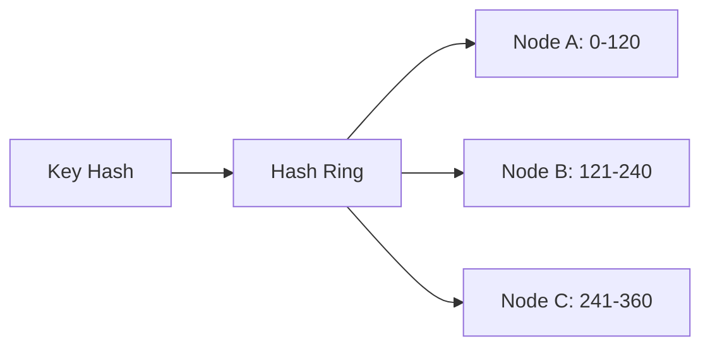
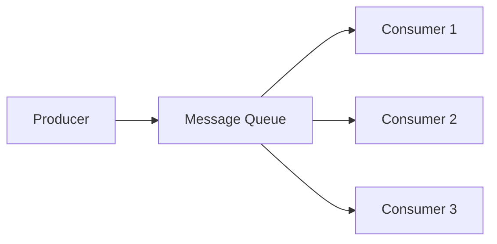
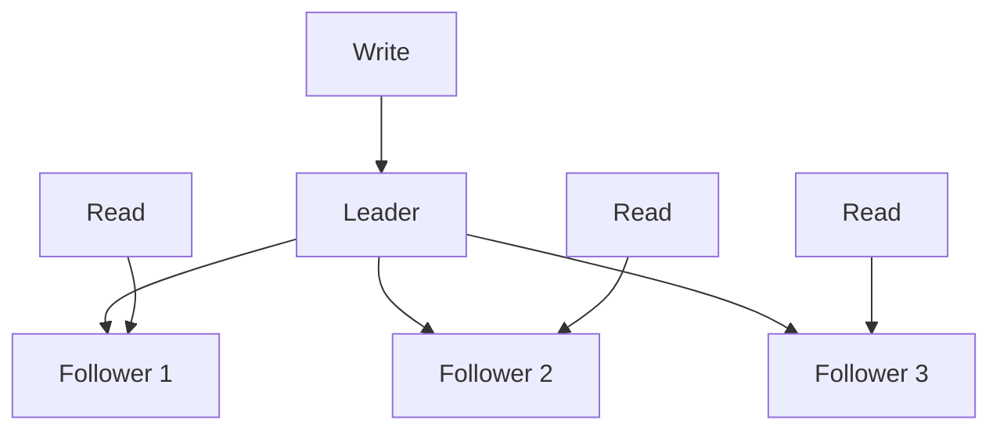
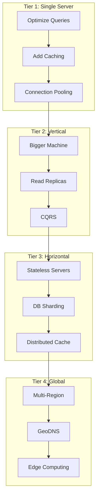

# System Design Interview Framework

System design interviews test your ability to architect large-scale distributed systems under ambiguity. This guide provides a repeatable framework, estimation cheat sheets, and links to detailed walkthroughs for the most commonly asked problems.

## The Structured Framework

Every system design interview should follow a disciplined structure. Rushing into diagrams without clarifying requirements is the single most common reason candidates fail.

### Step 1: Requirements Gathering (3-5 minutes)

Before touching the whiteboard, ask clarifying questions. Split requirements into two categories:

**Functional Requirements** — What the system does:
- Core features (the "must haves")
- User-facing APIs
- Data inputs and outputs
- Edge cases and error handling

**Non-Functional Requirements** — How the system behaves:
- Scale (users, QPS, data volume)
- Latency (p50, p99 targets)
- Availability (99.9% = 8.7 hours downtime/year)
- Consistency model (strong, eventual, causal)
- Durability (zero data loss?)
- Security and compliance

::: tip Interview Tip
Always ask: "Who are the users?", "What is the expected scale?", and "What are the most important quality attributes?" This shows maturity and prevents wasted effort on irrelevant components.
:::

### Step 2: Back-of-Envelope Estimation (3-5 minutes)

Estimations ground your design in reality. Interviewers want to see you think quantitatively.

### Step 3: High-Level Design (10-15 minutes)

Draw the 30,000-foot architecture:
- Client types (web, mobile, API)
- Load balancers
- Application servers
- Databases (SQL vs NoSQL)
- Caches
- Message queues
- CDNs
- Third-party services

### Step 4: Detailed Component Design (10-15 minutes)

Deep-dive into 2-3 critical components. The interviewer will guide you toward what interests them most.

### Step 5: Scaling & Trade-offs (5-10 minutes)

Discuss bottlenecks, failure modes, and how to scale each layer.

---

## Estimation Cheat Sheet

These reference numbers let you do quick back-of-envelope math in any interview.

### Power of Two Reference

| Power | Exact Value | Approx | Bytes |
|-------|-------------|--------|-------|
| $2^{10}$ | 1,024 | 1 Thousand | 1 KB |
| $2^{20}$ | 1,048,576 | 1 Million | 1 MB |
| $2^{30}$ | 1,073,741,824 | 1 Billion | 1 GB |
| $2^{40}$ | 1,099,511,627,776 | 1 Trillion | 1 TB |
| $2^{50}$ | — | 1 Quadrillion | 1 PB |

### Latency Numbers Every Engineer Should Know

| Operation | Latency |
|-----------|---------|
| L1 cache reference | 0.5 ns |
| Branch mispredict | 5 ns |
| L2 cache reference | 7 ns |
| Mutex lock/unlock | 25 ns |
| Main memory reference | 100 ns |
| Compress 1KB with Zippy | 3 us |
| Send 1KB over 1 Gbps network | 10 us |
| Read 4KB randomly from SSD | 150 us |
| Read 1MB sequentially from memory | 250 us |
| Round trip within same datacenter | 500 us |
| Read 1MB sequentially from SSD | 1 ms |
| HDD seek | 10 ms |
| Read 1MB sequentially from HDD | 20 ms |
| Send packet CA -> Netherlands -> CA | 150 ms |

### QPS Estimation Formulas

**Daily Active Users (DAU) to QPS:**

$$
\text{QPS} = \frac{\text{DAU} \times \text{actions per user per day}}{86400}
$$

$$
\text{Peak QPS} \approx 2 \times \text{QPS} \quad \text{(general rule)}
$$

$$
\text{Peak QPS} \approx 3\text{-}5 \times \text{QPS} \quad \text{(social/viral apps)}
$$

**Example: 100M DAU, 10 actions/day:**

$$
\text{QPS} = \frac{100M \times 10}{86400} \approx 11{,}574 \approx 12K
$$

$$
\text{Peak QPS} \approx 24K\text{-}60K
$$

### Storage Estimation Formulas

**Text storage:**

$$
\text{Daily storage} = \text{DAU} \times \text{posts per user} \times \text{avg post size}
$$

**Media storage:**

$$
\text{Daily storage} = \text{uploads per day} \times \text{avg file size}
$$

**5-year projection:**

$$
\text{Total} = \text{Daily storage} \times 365 \times 5
$$

### Bandwidth Estimation

$$
\text{Ingress} = \frac{\text{Daily data in}}{86400}
$$

$$
\text{Egress} = \frac{\text{Daily data out}}{86400}
$$

::: info Quick Reference
- 1 day = 86,400 seconds (round to $10^5$ for easy math)
- 1 month ~ 2.5M seconds
- 1 year ~ 30M seconds
- A single server can handle ~10K-50K concurrent connections
- A single PostgreSQL instance handles ~10K-50K QPS (depending on query complexity)
- Redis handles ~100K-500K QPS per instance
- A single Kafka broker handles ~100K-1M messages/sec
:::

### Availability Math

| Availability | Downtime/Year | Downtime/Month |
|-------------|---------------|----------------|
| 99% (two 9s) | 3.65 days | 7.3 hours |
| 99.9% (three 9s) | 8.77 hours | 43.8 minutes |
| 99.99% (four 9s) | 52.6 minutes | 4.38 minutes |
| 99.999% (five 9s) | 5.26 minutes | 26.3 seconds |

**Combined availability** of components in series:

$$
A_{total} = A_1 \times A_2 \times \ldots \times A_n
$$

Example: Three components each at 99.9%:

$$
A = 0.999^3 = 0.997 \approx 99.7\%
$$

---

## Common Patterns Reference

These patterns appear repeatedly across system design problems. Mastering them lets you quickly assemble solutions.

### 1. Consistent Hashing

**Problem:** Distributing data across N nodes where N changes over time.

**Solution:** Hash both keys and nodes onto a ring. Each key is assigned to the next node clockwise.



**Used in:** [URL Shortener](/system-design-interviews/url-shortener), [Dropbox](/system-design-interviews/dropbox), distributed caches

### 2. Fan-Out on Write vs Fan-Out on Read

**Fan-Out on Write (Push Model):**
- Pre-compute results when data changes
- Fast reads, slow writes
- Works for users with bounded follower counts
- Used by: [Instagram Feed](/system-design-interviews/instagram), [Twitter Feed](/system-design-interviews/twitter-feed)

**Fan-Out on Read (Pull Model):**
- Compute results at read time
- Slow reads, fast writes
- Better for users with millions of followers (celebrity problem)

### 3. Write-Ahead Log (WAL)

**Problem:** Ensuring durability without flushing every write to disk.

**Solution:** Append every mutation to a sequential log before applying it. On crash, replay the log.

**Used in:** [Chat System](/system-design-interviews/chat-system), databases, message queues

### 4. Event Sourcing / CQRS

**Problem:** Complex read and write patterns that don't fit a single model.

**Solution:** Separate the write model (event log) from the read model (materialized views). Events are immutable; views are derived.

**Used in:** [Notification System](/system-design-interviews/notification-system), [Twitter Feed](/system-design-interviews/twitter-feed)

### 5. Blob Storage + Metadata DB

**Problem:** Storing large binary objects alongside structured metadata.

**Solution:** Store blobs in object storage (S3), metadata in a database. Reference blobs by URL/key.

**Used in:** [Instagram](/system-design-interviews/instagram), [YouTube](/system-design-interviews/youtube), [Dropbox](/system-design-interviews/dropbox)

### 6. Message Queues for Async Processing

**Problem:** Decoupling producers from consumers; handling bursty traffic.

**Solution:** Kafka, RabbitMQ, or SQS between services. Producers enqueue; consumers process at their own pace.



**Used in:** [YouTube transcoding](/system-design-interviews/youtube), [Web Crawler](/system-design-interviews/web-crawler), [Notification System](/system-design-interviews/notification-system)

### 7. Rate Limiting

**Problem:** Preventing abuse and protecting downstream services.

**Algorithms:**
- Token Bucket — smooth rate, allows bursts
- Sliding Window — precise, memory-intensive
- Leaky Bucket — fixed output rate

**Used in:** [Notification System](/system-design-interviews/notification-system), [URL Shortener](/system-design-interviews/url-shortener), API gateways

### 8. Geospatial Indexing

**Problem:** Finding nearby entities efficiently.

**Solutions:**
- Geohash — encode lat/long into string, prefix matching for proximity
- Quadtree — recursive spatial subdivision
- R-tree — bounding rectangle hierarchy
- S2 geometry — map sphere to cube faces, Hilbert curve indexing

**Used in:** [Uber](/system-design-interviews/uber), location-based services

### 9. CDN (Content Delivery Network)

**Problem:** Serving static content to globally distributed users with low latency.

**Solution:** Cache content at edge servers worldwide. Pull or push model.

**Used in:** [Instagram](/system-design-interviews/instagram), [YouTube](/system-design-interviews/youtube), [Dropbox](/system-design-interviews/dropbox)

### 10. Database Sharding Strategies

**Strategies:**
- Range-based — simple but hotspots
- Hash-based — even distribution but range queries are hard
- Directory-based — flexible but single point of failure
- Geographic — data locality for compliance

### 11. Leader-Follower Replication

**Problem:** Scaling reads and providing fault tolerance.

**Solution:** One leader handles writes; followers replicate and serve reads.



### 12. Bloom Filters

**Problem:** Quickly checking if an element is NOT in a set, without storing the full set.

**Solution:** Probabilistic data structure. False positives possible, false negatives impossible.

**Used in:** [Web Crawler](/system-design-interviews/web-crawler) (duplicate URL detection), cache lookups

---

## API Design Principles

When designing APIs in an interview:

1. **Use RESTful conventions** for CRUD operations
2. **Use WebSockets** for real-time bidirectional communication
3. **Use Server-Sent Events** for one-way real-time updates
4. **Include pagination** for list endpoints (cursor-based preferred)
5. **Version your APIs** (`/api/v1/...`)
6. **Include rate limiting headers** in responses

```typescript
// Cursor-based pagination example
interface PaginatedResponse<T> {
  data: T[];
  cursor: string | null;  // null means no more pages
  hasMore: boolean;
}

// API endpoint
// GET /api/v1/feed?cursor=abc123&limit=20
```

---

## Database Selection Guide

| Requirement | Choose | Examples |
|-------------|--------|----------|
| ACID transactions | Relational DB | PostgreSQL, MySQL |
| Flexible schema | Document DB | MongoDB, DynamoDB |
| High write throughput | LSM-tree DB | Cassandra, RocksDB |
| Graph relationships | Graph DB | Neo4j, Neptune |
| Caching / sessions | In-memory | Redis, Memcached |
| Full-text search | Search engine | Elasticsearch, Solr |
| Time-series data | TSDB | InfluxDB, TimescaleDB |
| File/blob storage | Object store | S3, GCS, Azure Blob |

---

## Walkthrough Index

Each walkthrough follows the framework above with exhaustive detail:

| Problem | Key Concepts | Difficulty |
|---------|-------------|------------|
| [URL Shortener](/system-design-interviews/url-shortener) | Hashing, base62, read-heavy caching, analytics | Medium |
| [Instagram](/system-design-interviews/instagram) | Image storage, CDN, news feed, fan-out | Medium-Hard |
| [Chat System](/system-design-interviews/chat-system) | WebSockets, message delivery, E2E encryption | Hard |
| [YouTube](/system-design-interviews/youtube) | Video transcoding, adaptive bitrate, CDN | Hard |
| [Twitter Feed](/system-design-interviews/twitter-feed) | Fan-out, timeline, trending, search | Hard |
| [Uber](/system-design-interviews/uber) | Geospatial indexing, real-time matching, surge pricing | Hard |
| [Dropbox](/system-design-interviews/dropbox) | File sync, chunking, deduplication, conflict resolution | Hard |
| [Web Crawler](/system-design-interviews/web-crawler) | URL frontier, Bloom filter, politeness, distributed crawl | Medium-Hard |
| [Notification System](/system-design-interviews/notification-system) | Multi-channel, priority queues, rate limiting | Medium |

---

## The Interview Checklist

Use this checklist during your practice sessions:

### Before Drawing Anything
- [ ] Clarified functional requirements (3-5 core features)
- [ ] Clarified non-functional requirements (scale, latency, availability)
- [ ] Asked about constraints (budget, team size, timeline)
- [ ] Estimated QPS, storage, bandwidth

### During High-Level Design
- [ ] Drew client -> LB -> app server -> DB flow
- [ ] Identified read vs write paths
- [ ] Chose appropriate database(s)
- [ ] Added caching where read-heavy
- [ ] Added message queues where async processing needed
- [ ] Added CDN for static content

### During Detailed Design
- [ ] Defined API endpoints with request/response
- [ ] Designed database schema with indexes
- [ ] Addressed the "hard part" of the problem
- [ ] Drew sequence diagrams for critical flows

### During Scaling Discussion
- [ ] Identified the bottleneck
- [ ] Discussed horizontal scaling strategy
- [ ] Addressed single points of failure
- [ ] Mentioned monitoring and alerting

---

## Common Mistakes to Avoid

::: danger Common Pitfalls
1. **Jumping to solutions** — Always gather requirements first
2. **Over-engineering** — Start simple, add complexity when justified
3. **Ignoring non-functional requirements** — Scale and latency matter
4. **Not doing estimations** — Numbers ground your design in reality
5. **Monologue mode** — System design is a conversation, not a lecture
6. **Ignoring trade-offs** — Every decision has pros and cons
7. **No diagrams** — Always draw; visual communication is essential
8. **Premature optimization** — Solve the core problem first
:::

---

## Scaling Playbook

When the interviewer asks "how would you scale this?", use this playbook:

### Tier 1: Single Server Optimizations
- Add indexes to database queries
- Implement application-level caching (Redis)
- Optimize N+1 queries
- Connection pooling

### Tier 2: Vertical Scaling
- Bigger machines (more CPU, RAM, SSD)
- Read replicas for database
- Separate read and write paths (CQRS)

### Tier 3: Horizontal Scaling
- Stateless application servers behind load balancer
- Database sharding
- Distributed caching (Redis Cluster)
- CDN for static assets

### Tier 4: Global Scale
- Multi-region deployment
- Global load balancing (GeoDNS)
- Data replication across regions
- Edge computing



---

## CAP Theorem Quick Reference

In the presence of a network **P**artition, you must choose between:

- **CP (Consistency + Partition Tolerance):** Every read receives the most recent write or an error. Examples: ZooKeeper, HBase, MongoDB (with majority reads)
- **AP (Availability + Partition Tolerance):** Every request receives a response (possibly stale). Examples: Cassandra, DynamoDB, CouchDB

::: info Real-World Note
In practice, most systems are not purely CP or AP. They offer tunable consistency (e.g., Cassandra's consistency levels). The CAP theorem is a starting point for discussion, not a rigid classification.
:::

---

## Consistency Models

| Model | Guarantee | Latency | Use Case |
|-------|-----------|---------|----------|
| Strong | Read sees latest write | High | Banking, inventory |
| Linearizable | Strong + real-time ordering | Highest | Distributed locks |
| Causal | Respects cause-effect | Medium | Social feeds, chat |
| Eventual | Will converge eventually | Low | DNS, CDN caches |
| Read-your-writes | See your own writes | Medium | User profiles |

---

## Load Balancing Algorithms

| Algorithm | Description | Best For |
|-----------|-------------|----------|
| Round Robin | Rotate through servers | Equal-capacity servers |
| Weighted Round Robin | Weight by capacity | Mixed-capacity servers |
| Least Connections | Route to least busy | Variable request duration |
| IP Hash | Hash client IP | Session stickiness |
| Consistent Hashing | Minimal redistribution | Caches, sharding |

---

## Caching Strategies

### Cache-Aside (Lazy Loading)
```
Read: Check cache -> miss -> read DB -> populate cache -> return
Write: Write DB -> invalidate cache
```
- Most common pattern
- Cache only what's needed
- Risk: cache stampede on cold start

### Write-Through
```
Write: Write cache + DB simultaneously
Read: Always from cache
```
- No stale data
- Higher write latency
- Cache may hold unused data

### Write-Behind (Write-Back)
```
Write: Write cache -> async write DB
Read: Always from cache
```
- Low write latency
- Risk: data loss if cache dies before DB write

### Read-Through
```
Read: Cache handles DB read on miss
Write: Write directly to DB
```
- Cache acts as main data source for reads
- Simplifies application logic

---

## Monitoring and Observability

Always mention monitoring in your design:

### The Four Golden Signals
1. **Latency** — Time to serve a request (p50, p95, p99)
2. **Traffic** — Requests per second
3. **Errors** — Rate of failed requests (5xx, timeouts)
4. **Saturation** — How "full" the system is (CPU, memory, disk, queue depth)

### Observability Stack
- **Metrics:** Prometheus + Grafana
- **Logs:** ELK Stack (Elasticsearch, Logstash, Kibana)
- **Traces:** Jaeger or Zipkin (distributed tracing)
- **Alerts:** PagerDuty, OpsGenie

---

## Further Reading

- Start with the individual walkthroughs linked in the [Walkthrough Index](#walkthrough-index)
- Each walkthrough includes production-grade code examples, detailed diagrams, and interview tips specific to that problem
- Practice by time-boxing yourself to 45 minutes per problem
- Focus on communication and trade-off discussion, not just technical correctness

::: tip The Golden Rule
A good system design answer is not about finding THE correct answer — it is about demonstrating a structured thought process, making reasonable trade-offs, and communicating clearly.
:::
