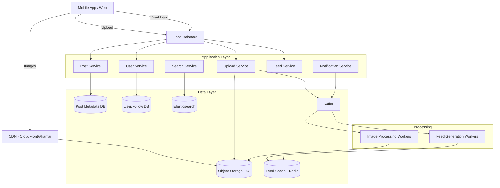
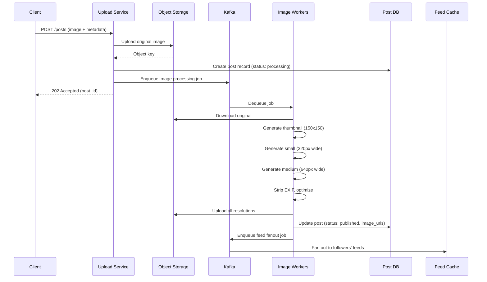
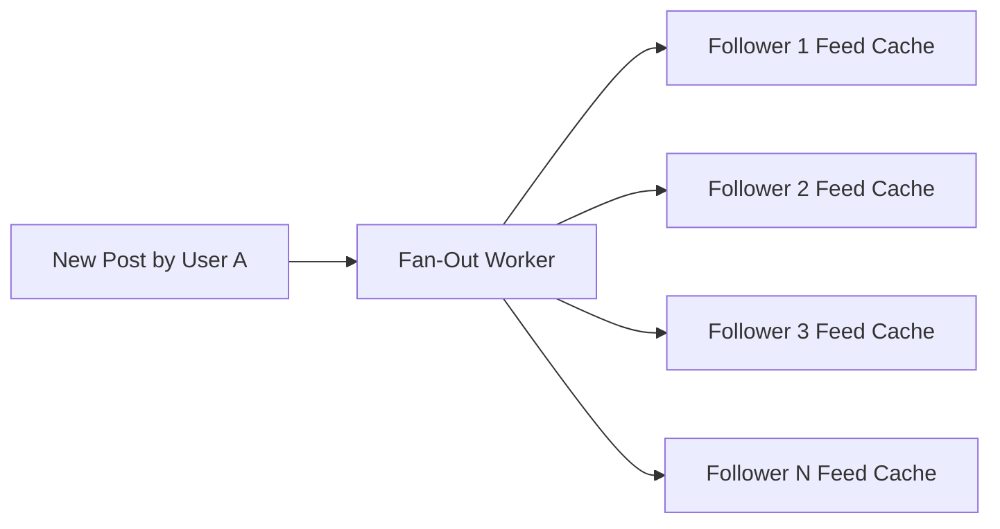
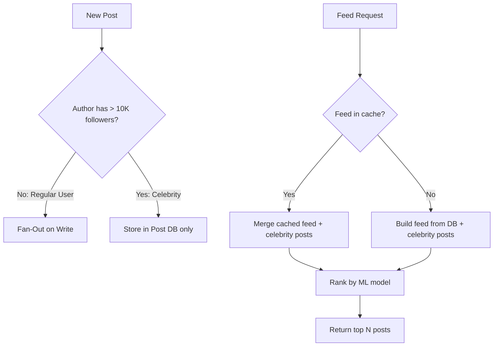
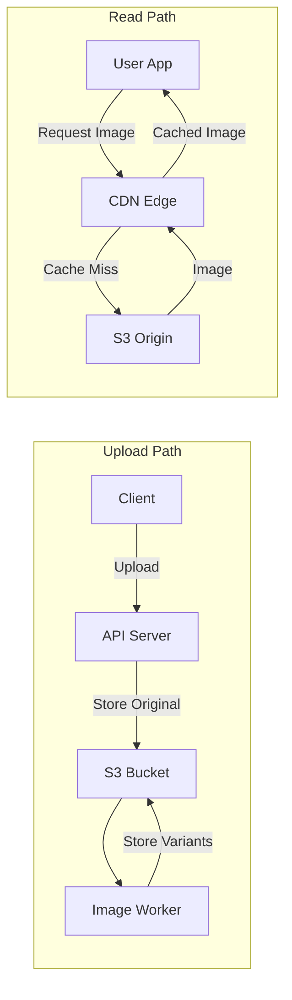
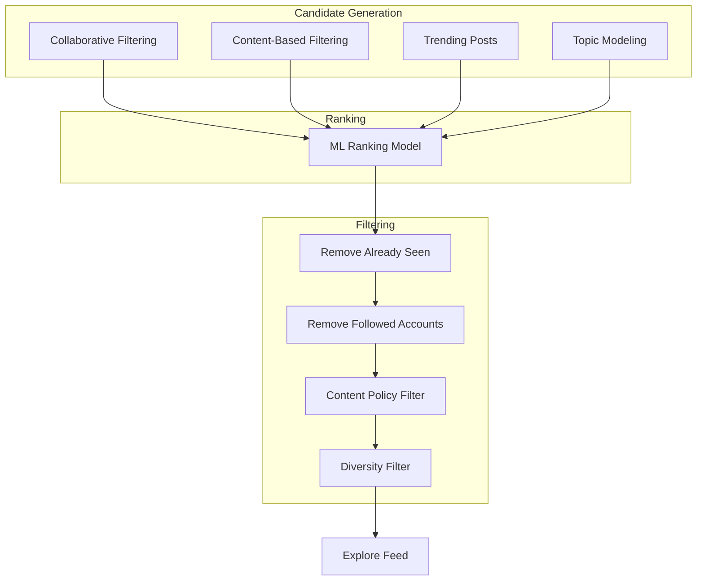
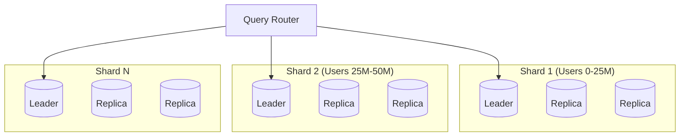
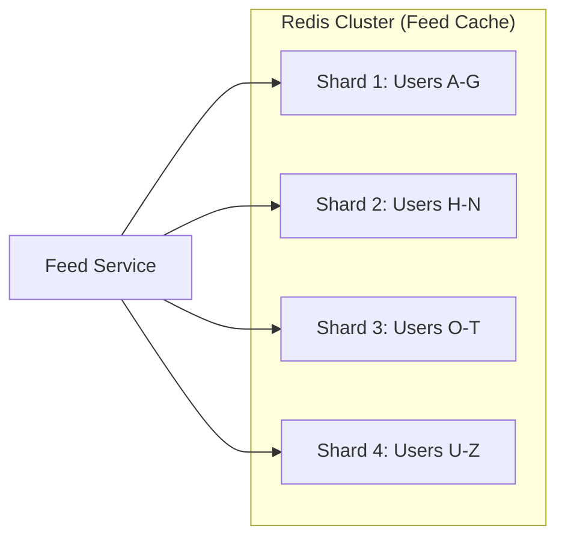
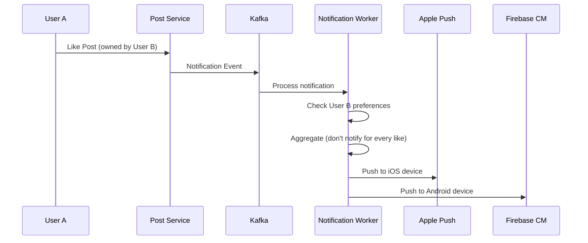

# Design Instagram

Instagram is a photo and video sharing social network. Designing it covers image storage and processing, CDN distribution, news feed generation (fan-out), the celebrity problem, stories, and explore/recommendation features.

---

## 1. Problem Statement & Requirements

### Functional Requirements

1. **Upload photos/videos** — Users can upload images and short videos with captions and tags
2. **News Feed** — Users see a feed of posts from people they follow, ranked by relevance
3. **Follow/Unfollow** — Users can follow other users (asymmetric relationship)
4. **Like and Comment** — Users can interact with posts
5. **Stories** — Ephemeral content that disappears after 24 hours
6. **Explore page** — Discover content from accounts the user doesn't follow
7. **Search** — Search for users, hashtags, and locations
8. **Notifications** — Push notifications for likes, comments, follows, mentions

### Non-Functional Requirements

1. **High availability** — 99.99% uptime
2. **Low latency** — Feed loads in < 200ms (p99)
3. **Consistency** — Eventual consistency is acceptable for feed; strong for likes/follows
4. **Scale** — 500M DAU, 2B total users
5. **Storage** — Must handle petabytes of media
6. **Upload reliability** — No photo should be lost once upload completes

### Clarifying Questions

::: tip Questions to Ask
- What is the read-to-write ratio? (Instagram is heavily read-heavy, ~1000:1)
- What image resolutions and formats do we support?
- Do we need to support video? If so, what length limits?
- Is the feed chronological or algorithmic?
- Do we need to support direct messages? (Usually out of scope)
- What is the average number of follows per user?
:::

---

## 2. Back-of-Envelope Estimation

### User and Content Scale

- 500M DAU, 2B total accounts
- Average user follows 200 accounts
- 100M photos uploaded per day
- Average photo size: 2MB (original), 200KB (compressed for feed)
- Each photo stored in 4 resolutions: thumbnail (10KB), small (50KB), medium (200KB), original (2MB)

### QPS Estimation

**Photo uploads:**

$$
\text{Upload QPS} = \frac{100M}{86400} \approx 1{,}157 \text{ QPS}
$$

$$
\text{Peak Upload QPS} \approx 1{,}157 \times 3 \approx 3{,}500 \text{ QPS}
$$

**Feed reads (each DAU loads feed ~10 times/day):**

$$
\text{Feed QPS} = \frac{500M \times 10}{86400} \approx 57{,}870 \text{ QPS}
$$

$$
\text{Peak Feed QPS} \approx 57{,}870 \times 3 \approx 174K \text{ QPS}
$$

### Storage Estimation

**Daily photo storage:**

$$
100M \times (2MB + 200KB + 50KB + 10KB) = 100M \times 2.26MB \approx 226 \text{ TB/day}
$$

**Annual storage:**

$$
226 \text{ TB/day} \times 365 = 82.5 \text{ PB/year}
$$

### Bandwidth Estimation

**Ingress (uploads):**

$$
3{,}500 \text{ QPS} \times 2MB = 7 \text{ GB/s}
$$

**Egress (feed reads — each feed load fetches ~20 images at 200KB):**

$$
174K \text{ QPS} \times 20 \times 200KB = 696 \text{ GB/s}
$$

This massive egress is why CDN is absolutely critical.

### Memory (Cache)

Cache the 20% hottest content metadata:

$$
0.2 \times 500M \text{ DAU} \times 1KB \text{ (feed metadata per user)} = 100 \text{ GB}
$$

---

## 3. High-Level Design



### API Design

```typescript
// Upload a photo
// POST /api/v1/posts
interface CreatePostRequest {
  image: File;                  // multipart upload
  caption?: string;
  location?: { lat: number; lng: number; name: string };
  tags?: string[];              // hashtags
  mentionedUsers?: string[];
}

interface PostResponse {
  id: string;
  userId: string;
  imageUrls: {
    thumbnail: string;
    small: string;
    medium: string;
    original: string;
  };
  caption: string;
  likeCount: number;
  commentCount: number;
  createdAt: string;
}

// Get news feed
// GET /api/v1/feed?cursor=xxx&limit=20
interface FeedResponse {
  posts: PostResponse[];
  cursor: string | null;
  hasMore: boolean;
}

// Follow a user
// POST /api/v1/users/:userId/follow
// Response: 204 No Content

// Like a post
// POST /api/v1/posts/:postId/like
// Response: 204 No Content

// Add a comment
// POST /api/v1/posts/:postId/comments
interface CommentRequest {
  text: string;
  replyToCommentId?: string;
}

// Get stories
// GET /api/v1/stories/feed
interface StoriesFeedResponse {
  stories: Array<{
    userId: string;
    username: string;
    avatarUrl: string;
    items: StoryItem[];
    hasUnseenItems: boolean;
  }>;
}
```

---

## 4. Database Schema

### Post Metadata (PostgreSQL, sharded by user_id)

```sql
CREATE TABLE posts (
    id              UUID PRIMARY KEY DEFAULT gen_random_uuid(),
    user_id         BIGINT NOT NULL,
    caption         TEXT,
    image_key       VARCHAR(255) NOT NULL,  -- S3 object key
    location_name   VARCHAR(255),
    latitude        DECIMAL(10, 8),
    longitude       DECIMAL(11, 8),
    like_count      INT DEFAULT 0,
    comment_count   INT DEFAULT 0,
    created_at      TIMESTAMP WITH TIME ZONE DEFAULT NOW(),
    is_deleted      BOOLEAN DEFAULT FALSE
);

CREATE INDEX idx_posts_user_id_created ON posts(user_id, created_at DESC);
CREATE INDEX idx_posts_created_at ON posts(created_at DESC);

-- Hashtags
CREATE TABLE hashtags (
    id              SERIAL PRIMARY KEY,
    tag             VARCHAR(100) UNIQUE NOT NULL
);

CREATE TABLE post_hashtags (
    post_id         UUID REFERENCES posts(id),
    hashtag_id      INT REFERENCES hashtags(id),
    PRIMARY KEY (post_id, hashtag_id)
);

CREATE INDEX idx_post_hashtags_hashtag ON post_hashtags(hashtag_id);
```

### User and Social Graph (PostgreSQL or dedicated graph store)

```sql
CREATE TABLE users (
    id              BIGSERIAL PRIMARY KEY,
    username        VARCHAR(30) UNIQUE NOT NULL,
    email           VARCHAR(255) UNIQUE NOT NULL,
    display_name    VARCHAR(100),
    bio             TEXT,
    avatar_url      VARCHAR(500),
    follower_count  INT DEFAULT 0,
    following_count INT DEFAULT 0,
    is_verified     BOOLEAN DEFAULT FALSE,
    is_private      BOOLEAN DEFAULT FALSE,
    created_at      TIMESTAMP WITH TIME ZONE DEFAULT NOW()
);

CREATE TABLE follows (
    follower_id     BIGINT NOT NULL,
    followee_id     BIGINT NOT NULL,
    created_at      TIMESTAMP WITH TIME ZONE DEFAULT NOW(),
    PRIMARY KEY (follower_id, followee_id)
);

CREATE INDEX idx_follows_followee ON follows(followee_id);
CREATE INDEX idx_follows_follower ON follows(follower_id);
```

### Likes and Comments

```sql
CREATE TABLE likes (
    user_id         BIGINT NOT NULL,
    post_id         UUID NOT NULL,
    created_at      TIMESTAMP WITH TIME ZONE DEFAULT NOW(),
    PRIMARY KEY (user_id, post_id)
);

CREATE INDEX idx_likes_post_id ON likes(post_id);

CREATE TABLE comments (
    id              UUID PRIMARY KEY DEFAULT gen_random_uuid(),
    post_id         UUID NOT NULL,
    user_id         BIGINT NOT NULL,
    parent_id       UUID,  -- for nested replies
    text            TEXT NOT NULL,
    like_count      INT DEFAULT 0,
    created_at      TIMESTAMP WITH TIME ZONE DEFAULT NOW(),
    is_deleted      BOOLEAN DEFAULT FALSE
);

CREATE INDEX idx_comments_post_id ON comments(post_id, created_at);
```

### Feed Cache (Redis)

```
Key: feed:{userId}
Type: Sorted Set
Score: post timestamp (epoch ms)
Member: post_id

Key: story:{userId}
Type: List
Members: JSON-encoded story items with TTL metadata
```

### Partitioning Strategy

- **Posts table:** Shard by `user_id` hash — user's posts are co-located for profile page queries
- **Follows table:** Shard by `follower_id` — efficient "who do I follow?" queries
- **Likes table:** Shard by `post_id` — efficient "who liked this?" queries
- **Comments table:** Shard by `post_id` — all comments for a post are co-located

---

## 5. Detailed Component Design

### 5.1 Image Upload Pipeline



```typescript
class ImageProcessingWorker {
  async processImage(job: ImageJob): Promise<void> {
    const { postId, s3Key, userId } = job;

    // 1. Download original from S3
    const original = await this.s3.getObject(s3Key);

    // 2. Generate multiple resolutions
    const variants = await Promise.all([
      this.resize(original, { width: 150, height: 150, fit: 'cover' }),  // thumbnail
      this.resize(original, { width: 320, fit: 'inside' }),              // small
      this.resize(original, { width: 640, fit: 'inside' }),              // medium
      this.resize(original, { width: 1080, fit: 'inside' }),             // large
    ]);

    // 3. Strip EXIF data for privacy, convert to WebP
    const optimized = await Promise.all(
      variants.map(v => this.optimizeImage(v, { format: 'webp', quality: 80 }))
    );

    // 4. Upload all variants to S3
    const keys = await Promise.all(
      optimized.map((img, i) => {
        const suffix = ['thumb', 'small', 'medium', 'large'][i];
        return this.s3.putObject(`posts/${userId}/${postId}_${suffix}.webp`, img);
      })
    );

    // 5. Update post record
    await this.db.query(
      `UPDATE posts SET status = 'published', image_variants = $1 WHERE id = $2`,
      [JSON.stringify(keys), postId]
    );

    // 6. Trigger feed fanout
    await this.kafka.send('feed-fanout', { postId, userId });
  }

  private async resize(
    image: Buffer,
    options: { width: number; height?: number; fit: string }
  ): Promise<Buffer> {
    // Using sharp library
    return sharp(image)
      .resize(options.width, options.height, { fit: options.fit as any })
      .toBuffer();
  }

  private async optimizeImage(
    image: Buffer,
    options: { format: string; quality: number }
  ): Promise<Buffer> {
    return sharp(image)
      .webp({ quality: options.quality })
      .toBuffer();
  }
}
```

### 5.2 News Feed Generation

This is the hardest part of the Instagram design. There are two fundamental approaches:

#### Fan-Out on Write (Push Model)

When a user posts, push the post ID to all followers' feed caches.



```typescript
class FanOutOnWriteService {
  async fanOut(postId: string, authorId: string): Promise<void> {
    // Get all followers of the author
    const followers = await this.getFollowers(authorId);
    const postTimestamp = Date.now();

    // Fan out to each follower's feed cache
    const pipeline = this.redis.pipeline();
    for (const followerId of followers) {
      // Add to sorted set (score = timestamp for ordering)
      pipeline.zadd(`feed:${followerId}`, postTimestamp, postId);
      // Trim to keep only latest 800 posts
      pipeline.zremrangebyrank(`feed:${followerId}`, 0, -801);
    }
    await pipeline.exec();
  }

  private async getFollowers(userId: string): Promise<string[]> {
    return this.db.query(
      'SELECT follower_id FROM follows WHERE followee_id = $1',
      [userId]
    ).then(rows => rows.map(r => r.follower_id));
  }
}
```

**Pros:**
- Feed reads are O(1) — just read from Redis sorted set
- Low read latency (< 10ms)

**Cons:**
- Slow writes for users with millions of followers (celebrity problem)
- Wastes memory for inactive users
- Fan-out latency: a user with 10M followers takes minutes

#### Fan-Out on Read (Pull Model)

When a user opens their feed, fetch recent posts from all accounts they follow.

```typescript
class FanOutOnReadService {
  async getFeed(userId: string, cursor: string, limit: number): Promise<Post[]> {
    // Get list of accounts the user follows
    const following = await this.getFollowing(userId);

    // Fetch recent posts from each followed account
    const allPosts = await Promise.all(
      following.map(followeeId =>
        this.db.query(
          'SELECT * FROM posts WHERE user_id = $1 AND created_at > $2 ORDER BY created_at DESC LIMIT 5',
          [followeeId, cursor]
        )
      )
    );

    // Merge and sort
    const merged = allPosts.flat().sort((a, b) => b.created_at - a.created_at);
    return merged.slice(0, limit);
  }
}
```

**Pros:**
- No fan-out delay on write
- No wasted storage for inactive users

**Cons:**
- Slow reads: O(following_count) queries per feed request
- High read latency for users who follow thousands of accounts

#### Hybrid Approach (What Instagram Actually Does)



```typescript
class HybridFeedService {
  private readonly CELEBRITY_THRESHOLD = 10_000;

  async onNewPost(postId: string, authorId: string): Promise<void> {
    const followerCount = await this.getFollowerCount(authorId);

    if (followerCount <= this.CELEBRITY_THRESHOLD) {
      // Regular user: fan-out on write
      await this.fanOutOnWrite(postId, authorId);
    } else {
      // Celebrity: just store in post table, merge at read time
      // Post is already in the database — nothing extra to do
    }
  }

  async getFeed(userId: string, cursor: string, limit: number = 20): Promise<Post[]> {
    // 1. Get pre-computed feed from cache (fan-out on write results)
    const cachedPostIds = await this.redis.zrevrangebyscore(
      `feed:${userId}`,
      '+inf',
      cursor || '0',
      'LIMIT', 0, limit * 2
    );

    // 2. Get celebrity accounts the user follows
    const celebrityIds = await this.getCelebrityFollowees(userId);

    // 3. Fetch recent posts from celebrities (fan-out on read)
    const celebrityPosts = await this.fetchRecentPosts(celebrityIds, cursor, 5);

    // 4. Fetch full post objects for cached IDs
    const cachedPosts = await this.fetchPostsByIds(cachedPostIds);

    // 5. Merge, deduplicate, and rank
    const allPosts = [...cachedPosts, ...celebrityPosts];
    const ranked = await this.rankingService.rank(userId, allPosts);

    return ranked.slice(0, limit);
  }

  private async getCelebrityFollowees(userId: string): Promise<string[]> {
    return this.db.query(`
      SELECT f.followee_id FROM follows f
      JOIN users u ON f.followee_id = u.id
      WHERE f.follower_id = $1 AND u.follower_count > $2
    `, [userId, this.CELEBRITY_THRESHOLD]).then(rows => rows.map(r => r.followee_id));
  }
}
```

### 5.3 Feed Ranking

Instagram uses an ML-based ranking model. In an interview, describe the high-level approach:

```typescript
class FeedRankingService {
  async rank(userId: string, posts: Post[]): Promise<Post[]> {
    const userFeatures = await this.getUserFeatures(userId);

    const scoredPosts = posts.map(post => ({
      post,
      score: this.calculateScore(userFeatures, post),
    }));

    return scoredPosts
      .sort((a, b) => b.score - a.score)
      .map(sp => sp.post);
  }

  private calculateScore(userFeatures: UserFeatures, post: Post): number {
    // Simplified scoring model — real systems use deep learning
    let score = 0;

    // Recency (exponential decay)
    const ageHours = (Date.now() - post.createdAt) / 3600000;
    score += Math.exp(-0.1 * ageHours) * 100;

    // Engagement signals
    score += Math.log1p(post.likeCount) * 10;
    score += Math.log1p(post.commentCount) * 15;

    // Relationship strength (how often does this user interact with the author?)
    const interactionScore = userFeatures.interactionHistory[post.userId] || 0;
    score += interactionScore * 50;

    // Content type preference
    if (userFeatures.preferredContentTypes.includes(post.contentType)) {
      score *= 1.2;
    }

    // Diversity penalty (don't show too many posts from same author)
    // Handled at the final selection stage

    return score;
  }
}
```

### 5.4 Image Storage and CDN



**S3 bucket structure:**

```
s3://instagram-media/
  posts/
    {user_id}/
      {post_id}_original.jpg
      {post_id}_large.webp
      {post_id}_medium.webp
      {post_id}_small.webp
      {post_id}_thumb.webp
  avatars/
    {user_id}_avatar.webp
  stories/
    {user_id}/
      {story_id}.webp
```

**CDN configuration:**

```typescript
const cdnConfig = {
  provider: 'CloudFront',
  origins: [
    { domain: 'instagram-media.s3.amazonaws.com', path: '/*' }
  ],
  cachePolicy: {
    defaultTTL: 86400 * 30,  // 30 days for images
    maxTTL: 86400 * 365,     // 1 year max
  },
  edgeLocations: 400,        // Worldwide
  compressionEnabled: true,
  httpVersions: ['HTTP/2', 'HTTP/3'],
  priceClass: 'PriceClass_All',
};
```

### 5.5 Stories

Stories are ephemeral content that expires after 24 hours.

```typescript
class StoryService {
  async createStory(userId: string, media: Buffer, type: 'image' | 'video'): Promise<void> {
    const storyId = generateUUID();
    const expiresAt = Date.now() + 24 * 3600 * 1000;

    // 1. Upload media to S3
    const mediaKey = `stories/${userId}/${storyId}.webp`;
    await this.s3.putObject(mediaKey, media);

    // 2. Store metadata with TTL
    await this.redis.zadd(`stories:${userId}`, expiresAt, JSON.stringify({
      id: storyId,
      mediaUrl: `https://cdn.instagram.com/${mediaKey}`,
      type,
      createdAt: Date.now(),
      expiresAt,
    }));

    // 3. Set key expiration (auto-cleanup)
    await this.redis.expireat(`stories:${userId}`, Math.ceil(expiresAt / 1000));

    // 4. Notify followers
    await this.notifyFollowers(userId, 'new_story');
  }

  async getStoriesFeed(userId: string): Promise<StoryFeed[]> {
    const following = await this.getFollowing(userId);
    const now = Date.now();

    const stories: StoryFeed[] = [];
    for (const followeeId of following) {
      const items = await this.redis.zrangebyscore(
        `stories:${followeeId}`,
        now,       // Only items not yet expired
        '+inf'
      );

      if (items.length > 0) {
        const seen = await this.redis.sismember(`stories:seen:${userId}`, followeeId);
        stories.push({
          userId: followeeId,
          items: items.map(i => JSON.parse(i)),
          hasSeen: !!seen,
        });
      }
    }

    // Sort: unseen stories first, then by recency
    return stories.sort((a, b) => {
      if (a.hasSeen !== b.hasSeen) return a.hasSeen ? 1 : -1;
      return b.items[0].createdAt - a.items[0].createdAt;
    });
  }
}
```

### 5.6 Explore Page

The Explore page shows content from accounts the user does not follow, personalized by their interests.



```typescript
class ExploreService {
  async getExplore(userId: string, limit: number = 30): Promise<Post[]> {
    // 1. Generate candidates from multiple sources
    const [collaborative, contentBased, trending] = await Promise.all([
      this.collaborativeFilter(userId, 100),
      this.contentBasedFilter(userId, 100),
      this.getTrendingPosts(50),
    ]);

    // 2. Merge and deduplicate candidates
    const candidates = this.deduplicateAndMerge(collaborative, contentBased, trending);

    // 3. Filter out already-seen and followed accounts
    const following = new Set(await this.getFollowing(userId));
    const seen = new Set(await this.getRecentlySeen(userId));

    const filtered = candidates.filter(
      post => !following.has(post.userId) && !seen.has(post.id)
    );

    // 4. Rank by engagement prediction
    const ranked = await this.rankingService.rank(userId, filtered);

    // 5. Apply diversity: no more than 2 posts from same account
    return this.applyDiversity(ranked, limit, 2);
  }

  private async collaborativeFilter(userId: string, limit: number): Promise<Post[]> {
    // Find users with similar engagement patterns
    // Fetch their recent engaged posts that this user hasn't seen
    const similarUsers = await this.getSimilarUsers(userId, 50);
    const posts = await this.getRecentEngagedPosts(similarUsers, limit);
    return posts;
  }
}
```

---

## 6. Scaling & Bottlenecks

### What Breaks First?

| Scale | Bottleneck | Solution |
|-------|-----------|----------|
| 1M DAU | Single DB | Read replicas, basic caching |
| 10M DAU | Feed generation latency | Fan-out on write with Redis |
| 100M DAU | Storage costs, CDN egress | Multi-tier storage, CDN optimization |
| 500M DAU | Fan-out for celebrities | Hybrid fan-out, feed ranking |
| 1B+ DAU | Everything | Multi-region, ML-based ranking, custom infrastructure |

### Database Scaling



**Sharding strategy:**
- Shard posts by `user_id` — all of a user's posts on one shard
- Shard follows by `follower_id` — efficient "who do I follow?" queries
- Cross-shard queries (e.g., "who follows me?") use a secondary index or denormalized table

### Image Storage Optimization

```typescript
// Multi-tier storage based on access recency
const storageTiers = {
  hot: {
    storage: 'S3 Standard',
    age: '0-30 days',
    cost: '$0.023/GB/month',
  },
  warm: {
    storage: 'S3 Intelligent-Tiering',
    age: '30-180 days',
    cost: '$0.0125/GB/month',
  },
  cold: {
    storage: 'S3 Glacier Instant Retrieval',
    age: '180+ days',
    cost: '$0.004/GB/month',
  },
};

// Lifecycle policy
const lifecycleRules = [
  {
    transition: { days: 30, storageClass: 'INTELLIGENT_TIERING' },
  },
  {
    transition: { days: 180, storageClass: 'GLACIER_INSTANT_RETRIEVAL' },
  },
];
```

### Feed Cache Architecture



Each Redis shard stores sorted sets of post IDs for user feeds:
- ~500M users, but only cache for active users (~100M)
- Each feed: 800 post IDs x 8 bytes = 6.4KB per user
- Total: 100M x 6.4KB = 640 GB across the cluster

### CDN Strategy

At 696 GB/s egress, CDN is the largest cost center:

- **Cache hit ratio target:** > 95% (most images are viewed multiple times)
- **Edge locations:** 400+ worldwide
- **Content addressing:** Use content-hash-based URLs for infinite caching
- **Image format negotiation:** Serve WebP to supported browsers, JPEG to others
- **Lazy loading:** Only load images as user scrolls into view

---

## 7. Trade-offs & Alternatives

### Fan-Out on Write vs Read vs Hybrid

| Approach | Write Latency | Read Latency | Memory | Best For |
|----------|--------------|-------------|--------|----------|
| Fan-out on write | High (O(followers)) | Low (O(1)) | High | Regular users |
| Fan-out on read | Low (O(1)) | High (O(following)) | Low | Celebrities |
| Hybrid | Medium | Low-Medium | Medium | Production systems |

### SQL vs NoSQL for Posts

| Criterion | PostgreSQL | Cassandra |
|-----------|-----------|-----------|
| Schema | Rigid, migrations | Flexible |
| Write throughput | ~50K QPS | ~500K QPS |
| Read pattern | Flexible queries | Key-value optimized |
| Consistency | Strong | Tunable |
| Operational complexity | Moderate | High |
| **Best for** | < 100M posts | > 100M posts |

Instagram historically used PostgreSQL with heavy sharding and eventually moved to Cassandra for certain workloads.

### Consistency Choices

| Data | Consistency | Why |
|------|------------|-----|
| Post creation | Strong | Users must see their own posts immediately |
| Like/comment counts | Eventual | Slight delay is acceptable |
| Feed ordering | Eventual | Feed can be slightly stale |
| Follow/unfollow | Strong | Must take effect immediately for privacy |
| User profiles | Read-your-writes | User sees own changes; others see eventual |

---

## 8. Advanced Topics

### 8.1 Content Moderation

```typescript
class ContentModerationService {
  async moderateImage(imageBuffer: Buffer, postId: string): Promise<ModerationResult> {
    // 1. Run through ML model (e.g., AWS Rekognition, Google Vision)
    const mlResult = await this.mlService.detectUnsafeContent(imageBuffer);

    if (mlResult.confidence > 0.95 && mlResult.categories.includes('explicit')) {
      // Auto-remove high-confidence violations
      await this.removePost(postId, 'auto_moderation');
      return { action: 'removed', reason: 'explicit_content' };
    }

    if (mlResult.confidence > 0.7) {
      // Queue for human review
      await this.moderationQueue.add(postId, mlResult);
      return { action: 'queued_for_review', reason: mlResult.categories };
    }

    return { action: 'approved' };
  }
}
```

### 8.2 Notification Fan-Out



### 8.3 Search

Instagram search covers users, hashtags, and locations:

```typescript
// Elasticsearch mapping for posts
const postMapping = {
  properties: {
    caption: { type: 'text', analyzer: 'standard' },
    hashtags: { type: 'keyword' },
    location_name: { type: 'text' },
    location: { type: 'geo_point' },
    user_id: { type: 'long' },
    created_at: { type: 'date' },
    engagement_score: { type: 'float' },
  }
};

// Search query
async function searchPosts(query: string, userId: string): Promise<Post[]> {
  const results = await elasticsearch.search({
    index: 'posts',
    body: {
      query: {
        bool: {
          must: [
            {
              multi_match: {
                query,
                fields: ['caption', 'hashtags^2', 'location_name'],
              }
            }
          ],
          should: [
            // Boost posts from followed accounts
            { terms: { user_id: await getFollowing(userId), boost: 2.0 } },
            // Boost recent posts
            { range: { created_at: { gte: 'now-7d', boost: 1.5 } } },
          ]
        }
      },
      sort: [
        { _score: 'desc' },
        { engagement_score: 'desc' },
      ]
    }
  });

  return results.hits.hits.map(h => h._source);
}
```

### 8.4 Anti-Spam and Bot Detection

```typescript
class SpamDetector {
  async checkForSpam(userId: string, action: string): Promise<boolean> {
    const key = `spam:${userId}:${action}`;

    // Rate-based detection
    const recentActions = await this.redis.incr(key);
    if (recentActions === 1) await this.redis.expire(key, 3600);

    const limits: Record<string, number> = {
      like: 350,       // Max 350 likes per hour
      comment: 60,     // Max 60 comments per hour
      follow: 60,      // Max 60 follows per hour
      post: 25,        // Max 25 posts per hour
    };

    if (recentActions > (limits[action] || 100)) {
      await this.flagAccount(userId, `rate_limit_exceeded:${action}`);
      return true;
    }

    return false;
  }
}
```

---

## 9. Interview Tips

### What Interviewers Look For

1. **Feed generation strategy** — Can you explain fan-out on write vs read and their trade-offs?
2. **Celebrity problem** — Do you identify and solve the high-follower fan-out issue?
3. **Media handling** — Do you separate media storage from metadata?
4. **CDN understanding** — Can you explain why CDN is critical and how caching works?
5. **Scale estimation** — Can you estimate storage for petabytes of images?

### Common Follow-Up Questions

::: details "How do you handle the celebrity problem?"
Use a hybrid fan-out approach. Users with > 10K followers don't trigger fan-out on write. Instead, their posts are fetched at read time and merged with the pre-computed feed. This bounds the write fan-out while keeping reads fast for the common case.
:::

::: details "How do you rank the feed?"
Use an ML model that considers: recency (exponential decay), engagement signals (likes, comments, shares), relationship strength (past interactions between viewer and author), content type preference, and diversity constraints. The model predicts the probability of engagement for each candidate post.
:::

::: details "How do you handle image uploads from slow connections?"
Use resumable uploads (tus protocol). The client uploads in chunks, and the server tracks progress. If the connection drops, the client resumes from the last completed chunk. Return 202 Accepted immediately and process images asynchronously.
:::

::: details "What happens when a user with 100M followers posts?"
In the hybrid model, this post is NOT fanned out on write. It is stored in the post table. When any follower opens their feed, the feed service fetches recent posts from celebrity accounts they follow and merges them with the pre-computed cache. This adds ~10-50ms of latency per celebrity but avoids the impossible fan-out to 100M feed caches.
:::

::: details "How do you handle feed pagination?"
Use cursor-based pagination with the post timestamp as the cursor. The client sends the timestamp of the oldest post it has seen, and the server returns the next batch of posts older than that cursor. This is stable even as new posts arrive.
:::

### Time Allocation (45-minute interview)

| Phase | Time | Focus |
|-------|------|-------|
| Requirements | 5 min | Functional + non-functional, clarify scale |
| Estimation | 4 min | QPS, storage (especially media), bandwidth |
| High-level design | 10 min | Architecture diagram with upload + feed paths |
| Feed generation | 12 min | Fan-out strategies, celebrity problem, ranking |
| Image pipeline | 7 min | Upload, processing, CDN, storage tiers |
| Scaling | 5 min | Sharding, multi-region, cache sizing |
| Q&A | 2 min | Follow-up questions |

::: info War Story
Instagram originally ran on a single Django server with PostgreSQL. As they scaled to millions of users, the feed became the primary bottleneck. They moved from chronological feed to algorithmic ranking, which increased engagement by 5-8%. The key insight: most users follow more accounts than they can reasonably consume, so showing "best" content first is strictly better than chronological for user satisfaction. However, this decision was controversial and required significant ML infrastructure investment.
:::

---

## Summary

| Component | Technology | Scale |
|-----------|-----------|-------|
| Image Storage | S3 with lifecycle policies | 82 PB/year |
| CDN | CloudFront (400+ edge locations) | 696 GB/s egress |
| Post Metadata | PostgreSQL (sharded by user_id) | 100M new posts/day |
| Feed Cache | Redis Cluster | 640 GB, 174K QPS |
| Feed Generation | Hybrid fan-out | Handles celebrity problem |
| Image Processing | Worker pool (Sharp/FFmpeg) | 3.5K images/sec |
| Search | Elasticsearch | Users, hashtags, locations |
| Analytics | Kafka + ClickHouse | Real-time engagement metrics |
