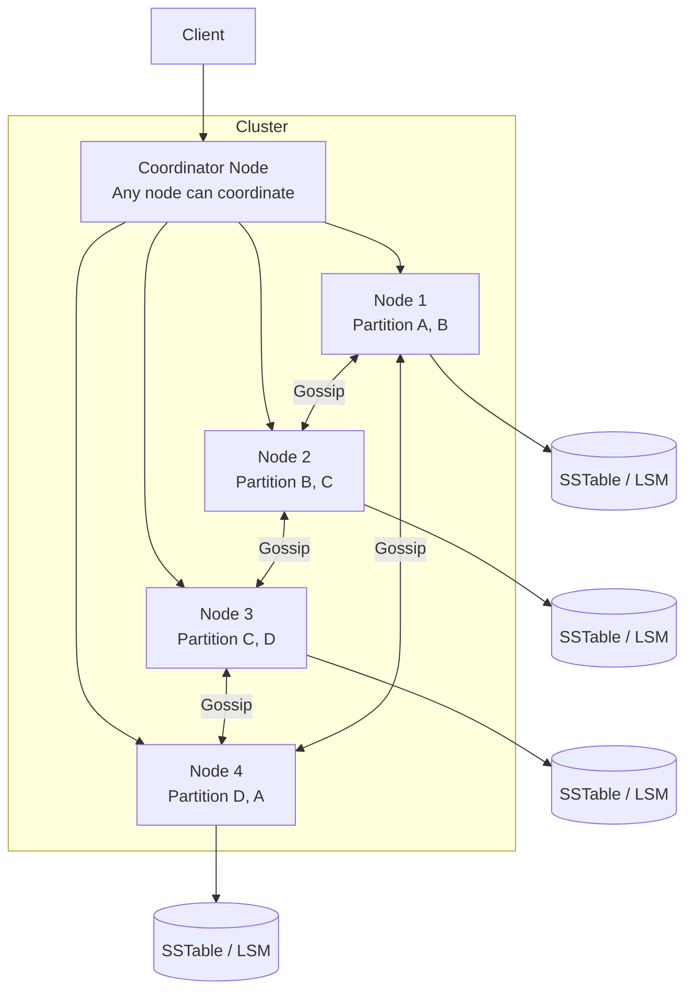
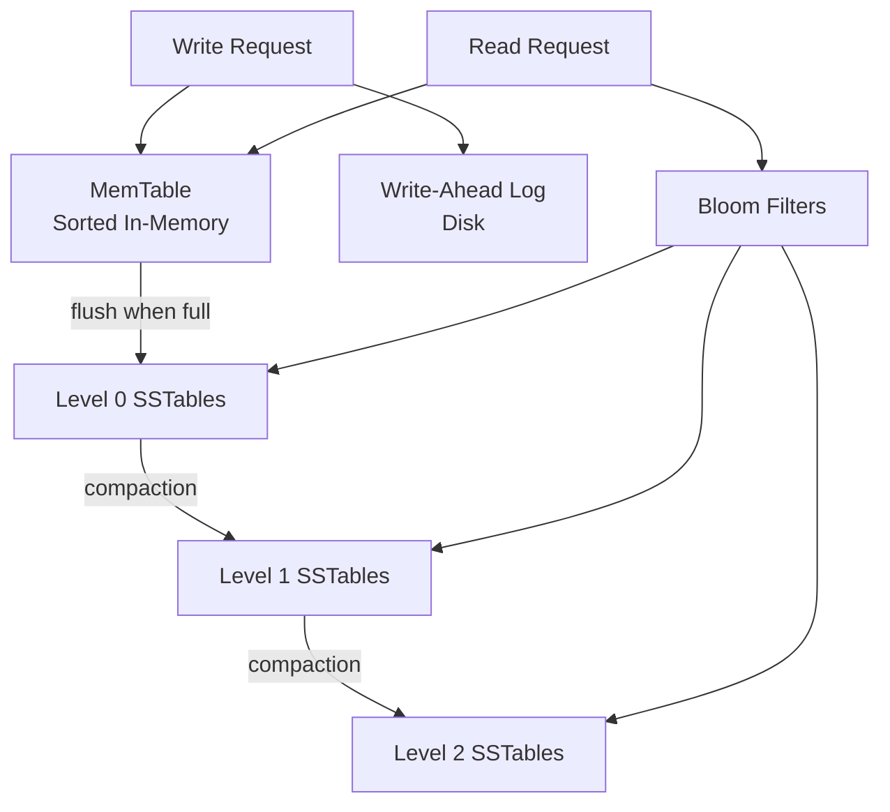
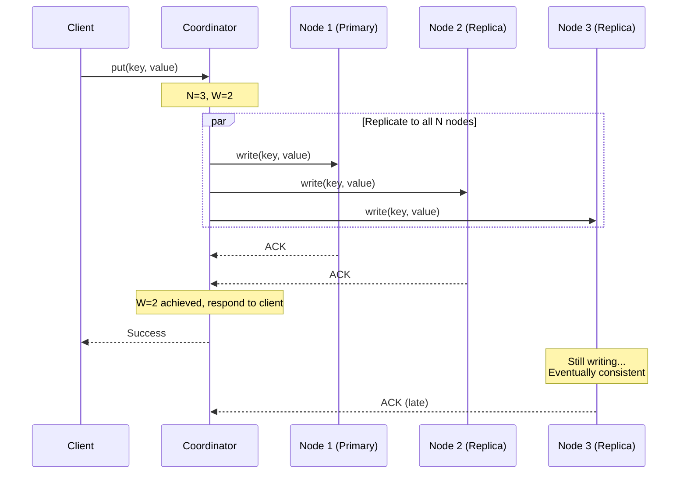
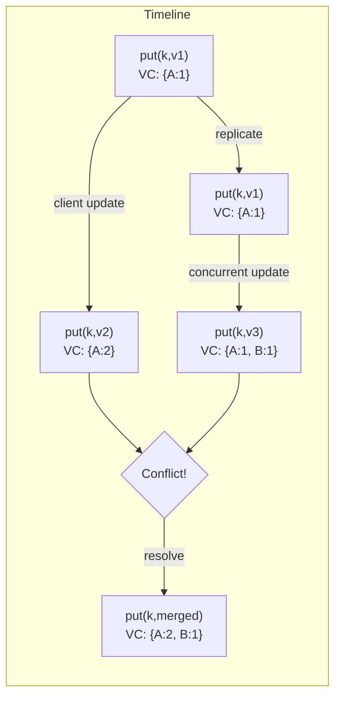
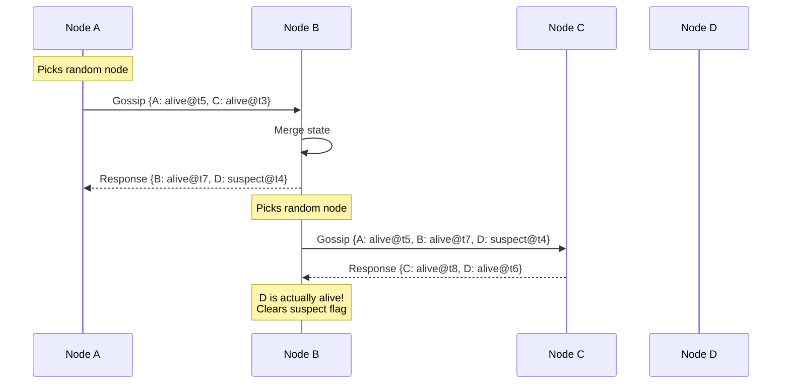
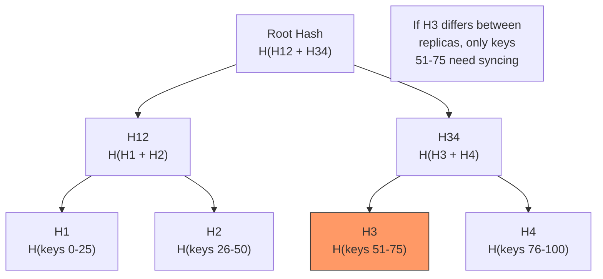

# Design a Distributed Key-Value Store

## 1. Problem Statement & Requirements

Design a distributed key-value store like Amazon DynamoDB, Apache Cassandra, or Riak. The system stores key-value pairs across a cluster of machines with high availability and partition tolerance.

### Functional Requirements

| # | Requirement |
|---|-------------|
| FR-1 | `put(key, value)` -- store a key-value pair |
| FR-2 | `get(key)` -- retrieve the value for a key |
| FR-3 | `delete(key)` -- remove a key-value pair |
| FR-4 | Automatic data partitioning across nodes |
| FR-5 | Configurable replication factor (N) |
| FR-6 | Tunable consistency (R/W quorum) |
| FR-7 | Cluster membership management (add/remove nodes) |

### Non-Functional Requirements

| # | Requirement | Target |
|---|-------------|--------|
| NFR-1 | Availability | 99.99% (AP system) |
| NFR-2 | Read latency | p99 < 10 ms |
| NFR-3 | Write latency | p99 < 10 ms |
| NFR-4 | Scalability | Linear with nodes (1000+ nodes) |
| NFR-5 | Durability | Zero data loss (replicated) |
| NFR-6 | Partition tolerance | Must operate during network partitions |

---

## 2. Back-of-Envelope Estimation

### Traffic

- Read QPS: 500,000
- Write QPS: 100,000
- Average key size: 64 bytes
- Average value size: 1 KB

### Storage (per node)

- Total data: 100 TB
- Number of nodes: 100
- Data per node (with replication factor 3):

$$
\text{Data per node} = \frac{100 \text{ TB} \times 3}{100} = 3 \text{ TB}
$$

### Replication bandwidth

$$
\text{Write bandwidth} = 100{,}000 \times 1 \text{ KB} = 100 \text{ MB/s total}
$$

$$
\text{Replication bandwidth per node} = \frac{100 \text{ MB/s} \times 3}{100} = 3 \text{ MB/s}
$$

### Memory for consistent hashing ring

- 100 nodes x 150 virtual nodes each = 15,000 entries
- Each entry: 32 bytes (hash + node address)

$$
\text{Ring size} = 15{,}000 \times 32 = 480 \text{ KB}
$$

---

## 3. High-Level Design



### API Design

```typescript
interface KVStore {
  /**
   * Store a key-value pair.
   * @param key - The key (max 256 bytes)
   * @param value - The value (max 1 MB)
   * @param options - Write options
   */
  put(
    key: string,
    value: Buffer,
    options?: WriteOptions
  ): Promise<WriteResult>;

  /**
   * Retrieve the value for a key.
   * @param key - The key to look up
   * @param options - Read options
   */
  get(
    key: string,
    options?: ReadOptions
  ): Promise<GetResult>;

  /**
   * Delete a key-value pair (tombstone).
   */
  delete(key: string, options?: WriteOptions): Promise<void>;
}

interface WriteOptions {
  consistency?: 'ONE' | 'QUORUM' | 'ALL';
  ttl?: number;            // Time-to-live in seconds
}

interface ReadOptions {
  consistency?: 'ONE' | 'QUORUM' | 'ALL';
}

interface WriteResult {
  version: VectorClock;
  timestamp: number;
}

interface GetResult {
  value: Buffer;
  version: VectorClock;
  timestamp: number;
}
```

---

## 4. Data Storage Design

### LSM Tree Storage Engine



```typescript
interface StorageEngine {
  put(key: string, value: Buffer, timestamp: number): Promise<void>;
  get(key: string): Promise<{ value: Buffer; timestamp: number } | null>;
  delete(key: string, timestamp: number): Promise<void>;
  scan(startKey: string, endKey: string): AsyncIterator<KeyValuePair>;
}

class LSMTree implements StorageEngine {
  private memTable: SortedMap<string, VersionedValue>;
  private immutableMemTables: SortedMap<string, VersionedValue>[];
  private wal: WriteAheadLog;
  private levels: SSTableLevel[];
  private bloomFilters: Map<string, BloomFilter>;
  private readonly MEM_TABLE_SIZE_BYTES = 64 * 1024 * 1024; // 64 MB

  async put(
    key: string,
    value: Buffer,
    timestamp: number
  ): Promise<void> {
    // 1. Write to WAL first (durability)
    await this.wal.append({ type: 'PUT', key, value, timestamp });

    // 2. Write to MemTable
    this.memTable.set(key, { value, timestamp, deleted: false });

    // 3. Check if MemTable needs flushing
    if (this.memTable.sizeBytes >= this.MEM_TABLE_SIZE_BYTES) {
      await this.flushMemTable();
    }
  }

  async get(key: string): Promise<{ value: Buffer; timestamp: number } | null> {
    // 1. Check MemTable (most recent writes)
    const memResult = this.memTable.get(key);
    if (memResult) {
      return memResult.deleted ? null : memResult;
    }

    // 2. Check immutable MemTables (being flushed)
    for (const imm of this.immutableMemTables) {
      const result = imm.get(key);
      if (result) {
        return result.deleted ? null : result;
      }
    }

    // 3. Check SSTables level by level
    for (const level of this.levels) {
      // Use Bloom filter to skip SSTables that don't contain the key
      for (const sst of level.tables) {
        if (!this.bloomFilters.get(sst.id)?.mightContain(key)) {
          continue; // Definitely not in this SSTable
        }

        const result = await sst.get(key);
        if (result) {
          return result.deleted ? null : result;
        }
      }
    }

    return null; // Key not found
  }

  private async flushMemTable(): Promise<void> {
    // Move current MemTable to immutable list
    const toFlush = this.memTable;
    this.immutableMemTables.push(toFlush);
    this.memTable = new SortedMap();

    // Write SSTable to disk
    const sst = await SSTable.create(toFlush);
    this.levels[0].addTable(sst);

    // Create Bloom filter for new SSTable
    const bloom = BloomFilter.create(toFlush.keys(), 0.01);
    this.bloomFilters.set(sst.id, bloom);

    // Remove from immutable list
    this.immutableMemTables = this.immutableMemTables.filter(
      (m) => m !== toFlush
    );

    // Truncate WAL
    await this.wal.truncate();

    // Trigger compaction if needed
    await this.maybeCompact();
  }
}
```

---

## 5. Detailed Component Design

### 5.1 Consistent Hashing

Consistent hashing distributes data across nodes and minimizes redistribution when nodes are added or removed.

```mermaid
graph TD
    subgraph Hash Ring
        direction TB
        H0["0"] --- H1["Node A (v1)"]
        H1 --- H2["Node B (v1)"]
        H2 --- H3["Node A (v2)"]
        H3 --- H4["Node C (v1)"]
        H4 --- H5["Node B (v2)"]
        H5 --- H6["Node C (v2)"]
        H6 --- H0
    end

    K1["key: 'user:123'<br/>hash: 0x3F..."] -->|"lands between<br/>A(v1) and B(v1)"| H2
    K2["key: 'order:456'<br/>hash: 0xA2..."| ] -->|"lands between<br/>C(v1) and B(v2)"| H5
```

```typescript
class ConsistentHashRing {
  private ring: Map<number, string> = new Map(); // hash -> nodeId
  private sortedHashes: number[] = [];
  private readonly virtualNodes: number;

  constructor(nodes: string[], virtualNodes: number = 150) {
    this.virtualNodes = virtualNodes;
    for (const node of nodes) {
      this.addNode(node);
    }
  }

  addNode(nodeId: string): void {
    for (let i = 0; i < this.virtualNodes; i++) {
      const hash = this.hash(`${nodeId}:${i}`);
      this.ring.set(hash, nodeId);
      this.sortedHashes.push(hash);
    }
    this.sortedHashes.sort((a, b) => a - b);
  }

  removeNode(nodeId: string): void {
    for (let i = 0; i < this.virtualNodes; i++) {
      const hash = this.hash(`${nodeId}:${i}`);
      this.ring.delete(hash);
    }
    this.sortedHashes = this.sortedHashes.filter(
      (h) => this.ring.has(h)
    );
  }

  /**
   * Get the node responsible for a key.
   */
  getNode(key: string): string {
    if (this.ring.size === 0) {
      throw new Error('Ring is empty');
    }

    const hash = this.hash(key);
    // Find the first node clockwise from the key's hash
    const idx = this.findCeiling(hash);
    return this.ring.get(this.sortedHashes[idx])!;
  }

  /**
   * Get N distinct nodes for replication (preference list).
   */
  getPreferenceList(key: string, n: number): string[] {
    if (this.ring.size === 0) {
      throw new Error('Ring is empty');
    }

    const hash = this.hash(key);
    const idx = this.findCeiling(hash);
    const nodes: string[] = [];
    const seen = new Set<string>();

    let current = idx;
    while (nodes.length < n) {
      const nodeId = this.ring.get(this.sortedHashes[current])!;
      if (!seen.has(nodeId)) {
        seen.add(nodeId);
        nodes.push(nodeId);
      }
      current = (current + 1) % this.sortedHashes.length;
      if (current === idx && nodes.length < n) {
        break; // Not enough unique nodes
      }
    }

    return nodes;
  }

  private findCeiling(hash: number): number {
    let lo = 0;
    let hi = this.sortedHashes.length - 1;

    if (hash > this.sortedHashes[hi]) {
      return 0; // Wrap around
    }

    while (lo < hi) {
      const mid = (lo + hi) >> 1;
      if (this.sortedHashes[mid] < hash) {
        lo = mid + 1;
      } else {
        hi = mid;
      }
    }
    return lo;
  }

  private hash(key: string): number {
    // MurmurHash3 for uniform distribution
    let h = 0;
    for (let i = 0; i < key.length; i++) {
      h = Math.imul(h ^ key.charCodeAt(i), 0x5bd1e995);
      h ^= h >>> 13;
      h = Math.imul(h, 0x5bd1e995);
    }
    return h >>> 0; // Convert to unsigned 32-bit
  }
}
```

::: info Why Virtual Nodes?
Without virtual nodes, data distribution is uneven because a few nodes may own large portions of the hash ring. With 150 virtual nodes per physical node, the standard deviation drops from ~50% to ~5%, giving near-uniform distribution.
:::

### 5.2 Replication



```typescript
class ReplicationManager {
  private ring: ConsistentHashRing;
  private nodeClients: Map<string, NodeClient> = new Map();
  private readonly N = 3; // Replication factor
  private readonly W = 2; // Write quorum
  private readonly R = 2; // Read quorum

  async put(
    key: string,
    value: Buffer,
    options?: WriteOptions
  ): Promise<WriteResult> {
    const w = this.getQuorum(options?.consistency, 'write');
    const nodes = this.ring.getPreferenceList(key, this.N);
    const version = VectorClock.increment(
      await this.getCurrentVersion(key),
      this.getLocalNodeId()
    );

    // Send writes to all N replicas in parallel
    const writePromises = nodes.map((nodeId) =>
      this.writeToNode(nodeId, key, value, version)
        .then(() => ({ nodeId, success: true }))
        .catch((err) => ({ nodeId, success: false, error: err }))
    );

    // Wait for W successful writes
    const results = await this.waitForQuorum(writePromises, w);

    if (results.successes < w) {
      throw new Error(
        `Write quorum not met: ${results.successes}/${w}`
      );
    }

    // Trigger hinted handoff for failed nodes
    for (const failed of results.failures) {
      await this.storeHint(failed.nodeId, key, value, version);
    }

    return { version, timestamp: Date.now() };
  }

  async get(
    key: string,
    options?: ReadOptions
  ): Promise<GetResult | null> {
    const r = this.getQuorum(options?.consistency, 'read');
    const nodes = this.ring.getPreferenceList(key, this.N);

    // Read from all N replicas
    const readPromises = nodes.map((nodeId) =>
      this.readFromNode(nodeId, key)
        .then((result) => ({ nodeId, result, success: true }))
        .catch((err) => ({ nodeId, result: null, success: false }))
    );

    const responses = await this.waitForQuorum(readPromises, r);

    if (responses.successes < r) {
      throw new Error(
        `Read quorum not met: ${responses.successes}/${r}`
      );
    }

    // Resolve conflicts using vector clocks
    const validResults = responses.results
      .filter((r) => r.result !== null)
      .map((r) => r.result!);

    if (validResults.length === 0) return null;

    const resolved = this.resolveConflicts(validResults);

    // Read repair: update stale replicas
    await this.readRepair(key, resolved, responses.results);

    return resolved;
  }

  private getQuorum(
    consistency: string | undefined,
    type: 'read' | 'write'
  ): number {
    switch (consistency) {
      case 'ONE': return 1;
      case 'ALL': return this.N;
      case 'QUORUM':
      default:
        return type === 'write' ? this.W : this.R;
    }
  }

  private async waitForQuorum<T extends { success: boolean }>(
    promises: Promise<T>[],
    quorum: number
  ): Promise<{ successes: number; failures: T[]; results: T[] }> {
    const results: T[] = [];
    const failures: T[] = [];
    let successes = 0;

    await Promise.all(
      promises.map(async (p) => {
        const result = await p;
        results.push(result);
        if (result.success) {
          successes++;
        } else {
          failures.push(result);
        }
      })
    );

    return { successes, failures, results };
  }
}
```

### 5.3 Vector Clocks for Conflict Resolution

Vector clocks track causality between events to detect and resolve conflicts.



```typescript
class VectorClock {
  private clock: Map<string, number>;

  constructor(entries?: Map<string, number>) {
    this.clock = entries ?? new Map();
  }

  static increment(
    existing: VectorClock | null,
    nodeId: string
  ): VectorClock {
    const vc = existing
      ? new VectorClock(new Map(existing.clock))
      : new VectorClock();
    const current = vc.clock.get(nodeId) ?? 0;
    vc.clock.set(nodeId, current + 1);
    return vc;
  }

  /**
   * Compare two vector clocks.
   * Returns:
   *   'BEFORE' if this happened before other
   *   'AFTER' if this happened after other
   *   'CONCURRENT' if neither dominates (conflict!)
   *   'EQUAL' if identical
   */
  compare(other: VectorClock): 'BEFORE' | 'AFTER' | 'CONCURRENT' | 'EQUAL' {
    let thisGreater = false;
    let otherGreater = false;

    const allKeys = new Set([
      ...this.clock.keys(),
      ...other.clock.keys(),
    ]);

    for (const key of allKeys) {
      const thisVal = this.clock.get(key) ?? 0;
      const otherVal = other.clock.get(key) ?? 0;

      if (thisVal > otherVal) thisGreater = true;
      if (otherVal > thisVal) otherGreater = true;
    }

    if (!thisGreater && !otherGreater) return 'EQUAL';
    if (thisGreater && !otherGreater) return 'AFTER';
    if (!thisGreater && otherGreater) return 'BEFORE';
    return 'CONCURRENT';
  }

  /**
   * Merge two vector clocks (take max of each entry).
   */
  merge(other: VectorClock): VectorClock {
    const merged = new Map<string, number>();
    const allKeys = new Set([
      ...this.clock.keys(),
      ...other.clock.keys(),
    ]);

    for (const key of allKeys) {
      const thisVal = this.clock.get(key) ?? 0;
      const otherVal = other.clock.get(key) ?? 0;
      merged.set(key, Math.max(thisVal, otherVal));
    }

    return new VectorClock(merged);
  }

  serialize(): string {
    return JSON.stringify(Object.fromEntries(this.clock));
  }

  static deserialize(json: string): VectorClock {
    const entries = JSON.parse(json);
    return new VectorClock(new Map(Object.entries(entries)));
  }
}
```

::: warning Vector Clock Growth
Vector clocks grow with the number of nodes that have written to a key. In a 1000-node cluster, a single key's vector clock could have 1000 entries. Mitigation: **prune old entries** based on timestamp, or use **dotted version vectors** which bound the clock size.
:::

### 5.4 Gossip Protocol

Nodes use gossip to discover cluster membership and detect failures without a centralized coordinator.



```typescript
interface NodeState {
  nodeId: string;
  address: string;
  status: 'ALIVE' | 'SUSPECT' | 'DEAD';
  heartbeatCounter: number;
  timestamp: number;
  tokens: number[];     // Hash ring positions
}

class GossipProtocol {
  private members: Map<string, NodeState> = new Map();
  private localNodeId: string;
  private readonly GOSSIP_INTERVAL_MS = 1000;
  private readonly SUSPECT_TIMEOUT_MS = 5000;
  private readonly DEAD_TIMEOUT_MS = 30000;

  constructor(localNodeId: string, address: string) {
    this.localNodeId = localNodeId;
    this.members.set(localNodeId, {
      nodeId: localNodeId,
      address,
      status: 'ALIVE',
      heartbeatCounter: 0,
      timestamp: Date.now(),
      tokens: [],
    });
  }

  /**
   * Run gossip protocol at regular intervals.
   */
  start(): void {
    setInterval(() => this.gossipRound(), this.GOSSIP_INTERVAL_MS);
  }

  private async gossipRound(): Promise<void> {
    // 1. Increment own heartbeat
    const self = this.members.get(this.localNodeId)!;
    self.heartbeatCounter++;
    self.timestamp = Date.now();

    // 2. Pick a random live node
    const target = this.selectRandomNode();
    if (!target) return;

    // 3. Send our membership list
    const digest = this.createDigest();
    try {
      const response = await this.sendGossip(target.address, digest);
      this.mergeState(response);
    } catch (error) {
      this.markSuspect(target.nodeId);
    }

    // 4. Check for dead nodes
    this.detectFailures();
  }

  private selectRandomNode(): NodeState | null {
    const aliveNodes = Array.from(this.members.values()).filter(
      (n) => n.nodeId !== this.localNodeId && n.status !== 'DEAD'
    );
    if (aliveNodes.length === 0) return null;
    return aliveNodes[Math.floor(Math.random() * aliveNodes.length)];
  }

  mergeState(remoteState: NodeState[]): void {
    for (const remote of remoteState) {
      const local = this.members.get(remote.nodeId);

      if (!local) {
        // New node discovered
        this.members.set(remote.nodeId, { ...remote });
        this.onNodeJoined(remote);
        continue;
      }

      // Update if remote has newer heartbeat
      if (remote.heartbeatCounter > local.heartbeatCounter) {
        local.heartbeatCounter = remote.heartbeatCounter;
        local.timestamp = Date.now();
        if (local.status === 'SUSPECT' && remote.status === 'ALIVE') {
          local.status = 'ALIVE';
        }
      }
    }
  }

  private detectFailures(): void {
    const now = Date.now();

    for (const [nodeId, state] of this.members) {
      if (nodeId === this.localNodeId) continue;

      const timeSinceUpdate = now - state.timestamp;

      if (state.status === 'ALIVE' &&
          timeSinceUpdate > this.SUSPECT_TIMEOUT_MS) {
        this.markSuspect(nodeId);
      } else if (state.status === 'SUSPECT' &&
                 timeSinceUpdate > this.DEAD_TIMEOUT_MS) {
        this.markDead(nodeId);
      }
    }
  }

  private markSuspect(nodeId: string): void {
    const state = this.members.get(nodeId);
    if (state && state.status === 'ALIVE') {
      state.status = 'SUSPECT';
      this.onNodeSuspected(nodeId);
    }
  }

  private markDead(nodeId: string): void {
    const state = this.members.get(nodeId);
    if (state) {
      state.status = 'DEAD';
      this.onNodeDead(nodeId);
    }
  }

  private onNodeJoined(node: NodeState): void {
    console.log(`Node joined: ${node.nodeId}`);
    // Trigger data redistribution
  }

  private onNodeSuspected(nodeId: string): void {
    console.log(`Node suspected: ${nodeId}`);
  }

  private onNodeDead(nodeId: string): void {
    console.log(`Node declared dead: ${nodeId}`);
    // Trigger data re-replication
  }
}
```

### 5.5 Merkle Trees for Anti-Entropy

Merkle trees efficiently detect data inconsistencies between replicas.



```typescript
class MerkleTree {
  private root: MerkleNode | null = null;
  private readonly BUCKET_COUNT = 1024; // Number of leaf buckets

  /**
   * Build a Merkle tree from all key-value pairs in a partition.
   */
  build(data: Map<string, Buffer>): void {
    // 1. Distribute keys into buckets
    const buckets: Map<string, Buffer>[] = Array.from(
      { length: this.BUCKET_COUNT },
      () => new Map()
    );

    for (const [key, value] of data) {
      const bucketIdx = this.hash(key) % this.BUCKET_COUNT;
      buckets[bucketIdx].set(key, value);
    }

    // 2. Hash each bucket
    const leafHashes = buckets.map((bucket) =>
      this.hashBucket(bucket)
    );

    // 3. Build tree bottom-up
    this.root = this.buildTree(leafHashes, 0, leafHashes.length - 1);
  }

  /**
   * Compare two Merkle trees and find differing ranges.
   */
  findDifferences(other: MerkleTree): number[][] {
    const diffs: number[][] = [];
    this.compareNodes(
      this.root, other.root, 0, this.BUCKET_COUNT - 1, diffs
    );
    return diffs;
  }

  private compareNodes(
    local: MerkleNode | null,
    remote: MerkleNode | null,
    rangeStart: number,
    rangeEnd: number,
    diffs: number[][]
  ): void {
    if (!local || !remote) {
      diffs.push([rangeStart, rangeEnd]);
      return;
    }

    if (local.hash === remote.hash) {
      return; // Subtrees are identical
    }

    if (!local.left || !local.right) {
      // Leaf node -- this range differs
      diffs.push([rangeStart, rangeEnd]);
      return;
    }

    const mid = Math.floor((rangeStart + rangeEnd) / 2);
    this.compareNodes(
      local.left, remote?.left ?? null,
      rangeStart, mid, diffs
    );
    this.compareNodes(
      local.right, remote?.right ?? null,
      mid + 1, rangeEnd, diffs
    );
  }

  private buildTree(
    hashes: string[],
    start: number,
    end: number
  ): MerkleNode {
    if (start === end) {
      return { hash: hashes[start], left: null, right: null };
    }

    const mid = Math.floor((start + end) / 2);
    const left = this.buildTree(hashes, start, mid);
    const right = this.buildTree(hashes, mid + 1, end);

    return {
      hash: this.hashPair(left.hash, right.hash),
      left,
      right,
    };
  }

  private hashBucket(bucket: Map<string, Buffer>): string {
    const sorted = Array.from(bucket.entries()).sort(
      ([a], [b]) => a.localeCompare(b)
    );
    const content = sorted.map(
      ([k, v]) => `${k}:${v.toString('hex')}`
    ).join('|');
    return crypto.createHash('md5').update(content).digest('hex');
  }

  private hashPair(a: string, b: string): string {
    return crypto.createHash('md5').update(a + b).digest('hex');
  }

  private hash(key: string): number {
    let h = 0;
    for (let i = 0; i < key.length; i++) {
      h = ((h << 5) - h + key.charCodeAt(i)) | 0;
    }
    return Math.abs(h);
  }
}

interface MerkleNode {
  hash: string;
  left: MerkleNode | null;
  right: MerkleNode | null;
}
```

### 5.6 Hinted Handoff

When a node is down, its writes are stored as "hints" on another node and delivered later.

```typescript
class HintedHandoff {
  private hintStore: Map<string, HintedWrite[]> = new Map();
  private readonly MAX_HINT_AGE_MS = 3600_000; // 1 hour

  async storeHint(
    targetNodeId: string,
    key: string,
    value: Buffer,
    version: VectorClock
  ): Promise<void> {
    if (!this.hintStore.has(targetNodeId)) {
      this.hintStore.set(targetNodeId, []);
    }

    this.hintStore.get(targetNodeId)!.push({
      key,
      value,
      version,
      timestamp: Date.now(),
    });
  }

  /**
   * When a node comes back online, deliver stored hints.
   */
  async deliverHints(
    targetNodeId: string,
    nodeClient: NodeClient
  ): Promise<number> {
    const hints = this.hintStore.get(targetNodeId);
    if (!hints || hints.length === 0) return 0;

    let delivered = 0;
    const remaining: HintedWrite[] = [];

    for (const hint of hints) {
      if (Date.now() - hint.timestamp > this.MAX_HINT_AGE_MS) {
        continue; // Too old, discard
      }

      try {
        await nodeClient.write(hint.key, hint.value, hint.version);
        delivered++;
      } catch (error) {
        remaining.push(hint); // Retry later
      }
    }

    if (remaining.length > 0) {
      this.hintStore.set(targetNodeId, remaining);
    } else {
      this.hintStore.delete(targetNodeId);
    }

    return delivered;
  }
}

interface HintedWrite {
  key: string;
  value: Buffer;
  version: VectorClock;
  timestamp: number;
}
```

### 5.7 Read Repair

```typescript
class ReadRepair {
  async repair(
    key: string,
    latestValue: GetResult,
    nodeResults: Array<{ nodeId: string; result: GetResult | null }>
  ): Promise<void> {
    for (const { nodeId, result } of nodeResults) {
      if (!result) {
        // Node missing the key entirely
        await this.writeToNode(nodeId, key, latestValue);
        continue;
      }

      const comparison = latestValue.version.compare(result.version);
      if (comparison === 'AFTER') {
        // This node has stale data
        await this.writeToNode(nodeId, key, latestValue);
      }
    }
  }

  private async writeToNode(
    nodeId: string,
    key: string,
    data: GetResult
  ): Promise<void> {
    const client = this.getNodeClient(nodeId);
    await client.write(key, data.value, data.version);
  }
}
```

---

## 6. Scaling & Bottlenecks

### What Breaks First?

| Bottleneck | Symptom | Solution |
|-----------|---------|----------|
| Hot keys (celebrity effect) | Single node overloaded | Key-level caching, read replicas |
| Large values (> 1 MB) | High network/disk usage | Chunking, external blob store |
| Node failure cascade | Multiple nodes down | Rack-aware placement |
| Compaction storms | Latency spikes during compaction | Rate-limited compaction, leveled |
| Gossip protocol overhead | O(N^2) messages | Hierarchical gossip for 1000+ nodes |

### Tunable Consistency

$$
R + W > N \implies \text{Strong consistency}
$$

| Configuration | R | W | N | Consistency | Use Case |
|--------------|---|---|---|-------------|----------|
| Strong | 2 | 2 | 3 | Strong | Financial data |
| High availability | 1 | 1 | 3 | Eventual | Session data |
| Read-optimized | 1 | 3 | 3 | Strong reads | Read-heavy workloads |
| Write-optimized | 3 | 1 | 3 | Strong writes | Write-heavy workloads |

---

## 7. Trade-offs & Alternatives

| Decision | Option A | Option B | Our Choice |
|----------|----------|----------|------------|
| Consistency model | Strong (CP) | Eventual (AP) | **AP** with tunable consistency |
| Partitioning | Consistent hashing | Range partitioning | **Consistent hashing** -- uniform distribution |
| Conflict resolution | Last-writer-wins | Vector clocks | **Vector clocks** -- preserves causality |
| Failure detection | Heartbeat (centralized) | Gossip (decentralized) | **Gossip** -- no SPOF |
| Storage engine | B-tree | LSM tree | **LSM** -- better write throughput |

::: tip When to Use What
- **DynamoDB/Cassandra** (AP, eventual): Shopping carts, session data, analytics
- **etcd/ZooKeeper** (CP, strong): Configuration, service discovery, leader election
- **Redis** (in-memory, single-leader): Caching, rate limiting, pub/sub
:::

---

## 8. Advanced Topics

### 8.1 Bloom Filters

Bloom filters avoid unnecessary disk reads for keys that don't exist.

```typescript
class BloomFilter {
  private bits: Uint8Array;
  private readonly size: number;
  private readonly hashCount: number;

  static create(
    keys: Iterable<string>,
    falsePositiveRate: number = 0.01
  ): BloomFilter {
    const keyArray = Array.from(keys);
    const n = keyArray.length;
    const m = Math.ceil(
      -n * Math.log(falsePositiveRate) / (Math.log(2) ** 2)
    );
    const k = Math.ceil((m / n) * Math.log(2));

    const filter = new BloomFilter(m, k);
    for (const key of keyArray) {
      filter.add(key);
    }
    return filter;
  }

  constructor(size: number, hashCount: number) {
    this.size = size;
    this.hashCount = hashCount;
    this.bits = new Uint8Array(Math.ceil(size / 8));
  }

  add(key: string): void {
    for (let i = 0; i < this.hashCount; i++) {
      const pos = this.getHash(key, i) % this.size;
      this.bits[pos >> 3] |= 1 << (pos & 7);
    }
  }

  mightContain(key: string): boolean {
    for (let i = 0; i < this.hashCount; i++) {
      const pos = this.getHash(key, i) % this.size;
      if (!(this.bits[pos >> 3] & (1 << (pos & 7)))) {
        return false; // Definitely not present
      }
    }
    return true; // Might be present (false positive possible)
  }

  private getHash(key: string, seed: number): number {
    let h = seed * 0x5bd1e995;
    for (let i = 0; i < key.length; i++) {
      h = Math.imul(h ^ key.charCodeAt(i), 0x5bd1e995);
    }
    return h >>> 0;
  }
}
```

### 8.2 Sloppy Quorum and Read Repair

The "sloppy quorum" allows writes to succeed even when the preferred nodes are unavailable, by temporarily writing to other nodes in the ring.

### 8.3 Tombstones and Compaction

Deletes use tombstones (markers) rather than actual deletion, because replicas might not have received the delete and would "resurrect" the value during anti-entropy sync. Tombstones are garbage-collected after a grace period (e.g., 10 days).

---

## 9. Interview Tips

::: tip Start With the Core Trade-off
Open with: "A distributed KV store must balance consistency, availability, and partition tolerance (CAP theorem). Let me start by asking about the expected consistency requirements..."
:::

::: warning Common Mistakes
- Not explaining WHY consistent hashing over simple modular hashing (what happens when you add/remove a node?)
- Forgetting about conflict resolution (two concurrent writes to the same key)
- Not mentioning failure detection (how do nodes know when another node is down?)
- Ignoring data repair mechanisms (anti-entropy, read repair)
- Not discussing the storage engine (how data is actually stored on disk)
:::

::: details Sample Interview Timeline (45 min)
| Time | Phase |
|------|-------|
| 0-5 min | Requirements, CAP trade-off discussion |
| 5-10 min | Back-of-envelope: storage, bandwidth |
| 10-18 min | Consistent hashing + virtual nodes |
| 18-25 min | Replication + quorum reads/writes |
| 25-32 min | Conflict resolution (vector clocks) |
| 32-38 min | Failure detection (gossip) + hinted handoff |
| 38-42 min | Anti-entropy (Merkle trees) |
| 42-45 min | Trade-offs recap |
:::

### Key Talking Points

1. **Why consistent hashing?** Adding/removing nodes only redistributes K/N keys (where K is total keys, N is nodes). Simple mod hashing redistributes almost all keys.
2. **What happens during a partition?** With sloppy quorum, writes go to temporary nodes. After the partition heals, hinted handoff delivers the data to the right nodes.
3. **How are conflicts resolved?** Vector clocks detect concurrent writes. The application can either use last-writer-wins or present both versions to the user (like Amazon's shopping cart).
4. **How to detect stale replicas?** Merkle trees allow comparing entire data sets by exchanging only O(log N) hashes. Only divergent ranges need syncing.
5. **Read vs. write path?** Writes go to MemTable + WAL (fast). Reads check MemTable, then SSTables with Bloom filters to skip irrelevant files.
