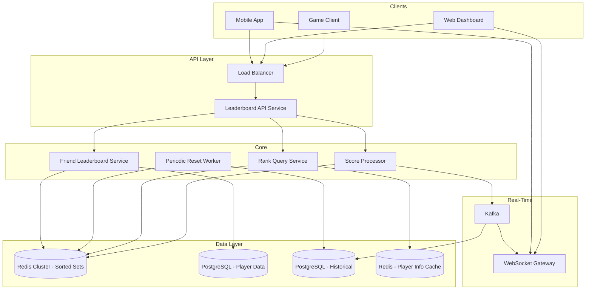
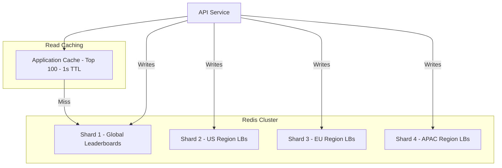
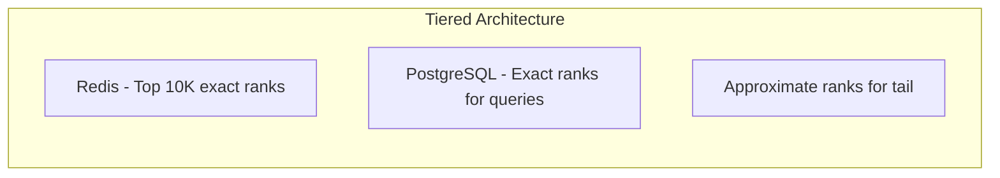

# Design a Leaderboard System

A leaderboard system ranks users or entities in real time based on scores. This design covers real-time score updates, efficient top-K queries, rank lookups, global vs regional vs friend leaderboards, time-bucketed leaderboards (daily, weekly, all-time), handling ties, and scaling to billions of entries — a common component in gaming platforms, competitive apps, and gamified SaaS products.

---

## 1. Requirements Clarification

### Functional Requirements

1. **Score submission** — Submit/update a player's score
2. **Top-K query** — Get the top N players (e.g., top 100)
3. **Player rank** — Get a specific player's rank and score
4. **Surrounding leaderboard** — Get players around a specific player (e.g., rank 45-55)
5. **Time-bucketed leaderboards** — Daily, weekly, monthly, all-time
6. **Regional leaderboards** — Country or region-specific rankings
7. **Friend leaderboard** — Ranking among friends only
8. **Leaderboard reset** — Reset scores at the start of each period
9. **Historical leaderboard** — View past leaderboard results
10. **Real-time updates** — Push leaderboard changes to connected clients

### Non-Functional Requirements

1. **Low latency** — Score update < 10ms, rank query < 50ms, top-K < 50ms
2. **High throughput** — 100K score updates/second at peak
3. **Consistency** — Rankings reflect the latest scores within 1 second
4. **Scale** — 500M players globally, 50M active in a period
5. **Availability** — 99.99% uptime
6. **Accuracy** — Exact rankings (not approximate) for top 10K; approximate acceptable below

### Clarifying Questions

::: tip Questions to Ask
- How many players are in the leaderboard?
- How frequently do scores update?
- Do we need real-time push updates or is polling acceptable?
- How should ties be handled (same rank, or first-to-achieve)?
- Do scores only go up, or can they decrease?
- How many leaderboards exist simultaneously (per game, per mode, per region)?
:::

---

## 2. Back-of-the-Envelope Estimation

### Traffic

- 500M total players, 50M active in any given period
- Each active player submits ~20 score updates/day

$$
\text{Score Update QPS} = \frac{50M \times 20}{86400} \approx 11{,}574 \text{ QPS}
$$

$$
\text{Peak Score QPS} \approx 11{,}574 \times 10 = 115{,}740 \text{ QPS}
$$

- Top-K queries: 50M players view leaderboard 5 times/day

$$
\text{Read QPS} = \frac{50M \times 5}{86400} \approx 2{,}894 \text{ QPS}
$$

$$
\text{Peak Read QPS} \approx 2{,}894 \times 5 = 14{,}468 \text{ QPS}
$$

### Storage

**Redis sorted set for active leaderboard:**

$$
\text{Per entry} \approx 8 \text{ B (score)} + 16 \text{ B (member ID)} + 24 \text{ B (overhead)} = 48 \text{ B}
$$

$$
\text{Single leaderboard (50M entries)} = 50M \times 48 \text{ B} = 2.4 \text{ GB}
$$

**Multiple leaderboards (global + 20 regions + daily/weekly/monthly):**

$$
\text{Total leaderboards} \approx 1 + 20 + 3 \times 21 = 84 \text{ leaderboards}
$$

$$
\text{Total Redis memory} = 84 \times 2.4 \text{ GB} \approx 200 \text{ GB}
$$

### Bandwidth

$$
\text{Top-100 response size} = 100 \times 100 \text{ B (player info)} = 10 \text{ KB}
$$

$$
\text{Read bandwidth} = 14{,}468 \times 10 \text{ KB} = 144.7 \text{ MB/s} = 1.16 \text{ Gbps}
$$

---

## 3. High-Level Design



---

## 4. Detailed Design

### 4.1 Redis Sorted Sets — The Core Data Structure

Redis sorted sets are the ideal data structure for leaderboards. Each member has a score, and Redis maintains members in sorted order. All critical operations are $O(\log N)$.

**Key operations and complexity:**

| Operation | Redis Command | Time Complexity | Description |
|-----------|--------------|-----------------|-------------|
| Add/update score | `ZADD` | $O(\log N)$ | Add member with score |
| Get rank | `ZREVRANK` | $O(\log N)$ | Rank of member (0-indexed, descending) |
| Get score | `ZSCORE` | $O(1)$ | Score of specific member |
| Top-K | `ZREVRANGE` | $O(\log N + K)$ | Top K members by score |
| Rank range | `ZREVRANGEBYRANK` | $O(\log N + K)$ | Members at rank range |
| Count | `ZCARD` | $O(1)$ | Total members |
| Remove | `ZREM` | $O(\log N)$ | Remove a member |

```typescript
class LeaderboardService {
  private readonly GLOBAL_KEY = 'leaderboard:global:alltime';

  async submitScore(playerId: string, score: number, region: string): Promise<void> {
    const pipeline = this.redis.pipeline();

    // 1. Update global all-time leaderboard (only if higher score)
    pipeline.zadd(this.GLOBAL_KEY, 'GT', score, playerId); // GT = only update if new score > current

    // 2. Update regional leaderboard
    pipeline.zadd(`leaderboard:region:${region}:alltime`, 'GT', score, playerId);

    // 3. Update time-bucketed leaderboards
    const today = this.getDateKey();   // e.g., "2026-03-20"
    const week = this.getWeekKey();    // e.g., "2026-W12"
    const month = this.getMonthKey();  // e.g., "2026-03"

    pipeline.zadd(`leaderboard:global:daily:${today}`, 'GT', score, playerId);
    pipeline.zadd(`leaderboard:global:weekly:${week}`, 'GT', score, playerId);
    pipeline.zadd(`leaderboard:global:monthly:${month}`, 'GT', score, playerId);

    // Regional time-bucketed
    pipeline.zadd(`leaderboard:region:${region}:daily:${today}`, 'GT', score, playerId);

    await pipeline.exec();

    // 4. Publish score update event
    await this.kafka.send('score-updates', {
      key: playerId,
      value: { playerId, score, region, timestamp: Date.now() },
    });
  }

  async getTopK(leaderboardKey: string, k: number = 100): Promise<LeaderboardEntry[]> {
    // ZREVRANGE returns members in descending score order
    const results = await this.redis.zrevrange(leaderboardKey, 0, k - 1, 'WITHSCORES');

    // Batch fetch player info
    const playerIds = results.filter((_, i) => i % 2 === 0);
    const scores = results.filter((_, i) => i % 2 === 1);
    const playerInfos = await this.getPlayerInfoBatch(playerIds);

    return playerIds.map((id, i) => ({
      rank: i + 1,
      playerId: id,
      score: parseFloat(scores[i]),
      playerName: playerInfos[id]?.name || 'Unknown',
      avatarUrl: playerInfos[id]?.avatar || null,
    }));
  }

  async getPlayerRank(leaderboardKey: string, playerId: string): Promise<PlayerRankInfo> {
    const pipeline = this.redis.pipeline();
    pipeline.zrevrank(leaderboardKey, playerId);  // 0-indexed rank
    pipeline.zscore(leaderboardKey, playerId);
    pipeline.zcard(leaderboardKey);

    const results = await pipeline.exec();
    const rank = results[0][1] as number | null;
    const score = results[1][1] as string | null;
    const total = results[2][1] as number;

    if (rank === null) throw new NotFoundError('Player not on leaderboard');

    return {
      playerId,
      rank: rank + 1,  // Convert 0-indexed to 1-indexed
      score: parseFloat(score!),
      totalPlayers: total,
      percentile: ((total - rank) / total) * 100,
    };
  }

  async getSurroundingPlayers(leaderboardKey: string, playerId: string, count: number = 5): Promise<LeaderboardEntry[]> {
    // Get players around the given player
    const rank = await this.redis.zrevrank(leaderboardKey, playerId);
    if (rank === null) throw new NotFoundError('Player not on leaderboard');

    const start = Math.max(0, rank - count);
    const end = rank + count;

    const results = await this.redis.zrevrange(leaderboardKey, start, end, 'WITHSCORES');

    const entries: LeaderboardEntry[] = [];
    for (let i = 0; i < results.length; i += 2) {
      entries.push({
        rank: start + (i / 2) + 1,
        playerId: results[i],
        score: parseFloat(results[i + 1]),
      });
    }

    // Hydrate with player info
    return this.hydrateEntries(entries);
  }
}
```

### 4.2 Friend Leaderboard

Friend leaderboards cannot use a single sorted set (each user has different friends). Two approaches:

```typescript
class FriendLeaderboardService {
  // Approach 1: On-demand computation (small friend lists)
  async getFriendLeaderboard(playerId: string, leaderboardKey: string): Promise<LeaderboardEntry[]> {
    // 1. Get friend list
    const friendIds = await this.socialService.getFriends(playerId);
    const allIds = [playerId, ...friendIds]; // Include self

    // 2. Batch fetch scores from the global leaderboard
    const pipeline = this.redis.pipeline();
    for (const id of allIds) {
      pipeline.zscore(leaderboardKey, id);
    }
    const scores = await pipeline.exec();

    // 3. Sort by score descending
    const entries = allIds
      .map((id, i) => ({
        playerId: id,
        score: scores[i][1] ? parseFloat(scores[i][1] as string) : 0,
      }))
      .filter(e => e.score > 0)
      .sort((a, b) => b.score - a.score)
      .map((e, i) => ({ ...e, rank: i + 1 }));

    return this.hydrateEntries(entries);
  }

  // Approach 2: Pre-computed friend sorted sets (large friend lists)
  async updateFriendLeaderboard(playerId: string, score: number): Promise<void> {
    const friends = await this.socialService.getFriends(playerId);

    // Update this player's score in each friend's leaderboard
    const pipeline = this.redis.pipeline();
    for (const friendId of friends) {
      pipeline.zadd(`leaderboard:friends:${friendId}`, score, playerId);
    }
    // Also update own leaderboard
    pipeline.zadd(`leaderboard:friends:${playerId}`, score, playerId);
    await pipeline.exec();
  }
}
```

| Approach | Latency | Memory | Update Cost | Best For |
|----------|---------|--------|-------------|----------|
| On-demand (ZSCORE batch) | ~10ms (< 500 friends) | No extra | None | < 500 friends |
| Pre-computed sorted set | ~1ms | High (N per user) | O(friends) per update | > 500 friends |

### 4.3 Handling Ties

```typescript
class TieBreaker {
  // Strategy 1: Composite score (encode timestamp in score)
  encodeScore(rawScore: number, timestamp: number): number {
    // Use the fractional part to encode timestamp (earlier = higher)
    // Score: integer part = raw score, decimal part = inverse timestamp
    const maxTimestamp = 2000000000; // ~2033
    const tiebreaker = (maxTimestamp - timestamp) / maxTimestamp;
    return rawScore + tiebreaker;
  }

  decodeScore(compositeScore: number): { rawScore: number; timestamp: number } {
    const rawScore = Math.floor(compositeScore);
    const tiebreaker = compositeScore - rawScore;
    const maxTimestamp = 2000000000;
    const timestamp = Math.round(maxTimestamp - tiebreaker * maxTimestamp);
    return { rawScore, timestamp };
  }

  // Strategy 2: Lexicographic member ID (simple but not time-based)
  // Redis ZADD with equal scores sorts lexicographically by member

  // Strategy 3: Separate tie resolution in application layer
  async resolveRanks(entries: LeaderboardEntry[]): Promise<LeaderboardEntry[]> {
    let currentRank = 1;
    let currentScore = Infinity;

    return entries.map((entry, index) => {
      if (entry.score < currentScore) {
        currentRank = index + 1;
        currentScore = entry.score;
      }
      // Same score = same rank (dense ranking)
      return { ...entry, rank: currentRank };
    });
  }
}
```

::: tip Tie-Breaking with Composite Scores
Encoding the timestamp into the score's fractional part is a common trick. With Redis sorted sets using 64-bit doubles, you have ~15 significant digits. If your raw score uses up to 10 digits, you have 5 decimal places for the tiebreaker. This gives ~100K unique timestamps per integer score — more than enough to break ties for "who achieved the score first."
:::

### 4.4 Periodic Leaderboard Reset

```typescript
class LeaderboardResetService {
  // Run at midnight UTC for daily, Sunday midnight for weekly, etc.

  async resetDailyLeaderboard(): Promise<void> {
    const yesterday = this.getYesterdayKey();
    const today = this.getDateKey();

    // 1. Archive yesterday's results
    const topPlayers = await this.redis.zrevrange(
      `leaderboard:global:daily:${yesterday}`, 0, 999, 'WITHSCORES'
    );

    await this.historyDB.query(`
      INSERT INTO leaderboard_history (leaderboard_type, period, rankings)
      VALUES ('daily', $1, $2)
    `, [yesterday, JSON.stringify(topPlayers)]);

    // 2. Delete yesterday's sorted set (Redis reclaims memory)
    await this.redis.del(`leaderboard:global:daily:${yesterday}`);

    // 3. Today's leaderboard is already being populated by score submissions
    // No explicit "create" needed — ZADD creates the key automatically
  }
}
```

### 4.5 Real-Time Leaderboard Updates (WebSocket)

```typescript
class LeaderboardWSService {
  async onScoreUpdate(event: ScoreUpdateEvent): Promise<void> {
    const { playerId, score, region } = event;

    // 1. Check if this score changed the top 100
    const rank = await this.redis.zrevrank('leaderboard:global:alltime', playerId);
    if (rank !== null && rank < 100) {
      // Player is in top 100 — broadcast to all connected viewers
      const entry = {
        playerId,
        score,
        rank: rank + 1,
        playerName: await this.getPlayerName(playerId),
      };

      this.wsGateway.broadcast('leaderboard:top100', {
        type: 'rank_update',
        entry,
      });
    }

    // 2. Notify the player's friends of the score change
    const friends = await this.socialService.getFriends(playerId);
    for (const friendId of friends) {
      this.wsGateway.sendToUser(friendId, {
        type: 'friend_score_update',
        playerId,
        score,
      });
    }
  }
}
```

---

## 5. Data Model

### Redis Key Schema

```
# Global leaderboards
leaderboard:global:alltime                       → Sorted Set
leaderboard:global:daily:{YYYY-MM-DD}           → Sorted Set
leaderboard:global:weekly:{YYYY-Www}            → Sorted Set
leaderboard:global:monthly:{YYYY-MM}            → Sorted Set

# Regional leaderboards
leaderboard:region:{regionCode}:alltime          → Sorted Set
leaderboard:region:{regionCode}:daily:{date}    → Sorted Set

# Friend leaderboards (pre-computed, optional)
leaderboard:friends:{userId}                     → Sorted Set

# Player info cache
player:{playerId}                                → Hash { name, avatar, country, ... }
```

### PostgreSQL Schema

```sql
-- Players (source of truth for player info)
CREATE TABLE players (
    id              BIGSERIAL PRIMARY KEY,
    username        VARCHAR(50) UNIQUE NOT NULL,
    display_name    VARCHAR(100),
    avatar_url      VARCHAR(500),
    country         CHAR(2),
    region          VARCHAR(20),
    created_at      TIMESTAMP WITH TIME ZONE DEFAULT NOW()
);

-- Score history (for auditing and analytics)
CREATE TABLE score_events (
    id              BIGSERIAL PRIMARY KEY,
    player_id       BIGINT NOT NULL,
    score           BIGINT NOT NULL,
    game_mode       VARCHAR(50),
    metadata        JSONB,
    created_at      TIMESTAMP WITH TIME ZONE DEFAULT NOW()
) PARTITION BY RANGE (created_at);

CREATE INDEX idx_scores_player ON score_events(player_id, created_at DESC);

-- Archived leaderboard results
CREATE TABLE leaderboard_history (
    id              BIGSERIAL PRIMARY KEY,
    leaderboard_type VARCHAR(50) NOT NULL,  -- 'daily', 'weekly', 'monthly'
    period          VARCHAR(20) NOT NULL,    -- '2026-03-20', '2026-W12', '2026-03'
    rankings        JSONB NOT NULL,          -- top 1000 players with scores
    created_at      TIMESTAMP WITH TIME ZONE DEFAULT NOW()
);

CREATE UNIQUE INDEX idx_lb_history ON leaderboard_history(leaderboard_type, period);

-- Rewards (for leaderboard-based prize distribution)
CREATE TABLE leaderboard_rewards (
    id              BIGSERIAL PRIMARY KEY,
    leaderboard_type VARCHAR(50),
    period          VARCHAR(20),
    player_id       BIGINT NOT NULL,
    rank            INT NOT NULL,
    reward_type     VARCHAR(50),             -- 'badge', 'currency', 'item'
    reward_value    JSONB,
    claimed         BOOLEAN DEFAULT FALSE,
    created_at      TIMESTAMP WITH TIME ZONE DEFAULT NOW()
);
```

---

## 6. API Design

```typescript
// Submit score
// POST /api/v1/leaderboard/scores
interface SubmitScoreRequest {
  playerId: string;
  score: number;
  gameMode?: string;
  metadata?: Record<string, any>;
}

interface SubmitScoreResponse {
  playerId: string;
  score: number;
  rank: number;
  previousRank: number | null;
  isNewHighScore: boolean;
}

// Get top players
// GET /api/v1/leaderboard/top?scope=global&period=alltime&region=us&limit=100
interface TopPlayersResponse {
  entries: LeaderboardEntry[];
  total: number;
  lastUpdated: string;
}

interface LeaderboardEntry {
  rank: number;
  playerId: string;
  playerName: string;
  avatarUrl: string | null;
  score: number;
  country?: string;
}

// Get player rank
// GET /api/v1/leaderboard/rank/:playerId?scope=global&period=alltime
interface PlayerRankResponse {
  playerId: string;
  rank: number;
  score: number;
  totalPlayers: number;
  percentile: number;
}

// Get surrounding players
// GET /api/v1/leaderboard/around/:playerId?scope=global&period=alltime&count=5
// Returns players ranked above and below the given player

// Get friend leaderboard
// GET /api/v1/leaderboard/friends?period=weekly&limit=50

// Historical leaderboard
// GET /api/v1/leaderboard/history?type=daily&period=2026-03-19&limit=100

// WebSocket subscription
// WS /api/v1/leaderboard/live?scope=global&period=alltime
// Receives real-time top-100 updates
```

---

## 7. Scaling

### Redis Cluster Scaling

| Scale | Challenge | Solution |
|-------|-----------|----------|
| 50M entries, single leaderboard | Memory (~2.4 GB) | Single Redis node handles this |
| 84 leaderboards | Total memory (~200 GB) | Redis Cluster with 4-8 shards |
| 100K+ writes/sec | Write throughput | Shard by leaderboard key across cluster nodes |
| Read amplification (top-K) | Cache hot results | Cache top-100 in application with 1s TTL |



### Scaling Beyond Redis (Billions of Entries)

For leaderboards with billions of entries where Redis memory becomes prohibitive:



| Tier | Storage | Exact Rank | Latency | Range |
|------|---------|-----------|---------|-------|
| Redis sorted set | In-memory | Yes | < 1ms | Top 10K |
| PostgreSQL with B-tree index | SSD | Yes | < 10ms | Top 10M |
| Approximate (percentile buckets) | SSD | No (bucket-level) | < 5ms | All players |

```typescript
class ScalableRankService {
  async getPlayerRank(playerId: string): Promise<PlayerRankInfo> {
    // 1. Try Redis first (exact rank for top players)
    const redisRank = await this.redis.zrevrank('leaderboard:top', playerId);
    if (redisRank !== null) {
      return { rank: redisRank + 1, exact: true };
    }

    // 2. Fall back to PostgreSQL (exact rank via COUNT)
    const result = await this.db.query(`
      SELECT COUNT(*) + 1 as rank
      FROM scores
      WHERE score > (SELECT score FROM scores WHERE player_id = $1)
    `, [playerId]);

    if (result.rank <= 10_000_000) {
      return { rank: result.rank, exact: true };
    }

    // 3. Approximate rank using score distribution buckets
    const score = await this.db.query('SELECT score FROM scores WHERE player_id = $1', [playerId]);
    const bucket = await this.getScoreBucket(score);
    return {
      rank: bucket.approximateRank,
      exact: false,
      percentile: bucket.percentile,
    };
  }
}
```

### Write Throughput Optimization

For 100K+ writes/sec:

1. **Batch writes** — Buffer score updates for 100ms, batch ZADD in pipeline
2. **Sharded counters** — Use per-region Redis instances to avoid cross-shard writes
3. **Async secondary updates** — Global leaderboard updated synchronously; regional/daily leaderboards updated via Kafka consumers
4. **Score deduplication** — Only update if new score > current (Redis `ZADD GT` flag)

---

## 8. Trade-offs & Alternatives

### Redis Sorted Set vs Other Approaches

| Approach | Rank Query | Update | Memory | Scale |
|----------|-----------|--------|--------|-------|
| **Redis Sorted Set** | $O(\log N)$ | $O(\log N)$ | In-memory | ~100M entries |
| PostgreSQL + ORDER BY | $O(N \log N)$ | $O(\log N)$ | On-disk | Billions |
| BIT (Binary Indexed Tree) | $O(\log M)$ | $O(\log M)$ | In-memory | Score range M |
| Segment Tree | $O(\log M)$ | $O(\log M)$ | In-memory | Score range M |
| Approximation (count-min sketch) | Approximate | $O(1)$ | Tiny | Unlimited |

::: tip When Redis Sorted Sets Won't Scale
If your leaderboard has more than ~100-200M entries, a single Redis sorted set's memory usage becomes prohibitive. Consider: (1) BIT/Fenwick Tree if the score range is bounded (e.g., 0-1M). (2) Tiered architecture: Redis for top players, database for the rest. (3) Approximate rankings for the long tail.
:::

### BIT (Binary Indexed Tree) for Bounded Score Ranges

If scores are integers in a known range (e.g., 0 to 1,000,000), a BIT provides $O(\log M)$ rank queries where $M$ is the score range — independent of the number of players.

```typescript
class BITLeaderboard {
  private tree: number[];  // Size = max score + 1

  constructor(private maxScore: number) {
    this.tree = new Array(maxScore + 2).fill(0);
  }

  // Record that a player achieved this score
  update(score: number, delta: number): void {
    for (let i = score + 1; i <= this.maxScore + 1; i += i & (-i)) {
      this.tree[i] += delta;
    }
  }

  // How many players have score > given score?
  getRank(score: number): number {
    const totalPlayers = this.prefixSum(this.maxScore);
    const playersAtOrBelow = this.prefixSum(score);
    return totalPlayers - playersAtOrBelow + 1;
  }

  private prefixSum(score: number): number {
    let sum = 0;
    for (let i = score + 1; i > 0; i -= i & (-i)) {
      sum += this.tree[i];
    }
    return sum;
  }
}
```

### Real-Time Push vs Polling

| Approach | Latency | Server Cost | Client Complexity |
|----------|---------|-------------|-------------------|
| WebSocket push | Real-time | High (persistent connections) | Medium |
| **Short polling (5s interval)** | 5s delay | Medium | Low |
| Long polling | ~1s | Medium | Medium |
| SSE (Server-Sent Events) | Real-time | Medium | Low |

**Decision:** Short polling (5s) for most clients. WebSocket for the top-100 live view where real-time matters. The leaderboard doesn't change drastically enough to justify WebSocket for all users.

---

## 9. Common Interview Questions

::: details "How do you get a specific player's exact rank among 500M players?"
For the top 10K, use Redis `ZREVRANK` — it's $O(\log N)$ and returns instantly. For players outside the top 10K, either: (1) Accept the $O(\log N)$ cost on Redis with 500M entries (still ~30 operations, ~1ms). (2) Use a BIT/Fenwick tree if scores are bounded integers. (3) Provide an approximate rank using precomputed percentile buckets. The choice depends on whether all 500M players are actively querying their rank or just a small fraction.
:::

::: details "How do you handle leaderboard reset at midnight without downtime?"
Use date-keyed sorted sets (e.g., `leaderboard:daily:2026-03-20`). At midnight, new score submissions go to the new key automatically (the date changes). The old key is archived to PostgreSQL and then deleted. There's no explicit "reset" operation — the new day's sorted set starts empty and gets populated organically. Set a TTL on old keys as a safety net.
:::

::: details "How do you build a friend leaderboard efficiently?"
For users with < 500 friends: compute on-demand by fetching scores for all friends from the global leaderboard using pipelined `ZSCORE` commands. For users with > 500 friends: maintain a pre-computed per-user sorted set that gets updated whenever a friend submits a score. The trade-off is memory vs latency. Most users have < 500 friends, so on-demand computation works well for the common case.
:::

::: details "How do you prevent score cheating?"
Server-side score validation is essential. Never trust client-submitted scores directly. Validate: (1) Score is within possible bounds for the game mode. (2) Score progression is realistic (no jump from 100 to 1M). (3) Game session existed and lasted long enough. (4) Rate limiting — max N score submissions per hour. (5) For competitive games, use server-authoritative game state. (6) Anomaly detection ML model for suspicious patterns. Store raw game events, not just scores, for post-hoc auditing.
:::

::: details "How do you display the leaderboard in different time zones?"
For daily leaderboards, use UTC as the canonical time zone. The leaderboard resets at midnight UTC. Display the reset countdown in the user's local time zone. Some games use "server time" (a single time zone) to keep it simple. For truly regional daily leaderboards, create separate sorted sets per time zone region (e.g., Americas, Europe, Asia) with resets aligned to regional midnight.
:::

### Time Allocation (45-minute interview)

| Phase | Time | Focus |
|-------|------|-------|
| Requirements | 4 min | Score updates, rankings, time buckets, friend LB |
| Estimation | 3 min | 500M players, 100K writes/sec, Redis memory |
| High-level design | 7 min | API, Redis sorted sets, Kafka, WebSocket |
| Redis sorted set deep-dive | 10 min | ZADD, ZREVRANK, pipelining, key schema |
| Friend & regional leaderboards | 7 min | On-demand vs pre-computed, sharding |
| Tie-breaking & reset | 5 min | Composite scores, date-keyed sets |
| Scaling | 9 min | Beyond Redis, BIT, tiered architecture |

---

## Summary

| Component | Technology | Scale |
|-----------|-----------|-------|
| Core Rankings | Redis Sorted Sets | 50M active entries per leaderboard |
| Score Ingestion | Kafka + Redis pipeline | 100K+ writes/sec |
| Player Data | PostgreSQL + Redis cache | 500M player profiles |
| Time-Bucketed LBs | Date-keyed Redis sorted sets | 84 concurrent leaderboards |
| Friend LB | On-demand ZSCORE batch | < 500 friends per user |
| Historical | PostgreSQL (archived) | Past daily/weekly/monthly results |
| Real-Time Updates | WebSocket (top 100 only) | Push rank changes |
| Large-Scale Ranks | BIT or tiered (Redis + DB) | Billions of entries |
