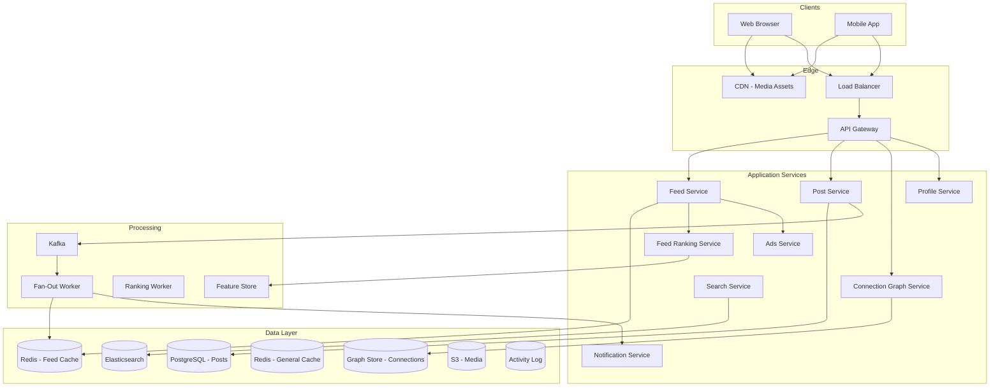
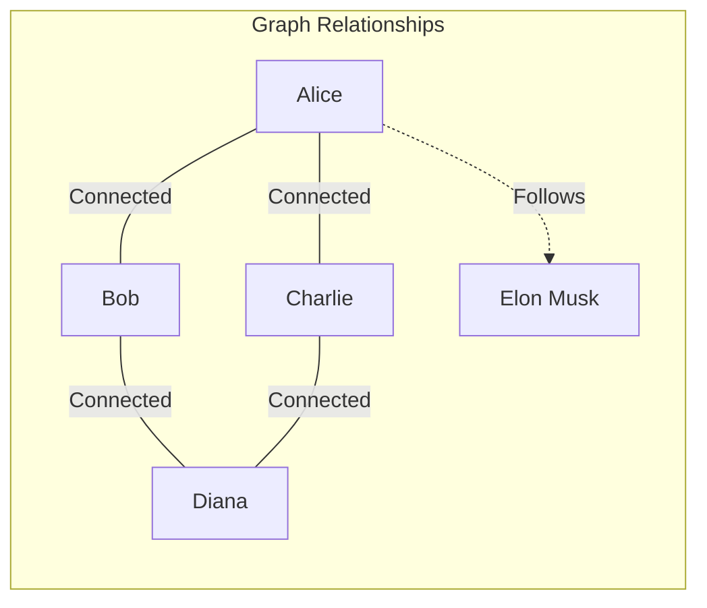
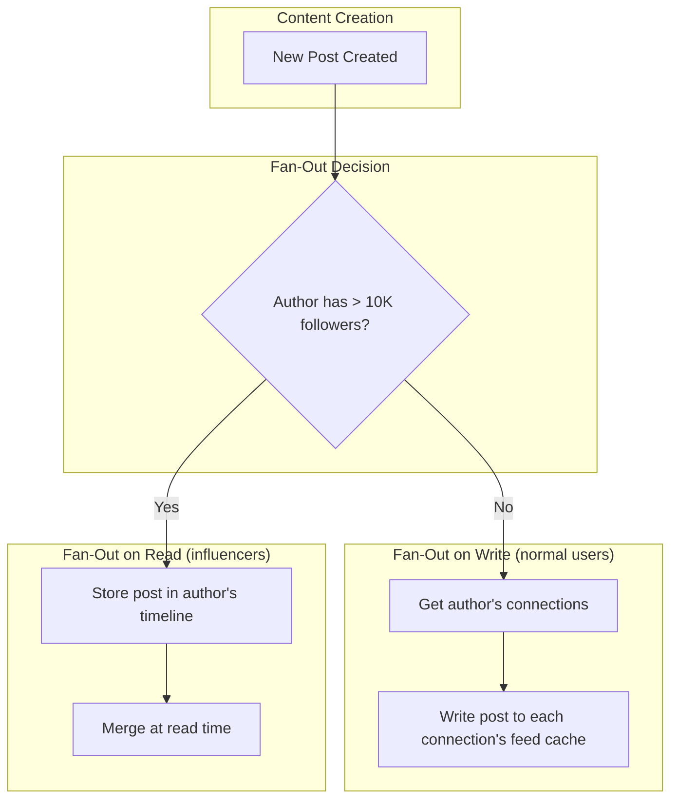
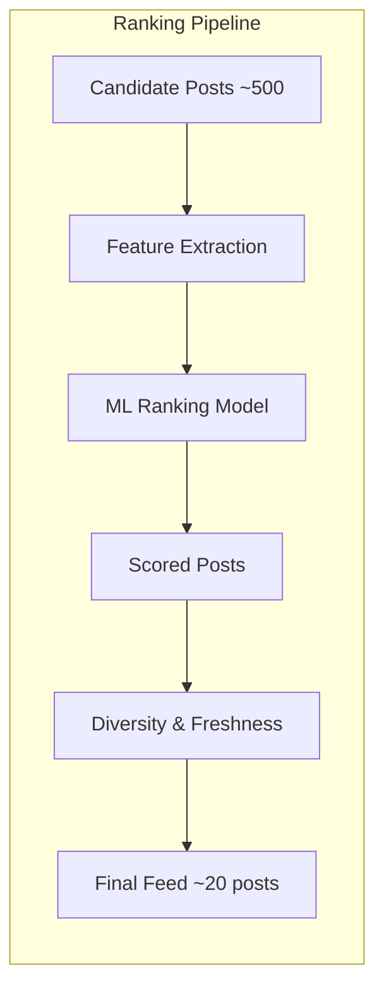
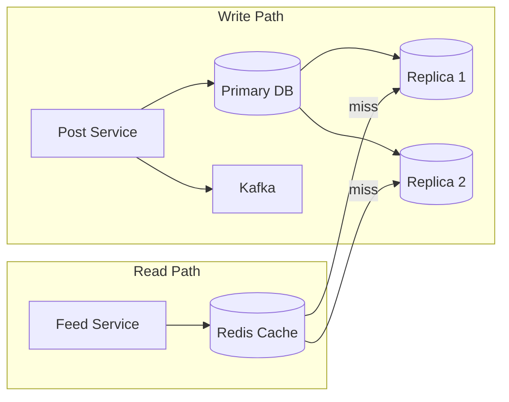

# Design LinkedIn Feed

LinkedIn is the world's largest professional network. Designing its feed system covers connection graph management, feed generation combining first-degree content with recommended content, relevance ranking with ML models, viral mechanics (second-degree engagement), and balancing organic content with sponsored posts — all while maintaining professional context.

---

## 1. Requirements Clarification

### Functional Requirements

1. **Connections** — Send/accept connection requests, follow without connecting
2. **Posts** — Create text, image, video, article, and poll posts
3. **Feed** — Personalized feed combining connections' posts and recommended content
4. **Reactions** — Like, celebrate, support, insightful, funny, love
5. **Comments** — Comment on posts with nested replies
6. **Sharing** — Share/repost content with commentary
7. **Notifications** — Someone liked your post, commented, connected, viewed profile
8. **Sponsored content** — Native ads integrated into feed
9. **Hashtags & topics** — Follow topics to see related content
10. **Profile views** — Track and display who viewed your profile

### Non-Functional Requirements

1. **High availability** — 99.99% uptime for feed delivery
2. **Low latency** — Feed loads in < 500ms
3. **Scale** — 1B members, 300M MAU, 130M DAU
4. **Freshness** — New posts appear in connections' feeds within seconds
5. **Relevance** — Feed is ranked by relevance, not just chronological
6. **Read-heavy** — Read:write ratio of ~300:1

### Clarifying Questions

::: tip Questions to Ask
- How many connections does the average user have?
- What is the ratio of content creators to content consumers?
- How do we balance first-degree content vs recommended content?
- Should we support LinkedIn Articles (long-form)?
- What percentage of feed should be sponsored content?
- Do we need to support LinkedIn Live?
:::

---

## 2. Back-of-the-Envelope Estimation

### Traffic

- 130M DAU, average user views feed 5 times/day, scrolls 20 posts per session
- Only ~1% of users create content daily

$$
\text{Feed Read QPS} = \frac{130M \times 5}{86400} \approx 7{,}523 \text{ QPS}
$$

$$
\text{Peak Feed QPS} \approx 7{,}523 \times 3 = 22{,}569 \text{ QPS}
$$

$$
\text{Content creators/day} = 130M \times 0.01 = 1.3M \text{ posts/day}
$$

$$
\text{Post Write QPS} = \frac{1.3M}{86400} \approx 15 \text{ QPS}
$$

$$
\text{Engagement actions/day} = 130M \times 10 \text{ (likes, comments)} = 1.3B
$$

$$
\text{Engagement QPS} = \frac{1.3B}{86400} \approx 15{,}046 \text{ QPS}
$$

### Storage

**Posts:**

$$
\text{Post size} \approx 3 \text{ KB (text + metadata)}
$$

$$
\text{Daily post storage} = 1.3M \times 3 \text{ KB} = 3.9 \text{ GB/day}
$$

**Connection graph:**
- Average user has 500 connections

$$
\text{Total edges} = 1B \times 500 / 2 = 250B \text{ edges (undirected)}
$$

$$
\text{Graph storage} = 250B \times 16 \text{ B (two IDs)} = 4 \text{ TB}
$$

**Feed cache:**

$$
\text{Active users' feeds} = 130M \times 100 \text{ post IDs} \times 8 \text{ B} = 104 \text{ GB}
$$

### Bandwidth

$$
\text{Feed egress} = 22{,}569 \times 20 \text{ posts} \times 5 \text{ KB} = 2.26 \text{ GB/s} = 18 \text{ Gbps}
$$

---

## 3. High-Level Design



---

## 4. Detailed Design

### 4.1 Connection Graph

LinkedIn's graph is the foundation of feed generation. The graph stores first-degree connections (mutual) and follow relationships (one-directional).



```typescript
class ConnectionGraphService {
  // Graph stored in both PostgreSQL (durability) and in-memory graph (performance)

  async getFirstDegreeConnections(userId: string): Promise<string[]> {
    // Check cache first
    const cached = await this.redis.smembers(`connections:${userId}`);
    if (cached.length > 0) return cached;

    // Query graph store
    const connections = await this.graphDB.query(`
      SELECT CASE
        WHEN user_id_1 = $1 THEN user_id_2
        ELSE user_id_1
      END as connected_user_id
      FROM connections
      WHERE (user_id_1 = $1 OR user_id_2 = $1) AND status = 'accepted'
    `, [userId]);

    const ids = connections.map(c => c.connected_user_id);

    // Cache for 10 minutes
    if (ids.length > 0) {
      await this.redis.sadd(`connections:${userId}`, ...ids);
      await this.redis.expire(`connections:${userId}`, 600);
    }

    return ids;
  }

  async getSecondDegreeConnections(userId: string, limit: number = 100): Promise<string[]> {
    // People your connections know (for "People You May Know" and viral feed)
    const firstDegree = await this.getFirstDegreeConnections(userId);
    const firstDegreeSet = new Set(firstDegree);

    // Count mutual connections for each second-degree candidate
    const candidates = await this.graphDB.query(`
      SELECT c2.connected_user_id, COUNT(*) as mutual_count
      FROM connections c1
      JOIN connections c2
        ON c1.connected_user_id = c2.user_id_1 OR c1.connected_user_id = c2.user_id_2
      WHERE c1.user_id = $1
        AND c2.connected_user_id != $1
        AND c2.connected_user_id NOT IN (SELECT unnest($2::bigint[]))
      GROUP BY c2.connected_user_id
      ORDER BY mutual_count DESC
      LIMIT $3
    `, [userId, firstDegree, limit]);

    return candidates;
  }
}
```

### 4.2 Feed Generation (Hybrid Fan-Out)

LinkedIn uses a **hybrid fan-out** approach: fan-out on write for normal users, fan-out on read for influencers (users with 10K+ followers).



```typescript
class FeedFanoutService {
  async onPostCreated(post: Post): Promise<void> {
    const authorId = post.author_id;
    const followerCount = await this.graphService.getFollowerCount(authorId);

    if (followerCount > 10_000) {
      // Influencer: fan-out on read
      // Just store in the author's post timeline
      await this.redis.zadd(`author_posts:${authorId}`, post.created_at, post.id);
      return;
    }

    // Normal user: fan-out on write
    const connections = await this.graphService.getFirstDegreeConnections(authorId);
    const followers = await this.graphService.getFollowers(authorId);
    const recipients = [...new Set([...connections, ...followers])];

    // Batch insert into recipients' feed caches
    const pipeline = this.redis.pipeline();
    for (const recipientId of recipients) {
      // Sorted set: score = timestamp, member = postId
      pipeline.zadd(`feed:${recipientId}`, post.created_at, post.id);
      // Trim to keep only last 500 posts
      pipeline.zremrangebyrank(`feed:${recipientId}`, 0, -501);
    }
    await pipeline.exec();
  }
}

class FeedService {
  async getFeed(userId: string, cursor: string | null, limit: number = 20): Promise<FeedPage> {
    // 1. Get pre-computed feed entries (from fan-out on write)
    const feedPostIds = await this.redis.zrevrangebyscore(
      `feed:${userId}`,
      cursor ? cursor : '+inf',
      '-inf',
      'LIMIT', 0, limit * 2  // Over-fetch for merging
    );

    // 2. Merge with influencer posts (fan-out on read)
    const followedInfluencers = await this.graphService.getFollowedInfluencers(userId);
    const influencerPosts: string[] = [];
    for (const influencerId of followedInfluencers) {
      const posts = await this.redis.zrevrangebyscore(
        `author_posts:${influencerId}`,
        cursor ? cursor : '+inf',
        Date.now() - 48 * 3600 * 1000, // Last 48 hours
        'LIMIT', 0, 5
      );
      influencerPosts.push(...posts);
    }

    // 3. Merge, deduplicate, and sort
    const allPostIds = [...new Set([...feedPostIds, ...influencerPosts])];

    // 4. Fetch post data
    const posts = await this.postService.getPostsByIds(allPostIds);

    // 5. Rank by relevance
    const ranked = await this.rankingService.rankFeed(userId, posts);

    // 6. Insert sponsored content
    const withAds = await this.adsService.insertSponsoredContent(ranked, userId);

    // 7. Return page
    return {
      posts: withAds.slice(0, limit),
      cursor: withAds.length > 0 ? withAds[limit - 1]?.created_at.toString() : null,
    };
  }
}
```

### 4.3 Feed Ranking (ML-Powered)



```typescript
class FeedRankingService {
  async rankFeed(userId: string, candidates: Post[]): Promise<Post[]> {
    // 1. Extract features for ranking
    const userFeatures = await this.featureStore.getUserFeatures(userId);

    const scoredPosts = await Promise.all(
      candidates.map(async (post) => {
        const postFeatures = await this.featureStore.getPostFeatures(post.id);
        const authorFeatures = await this.featureStore.getUserFeatures(post.author_id);

        // 2. Compute relevance score
        const score = this.computeScore(userFeatures, postFeatures, authorFeatures);
        return { post, score };
      })
    );

    // 3. Sort by score
    scoredPosts.sort((a, b) => b.score - a.score);

    // 4. Apply diversity constraints
    return this.applyDiversity(scoredPosts);
  }

  private computeScore(
    user: UserFeatures,
    post: PostFeatures,
    author: UserFeatures
  ): number {
    // Multi-objective scoring

    // Connection strength (how often user interacts with author)
    const connectionStrength = this.connectionStrengthModel.predict(user, author);

    // Content relevance (topic match, industry match)
    const contentRelevance = this.contentRelevanceModel.predict(user, post);

    // Engagement likelihood (will user like/comment/share?)
    const engagementProb = this.engagementModel.predict(user, post);

    // Post quality (is this high-quality content?)
    const postQuality = post.qualityScore;

    // Freshness decay
    const ageHours = (Date.now() - post.createdAt) / 3600000;
    const freshnessScore = Math.exp(-ageHours / 24); // Half-life of ~24 hours

    // Viral signal (engagement from second-degree network)
    const viralScore = post.secondDegreeEngagementCount > 0
      ? Math.log10(post.secondDegreeEngagementCount + 1)
      : 0;

    // Weighted combination
    return (
      connectionStrength * 0.25 +
      contentRelevance * 0.25 +
      engagementProb * 0.20 +
      postQuality * 0.10 +
      freshnessScore * 0.10 +
      viralScore * 0.10
    );
  }

  private applyDiversity(scored: ScoredPost[]): Post[] {
    // Prevent the feed from being dominated by:
    // - A single author (max 2 posts per author in top 20)
    // - A single content type (balance text, images, articles)
    // - All old or all new content
    const result: Post[] = [];
    const authorCounts = new Map<string, number>();
    const typeCounts = new Map<string, number>();

    for (const { post } of scored) {
      const authorCount = authorCounts.get(post.author_id) || 0;
      const typeCount = typeCounts.get(post.post_type) || 0;

      if (authorCount >= 2) continue;
      if (typeCount >= Math.ceil(result.length / 3)) continue; // Max 1/3 of feed from same type

      result.push(post);
      authorCounts.set(post.author_id, authorCount + 1);
      typeCounts.set(post.post_type, typeCount + 1);

      if (result.length >= 20) break;
    }

    return result;
  }
}
```

### 4.4 Viral Mechanics (Second-Degree Engagement)

LinkedIn shows posts that your connections engaged with, even if you don't follow the original author. This is a key viral mechanism.

```typescript
class ViralFeedService {
  async onEngagement(userId: string, postId: string, action: string): Promise<void> {
    // When Alice likes a post by someone outside Bob's network,
    // that post becomes a candidate for Bob's feed if Alice is Bob's connection

    const post = await this.postService.getPost(postId);
    const postAuthorId = post.author_id;

    // Get the engaging user's connections
    const connections = await this.graphService.getFirstDegreeConnections(userId);

    for (const connectionId of connections) {
      // Skip if the connection is the post author (they already see it)
      if (connectionId === postAuthorId) continue;

      // Skip if the connection is already connected to the author
      const isConnected = await this.graphService.areConnected(connectionId, postAuthorId);
      if (isConnected) continue;

      // Add to connection's feed with viral context
      // "Alice liked this" or "3 people in your network commented on this"
      await this.redis.zadd(`feed:${connectionId}`, Date.now(), `viral:${postId}`);

      // Track who in their network engaged (for display)
      await this.redis.sadd(`viral_context:${connectionId}:${postId}`, userId);
    }
  }
}
```

### 4.5 Sponsored Content Integration

```typescript
class AdsService {
  async insertSponsoredContent(feed: Post[], userId: string): Promise<(Post | SponsoredPost)[]> {
    // Insert one sponsored post every ~5 organic posts
    const adPositions = [3, 8, 13, 18]; // Fixed positions in feed

    const userProfile = await this.profileService.getProfile(userId);
    const targetingParams = {
      industry: userProfile.industry,
      jobTitle: userProfile.title,
      company: userProfile.company,
      skills: userProfile.skills,
      location: userProfile.location,
      seniority: userProfile.seniority,
    };

    // Fetch relevant ads from Ad Auction
    const ads = await this.adAuction.getWinningAds(targetingParams, adPositions.length);

    // Insert ads at designated positions
    const result = [...feed];
    for (let i = 0; i < adPositions.length && i < ads.length; i++) {
      const pos = Math.min(adPositions[i], result.length);
      result.splice(pos, 0, { ...ads[i], isSponsored: true });
    }

    return result;
  }
}
```

---

## 5. Data Model

### PostgreSQL Schema

```sql
-- Users/Members
CREATE TABLE members (
    id              BIGSERIAL PRIMARY KEY,
    email           VARCHAR(255) UNIQUE NOT NULL,
    first_name      VARCHAR(100),
    last_name       VARCHAR(100),
    headline        VARCHAR(255),
    industry        VARCHAR(100),
    location        VARCHAR(100),
    company         VARCHAR(255),
    title           VARCHAR(255),
    profile_photo   VARCHAR(500),
    follower_count  INT DEFAULT 0,
    connection_count INT DEFAULT 0,
    created_at      TIMESTAMP WITH TIME ZONE DEFAULT NOW()
);

-- Connections (bidirectional)
CREATE TABLE connections (
    user_id_1       BIGINT NOT NULL,
    user_id_2       BIGINT NOT NULL,
    status          VARCHAR(20) DEFAULT 'pending', -- pending, accepted, blocked
    connected_at    TIMESTAMP WITH TIME ZONE,
    created_at      TIMESTAMP WITH TIME ZONE DEFAULT NOW(),
    PRIMARY KEY (user_id_1, user_id_2),
    CHECK (user_id_1 < user_id_2)  -- Canonical ordering
);

CREATE INDEX idx_connections_user1 ON connections(user_id_1, status);
CREATE INDEX idx_connections_user2 ON connections(user_id_2, status);

-- Follow relationships (unidirectional)
CREATE TABLE follows (
    follower_id     BIGINT NOT NULL,
    followee_id     BIGINT NOT NULL,
    created_at      TIMESTAMP WITH TIME ZONE DEFAULT NOW(),
    PRIMARY KEY (follower_id, followee_id)
);

CREATE INDEX idx_follows_followee ON follows(followee_id);

-- Posts
CREATE TABLE posts (
    id              BIGSERIAL PRIMARY KEY,
    author_id       BIGINT NOT NULL,
    post_type       VARCHAR(20) NOT NULL,      -- text, image, video, article, poll, repost
    text            TEXT,
    media_urls      TEXT[],
    hashtags        TEXT[],
    original_post_id BIGINT,                   -- for reposts
    visibility      VARCHAR(20) DEFAULT 'public', -- public, connections, private
    like_count      INT DEFAULT 0,
    comment_count   INT DEFAULT 0,
    repost_count    INT DEFAULT 0,
    impression_count BIGINT DEFAULT 0,
    quality_score   DECIMAL(5, 3) DEFAULT 0,
    created_at      TIMESTAMP WITH TIME ZONE DEFAULT NOW(),
    edited_at       TIMESTAMP WITH TIME ZONE
);

CREATE INDEX idx_posts_author ON posts(author_id, created_at DESC);
CREATE INDEX idx_posts_hashtags ON posts USING GIN(hashtags);
CREATE INDEX idx_posts_created ON posts(created_at DESC)
    WHERE visibility = 'public';

-- Reactions
CREATE TABLE reactions (
    post_id         BIGINT NOT NULL,
    user_id         BIGINT NOT NULL,
    reaction_type   VARCHAR(20) NOT NULL,      -- like, celebrate, support, insightful, funny, love
    created_at      TIMESTAMP WITH TIME ZONE DEFAULT NOW(),
    PRIMARY KEY (post_id, user_id)
);

CREATE INDEX idx_reactions_user ON reactions(user_id, created_at DESC);

-- Comments
CREATE TABLE comments (
    id              BIGSERIAL PRIMARY KEY,
    post_id         BIGINT NOT NULL,
    parent_id       BIGINT,
    author_id       BIGINT NOT NULL,
    text            TEXT NOT NULL,
    like_count      INT DEFAULT 0,
    created_at      TIMESTAMP WITH TIME ZONE DEFAULT NOW()
);

CREATE INDEX idx_comments_post ON comments(post_id, created_at);
CREATE INDEX idx_comments_parent ON comments(parent_id);
```

### Redis Data Structures

```
# User's pre-computed feed (fan-out on write)
Key: feed:{userId}
Type: Sorted Set { postId -> timestamp }

# Influencer's recent posts (fan-out on read)
Key: author_posts:{userId}
Type: Sorted Set { postId -> timestamp }

# Connection graph cache
Key: connections:{userId}
Type: Set { connectionId1, connectionId2, ... }

# Viral context (who in your network engaged)
Key: viral_context:{userId}:{postId}
Type: Set { engagerId1, engagerId2 }

# Post engagement counters (real-time)
Key: post_stats:{postId}
Type: Hash { likes, comments, reposts, impressions }

# Feature store cache (for ML ranking)
Key: features:user:{userId}
Type: Hash { industry, engagement_rate, avg_post_quality, ... }
```

---

## 6. API Design

```typescript
// Feed
// GET /api/v1/feed?cursor=abc&limit=20
interface FeedResponse {
  posts: (FeedPost | SponsoredPost)[];
  cursor: string | null;
}

interface FeedPost {
  id: string;
  author: AuthorSummary;
  postType: string;
  text: string;
  mediaUrls: string[];
  hashtags: string[];
  reactionCounts: Record<string, number>;
  commentCount: number;
  repostCount: number;
  impressionCount: number;
  createdAt: string;
  viralContext?: {             // "Alice and 3 others liked this"
    engagers: AuthorSummary[];
    action: string;
  };
  viewerReaction?: string;     // Current user's reaction, if any
  isSponsored: false;
}

// Posts
// POST /api/v1/posts
interface CreatePostRequest {
  text: string;
  postType: 'text' | 'image' | 'video' | 'article' | 'poll';
  mediaUrls?: string[];
  hashtags?: string[];
  visibility: 'public' | 'connections';
}

// GET /api/v1/posts/:id
// GET /api/v1/posts/:id/comments?cursor=abc

// Reactions
// POST /api/v1/posts/:id/reactions
interface ReactRequest {
  type: 'like' | 'celebrate' | 'support' | 'insightful' | 'funny' | 'love';
}

// DELETE /api/v1/posts/:id/reactions (remove reaction)

// Connections
// POST /api/v1/connections/invite
interface ConnectionInvite {
  userId: string;
  message?: string;
}

// PUT /api/v1/connections/:id/accept
// DELETE /api/v1/connections/:id (remove connection)
// GET /api/v1/connections?cursor=abc

// Profile
// GET /api/v1/profiles/:id
// GET /api/v1/profiles/:id/posts?cursor=abc
// GET /api/v1/profiles/viewers (who viewed your profile)

// Search
// GET /api/v1/search?q=query&type=people|posts|companies|jobs
```

---

## 7. Scaling

### Feed Cache Scaling

| Challenge | Solution |
|-----------|----------|
| 130M active feeds | Redis Cluster with ~104 GB for feed sorted sets |
| Fan-out storm (influencer posts) | Influencers use fan-out on read; only normal users fan-out on write |
| Feed staleness | TTL on feed cache (2 hours); rebuild on cache miss |
| Cold start (new user) | Generate feed on-demand from followed topics and suggested content |

### Connection Graph Scaling

```
Connection graph: Store in PostgreSQL with denormalized adjacency lists
  - Shard by user_id (hash-based)
  - Cache first-degree connections in Redis Sets (10 min TTL)
  - For graph traversals (2nd/3rd degree), use batch queries
  - LinkedIn uses a custom graph database internally (LIquid)

Read replicas: 6 per shard (graph reads dominate)
```

### Post Storage Scaling



- Shard posts by `author_id` (co-locate user's posts)
- Hot posts cached in Redis with 5-minute TTL
- Old posts (> 30 days) archived to cold storage
- Engagement counters in Redis, flushed to DB every 30 seconds

### ML Ranking at Scale

The ranking model must score ~500 candidates per feed request at 22K QPS.

$$
\text{Model inferences/sec} = 22{,}569 \times 500 = 11.3M \text{ predictions/sec}
$$

- Use a lightweight model (gradient-boosted trees, not deep learning) for real-time scoring
- Pre-compute features in a Feature Store (updated every few minutes)
- Cache user feature vectors and post feature vectors
- Use a two-stage ranking: fast pre-filter (simple heuristics) -> ML re-ranking (top 200)

---

## 8. Trade-offs & Alternatives

### Fan-Out Strategy

| Approach | Feed Read Latency | Write Cost | Storage | Freshness |
|----------|-------------------|------------|---------|-----------|
| Fan-out on write (all) | Very fast | Extremely high for influencers | High | Seconds |
| Fan-out on read (all) | Slow (~200ms) | Low | Low | Always fresh |
| **Hybrid (LinkedIn's approach)** | Fast | Manageable | Medium | Seconds |

**Decision:** Hybrid. Fan-out on write for users with < 10K followers (covers 99% of users). Fan-out on read for influencers. The feed service merges both sources at read time.

### Graph Storage

| Approach | Traversal Speed | Storage Efficiency | Consistency |
|----------|----------------|-------------------|-------------|
| Relational (PostgreSQL) | Moderate (JOINs) | High | Strong |
| Graph DB (Neo4j/Neptune) | Fastest | Medium | Varies |
| **Adjacency list + cache** | Fast (cached) | High | Eventual |

**Decision:** PostgreSQL for durable storage with Redis caching of adjacency lists. Graph databases are better for complex multi-hop traversals, but LinkedIn's primary need (first-degree connections for feed) is served well by cached adjacency lists.

### Ranking: Chronological vs ML-Ranked

| Feed Type | Engagement | User Satisfaction | Freshness | Complexity |
|-----------|-----------|-------------------|-----------|------------|
| Chronological | Lower | Simpler mental model | Perfect | Low |
| **ML-ranked (LinkedIn's choice)** | 2-3x higher | Higher (shows relevant content) | Good (freshness is a factor) | High |

::: tip LinkedIn's Feed Ranking Evolution
LinkedIn found that ML-ranked feeds produce 2-3x more engagement than chronological feeds. However, they also learned to balance engagement optimization with creator fairness — early models over-optimized for engagement, causing a "rich get richer" effect where popular creators dominated feeds. They added quality scores and diversity constraints to ensure new creators get visibility.
:::

---

## 9. Common Interview Questions

::: details "How do you handle the celebrity problem (user with millions of followers)?"
Use fan-out on read for users with 10K+ followers. Their posts are stored in a dedicated timeline. When a follower requests their feed, the feed service merges fan-out-on-write posts with the latest posts from followed influencers. This avoids writing to millions of feed caches on every influencer post. The threshold (10K) can be tuned based on infrastructure capacity.
:::

::: details "How does LinkedIn's 'who viewed your profile' feature work?"
Log every profile view event to Kafka with viewer and viewee IDs. A consumer processes these events and stores them in a time-series format. For free users, show the count and the most recent 5 viewers (partially anonymized). For Premium users, show all viewers with full profiles. Use a sliding window (90 days) and deduplicate (same viewer counted once per week). Cache recent viewers in Redis for fast access.
:::

::: details "How do you handle the cold-start problem for new users with no connections?"
For new users: (1) Use registration signals (industry, company, job title) to suggest connections and content. (2) Populate the initial feed with trending content from the user's industry. (3) Show "People You May Know" prominently, based on email contacts, company, school, and location. (4) Use LinkedIn's interest graph (topics, hashtags) as a proxy for the connection graph until the user builds their network. (5) Gradually shift from topic-based to connection-based feed as the network grows.
:::

::: details "How does the 'second-degree engagement' viral mechanic work?"
When your connection Alice likes a post by someone you don't know, that post becomes a candidate for your feed. The feed shows it with context: "Alice liked this." To prevent spam, only surface second-degree posts that have received engagement from 2+ of your connections, or from connections you interact with frequently (high connection strength). This mechanic is responsible for a large portion of content discovery on LinkedIn and is a key differentiator from a pure chronological feed.
:::

::: details "How do you prevent spam and low-quality content in the feed?"
Multi-layered approach: (1) Content quality model — ML classifier scoring each post for quality (originality, relevance, effort). (2) Engagement-based signals — high hide/report rates trigger demotion. (3) Account quality signals — new accounts, low connection counts, and previous violations reduce distribution. (4) Rate limiting — max posts per day per user. (5) Duplicate detection — identify reposted/copied content. (6) Human review queue for flagged content.
:::

### Time Allocation (45-minute interview)

| Phase | Time | Focus |
|-------|------|-------|
| Requirements | 4 min | Feed, connections, ranking, viral mechanics |
| Estimation | 3 min | 130M DAU, fan-out scale, graph size |
| High-level design | 8 min | Services, hybrid fan-out, data stores |
| Feed generation | 12 min | Hybrid fan-out, merge, cache strategy |
| ML ranking | 8 min | Feature store, scoring, diversity |
| Viral mechanics | 5 min | Second-degree engagement, context |
| Scaling | 5 min | Graph cache, ranking inference, fan-out limits |

---

## Summary

| Component | Technology | Scale |
|-----------|-----------|-------|
| Feed Cache | Redis Sorted Sets | 130M active feeds |
| Fan-Out | Kafka + workers (hybrid strategy) | 1.3M posts/day |
| Connection Graph | PostgreSQL + Redis cache | 250B edges |
| Post Storage | PostgreSQL (sharded by author) | 1.3M posts/day |
| Feed Ranking | ML model + Feature Store | 11.3M inferences/sec |
| Engagement | Redis counters + Kafka | 15K QPS |
| Search | Elasticsearch | People, posts, companies |
| Ads | Real-time auction + targeting | 1 ad per 5 organic posts |
| Media | S3 + CDN | Images, videos, articles |
