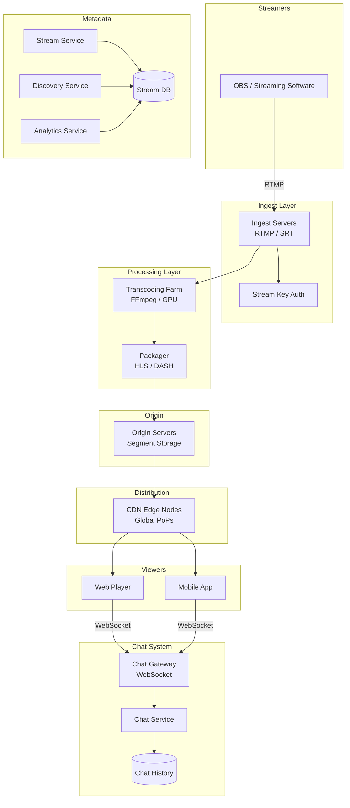
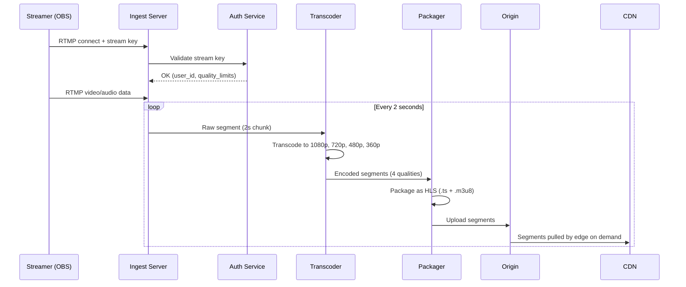
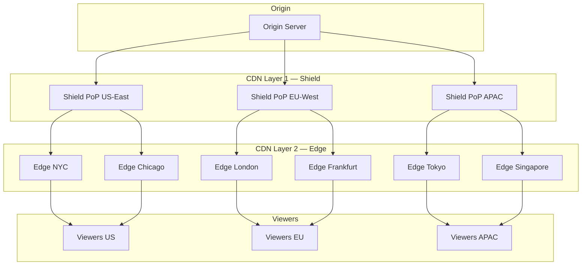
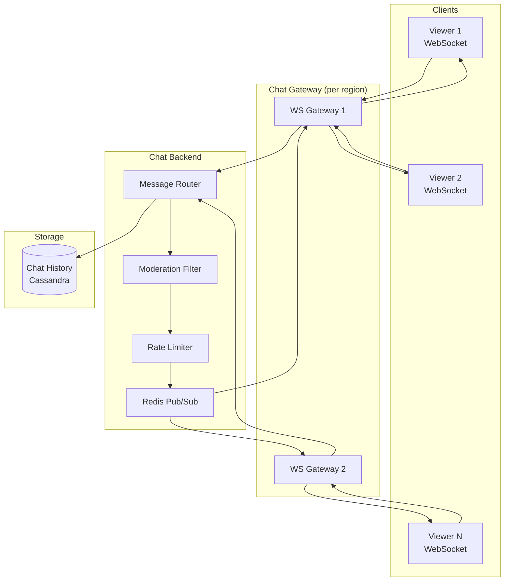

# Design Live Streaming Platform

Live streaming is fundamentally harder than video-on-demand (VOD). In VOD, you process a video once and serve it forever. In live streaming, every second of video must be ingested, transcoded, packaged, and distributed to potentially millions of viewers — all within 2-5 seconds of the streamer speaking. The system must handle massive write amplification: one streamer produces a single video stream, but it must be delivered to 100,000+ concurrent viewers simultaneously.

---

## 1. Problem Statement & Requirements

### Functional Requirements

| # | Requirement |
|---|-------------|
| FR-1 | Streamers broadcast live video via RTMP or WebRTC |
| FR-2 | Viewers watch live streams with < 5s latency |
| FR-3 | Adaptive bitrate streaming (auto quality adjustment) |
| FR-4 | Real-time chat alongside the stream |
| FR-5 | Stream discovery (browse, categories, recommendations) |
| FR-6 | DVR / rewind (watch from start while stream is live) |
| FR-7 | Clip creation (short highlights from live stream) |
| FR-8 | VOD archive (stream saved after broadcast ends) |
| FR-9 | Stream analytics (viewer count, peak viewers, chat rate) |
| FR-10 | Moderation (ban users from chat, DMCA takedown) |

### Non-Functional Requirements

| # | Requirement | Target |
|---|-------------|--------|
| NFR-1 | Glass-to-glass latency | < 5 seconds (standard), < 1s (low-latency mode) |
| NFR-2 | Availability | 99.99% for viewing, 99.95% for streaming |
| NFR-3 | Concurrent viewers per stream | Up to 2 million |
| NFR-4 | Total concurrent streams | 100,000+ |
| NFR-5 | Chat message latency | < 500ms |
| NFR-6 | Video quality | Up to 1080p60 (4K for partners) |

### Clarifying Questions

::: tip Questions to Ask
- What is the primary use case — gaming, IRL, esports, or general purpose?
- Do we need to support co-streaming (multiple streamers in one view)?
- Is monetization in scope (subscriptions, bits/donations)?
- What about mobile streaming (as a broadcaster)?
- Do we need DRM for premium content?
- What regions must we cover? (impacts CDN strategy)
:::

---

## 2. Back-of-Envelope Estimation

### Traffic

- 50M DAU, 10% watch live at any given time during peak = 5M concurrent viewers
- 100,000 concurrent live streams
- Average stream has 50 viewers (power-law: most have < 10, top streamers have 100K+)

### Bandwidth

**Ingest (streamer -> platform):**
- Average ingest bitrate: 6 Mbps (1080p60)
- 100,000 concurrent streamers

$$
\text{Total ingest} = 100{,}000 \times 6 \text{ Mbps} = 600 \text{ Gbps}
$$

**Egress (platform -> viewers):**
- Average viewing bitrate: 4 Mbps (adaptive, blended average)
- 5M concurrent viewers

$$
\text{Total egress} = 5 \times 10^6 \times 4 \text{ Mbps} = 20 \text{ Tbps}
$$

::: warning The Egress Problem
20 Tbps of egress is the dominant cost. This is why CDNs exist — no single origin can serve this. At $0.02/GB, the monthly egress cost is staggering:

$$
\text{Monthly egress} = 20 \times 10^{12} \times 3600 \times 24 \times 30 \div 8 = 8.1 \text{ EB}
$$

$$
\text{Cost} = 8.1 \times 10^9 \text{ GB} \times \$0.02 = \$162M/\text{month}
$$

This is why Twitch uses its own CDN (built on Amazon infrastructure) and why streaming platforms negotiate custom bandwidth pricing.
:::

### Storage

- Average stream duration: 3 hours
- VOD stored in 3 quality levels: 1080p (6 Mbps), 720p (3 Mbps), 480p (1.5 Mbps)
- Streams per day: ~200,000 (some streamers go live multiple times)

$$
\text{Storage per stream} = 3 \text{hr} \times 3600 \times \frac{(6 + 3 + 1.5) \text{ Mbps}}{8} = 14.2 \text{ GB}
$$

$$
\text{Daily VOD storage} = 200{,}000 \times 14.2 \text{ GB} = 2.84 \text{ PB/day}
$$

---

## 3. High-Level Design



---

## 4. API Design

```typescript
// Start a live stream
// POST /api/v1/streams
interface CreateStreamRequest {
  title: string;
  categoryId: string;
  language: string;
  tags: string[];
  enableDvr: boolean;          // Allow rewind
  lowLatencyMode: boolean;     // Sub-second latency
}

interface StreamResponse {
  streamId: string;
  streamKey: string;            // RTMP ingest key (secret)
  ingestUrl: string;            // rtmp://ingest.example.com/live
  playbackUrl: string;          // https://cdn.example.com/live/{streamId}/master.m3u8
  chatRoomId: string;
  status: 'created' | 'live' | 'ended';
}

// Get stream for viewing
// GET /api/v1/streams/:streamId
interface StreamViewResponse {
  streamId: string;
  streamer: UserSummary;
  title: string;
  category: Category;
  viewerCount: number;
  startedAt: string;
  playbackUrl: string;          // HLS manifest URL
  chatRoomId: string;
  thumbnailUrl: string;
  qualities: QualityOption[];   // Available bitrates
}

// Send chat message
// WebSocket: /ws/chat/:roomId
interface ChatMessage {
  type: 'message' | 'system' | 'emote';
  userId: string;
  username: string;
  text: string;
  badges: string[];             // subscriber, mod, vip
  timestamp: number;
  color: string;                // Username color
}

// Browse streams
// GET /api/v1/streams?category=gaming&sort=viewers&cursor=xxx&limit=20
```

---

## 5. Data Model

### Stream Metadata (PostgreSQL)

```sql
CREATE TABLE streams (
    id              UUID PRIMARY KEY DEFAULT gen_random_uuid(),
    streamer_id     UUID NOT NULL REFERENCES users(id),
    title           VARCHAR(200) NOT NULL,
    category_id     UUID REFERENCES categories(id),
    language        CHAR(2) DEFAULT 'en',
    status          VARCHAR(20) DEFAULT 'created',  -- created, live, ended
    stream_key      VARCHAR(64) NOT NULL UNIQUE,
    ingest_server   VARCHAR(100),
    started_at      TIMESTAMP WITH TIME ZONE,
    ended_at        TIMESTAMP WITH TIME ZONE,
    peak_viewers    INT DEFAULT 0,
    total_views     BIGINT DEFAULT 0,
    enable_dvr      BOOLEAN DEFAULT TRUE,
    low_latency     BOOLEAN DEFAULT FALSE,
    vod_url         VARCHAR(500),
    created_at      TIMESTAMP WITH TIME ZONE DEFAULT NOW()
);

CREATE INDEX idx_streams_live ON streams(status, category_id)
    WHERE status = 'live';
CREATE INDEX idx_streams_streamer ON streams(streamer_id, started_at DESC);
```

### Viewer Count (Redis)

```
-- Real-time viewer count per stream
SET stream:viewers:{​{streamId}} {count}

-- Viewer presence tracking (sorted set, score = last heartbeat)
ZADD stream:presence:{​{streamId}} {timestamp} {userId}

-- Category viewer counts (for browse page)
ZINCRBY category:viewers {count} {categoryId}
```

### Chat Messages (Cassandra — high write throughput)

```sql
CREATE TABLE chat_messages (
    room_id     UUID,
    bucket      INT,              -- Time bucket (per hour)
    message_id  TIMEUUID,
    user_id     UUID,
    username    TEXT,
    message     TEXT,
    badges      LIST<TEXT>,
    color       TEXT,
    is_deleted  BOOLEAN,
    PRIMARY KEY ((room_id, bucket), message_id)
) WITH CLUSTERING ORDER BY (message_id DESC);
```

---

## 6. Detailed Design

### 6.1 Video Ingest Pipeline



::: warning RTMP vs. SRT vs. WebRTC for Ingest
| Protocol | Latency | Quality | Firewall | Use Case |
|----------|---------|---------|----------|----------|
| **RTMP** | 2-5s | Good | Easy (TCP 1935) | Standard streaming (OBS default) |
| **SRT** | 1-3s | Better (FEC) | UDP, needs port | Professional broadcasting |
| **WebRTC** | < 1s | Variable | Easy (ICE/STUN) | Browser-based streaming |
| **WHIP** | < 1s | Good | Easy | Emerging standard for WebRTC ingest |

Most platforms accept RTMP for ingest (widest software support) and deliver via HLS/DASH to viewers.
:::

### 6.2 Transcoding

The transcoder converts the streamer's single input into multiple quality levels for adaptive bitrate (ABR) streaming.

```typescript
interface TranscodeProfile {
  name: string;
  width: number;
  height: number;
  bitrate: number;        // kbps
  fps: number;
  codec: string;
  preset: string;
}

const PROFILES: TranscodeProfile[] = [
  { name: 'source',  width: 1920, height: 1080, bitrate: 6000, fps: 60, codec: 'h264', preset: 'veryfast' },
  { name: '720p60',  width: 1280, height: 720,  bitrate: 3000, fps: 60, codec: 'h264', preset: 'veryfast' },
  { name: '480p30',  width: 854,  height: 480,  bitrate: 1500, fps: 30, codec: 'h264', preset: 'veryfast' },
  { name: '360p30',  width: 640,  height: 360,  bitrate: 800,  fps: 30, codec: 'h264', preset: 'veryfast' },
];

// FFmpeg command (simplified)
// ffmpeg -i rtmp://input \
//   -map 0:v -map 0:a -c:v libx264 -preset veryfast \
//   -s 1920x1080 -b:v 6000k -r 60 -g 120 \
//   -f hls -hls_time 2 -hls_list_size 5 \
//   /output/1080p60/stream.m3u8 \
//   ... (repeat for each profile)
```

### 6.3 HLS Packaging & Delivery

```
Master Playlist (master.m3u8):
┌──────────────────────────────────────────────┐
│ #EXTM3U                                      │
│ #EXT-X-STREAM-INF:BANDWIDTH=6000000,         │
│   RESOLUTION=1920x1080,FRAME-RATE=60         │
│ 1080p60/playlist.m3u8                        │
│ #EXT-X-STREAM-INF:BANDWIDTH=3000000,         │
│   RESOLUTION=1280x720,FRAME-RATE=60          │
│ 720p60/playlist.m3u8                         │
│ #EXT-X-STREAM-INF:BANDWIDTH=1500000,         │
│   RESOLUTION=854x480,FRAME-RATE=30           │
│ 480p30/playlist.m3u8                         │
└──────────────────────────────────────────────┘

Media Playlist (1080p60/playlist.m3u8):
┌──────────────────────────────────────────────┐
│ #EXTM3U                                      │
│ #EXT-X-TARGETDURATION:2                      │
│ #EXT-X-MEDIA-SEQUENCE:1847                   │
│ #EXTINF:2.000,                               │
│ segment_1847.ts                              │
│ #EXTINF:2.000,                               │
│ segment_1848.ts                              │
│ #EXTINF:2.000,                               │
│ segment_1849.ts                              │
└──────────────────────────────────────────────┘
```

The player polls the playlist every segment duration (2s), discovers new segments, and downloads them. This is how HLS achieves "live" — it's really just fast-refreshing VOD.

### 6.4 CDN Architecture



::: tip Hot Stream Optimization
A stream with 500,000 viewers in NYC means the same segment is requested 500,000 times. The CDN edge node should cache each 2-second segment for at least 4 seconds. The cache hit rate for popular streams approaches 99.9% — only one request per segment per edge node reaches the shield layer.
:::

### 6.5 Real-Time Chat



```typescript
class ChatService {
  private pubsub: RedisCluster;
  private readonly MAX_MESSAGES_PER_SECOND = 5;

  async handleMessage(roomId: string, message: ChatMessage): Promise<void> {
    // 1. Rate limit
    const rateLimitKey = `chat:rate:${message.userId}`;
    const count = await this.pubsub.incr(rateLimitKey);
    if (count === 1) await this.pubsub.expire(rateLimitKey, 1);
    if (count > this.MAX_MESSAGES_PER_SECOND) {
      throw new Error('Rate limited');
    }

    // 2. Moderation (banned words, links, etc.)
    const filtered = await this.moderate(message);
    if (!filtered) return; // Message blocked

    // 3. Publish to room channel
    await this.pubsub.publish(
      `chat:${roomId}`,
      JSON.stringify(filtered)
    );

    // 4. Persist to history (async, best-effort)
    this.persistMessage(roomId, filtered).catch(console.error);
  }

  async subscribeToRoom(roomId: string, callback: (msg: ChatMessage) => void): Promise<void> {
    await this.pubsub.subscribe(`chat:${roomId}`, (message) => {
      callback(JSON.parse(message));
    });
  }

  private async moderate(message: ChatMessage): Promise<ChatMessage | null> {
    // Check banned words, emote-only mode, subscriber-only mode, slow mode
    return message;
  }

  private async persistMessage(roomId: string, message: ChatMessage): Promise<void> {
    // Write to Cassandra
  }
}
```

::: warning Chat Scaling Challenge
Redis Pub/Sub broadcasts to all subscribers on a single Redis node. For a chat room with 1M viewers:
- **Problem**: 1M WebSocket connections on one Redis channel = 1M publishes per message
- **Solution**: Fan out at the gateway layer. Each gateway subscribes to the Redis channel once and broadcasts to its local connections. With 100 gateways, Redis handles 100 subscribers, not 1M.
:::

### 6.6 Viewer Count Tracking

```typescript
class ViewerTracker {
  private redis: RedisCluster;
  private readonly HEARTBEAT_INTERVAL = 30_000; // 30 seconds
  private readonly STALE_THRESHOLD = 60_000;    // 60 seconds

  async heartbeat(streamId: string, userId: string): Promise<void> {
    await this.redis.zadd(
      `stream:presence:${streamId}`,
      Date.now(),
      userId
    );
  }

  async getViewerCount(streamId: string): Promise<number> {
    const cutoff = Date.now() - this.STALE_THRESHOLD;
    // Remove stale entries
    await this.redis.zremrangebyscore(
      `stream:presence:${streamId}`, 0, cutoff
    );
    // Count remaining
    return this.redis.zcard(`stream:presence:${streamId}`);
  }

  // Approximate count for display (updated every 15s)
  async getCachedViewerCount(streamId: string): Promise<number> {
    const cached = await this.redis.get(`stream:viewers:${streamId}`);
    if (cached) return parseInt(cached);

    const count = await this.getViewerCount(streamId);
    await this.redis.setex(`stream:viewers:${streamId}`, 15, count.toString());
    return count;
  }
}
```

---

## 7. Scaling & Bottlenecks

### What Breaks First?

| Bottleneck | Symptom | Solution |
|-----------|---------|----------|
| Transcoding capacity | Streams queued, high latency | GPU transcoding (NVENC), auto-scale |
| Origin bandwidth | Segments delayed to CDN | Multi-origin with geographic routing |
| CDN cache miss storms | New segment = thundering herd | Shield layer absorbs origin requests |
| Chat at scale (1M viewers) | Message delivery lag | Gateway fan-out, not Redis fan-out |
| Viewer count accuracy | Stale counts, overcounting | Heartbeat + sorted set with TTL |
| Stream key leaks | Unauthorized broadcasting | Rotating stream keys, IP binding |

### Latency Budget

```
Streamer captures frame:           0ms
Encode + RTMP send to ingest:    200ms
Ingest receives full segment:   2000ms  (2s segment)
Transcode:                       500ms
Package + upload to origin:      300ms
CDN edge pull:                   200ms
Player buffer + render:          500ms
────────────────────────────────────────
Total glass-to-glass:          ~3.7s
```

### Low-Latency Mode

For sub-second latency, replace HLS with:
- **LL-HLS** (Low-Latency HLS): Uses HTTP/2 push and partial segments (200ms chunks)
- **WebRTC**: Peer-to-peer or SFU-based, sub-500ms but harder to scale
- **Trade-off**: Lower latency = less CDN cacheability = higher origin load = higher cost

| Mode | Latency | CDN Cacheable | Cost | Viewer Scale |
|------|---------|--------------|------|-------------|
| Standard HLS | 3-6s | Excellent | Low | Unlimited |
| LL-HLS | 1-3s | Good | Medium | Unlimited |
| WebRTC (SFU) | 0.3-1s | No | High | ~50K viewers |
| WebRTC (P2P) | 0.3-1s | N/A | Low | ~100 viewers |

---

## 8. Trade-offs

### HLS vs. DASH vs. WebRTC

| Protocol | Latency | Browser Support | DRM | CDN Compatible |
|----------|---------|-----------------|-----|----------------|
| **HLS** | 3-6s | Universal | FairPlay | Yes |
| **DASH** | 3-6s | All except iOS Safari | Widevine, PlayReady | Yes |
| **LL-HLS** | 1-3s | Modern browsers | FairPlay | Yes |
| **WebRTC** | < 1s | All modern | Limited | No |

::: tip Recommendation
Use **HLS** for standard delivery (widest compatibility, best CDN caching). Offer **LL-HLS** as an opt-in low-latency mode. Reserve **WebRTC** for interactive features (co-streaming, watch parties) where latency matters more than scale.
:::

### Transcoding: CPU vs. GPU

| Approach | Cost/stream | Quality | Latency | Density |
|----------|------------|---------|---------|---------|
| CPU (x264) | ~$0.05/hr | Best (tunable) | Higher | 4-8 streams/server |
| GPU (NVENC) | ~$0.03/hr | Good | Lower | 20-40 streams/GPU |
| FPGA/ASIC | ~$0.02/hr | Good | Lowest | 50+ streams/card |

---

## 9. Interview Tips

### What Interviewers Look For

1. **Ingest -> Transcode -> CDN pipeline** — Can you explain the end-to-end video path?
2. **HLS segmented delivery** — Do you understand how "live" streaming is really chunked VOD?
3. **CDN caching strategy** — Hot streams, shield layer, edge caching
4. **Chat scaling** — WebSocket fan-out, not Redis broadcasting to all clients
5. **Latency budget** — Where does each millisecond go?

### Common Follow-Up Questions

::: details "How do you handle a streamer with 2 million concurrent viewers?"
The CDN handles it. Each 2-second segment is cached at the edge. With 200 PoPs globally, each PoP serves ~10,000 viewers from cache. The origin only serves ~200 requests per segment (one per PoP). Chat is the harder problem — use gateway fan-out with 200+ WebSocket gateways, each subscribing to Redis once.
:::

::: details "What happens when the transcoder falls behind?"
If the transcoder can't keep up, segments arrive late, and viewers see buffering. Solutions: (1) drop to fewer quality levels under load, (2) GPU transcoding for 5x density, (3) auto-scale transcoder fleet based on active stream count, (4) allow streamers to pass through source quality without transcoding (trade-off: viewer quality selection unavailable).
:::

::: details "How do you implement stream DVR (rewind)?"
Store all segments since stream start on the origin (not just the last 5). The DVR playlist is a full HLS playlist with all segments. Viewers can seek backwards. The segment TTL on CDN is extended to cover the full stream duration. This increases origin storage cost but enables a valuable feature.
:::

### Time Allocation (45-minute interview)

| Phase | Time | Focus |
|-------|------|-------|
| Requirements | 4 min | Core features, latency target |
| Estimation | 4 min | Bandwidth (ingest + egress), storage |
| High-level design | 10 min | Ingest -> transcode -> CDN pipeline |
| Video deep dive | 10 min | HLS segments, ABR, transcoding |
| Chat system | 7 min | WebSocket, pub/sub, fan-out |
| CDN + scaling | 5 min | Shield layer, caching, hot streams |
| Trade-offs | 5 min | HLS vs WebRTC, latency vs. cost |

---

## Summary

| Component | Technology | Scale |
|-----------|-----------|-------|
| Ingest | RTMP/SRT servers (geo-distributed) | 100K concurrent streams |
| Transcoding | GPU farm (NVENC) + FFmpeg | 4 quality levels per stream |
| Packaging | HLS segmenter (2s segments) | 400K segments/sec |
| Origin | Object storage + HTTP origin | 600 Gbps ingest |
| CDN | Multi-layer (shield + edge), 200+ PoPs | 20 Tbps egress |
| Chat | WebSocket gateways + Redis Pub/Sub | 500M messages/day |
| Viewer Tracking | Redis sorted sets + heartbeat | 5M concurrent viewers |
| Stream Metadata | PostgreSQL + Redis cache | 100K live streams |
| VOD Archive | S3 + HLS manifests | 2.84 PB/day |

**Related**: [Design YouTube](/system-design-interviews/youtube) | [Design Netflix](/system-design-interviews/netflix) | [Design a CDN](/system-design-interviews/cdn)
