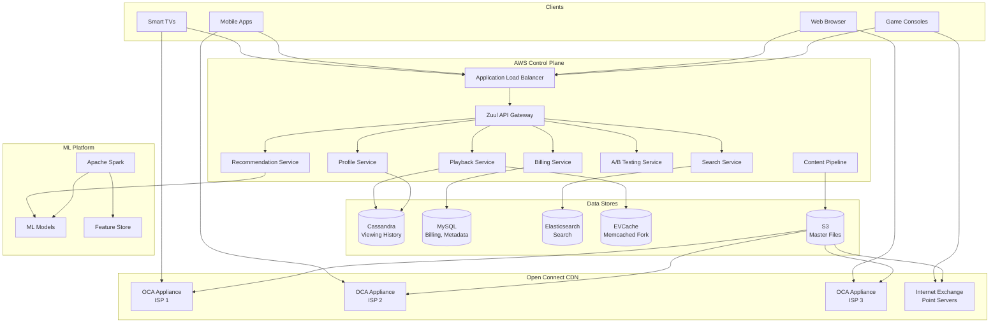
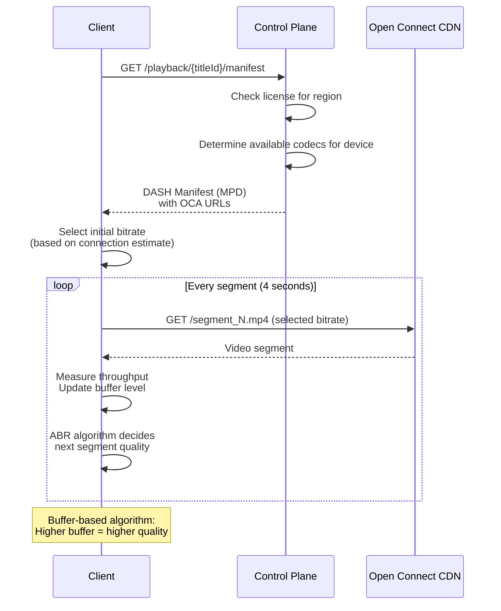
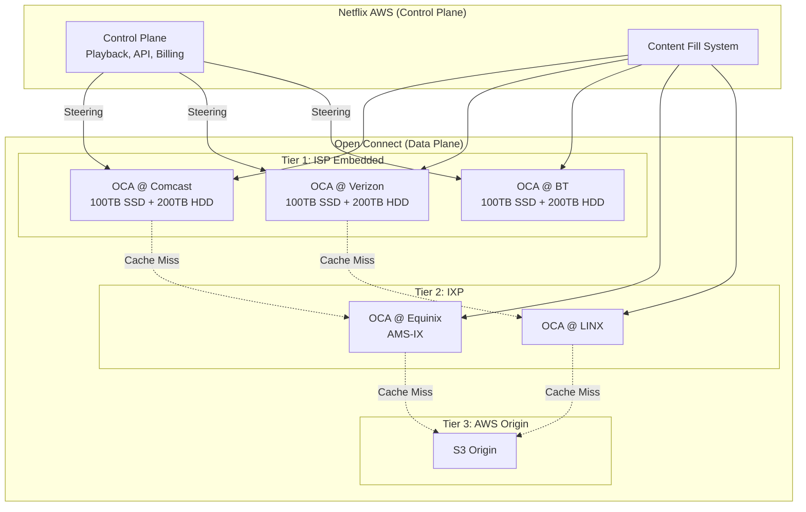
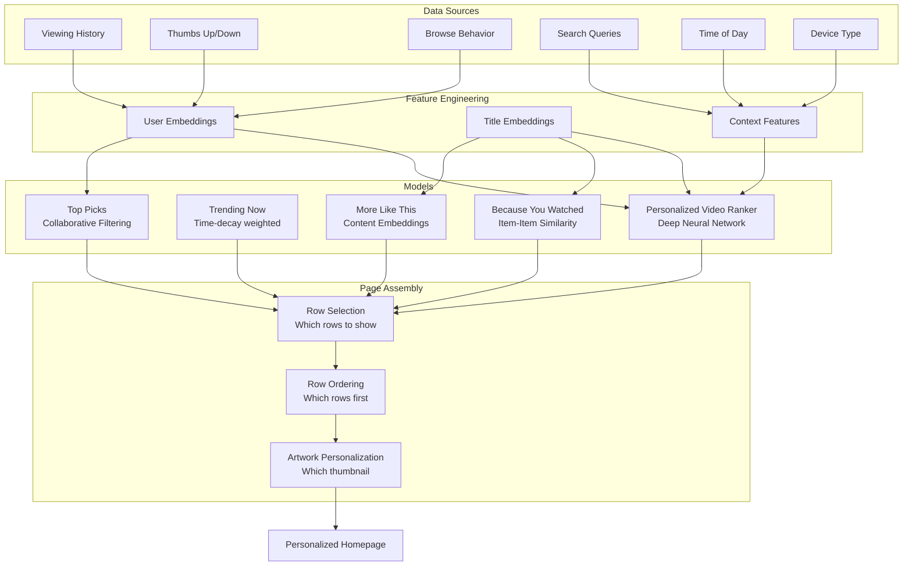
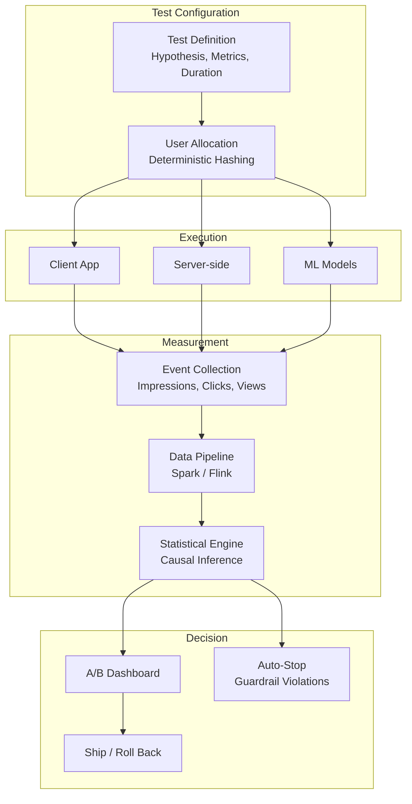
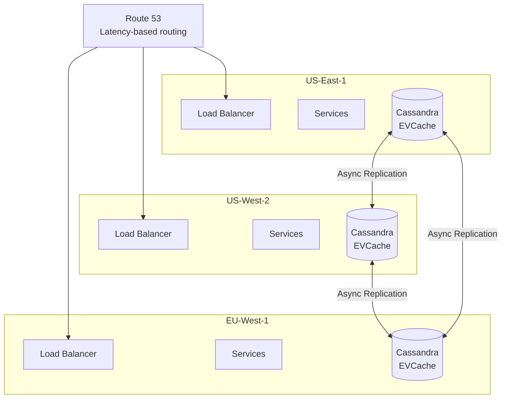

# Design Netflix — Video Streaming Platform

## 1. Problem Statement & Requirements

### Functional Requirements

| # | Requirement | Details |
|---|-------------|---------|
| FR-1 | Video Streaming | Stream movies and TV shows with play/pause/seek |
| FR-2 | Content Upload | Studios upload master files, auto-transcode to all formats |
| FR-3 | Search & Browse | Search by title, actor, genre; browse categories |
| FR-4 | Recommendations | Personalized homepage, "Because you watched...", Top 10 |
| FR-5 | User Profiles | Multiple profiles per account, parental controls |
| FR-6 | Watchlist | Add/remove titles to personal watchlist |
| FR-7 | Continue Watching | Resume playback across devices |
| FR-8 | Downloads | Offline viewing on mobile devices |
| FR-9 | Subtitles & Audio | Multiple subtitle tracks, audio languages, descriptive audio |
| FR-10 | A/B Testing | Test UI variations, thumbnails, recommendation algorithms |

### Non-Functional Requirements

| # | Requirement | Target |
|---|-------------|--------|
| NFR-1 | Availability | 99.99% uptime |
| NFR-2 | Latency | Video start < 2 seconds |
| NFR-3 | Throughput | 200M+ concurrent viewers during peak |
| NFR-4 | Consistency | Eventual consistency for profiles, strong for billing |
| NFR-5 | Durability | Zero data loss for content and user data |
| NFR-6 | Global Scale | 230+ countries and territories |

---

## 2. Back-of-Envelope Estimation

### User Scale

$$
\text{Total Subscribers} = 260M \quad \text{DAU} = 100M \quad \text{Peak Concurrent} = 15M
$$

### Storage Estimation

**Video Content Library:**

$$
\text{Total Titles} = 17{,}000+ \quad \text{(movies + series episodes)}
$$

$$
\text{Avg Movie Duration} = 1.5 \text{ hrs} = 5{,}400 \text{ sec}
$$

$$
\text{Encoding Profiles} \approx 1{,}200 \text{ per title (bitrate x resolution x codec)}
$$

$$
\text{Avg Encoded Size per Profile} \approx 2 \text{ GB (for a movie)}
$$

$$
\text{Storage per Title} = 1{,}200 \times 2 \text{ GB} = 2.4 \text{ TB}
$$

$$
\text{Total Content Storage} = 17{,}000 \times 2.4 \text{ TB} \approx 40 \text{ PB}
$$

### Bandwidth Estimation

$$
\text{Peak Concurrent Streams} = 15M
$$

$$
\text{Avg Bitrate} = 5 \text{ Mbps}
$$

$$
\text{Peak Bandwidth} = 15M \times 5 \text{ Mbps} = 75 \text{ Tbps}
$$

Netflix accounts for approximately 15% of global downstream internet traffic.

### QPS Estimation

$$
\text{API Requests (Browse/Search)} = \frac{100M \times 50}{86{,}400} \approx 58{,}000 \text{ req/s}
$$

$$
\text{Stream Manifest Requests} = \frac{100M \times 3}{86{,}400} \approx 3{,}500 \text{ req/s}
$$

$$
\text{Playback Heartbeats} = 15M \times \frac{1}{10s} = 1.5M \text{ req/s}
$$

---

## 3. High-Level Design

### Architecture Diagram



### API Design

```typescript
// Playback APIs
GET  /api/v1/playback/{titleId}/manifest
     // Returns: adaptive streaming manifest (DASH/HLS) with CDN URLs
POST /api/v1/playback/{titleId}/heartbeat
     // Body: { positionMs, bufferHealth, bitrate, deviceId }
POST /api/v1/playback/{titleId}/event
     // Body: { type: "play"|"pause"|"seek"|"stop", positionMs }

// Browse & Search
GET  /api/v1/browse/home
     // Returns: personalized rows (Continue Watching, Trending, etc.)
GET  /api/v1/search?q={query}&limit=20

// Profile & Watchlist
GET    /api/v1/profiles
POST   /api/v1/profiles
GET    /api/v1/profiles/{profileId}/watchlist
POST   /api/v1/profiles/{profileId}/watchlist/{titleId}
DELETE /api/v1/profiles/{profileId}/watchlist/{titleId}

// Content Pipeline (internal)
POST /api/v1/content/ingest
     // Body: { titleId, masterFileUrl, metadata }
GET  /api/v1/content/{titleId}/encoding-status
```

---

## 4. Database Schema

### Titles Table (MySQL / Aurora)

```sql
CREATE TABLE titles (
    title_id        BIGINT PRIMARY KEY AUTO_INCREMENT,
    title_type      ENUM('movie', 'series', 'documentary', 'special') NOT NULL,
    name            VARCHAR(500) NOT NULL,
    original_lang   CHAR(5) DEFAULT 'en',
    release_year    SMALLINT,
    maturity_rating VARCHAR(10), -- TV-MA, PG-13, etc.
    duration_min    SMALLINT,     -- NULL for series
    synopsis        TEXT,
    poster_url      VARCHAR(500),
    backdrop_url    VARCHAR(500),
    created_at      TIMESTAMP DEFAULT CURRENT_TIMESTAMP,
    updated_at      TIMESTAMP DEFAULT CURRENT_TIMESTAMP ON UPDATE CURRENT_TIMESTAMP
);

CREATE INDEX idx_titles_type ON titles(title_type);
CREATE INDEX idx_titles_year ON titles(release_year DESC);
```

### Encoding Profiles Table

```sql
CREATE TABLE encoding_profiles (
    profile_id      BIGINT PRIMARY KEY AUTO_INCREMENT,
    title_id        BIGINT NOT NULL REFERENCES titles(title_id),
    resolution      VARCHAR(10) NOT NULL, -- 240p, 360p, 480p, 720p, 1080p, 4K
    bitrate_kbps    INT NOT NULL,
    codec           VARCHAR(20) NOT NULL, -- H.264, H.265, VP9, AV1
    audio_codec     VARCHAR(20) NOT NULL, -- AAC, EAC3, Atmos
    file_size_mb    INT NOT NULL,
    cdn_path        VARCHAR(500) NOT NULL,
    status          ENUM('encoding', 'ready', 'failed') DEFAULT 'encoding',
    created_at      TIMESTAMP DEFAULT CURRENT_TIMESTAMP
);

CREATE INDEX idx_encoding_title ON encoding_profiles(title_id, status);
CREATE INDEX idx_encoding_resolution ON encoding_profiles(resolution, codec);
```

### Regional Licensing Table

```sql
CREATE TABLE content_licenses (
    license_id      BIGINT PRIMARY KEY AUTO_INCREMENT,
    title_id        BIGINT NOT NULL REFERENCES titles(title_id),
    region          CHAR(2) NOT NULL,     -- ISO 3166-1 alpha-2
    license_start   DATE NOT NULL,
    license_end     DATE NOT NULL,
    exclusive       BOOLEAN DEFAULT FALSE,
    created_at      TIMESTAMP DEFAULT CURRENT_TIMESTAMP,
    UNIQUE KEY uk_title_region (title_id, region)
);

CREATE INDEX idx_license_region ON content_licenses(region, license_start, license_end);
```

### Viewing History (Cassandra)

```sql
CREATE TABLE viewing_history (
    profile_id  UUID,
    watched_at  TIMESTAMP,
    title_id    BIGINT,
    episode_id  BIGINT,
    position_ms BIGINT,
    duration_ms BIGINT,
    completed   BOOLEAN,
    device_type TEXT,
    PRIMARY KEY ((profile_id), watched_at)
) WITH CLUSTERING ORDER BY (watched_at DESC);
```

### A/B Test Assignments

```sql
CREATE TABLE ab_test_assignments (
    user_id         BIGINT NOT NULL,
    test_id         VARCHAR(100) NOT NULL,
    variant         VARCHAR(50) NOT NULL,
    assigned_at     TIMESTAMP DEFAULT CURRENT_TIMESTAMP,
    PRIMARY KEY (user_id, test_id)
);

CREATE INDEX idx_ab_test ON ab_test_assignments(test_id, variant);
```

---

## 5. Detailed Component Design

### 5.1 Video Transcoding Pipeline

Netflix's transcoding pipeline converts master files into thousands of encoded versions.

```mermaid
graph LR
    Master[Master File<br/>4K ProRes/TIFF] --> QC[Quality Control<br/>Automated Checks]
    QC --> Analysis[Content Analysis<br/>Scene Detection<br/>Complexity Mapping]
    Analysis --> ChunkSplit[Chunk Splitter<br/>GOP-aligned segments]
    ChunkSplit --> Encode[Parallel Encoding<br/>100s of workers]
    Encode --> Assemble[Chunk Assembly]
    Assemble --> Validate[Validation<br/>VMAF Score Check]
    Validate --> Package[Packaging<br/>DASH + HLS Manifests]
    Package --> Encrypt[DRM Encryption<br/>Widevine + FairPlay]
    Encrypt --> CDNDist[CDN Distribution<br/>Open Connect Fill]
```



**Per-title encoding optimization:**

Netflix uses per-title encoding — each title gets custom bitrate ladders based on its visual complexity.

$$
\text{VMAF}(v, b) = f(\text{video } v \text{ at bitrate } b)
$$

$$
\text{Optimal Bitrate Ladder} = \arg\min_{b_1 < b_2 < \ldots < b_n} \sum_{i} b_i \quad \text{s.t.} \quad \text{VMAF}(v, b_i) \geq \text{target}_i
$$

```typescript
interface EncodingLadder {
  titleId: string;
  profiles: EncodingRung[];
}

interface EncodingRung {
  resolution: string;     // "1920x1080"
  bitrate: number;        // kbps
  vmafTarget: number;     // Target quality score (0-100)
  codec: string;          // "H.265" | "AV1"
}

// Simple animation (e.g., anime) needs fewer bits
const ANIME_LADDER: EncodingRung[] = [
  { resolution: '3840x2160', bitrate: 4000,  vmafTarget: 95, codec: 'AV1' },
  { resolution: '1920x1080', bitrate: 1500,  vmafTarget: 93, codec: 'AV1' },
  { resolution: '1280x720',  bitrate: 750,   vmafTarget: 90, codec: 'H.265' },
  { resolution: '640x480',   bitrate: 300,   vmafTarget: 85, codec: 'H.265' },
  { resolution: '320x240',   bitrate: 100,   vmafTarget: 75, codec: 'H.264' },
];

// Visually complex action movie needs more bits
const ACTION_LADDER: EncodingRung[] = [
  { resolution: '3840x2160', bitrate: 16000, vmafTarget: 95, codec: 'AV1' },
  { resolution: '1920x1080', bitrate: 5800,  vmafTarget: 93, codec: 'H.265' },
  { resolution: '1280x720',  bitrate: 3000,  vmafTarget: 90, codec: 'H.265' },
  { resolution: '640x480',   bitrate: 1200,  vmafTarget: 85, codec: 'H.264' },
  { resolution: '320x240',   bitrate: 500,   vmafTarget: 75, codec: 'H.264' },
];
```

**Parallel chunk encoding:**

```typescript
class TranscodingOrchestrator {
  async transcode(titleId: string, masterUrl: string): Promise<void> {
    // 1. Split video into 4-second GOP-aligned chunks
    const chunks = await this.splitIntoChunks(masterUrl, 4);

    // 2. Analyze complexity per chunk
    const complexityMap = await this.analyzeComplexity(chunks);

    // 3. Determine optimal encoding ladder
    const ladder = await this.optimizeLadder(titleId, complexityMap);

    // 4. Encode each chunk x each rung in parallel
    const jobs: EncodingJob[] = [];
    for (const chunk of chunks) {
      for (const rung of ladder.profiles) {
        jobs.push({
          titleId,
          chunkIndex: chunk.index,
          resolution: rung.resolution,
          bitrate: rung.bitrate,
          codec: rung.codec,
          sourceChunkUrl: chunk.url,
        });
      }
    }

    // Dispatch to encoding workers (Kubernetes pods)
    // A single movie generates ~20,000 encoding jobs
    await this.jobQueue.enqueueBatch(jobs);

    // 5. Wait for all chunks, then assemble
    await this.waitForCompletion(titleId);
    await this.assembleChunks(titleId, ladder);
    await this.generateManifests(titleId, ladder);
    await this.applyDRM(titleId);
    await this.distributeToCDN(titleId);
  }
}
```

### 5.2 Adaptive Bitrate Streaming (ABR)

Netflix uses MPEG-DASH with a custom ABR algorithm.



**Netflix's buffer-based ABR algorithm:**

```typescript
class NetflixABR {
  private bufferLevelSec: number = 0;
  private readonly RESERVOIR = 8;   // Min buffer seconds
  private readonly CUSHION = 30;    // Target buffer seconds
  private readonly MAX_BUFFER = 60; // Max buffer seconds

  selectBitrate(ladder: EncodingRung[]): number {
    const sortedBitrates = ladder.map(r => r.bitrate).sort((a, b) => a - b);

    if (this.bufferLevelSec < this.RESERVOIR) {
      // Buffer critically low - drop to minimum
      return sortedBitrates[0];
    }

    if (this.bufferLevelSec > this.CUSHION) {
      // Buffer healthy - can increase quality
      const ratio = Math.min(
        (this.bufferLevelSec - this.CUSHION) / (this.MAX_BUFFER - this.CUSHION),
        1.0
      );
      const index = Math.floor(ratio * (sortedBitrates.length - 1));
      return sortedBitrates[index];
    }

    // In cushion zone - maintain current quality
    return this.currentBitrate;
  }

  onSegmentDownloaded(segmentSizeBytes: number, downloadTimeMs: number, segmentDurationSec: number): void {
    this.bufferLevelSec += segmentDurationSec;
    const throughputKbps = (segmentSizeBytes * 8) / downloadTimeMs;
    this.throughputHistory.push(throughputKbps);
  }

  onPlayback(elapsedSec: number): void {
    this.bufferLevelSec -= elapsedSec;
  }
}
```

### 5.3 Open Connect CDN

Netflix built its own CDN called Open Connect, placing custom appliances (OCAs) inside ISP networks.



**OCA hardware specs (per appliance):**

| Component | Specification |
|-----------|--------------|
| Storage | 100 TB NVMe SSD + 200 TB HDD |
| Network | 100 Gbps NICs |
| CPU | 2x Intel Xeon |
| RAM | 64 GB |
| OS | FreeBSD-based custom OS |

**Content popularity and caching:**

$$
\text{Cache Strategy} = \begin{cases}
\text{SSD (Hot)} & \text{if title in top 20\% by views} \\
\text{HDD (Warm)} & \text{if title in top 80\%} \\
\text{Not cached} & \text{if long tail (fetched from IXP/origin)}
\end{cases}
$$

```typescript
class ContentFillManager {
  // Proactive fill: pre-populate OCAs during off-peak hours
  async nightlyFill(): Promise<void> {
    const ocas = await this.getActiveOCAs();

    for (const oca of ocas) {
      const region = oca.region;
      const popularTitles = await this.getPopularTitles(region, 5000);

      // Determine what is already cached
      const cached = await oca.getCachedTitles();
      const toFill = popularTitles.filter(t => !cached.has(t.titleId));
      const toEvict = cached.filter(t => !popularTitles.has(t));

      // Fill new content, evict stale
      for (const title of toEvict) {
        await oca.evict(title);
      }
      for (const title of toFill) {
        await oca.fill(title, this.getEncodingProfiles(title, region));
      }
    }
  }

  // Client steering: select best OCA for this client
  selectOCA(clientIP: string, titleId: string): OCASelection {
    const clientISP = this.geoIP.getISP(clientIP);
    const clientRegion = this.geoIP.getRegion(clientIP);

    // Prefer ISP-embedded OCA
    const ispOCA = this.findOCAInISP(clientISP, titleId);
    if (ispOCA && ispOCA.load < 0.8) return ispOCA;

    // Fall back to IXP
    const ixpOCA = this.findNearestIXP(clientRegion, titleId);
    if (ixpOCA) return ixpOCA;

    // Last resort: AWS origin
    return this.getOriginURL(titleId);
  }
}
```

### 5.4 Recommendation Engine

Netflix's recommendation system drives 80% of content watched.



**Personalized artwork selection:**

Netflix chooses different thumbnails for different users based on their preferences.

```typescript
interface ArtworkVariant {
  titleId: string;
  imageUrl: string;
  features: string[];  // e.g., ["action_scene", "romance", "comedy_moment"]
  performanceBySegment: Map<string, number>; // segment -> CTR
}

class ArtworkPersonalizer {
  async selectArtwork(
    titleId: string,
    userProfile: UserProfile
  ): Promise<string> {
    const variants = await this.getArtworkVariants(titleId);
    const userSegment = await this.getUserSegment(userProfile);

    // Multi-armed bandit: Thompson Sampling
    let bestVariant: ArtworkVariant | null = null;
    let bestSample = -Infinity;

    for (const variant of variants) {
      const successes = variant.performanceBySegment.get(userSegment)?.clicks ?? 1;
      const failures = variant.performanceBySegment.get(userSegment)?.impressions ?? 1;

      // Sample from Beta distribution
      const sample = this.betaSample(successes, failures - successes);
      if (sample > bestSample) {
        bestSample = sample;
        bestVariant = variant;
      }
    }

    return bestVariant!.imageUrl;
  }

  private betaSample(alpha: number, beta: number): number {
    // Approximation of Beta distribution sampling
    const x = this.gammaSample(alpha);
    const y = this.gammaSample(beta);
    return x / (x + y);
  }
}
```

### 5.5 A/B Testing at Scale

Netflix runs hundreds of A/B tests simultaneously, affecting every aspect of the product.



```typescript
interface ABTest {
  testId: string;
  name: string;
  hypothesis: string;
  primaryMetric: string;           // e.g., "streaming_hours_per_member"
  secondaryMetrics: string[];
  guardrailMetrics: string[];      // Must not degrade (e.g., "retention_d28")
  variants: ABVariant[];
  trafficPercentage: number;       // % of eligible users
  startDate: Date;
  minimumDetectableEffect: number; // e.g., 0.5% lift
  requiredSampleSize: number;
}

class ABTestingService {
  // Deterministic assignment — same user always gets same variant
  getVariant(userId: string, testId: string): string {
    const hash = this.murmurHash3(`${userId}:${testId}`);
    const bucket = hash % 10000; // 0.01% granularity

    const test = this.tests.get(testId)!;
    if (bucket >= test.trafficPercentage * 100) {
      return 'not_in_test';
    }

    // Assign to variant proportionally
    let cumulative = 0;
    for (const variant of test.variants) {
      cumulative += variant.weight * 10000;
      if (bucket < cumulative) return variant.id;
    }

    return test.variants[0].id;
  }

  // Interleaving for ranking experiments
  async interleaveRankings(
    userId: string,
    controlRanking: string[],
    treatmentRanking: string[]
  ): Promise<string[]> {
    // Team-Draft Interleaving
    const interleaved: string[] = [];
    const used = new Set<string>();
    let controlIdx = 0, treatmentIdx = 0;

    while (interleaved.length < Math.max(controlRanking.length, treatmentRanking.length)) {
      // Alternate picking from control and treatment
      if (Math.random() < 0.5) {
        while (controlIdx < controlRanking.length && used.has(controlRanking[controlIdx])) controlIdx++;
        if (controlIdx < controlRanking.length) {
          interleaved.push(controlRanking[controlIdx]);
          used.add(controlRanking[controlIdx]);
        }
      } else {
        while (treatmentIdx < treatmentRanking.length && used.has(treatmentRanking[treatmentIdx])) treatmentIdx++;
        if (treatmentIdx < treatmentRanking.length) {
          interleaved.push(treatmentRanking[treatmentIdx]);
          used.add(treatmentRanking[treatmentIdx]);
        }
      }
    }

    return interleaved;
  }
}
```

### 5.6 Regional Licensing

Content availability varies by country due to licensing agreements.

```typescript
class LicensingService {
  async getAvailableTitles(region: string, profileId: string): Promise<Title[]> {
    // Check license validity for region
    const titles = await this.db.query(`
      SELECT t.*
      FROM titles t
      JOIN content_licenses cl ON t.title_id = cl.title_id
      WHERE cl.region = $1
        AND cl.license_start <= CURRENT_DATE
        AND cl.license_end >= CURRENT_DATE
    `, [region]);

    // Apply maturity filter based on profile settings
    const profile = await this.getProfile(profileId);
    return titles.filter(t => this.passesMaturityFilter(t, profile));
  }

  // Handle title leaving a region
  async handleLicenseExpiry(titleId: string, region: string): Promise<void> {
    // Remove from CDN caches in region
    await this.cdnManager.evictFromRegion(titleId, region);

    // Remove from browse/search in region
    await this.searchIndex.removeFromRegion(titleId, region);

    // Notify users who have it in watchlist
    const affectedUsers = await this.getWatchlistUsers(titleId, region);
    await this.notificationService.sendBatch(affectedUsers, {
      type: 'title_leaving',
      titleId,
      leaveDate: new Date(),
    });
  }
}
```

---

## 6. Scaling & Bottlenecks

### What Breaks First

| Component | Bottleneck | Solution |
|-----------|-----------|----------|
| Transcoding | Single movie = 20K+ encoding jobs | Kubernetes auto-scaling, spot instances |
| CDN | 75 Tbps peak bandwidth | 17,000+ OCA servers in 6,000+ ISPs |
| Metadata API | 58K req/s for browse | EVCache (Memcached) with 99.9% hit rate |
| Viewing History | 1.5M heartbeats/s | Cassandra with time-partitioned tables |
| Recommendations | Must serve in < 100ms | Pre-compute, cache in EVCache |
| Search | Real-time indexing | Elasticsearch with custom analyzers |

### Microservice Resilience

Netflix pioneered chaos engineering and resilience patterns.

```typescript
// Hystrix-style circuit breaker (now Resilience4j)
class CircuitBreaker {
  private state: 'CLOSED' | 'OPEN' | 'HALF_OPEN' = 'CLOSED';
  private failureCount = 0;
  private lastFailureTime = 0;
  private readonly threshold = 5;
  private readonly timeout = 30000; // 30s

  async execute<T>(fn: () => Promise<T>, fallback: () => T): Promise<T> {
    if (this.state === 'OPEN') {
      if (Date.now() - this.lastFailureTime > this.timeout) {
        this.state = 'HALF_OPEN';
      } else {
        return fallback();
      }
    }

    try {
      const result = await fn();
      this.onSuccess();
      return result;
    } catch (error) {
      this.onFailure();
      return fallback();
    }
  }

  private onSuccess(): void {
    this.failureCount = 0;
    this.state = 'CLOSED';
  }

  private onFailure(): void {
    this.failureCount++;
    this.lastFailureTime = Date.now();
    if (this.failureCount >= this.threshold) {
      this.state = 'OPEN';
    }
  }
}
```

### Caching Strategy

Netflix uses EVCache (enhanced Memcached) extensively.

$$
\text{Cache Layers:}
$$

$$
\text{L1: Client-side cache} \rightarrow \text{L2: EVCache (in-region)} \rightarrow \text{L3: EVCache (cross-region)} \rightarrow \text{L4: Database}
$$

```typescript
class MultiLayerCache {
  async get<T>(key: string): Promise<T | null> {
    // L1: Process-local cache
    let value = this.localCache.get(key);
    if (value) return value as T;

    // L2: EVCache (same region)
    value = await this.evCache.get(key);
    if (value) {
      this.localCache.set(key, value, 30); // 30s local TTL
      return value as T;
    }

    // L3: EVCache (cross-region, for zone failover)
    value = await this.evCacheGlobal.get(key);
    if (value) {
      await this.evCache.set(key, value, 300); // Populate regional cache
      this.localCache.set(key, value, 30);
      return value as T;
    }

    // L4: Database
    value = await this.database.query(key);
    if (value) {
      await Promise.all([
        this.evCache.set(key, value, 300),
        this.evCacheGlobal.set(key, value, 600),
      ]);
      this.localCache.set(key, value, 30);
    }

    return value as T;
  }
}
```

---

## 7. Trade-offs & Alternatives

### Codec Selection

| Codec | Pro | Con | Netflix Usage |
|-------|-----|-----|---------------|
| H.264 | Universal support | Lower compression | Legacy devices |
| H.265/HEVC | 40% better compression | Patent costs, less HW support | 4K content |
| VP9 | Open source, good quality | Less HW support | Chrome, Android |
| AV1 | Best compression, royalty-free | Slow encode, limited HW decode | New content (2024+) |

$$
\text{AV1 savings} \approx 20\% \text{ bandwidth vs H.265} \approx 50\% \text{ vs H.264}
$$

### Own CDN vs. Third-Party CDN

| Approach | Pro | Con |
|----------|-----|-----|
| Open Connect (Netflix) | Full control, ISP-embedded, optimized | Huge capex, ops complexity |
| Akamai/CloudFront | No hardware to manage, global | Less control, per-GB cost at scale |
| Multi-CDN | Redundancy, best performance | Complex routing, inconsistent behavior |

Netflix chose to build Open Connect because at their scale, the per-GB cost of third-party CDNs was unsustainable. They deliver 100+ petabytes per day.

### Monolith vs. Microservices

Netflix famously migrated from a Java monolith to 1,000+ microservices. The trade-offs:

| Monolith | Microservices |
|----------|---------------|
| Simple deployment | Independent scaling |
| Easy debugging | Fault isolation |
| Tight coupling | Network complexity |
| Single point of failure | Requires service mesh |

---

## 8. Advanced Topics

### 8.1 Video Quality Metrics

Netflix developed VMAF (Video Multi-Method Assessment Fusion) to measure perceptual quality.

$$
\text{VMAF} = w_1 \cdot \text{VIF} + w_2 \cdot \text{DLM} + w_3 \cdot \text{Motion}
$$

Where:
- VIF = Visual Information Fidelity
- DLM = Detail Loss Metric
- Motion = Temporal Information

VMAF scores range from 0-100, with 93+ considered "excellent" quality.

### 8.2 Chaos Engineering

Netflix's Simian Army:

| Tool | What It Does |
|------|-------------|
| Chaos Monkey | Randomly kills instances in production |
| Chaos Kong | Simulates entire region failure |
| Latency Monkey | Injects artificial delays |
| Conformity Monkey | Finds instances not following best practices |

```typescript
class ChaosMonkey {
  // Runs every weekday during business hours
  async execute(): Promise<void> {
    const services = await this.getEligibleServices();
    const target = this.selectRandom(services);

    // Kill a random instance
    const instance = this.selectRandomInstance(target);
    await this.terminateInstance(instance);

    // Record the experiment
    await this.recordExperiment({
      service: target.name,
      instance: instance.id,
      timestamp: new Date(),
      hypothesis: 'Service should self-heal within 60s',
    });

    // Monitor for 5 minutes
    await this.monitorRecovery(target, 300_000);
  }
}
```

### 8.3 Multi-Region Active-Active

Netflix runs active-active in 3 AWS regions (us-east-1, us-west-2, eu-west-1).



### 8.4 Content Security & DRM

```typescript
interface DRMConfiguration {
  widevine: {
    licenseServerUrl: string;
    securityLevel: 'L1' | 'L3'; // L1 = hardware, L3 = software
  };
  fairplay: {
    certificateUrl: string;
    licenseServerUrl: string;
  };
  playready: {
    licenseServerUrl: string;
  };
}

// Encrypted Media Extensions (EME) flow
class DRMManager {
  async initializeDRM(manifestUrl: string): Promise<void> {
    const config = await this.getConfig();
    const mediaKeys = await navigator.requestMediaKeySystemAccess(
      'com.widevine.alpha',
      [{
        initDataTypes: ['cenc'],
        videoCapabilities: [{
          contentType: 'video/mp4; codecs="avc1.640028"',
          robustness: 'HW_SECURE_DECODE',
        }],
        audioCapabilities: [{
          contentType: 'audio/mp4; codecs="mp4a.40.2"',
        }],
      }]
    );

    const session = await mediaKeys.createMediaKeys();
    // License acquisition happens automatically via EME events
  }
}
```

---

## 9. Interview Tips

::: tip Key Points to Emphasize
1. **Separate control plane from data plane** — API calls go to AWS, video bytes come from Open Connect.
2. **Per-title encoding optimization** — Not all content is created equal; anime needs fewer bits than action movies.
3. **Proactive CDN fill** — Content is pushed to OCAs during off-peak, not pulled on demand.
4. **Recommendations drive engagement** — 80% of watched content comes from recommendations.
5. **Resilience is a feature** — Chaos engineering, circuit breakers, and graceful degradation are core to Netflix.
:::

::: warning Common Mistakes
- Treating Netflix as a simple video hosting site — the transcoding pipeline alone is enormously complex.
- Ignoring regional licensing — this fundamentally shapes the system's data model.
- Using a generic CDN when discussing Netflix specifically — Open Connect is a key differentiator.
- Not discussing adaptive bitrate streaming — it is essential for user experience.
- Forgetting about DRM — content owners require robust protection.
:::

::: info Follow-Up Questions to Expect
- How would you handle a new season drop of a popular show (e.g., Stranger Things)? (Pre-warm CDN, scale encoding, stagger release times.)
- How does Netflix handle live streaming for events? (Different architecture from VOD — lower latency requirements, different CDN strategy.)
- How would you design the "Skip Intro" feature? (Audio fingerprinting to detect intro boundaries, ML model trained on intro patterns.)
- How does Netflix do personalized previews (auto-playing trailers)? (Separate encoding pipeline, shorter clips, personalized selection.)
:::

### Time Allocation in 45-min Interview

| Phase | Time | Focus |
|-------|------|-------|
| Requirements | 5 min | Clarify VOD vs. live, scale, device support |
| High-Level Design | 10 min | Control plane vs. data plane, architecture |
| Deep Dive: Transcoding | 8 min | Per-title encoding, VMAF, parallel processing |
| Deep Dive: CDN | 8 min | Open Connect, tiered caching, content fill |
| Deep Dive: Recommendations | 7 min | Collaborative filtering, artwork personalization |
| Scaling & Resilience | 5 min | Chaos engineering, multi-region |
| Q&A | 2 min | Trade-offs |
