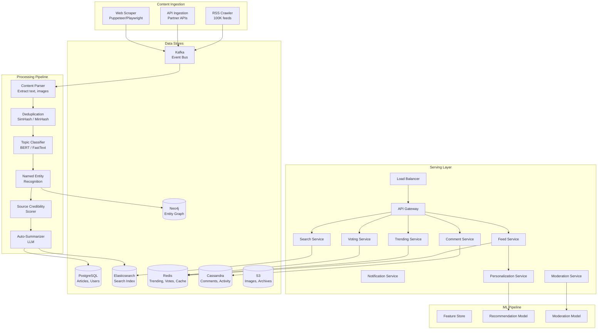
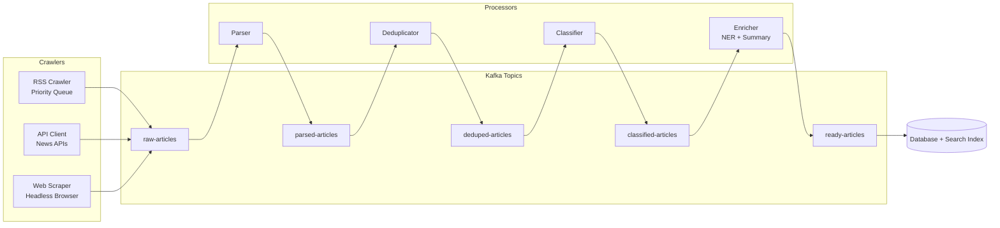
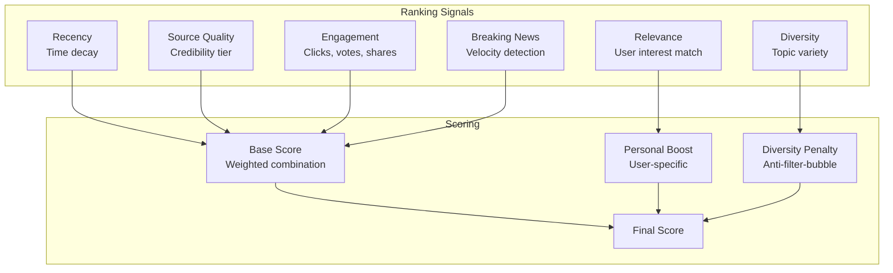
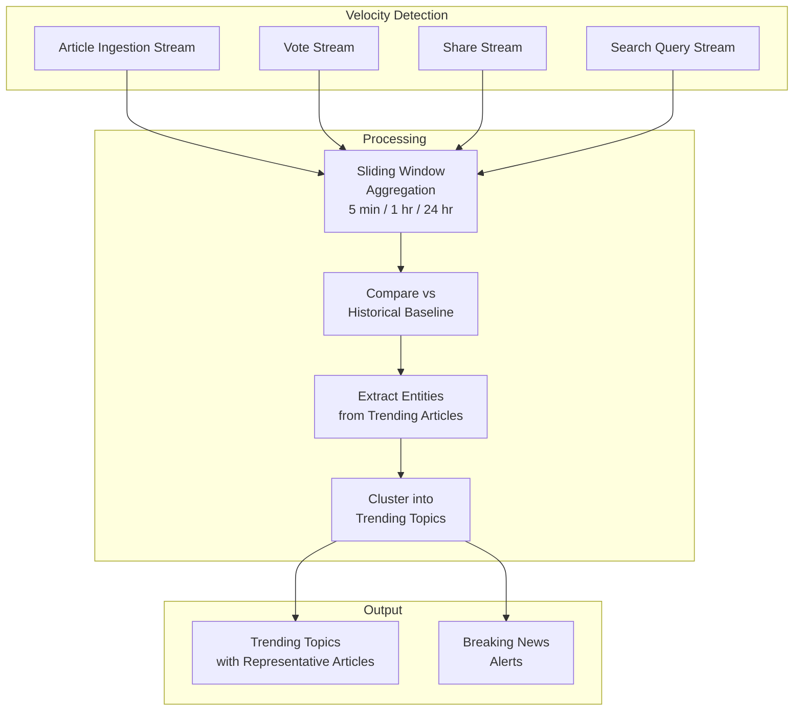

# Design Google News / Reddit — News Aggregator

## 1. Problem Statement & Requirements

### Functional Requirements

| # | Requirement | Details |
|---|-------------|---------|
| FR-1 | Content Ingestion | Ingest articles from RSS feeds, APIs, web scraping |
| FR-2 | Deduplication | Detect and group duplicate/near-duplicate articles |
| FR-3 | Categorization | Auto-categorize into topics (politics, tech, sports, etc.) |
| FR-4 | Ranking | Rank articles by relevance, recency, credibility, engagement |
| FR-5 | Personalization | Personalized feed based on user interests and behavior |
| FR-6 | Trending Detection | Detect breaking news and trending topics in real-time |
| FR-7 | Comments & Voting | Users comment on and upvote/downvote articles |
| FR-8 | Content Moderation | Detect and remove misinformation, spam, hate speech |
| FR-9 | Search | Full-text search across all articles |
| FR-10 | Notifications | Push notifications for breaking news and followed topics |

### Non-Functional Requirements

| # | Requirement | Target |
|---|-------------|--------|
| NFR-1 | Freshness | Breaking news visible within 5 minutes of publication |
| NFR-2 | Latency | Feed load < 300ms |
| NFR-3 | Throughput | 100K+ articles ingested/day, 500M feed requests/day |
| NFR-4 | Availability | 99.99% uptime |
| NFR-5 | Scale | 300M DAU, 100K+ news sources |
| NFR-6 | Quality | Misinformation detection rate > 95% |

---

## 2. Back-of-Envelope Estimation

### Content Scale

$$
\text{News Sources} = 100{,}000 \quad \text{Articles/Day} = 500{,}000
$$

$$
\text{Avg Article Size} = 10 \text{ KB (text)} + 500 \text{ KB (images)} = 510 \text{ KB}
$$

$$
\text{Daily Content Storage} = 500K \times 510 \text{ KB} = 255 \text{ GB/day}
$$

$$
\text{Annual Storage} = 255 \times 365 = 93 \text{ TB/year}
$$

### User Scale

$$
\text{DAU} = 300M \quad \text{Feed Requests/Day} = 300M \times 5 = 1.5B
$$

$$
\text{Feed QPS} = \frac{1.5B}{86{,}400} \approx 17{,}360 \text{ req/s}
$$

$$
\text{Peak Feed QPS} \approx 17{,}360 \times 3 = 52{,}000 \text{ req/s}
$$

### Comment & Vote Volume

$$
\text{Comments/Day} = 50M \quad \text{Votes/Day} = 500M
$$

$$
\text{Vote QPS} = \frac{500M}{86{,}400} \approx 5{,}787 \text{ req/s}
$$

### Ingestion Pipeline

$$
\text{RSS Feeds to Crawl} = 100{,}000
$$

$$
\text{Crawl Frequency} = \text{every 15 min (high priority)} / \text{every 1 hour (low priority)}
$$

$$
\text{Crawl QPS} = \frac{100{,}000 \times 4}{3{,}600} \approx 111 \text{ req/s (avg)}
$$

---

## 3. High-Level Design

### Architecture Diagram



### API Design

```typescript
// Feed APIs
GET /api/v1/feed?category={topic}&page={n}&limit=20
    // Returns: personalized ranked articles
GET /api/v1/feed/for-you
    // Returns: AI-personalized feed

// Article APIs
GET /api/v1/articles/{articleId}
GET /api/v1/articles/{articleId}/related

// Search APIs
GET /api/v1/search?q={query}&from={date}&to={date}&source={source}&sort={relevance|date}

// Trending APIs
GET /api/v1/trending?region={country}&category={topic}
GET /api/v1/trending/topics

// Comment APIs
GET  /api/v1/articles/{articleId}/comments?sort={best|new|controversial}
POST /api/v1/articles/{articleId}/comments
     // Body: { text, parentCommentId? }

// Voting APIs
POST /api/v1/articles/{articleId}/vote
     // Body: { direction: "up"|"down" }
POST /api/v1/comments/{commentId}/vote
     // Body: { direction: "up"|"down" }

// User Preferences
GET  /api/v1/users/{userId}/interests
PUT  /api/v1/users/{userId}/interests
     // Body: { topics: ["technology", "science"], sources: ["reuters", "bbc"] }
POST /api/v1/users/{userId}/feedback
     // Body: { articleId, action: "not_interested"|"hide_source" }
```

---

## 4. Database Schema

### Articles Table (PostgreSQL)

```sql
CREATE TABLE articles (
    article_id      UUID PRIMARY KEY DEFAULT gen_random_uuid(),
    source_id       UUID NOT NULL REFERENCES sources(source_id),
    url             TEXT UNIQUE NOT NULL,
    title           VARCHAR(500) NOT NULL,
    summary         TEXT,
    ai_summary      TEXT,
    content_text    TEXT,
    author          VARCHAR(200),
    published_at    TIMESTAMPTZ NOT NULL,
    ingested_at     TIMESTAMPTZ DEFAULT NOW(),
    language        CHAR(5) DEFAULT 'en',
    category        VARCHAR(50),
    subcategory     VARCHAR(50),
    entities        JSONB, -- [{"name": "...", "type": "person|org|location", "salience": 0.9}]
    image_url       VARCHAR(500),
    word_count      INT,
    reading_time_min SMALLINT,
    credibility_score DECIMAL(3,2), -- 0.0 - 1.0
    simhash         BIGINT, -- For deduplication
    cluster_id      UUID,  -- Group of duplicate articles
    upvotes         INT DEFAULT 0,
    downvotes       INT DEFAULT 0,
    comment_count   INT DEFAULT 0,
    share_count     INT DEFAULT 0,
    trending_score  DECIMAL(10,4) DEFAULT 0,
    created_at      TIMESTAMPTZ DEFAULT NOW()
);

CREATE INDEX idx_articles_published ON articles(published_at DESC);
CREATE INDEX idx_articles_category ON articles(category, published_at DESC);
CREATE INDEX idx_articles_source ON articles(source_id, published_at DESC);
CREATE INDEX idx_articles_cluster ON articles(cluster_id);
CREATE INDEX idx_articles_simhash ON articles(simhash);
CREATE INDEX idx_articles_trending ON articles(trending_score DESC);
```

### Sources Table

```sql
CREATE TABLE sources (
    source_id       UUID PRIMARY KEY DEFAULT gen_random_uuid(),
    name            VARCHAR(200) NOT NULL,
    domain          VARCHAR(200) UNIQUE NOT NULL,
    feed_url        VARCHAR(500),
    feed_type       VARCHAR(20), -- rss, atom, api, scrape
    credibility_tier VARCHAR(10), -- tier1, tier2, tier3, unverified
    bias_rating     VARCHAR(20), -- left, center-left, center, center-right, right
    country         CHAR(2),
    language        CHAR(5),
    crawl_priority  SMALLINT DEFAULT 5, -- 1=highest, 10=lowest
    crawl_interval  INT DEFAULT 900,    -- seconds
    last_crawled_at TIMESTAMPTZ,
    articles_count  INT DEFAULT 0,
    avg_article_quality DECIMAL(3,2),
    active          BOOLEAN DEFAULT TRUE,
    created_at      TIMESTAMPTZ DEFAULT NOW()
);
```

### Comments Table (Cassandra)

```sql
CREATE TABLE comments (
    article_id  UUID,
    comment_id  TIMEUUID,
    parent_id   UUID,       -- NULL for top-level comments
    author_id   UUID,
    content     TEXT,
    upvotes     INT,
    downvotes   INT,
    depth       SMALLINT,
    status      TEXT,       -- 'visible', 'hidden', 'deleted'
    created_at  TIMESTAMP,
    PRIMARY KEY ((article_id), comment_id)
) WITH CLUSTERING ORDER BY (comment_id DESC);
```

### User Interests Table

```sql
CREATE TABLE user_interests (
    user_id         UUID PRIMARY KEY REFERENCES users(user_id),
    topics          TEXT[], -- ['technology', 'politics', 'sports']
    preferred_sources TEXT[],
    blocked_sources TEXT[],
    blocked_topics  TEXT[],
    language        CHAR(5) DEFAULT 'en',
    region          CHAR(2),
    updated_at      TIMESTAMPTZ DEFAULT NOW()
);
```

### User Activity (Cassandra)

```sql
CREATE TABLE user_activity (
    user_id     UUID,
    activity_at TIMESTAMP,
    activity_type TEXT, -- 'view', 'click', 'read', 'vote', 'share', 'comment'
    article_id  UUID,
    dwell_time_ms INT,
    PRIMARY KEY ((user_id), activity_at)
) WITH CLUSTERING ORDER BY (activity_at DESC)
  AND default_time_to_live = 7776000; -- 90-day TTL
```

---

## 5. Detailed Component Design

### 5.1 Content Ingestion Pipeline



```typescript
class RSSCrawlerService {
  private readonly PRIORITY_INTERVALS = {
    1: 300,    // Tier 1 (CNN, Reuters): every 5 min
    2: 600,    // Tier 2: every 10 min
    3: 900,    // Tier 3: every 15 min
    5: 1800,   // Tier 5: every 30 min
    10: 3600,  // Tier 10: every 1 hour
  };

  async startCrawling(): Promise<void> {
    // Priority queue based on next_crawl_time
    const sources = await this.getSources();

    for (const source of sources) {
      const interval = this.PRIORITY_INTERVALS[source.crawl_priority] ?? 1800;
      this.scheduleCrawl(source, interval);
    }
  }

  async crawlSource(source: Source): Promise<void> {
    try {
      const feedContent = await this.fetchFeed(source.feed_url);
      const items = this.parseFeed(feedContent, source.feed_type);

      for (const item of items) {
        // Check if already ingested (by URL)
        if (await this.isAlreadyIngested(item.url)) continue;

        await this.kafka.publish('raw-articles', {
          sourceId: source.source_id,
          url: item.url,
          title: item.title,
          summary: item.description,
          publishedAt: item.pubDate,
          author: item.author,
          imageUrl: item.enclosure?.url,
        });
      }

      await this.updateLastCrawled(source.source_id);
    } catch (error) {
      await this.logCrawlError(source.source_id, error);
      // Back off on repeated failures
      await this.increaseBackoff(source.source_id);
    }
  }

  private async fetchFeed(url: string): Promise<string> {
    const response = await fetch(url, {
      headers: {
        'User-Agent': 'NewsAggregatorBot/1.0',
        'If-Modified-Since': await this.getLastModified(url) ?? '',
      },
      signal: AbortSignal.timeout(10000), // 10s timeout
    });

    if (response.status === 304) return ''; // Not modified
    if (!response.ok) throw new CrawlError(`HTTP ${response.status}`);

    return response.text();
  }
}
```

### 5.2 Deduplication

Near-duplicate detection is critical — the same news story is often published by dozens of sources.

**SimHash algorithm for near-duplicate detection:**

$$
\text{SimHash}(d) = \text{sign}\left(\sum_{w \in d} \text{weight}(w) \cdot h(w)\right)
$$

Where $h(w)$ maps each word to a random vector of $\{-1, +1\}^{64}$.

$$
\text{Hamming Distance}(h_1, h_2) = \text{popcount}(h_1 \oplus h_2)
$$

$$
\text{Duplicate if } \text{HammingDist}(h_1, h_2) \leq 3 \text{ (out of 64 bits)}
$$

```typescript
class DeduplicationService {
  private readonly SIMHASH_THRESHOLD = 3; // Max Hamming distance

  async deduplicate(article: ParsedArticle): Promise<DedupResult> {
    // Step 1: Compute SimHash of article text
    const simhash = this.computeSimHash(article.content_text);

    // Step 2: Find similar articles using band-based LSH
    const candidates = await this.findSimilar(simhash);

    if (candidates.length === 0) {
      // No duplicate found - create new cluster
      const clusterId = crypto.randomUUID();
      return { isDuplicate: false, clusterId, simhash };
    }

    // Step 3: Verify with more precise text similarity
    for (const candidate of candidates) {
      const similarity = this.computeJaccardSimilarity(
        this.shingle(article.content_text, 3),
        this.shingle(candidate.content_text, 3)
      );

      if (similarity > 0.7) {
        // Add to existing cluster
        return {
          isDuplicate: true,
          clusterId: candidate.cluster_id,
          simhash,
          similarArticleId: candidate.article_id,
          similarity,
        };
      }
    }

    // Candidates were false positives
    const clusterId = crypto.randomUUID();
    return { isDuplicate: false, clusterId, simhash };
  }

  private computeSimHash(text: string): bigint {
    const words = this.tokenize(text);
    const vector = new Int32Array(64).fill(0);

    for (const word of words) {
      const weight = this.tfidfWeight(word);
      const hash = this.hashWord(word);

      for (let i = 0; i < 64; i++) {
        if ((hash >> BigInt(i)) & 1n) {
          vector[i] += weight;
        } else {
          vector[i] -= weight;
        }
      }
    }

    let simhash = 0n;
    for (let i = 0; i < 64; i++) {
      if (vector[i] > 0) {
        simhash |= (1n << BigInt(i));
      }
    }

    return simhash;
  }

  // Band-based LSH for efficient nearest neighbor search in SimHash space
  private async findSimilar(simhash: bigint): Promise<ArticleCandidate[]> {
    // Split 64-bit hash into 4 bands of 16 bits each
    // If any band matches, articles are candidate duplicates
    const bands = [
      simhash & 0xFFFFn,
      (simhash >> 16n) & 0xFFFFn,
      (simhash >> 32n) & 0xFFFFn,
      (simhash >> 48n) & 0xFFFFn,
    ];

    const candidates = new Set<string>();
    for (let i = 0; i < bands.length; i++) {
      const key = `simhash_band:${i}:${bands[i]}`;
      const members = await this.redis.smembers(key);
      members.forEach(m => candidates.add(m));
    }

    return this.loadArticles(Array.from(candidates));
  }

  private shingle(text: string, k: number): Set<string> {
    const words = text.toLowerCase().split(/\s+/);
    const shingles = new Set<string>();
    for (let i = 0; i <= words.length - k; i++) {
      shingles.add(words.slice(i, i + k).join(' '));
    }
    return shingles;
  }

  private computeJaccardSimilarity(a: Set<string>, b: Set<string>): number {
    const intersection = new Set([...a].filter(x => b.has(x)));
    const union = new Set([...a, ...b]);
    return intersection.size / union.size;
  }
}
```

### 5.3 Ranking Algorithm



**Reddit-inspired hot ranking (with credibility):**

$$
\text{HotScore} = \log_{10}(\max(|S|, 1)) + \frac{T - T_0}{45000} + C \times Q
$$

Where:
- $S$ = net upvotes (upvotes - downvotes)
- $T$ = article timestamp (Unix seconds)
- $T_0$ = reference timestamp (epoch)
- $C$ = credibility factor (0.5 for unverified, 1.0 for tier 1)
- $Q$ = source quality score

```typescript
class RankingService {
  async rankFeed(userId: string, category: string | null): Promise<RankedArticle[]> {
    // Fetch candidate articles (last 24-48 hours)
    const candidates = await this.getCandidates(category, 48);

    // Score each article
    const scored = await Promise.all(
      candidates.map(async (article) => {
        const baseScore = this.computeBaseScore(article);
        const personalScore = await this.computePersonalScore(userId, article);
        const finalScore = baseScore * 0.6 + personalScore * 0.4;
        return { article, score: finalScore };
      })
    );

    // Sort by score
    scored.sort((a, b) => b.score - a.score);

    // Apply diversity: avoid too many articles from same source or topic
    return this.applyDiversity(scored);
  }

  private computeBaseScore(article: Article): number {
    const now = Date.now() / 1000;
    const articleAge = now - new Date(article.published_at).getTime() / 1000;

    // Time decay: half-life of 6 hours
    const timeDecay = Math.exp(-articleAge / (6 * 3600));

    // Engagement signal
    const netVotes = article.upvotes - article.downvotes;
    const engagementScore = Math.log10(Math.max(Math.abs(netVotes), 1))
      * (netVotes >= 0 ? 1 : -1);

    // Source credibility
    const credibilityMultiplier = {
      tier1: 1.0,
      tier2: 0.85,
      tier3: 0.7,
      unverified: 0.5,
    }[article.source_credibility_tier] ?? 0.5;

    // Breaking news velocity boost
    const velocityBoost = article.trending_score > 50 ? 1.5 : 1.0;

    return (
      engagementScore * 0.3 +
      timeDecay * 10 * 0.3 +
      credibilityMultiplier * 5 * 0.2 +
      velocityBoost * 0.2
    );
  }

  private async computePersonalScore(userId: string, article: Article): Promise<number> {
    const interests = await this.getUserInterests(userId);
    const history = await this.getRecentActivity(userId);

    let score = 0;

    // Topic match
    if (interests.topics.includes(article.category)) score += 3;
    if (interests.topics.includes(article.subcategory)) score += 2;

    // Source preference
    if (interests.preferred_sources.includes(article.source_id)) score += 2;
    if (interests.blocked_sources.includes(article.source_id)) return -100; // Filter out

    // Entity-based interest (user reads about "AI" frequently)
    const userEntityInterests = await this.getUserEntityInterests(userId);
    for (const entity of article.entities ?? []) {
      if (userEntityInterests.has(entity.name)) {
        score += entity.salience * 3;
      }
    }

    // Avoid showing things user already read
    if (history.readArticles.has(article.article_id)) return -100;

    // Avoid showing too many articles from same cluster
    if (history.seenClusters.has(article.cluster_id)) score -= 5;

    return score;
  }

  private applyDiversity(scored: ScoredArticle[]): RankedArticle[] {
    const result: RankedArticle[] = [];
    const sourceCounts = new Map<string, number>();
    const topicCounts = new Map<string, number>();
    const clustersSeen = new Set<string>();

    for (const item of scored) {
      const sourceCount = sourceCounts.get(item.article.source_id) ?? 0;
      const topicCount = topicCounts.get(item.article.category) ?? 0;

      // Skip if same cluster already shown (dedup)
      if (item.article.cluster_id && clustersSeen.has(item.article.cluster_id)) {
        continue;
      }

      // Penalize over-representation
      if (sourceCount >= 3) continue; // Max 3 articles per source
      if (topicCount >= 5) {
        item.score *= 0.5; // Penalize but do not exclude
      }

      result.push({ ...item.article, score: item.score, rank: result.length + 1 });

      sourceCounts.set(item.article.source_id, sourceCount + 1);
      topicCounts.set(item.article.category, topicCount + 1);
      if (item.article.cluster_id) clustersSeen.add(item.article.cluster_id);

      if (result.length >= 50) break;
    }

    return result;
  }
}
```

### 5.4 Trending Detection



```typescript
class TrendingService {
  // Detect trending topics using velocity-based scoring
  async detectTrending(region: string): Promise<TrendingTopic[]> {
    // Get article counts per entity in sliding windows
    const window5min = await this.getEntityCounts(region, 5);
    const window1hr = await this.getEntityCounts(region, 60);
    const window24hr = await this.getEntityCounts(region, 1440);
    const baseline = await this.getHistoricalBaseline(region);

    const trendingEntities: TrendingEntity[] = [];

    for (const [entity, count5m] of window5min.entries()) {
      const count1h = window1hr.get(entity) ?? 0;
      const count24h = window24hr.get(entity) ?? 0;
      const baselineCount = baseline.get(entity) ?? 1;

      // Velocity: how much faster than usual
      const velocity5m = count5m / (baselineCount / 288); // 288 five-min windows in 24h
      const velocity1h = count1h / (baselineCount / 24);

      // Acceleration: is it speeding up?
      const acceleration = velocity5m / Math.max(velocity1h, 0.1);

      // Combined trending score
      const trendingScore =
        velocity5m * 0.4 +
        acceleration * 0.3 +
        count5m * 0.2 +
        Math.log10(count24h + 1) * 0.1;

      if (trendingScore > 5.0) { // Threshold for trending
        trendingEntities.push({
          entity,
          score: trendingScore,
          velocity: velocity5m,
          acceleration,
          articleCount: count5m,
        });
      }
    }

    // Cluster related entities into topics
    const topics = this.clusterIntoTopics(trendingEntities);

    // Get representative articles for each topic
    const enriched = await Promise.all(
      topics.map(async (topic) => ({
        ...topic,
        articles: await this.getTopArticlesForTopic(topic, 5),
      }))
    );

    // Cache trending topics
    await this.redis.set(
      `trending:${region}`,
      JSON.stringify(enriched),
      'EX', 300 // Refresh every 5 minutes
    );

    return enriched;
  }

  // Breaking news detection: unusually fast velocity spike
  async detectBreakingNews(): Promise<BreakingAlert[]> {
    const alerts: BreakingAlert[] = [];
    const window5min = await this.getEntityCounts('global', 5);
    const baseline = await this.getHistoricalBaseline('global');

    for (const [entity, count] of window5min.entries()) {
      const baselineRate = (baseline.get(entity) ?? 1) / 288;
      const velocity = count / baselineRate;

      // Breaking = 10x normal rate AND from credible sources
      if (velocity > 10 && count >= 5) {
        const sources = await this.getSourcesForEntity(entity, 5);
        const hasCredibleSource = sources.some(s => s.credibility_tier === 'tier1');

        if (hasCredibleSource) {
          alerts.push({
            entity,
            velocity,
            articleCount: count,
            topArticle: sources[0].article,
            detectedAt: new Date(),
          });
        }
      }
    }

    // Send push notifications for breaking news
    for (const alert of alerts) {
      await this.notificationService.sendBreakingNews(alert);
    }

    return alerts;
  }
}
```

### 5.5 Comments & Voting System

```typescript
class VotingService {
  async vote(
    userId: string,
    targetType: 'article' | 'comment',
    targetId: string,
    direction: 'up' | 'down'
  ): Promise<VoteResult> {
    const voteKey = `vote:${targetType}:${targetId}:${userId}`;
    const counterKey = `${targetType}:votes:${targetId}`;

    // Check existing vote
    const existingVote = await this.redis.get(voteKey);

    if (existingVote === direction) {
      // Removing vote (toggle off)
      await this.redis.del(voteKey);
      await this.redis.hincrby(counterKey, direction === 'up' ? 'upvotes' : 'downvotes', -1);
      return { action: 'removed', direction };
    }

    if (existingVote) {
      // Changing vote direction
      const oldDirection = existingVote;
      await this.redis.hincrby(counterKey, oldDirection === 'up' ? 'upvotes' : 'downvotes', -1);
    }

    // Record new vote
    await this.redis.set(voteKey, direction, 'EX', 86400 * 365); // 1 year
    await this.redis.hincrby(counterKey, direction === 'up' ? 'upvotes' : 'downvotes', 1);

    // Async: persist to database for durability
    await this.kafka.publish('vote.cast', {
      userId, targetType, targetId, direction,
      timestamp: new Date(),
    });

    // Recalculate trending score if article
    if (targetType === 'article') {
      await this.recalculateTrendingScore(targetId);
    }

    return { action: existingVote ? 'changed' : 'created', direction };
  }
}

class CommentService {
  async addComment(
    userId: string,
    articleId: string,
    text: string,
    parentId?: string
  ): Promise<Comment> {
    // Moderate content
    const modResult = await this.moderationService.checkComment(text);
    if (modResult.blocked) {
      throw new ContentPolicyViolation(modResult.reason);
    }

    // Rate limit: max 10 comments per article per user per hour
    const recentCount = await this.getRecentCommentCount(userId, articleId);
    if (recentCount >= 10) {
      throw new RateLimitError('Too many comments');
    }

    // Determine depth
    let depth = 0;
    if (parentId) {
      const parent = await this.getComment(articleId, parentId);
      depth = parent.depth + 1;
      if (depth > 10) throw new MaxDepthError('Reply thread too deep');
    }

    const commentId = TimeUuid.now();
    await this.cassandra.execute(`
      INSERT INTO comments (
        article_id, comment_id, parent_id, author_id,
        content, upvotes, downvotes, depth, status, created_at
      )
      VALUES (?, ?, ?, ?, ?, 0, 0, ?, 'visible', toTimestamp(now()))
    `, [articleId, commentId, parentId, userId, text, depth]);

    // Update comment count
    await this.redis.hincrby(`article:counters:${articleId}`, 'comments', 1);

    return { commentId, articleId, text, depth, upvotes: 0, downvotes: 0 };
  }

  // Reddit-style comment ranking
  async getCommentTree(
    articleId: string,
    sort: 'best' | 'new' | 'controversial'
  ): Promise<CommentTree[]> {
    const allComments = await this.cassandra.execute(
      'SELECT * FROM comments WHERE article_id = ? AND status = ?',
      [articleId, 'visible']
    );

    // Build tree structure
    const tree = this.buildTree(allComments.rows);

    // Sort based on algorithm
    return this.sortTree(tree, sort);
  }

  private sortTree(tree: CommentTree[], sort: string): CommentTree[] {
    const sortFn = {
      best: (a: CommentTree, b: CommentTree) =>
        this.wilsonScore(b) - this.wilsonScore(a),
      new: (a: CommentTree, b: CommentTree) =>
        b.created_at.getTime() - a.created_at.getTime(),
      controversial: (a: CommentTree, b: CommentTree) =>
        this.controversyScore(b) - this.controversyScore(a),
    }[sort] ?? (() => 0);

    tree.sort(sortFn);
    for (const node of tree) {
      if (node.children?.length) {
        this.sortTree(node.children, sort);
      }
    }
    return tree;
  }

  // Wilson score interval (Reddit's "best" algorithm)
  private wilsonScore(comment: CommentTree): number {
    const n = comment.upvotes + comment.downvotes;
    if (n === 0) return 0;

    const p = comment.upvotes / n;
    const z = 1.96; // 95% confidence

    return (
      (p + z * z / (2 * n) - z * Math.sqrt((p * (1 - p) + z * z / (4 * n)) / n)) /
      (1 + z * z / n)
    );
  }
}
```

### 5.6 Content Moderation

```typescript
class ModerationService {
  async moderateArticle(article: ParsedArticle): Promise<ModerationResult> {
    const checks = await Promise.all([
      this.checkMisinformation(article),
      this.checkHateSpeech(article.content_text),
      this.checkSpam(article),
      this.checkSourceReliability(article.source_id),
    ]);

    const worstResult = checks.reduce((worst, current) =>
      current.severity > worst.severity ? current : worst
    );

    if (worstResult.severity >= ModerationSeverity.HIGH) {
      return { action: 'block', reason: worstResult.reason };
    }
    if (worstResult.severity >= ModerationSeverity.MEDIUM) {
      return { action: 'flag_for_review', reason: worstResult.reason };
    }
    return { action: 'approve' };
  }

  private async checkMisinformation(article: ParsedArticle): Promise<CheckResult> {
    // Cross-reference claims with fact-checking databases
    const claims = await this.extractClaims(article.content_text);

    for (const claim of claims) {
      const factCheck = await this.factCheckDB.search(claim);
      if (factCheck && factCheck.rating === 'false') {
        return {
          severity: ModerationSeverity.HIGH,
          reason: `Contains debunked claim: "${claim.substring(0, 100)}..."`,
          factCheckUrl: factCheck.url,
        };
      }
    }

    // ML model for misinformation detection
    const misInfoScore = await this.misInfoModel.predict({
      text: article.content_text,
      title: article.title,
      source: article.source_id,
      claimCount: claims.length,
    });

    if (misInfoScore > 0.8) {
      return {
        severity: ModerationSeverity.MEDIUM,
        reason: 'ML model flagged as potential misinformation',
      };
    }

    return { severity: ModerationSeverity.NONE };
  }
}
```

---

## 6. Scaling & Bottlenecks

### What Breaks First

| Component | Bottleneck | Solution |
|-----------|-----------|----------|
| Feed Generation | 52K QPS personalized feeds | Pre-compute for active users, cache in Redis |
| Crawling | 100K sources, rate limits | Distributed crawler pool, polite crawling |
| Deduplication | Comparing against millions of articles | SimHash LSH bands in Redis for O(1) lookup |
| Voting | 5.8K vote QPS | Redis for counters, async persist to DB |
| Trending | Real-time aggregation | Streaming aggregation (Flink/Spark Streaming) |
| Search | Full-text over 100M+ articles | Elasticsearch cluster, index by date |

### Feed Caching Strategy

```typescript
class FeedCacheService {
  // Two-level caching: precomputed + real-time blend
  async getFeed(userId: string, category: string | null): Promise<RankedArticle[]> {
    // Level 1: Check if precomputed feed exists
    const cached = await this.redis.get(`feed:${userId}:${category ?? 'all'}`);
    if (cached && JSON.parse(cached).generatedAt > Date.now() - 300000) {
      return JSON.parse(cached).articles;
    }

    // Level 2: Blend precomputed base feed with real-time trending
    const baseFeed = await this.getOrComputeBaseFeed(userId, category);
    const trending = await this.trendingService.getLatest();
    const breaking = await this.trendingService.getBreaking();

    // Inject breaking news at the top
    const blended = [...breaking, ...this.interleave(baseFeed, trending)];

    // Cache for 5 minutes
    await this.redis.set(
      `feed:${userId}:${category ?? 'all'}`,
      JSON.stringify({ articles: blended, generatedAt: Date.now() }),
      'EX', 300
    );

    return blended;
  }
}
```

---

## 7. Trade-offs & Alternatives

### Deduplication Approaches

| Approach | Pro | Con |
|----------|-----|-----|
| SimHash | Fast, scalable | Misses paraphrased content |
| MinHash + LSH | Better for set similarity | Higher memory |
| TF-IDF Cosine | Accurate | O(n^2) comparison |
| Sentence Embeddings (BERT) | Best accuracy | Expensive to compute |

### Ranking Algorithms

| Algorithm | Pro | Con |
|-----------|-----|-----|
| Chronological | Simple, no bias | Low engagement |
| Reddit Hot | Good balance of recency + votes | Popularity bias |
| ML Ranker (Gradient Boosted) | Best personalization | Black box, filter bubbles |
| Hybrid (current) | Balances quality and personalization | Complex to tune |

### Feed Architecture

| Approach | Pro | Con |
|----------|-----|-----|
| Fan-out on Write | Fast reads, precomputed | Expensive for popular sources |
| Fan-out on Read | Lower write cost | Slower reads |
| Hybrid (current) | Best of both | Complex |

---

## 8. Advanced Topics

### 8.1 Filter Bubble Prevention

To avoid creating echo chambers, the system intentionally injects diverse perspectives:

```typescript
class DiversityInjector {
  inject(feed: RankedArticle[], userBias: string): RankedArticle[] {
    // Every 10th article should be from a different perspective
    const diverseArticles = feed.filter(a =>
      a.source_bias !== userBias && a.credibility_tier <= 'tier2'
    );

    const result = [...feed];
    for (let i = 9; i < result.length; i += 10) {
      const diverse = diverseArticles.shift();
      if (diverse) result.splice(i, 0, diverse);
    }

    return result;
  }
}
```

### 8.2 Real-Time Event Processing

Use Apache Flink or Spark Streaming for real-time trending detection across millions of events per second.

### 8.3 Fact-Checking Integration

Integrate with third-party fact-checking organizations (PolitiFact, Snopes) and display fact-check labels on disputed articles.

---

## 9. Interview Tips

::: tip Key Points to Emphasize
1. **Content pipeline is the backbone** — Ingestion, parsing, dedup, classification, enrichment.
2. **Deduplication is non-trivial** — SimHash/MinHash for near-duplicate detection at scale.
3. **Ranking balances many signals** — Recency, credibility, engagement, personalization, diversity.
4. **Trending detection requires velocity** — It is about rate of change, not absolute counts.
5. **Content moderation is a must** — Both automated (ML) and human-in-the-loop.
:::

::: warning Common Mistakes
- Treating it as a simple RSS reader without deduplication.
- Not discussing source credibility — all sources are not equal.
- Ignoring the filter bubble problem in personalization.
- Not separating ingestion pipeline from serving layer.
- Forgetting about comment moderation and voting manipulation.
:::

::: info Follow-Up Questions to Expect
- How would you handle a viral misinformation campaign? (Velocity detection, cross-reference with fact-checkers, reduce distribution.)
- How would you implement "For You" personalization without user accounts? (Device fingerprint, browsing history, collaborative filtering on anonymous sessions.)
- How do you prevent vote manipulation (bot farms)?
- How would you design the notification system for breaking news?
:::

### Time Allocation in 45-min Interview

| Phase | Time | Focus |
|-------|------|-------|
| Requirements | 5 min | Clarify: Google News vs. Reddit, personalization depth |
| High-Level Design | 8 min | Ingestion pipeline + serving layer |
| Deep Dive: Ingestion | 8 min | Crawling, parsing, deduplication |
| Deep Dive: Ranking | 10 min | Scoring, personalization, diversity |
| Deep Dive: Trending | 7 min | Velocity detection, breaking news |
| Scaling | 5 min | Caching, feed precomputation |
| Q&A | 2 min | Moderation, filter bubbles |
