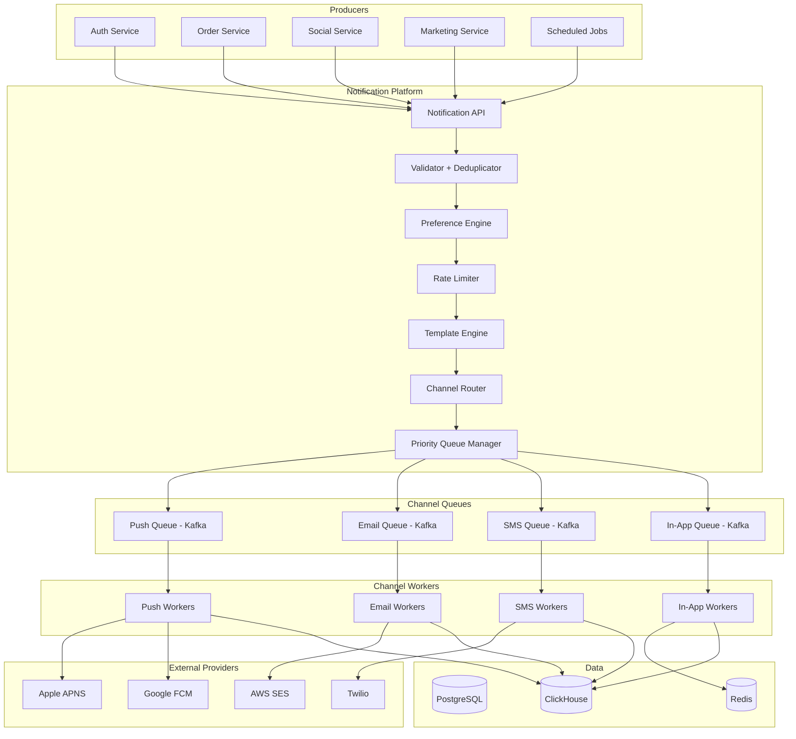
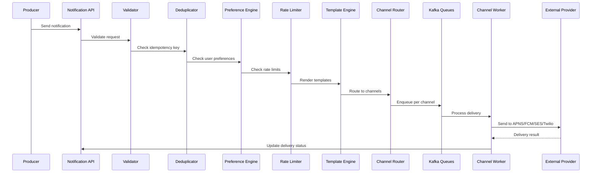
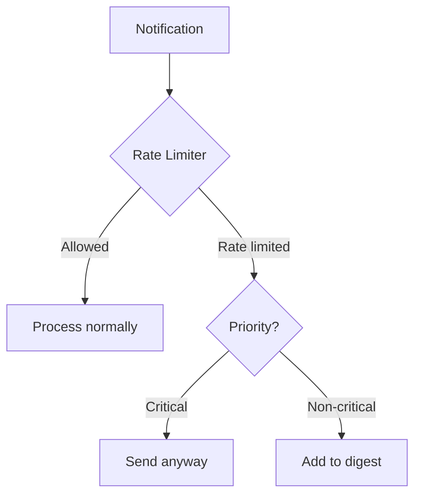
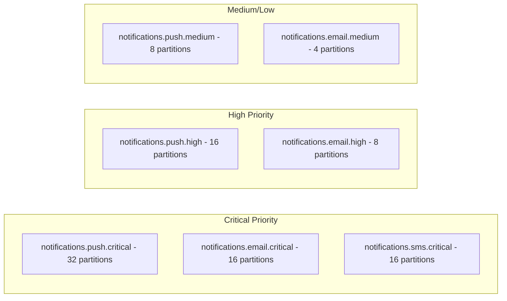

# Design a Notification System

A notification system delivers messages to users across multiple channels: push notifications (iOS/Android), SMS, email, and in-app. This design covers the multi-channel architecture, template engine, priority queues, rate limiting, delivery tracking, user preferences, and reliability guarantees.

---

## 1. Problem Statement & Requirements

### Functional Requirements

1. **Multi-channel delivery** — Push (APNS/FCM), SMS (Twilio), email (SES), in-app
2. **Template engine** — Reusable notification templates with variable substitution
3. **User preferences** — Users control which channels and notification types they receive
4. **Priority levels** — Critical (OTP, security alerts), high, medium, low
5. **Rate limiting** — Prevent notification fatigue and abuse
6. **Delivery tracking** — Track sent, delivered, opened, clicked status
7. **Scheduling** — Send notifications at a specific time or timezone-aware time
8. **Batching/Digests** — Combine multiple notifications into a single digest
9. **A/B testing** — Test different notification content/timing

### Non-Functional Requirements

1. **High availability** — 99.99% for critical notifications (OTP, security)
2. **Low latency** — Critical notifications delivered within 1 second
3. **Scalability** — 10 billion notifications per day
4. **At-least-once delivery** — No notification should be silently dropped
5. **Idempotency** — Same notification should not be delivered twice
6. **Ordered delivery** — Notifications within a conversation should be ordered

### Clarifying Questions

::: tip Questions to Ask
- How many different notification types exist?
- What is the split between channels (push vs email vs SMS)?
- What is the SLA for critical vs non-critical notifications?
- Do we need to support rich push notifications (images, action buttons)?
- Should in-app notifications persist or be ephemeral?
- What are the compliance requirements (CAN-SPAM, GDPR)?
:::

---

## 2. Back-of-Envelope Estimation

### Traffic

- 500M DAU
- Average user receives 20 notifications/day
- 10B total notifications/day
- Channel breakdown: 60% push, 15% in-app, 15% email, 10% SMS

$$
\text{Total QPS} = \frac{10B}{86400} \approx 115{,}741 \text{ QPS}
$$

$$
\text{Peak QPS} \approx 115K \times 3 \approx 347K \text{ QPS}
$$

$$
\text{Push QPS} = 115K \times 0.6 = 69K \text{ QPS}
$$

$$
\text{Email QPS} = 115K \times 0.15 = 17K \text{ QPS}
$$

$$
\text{SMS QPS} = 115K \times 0.10 = 11.5K \text{ QPS}
$$

### Storage

**Notification records:**
- Each notification: ~500 bytes (metadata, content, tracking)
- Daily: 10B x 500B = 5 TB/day
- Retention: 90 days
- Total: 5 TB x 90 = 450 TB

**Template storage:**
- ~10,000 templates x 10KB average = 100 MB (negligible)

### Third-Party API Costs

| Channel | Provider | Cost per Message | Daily Volume | Daily Cost |
|---------|----------|-----------------|-------------|------------|
| Push | APNS/FCM | Free | 6B | $0 |
| Email | AWS SES | $0.10/1000 | 1.5B | $150K |
| SMS | Twilio | $0.0075/msg | 1B | $7.5M |
| In-app | Internal | Free | 1.5B | $0 |

SMS is by far the most expensive channel, which is why rate limiting and channel selection are critical.

---

## 3. High-Level Design



### API Design

```typescript
// Send a notification
// POST /api/v1/notifications/send
interface SendNotificationRequest {
  // Who to notify
  recipientId: string;           // User ID
  // OR
  recipientIds: string[];        // Bulk send
  // OR
  segmentId: string;             // Pre-defined user segment

  // What to send
  notificationType: string;      // e.g., 'order_shipped', 'new_follower', 'otp'
  templateId?: string;           // Template ID (overrides notificationType default)
  templateVariables?: Record<string, string | number>;
  // OR
  content?: {
    title: string;
    body: string;
    imageUrl?: string;
    actionUrl?: string;
    data?: Record<string, unknown>;  // Custom payload
  };

  // How to send
  channels?: ('push' | 'email' | 'sms' | 'in_app')[];  // Override default channels
  priority?: 'critical' | 'high' | 'medium' | 'low';

  // When to send
  sendAt?: string;               // ISO 8601 for scheduled
  timezone?: string;             // Send at local time (e.g., "America/New_York")
  ttl?: number;                  // Seconds until notification expires

  // Deduplication
  idempotencyKey?: string;
}

interface SendNotificationResponse {
  notificationId: string;
  status: 'queued' | 'scheduled' | 'rejected';
  rejectionReason?: string;
  estimatedDelivery?: string;
}

// Get notification status
// GET /api/v1/notifications/:id/status
interface NotificationStatus {
  notificationId: string;
  recipientId: string;
  channels: Array<{
    channel: string;
    status: 'queued' | 'sent' | 'delivered' | 'opened' | 'clicked' | 'failed' | 'bounced';
    sentAt?: string;
    deliveredAt?: string;
    openedAt?: string;
    failureReason?: string;
  }>;
}

// Update user preferences
// PUT /api/v1/users/:userId/notification-preferences
interface NotificationPreferences {
  channels: {
    push: boolean;
    email: boolean;
    sms: boolean;
    in_app: boolean;
  };
  quietHours?: {
    enabled: boolean;
    start: string;  // "22:00"
    end: string;    // "08:00"
    timezone: string;
  };
  categories: Record<string, {  // e.g., 'marketing', 'social', 'transactional'
    enabled: boolean;
    channels: string[];
  }>;
  frequency?: 'realtime' | 'hourly_digest' | 'daily_digest';
}

// Get in-app notifications
// GET /api/v1/users/:userId/notifications?cursor=xxx&limit=20
```

---

## 4. Database Schema

### Notification Records (PostgreSQL, sharded by recipient_id)

```sql
-- Notification types (template registry)
CREATE TABLE notification_types (
    id              VARCHAR(100) PRIMARY KEY,   -- 'order_shipped', 'new_follower'
    category        VARCHAR(50) NOT NULL,        -- 'transactional', 'social', 'marketing'
    default_channels VARCHAR(100)[],             -- {'push', 'email'}
    default_priority VARCHAR(20) DEFAULT 'medium',
    template_id     VARCHAR(100),
    rate_limit_key  VARCHAR(100),                -- Rate limit group
    is_mandatory    BOOLEAN DEFAULT FALSE,       -- Can't be disabled by user
    created_at      TIMESTAMP WITH TIME ZONE DEFAULT NOW()
);

-- Templates
CREATE TABLE templates (
    id              VARCHAR(100) PRIMARY KEY,
    version         INT NOT NULL,
    channel         VARCHAR(20) NOT NULL,        -- 'push', 'email', 'sms', 'in_app'
    locale          VARCHAR(10) DEFAULT 'en',
    title_template  TEXT,
    body_template   TEXT,
    html_template   TEXT,                        -- For email
    image_url       TEXT,
    action_url_template TEXT,
    variables       JSONB,                       -- Expected variables and defaults
    created_at      TIMESTAMP WITH TIME ZONE DEFAULT NOW(),
    UNIQUE (id, version, channel, locale)
);

-- Notification log (the main record)
CREATE TABLE notifications (
    id              UUID PRIMARY KEY DEFAULT gen_random_uuid(),
    recipient_id    BIGINT NOT NULL,
    notification_type VARCHAR(100) NOT NULL,
    template_id     VARCHAR(100),
    priority        VARCHAR(20) DEFAULT 'medium',
    content_title   TEXT,
    content_body    TEXT,
    content_data    JSONB,
    idempotency_key VARCHAR(255),
    status          VARCHAR(20) DEFAULT 'pending',  -- pending, processing, completed, failed
    scheduled_at    TIMESTAMP WITH TIME ZONE,
    created_at      TIMESTAMP WITH TIME ZONE DEFAULT NOW(),
    completed_at    TIMESTAMP WITH TIME ZONE
);

CREATE UNIQUE INDEX idx_notifications_idempotency
    ON notifications(idempotency_key) WHERE idempotency_key IS NOT NULL;
CREATE INDEX idx_notifications_recipient ON notifications(recipient_id, created_at DESC);
CREATE INDEX idx_notifications_scheduled ON notifications(scheduled_at)
    WHERE status = 'pending' AND scheduled_at IS NOT NULL;

-- Per-channel delivery tracking
CREATE TABLE notification_deliveries (
    notification_id UUID NOT NULL,
    channel         VARCHAR(20) NOT NULL,
    provider        VARCHAR(50),                -- 'apns', 'fcm', 'ses', 'twilio'
    provider_id     VARCHAR(255),               -- External message ID
    status          VARCHAR(20) DEFAULT 'queued',
    sent_at         TIMESTAMP WITH TIME ZONE,
    delivered_at    TIMESTAMP WITH TIME ZONE,
    opened_at       TIMESTAMP WITH TIME ZONE,
    clicked_at      TIMESTAMP WITH TIME ZONE,
    failed_at       TIMESTAMP WITH TIME ZONE,
    failure_reason  TEXT,
    retry_count     INT DEFAULT 0,
    PRIMARY KEY (notification_id, channel)
);

-- User notification preferences
CREATE TABLE user_notification_preferences (
    user_id         BIGINT NOT NULL,
    notification_type VARCHAR(100) NOT NULL,     -- Or '*' for all
    channel         VARCHAR(20) NOT NULL,        -- Or '*' for all
    enabled         BOOLEAN DEFAULT TRUE,
    PRIMARY KEY (user_id, notification_type, channel)
);

-- User devices (for push notifications)
CREATE TABLE user_devices (
    user_id         BIGINT NOT NULL,
    device_id       VARCHAR(255) NOT NULL,
    platform        VARCHAR(20) NOT NULL,        -- 'ios', 'android', 'web'
    push_token      TEXT NOT NULL,
    app_version     VARCHAR(20),
    is_active       BOOLEAN DEFAULT TRUE,
    last_active     TIMESTAMP WITH TIME ZONE,
    created_at      TIMESTAMP WITH TIME ZONE DEFAULT NOW(),
    PRIMARY KEY (user_id, device_id)
);

CREATE INDEX idx_devices_token ON user_devices(push_token);

-- In-app notification inbox
CREATE TABLE in_app_notifications (
    id              UUID PRIMARY KEY DEFAULT gen_random_uuid(),
    user_id         BIGINT NOT NULL,
    notification_id UUID,
    title           TEXT NOT NULL,
    body            TEXT NOT NULL,
    image_url       TEXT,
    action_url      TEXT,
    is_read         BOOLEAN DEFAULT FALSE,
    created_at      TIMESTAMP WITH TIME ZONE DEFAULT NOW()
);

CREATE INDEX idx_inapp_user ON in_app_notifications(user_id, created_at DESC);
CREATE INDEX idx_inapp_unread ON in_app_notifications(user_id, is_read)
    WHERE is_read = FALSE;
```

---

## 5. Detailed Component Design

### 5.1 Notification Processing Pipeline



```typescript
class NotificationService {
  async send(request: SendNotificationRequest): Promise<SendNotificationResponse> {
    const notificationId = generateUUID();

    // 1. Validate request
    this.validate(request);

    // 2. Idempotency check
    if (request.idempotencyKey) {
      const existing = await this.db.query(
        'SELECT id, status FROM notifications WHERE idempotency_key = $1',
        [request.idempotencyKey]
      );
      if (existing) {
        return { notificationId: existing.id, status: existing.status };
      }
    }

    // 3. Handle scheduling
    if (request.sendAt) {
      return this.scheduleNotification(notificationId, request);
    }

    // 4. Process immediately
    return this.processNotification(notificationId, request);
  }

  private async processNotification(
    notificationId: string,
    request: SendNotificationRequest
  ): Promise<SendNotificationResponse> {
    const recipientIds = this.resolveRecipients(request);

    for (const recipientId of recipientIds) {
      // 4a. Check user preferences
      const preferences = await this.preferenceEngine.getPreferences(recipientId);
      const enabledChannels = this.filterByPreferences(
        request.channels || this.getDefaultChannels(request.notificationType),
        preferences,
        request.notificationType
      );

      if (enabledChannels.length === 0 && !this.isMandatory(request.notificationType)) {
        continue; // User has disabled all channels for this type
      }

      // 4b. Check quiet hours
      if (this.isQuietHours(preferences, request.priority)) {
        if (request.priority !== 'critical') {
          await this.scheduleAfterQuietHours(notificationId, recipientId, request);
          continue;
        }
      }

      // 4c. Rate limiting
      const rateLimitResult = await this.rateLimiter.check(recipientId, request.notificationType);
      if (!rateLimitResult.allowed && request.priority !== 'critical') {
        await this.addToDigest(recipientId, request);
        continue;
      }

      // 4d. Render templates
      const renderedContent = await this.templateEngine.render(
        request.templateId || request.notificationType,
        request.templateVariables || {},
        enabledChannels
      );

      // 4e. Create notification record
      await this.db.query(
        `INSERT INTO notifications (id, recipient_id, notification_type, priority, content_title,
         content_body, content_data, idempotency_key, status)
         VALUES ($1, $2, $3, $4, $5, $6, $7, $8, 'processing')`,
        [notificationId, recipientId, request.notificationType, request.priority,
         renderedContent.title, renderedContent.body, request.content?.data,
         request.idempotencyKey]
      );

      // 4f. Route to channel queues
      for (const channel of enabledChannels) {
        const topic = `notifications.${channel}.${request.priority}`;
        await this.kafka.send(topic, {
          key: recipientId,
          value: {
            notificationId,
            recipientId,
            channel,
            content: renderedContent[channel],
            priority: request.priority,
            ttl: request.ttl,
          },
        });
      }
    }

    return { notificationId, status: 'queued' };
  }
}
```

### 5.2 Template Engine

```typescript
class TemplateEngine {
  private templateCache: Map<string, CompiledTemplate> = new Map();

  async render(
    templateId: string,
    variables: Record<string, string | number>,
    channels: string[]
  ): Promise<Record<string, RenderedContent>> {
    const result: Record<string, RenderedContent> = {};

    for (const channel of channels) {
      const template = await this.getTemplate(templateId, channel);
      if (!template) continue;

      result[channel] = {
        title: this.interpolate(template.titleTemplate, variables),
        body: this.interpolate(template.bodyTemplate, variables),
        html: template.htmlTemplate
          ? this.interpolate(template.htmlTemplate, variables)
          : undefined,
        imageUrl: template.imageUrl,
        actionUrl: template.actionUrlTemplate
          ? this.interpolate(template.actionUrlTemplate, variables)
          : undefined,
      };
    }

    return result;
  }

  private interpolate(template: string, variables: Record<string, string | number>): string {
    // Replace variables in the format {variable_name}
    // IMPORTANT: Do not use double curly braces to avoid VitePress issues
    return template.replace(/\{(\w+)\}/g, (match, key) => {
      return variables[key]?.toString() ?? match;
    });
  }

  private async getTemplate(templateId: string, channel: string): Promise<Template | null> {
    const cacheKey = `${templateId}:${channel}`;
    if (this.templateCache.has(cacheKey)) {
      return this.templateCache.get(cacheKey)!;
    }

    const template = await this.db.query(
      `SELECT * FROM templates
       WHERE id = $1 AND channel = $2
       ORDER BY version DESC LIMIT 1`,
      [templateId, channel]
    );

    if (template) {
      this.templateCache.set(cacheKey, template);
    }

    return template;
  }
}

// Example templates
const templates = [
  {
    id: 'order_shipped',
    channel: 'push',
    titleTemplate: 'Your order is on its way!',
    bodyTemplate: 'Order #{order_id} has been shipped. Estimated delivery: {delivery_date}',
    actionUrlTemplate: 'myapp://orders/{order_id}',
  },
  {
    id: 'order_shipped',
    channel: 'email',
    titleTemplate: 'Your order #{order_id} has been shipped',
    bodyTemplate: 'Your order is on its way!',
    htmlTemplate: `<h1>Your order is on its way!</h1>
      <p>Order <strong>#{order_id}</strong> has been shipped via {carrier}.</p>
      <p>Tracking number: <a href="{tracking_url}">{tracking_number}</a></p>
      <p>Estimated delivery: {delivery_date}</p>`,
  },
  {
    id: 'order_shipped',
    channel: 'sms',
    bodyTemplate: 'Your order #{order_id} has shipped! Track: {tracking_url}',
  },
];
```

### 5.3 Channel Workers

#### Push Notification Worker

```typescript
class PushNotificationWorker {
  private apns: APNSClient;
  private fcm: FCMClient;

  async processMessage(message: ChannelMessage): Promise<void> {
    const { notificationId, recipientId, content, priority, ttl } = message;

    // 1. Get user's active devices
    const devices = await this.db.query(
      'SELECT * FROM user_devices WHERE user_id = $1 AND is_active = TRUE',
      [recipientId]
    );

    if (devices.length === 0) {
      await this.updateDeliveryStatus(notificationId, 'push', 'failed', 'no_active_devices');
      return;
    }

    // 2. Send to each device
    for (const device of devices) {
      try {
        if (device.platform === 'ios') {
          await this.sendAPNS(device, content, priority, ttl);
        } else if (device.platform === 'android') {
          await this.sendFCM(device, content, priority, ttl);
        } else if (device.platform === 'web') {
          await this.sendWebPush(device, content);
        }

        await this.updateDeliveryStatus(notificationId, 'push', 'sent');
      } catch (error) {
        await this.handlePushError(device, error, notificationId);
      }
    }
  }

  private async sendAPNS(device: Device, content: RenderedContent, priority: string, ttl?: number): Promise<void> {
    const notification = {
      token: device.pushToken,
      topic: 'com.myapp.main',
      payload: {
        aps: {
          alert: {
            title: content.title,
            body: content.body,
          },
          sound: priority === 'critical' ? 'critical_alert.caf' : 'default',
          badge: await this.getUnreadCount(device.userId),
          'mutable-content': 1,
          'content-available': 1,
        },
        data: content.data,
        actionUrl: content.actionUrl,
      },
      expiry: ttl ? Math.floor(Date.now() / 1000) + ttl : undefined,
      priority: priority === 'critical' ? 10 : 5,
    };

    await this.apns.send(notification);
  }

  private async sendFCM(device: Device, content: RenderedContent, priority: string, ttl?: number): Promise<void> {
    const message = {
      token: device.pushToken,
      notification: {
        title: content.title,
        body: content.body,
        image: content.imageUrl,
      },
      data: {
        ...content.data,
        actionUrl: content.actionUrl || '',
      },
      android: {
        priority: priority === 'critical' ? 'high' : 'normal',
        ttl: ttl ? `${ttl}s` : undefined,
        notification: {
          channelId: this.getAndroidChannel(priority),
          sound: 'default',
        },
      },
    };

    await this.fcm.send(message);
  }

  private async handlePushError(device: Device, error: any, notificationId: string): Promise<void> {
    if (error.code === 'InvalidToken' || error.code === 'Unregistered') {
      // Token is invalid — mark device as inactive
      await this.db.query(
        'UPDATE user_devices SET is_active = FALSE WHERE user_id = $1 AND device_id = $2',
        [device.userId, device.deviceId]
      );
    } else if (error.code === 'TooManyRequests') {
      // Rate limited by provider — retry with backoff
      await this.retryWithBackoff(notificationId, 'push', device);
    } else {
      await this.updateDeliveryStatus(notificationId, 'push', 'failed', error.message);
    }
  }
}
```

#### Email Worker

```typescript
class EmailNotificationWorker {
  private ses: SESClient;

  async processMessage(message: ChannelMessage): Promise<void> {
    const { notificationId, recipientId, content } = message;

    // 1. Get user email
    const user = await this.getUser(recipientId);
    if (!user.email || !user.emailVerified) {
      await this.updateDeliveryStatus(notificationId, 'email', 'failed', 'no_verified_email');
      return;
    }

    // 2. Check email reputation (don't send to bounced addresses)
    if (await this.isEmailBounced(user.email)) {
      await this.updateDeliveryStatus(notificationId, 'email', 'failed', 'bounced_address');
      return;
    }

    // 3. Add unsubscribe link and tracking pixel
    const html = this.addEmailTracking(content.html || content.body, notificationId);
    const headers = this.addUnsubscribeHeaders(user.email, notificationId);

    // 4. Send via SES
    try {
      const result = await this.ses.sendEmail({
        Source: 'MyApp <notifications@myapp.com>',
        Destination: { ToAddresses: [user.email] },
        Message: {
          Subject: { Data: content.title },
          Body: {
            Html: { Data: html },
            Text: { Data: content.body },
          },
        },
        Headers: headers,
        Tags: [
          { Name: 'notification_type', Value: message.notificationType },
          { Name: 'notification_id', Value: notificationId },
        ],
      });

      await this.updateDeliveryStatus(notificationId, 'email', 'sent', null, result.MessageId);
    } catch (error) {
      await this.handleEmailError(notificationId, error);
    }
  }

  private addEmailTracking(html: string, notificationId: string): string {
    // Add open tracking pixel
    const trackingPixel = ``;

    // Add click tracking to all links
    const trackedHtml = html.replace(
      /href="(https?:\/\/[^"]+)"/g,
      (match, url) => `href="https://api.myapp.com/notifications/${notificationId}/track/click?url=${encodeURIComponent(url)}"`
    );

    return trackedHtml + trackingPixel;
  }

  private addUnsubscribeHeaders(email: string, notificationId: string): any[] {
    return [
      {
        Name: 'List-Unsubscribe',
        Value: `<https://api.myapp.com/unsubscribe?email=${encodeURIComponent(email)}&nid=${notificationId}>, <mailto:unsubscribe@myapp.com?subject=unsubscribe>`,
      },
      {
        Name: 'List-Unsubscribe-Post',
        Value: 'List-Unsubscribe=One-Click',
      },
    ];
  }
}
```

#### SMS Worker

```typescript
class SMSNotificationWorker {
  private twilio: TwilioClient;

  async processMessage(message: ChannelMessage): Promise<void> {
    const { notificationId, recipientId, content, priority } = message;

    // 1. Get user phone number
    const user = await this.getUser(recipientId);
    if (!user.phone || !user.phoneVerified) {
      await this.updateDeliveryStatus(notificationId, 'sms', 'failed', 'no_verified_phone');
      return;
    }

    // 2. SMS cost check (SMS is expensive)
    if (priority !== 'critical') {
      const monthlySmsCount = await this.getMonthlySmsCount(recipientId);
      if (monthlySmsCount >= 50) {
        // Fall back to push notification instead
        await this.fallbackToPush(notificationId, recipientId, content);
        return;
      }
    }

    // 3. Truncate to SMS length (160 chars for GSM-7, 70 for Unicode)
    const smsBody = this.truncateForSms(content.body);

    // 4. Send via Twilio
    try {
      const result = await this.twilio.messages.create({
        body: smsBody,
        to: user.phone,
        from: this.selectSenderId(user.country), // Country-specific sender
        statusCallback: `https://api.myapp.com/webhooks/twilio/status/${notificationId}`,
      });

      await this.updateDeliveryStatus(notificationId, 'sms', 'sent', null, result.sid);
    } catch (error) {
      await this.handleSmsError(notificationId, error);
    }
  }

  private truncateForSms(body: string): string {
    // Check if message contains non-GSM characters
    const isGsm = /^[A-Za-z0-9 @!?#$%&*()_\-+=;:'",./<>{}[\]~\\|^]+$/.test(body);
    const maxLength = isGsm ? 160 : 70;

    if (body.length <= maxLength) return body;
    return body.substring(0, maxLength - 3) + '...';
  }
}
```

### 5.4 Rate Limiting



```typescript
class NotificationRateLimiter {
  private readonly limits: Record<string, RateLimitConfig> = {
    // Global per-user limits
    'user:*:all': { window: 3600, max: 50 },        // 50 notifications per hour
    'user:*:push': { window: 3600, max: 30 },       // 30 push per hour
    'user:*:email': { window: 86400, max: 10 },     // 10 emails per day
    'user:*:sms': { window: 86400, max: 5 },        // 5 SMS per day

    // Per notification type limits
    'user:*:marketing': { window: 86400, max: 3 },  // 3 marketing per day
    'user:*:social': { window: 3600, max: 20 },     // 20 social per hour

    // Global system limits
    'system:push': { window: 1, max: 100000 },      // 100K push/sec
    'system:email': { window: 1, max: 50000 },      // 50K email/sec
    'system:sms': { window: 1, max: 10000 },        // 10K SMS/sec
  };

  async check(
    userId: string,
    notificationType: string,
    channel: string
  ): Promise<RateLimitResult> {
    const checks = [
      this.checkLimit(`user:${userId}:all`),
      this.checkLimit(`user:${userId}:${channel}`),
      this.checkLimit(`user:${userId}:${this.getCategory(notificationType)}`),
      this.checkLimit(`system:${channel}`),
    ];

    const results = await Promise.all(checks);
    const blocked = results.find(r => !r.allowed);

    if (blocked) {
      return {
        allowed: false,
        reason: blocked.reason,
        retryAfter: blocked.retryAfter,
      };
    }

    return { allowed: true };
  }

  private async checkLimit(key: string): Promise<RateLimitResult> {
    const config = this.findMatchingConfig(key);
    if (!config) return { allowed: true };

    const redisKey = `ratelimit:${key}`;
    const current = await this.redis.incr(redisKey);

    if (current === 1) {
      await this.redis.expire(redisKey, config.window);
    }

    if (current > config.max) {
      const ttl = await this.redis.ttl(redisKey);
      return {
        allowed: false,
        reason: `Rate limit exceeded for ${key}`,
        retryAfter: ttl,
      };
    }

    return { allowed: true };
  }
}
```

### 5.5 Priority Queue System

```typescript
class PriorityQueueManager {
  // Kafka topics per channel per priority level
  // notifications.push.critical  (partition count: 32)
  // notifications.push.high      (partition count: 16)
  // notifications.push.medium    (partition count: 8)
  // notifications.push.low       (partition count: 4)

  async enqueue(notification: ProcessedNotification): Promise<void> {
    const topic = `notifications.${notification.channel}.${notification.priority}`;

    await this.kafka.send(topic, {
      key: notification.recipientId, // Partition by user for ordering
      value: notification,
    });
  }

  // Workers consume critical queue first, then high, medium, low
  async consume(channel: string): Promise<void> {
    const priorities = ['critical', 'high', 'medium', 'low'];

    for (const priority of priorities) {
      const topic = `notifications.${channel}.${priority}`;
      const messages = await this.kafka.consume(topic, { maxMessages: 100 });

      if (messages.length > 0) {
        for (const message of messages) {
          await this.processMessage(message);
        }
        return; // Process higher priority messages first
      }
    }
  }
}
```

### 5.6 Notification Digest / Batching

```typescript
class DigestService {
  // Combine multiple notifications into a single digest
  async addToDigest(userId: string, notification: NotificationData): Promise<void> {
    const key = `digest:${userId}:${notification.category}`;

    await this.redis.rpush(key, JSON.stringify({
      type: notification.notificationType,
      title: notification.title,
      timestamp: Date.now(),
    }));

    // Set expiry (flush digest after 1 hour max)
    await this.redis.expire(key, 3600);
  }

  // Scheduled job: flush digests
  async flushDigests(): Promise<void> {
    const digestKeys = await this.redis.keys('digest:*');

    for (const key of digestKeys) {
      const items = await this.redis.lrange(key, 0, -1);
      if (items.length === 0) continue;

      const [, userId, category] = key.split(':');

      // Build digest content
      const digestItems = items.map(i => JSON.parse(i));
      const digestContent = this.buildDigestContent(category, digestItems);

      // Send as single notification
      await this.notificationService.send({
        recipientId: userId,
        notificationType: `${category}_digest`,
        content: digestContent,
        channels: ['push', 'email'],
        priority: 'low',
      });

      // Clear digest
      await this.redis.del(key);
    }
  }

  private buildDigestContent(category: string, items: DigestItem[]): NotificationContent {
    if (category === 'social') {
      const count = items.length;
      if (count === 1) {
        return { title: items[0].title, body: items[0].title };
      }
      return {
        title: `${count} new notifications`,
        body: `${items[0].title} and ${count - 1} other notifications`,
      };
    }

    return {
      title: `${items.length} new ${category} notifications`,
      body: items.slice(0, 3).map(i => i.title).join(', '),
    };
  }
}
```

### 5.7 Delivery Tracking and Analytics

```typescript
class DeliveryTracker {
  // Webhook handler for provider callbacks
  async handleProviderCallback(provider: string, payload: any): Promise<void> {
    switch (provider) {
      case 'twilio':
        await this.handleTwilioCallback(payload);
        break;
      case 'ses':
        await this.handleSESCallback(payload);
        break;
      case 'apns':
        await this.handleAPNSFeedback(payload);
        break;
    }
  }

  private async handleSESCallback(payload: SESNotification): Promise<void> {
    const notificationId = payload.mail.tags.notification_id;
    const eventType = payload.eventType;

    switch (eventType) {
      case 'Delivery':
        await this.updateStatus(notificationId, 'email', 'delivered');
        break;
      case 'Bounce':
        await this.updateStatus(notificationId, 'email', 'bounced', payload.bounce.bounceType);
        // Mark email as bounced to prevent future sends
        await this.markEmailBounced(payload.mail.destination[0]);
        break;
      case 'Complaint':
        await this.updateStatus(notificationId, 'email', 'complained');
        // Auto-unsubscribe complained users
        await this.unsubscribeUser(payload.mail.destination[0], 'complaint');
        break;
      case 'Open':
        await this.updateStatus(notificationId, 'email', 'opened');
        break;
      case 'Click':
        await this.updateStatus(notificationId, 'email', 'clicked');
        break;
    }
  }

  // Open tracking endpoint
  async trackOpen(notificationId: string): Promise<Buffer> {
    await this.updateStatus(notificationId, 'email', 'opened');

    // Return 1x1 transparent pixel
    return Buffer.from(
      'R0lGODlhAQABAIAAAAAAAP///yH5BAEAAAAALAAAAAABAAEAAAIBRAA7',
      'base64'
    );
  }

  // Click tracking endpoint
  async trackClick(notificationId: string, url: string): Promise<string> {
    await this.updateStatus(notificationId, 'email', 'clicked');
    return url; // Redirect to actual URL
  }

  // Analytics aggregation
  async getAnalytics(timeRange: TimeRange): Promise<NotificationAnalytics> {
    return this.analyticsDB.query(`
      SELECT
        notification_type,
        channel,
        COUNT(*) as total_sent,
        countIf(status = 'delivered') as delivered,
        countIf(status = 'opened') as opened,
        countIf(status = 'clicked') as clicked,
        countIf(status = 'failed') as failed,
        countIf(status = 'bounced') as bounced,
        delivered / total_sent as delivery_rate,
        opened / delivered as open_rate,
        clicked / opened as click_rate
      FROM notification_deliveries
      WHERE sent_at BETWEEN @start AND @end
      GROUP BY notification_type, channel
      ORDER BY total_sent DESC
    `, { start: timeRange.start, end: timeRange.end });
  }
}
```

### 5.8 User Preference Engine

```typescript
class PreferenceEngine {
  async getPreferences(userId: string): Promise<UserPreferences> {
    // Check cache first
    const cached = await this.redis.get(`prefs:${userId}`);
    if (cached) return JSON.parse(cached);

    // Fetch from DB
    const prefs = await this.db.query(
      'SELECT * FROM user_notification_preferences WHERE user_id = $1',
      [userId]
    );

    const quietHours = await this.db.query(
      'SELECT * FROM user_quiet_hours WHERE user_id = $1',
      [userId]
    );

    const result: UserPreferences = {
      channelPrefs: this.buildChannelPrefs(prefs),
      typePrefs: this.buildTypePrefs(prefs),
      quietHours: quietHours || null,
    };

    // Cache for 5 minutes
    await this.redis.setEx(`prefs:${userId}`, 300, JSON.stringify(result));

    return result;
  }

  async shouldDeliver(
    userId: string,
    notificationType: string,
    channel: string,
    priority: string
  ): Promise<boolean> {
    // Critical notifications always delivered (OTP, security alerts)
    if (priority === 'critical') return true;

    const prefs = await this.getPreferences(userId);

    // Check if channel is enabled
    if (!prefs.channelPrefs[channel]) return false;

    // Check if notification type is enabled for this channel
    const typePref = prefs.typePrefs[notificationType];
    if (typePref && !typePref.channels.includes(channel)) return false;
    if (typePref && !typePref.enabled) return false;

    // Check quiet hours
    if (prefs.quietHours?.enabled) {
      const userLocalTime = this.getUserLocalTime(userId, prefs.quietHours.timezone);
      if (this.isInQuietHours(userLocalTime, prefs.quietHours)) {
        return false;
      }
    }

    return true;
  }
}
```

---

## 6. Scaling & Bottlenecks

### What Breaks First?

| Scale | Bottleneck | Solution |
|-------|-----------|----------|
| 1M notifs/day | Single server | Add workers per channel |
| 100M notifs/day | Provider rate limits | Multiple provider accounts, queue backpressure |
| 1B notifs/day | Kafka throughput | Partition by priority + channel |
| 10B notifs/day | Database writes | Shard by recipient_id, async writes |
| 100B notifs/day | Provider costs (SMS) | Smart channel selection, digest |

### Kafka Topic Architecture



More partitions for critical queues = more parallel consumers = lower latency.

### Provider Failover

```typescript
class ProviderFailover {
  private providers: Map<string, NotificationProvider[]> = new Map([
    ['push_ios', [new APNSProvider(), new OneSignalProvider()]],
    ['push_android', [new FCMProvider(), new OneSignalProvider()]],
    ['email', [new SESProvider(), new SendGridProvider(), new MailgunProvider()]],
    ['sms', [new TwilioProvider(), new NexmoProvider(), new SNSProvider()]],
  ]);

  async send(channel: string, message: any): Promise<SendResult> {
    const providerList = this.providers.get(channel) || [];

    for (const provider of providerList) {
      if (!provider.isHealthy()) continue;

      try {
        return await provider.send(message);
      } catch (error) {
        provider.recordFailure();
        // Try next provider
      }
    }

    throw new Error(`All providers failed for channel: ${channel}`);
  }
}
```

---

## 7. Trade-offs & Alternatives

### At-Least-Once vs At-Most-Once vs Exactly-Once

| Guarantee | Implementation | Trade-off |
|-----------|---------------|-----------|
| At-most-once | Fire and forget | May lose notifications |
| **At-least-once** | **Kafka + idempotency key** | **May duplicate (handle with dedup)** |
| Exactly-once | Two-phase commit | Very complex, higher latency |

**Decision:** At-least-once delivery with idempotency-key-based deduplication. A user receiving a notification twice is far better than not receiving it at all.

### Push vs Pull for In-App Notifications

| Approach | Latency | Complexity | Resource Usage |
|----------|---------|-----------|----------------|
| **WebSocket push** | **Real-time** | **High** | **Persistent connections** |
| Long polling | Near real-time | Medium | Moderate |
| Short polling | 5-30s delay | Low | High (wasted requests) |
| SSE | Real-time (one-way) | Medium | Persistent connections |

### Notification Storage: SQL vs NoSQL

| Criterion | PostgreSQL | Cassandra | DynamoDB |
|-----------|-----------|-----------|----------|
| Query flexibility | High | Low | Medium |
| Write throughput | Moderate | Very high | High |
| Cost at 10B/day | Moderate | Moderate | High |
| Operations | Moderate | High | Low |
| **Best for** | **< 1B/day** | **> 1B/day** | **Managed, < 5B/day** |

---

## 8. Advanced Topics

### 8.1 A/B Testing Notifications

```typescript
class NotificationABTestService {
  async getVariant(
    userId: string,
    testId: string,
    variants: ABVariant[]
  ): Promise<ABVariant> {
    // Consistent assignment: same user always gets same variant
    const hash = crypto.createHash('md5')
      .update(`${userId}:${testId}`)
      .digest();
    const bucket = hash.readUInt32BE(0) % 100;

    let cumulative = 0;
    for (const variant of variants) {
      cumulative += variant.trafficPercentage;
      if (bucket < cumulative) {
        // Track assignment for analytics
        await this.recordAssignment(userId, testId, variant.id);
        return variant;
      }
    }

    return variants[0]; // Fallback
  }
}
```

### 8.2 Smart Channel Selection

```typescript
class SmartChannelSelector {
  // ML-based channel selection: predict which channel is most likely
  // to result in engagement for this user + notification type
  async selectBestChannel(
    userId: string,
    notificationType: string,
    availableChannels: string[]
  ): Promise<string[]> {
    const userFeatures = await this.getUserFeatures(userId);

    // Score each channel
    const scored = availableChannels.map(channel => ({
      channel,
      score: this.predictEngagement(userFeatures, notificationType, channel),
    }));

    // Sort by predicted engagement
    scored.sort((a, b) => b.score - a.score);

    // Return top channels (don't spam all channels)
    return scored.slice(0, 2).map(s => s.channel);
  }

  private predictEngagement(
    features: UserFeatures,
    notificationType: string,
    channel: string
  ): number {
    // Simple heuristic (real system uses ML model)
    let score = 0;

    // Time of day preference
    const hour = new Date().getHours();
    if (channel === 'email' && hour >= 9 && hour <= 17) score += 0.3;
    if (channel === 'push' && (hour < 9 || hour > 21)) score -= 0.2;

    // Historical engagement with this channel
    score += features.channelEngagementRates[channel] || 0;

    // Device activity
    if (channel === 'push' && features.lastPushOpen < 86400) score += 0.2;

    return score;
  }
}
```

### 8.3 Compliance (CAN-SPAM, GDPR)

```typescript
class ComplianceService {
  async validateEmailSend(userId: string, notificationType: string): Promise<ComplianceResult> {
    // 1. CAN-SPAM: marketing emails must have unsubscribe
    if (this.isMarketingEmail(notificationType)) {
      // Must include: physical address, unsubscribe link, honest subject line
      // Must honor unsubscribe within 10 business days
    }

    // 2. GDPR: check consent
    const consent = await this.getConsent(userId, notificationType);
    if (!consent.granted) {
      return { allowed: false, reason: 'no_gdpr_consent' };
    }

    // 3. Check suppression list (unsubscribed users)
    const suppressed = await this.isSuppressed(userId, notificationType);
    if (suppressed) {
      return { allowed: false, reason: 'user_unsubscribed' };
    }

    return { allowed: true };
  }
}
```

---

## 9. Interview Tips

### What Interviewers Look For

1. **Multi-channel architecture** — Can you design a system that handles push, email, SMS, and in-app?
2. **Priority handling** — Do critical notifications bypass queuing?
3. **Rate limiting** — How do you prevent notification fatigue?
4. **Reliability** — What happens when a provider goes down?
5. **User preferences** — Can users control what they receive?

### Common Follow-Up Questions

::: details "How do you ensure OTP messages are delivered within 1 second?"
Critical priority notifications go to a dedicated Kafka partition with more consumers. They bypass rate limiting, preference checks, and template rendering (OTP content is pre-generated). Use a direct HTTP call to the SMS provider rather than queuing. Have multiple SMS providers on hot standby for failover.
:::

::: details "How do you handle provider outages?"
Implement provider failover with circuit breakers. If the primary provider fails 3 times in a row, switch to the backup provider automatically. Queue messages during the outage and replay them when the provider recovers. For critical notifications, attempt all available providers simultaneously and deduplicate on the recipient side.
:::

::: details "How do you prevent a rogue service from sending millions of notifications?"
Per-service rate limits at the API gateway level. Each producing service has a quota (e.g., Order Service: 1M notifications/hour). API key authentication for all producers. Monitoring and alerting on unusual spikes. A circuit breaker that trips if a service exceeds 5x its normal volume.
:::

::: details "How do you handle timezone-aware scheduling?"
Store the user's timezone in their profile. When a notification is scheduled for "9 AM local time," calculate the UTC equivalent for each user's timezone and schedule accordingly. Use a cron-like scheduler that runs every minute and queries for notifications due in the current minute window across all timezones.
:::

::: details "How do you measure notification effectiveness?"
Track the full funnel: sent -> delivered -> opened -> clicked -> converted. For push notifications, APNS/FCM provide delivery confirmation. For email, use tracking pixels (opens) and link wrapping (clicks). For SMS, use delivery reports from the provider. Build dashboards showing delivery rate, open rate, click rate, and opt-out rate per notification type and channel.
:::

### Time Allocation (45-minute interview)

| Phase | Time | Focus |
|-------|------|-------|
| Requirements | 4 min | Channels, scale, priority levels |
| Estimation | 3 min | QPS per channel, storage, provider costs |
| High-level design | 10 min | Architecture, Kafka queues, worker pools |
| Channel workers | 8 min | Push/email/SMS implementation, error handling |
| Rate limiting | 5 min | Per-user, per-channel, per-type limits |
| User preferences | 5 min | Preference model, quiet hours, digest |
| Reliability | 5 min | Provider failover, retry, idempotency |
| Tracking | 5 min | Open/click tracking, analytics |

::: info War Story
At scale, the notification system becomes one of the most politically sensitive systems in a company. Marketing teams want to send more notifications to drive engagement. Product teams want to send onboarding nudges. Infrastructure teams want to reduce cost. And users want fewer notifications. The key insight is that a well-designed preference and rate limiting system is not just a technical feature — it is a product feature that directly impacts user retention. Companies like LinkedIn learned this the hard way: aggressive notification strategies initially boosted engagement metrics but eventually led to mass unsubscribes and a damaged brand reputation. The best notification systems are ones that users trust, which means respecting quiet hours, providing granular controls, and defaulting to fewer, higher-quality notifications.
:::

---

## Summary

| Component | Technology | Scale |
|-----------|-----------|-------|
| API Gateway | Nginx / Kong | 347K QPS peak |
| Message Queue | Kafka (priority topics) | 10B messages/day |
| Push Workers | APNS + FCM clients | 69K push/sec |
| Email Workers | AWS SES / SendGrid | 17K emails/sec |
| SMS Workers | Twilio / Nexmo | 11.5K SMS/sec |
| In-App Store | Redis + PostgreSQL | 1.5B/day |
| Rate Limiter | Redis (sliding window) | Per-user, per-channel |
| Template Engine | In-memory cache | 10K templates |
| Delivery Tracking | ClickHouse | Real-time analytics |
| Preferences | PostgreSQL + Redis cache | 500M user profiles |
| Scheduling | Cron + Kafka delayed topics | Timezone-aware |
