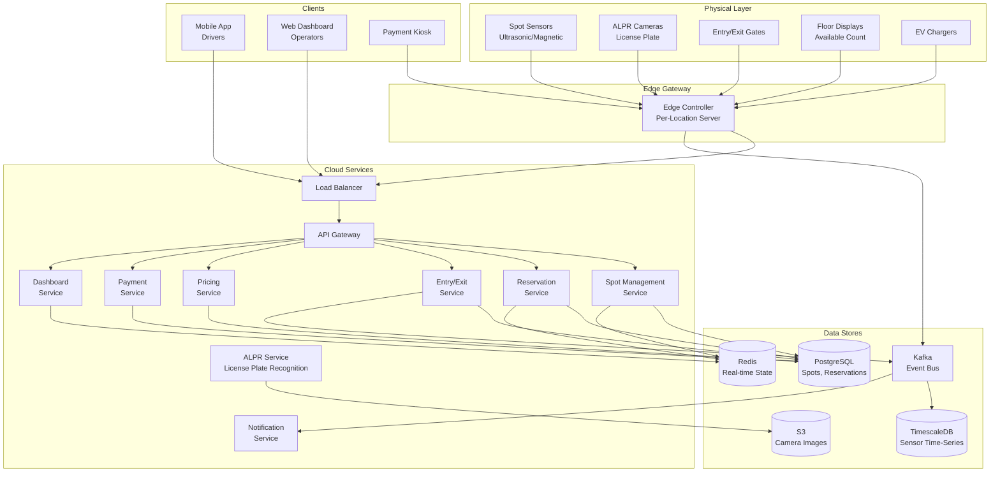
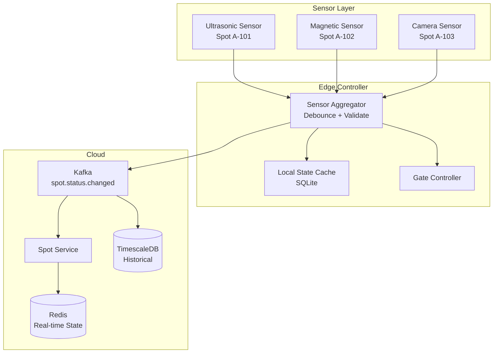
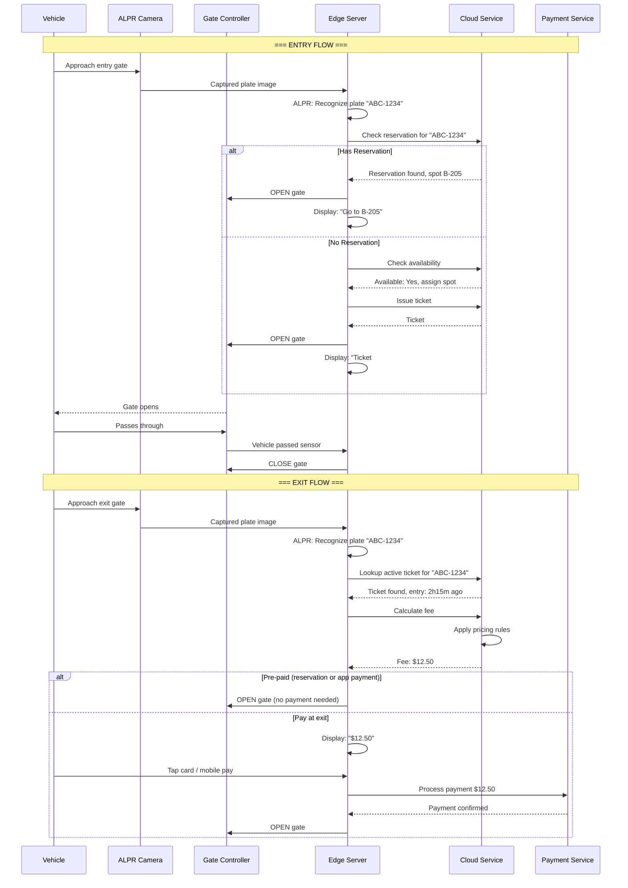
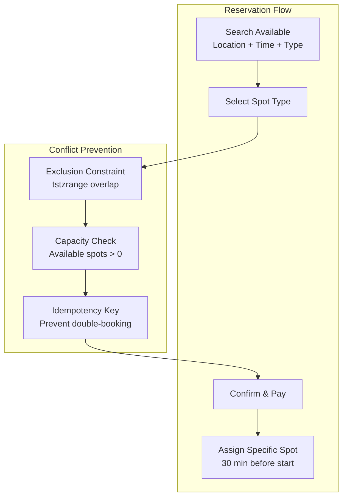
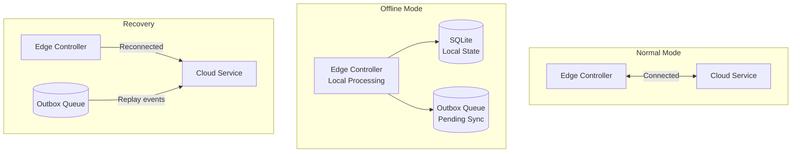

# Design a Parking Lot System

## 1. Problem Statement & Requirements

### Functional Requirements

| # | Requirement | Details |
|---|-------------|---------|
| FR-1 | Spot Tracking | Real-time status of every parking spot (occupied/available) |
| FR-2 | Vehicle Entry | Automated entry via gate with ticket/license plate recognition |
| FR-3 | Vehicle Exit | Automated exit with fee calculation and payment |
| FR-4 | Reservations | Reserve a spot in advance for a specific time window |
| FR-5 | Pricing Tiers | Different rates for compact, regular, large, EV, handicapped |
| FR-6 | Multi-Floor/Zone | Support multiple floors, zones, and sections |
| FR-7 | Payment | Credit card, mobile payment, monthly passes |
| FR-8 | Dashboard | Real-time occupancy display for operators and drivers |
| FR-9 | EV Charging | Track EV charging station availability and status |
| FR-10 | Violation Detection | Detect vehicles exceeding time limits or parking in wrong spots |

### Non-Functional Requirements

| # | Requirement | Target |
|---|-------------|--------|
| NFR-1 | Availability | 99.9% uptime (gates must always work) |
| NFR-2 | Latency | Gate open/close < 500ms |
| NFR-3 | Consistency | Strong consistency for spot allocation (no double-booking) |
| NFR-4 | Throughput | Handle 500+ vehicles/hour per gate |
| NFR-5 | Offline Mode | Gates should function during network outages |
| NFR-6 | Scale | Support 1-10,000 spot facilities; chain of 500+ locations |

---

## 2. Back-of-Envelope Estimation

### Scale Parameters

$$
\text{Locations} = 500 \quad \text{Avg Spots per Location} = 2{,}000
$$

$$
\text{Total Spots} = 500 \times 2{,}000 = 1{,}000{,}000
$$

### Transaction Volume

$$
\text{Avg Turnover Rate} = 4 \text{ vehicles per spot per day}
$$

$$
\text{Daily Transactions} = 1M \times 4 = 4M \text{ entry/exit events}
$$

$$
\text{Peak TPS} = \frac{4M}{16 \times 3{,}600} \times 3 \approx 210 \text{ TPS (3x peak factor)}
$$

### Storage Estimation

$$
\text{Transaction Record} = 200 \text{ bytes}
$$

$$
\text{Daily Storage} = 4M \times 200 \text{ B} = 800 \text{ MB/day}
$$

$$
\text{Annual Storage} = 800 \times 365 \approx 285 \text{ GB/year (transactions only)}
$$

**Sensor data:**

$$
\text{Sensors (1 per spot)} = 1M
$$

$$
\text{Sensor Heartbeat} = \text{every 5 seconds} = 12/\text{min}
$$

$$
\text{Sensor Events/day} = 1M \times 12 \times 60 \times 24 = 17.3B \text{ events/day}
$$

$$
\text{Sensor Data Storage} = 17.3B \times 50 \text{ B} = 865 \text{ GB/day}
$$

::: tip
Sensor data is primarily time-series. Use aggregation and TTL policies to manage storage: keep raw data for 7 days, 1-minute aggregates for 90 days, hourly aggregates forever.
:::

### Reservation Volume

$$
\text{Reservations} = 20\% \text{ of spots have advance reservations}
$$

$$
\text{Daily Reservations} = 200{,}000
$$

---

## 3. High-Level Design

### Architecture Diagram



### API Design

```typescript
// Spot Management APIs
GET  /api/v1/locations/{locationId}/floors/{floorId}/spots
     // Returns: all spots with status, type, and current occupant
GET  /api/v1/locations/{locationId}/availability
     // Returns: { total, available, occupied } by type and floor
POST /api/v1/locations/{locationId}/spots/{spotId}/status
     // Body: { status: "occupied"|"available", vehicleId? }

// Reservation APIs
POST   /api/v1/reservations
       // Body: { locationId, spotType, startTime, endTime, vehiclePlate }
GET    /api/v1/reservations/{reservationId}
PUT    /api/v1/reservations/{reservationId}
DELETE /api/v1/reservations/{reservationId}
GET    /api/v1/users/{userId}/reservations

// Entry/Exit APIs
POST /api/v1/entry
     // Body: { locationId, gateId, licensePlate, timestamp }
POST /api/v1/exit
     // Body: { locationId, gateId, licensePlate, timestamp }

// Payment APIs
GET  /api/v1/tickets/{ticketId}/fee
POST /api/v1/tickets/{ticketId}/pay
     // Body: { paymentMethod, amount }

// Dashboard APIs
GET /api/v1/locations/{locationId}/dashboard
    // Returns: real-time occupancy, revenue, trends
GET /api/v1/locations/{locationId}/analytics?period=7d
```

---

## 4. Database Schema

### Locations Table

```sql
CREATE TABLE locations (
    location_id     UUID PRIMARY KEY DEFAULT gen_random_uuid(),
    name            VARCHAR(200) NOT NULL,
    address         TEXT NOT NULL,
    latitude        DECIMAL(9,6),
    longitude       DECIMAL(9,6),
    total_spots     INT NOT NULL,
    floors          SMALLINT DEFAULT 1,
    timezone        VARCHAR(50) DEFAULT 'UTC',
    operating_hours JSONB, -- {"mon": {"open": "06:00", "close": "23:00"}, ...}
    owner_id        UUID NOT NULL,
    created_at      TIMESTAMPTZ DEFAULT NOW()
);
```

### Floors & Zones Table

```sql
CREATE TABLE floors (
    floor_id        UUID PRIMARY KEY DEFAULT gen_random_uuid(),
    location_id     UUID NOT NULL REFERENCES locations(location_id),
    floor_number    SMALLINT NOT NULL,
    floor_name      VARCHAR(50), -- "Level 1", "B1", "Rooftop"
    total_spots     INT NOT NULL,
    UNIQUE (location_id, floor_number)
);

CREATE TABLE zones (
    zone_id         UUID PRIMARY KEY DEFAULT gen_random_uuid(),
    floor_id        UUID NOT NULL REFERENCES floors(floor_id),
    zone_name       VARCHAR(50) NOT NULL, -- "A", "B", "EV", "Handicapped"
    spot_type       VARCHAR(20) NOT NULL, -- compact, regular, large, ev, handicapped
    total_spots     INT NOT NULL
);
```

### Parking Spots Table

```sql
CREATE TABLE parking_spots (
    spot_id         UUID PRIMARY KEY DEFAULT gen_random_uuid(),
    location_id     UUID NOT NULL REFERENCES locations(location_id),
    floor_id        UUID NOT NULL REFERENCES floors(floor_id),
    zone_id         UUID NOT NULL REFERENCES zones(zone_id),
    spot_number     VARCHAR(20) NOT NULL, -- "A-101"
    spot_type       VARCHAR(20) NOT NULL, -- compact, regular, large, ev, handicapped
    status          VARCHAR(20) DEFAULT 'available',
    has_ev_charger  BOOLEAN DEFAULT FALSE,
    sensor_id       VARCHAR(50),
    UNIQUE (location_id, spot_number)
);

CREATE INDEX idx_spots_location_status ON parking_spots(location_id, status);
CREATE INDEX idx_spots_type_status ON parking_spots(location_id, spot_type, status);
CREATE INDEX idx_spots_floor ON parking_spots(floor_id, status);
```

### Parking Tickets Table

```sql
CREATE TABLE parking_tickets (
    ticket_id       UUID PRIMARY KEY DEFAULT gen_random_uuid(),
    location_id     UUID NOT NULL REFERENCES locations(location_id),
    spot_id         UUID REFERENCES parking_spots(spot_id),
    license_plate   VARCHAR(20) NOT NULL,
    vehicle_type    VARCHAR(20), -- compact, regular, large, ev
    entry_time      TIMESTAMPTZ NOT NULL,
    exit_time       TIMESTAMPTZ,
    entry_gate_id   VARCHAR(50) NOT NULL,
    exit_gate_id    VARCHAR(50),
    reservation_id  UUID REFERENCES reservations(reservation_id),
    status          VARCHAR(20) DEFAULT 'active', -- active, completed, cancelled
    total_fee       DECIMAL(10,2),
    paid            BOOLEAN DEFAULT FALSE,
    created_at      TIMESTAMPTZ DEFAULT NOW()
);

CREATE INDEX idx_tickets_plate ON parking_tickets(license_plate, status);
CREATE INDEX idx_tickets_location ON parking_tickets(location_id, status);
CREATE INDEX idx_tickets_active ON parking_tickets(status) WHERE status = 'active';
```

### Reservations Table

```sql
CREATE TABLE reservations (
    reservation_id  UUID PRIMARY KEY DEFAULT gen_random_uuid(),
    location_id     UUID NOT NULL REFERENCES locations(location_id),
    user_id         UUID NOT NULL,
    spot_type       VARCHAR(20) NOT NULL,
    spot_id         UUID REFERENCES parking_spots(spot_id),
    license_plate   VARCHAR(20),
    start_time      TIMESTAMPTZ NOT NULL,
    end_time        TIMESTAMPTZ NOT NULL,
    status          VARCHAR(20) DEFAULT 'confirmed', -- confirmed, active, completed, cancelled, no_show
    prepaid_amount  DECIMAL(10,2),
    created_at      TIMESTAMPTZ DEFAULT NOW(),
    CONSTRAINT no_overlap EXCLUDE USING gist (
        spot_id WITH =,
        tstzrange(start_time, end_time) WITH &&
    ) WHERE (status IN ('confirmed', 'active'))
);

CREATE INDEX idx_reservations_location ON reservations(location_id, start_time, end_time)
    WHERE status IN ('confirmed', 'active');
CREATE INDEX idx_reservations_user ON reservations(user_id, status);
```

### Pricing Rules Table

```sql
CREATE TABLE pricing_rules (
    rule_id         UUID PRIMARY KEY DEFAULT gen_random_uuid(),
    location_id     UUID NOT NULL REFERENCES locations(location_id),
    spot_type       VARCHAR(20) NOT NULL,
    day_type        VARCHAR(20) DEFAULT 'weekday', -- weekday, weekend, holiday
    start_hour      SMALLINT DEFAULT 0,
    end_hour        SMALLINT DEFAULT 24,
    rate_per_hour   DECIMAL(8,2) NOT NULL,
    max_daily_rate  DECIMAL(8,2),
    first_hour_free BOOLEAN DEFAULT FALSE,
    priority        SMALLINT DEFAULT 0,
    valid_from      DATE DEFAULT CURRENT_DATE,
    valid_until     DATE,
    created_at      TIMESTAMPTZ DEFAULT NOW()
);

CREATE INDEX idx_pricing_location ON pricing_rules(location_id, spot_type, day_type);
```

### Payment Transactions Table

```sql
CREATE TABLE payment_transactions (
    transaction_id  UUID PRIMARY KEY DEFAULT gen_random_uuid(),
    ticket_id       UUID REFERENCES parking_tickets(ticket_id),
    reservation_id  UUID REFERENCES reservations(reservation_id),
    amount          DECIMAL(10,2) NOT NULL,
    payment_method  VARCHAR(30) NOT NULL, -- credit_card, mobile_pay, monthly_pass
    payment_status  VARCHAR(20) DEFAULT 'pending', -- pending, completed, failed, refunded
    gateway_ref     VARCHAR(100),
    created_at      TIMESTAMPTZ DEFAULT NOW()
);
```

---

## 5. Detailed Component Design

### 5.1 Real-Time Spot Tracking



```typescript
interface SpotStatusEvent {
  spotId: string;
  locationId: string;
  floorId: string;
  previousStatus: 'available' | 'occupied' | 'reserved' | 'maintenance';
  newStatus: 'available' | 'occupied' | 'reserved' | 'maintenance';
  sensorType: 'ultrasonic' | 'magnetic' | 'camera';
  confidence: number; // 0.0 - 1.0
  timestamp: Date;
}

class SpotTrackingService {
  // In-memory real-time state (backed by Redis)
  private spotStates: Map<string, SpotState> = new Map();

  async handleSensorEvent(event: SpotStatusEvent): Promise<void> {
    // Debounce: ignore rapid toggles (car driving over sensor)
    const lastEvent = await this.redis.get(`spot:last_event:${event.spotId}`);
    if (lastEvent) {
      const lastTime = new Date(JSON.parse(lastEvent).timestamp);
      if (Date.now() - lastTime.getTime() < 3000) {
        return; // Ignore events within 3 seconds
      }
    }

    // Confidence threshold
    if (event.confidence < 0.85) {
      // Request confirmation from secondary sensor
      await this.requestSecondaryConfirmation(event);
      return;
    }

    // Update state in Redis
    await this.redis.hset(`location:${event.locationId}:spots`, event.spotId, event.newStatus);
    await this.redis.set(`spot:last_event:${event.spotId}`, JSON.stringify(event), 'EX', 60);

    // Update availability counters
    await this.updateCounters(event);

    // Publish for dashboard and notifications
    await this.kafka.publish('spot.status.changed', event);

    // Check reservation conflicts
    if (event.newStatus === 'occupied') {
      await this.checkReservationConflict(event);
    }
  }

  async getAvailability(locationId: string): Promise<AvailabilitySummary> {
    // Read from Redis for real-time data
    const counters = await this.redis.hgetall(`location:${locationId}:counters`);

    return {
      total: parseInt(counters.total),
      available: parseInt(counters.available),
      occupied: parseInt(counters.occupied),
      reserved: parseInt(counters.reserved),
      byFloor: await this.getFloorBreakdown(locationId),
      byType: await this.getTypeBreakdown(locationId),
    };
  }

  private async updateCounters(event: SpotStatusEvent): Promise<void> {
    const pipe = this.redis.pipeline();
    const locationKey = `location:${event.locationId}:counters`;
    const floorKey = `floor:${event.floorId}:counters`;

    if (event.previousStatus === 'available' && event.newStatus === 'occupied') {
      pipe.hincrby(locationKey, 'available', -1);
      pipe.hincrby(locationKey, 'occupied', 1);
      pipe.hincrby(floorKey, 'available', -1);
      pipe.hincrby(floorKey, 'occupied', 1);
    } else if (event.previousStatus === 'occupied' && event.newStatus === 'available') {
      pipe.hincrby(locationKey, 'available', 1);
      pipe.hincrby(locationKey, 'occupied', -1);
      pipe.hincrby(floorKey, 'available', 1);
      pipe.hincrby(floorKey, 'occupied', -1);
    }

    await pipe.exec();
  }
}
```

### 5.2 Entry/Exit Gate Flow



```typescript
class EntryExitService {
  async processEntry(
    locationId: string,
    gateId: string,
    licensePlate: string
  ): Promise<EntryResult> {
    // Check for existing reservation
    const reservation = await this.findReservation(locationId, licensePlate);

    if (reservation) {
      // Activate reservation
      await this.activateReservation(reservation.reservation_id);
      return {
        action: 'open_gate',
        ticketId: null,
        assignedSpot: reservation.spot_id,
        displayMessage: `Reserved spot: ${reservation.spot_number}`,
      };
    }

    // Find available spot
    const vehicleType = await this.classifyVehicle(licensePlate);
    const spot = await this.findBestSpot(locationId, vehicleType);

    if (!spot) {
      return {
        action: 'deny_entry',
        displayMessage: 'FULL - No spots available',
      };
    }

    // Issue ticket
    const ticket = await this.issueTicket({
      locationId,
      spotId: spot.spot_id,
      licensePlate,
      vehicleType,
      entryTime: new Date(),
      entryGateId: gateId,
    });

    // Mark spot as occupied
    await this.updateSpotStatus(spot.spot_id, 'occupied');

    return {
      action: 'open_gate',
      ticketId: ticket.ticket_id,
      assignedSpot: spot.spot_number,
      displayMessage: `Welcome! Spot: ${spot.spot_number}, Floor ${spot.floor_number}`,
    };
  }

  async processExit(
    locationId: string,
    gateId: string,
    licensePlate: string
  ): Promise<ExitResult> {
    // Find active ticket
    const ticket = await this.findActiveTicket(locationId, licensePlate);
    if (!ticket) {
      return { action: 'alert_operator', reason: 'No active ticket found' };
    }

    // Calculate fee
    const fee = await this.pricingService.calculateFee(ticket);

    // Check if already paid (reservation pre-payment or app payment)
    if (ticket.paid) {
      await this.completeTicket(ticket.ticket_id, gateId);
      return { action: 'open_gate', fee: 0, displayMessage: 'Thank you! Paid.' };
    }

    return {
      action: 'request_payment',
      fee: fee.total,
      breakdown: fee.breakdown,
      displayMessage: `Fee: $${fee.total.toFixed(2)}`,
      ticketId: ticket.ticket_id,
    };
  }

  private async findBestSpot(
    locationId: string,
    vehicleType: string
  ): Promise<ParkingSpot | null> {
    // Strategy: assign spot closest to elevator/exit on the lowest available floor
    const spot = await this.db.query(`
      SELECT ps.*, f.floor_number
      FROM parking_spots ps
      JOIN floors f ON ps.floor_id = f.floor_id
      WHERE ps.location_id = $1
        AND ps.spot_type = $2
        AND ps.status = 'available'
      ORDER BY f.floor_number ASC, ps.distance_to_elevator ASC
      LIMIT 1
      FOR UPDATE SKIP LOCKED
    `, [locationId, vehicleType]);

    return spot.rows[0] ?? null;
  }
}
```

### 5.3 Reservation System



```typescript
class ReservationService {
  async createReservation(request: ReservationRequest): Promise<Reservation> {
    return await this.db.transaction(async (tx) => {
      // Check capacity for the requested time window
      const available = await tx.query(`
        SELECT COUNT(*) as available_count
        FROM parking_spots ps
        WHERE ps.location_id = $1
          AND ps.spot_type = $2
          AND ps.status != 'maintenance'
          AND ps.spot_id NOT IN (
            SELECT r.spot_id FROM reservations r
            WHERE r.location_id = $1
              AND r.status IN ('confirmed', 'active')
              AND r.spot_id IS NOT NULL
              AND tstzrange(r.start_time, r.end_time) && tstzrange($3, $4)
          )
      `, [request.locationId, request.spotType, request.startTime, request.endTime]);

      if (parseInt(available.rows[0].available_count) === 0) {
        throw new NoAvailabilityError('No spots available for the requested time');
      }

      // Create reservation (spot assigned later)
      const reservation = await tx.query(`
        INSERT INTO reservations (
          location_id, user_id, spot_type, license_plate,
          start_time, end_time, status, prepaid_amount
        )
        VALUES ($1, $2, $3, $4, $5, $6, 'confirmed', $7)
        RETURNING *
      `, [
        request.locationId, request.userId, request.spotType,
        request.licensePlate, request.startTime, request.endTime,
        request.prepaidAmount,
      ]);

      // Process pre-payment
      if (request.prepaidAmount > 0) {
        await this.paymentService.processPayment({
          reservationId: reservation.rows[0].reservation_id,
          amount: request.prepaidAmount,
          paymentMethod: request.paymentMethod,
        });
      }

      // Schedule spot assignment 30 minutes before start
      await this.scheduler.schedule(
        'assign_spot',
        { reservationId: reservation.rows[0].reservation_id },
        new Date(request.startTime.getTime() - 30 * 60 * 1000)
      );

      // Schedule no-show check 15 minutes after start
      await this.scheduler.schedule(
        'check_no_show',
        { reservationId: reservation.rows[0].reservation_id },
        new Date(request.startTime.getTime() + 15 * 60 * 1000)
      );

      return reservation.rows[0];
    });
  }

  async assignSpot(reservationId: string): Promise<void> {
    await this.db.transaction(async (tx) => {
      const reservation = await tx.query(
        'SELECT * FROM reservations WHERE reservation_id = $1 FOR UPDATE',
        [reservationId]
      );

      if (reservation.rows[0].status !== 'confirmed') return;

      // Find and lock a specific spot
      const spot = await tx.query(`
        SELECT spot_id, spot_number FROM parking_spots
        WHERE location_id = $1 AND spot_type = $2 AND status = 'available'
        ORDER BY distance_to_elevator ASC
        LIMIT 1
        FOR UPDATE SKIP LOCKED
      `, [reservation.rows[0].location_id, reservation.rows[0].spot_type]);

      if (spot.rows.length === 0) {
        // No spot available - notify user
        await this.notifyReservationIssue(reservationId);
        return;
      }

      // Assign spot to reservation
      await tx.query(
        'UPDATE reservations SET spot_id = $1 WHERE reservation_id = $2',
        [spot.rows[0].spot_id, reservationId]
      );

      // Mark spot as reserved
      await tx.query(
        "UPDATE parking_spots SET status = 'reserved' WHERE spot_id = $1",
        [spot.rows[0].spot_id]
      );

      // Notify user with spot details
      await this.notificationService.send(reservation.rows[0].user_id, {
        type: 'spot_assigned',
        spotNumber: spot.rows[0].spot_number,
        reservationId,
      });
    });
  }
}
```

### 5.4 Pricing Engine

```typescript
interface PricingBreakdown {
  duration: { hours: number; minutes: number };
  baseRate: number;
  subtotal: number;
  discounts: PricingDiscount[];
  surcharges: PricingSurcharge[];
  tax: number;
  total: number;
}

class PricingService {
  async calculateFee(ticket: ParkingTicket): Promise<PricingBreakdown> {
    const entryTime = new Date(ticket.entry_time);
    const exitTime = ticket.exit_time ? new Date(ticket.exit_time) : new Date();
    const durationMs = exitTime.getTime() - entryTime.getTime();
    const durationHours = durationMs / (1000 * 60 * 60);

    // Get applicable pricing rules
    const rules = await this.getPricingRules(
      ticket.location_id,
      ticket.vehicle_type ?? 'regular',
      entryTime
    );

    // Calculate base fee with time-of-day rates
    let totalFee = 0;
    let currentTime = new Date(entryTime);
    const breakdown: TimeSegment[] = [];

    while (currentTime < exitTime) {
      const rule = this.getApplicableRule(rules, currentTime);
      const segmentEnd = this.getSegmentEnd(currentTime, rule, exitTime);
      const segmentHours = (segmentEnd.getTime() - currentTime.getTime()) / (1000 * 60 * 60);

      const segmentFee = segmentHours * rule.rate_per_hour;
      totalFee += segmentFee;

      breakdown.push({
        from: currentTime,
        to: segmentEnd,
        hours: segmentHours,
        rate: rule.rate_per_hour,
        fee: segmentFee,
      });

      currentTime = segmentEnd;
    }

    // Apply daily maximum
    const maxDaily = rules[0]?.max_daily_rate;
    if (maxDaily && totalFee > maxDaily) {
      const fullDays = Math.floor(durationHours / 24);
      const remainderFee = totalFee - fullDays * maxDaily;
      totalFee = fullDays * maxDaily + Math.min(remainderFee, maxDaily);
    }

    // Apply discounts
    const discounts = await this.getApplicableDiscounts(ticket);
    let discountTotal = 0;
    for (const discount of discounts) {
      const amount = discount.type === 'percentage'
        ? totalFee * discount.value / 100
        : discount.value;
      discountTotal += amount;
    }

    const subtotal = Math.max(0, totalFee - discountTotal);
    const tax = subtotal * 0.08; // 8% tax

    return {
      duration: {
        hours: Math.floor(durationHours),
        minutes: Math.round((durationHours % 1) * 60),
      },
      baseRate: rules[0]?.rate_per_hour ?? 0,
      subtotal: totalFee,
      discounts: discounts.map(d => ({
        name: d.name,
        amount: d.type === 'percentage' ? totalFee * d.value / 100 : d.value,
      })),
      surcharges: [],
      tax,
      total: Math.round((subtotal + tax) * 100) / 100,
    };
  }

  // Dynamic pricing based on occupancy
  async getDynamicRate(locationId: string, spotType: string): Promise<number> {
    const availability = await this.spotService.getAvailability(locationId);
    const occupancyRate = availability.occupied / availability.total;

    const baseRule = await this.getBaseRate(locationId, spotType);
    let multiplier = 1.0;

    // Surge pricing when lot is nearly full
    if (occupancyRate > 0.95) multiplier = 2.0;
    else if (occupancyRate > 0.90) multiplier = 1.5;
    else if (occupancyRate > 0.80) multiplier = 1.2;
    else if (occupancyRate < 0.30) multiplier = 0.8; // Discount when lot is empty

    return baseRule.rate_per_hour * multiplier;
  }
}
```

### 5.5 Multi-Floor/Multi-Zone Navigation

```typescript
class ParkingNavigationService {
  // Guide driver to their assigned spot
  async getNavigationPath(
    locationId: string,
    entryGateId: string,
    targetSpotId: string
  ): Promise<NavigationPath> {
    const spot = await this.getSpot(targetSpotId);
    const gate = await this.getGate(entryGateId);

    return {
      steps: [
        { instruction: `Enter through Gate ${gate.name}`, floor: gate.floor },
        ...(spot.floor_number !== gate.floor
          ? [{ instruction: `Take ramp to Floor ${spot.floor_number}`, floor: spot.floor_number }]
          : []),
        { instruction: `Go to Zone ${spot.zone_name}`, floor: spot.floor_number },
        { instruction: `Park at Spot ${spot.spot_number}`, floor: spot.floor_number },
      ],
      estimatedWalkToElevator: spot.distance_to_elevator,
      floorMapUrl: `/api/v1/locations/${locationId}/floors/${spot.floor_id}/map`,
    };
  }

  // Update floor-level availability displays
  async updateFloorDisplays(locationId: string): Promise<void> {
    const floors = await this.getFloors(locationId);

    for (const floor of floors) {
      const available = await this.redis.hget(
        `floor:${floor.floor_id}:counters`, 'available'
      );

      // Send to physical display via MQTT
      await this.mqtt.publish(`displays/${locationId}/${floor.floor_id}`, {
        available: parseInt(available ?? '0'),
        total: floor.total_spots,
        status: parseInt(available ?? '0') > 0 ? 'green' : 'red',
      });
    }
  }
}
```

### 5.6 Occupancy Dashboard

```typescript
class DashboardService {
  async getLocationDashboard(locationId: string): Promise<Dashboard> {
    const [availability, revenue, trends, alerts] = await Promise.all([
      this.getAvailability(locationId),
      this.getTodayRevenue(locationId),
      this.getOccupancyTrends(locationId),
      this.getActiveAlerts(locationId),
    ]);

    return {
      realtime: {
        totalSpots: availability.total,
        available: availability.available,
        occupied: availability.occupied,
        reserved: availability.reserved,
        occupancyRate: (availability.occupied / availability.total * 100).toFixed(1) + '%',
        byFloor: availability.byFloor,
        byType: availability.byType,
      },
      revenue: {
        today: revenue.today,
        thisWeek: revenue.thisWeek,
        thisMonth: revenue.thisMonth,
        avgTicketValue: revenue.avgTicketValue,
        avgDuration: revenue.avgDuration,
      },
      trends: {
        hourlyOccupancy: trends.hourly,   // 24 data points
        peakHour: trends.peakHour,
        avgTurnover: trends.avgTurnover,
      },
      alerts: alerts, // Sensor failures, full floors, payment issues
    };
  }

  async getOccupancyTrends(locationId: string): Promise<OccupancyTrends> {
    // Query TimescaleDB for historical patterns
    const hourly = await this.timescaleDb.query(`
      SELECT
        time_bucket('1 hour', event_time) AS hour,
        AVG(occupancy_rate) AS avg_occupancy,
        MAX(occupancy_rate) AS peak_occupancy
      FROM occupancy_snapshots
      WHERE location_id = $1
        AND event_time > NOW() - INTERVAL '7 days'
      GROUP BY hour
      ORDER BY hour
    `, [locationId]);

    return {
      hourly: hourly.rows,
      peakHour: hourly.rows.reduce((max, row) =>
        row.avg_occupancy > max.avg_occupancy ? row : max
      ),
      avgTurnover: await this.calculateTurnover(locationId),
    };
  }
}
```

---

## 6. Scaling & Bottlenecks

### What Breaks First

| Component | Bottleneck | Solution |
|-----------|-----------|----------|
| Sensor data ingestion | 17.3B events/day | Kafka + TimescaleDB with hypertables |
| Real-time state | Concurrent spot updates | Redis with per-location hash maps |
| Reservation conflicts | Double booking under concurrency | PostgreSQL exclusion constraints + FOR UPDATE SKIP LOCKED |
| Gate latency | Network timeout blocks gate | Edge controller with local fallback |
| Payment processing | Third-party payment gateway timeout | Async payment with gate release on promise |
| Dashboard updates | Frequent polling by operators | WebSocket push + Redis pub/sub |

### Offline / Edge Resilience



```typescript
class EdgeController {
  private isOnline: boolean = true;
  private outboxQueue: Event[] = [];

  async processEntry(licensePlate: string, gateId: string): Promise<EntryResult> {
    if (this.isOnline) {
      try {
        return await this.cloudService.processEntry(this.locationId, gateId, licensePlate);
      } catch (error) {
        this.isOnline = false;
        // Fall through to offline mode
      }
    }

    // Offline mode: process locally
    const localTicket = await this.localDb.createTicket({
      licensePlate,
      gateId,
      entryTime: new Date(),
      synced: false,
    });

    // Queue for later sync
    this.outboxQueue.push({
      type: 'entry',
      data: localTicket,
      timestamp: new Date(),
    });

    return {
      action: 'open_gate',
      ticketId: localTicket.id,
      displayMessage: 'Welcome (offline mode)',
    };
  }

  async syncToCloud(): Promise<void> {
    if (!this.isOnline || this.outboxQueue.length === 0) return;

    const batch = this.outboxQueue.splice(0, 100);
    try {
      await this.cloudService.syncBatch(this.locationId, batch);
    } catch {
      // Put back in queue
      this.outboxQueue.unshift(...batch);
    }
  }
}
```

---

## 7. Trade-offs & Alternatives

### Sensor Technology

| Sensor Type | Cost | Accuracy | Maintenance | Best For |
|------------|------|----------|-------------|----------|
| Ultrasonic | $$$ | 95% | Low | Indoor, individual spot |
| Magnetic (in-ground) | $$$$ | 98% | High (buried) | Outdoor, durable |
| Camera (CV) | $$ | 90% | Low | Multi-spot coverage |
| IR Beam (entry/exit) | $ | 99% | Very low | Count-only (no spot-level) |

### Spot Assignment Strategy

| Strategy | Pro | Con |
|----------|-----|-----|
| Nearest to elevator | Best customer experience | Uneven wear on spots |
| Fill from top floor down | Even distribution | Inconvenient for short visits |
| Random assignment | Simplest implementation | Poor experience |
| Nearest to entry gate | Fast parking | Congestion near entrance |

### Reservation Model

| Approach | Pro | Con |
|----------|-----|-----|
| Reserve specific spot | User knows exact spot | Less flexibility, wasted capacity |
| Reserve type only (assign later) | Better utilization | User does not know spot until arrival |
| Guaranteed entry (no specific spot) | Maximum flexibility | User may get undesirable spot |

---

## 8. Advanced Topics

### 8.1 EV Charging Integration

```typescript
interface EVChargingSession {
  sessionId: string;
  spotId: string;
  vehiclePlate: string;
  chargerType: 'level2' | 'dc_fast';
  startTime: Date;
  endTime?: Date;
  energyDeliveredKwh: number;
  chargingRate: number;     // $/kWh
  parkingRate: number;      // $/hour (may be discounted while charging)
  status: 'charging' | 'complete' | 'idle_fee'; // idle_fee = done charging but still parked
}

class EVChargingService {
  async startCharging(spotId: string, vehiclePlate: string): Promise<EVChargingSession> {
    const charger = await this.getCharger(spotId);
    if (charger.status !== 'available') throw new ChargerUnavailableError();

    const session = await this.createSession({ spotId, vehiclePlate, chargerType: charger.type });

    // Start monitoring charge level via OCPP protocol
    await this.ocppClient.startTransaction(charger.id, session.sessionId);

    return session;
  }

  // Apply idle fee when vehicle is done charging but still parked
  async checkIdleVehicles(): Promise<void> {
    const completeSessions = await this.getCompletedButParked();
    for (const session of completeSessions) {
      const idleMinutes = (Date.now() - session.chargeCompleteTime.getTime()) / 60000;
      if (idleMinutes > 10) { // 10 minute grace period
        await this.applyIdleFee(session, idleMinutes);
        await this.notifyUser(session, 'Your vehicle is fully charged. Please move to avoid idle fees.');
      }
    }
  }
}
```

### 8.2 License Plate Recognition (ALPR)

$$
\text{ALPR Accuracy} \geq 97\% \text{ under normal conditions}
$$

$$
\text{Processing Time} < 200\text{ms per frame}
$$

### 8.3 Predictive Occupancy

```typescript
class OccupancyPredictor {
  // Predict occupancy for next N hours using historical patterns
  async predict(locationId: string, hoursAhead: number): Promise<OccupancyPrediction[]> {
    const historicalData = await this.getHistoricalPatterns(locationId, 90); // 90 days
    const currentOccupancy = await this.getCurrentOccupancy(locationId);
    const dayOfWeek = new Date().getDay();
    const currentHour = new Date().getHours();

    const predictions: OccupancyPrediction[] = [];

    for (let h = 1; h <= hoursAhead; h++) {
      const targetHour = (currentHour + h) % 24;
      const historicalAvg = this.getHistoricalAverage(historicalData, dayOfWeek, targetHour);

      predictions.push({
        hour: targetHour,
        predictedOccupancy: historicalAvg,
        confidence: 0.85,
        suggestedRate: this.suggestDynamicRate(historicalAvg),
      });
    }

    return predictions;
  }
}
```

---

## 9. Interview Tips

::: tip Key Points to Emphasize
1. **Real-time state management** — Redis for live spot status, PostgreSQL for persistence.
2. **Concurrency control** — FOR UPDATE SKIP LOCKED and exclusion constraints prevent double-booking.
3. **Edge resilience** — Gates must work even when cloud is unreachable.
4. **Pricing flexibility** — Time-of-day rates, dynamic pricing, daily maximums, discounts.
5. **Sensor debouncing** — Raw sensor data needs filtering to avoid false state changes.
:::

::: warning Common Mistakes
- Ignoring the physical layer (sensors, gates, displays) — this is an IoT system, not just a web app.
- Using only a relational database for real-time spot state — Redis is essential for the speed requirement.
- Not handling the offline/edge case — network failures cannot prevent gate operations.
- Overcomplicating the reservation system — start simple with type-based reservations.
- Forgetting about EV charging as a revenue stream.
:::

::: info Follow-Up Questions to Expect
- How would you handle a sensor failure? (Fallback to camera, alert maintenance, mark spot as unknown.)
- How would you implement valet parking? (Queue-based assignment, valet app for spot tracking.)
- How would you scale to an airport parking system with 20,000+ spots?
- How would you integrate with navigation apps (Google Maps, Waze) for live availability?
:::

### Time Allocation in 45-min Interview

| Phase | Time | Focus |
|-------|------|-------|
| Requirements | 5 min | Clarify scale: single lot vs. chain, smart vs. basic |
| High-Level Design | 8 min | Architecture diagram, edge vs. cloud |
| Deep Dive: Spot Tracking | 8 min | Sensors, debouncing, real-time state |
| Deep Dive: Entry/Exit | 8 min | ALPR, gate control, spot assignment |
| Deep Dive: Reservations | 7 min | Concurrency, pricing, no-show handling |
| Scaling | 5 min | Edge resilience, sensor data volume |
| Q&A | 4 min | EV, dynamic pricing, predictions |
