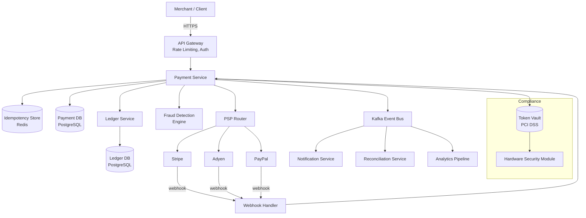
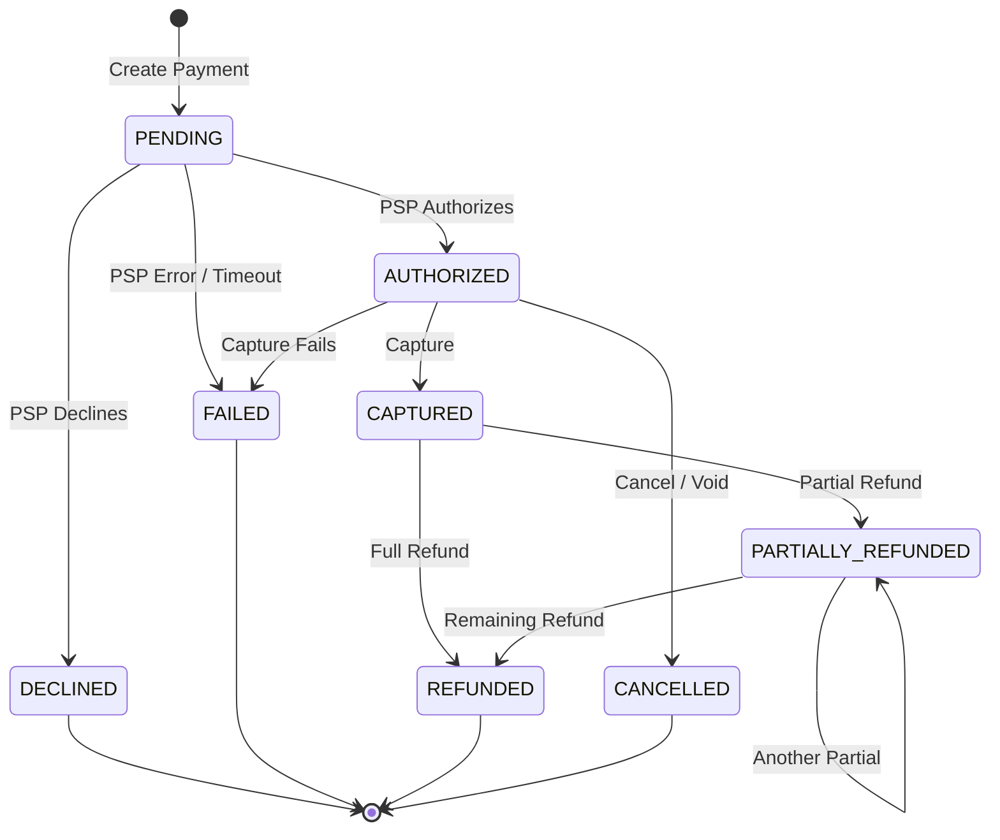
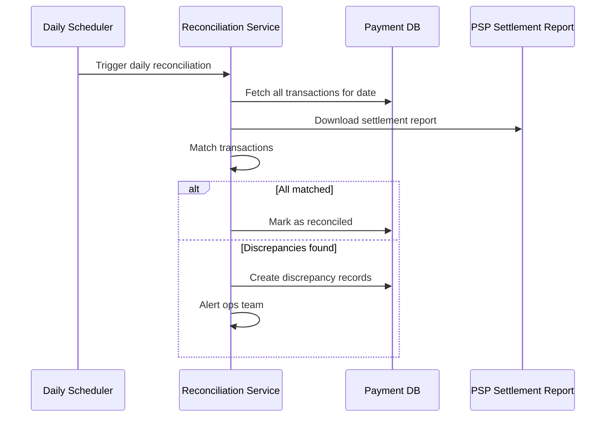
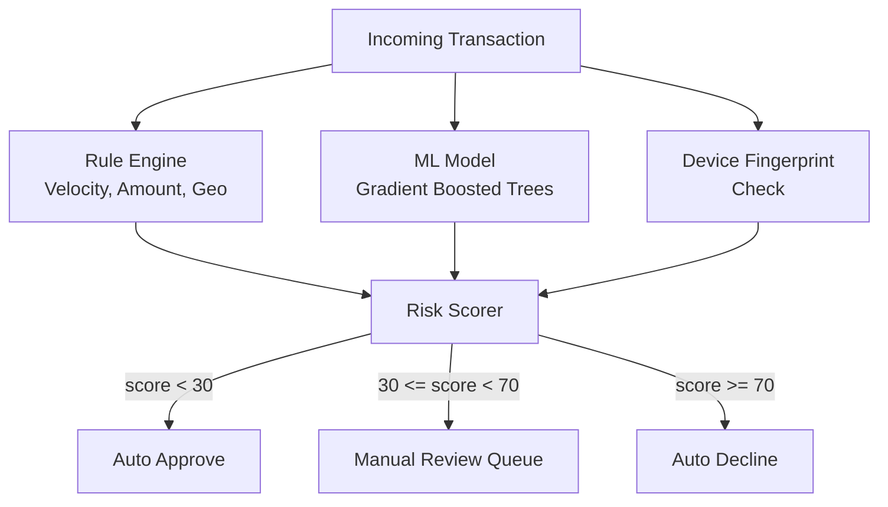
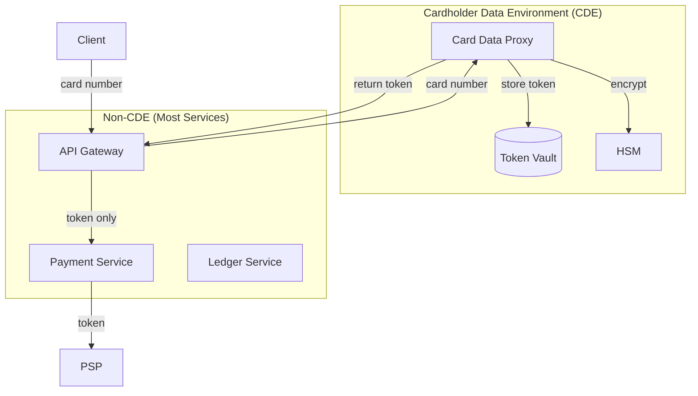
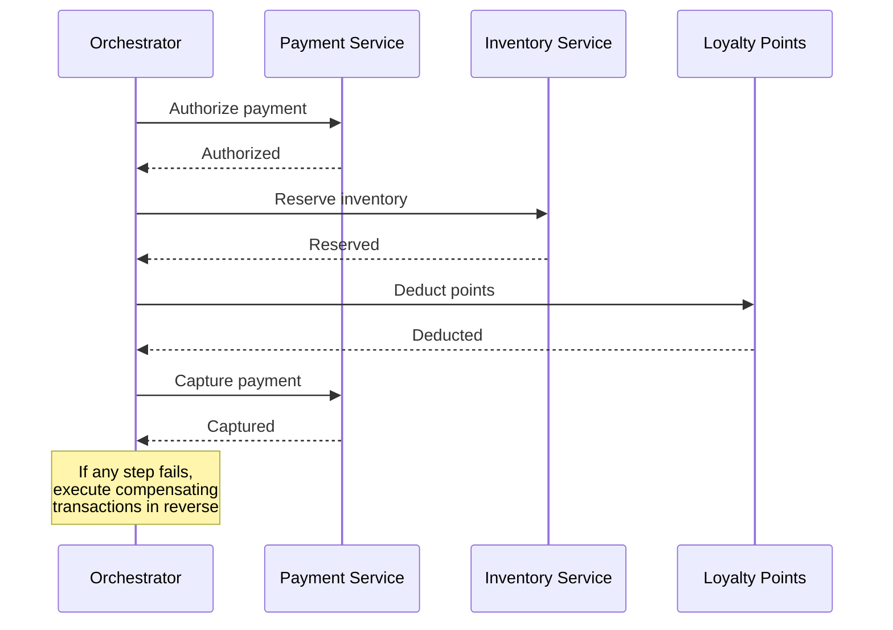

# Design a Payment System

## 1. Problem Statement & Requirements

Design a payment system like Stripe or PayPal that processes credit card payments, handles refunds, and ensures financial consistency.

### Functional Requirements

| # | Requirement |
|---|-------------|
| FR-1 | Process payments (credit card, debit card, bank transfer) |
| FR-2 | Guarantee exactly-once payment execution (idempotency) |
| FR-3 | Support refunds (full and partial) |
| FR-4 | Maintain double-entry bookkeeping ledger |
| FR-5 | Reconcile transactions with payment service providers (PSPs) |
| FR-6 | Detect and prevent fraudulent transactions |
| FR-7 | Support multiple currencies |
| FR-8 | Generate payment receipts and invoices |

### Non-Functional Requirements

| # | Requirement | Target |
|---|-------------|--------|
| NFR-1 | Availability | 99.999% (five nines) |
| NFR-2 | Latency | p99 < 2 seconds (end-to-end) |
| NFR-3 | Consistency | Strong (financial data) |
| NFR-4 | Durability | Zero data loss |
| NFR-5 | PCI DSS compliance | Level 1 |
| NFR-6 | Throughput | 10,000 TPS peak |

---

## 2. Back-of-Envelope Estimation

### Traffic

- Daily transactions: 50 million
- Peak TPS:

$$
\text{Avg TPS} = \frac{50 \times 10^6}{86400} \approx 579 \text{ TPS}
$$

$$
\text{Peak TPS} \approx 10 \times 579 \approx 5{,}790 \text{ TPS}
$$

- Design for 10,000 TPS to handle spikes (Black Friday, flash sales)

### Storage

- Transaction record size: ~2 KB (metadata, amounts, status, audit trail)
- Daily storage:

$$
50 \times 10^6 \times 2 \text{ KB} = 100 \text{ GB/day}
$$

- Annual storage (with 7-year retention for compliance):

$$
100 \text{ GB} \times 365 \times 7 = 255.5 \text{ TB}
$$

### Ledger Entries

- Each transaction creates at least 2 ledger entries (double-entry)
- Daily ledger entries:

$$
50 \times 10^6 \times 2 = 100 \times 10^6 \text{ entries/day}
$$

- Entry size: ~500 bytes

$$
100 \times 10^6 \times 500 = 50 \text{ GB/day ledger data}
$$

### Bandwidth

$$
\text{Inbound} = 5{,}790 \times 2 \text{ KB} \approx 11.6 \text{ MB/s}
$$

$$
\text{Outbound} = 5{,}790 \times 1 \text{ KB} \approx 5.8 \text{ MB/s}
$$

---

## 3. High-Level Design



### API Design

```typescript
// POST /v1/payments
interface CreatePaymentRequest {
  idempotencyKey: string;           // Client-generated UUID
  amount: number;                    // In smallest currency unit (cents)
  currency: string;                  // ISO 4217 (USD, EUR, etc.)
  paymentMethodId: string;          // Tokenized payment method
  merchantId: string;
  description?: string;
  metadata?: Record<string, string>;
  captureMethod?: 'automatic' | 'manual';  // Auth-only vs. auth+capture
}

interface PaymentResponse {
  paymentId: string;
  status: PaymentStatus;
  amount: number;
  currency: string;
  createdAt: string;
  pspReference?: string;
}

type PaymentStatus =
  | 'PENDING'
  | 'AUTHORIZED'
  | 'CAPTURED'
  | 'DECLINED'
  | 'FAILED'
  | 'REFUNDED'
  | 'PARTIALLY_REFUNDED'
  | 'CANCELLED';

// POST /v1/payments/:id/refund
interface RefundRequest {
  idempotencyKey: string;
  amount?: number;    // Partial refund amount; omit for full refund
  reason?: string;
}

// POST /v1/payments/:id/capture
interface CaptureRequest {
  idempotencyKey: string;
  amount?: number;    // Capture less than authorized amount
}
```

---

## 4. Database Schema

### Payments Table

```sql
CREATE TABLE payments (
    payment_id          UUID PRIMARY KEY DEFAULT gen_random_uuid(),
    idempotency_key     VARCHAR(64) NOT NULL,
    merchant_id         VARCHAR(64) NOT NULL,
    amount              BIGINT NOT NULL,            -- In cents
    currency            CHAR(3) NOT NULL,
    status              VARCHAR(30) NOT NULL DEFAULT 'PENDING',
    payment_method_id   VARCHAR(128) NOT NULL,
    psp_name            VARCHAR(30),
    psp_reference       VARCHAR(128),
    capture_method      VARCHAR(10) DEFAULT 'automatic',
    description         TEXT,
    metadata            JSONB,
    failure_reason      TEXT,
    created_at          TIMESTAMPTZ NOT NULL DEFAULT NOW(),
    updated_at          TIMESTAMPTZ NOT NULL DEFAULT NOW(),
    version             INT NOT NULL DEFAULT 1,      -- Optimistic locking
    UNIQUE (merchant_id, idempotency_key)
) PARTITION BY RANGE (created_at);

CREATE INDEX idx_payments_merchant ON payments(merchant_id, created_at DESC);
CREATE INDEX idx_payments_status ON payments(status) WHERE status IN ('PENDING', 'AUTHORIZED');
CREATE INDEX idx_payments_psp_ref ON payments(psp_name, psp_reference);
```

### Ledger Entries Table (Double-Entry)

```sql
CREATE TABLE ledger_entries (
    entry_id            BIGSERIAL PRIMARY KEY,
    payment_id          UUID NOT NULL REFERENCES payments(payment_id),
    account_id          VARCHAR(64) NOT NULL,
    entry_type          VARCHAR(10) NOT NULL CHECK (entry_type IN ('DEBIT', 'CREDIT')),
    amount              BIGINT NOT NULL,             -- Always positive
    currency            CHAR(3) NOT NULL,
    balance_after       BIGINT,                      -- Running balance
    description         TEXT,
    created_at          TIMESTAMPTZ NOT NULL DEFAULT NOW()
) PARTITION BY RANGE (created_at);

CREATE INDEX idx_ledger_account ON ledger_entries(account_id, created_at DESC);
CREATE INDEX idx_ledger_payment ON ledger_entries(payment_id);

-- Constraint: sum of debits = sum of credits for each payment
-- Enforced at application level in a transaction
```

### Refunds Table

```sql
CREATE TABLE refunds (
    refund_id           UUID PRIMARY KEY DEFAULT gen_random_uuid(),
    payment_id          UUID NOT NULL REFERENCES payments(payment_id),
    idempotency_key     VARCHAR(64) NOT NULL,
    amount              BIGINT NOT NULL,
    currency            CHAR(3) NOT NULL,
    status              VARCHAR(30) NOT NULL DEFAULT 'PENDING',
    reason              TEXT,
    psp_reference       VARCHAR(128),
    created_at          TIMESTAMPTZ NOT NULL DEFAULT NOW(),
    updated_at          TIMESTAMPTZ NOT NULL DEFAULT NOW(),
    UNIQUE (payment_id, idempotency_key)
);
```

### Payment Events (Audit Trail)

```sql
CREATE TABLE payment_events (
    event_id            BIGSERIAL PRIMARY KEY,
    payment_id          UUID NOT NULL,
    event_type          VARCHAR(50) NOT NULL,
    old_status          VARCHAR(30),
    new_status          VARCHAR(30),
    event_data          JSONB,
    source              VARCHAR(50) NOT NULL,       -- 'API', 'WEBHOOK', 'SYSTEM'
    created_at          TIMESTAMPTZ NOT NULL DEFAULT NOW()
) PARTITION BY RANGE (created_at);

CREATE INDEX idx_events_payment ON payment_events(payment_id, created_at);
```

---

## 5. Detailed Component Design

### 5.1 Payment Flow — State Machine



### 5.2 Idempotency

Idempotency ensures that retrying a payment request does not charge the customer twice.

```typescript
class IdempotencyService {
  private redis: RedisClient;
  private readonly TTL_HOURS = 24;

  /**
   * Check if this request was already processed.
   * Returns the cached response if found, null otherwise.
   */
  async checkAndLock(
    merchantId: string,
    idempotencyKey: string
  ): Promise<{ locked: boolean; cachedResponse?: PaymentResponse }> {
    const key = `idempotency:${merchantId}:${idempotencyKey}`;

    // Try to set with NX (only if not exists)
    const result = await this.redis.set(
      key,
      JSON.stringify({ status: 'PROCESSING', startedAt: Date.now() }),
      'EX', this.TTL_HOURS * 3600,
      'NX'
    );

    if (result === null) {
      // Key exists — either processing or completed
      const existing = await this.redis.get(key);
      if (!existing) {
        return { locked: false };
      }
      const parsed = JSON.parse(existing);
      if (parsed.status === 'COMPLETED') {
        return { locked: false, cachedResponse: parsed.response };
      }
      // Still processing — could be a concurrent request or a stuck one
      if (Date.now() - parsed.startedAt > 30_000) {
        // Stale lock (> 30s) — allow retry
        await this.redis.del(key);
        return this.checkAndLock(merchantId, idempotencyKey);
      }
      return { locked: false }; // Return 409 Conflict
    }

    return { locked: true };
  }

  async complete(
    merchantId: string,
    idempotencyKey: string,
    response: PaymentResponse
  ): Promise<void> {
    const key = `idempotency:${merchantId}:${idempotencyKey}`;
    await this.redis.set(
      key,
      JSON.stringify({ status: 'COMPLETED', response }),
      'EX', this.TTL_HOURS * 3600
    );
  }

  async release(
    merchantId: string,
    idempotencyKey: string
  ): Promise<void> {
    const key = `idempotency:${merchantId}:${idempotencyKey}`;
    await this.redis.del(key);
  }
}
```

::: danger Double-Charge Prevention
The idempotency key is the **single most important** safety mechanism. Without it, network retries, client timeouts, and load balancer retries can all cause duplicate charges. Always require clients to generate a unique idempotency key (UUID v4) for every payment intent.
:::

### 5.3 Double-Entry Bookkeeping

Every payment creates balanced ledger entries: total debits always equal total credits.

```typescript
class LedgerService {
  private db: DatabasePool;

  /**
   * Record a payment capture in the ledger.
   * Creates two entries that sum to zero.
   */
  async recordPaymentCapture(
    paymentId: string,
    merchantId: string,
    amount: number,
    currency: string
  ): Promise<void> {
    await this.db.transaction(async (tx) => {
      // DEBIT: Customer's liability account
      await tx.query(`
        INSERT INTO ledger_entries
          (payment_id, account_id, entry_type, amount, currency, description)
        VALUES ($1, $2, 'DEBIT', $3, $4, 'Payment capture')
      `, [paymentId, `customer:${paymentId}`, amount, currency]);

      // CREDIT: Merchant's receivable account
      const platformFee = Math.floor(amount * 0.029 + 30); // 2.9% + 30c
      const merchantAmount = amount - platformFee;

      await tx.query(`
        INSERT INTO ledger_entries
          (payment_id, account_id, entry_type, amount, currency, description)
        VALUES ($1, $2, 'CREDIT', $3, $4, 'Merchant payment')
      `, [paymentId, `merchant:${merchantId}`, merchantAmount, currency]);

      // CREDIT: Platform fee account
      await tx.query(`
        INSERT INTO ledger_entries
          (payment_id, account_id, entry_type, amount, currency, description)
        VALUES ($1, $2, 'CREDIT', $3, $4, 'Platform fee')
      `, [paymentId, 'platform:fees', platformFee, currency]);
    });
  }

  /**
   * Record a refund in the ledger (reverses the original entries).
   */
  async recordRefund(
    paymentId: string,
    refundId: string,
    merchantId: string,
    amount: number,
    currency: string
  ): Promise<void> {
    await this.db.transaction(async (tx) => {
      // Reverse: CREDIT customer, DEBIT merchant
      await tx.query(`
        INSERT INTO ledger_entries
          (payment_id, account_id, entry_type, amount, currency, description)
        VALUES ($1, $2, 'CREDIT', $3, $4, $5)
      `, [paymentId, `customer:${paymentId}`, amount, currency,
          `Refund ${refundId}`]);

      const platformFee = Math.floor(amount * 0.029 + 30);
      const merchantAmount = amount - platformFee;

      await tx.query(`
        INSERT INTO ledger_entries
          (payment_id, account_id, entry_type, amount, currency, description)
        VALUES ($1, $2, 'DEBIT', $3, $4, $5)
      `, [paymentId, `merchant:${merchantId}`, merchantAmount, currency,
          `Refund ${refundId}`]);

      await tx.query(`
        INSERT INTO ledger_entries
          (payment_id, account_id, entry_type, amount, currency, description)
        VALUES ($1, $2, 'DEBIT', $3, $4, $5)
      `, [paymentId, 'platform:fees', platformFee, currency,
          `Refund fee reversal ${refundId}`]);
    });
  }

  /**
   * Verify ledger integrity: debits must equal credits.
   */
  async verifyBalance(paymentId: string): Promise<boolean> {
    const result = await this.db.query(`
      SELECT
        SUM(CASE WHEN entry_type = 'DEBIT' THEN amount ELSE 0 END) AS total_debits,
        SUM(CASE WHEN entry_type = 'CREDIT' THEN amount ELSE 0 END) AS total_credits
      FROM ledger_entries
      WHERE payment_id = $1
    `, [paymentId]);

    const { total_debits, total_credits } = result.rows[0];
    return total_debits === total_credits;
  }
}
```

::: info War Story
In 2012, a major payment processor lost track of $23M because they stored transaction amounts as floating-point numbers. Currency rounding errors accumulated over millions of transactions. **Always use integer arithmetic** (cents/paise) for monetary values.
:::

### 5.4 PSP Router with Failover

```typescript
interface PSPAdapter {
  name: string;
  authorize(request: PSPAuthRequest): Promise<PSPAuthResponse>;
  capture(reference: string, amount: number): Promise<PSPCaptureResponse>;
  refund(reference: string, amount: number): Promise<PSPRefundResponse>;
  healthCheck(): Promise<boolean>;
}

class PSPRouter {
  private adapters: PSPAdapter[];
  private circuitBreakers: Map<string, CircuitBreaker> = new Map();
  private routingRules: RoutingRule[];

  constructor(adapters: PSPAdapter[], rules: RoutingRule[]) {
    this.adapters = adapters;
    this.routingRules = rules;
    for (const adapter of adapters) {
      this.circuitBreakers.set(
        adapter.name,
        new CircuitBreaker({
          failureThreshold: 5,
          resetTimeoutMs: 30_000,
        })
      );
    }
  }

  async route(request: PSPAuthRequest): Promise<PSPAuthResponse> {
    // 1. Select PSP based on routing rules
    const candidates = this.selectCandidates(request);

    // 2. Try each candidate with circuit breaker
    for (const adapter of candidates) {
      const breaker = this.circuitBreakers.get(adapter.name)!;
      if (breaker.isOpen()) continue;

      try {
        const response = await breaker.execute(() =>
          adapter.authorize(request)
        );
        return response;
      } catch (error) {
        console.error(
          `PSP ${adapter.name} failed:`, error
        );
        continue; // Try next PSP
      }
    }

    throw new Error('All PSPs unavailable');
  }

  private selectCandidates(request: PSPAuthRequest): PSPAdapter[] {
    // Apply routing rules:
    // - Currency-based routing (e.g., EUR -> Adyen, USD -> Stripe)
    // - Cost optimization (cheapest PSP first)
    // - Geographic routing (local PSPs for local cards)
    // - Load balancing (distribute across PSPs)
    const matched = this.routingRules
      .filter((rule) => rule.matches(request))
      .sort((a, b) => a.priority - b.priority);

    if (matched.length > 0) {
      return matched.map((rule) =>
        this.adapters.find((a) => a.name === rule.pspName)!
      ).filter(Boolean);
    }

    return this.adapters; // Fallback: try all
  }
}

interface RoutingRule {
  pspName: string;
  priority: number;
  matches(request: PSPAuthRequest): boolean;
}

class CircuitBreaker {
  private failures: number = 0;
  private lastFailureTime: number = 0;
  private state: 'CLOSED' | 'OPEN' | 'HALF_OPEN' = 'CLOSED';
  private readonly failureThreshold: number;
  private readonly resetTimeoutMs: number;

  constructor(config: { failureThreshold: number; resetTimeoutMs: number }) {
    this.failureThreshold = config.failureThreshold;
    this.resetTimeoutMs = config.resetTimeoutMs;
  }

  isOpen(): boolean {
    if (this.state === 'OPEN') {
      if (Date.now() - this.lastFailureTime > this.resetTimeoutMs) {
        this.state = 'HALF_OPEN';
        return false;
      }
      return true;
    }
    return false;
  }

  async execute<T>(fn: () => Promise<T>): Promise<T> {
    try {
      const result = await fn();
      this.onSuccess();
      return result;
    } catch (error) {
      this.onFailure();
      throw error;
    }
  }

  private onSuccess(): void {
    this.failures = 0;
    this.state = 'CLOSED';
  }

  private onFailure(): void {
    this.failures++;
    this.lastFailureTime = Date.now();
    if (this.failures >= this.failureThreshold) {
      this.state = 'OPEN';
    }
  }
}
```

### 5.5 Webhook Handler

PSPs send asynchronous notifications about payment status changes.

```typescript
class WebhookHandler {
  private pspVerifiers: Map<string, WebhookVerifier> = new Map();
  private paymentService: PaymentService;
  private eventStore: EventStore;

  async handleWebhook(
    pspName: string,
    headers: Record<string, string>,
    body: string
  ): Promise<void> {
    // 1. Verify webhook signature
    const verifier = this.pspVerifiers.get(pspName);
    if (!verifier) {
      throw new Error(`Unknown PSP: ${pspName}`);
    }
    if (!verifier.verify(headers, body)) {
      throw new Error('Invalid webhook signature');
    }

    // 2. Parse webhook payload
    const event = this.parseEvent(pspName, body);

    // 3. Deduplicate (webhooks can be delivered multiple times)
    const eventKey = `webhook:${pspName}:${event.id}`;
    const isDuplicate = await this.eventStore.exists(eventKey);
    if (isDuplicate) {
      return; // Already processed
    }

    // 4. Process the event
    await this.eventStore.save(eventKey, event);
    await this.processEvent(pspName, event);
  }

  private async processEvent(
    pspName: string,
    event: WebhookEvent
  ): Promise<void> {
    switch (event.type) {
      case 'payment.authorized':
        await this.paymentService.handleAuthorized(
          pspName, event.pspReference
        );
        break;
      case 'payment.captured':
        await this.paymentService.handleCaptured(
          pspName, event.pspReference
        );
        break;
      case 'payment.declined':
        await this.paymentService.handleDeclined(
          pspName, event.pspReference, event.reason
        );
        break;
      case 'refund.completed':
        await this.paymentService.handleRefundCompleted(
          pspName, event.pspReference
        );
        break;
      default:
        console.warn(`Unhandled webhook event: ${event.type}`);
    }
  }
}
```

### 5.6 Reconciliation



```typescript
interface ReconciliationResult {
  date: string;
  totalOurRecords: number;
  totalPspRecords: number;
  matched: number;
  missingFromPsp: string[];     // We have it, PSP doesn't
  missingFromUs: string[];      // PSP has it, we don't
  amountMismatch: Array<{
    paymentId: string;
    ourAmount: number;
    pspAmount: number;
  }>;
  statusMismatch: Array<{
    paymentId: string;
    ourStatus: string;
    pspStatus: string;
  }>;
}

class ReconciliationService {
  async reconcile(
    date: string,
    pspName: string
  ): Promise<ReconciliationResult> {
    const ourRecords = await this.fetchOurTransactions(date, pspName);
    const pspRecords = await this.fetchPspSettlement(date, pspName);

    const result: ReconciliationResult = {
      date,
      totalOurRecords: ourRecords.length,
      totalPspRecords: pspRecords.length,
      matched: 0,
      missingFromPsp: [],
      missingFromUs: [],
      amountMismatch: [],
      statusMismatch: [],
    };

    const pspMap = new Map(
      pspRecords.map((r) => [r.reference, r])
    );

    for (const our of ourRecords) {
      const psp = pspMap.get(our.pspReference);
      if (!psp) {
        result.missingFromPsp.push(our.paymentId);
        continue;
      }

      if (our.amount !== psp.amount) {
        result.amountMismatch.push({
          paymentId: our.paymentId,
          ourAmount: our.amount,
          pspAmount: psp.amount,
        });
      } else if (our.status !== this.mapPspStatus(psp.status)) {
        result.statusMismatch.push({
          paymentId: our.paymentId,
          ourStatus: our.status,
          pspStatus: psp.status,
        });
      } else {
        result.matched++;
      }

      pspMap.delete(our.pspReference);
    }

    result.missingFromUs = Array.from(pspMap.keys());

    return result;
  }

  private mapPspStatus(pspStatus: string): string {
    // Map PSP-specific statuses to our statuses
    return pspStatus;
  }

  private async fetchOurTransactions(
    date: string, pspName: string
  ): Promise<any[]> {
    return [];
  }

  private async fetchPspSettlement(
    date: string, pspName: string
  ): Promise<any[]> {
    return [];
  }
}
```

### 5.7 Fraud Detection Engine



```typescript
interface FraudSignal {
  name: string;
  score: number;  // 0-100
  weight: number;
  details: string;
}

class FraudDetectionEngine {
  private rules: FraudRule[];
  private mlClient: MLModelClient;

  async evaluate(transaction: Transaction): Promise<{
    riskScore: number;
    signals: FraudSignal[];
    decision: 'APPROVE' | 'REVIEW' | 'DECLINE';
  }> {
    const signals: FraudSignal[] = [];

    // 1. Rule-based checks
    for (const rule of this.rules) {
      const signal = await rule.evaluate(transaction);
      if (signal) signals.push(signal);
    }

    // 2. ML model prediction
    const mlScore = await this.mlClient.predict(
      this.extractFeatures(transaction)
    );
    signals.push({
      name: 'ml_model',
      score: mlScore,
      weight: 0.4,
      details: 'Gradient boosted tree prediction',
    });

    // 3. Compute weighted risk score
    const totalWeight = signals.reduce((sum, s) => sum + s.weight, 0);
    const riskScore = signals.reduce(
      (sum, s) => sum + s.score * s.weight, 0
    ) / totalWeight;

    // 4. Make decision
    let decision: 'APPROVE' | 'REVIEW' | 'DECLINE';
    if (riskScore < 30) decision = 'APPROVE';
    else if (riskScore < 70) decision = 'REVIEW';
    else decision = 'DECLINE';

    return { riskScore, signals, decision };
  }

  private extractFeatures(transaction: Transaction): number[] {
    return [
      transaction.amount,
      transaction.hourOfDay,
      transaction.dayOfWeek,
      transaction.isNewCard ? 1 : 0,
      transaction.distanceFromLastTransaction,
      transaction.transactionsLast24h,
      transaction.uniqueMerchantsLast7d,
      // ... more features
    ];
  }
}

// Example rules
class VelocityRule implements FraudRule {
  async evaluate(transaction: Transaction): Promise<FraudSignal | null> {
    const recentCount = await this.getRecentTransactionCount(
      transaction.customerId,
      3600 // last hour
    );

    if (recentCount > 10) {
      return {
        name: 'high_velocity',
        score: 80,
        weight: 0.3,
        details: `${recentCount} transactions in last hour`,
      };
    }
    return null;
  }
}

class GeoAnomalyRule implements FraudRule {
  async evaluate(transaction: Transaction): Promise<FraudSignal | null> {
    const lastLocation = await this.getLastTransactionLocation(
      transaction.customerId
    );

    if (lastLocation) {
      const distance = this.haversineDistance(
        lastLocation, transaction.location
      );
      const timeDiff = transaction.timestamp - lastLocation.timestamp;
      const speedKmh = distance / (timeDiff / 3600_000);

      if (speedKmh > 900) { // Faster than a plane
        return {
          name: 'impossible_travel',
          score: 90,
          weight: 0.3,
          details: `${Math.round(speedKmh)} km/h travel speed`,
        };
      }
    }
    return null;
  }
}
```

### 5.8 PCI Compliance Architecture



::: warning PCI DSS Scope Reduction
Keep cardholder data (PAN, CVV) in the smallest possible boundary. Use **tokenization** so that most services never see actual card numbers. This dramatically reduces PCI compliance scope and audit cost.
:::

---

## 6. Scaling & Bottlenecks

### What Breaks First?

| Bottleneck | Symptom | Solution |
|-----------|---------|----------|
| Database write throughput | Payment creation latency > 2s | Horizontal sharding by merchant_id |
| PSP rate limits | 429 errors from PSPs | Multi-PSP routing, request queuing |
| Ledger write amplification | 2x writes per transaction | Batch ledger writes, async posting |
| Webhook processing backlog | Stale payment statuses | Scale webhook consumers, back-pressure |
| Single-region failure | Complete outage | Multi-region active-active |

### Database Sharding

```typescript
class PaymentDBRouter {
  private readonly SHARD_COUNT = 16;

  getShardId(merchantId: string): number {
    const hash = this.consistentHash(merchantId);
    return hash % this.SHARD_COUNT;
  }

  getConnection(merchantId: string): DatabasePool {
    const shardId = this.getShardId(merchantId);
    return this.shardPools[shardId];
  }

  private consistentHash(key: string): number {
    let hash = 0;
    for (let i = 0; i < key.length; i++) {
      hash = ((hash << 5) - hash + key.charCodeAt(i)) | 0;
    }
    return Math.abs(hash);
  }
}
```

::: tip Shard Key Selection
Shard by `merchant_id` because:
- Most queries are scoped to a single merchant
- Distributes load evenly across large merchants
- Avoids cross-shard transactions for common operations
- Exception: the ledger may need a separate sharding strategy (by account_id)
:::

---

## 7. Trade-offs & Alternatives

| Decision | Option A | Option B | Our Choice |
|----------|----------|----------|------------|
| Consistency | Eventual | Strong (ACID) | **Strong** -- financial data cannot be inconsistent |
| Ledger storage | SQL (PostgreSQL) | Immutable log (Kafka) | **SQL** with append-only pattern |
| PSP integration | Single PSP | Multi-PSP with routing | **Multi-PSP** for reliability and cost optimization |
| Fraud detection | Rules only | ML only | **Hybrid** rules + ML |
| Currency handling | Float | Integer (cents) | **Integer** -- no rounding errors |

---

## 8. Advanced Topics

### 8.1 Distributed Transactions with Saga Pattern

When a payment involves multiple services (payment, inventory, loyalty), use the Saga pattern instead of distributed transactions.



### 8.2 Multi-Currency Support

```typescript
class CurrencyConverter {
  private rates: Map<string, number>; // Currency -> USD rate
  private readonly PRECISION = 8;

  convert(
    amount: number,
    fromCurrency: string,
    toCurrency: string
  ): number {
    if (fromCurrency === toCurrency) return amount;

    const fromRate = this.rates.get(fromCurrency);
    const toRate = this.rates.get(toCurrency);

    if (!fromRate || !toRate) {
      throw new Error(
        `Unsupported currency: ${fromCurrency} or ${toCurrency}`
      );
    }

    // Convert via USD as intermediate
    const usdAmount = amount / fromRate;
    const result = Math.round(usdAmount * toRate);

    return result; // Always in smallest unit (cents/paise)
  }
}
```

### 8.3 Dead Letter Queue for Failed Payments

```typescript
class PaymentDeadLetterQueue {
  private kafka: KafkaProducer;
  private readonly DLQ_TOPIC = 'payments.dead-letter';
  private readonly MAX_RETRIES = 3;

  async handleFailedPayment(
    payment: Payment,
    error: Error,
    retryCount: number
  ): Promise<void> {
    if (retryCount < this.MAX_RETRIES) {
      // Retry with exponential backoff
      const delay = Math.pow(2, retryCount) * 1000;
      await this.scheduleRetry(payment, delay, retryCount + 1);
    } else {
      // Send to DLQ for manual investigation
      await this.kafka.send({
        topic: this.DLQ_TOPIC,
        messages: [{
          key: payment.paymentId,
          value: JSON.stringify({
            payment,
            error: error.message,
            retryCount,
            timestamp: new Date().toISOString(),
          }),
        }],
      });
    }
  }
}
```

---

## 9. Interview Tips

::: tip Start With the Money Flow
Draw the happy path first: Client -> API -> PSP -> Webhook -> Ledger. Then layer on error handling, retries, and edge cases.
:::

::: warning Common Mistakes
- Forgetting idempotency (the most critical requirement)
- Using floating-point for money
- Not discussing reconciliation
- Ignoring PCI compliance scope
- Treating PSP as always available (no failover strategy)
- Not mentioning the state machine for payment lifecycle
:::

::: details Sample Interview Timeline (45 min)
| Time | Phase |
|------|-------|
| 0-5 min | Requirements & clarifications |
| 5-10 min | Back-of-envelope estimation |
| 10-20 min | High-level architecture + payment flow |
| 20-30 min | Deep dive: idempotency + double-entry ledger |
| 30-38 min | PSP routing, webhooks, reconciliation |
| 38-43 min | Fraud detection, PCI compliance |
| 43-45 min | Trade-offs recap |
:::

### Key Talking Points

1. **Why idempotency keys?** Network failures, client retries, and load balancer retries can all cause duplicate requests. The idempotency key is the defense.
2. **Why double-entry?** It provides a mathematical guarantee that money is never created or destroyed. Every credit has a matching debit.
3. **Why multi-PSP?** Reliability (failover), cost optimization (cheapest route per transaction), and geographic coverage (local acquirers for local cards).
4. **How to handle PSP timeouts?** Use a "pending" state + periodic reconciliation to determine the actual outcome. Never assume success or failure on timeout.
5. **How to scale the ledger?** Partition by time (monthly tables), shard by account_id, use append-only writes (never update ledger entries).
