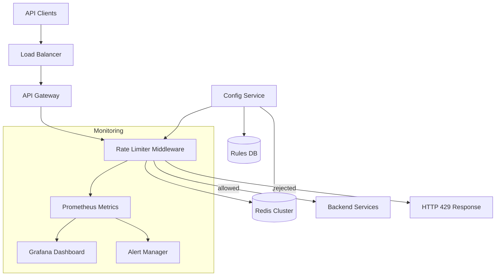
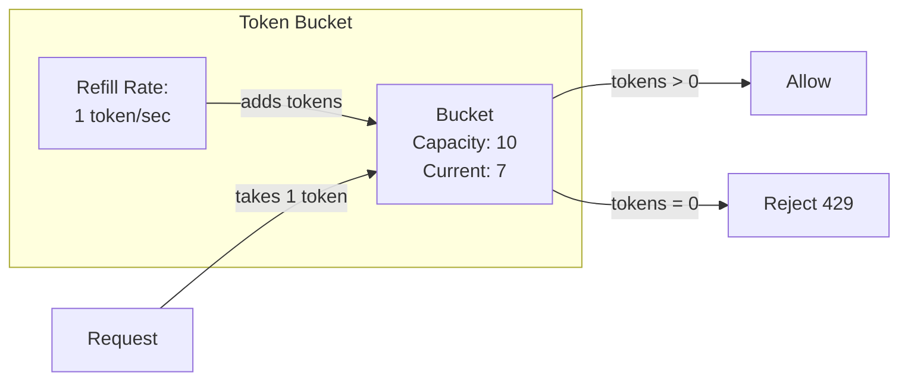
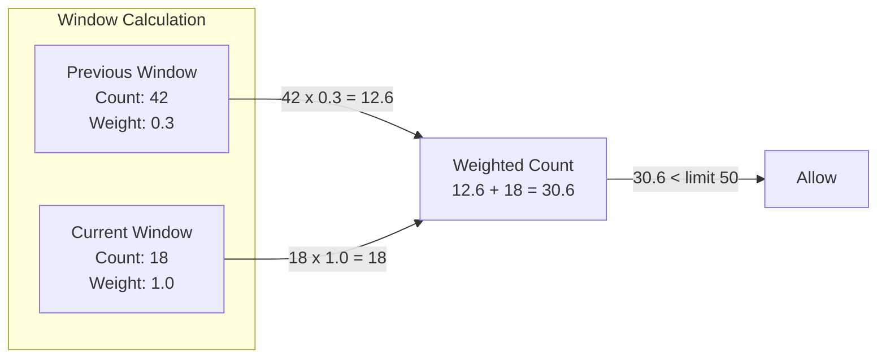
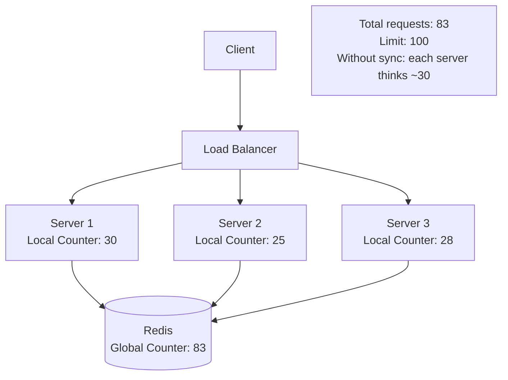

# Design a Rate Limiter

## 1. Problem Statement & Requirements

Design a rate limiter that protects APIs from abuse by controlling how many requests a client can make within a time window. Used by every major API (GitHub, Stripe, Twitter).

### Functional Requirements

| # | Requirement |
|---|-------------|
| FR-1 | Limit requests per client per time window |
| FR-2 | Support multiple rate limiting algorithms (token bucket, sliding window) |
| FR-3 | Support different limits per API endpoint and tier |
| FR-4 | Return proper HTTP 429 with rate limit headers |
| FR-5 | Distributed: consistent across multiple servers |
| FR-6 | Support both hard limits and soft limits (throttling) |
| FR-7 | Allow burst traffic within reasonable bounds |

### Non-Functional Requirements

| # | Requirement | Target |
|---|-------------|--------|
| NFR-1 | Latency overhead | < 1 ms per request |
| NFR-2 | Availability | 99.99% (fail-open if rate limiter is down) |
| NFR-3 | Accuracy | ~5% tolerance for distributed counters |
| NFR-4 | Throughput | 1 million decisions per second |
| NFR-5 | Memory efficiency | < 1 KB per client |

---

## 2. Back-of-Envelope Estimation

### Traffic

- API requests to protect: 500K QPS
- Unique clients (API keys): 1 million
- Average rules per client: 5 (different endpoints)

$$
\text{Rate limit checks/sec} = 500{,}000 \text{ QPS}
$$

### Memory (per algorithm)

**Token Bucket (per client per rule):**
- Tokens remaining: 8 bytes
- Last refill timestamp: 8 bytes
- Bucket config pointer: 8 bytes
- Total per bucket: ~24 bytes

$$
\text{Memory} = 1{,}000{,}000 \times 5 \times 24 = 120 \text{ MB}
$$

**Sliding Window Log (per client per rule):**
- Storing individual timestamps: 8 bytes each
- At 100 req/min limit: 100 timestamps
- Total per client-rule: 800 bytes

$$
\text{Memory} = 1{,}000{,}000 \times 5 \times 800 = 4 \text{ GB}
$$

**Sliding Window Counter (per client per rule):**
- Current window count: 8 bytes
- Previous window count: 8 bytes
- Window timestamps: 16 bytes
- Total per client-rule: ~32 bytes

$$
\text{Memory} = 1{,}000{,}000 \times 5 \times 32 = 160 \text{ MB}
$$

### Bandwidth

- Each rate limit check: ~50 bytes (key + metadata)
- Each response: ~20 bytes

$$
\text{Bandwidth} = 500{,}000 \times 70 = 35 \text{ MB/s}
$$

---

## 3. High-Level Design



### API Design

```typescript
// Rate Limit Configuration
interface RateLimitRule {
  id: string;
  name: string;
  key: KeyExtractor;        // How to identify the client
  algorithm: 'token_bucket' | 'sliding_window_counter'
    | 'sliding_window_log' | 'fixed_window';
  limit: number;             // Max requests
  window: number;            // Window in seconds
  burstLimit?: number;       // Max burst (token bucket)
  tier?: string;             // API tier (free, pro, enterprise)
  endpoints?: string[];      // Specific endpoints (or * for all)
}

type KeyExtractor =
  | { type: 'api_key' }
  | { type: 'ip' }
  | { type: 'user_id' }
  | { type: 'custom'; header: string };

// Response headers (RFC 6585 / draft-ietf-httpapi-ratelimit-headers)
interface RateLimitHeaders {
  'X-RateLimit-Limit': number;      // Max requests in window
  'X-RateLimit-Remaining': number;  // Remaining requests
  'X-RateLimit-Reset': number;      // Unix timestamp when window resets
  'Retry-After'?: number;           // Seconds until retry (on 429)
}

// Rate limit decision
interface RateLimitResult {
  allowed: boolean;
  limit: number;
  remaining: number;
  resetAt: number;          // Unix timestamp
  retryAfter?: number;      // Seconds
}
```

---

## 4. Database Schema

### Rate Limit Rules

```sql
CREATE TABLE rate_limit_rules (
    rule_id         UUID PRIMARY KEY,
    name            VARCHAR(100) NOT NULL,
    description     TEXT,
    algorithm       VARCHAR(30) NOT NULL,
    key_type        VARCHAR(30) NOT NULL,   -- 'api_key', 'ip', 'user_id'
    limit_count     INT NOT NULL,
    window_seconds  INT NOT NULL,
    burst_limit     INT,
    tier            VARCHAR(30),
    endpoint_pattern VARCHAR(200) DEFAULT '*',
    enabled         BOOLEAN DEFAULT TRUE,
    priority        INT DEFAULT 0,          -- Higher = checked first
    created_at      TIMESTAMPTZ DEFAULT NOW(),
    updated_at      TIMESTAMPTZ DEFAULT NOW()
);

CREATE INDEX idx_rules_tier ON rate_limit_rules(tier, enabled);
CREATE INDEX idx_rules_endpoint ON rate_limit_rules(endpoint_pattern);
```

### Client Tier Configuration

```sql
CREATE TABLE client_tiers (
    client_id       VARCHAR(128) PRIMARY KEY,  -- API key or user ID
    tier            VARCHAR(30) NOT NULL DEFAULT 'free',
    custom_limits   JSONB,                      -- Override defaults
    whitelisted     BOOLEAN DEFAULT FALSE,
    created_at      TIMESTAMPTZ DEFAULT NOW()
);
```

### Rate Limit Audit Log

```sql
CREATE TABLE rate_limit_events (
    event_id        BIGSERIAL,
    client_id       VARCHAR(128) NOT NULL,
    rule_id         UUID NOT NULL,
    endpoint        VARCHAR(200),
    action          VARCHAR(10) NOT NULL,  -- 'ALLOWED', 'REJECTED'
    current_count   INT,
    limit_count     INT,
    created_at      TIMESTAMPTZ DEFAULT NOW()
) PARTITION BY RANGE (created_at);

-- Only log rejections and sampled allows to avoid write amplification
```

---

## 5. Detailed Component Design

### 5.1 Token Bucket Algorithm

The token bucket is the most widely used algorithm because it naturally handles bursts.



```typescript
class TokenBucket {
  /**
   * Token bucket using Redis with atomic Lua script.
   * Handles refill + consume in a single round trip.
   */
  private redis: RedisCluster;

  private readonly LUA_SCRIPT = `
    local key = KEYS[1]
    local capacity = tonumber(ARGV[1])
    local refill_rate = tonumber(ARGV[2])  -- tokens per second
    local now = tonumber(ARGV[3])
    local requested = tonumber(ARGV[4])

    -- Get current state
    local data = redis.call('HMGET', key, 'tokens', 'last_refill')
    local tokens = tonumber(data[1])
    local last_refill = tonumber(data[2])

    -- Initialize if first request
    if tokens == nil then
      tokens = capacity
      last_refill = now
    end

    -- Calculate token refill
    local elapsed = now - last_refill
    local new_tokens = elapsed * refill_rate
    tokens = math.min(capacity, tokens + new_tokens)

    -- Try to consume tokens
    local allowed = 0
    local remaining = tokens
    if tokens >= requested then
      tokens = tokens - requested
      remaining = tokens
      allowed = 1
    end

    -- Save state
    redis.call('HMSET', key,
      'tokens', tostring(tokens),
      'last_refill', tostring(now))
    redis.call('EXPIRE', key, math.ceil(capacity / refill_rate) * 2)

    return {allowed, remaining, capacity}
  `;

  async consume(
    clientId: string,
    rule: RateLimitRule,
    tokens: number = 1
  ): Promise<RateLimitResult> {
    const key = `rl:tb:${clientId}:${rule.id}`;
    const capacity = rule.burstLimit ?? rule.limit;
    const refillRate = rule.limit / rule.window;
    const now = Date.now() / 1000;

    const [allowed, remaining, limit] = await this.redis.eval(
      this.LUA_SCRIPT,
      1, key,
      capacity, refillRate, now, tokens
    ) as [number, number, number];

    const resetAt = Math.ceil(
      now + (capacity - remaining) / refillRate
    );

    return {
      allowed: allowed === 1,
      limit: capacity,
      remaining: Math.floor(remaining),
      resetAt,
      retryAfter: allowed === 1
        ? undefined
        : Math.ceil(tokens / refillRate),
    };
  }
}
```

::: info Why Lua Scripts?
Redis Lua scripts execute atomically on the server, eliminating race conditions between reading the current token count and updating it. Without atomicity, two concurrent requests could both read "1 token remaining" and both be allowed.
:::

### 5.2 Sliding Window Counter Algorithm

More accurate than fixed windows, but simpler than maintaining full request logs.



```typescript
class SlidingWindowCounter {
  private redis: RedisCluster;

  private readonly LUA_SCRIPT = `
    local key_prefix = KEYS[1]
    local limit = tonumber(ARGV[1])
    local window = tonumber(ARGV[2])
    local now = tonumber(ARGV[3])

    -- Calculate current and previous window keys
    local current_window = math.floor(now / window)
    local previous_window = current_window - 1
    local current_key = key_prefix .. ':' .. current_window
    local previous_key = key_prefix .. ':' .. previous_window

    -- Get counts
    local current_count = tonumber(redis.call('GET', current_key) or 0)
    local previous_count = tonumber(redis.call('GET', previous_key) or 0)

    -- Calculate weighted count
    local elapsed_in_window = now - (current_window * window)
    local weight = 1 - (elapsed_in_window / window)
    local weighted_count = (previous_count * weight) + current_count

    -- Check if allowed
    if weighted_count >= limit then
      return {0, math.floor(weighted_count), limit,
              (current_window + 1) * window}
    end

    -- Increment current window
    redis.call('INCR', current_key)
    redis.call('EXPIRE', current_key, window * 2)

    return {1, math.floor(weighted_count), limit,
            (current_window + 1) * window}
  `;

  async check(
    clientId: string,
    rule: RateLimitRule
  ): Promise<RateLimitResult> {
    const keyPrefix = `rl:sw:${clientId}:${rule.id}`;
    const now = Date.now() / 1000;

    const [allowed, count, limit, resetAt] = await this.redis.eval(
      this.LUA_SCRIPT,
      1, keyPrefix,
      rule.limit, rule.window, now
    ) as [number, number, number, number];

    return {
      allowed: allowed === 1,
      limit,
      remaining: Math.max(0, limit - count - 1),
      resetAt,
      retryAfter: allowed === 1 ? undefined : Math.ceil(resetAt - now),
    };
  }
}
```

### 5.3 Sliding Window Log Algorithm

Most accurate but most memory-intensive. Stores every request timestamp.

```typescript
class SlidingWindowLog {
  private redis: RedisCluster;

  private readonly LUA_SCRIPT = `
    local key = KEYS[1]
    local limit = tonumber(ARGV[1])
    local window = tonumber(ARGV[2])
    local now = tonumber(ARGV[3])
    local window_start = now - window

    -- Remove expired entries
    redis.call('ZREMRANGEBYSCORE', key, '-inf', window_start)

    -- Count current entries
    local count = redis.call('ZCARD', key)

    if count >= limit then
      -- Get the oldest entry to calculate retry-after
      local oldest = redis.call('ZRANGE', key, 0, 0, 'WITHSCORES')
      local retry_after = 0
      if #oldest > 0 then
        retry_after = tonumber(oldest[2]) + window - now
      end
      return {0, count, limit, math.ceil(retry_after)}
    end

    -- Add current request
    redis.call('ZADD', key, now, now .. ':' .. math.random(1000000))
    redis.call('EXPIRE', key, window + 1)

    return {1, count, limit, 0}
  `;

  async check(
    clientId: string,
    rule: RateLimitRule
  ): Promise<RateLimitResult> {
    const key = `rl:log:${clientId}:${rule.id}`;
    const now = Date.now() / 1000;

    const [allowed, count, limit, retryAfter] = await this.redis.eval(
      this.LUA_SCRIPT,
      1, key,
      rule.limit, rule.window, now
    ) as [number, number, number, number];

    return {
      allowed: allowed === 1,
      limit,
      remaining: Math.max(0, limit - count - 1),
      resetAt: Math.ceil(now + rule.window),
      retryAfter: allowed === 1 ? undefined : Math.ceil(retryAfter),
    };
  }
}
```

### 5.4 Fixed Window Counter

Simplest algorithm, but suffers from boundary spike issues.

```typescript
class FixedWindowCounter {
  private redis: RedisCluster;

  async check(
    clientId: string,
    rule: RateLimitRule
  ): Promise<RateLimitResult> {
    const windowId = Math.floor(Date.now() / 1000 / rule.window);
    const key = `rl:fw:${clientId}:${rule.id}:${windowId}`;

    const count = await this.redis.incr(key);
    if (count === 1) {
      await this.redis.expire(key, rule.window);
    }

    const resetAt = (windowId + 1) * rule.window;
    const allowed = count <= rule.limit;

    return {
      allowed,
      limit: rule.limit,
      remaining: Math.max(0, rule.limit - count),
      resetAt,
      retryAfter: allowed ? undefined : resetAt - Math.floor(Date.now() / 1000),
    };
  }
}
```

::: warning Fixed Window Boundary Problem
A client with a 100 req/min limit can send 100 requests at 0:59 and 100 more at 1:00 -- 200 requests in 2 seconds! The sliding window algorithms solve this.
:::

### 5.5 Algorithm Comparison

| Algorithm | Accuracy | Memory | Burst Handling | Complexity |
|-----------|----------|--------|----------------|------------|
| **Fixed Window** | Low (boundary spike) | Very Low | Poor | Simple |
| **Sliding Window Log** | Exact | High (O(N) per client) | Good | Medium |
| **Sliding Window Counter** | ~99.7% accurate | Low | Good | Medium |
| **Token Bucket** | Good | Very Low | Excellent (configurable burst) | Medium |
| **Leaky Bucket** | Good | Very Low | Smooths output | Medium |

### 5.6 Rate Limiter Middleware

```typescript
class RateLimiterMiddleware {
  private algorithms: Map<string, RateLimitAlgorithm>;
  private ruleEngine: RuleEngine;
  private config: ConfigService;

  constructor() {
    this.algorithms = new Map([
      ['token_bucket', new TokenBucket()],
      ['sliding_window_counter', new SlidingWindowCounter()],
      ['sliding_window_log', new SlidingWindowLog()],
      ['fixed_window', new FixedWindowCounter()],
    ]);
  }

  async handle(
    request: IncomingRequest,
    next: () => Promise<Response>
  ): Promise<Response> {
    // 1. Extract client identity
    const clientId = this.extractClientId(request);

    // 2. Get applicable rules
    const rules = await this.ruleEngine.getApplicableRules(
      clientId, request.path, request.method
    );

    // 3. Check whitelisting
    if (await this.isWhitelisted(clientId)) {
      return next();
    }

    // 4. Apply each rule (most restrictive wins)
    let mostRestrictive: RateLimitResult | null = null;

    for (const rule of rules) {
      const algorithm = this.algorithms.get(rule.algorithm);
      if (!algorithm) continue;

      const result = await algorithm.check(clientId, rule);

      if (!result.allowed) {
        // Immediately reject on first failure
        return this.rejectResponse(result, rule);
      }

      if (!mostRestrictive || result.remaining < mostRestrictive.remaining) {
        mostRestrictive = result;
      }
    }

    // 5. All rules passed — proceed
    const response = await next();

    // 6. Add rate limit headers
    if (mostRestrictive) {
      this.addRateLimitHeaders(response, mostRestrictive);
    }

    return response;
  }

  private extractClientId(request: IncomingRequest): string {
    // Priority: API key > User ID > IP address
    if (request.headers['x-api-key']) {
      return `key:${request.headers['x-api-key']}`;
    }
    if (request.userId) {
      return `user:${request.userId}`;
    }
    return `ip:${request.ip}`;
  }

  private rejectResponse(
    result: RateLimitResult,
    rule: RateLimitRule
  ): Response {
    return {
      status: 429,
      headers: {
        'X-RateLimit-Limit': String(result.limit),
        'X-RateLimit-Remaining': '0',
        'X-RateLimit-Reset': String(result.resetAt),
        'Retry-After': String(result.retryAfter ?? 60),
        'Content-Type': 'application/json',
      },
      body: JSON.stringify({
        error: 'Too Many Requests',
        message: `Rate limit exceeded for rule: ${rule.name}`,
        retryAfter: result.retryAfter,
      }),
    };
  }

  private addRateLimitHeaders(
    response: Response,
    result: RateLimitResult
  ): void {
    response.headers['X-RateLimit-Limit'] = String(result.limit);
    response.headers['X-RateLimit-Remaining'] = String(result.remaining);
    response.headers['X-RateLimit-Reset'] = String(result.resetAt);
  }
}
```

### 5.7 Rule Engine with Tiered Limits

```typescript
class RuleEngine {
  private rulesCache: Map<string, RateLimitRule[]> = new Map();
  private clientTiers: Map<string, string> = new Map();

  private readonly DEFAULT_TIERS: Record<string, TierLimits> = {
    free: {
      global: { limit: 100, window: 60 },         // 100/min
      perEndpoint: { limit: 10, window: 60 },      // 10/min per endpoint
    },
    pro: {
      global: { limit: 1000, window: 60 },         // 1000/min
      perEndpoint: { limit: 100, window: 60 },     // 100/min per endpoint
    },
    enterprise: {
      global: { limit: 10000, window: 60 },        // 10K/min
      perEndpoint: { limit: 1000, window: 60 },    // 1K/min per endpoint
    },
  };

  async getApplicableRules(
    clientId: string,
    path: string,
    method: string
  ): Promise<RateLimitRule[]> {
    // Check cache first
    const cacheKey = `${clientId}:${path}`;
    if (this.rulesCache.has(cacheKey)) {
      return this.rulesCache.get(cacheKey)!;
    }

    const tier = this.clientTiers.get(clientId) ?? 'free';
    const tierConfig = this.DEFAULT_TIERS[tier];

    const rules: RateLimitRule[] = [
      // Global rate limit
      {
        id: `global:${tier}`,
        name: `Global ${tier} limit`,
        key: { type: 'api_key' },
        algorithm: 'token_bucket',
        limit: tierConfig.global.limit,
        window: tierConfig.global.window,
        burstLimit: tierConfig.global.limit * 2,
      },
      // Per-endpoint rate limit
      {
        id: `endpoint:${tier}:${method}:${path}`,
        name: `Endpoint ${tier} limit`,
        key: { type: 'api_key' },
        algorithm: 'sliding_window_counter',
        limit: tierConfig.perEndpoint.limit,
        window: tierConfig.perEndpoint.window,
      },
    ];

    // Check for custom overrides
    const customRules = await this.getCustomRules(clientId, path);
    if (customRules.length > 0) {
      rules.push(...customRules);
    }

    this.rulesCache.set(cacheKey, rules);
    return rules;
  }
}
```

### 5.8 Graceful Degradation

```typescript
class ResilientRateLimiter {
  private primary: RateLimiterMiddleware;
  private localFallback: LocalRateLimiter;
  private metrics: MetricsCollector;

  async check(
    clientId: string,
    rule: RateLimitRule
  ): Promise<RateLimitResult> {
    try {
      // Try distributed rate limiter (Redis)
      const result = await Promise.race([
        this.primary.check(clientId, rule),
        this.timeout(5), // 5ms timeout
      ]);
      return result;
    } catch (error) {
      this.metrics.increment('rate_limiter.fallback');

      // Fallback to local (in-memory) rate limiter
      // Less accurate but keeps working
      return this.localFallback.check(clientId, rule);
    }
  }

  private timeout(ms: number): Promise<never> {
    return new Promise((_, reject) =>
      setTimeout(() => reject(new Error('Rate limiter timeout')), ms)
    );
  }
}

class LocalRateLimiter {
  private counters: Map<string, { count: number; windowStart: number }> =
    new Map();

  check(clientId: string, rule: RateLimitRule): RateLimitResult {
    const key = `${clientId}:${rule.id}`;
    const now = Math.floor(Date.now() / 1000);
    const windowId = Math.floor(now / rule.window);

    const counter = this.counters.get(key);
    if (!counter || counter.windowStart !== windowId) {
      this.counters.set(key, { count: 1, windowStart: windowId });
      return {
        allowed: true,
        limit: rule.limit,
        remaining: rule.limit - 1,
        resetAt: (windowId + 1) * rule.window,
      };
    }

    counter.count++;
    const allowed = counter.count <= rule.limit;

    return {
      allowed,
      limit: rule.limit,
      remaining: Math.max(0, rule.limit - counter.count),
      resetAt: (windowId + 1) * rule.window,
      retryAfter: allowed
        ? undefined
        : (windowId + 1) * rule.window - now,
    };
  }
}
```

::: danger Fail-Open vs. Fail-Closed
**Fail-open** (allow all requests if rate limiter is down) risks system overload but maintains availability. **Fail-closed** (reject all requests) protects the system but causes outages. Most production systems choose **fail-open** with local fallback rate limiting.
:::

---

## 6. Scaling & Bottlenecks

### What Breaks First?

| Bottleneck | Symptom | Solution |
|-----------|---------|----------|
| Redis latency spike | Rate limit adds > 5ms latency | Local cache + async sync |
| Redis single-thread bottleneck | Can't handle 1M checks/sec | Redis Cluster sharding |
| Hot key (single API key) | One client causes contention | Client-side batching |
| Network partition | Inconsistent limits | Local fallback + eventual consistency |
| Config update propagation | Stale rules | Push-based config via pub/sub |

### Distributed Rate Limiting Challenges



#### Solution: Hybrid Local + Global

```typescript
class HybridRateLimiter {
  private localCounters: Map<string, number> = new Map();
  private redis: RedisCluster;
  private readonly SYNC_INTERVAL_MS = 1000; // Sync every second
  private readonly LOCAL_THRESHOLD = 0.1;   // 10% of limit locally

  async check(
    clientId: string,
    rule: RateLimitRule
  ): Promise<RateLimitResult> {
    const key = `${clientId}:${rule.id}`;
    const localLimit = Math.floor(rule.limit * this.LOCAL_THRESHOLD);

    // Check local counter first (no network call)
    const localCount = this.localCounters.get(key) ?? 0;
    if (localCount < localLimit) {
      this.localCounters.set(key, localCount + 1);
      return {
        allowed: true,
        limit: rule.limit,
        remaining: rule.limit - localCount - 1,
        resetAt: 0, // Approximate
      };
    }

    // Local threshold exceeded, check Redis
    return this.checkRedis(clientId, rule);
  }

  /**
   * Periodically sync local counters to Redis
   * and reset local counters.
   */
  private async syncToRedis(): Promise<void> {
    const pipeline = this.redis.multi();

    for (const [key, count] of this.localCounters) {
      pipeline.incrby(`rl:global:${key}`, count);
    }

    await pipeline.exec();
    this.localCounters.clear();
  }
}
```

### Redis Cluster Configuration

```typescript
const redisClusterConfig = {
  nodes: [
    { host: 'redis-1.example.com', port: 6379 },
    { host: 'redis-2.example.com', port: 6379 },
    { host: 'redis-3.example.com', port: 6379 },
    { host: 'redis-4.example.com', port: 6379 },
    { host: 'redis-5.example.com', port: 6379 },
    { host: 'redis-6.example.com', port: 6379 },
  ],
  options: {
    maxRedirections: 3,
    retryDelayOnFailover: 100,
    retryDelayOnClusterDown: 100,
    enableReadyCheck: true,
    scaleReads: 'slave',       // Read from replicas
  },
};
```

---

## 7. Trade-offs & Alternatives

| Decision | Option A | Option B | Our Choice |
|----------|----------|----------|------------|
| Algorithm | Token bucket | Sliding window counter | **Both** -- token bucket for APIs (burst), sliding for DDoS |
| Storage | Redis | Local memory | **Redis + local fallback** |
| Accuracy vs. Performance | Exact (log-based) | Approximate (counter) | **Approximate** -- 99.7% accurate, 100x less memory |
| Fail mode | Fail-open | Fail-closed | **Fail-open** with local limiter |
| Sync model | Synchronous (every request) | Async batch sync | **Sync** for accuracy, with local fast-path |

### Rate Limiter Placement

| Location | Pros | Cons |
|----------|------|------|
| **API Gateway** | Centralized, all traffic passes through | Single point of failure |
| **Service mesh sidecar** | Per-service control, no code changes | Complex deployment |
| **Application middleware** | Fine-grained control | Each service must implement |
| **CDN/Edge** | Blocks attacks at edge | Limited to simple rules |

::: tip Recommendation
Use **layered rate limiting**:
1. **CDN/Edge**: Block obvious DDoS (IP-based, very high thresholds)
2. **API Gateway**: Global per-client limits
3. **Service-level**: Endpoint-specific limits
:::

---

## 8. Advanced Topics

### 8.1 Rate Limiting for Microservices (Service-to-Service)

```typescript
class ServiceRateLimiter {
  /**
   * Rate limit between microservices to prevent cascade failures.
   * Uses adaptive limits based on downstream service health.
   */
  async checkServiceLimit(
    sourceService: string,
    targetService: string,
    endpoint: string
  ): Promise<RateLimitResult> {
    const healthScore = await this.getServiceHealth(targetService);

    // Adapt limits based on downstream health
    let effectiveLimit: number;
    if (healthScore > 0.9) {
      effectiveLimit = 1000; // Healthy: full throughput
    } else if (healthScore > 0.5) {
      effectiveLimit = Math.floor(1000 * healthScore); // Degraded
    } else {
      effectiveLimit = 100; // Unhealthy: minimal traffic
    }

    const rule: RateLimitRule = {
      id: `svc:${sourceService}:${targetService}:${endpoint}`,
      name: 'Service-to-service limit',
      key: { type: 'custom', header: 'x-service-name' },
      algorithm: 'token_bucket',
      limit: effectiveLimit,
      window: 60,
      burstLimit: effectiveLimit * 2,
    };

    return this.tokenBucket.consume(
      `svc:${sourceService}`, rule
    );
  }
}
```

### 8.2 Distributed Rate Limiting with Consistent Hashing

```typescript
class ConsistentHashRateLimiter {
  private ring: ConsistentHashRing;
  private nodes: RedisClient[];

  constructor(nodes: RedisClient[]) {
    this.nodes = nodes;
    this.ring = new ConsistentHashRing(
      nodes.map((_, i) => `node-${i}`),
      150 // Virtual nodes
    );
  }

  async check(
    clientId: string,
    rule: RateLimitRule
  ): Promise<RateLimitResult> {
    // Route to the correct Redis node based on client ID
    const nodeId = this.ring.getNode(clientId);
    const nodeIndex = parseInt(nodeId.split('-')[1]);
    const redis = this.nodes[nodeIndex];

    // All checks for this client go to the same node
    // No distributed coordination needed
    return this.checkOnNode(redis, clientId, rule);
  }
}
```

### 8.3 Client-Side Rate Limiting

```typescript
class ClientRateLimiter {
  private tokenBucket: {
    tokens: number;
    lastRefill: number;
    capacity: number;
    refillRate: number;
  };

  constructor(capacity: number, refillRatePerSecond: number) {
    this.tokenBucket = {
      tokens: capacity,
      lastRefill: Date.now(),
      capacity,
      refillRate: refillRatePerSecond,
    };
  }

  async request(fn: () => Promise<Response>): Promise<Response> {
    // Refill tokens
    const now = Date.now();
    const elapsed = (now - this.tokenBucket.lastRefill) / 1000;
    this.tokenBucket.tokens = Math.min(
      this.tokenBucket.capacity,
      this.tokenBucket.tokens + elapsed * this.tokenBucket.refillRate
    );
    this.tokenBucket.lastRefill = now;

    if (this.tokenBucket.tokens < 1) {
      const waitMs = (1 - this.tokenBucket.tokens) /
        this.tokenBucket.refillRate * 1000;
      await new Promise((resolve) => setTimeout(resolve, waitMs));
      return this.request(fn); // Retry after wait
    }

    this.tokenBucket.tokens -= 1;

    const response = await fn();

    // Update local state from server headers
    if (response.headers['x-ratelimit-remaining']) {
      const serverRemaining = parseInt(
        response.headers['x-ratelimit-remaining']
      );
      this.tokenBucket.tokens = Math.min(
        this.tokenBucket.tokens,
        serverRemaining
      );
    }

    return response;
  }
}
```

### 8.4 Monitoring Dashboard

Key metrics to track:

| Metric | Description | Alert Threshold |
|--------|-------------|-----------------|
| `rate_limiter.decisions.allowed` | Allowed requests/sec | N/A |
| `rate_limiter.decisions.rejected` | Rejected requests/sec | > 1% of total |
| `rate_limiter.latency.p99` | Check latency | > 5 ms |
| `rate_limiter.redis.errors` | Redis communication errors | > 0.1% |
| `rate_limiter.fallback.activations` | Local fallback used | > 0 |
| `rate_limiter.top_limited_clients` | Most throttled clients | Manual review |

---

## 9. Interview Tips

::: tip Start with One Algorithm, Then Compare
Pick **token bucket** as your default (it's what Stripe, AWS, and most APIs use), explain it well, then briefly compare with sliding window. Don't try to cover all four algorithms in depth.
:::

::: warning Common Mistakes
- Not using atomic operations (Lua scripts) in Redis -- creates race conditions
- Forgetting to handle Redis failures (fail-open vs. fail-closed)
- Not discussing how limits are configured and updated
- Ignoring the boundary problem with fixed windows
- Not mentioning HTTP 429 response headers
- Forgetting client identification (how do you know who is making the request?)
:::

::: details Sample Interview Timeline (45 min)
| Time | Phase |
|------|-------|
| 0-5 min | Requirements & clarifications |
| 5-8 min | Back-of-envelope (memory, throughput) |
| 8-15 min | High-level design + API |
| 15-25 min | Deep dive: token bucket with Redis Lua |
| 25-30 min | Compare algorithms (sliding window) |
| 30-37 min | Distributed rate limiting challenges |
| 37-42 min | Graceful degradation, fail-open |
| 42-45 min | Trade-offs |
:::

### Key Talking Points

1. **Why token bucket?** Allows controlled bursts (real traffic is bursty), simple to implement, low memory footprint.
2. **Why Redis Lua?** Atomicity without distributed locks. The entire check-and-update happens in one round trip.
3. **What about accuracy?** Sliding window counter is ~99.7% accurate. The small inaccuracy is worth the memory savings (32 bytes vs. 800 bytes per client-rule).
4. **What if Redis goes down?** Fail-open with local in-memory rate limiting. Slightly less accurate but the API stays up.
5. **How to handle configuration changes?** Push updates via Redis pub/sub. Each server subscribes to a config channel and updates its local rule cache.
