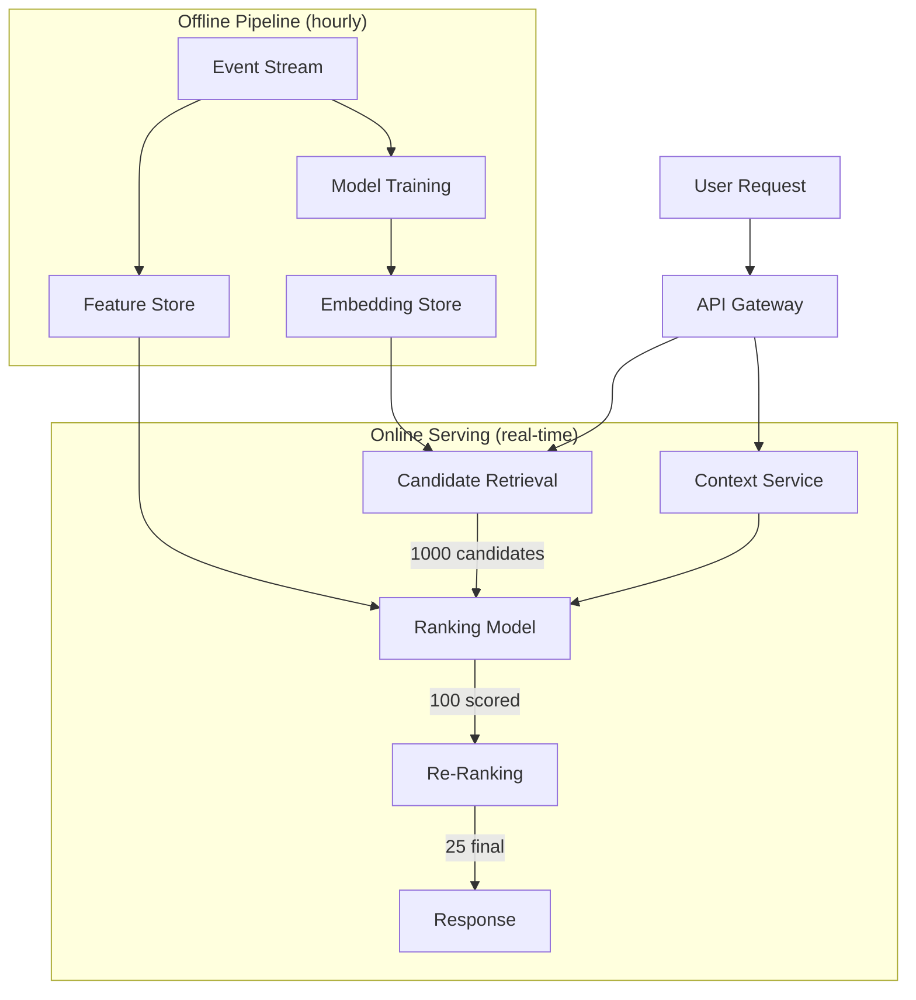

# Design Recommendation Engine

A personalized recommendation system that suggests relevant content (movies, songs, products, posts) to users based on their behavior, preferences, and similar users' patterns.

## 1. Requirements Clarification

### Functional Requirements
- Personalized recommendations on homepage (top picks for you)
- "Because you watched X" — explainable recommendations
- Similar items (more like this)
- Trending / popular in your region
- Re-ranking based on real-time signals (time of day, device)

### Non-Functional Requirements
- **Latency**: < 200ms for pre-computed, < 500ms for real-time re-ranking
- **Freshness**: New content surfaced within 1 hour
- **Scale**: 200M users, 500K items catalog
- **Diversity**: Avoid filter bubbles, ensure serendipity

## 2. Back-of-the-Envelope Estimation

- **DAU**: 50M users
- **Recommendation requests/day**: 50M × 10 sessions = 500M
- **QPS**: 500M / 86,400 ≈ **5,800 QPS** (peak: ~15K QPS)
- **Item catalog**: 500K items, each with 1KB metadata = 500MB
- **User embeddings**: 200M × 256 floats × 4 bytes = **200GB**
- **Item embeddings**: 500K × 256 floats × 4 bytes = **500MB**
- **Interaction events**: 50M users × 20 events/day = 1B events/day

## 3. High-Level Design



## 4. Detailed Design

### Two-Stage Architecture

Every recommendation system at scale uses the same pattern:

**Stage 1: Candidate Retrieval** — Cast a wide net, get ~1000 candidates from millions
**Stage 2: Ranking** — Score those 1000 candidates, return top 25

::: tip Why two stages?
Scoring every item against every user is $O(M \times N)$ — 200M × 500K = 100 trillion operations. Impossible in real-time. Retrieval narrows the field cheaply.
:::

### Stage 1: Candidate Retrieval

Multiple retrieval paths run in parallel:

```python
async def retrieve_candidates(user_id: str, context: dict) -> list[Item]:
    # Run all retrievers in parallel
    results = await asyncio.gather(
        collaborative_filtering(user_id),      # ~300 candidates
        content_based(user_id),                 # ~200 candidates
        trending_in_region(context["region"]),   # ~100 candidates
        recently_popular(context["time"]),       # ~100 candidates
        editorial_picks(),                       # ~50 candidates
        explore_random(),                        # ~50 candidates (diversity)
    )

    # Merge, deduplicate, apply business rules
    candidates = deduplicate(flatten(results))
    candidates = apply_filters(candidates, user_id)  # Already watched, age-restricted

    return candidates[:1000]
```

#### Collaborative Filtering (ALS)

"Users who liked X also liked Y":

$$
\hat{r}_{ui} = \mathbf{p}_u^T \cdot \mathbf{q}_i
$$

Where $\mathbf{p}_u$ is user embedding, $\mathbf{q}_i$ is item embedding (both 256-dim vectors).

**Retrieval**: Find items with highest dot product to user embedding → **Approximate Nearest Neighbor (ANN)** search using HNSW index.

#### Content-Based Filtering

"Because you liked action movies with sci-fi elements":

```python
def content_based_retrieve(user_id: str) -> list[Item]:
    # Build user taste profile from watch history
    watched = get_watch_history(user_id, limit=100)

    # Average item embeddings weighted by engagement
    user_taste = weighted_average([
        item.content_embedding * engagement_weight(item)
        for item in watched
    ])

    # ANN search in content embedding space
    return ann_index.search(user_taste, k=200)
```

### Stage 2: Ranking Model

Score each candidate with a feature-rich model:

```python
class RankingFeatures:
    # User features
    user_embedding: list[float]       # 256-dim
    watch_history_genres: dict        # Genre distribution
    avg_session_length: float
    subscription_tier: str

    # Item features
    item_embedding: list[float]       # 256-dim
    release_date: datetime
    avg_rating: float
    popularity_score: float
    content_tags: list[str]

    # Cross features (user × item)
    user_item_dot_product: float
    genre_match_score: float

    # Context features
    time_of_day: int                  # Morning vs evening preferences
    device: str                       # Phone vs TV
    day_of_week: int                  # Weekend vs weekday
```

**Model**: Gradient boosted trees (XGBoost/LightGBM) or two-tower neural network.

**Training objective**: Predict engagement (watch time, completion rate) not just clicks.

### Cold Start Problem

| Scenario | Strategy |
|----------|----------|
| New user, no history | Onboarding quiz → content-based, trending, editorial |
| New user, some history | Collaborative filtering kicks in after ~10 interactions |
| New item, no engagement | Content-based features, boost new content, random exploration |
| New item + new user | Popular items, editorial picks |

### Diversity & Serendipity

Avoid the filter bubble:

```python
def diversify(ranked_items: list[Item], k: int = 25) -> list[Item]:
    """MMR (Maximal Marginal Relevance) diversification"""
    selected = [ranked_items[0]]
    remaining = ranked_items[1:]

    while len(selected) < k and remaining:
        best_score = -1
        best_item = None

        for item in remaining:
            relevance = item.score
            redundancy = max(
                cosine_similarity(item.embedding, s.embedding)
                for s in selected
            )
            # Lambda controls relevance vs diversity trade-off
            mmr_score = 0.7 * relevance - 0.3 * redundancy

            if mmr_score > best_score:
                best_score = mmr_score
                best_item = item

        selected.append(best_item)
        remaining.remove(best_item)

    return selected
```

## 5. Data Model

```sql
-- User interactions (event stream → feature store)
CREATE TABLE user_events (
    user_id UUID,
    item_id UUID,
    event_type ENUM('view', 'click', 'watch', 'complete', 'skip', 'rate'),
    watch_duration_seconds INT,
    rating FLOAT,
    timestamp TIMESTAMP,
    device STRING,
    region STRING
);

-- Pre-computed recommendations (refreshed hourly)
CREATE TABLE user_recommendations (
    user_id UUID,
    recommendations JSON,  -- [{item_id, score, reason}]
    generated_at TIMESTAMP,
    model_version STRING
);

-- Item metadata
CREATE TABLE items (
    item_id UUID,
    title STRING,
    genres ARRAY<STRING>,
    tags ARRAY<STRING>,
    release_date DATE,
    content_embedding ARRAY<FLOAT>,  -- 256-dim
    popularity_score FLOAT,
    avg_rating FLOAT
);
```

## 6. API Design

```
GET /v1/recommendations?user_id=123&count=25&context=homepage

Response:
{
  "recommendations": [
    {
      "item_id": "movie_456",
      "score": 0.94,
      "reason": "Because you watched Inception",
      "row": "Top Picks for You"
    },
    {
      "item_id": "movie_789",
      "score": 0.91,
      "reason": "Trending in your region",
      "row": "Trending Now"
    }
  ],
  "model_version": "v3.2.1",
  "generated_in_ms": 142
}
```

## 7. Scaling

### Offline Pipeline
- **Spark** for feature computation (hourly)
- **Model training**: GPU cluster, retrain daily on latest data
- **Embedding generation**: Batch compute, store in Redis/Milvus
- **Pre-computation**: Top 100 recommendations per user stored in Redis

### Online Serving
- **ANN index**: Milvus/Pinecone for embedding search
- **Feature store**: Redis for real-time features, Feast for batch
- **Model serving**: TorchServe / Triton for ranking model
- **Caching**: Pre-computed recommendations for 90% of users, real-time for power users

### Multi-Region
- Embeddings replicated to each region
- Regional trending computed locally
- Model served at edge for low latency

## 8. Trade-offs

| Decision | Choice | Alternative | Why |
|----------|--------|-------------|-----|
| Two-stage | Retrieval + Ranking | Single model | Scale — can't score 500K items per request |
| Pre-compute | Hourly batch | Real-time only | 90% users don't need real-time recs |
| Diversity | MMR re-ranking | None | Avoids filter bubble, increases discovery |
| Explainability | "Because you watched X" | Black box | User trust, engagement |

## 9. Common Interview Questions

1. **How do you handle the cold start problem?** → Onboarding, content-based, popularity, exploration slots
2. **How do you measure recommendation quality?** → A/B test: CTR, watch time, retention, diversity metrics
3. **How do you avoid filter bubbles?** → MMR diversification, exploration slots, editorial injection
4. **Real-time vs batch?** → Hybrid: batch for most users, real-time re-ranking for context (device, time)
5. **How do you handle position bias?** → Train on randomized data, use inverse propensity weighting

## Further Reading

- [Vector Databases](/ai-ml-engineering/vector-databases)
- [Embeddings & Semantic Search](/ai-ml-engineering/embeddings)
- [ML Pipelines & MLOps](/ai-ml-engineering/ml-pipelines)
- [A/B Testing](/production-blueprints/ab-testing/)
