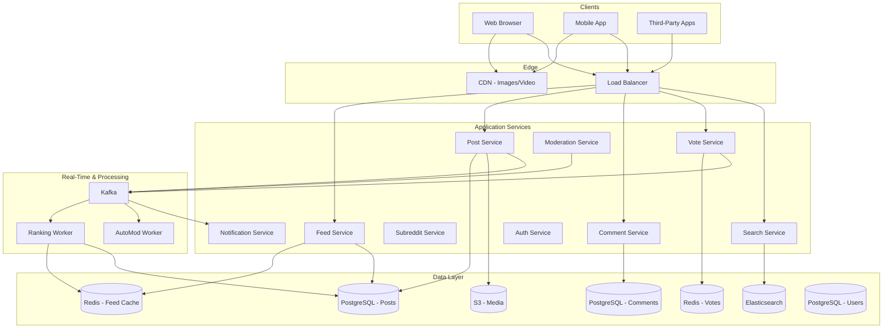
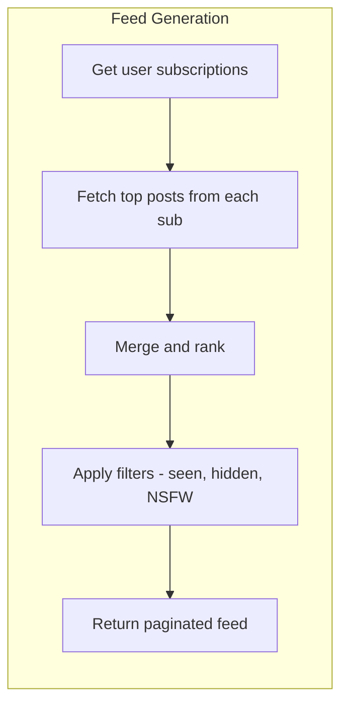
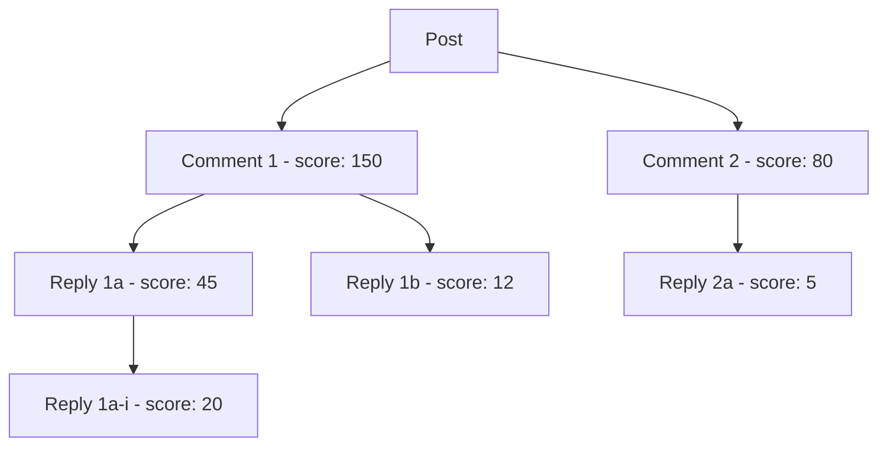
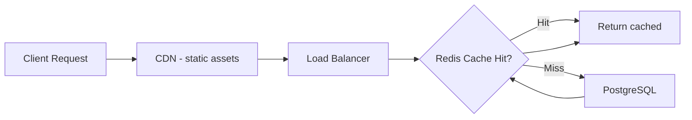

# Design Reddit

Reddit is one of the largest community-driven content platforms. Designing it covers subreddit management, posts with upvote/downvote ranking, nested comment trees, personalized home feed construction, trending/hot algorithms, content moderation, and high-volume read caching for viral content.

---

## 1. Requirements Clarification

### Functional Requirements

1. **Subreddits** — Create and manage communities with rules, moderators, and themes
2. **Posts** — Submit text, link, image, video, and poll posts to subreddits
3. **Comments** — Nested/threaded comments on posts
4. **Voting** — Upvote/downvote posts and comments with aggregated scores
5. **Home feed** — Personalized feed from subscribed subreddits, ranked by relevance
6. **r/all & r/popular** — Global aggregated feeds
7. **Search** — Search posts, comments, subreddits, and users
8. **Awards** — Give awards to posts and comments
9. **Moderation** — Moderator tools (remove, lock, pin, ban, automod rules)
10. **Notifications** — Replies, mentions, upvote milestones

### Non-Functional Requirements

1. **High availability** — 99.99% uptime for feed and post viewing
2. **Low latency** — Feed loads < 500ms, comment trees < 300ms
3. **Scale** — 1.5B monthly visitors, 50M DAU, 100K posts/day, 2M comments/day
4. **Read-heavy** — Read:write ratio of ~100:1
5. **Eventual consistency** — Vote counts can lag by a few seconds
6. **Content safety** — Automated and manual moderation at scale

### Clarifying Questions

::: tip Questions to Ask
- How deep can comment nesting go?
- Do we need to support real-time vote count updates?
- What ranking algorithms should we use (hot, top, new, controversial)?
- Should we support cross-posting between subreddits?
- Do we need to handle bots and vote manipulation detection?
- What is the expected size of the largest subreddits?
:::

---

## 2. Back-of-the-Envelope Estimation

### Traffic

- 50M DAU, each views ~30 pages, each page loads ~25 posts
- 100K new posts/day, 2M new comments/day

$$
\text{Feed Read QPS} = \frac{50M \times 30}{86400} \approx 17{,}361 \text{ QPS}
$$

$$
\text{Peak Feed QPS} \approx 17{,}361 \times 3 = 52{,}083 \text{ QPS}
$$

$$
\text{Post Write QPS} = \frac{100K}{86400} \approx 1.2 \text{ QPS}
$$

$$
\text{Comment Write QPS} = \frac{2M}{86400} \approx 23 \text{ QPS}
$$

$$
\text{Vote QPS} = \frac{50M \times 10}{86400} \approx 5{,}787 \text{ QPS}
$$

$$
\text{Peak Vote QPS} \approx 5{,}787 \times 5 = 28{,}935 \text{ QPS}
$$

### Storage

**Posts:**

$$
\text{Post size} \approx 5 \text{ KB (text)} + 500 \text{ B (metadata)} = 5.5 \text{ KB}
$$

$$
\text{Daily post storage} = 100K \times 5.5 \text{ KB} = 550 \text{ MB/day}
$$

**Comments:**

$$
\text{Comment size} \approx 500 \text{ B (text)} + 200 \text{ B (metadata)} = 700 \text{ B}
$$

$$
\text{Daily comment storage} = 2M \times 700 \text{ B} = 1.4 \text{ GB/day}
$$

**Media (images, videos):**
- 20% of posts have images (~200 KB avg), 5% have video (~5 MB avg)

$$
\text{Daily media} = 100K \times 0.2 \times 200\text{KB} + 100K \times 0.05 \times 5\text{MB} = 4\text{GB} + 25\text{GB} = 29 \text{ GB/day}
$$

**Votes:**

$$
\text{Daily votes} = 50M \times 10 \times 16 \text{ B} = 8 \text{ GB/day}
$$

### Bandwidth

$$
\text{Egress} = 52K \text{ QPS} \times 50 \text{ KB avg page} = 2.6 \text{ GB/s} = 20.8 \text{ Gbps}
$$

---

## 3. High-Level Design



---

## 4. Detailed Design

### 4.1 Feed Generation & Ranking

Reddit's home feed combines posts from the user's subscribed subreddits, ranked by a scoring algorithm.



```typescript
class FeedService {
  async getHomeFeed(userId: string, cursor: string | null, limit: number = 25): Promise<FeedPage> {
    // 1. Check cache first
    const cacheKey = `feed:${userId}:${cursor || 'first'}`;
    const cached = await this.redis.get(cacheKey);
    if (cached) return JSON.parse(cached);

    // 2. Get user's subscribed subreddits
    const subs = await this.userService.getSubscriptions(userId);
    const subIds = subs.map(s => s.id);

    // 3. Fetch candidate posts (last 48 hours, sorted by hot score)
    const candidates = await this.postDB.query(`
      SELECT p.*, s.name as subreddit_name, s.icon_url,
             u.username as author_name
      FROM posts p
      JOIN subreddits s ON p.subreddit_id = s.id
      JOIN users u ON p.author_id = u.id
      WHERE p.subreddit_id = ANY($1)
        AND p.created_at > NOW() - INTERVAL '48 hours'
        AND p.is_removed = false
      ORDER BY p.hot_score DESC
      LIMIT 500
    `, [subIds]);

    // 4. Apply personalization and diversity
    let feed = this.diversify(candidates, subIds);

    // 5. Filter out posts user has already seen/hidden
    const seenPosts = await this.redis.smembers(`seen:${userId}`);
    feed = feed.filter(p => !seenPosts.has(p.id));

    // 6. Paginate
    const page = feed.slice(0, limit);

    // 7. Cache for 60 seconds
    const result = {
      posts: page,
      cursor: page.length > 0 ? page[page.length - 1].id : null,
    };
    await this.redis.setex(cacheKey, 60, JSON.stringify(result));

    return result;
  }

  private diversify(posts: Post[], subIds: string[]): Post[] {
    // Ensure no single subreddit dominates the feed
    // Max 3 consecutive posts from the same subreddit
    const result: Post[] = [];
    const subCounts: Map<string, number> = new Map();

    for (const post of posts) {
      const count = subCounts.get(post.subreddit_id) || 0;
      if (count < 3) {
        result.push(post);
        subCounts.set(post.subreddit_id, count + 1);
      }
    }

    return result;
  }
}
```

### 4.2 Ranking Algorithms

**Hot Ranking (Reddit's classic algorithm):**

$$
\text{hot\_score} = \log_{10}(\max(|s|, 1)) + \frac{\text{sign}(s) \cdot t}{45000}
$$

Where $s$ = score (upvotes - downvotes) and $t$ = seconds since Reddit epoch (Dec 8, 2005).

```typescript
class RankingService {
  calculateHotScore(ups: number, downs: number, createdAt: Date): number {
    const score = ups - downs;
    const order = Math.log10(Math.max(Math.abs(score), 1));
    const sign = score > 0 ? 1 : score < 0 ? -1 : 0;

    // Seconds since Reddit epoch
    const REDDIT_EPOCH = new Date('2005-12-08T07:46:43Z').getTime() / 1000;
    const seconds = createdAt.getTime() / 1000 - REDDIT_EPOCH;

    return order + (sign * seconds) / 45000;
  }

  calculateControversialScore(ups: number, downs: number): number {
    // Controversial = high activity but balanced votes
    if (ups <= 0 || downs <= 0) return 0;
    const magnitude = ups + downs;
    const balance = Math.min(ups, downs) / Math.max(ups, downs);
    return magnitude * balance;
  }

  calculateWilsonScore(ups: number, downs: number): number {
    // "Best" ranking: Wilson score confidence interval (lower bound)
    // Better for comments — accounts for sample size
    const n = ups + downs;
    if (n === 0) return 0;

    const z = 1.96; // 95% confidence
    const p = ups / n;

    return (
      (p + (z * z) / (2 * n) - z * Math.sqrt((p * (1 - p) + (z * z) / (4 * n)) / n)) /
      (1 + (z * z) / n)
    );
  }
}
```

::: tip Wilson Score for Comments
Reddit uses the Wilson score confidence interval for "Best" comment sorting. Unlike simple up/down ratios, it accounts for sample size — a comment with 1 upvote and 0 downvotes (100%) won't rank above one with 100 upvotes and 1 downvote (99%). The lower bound of the confidence interval provides a statistically sound ranking.
:::

### 4.3 Voting System

```typescript
class VoteService {
  async vote(userId: string, targetId: string, targetType: 'post' | 'comment', direction: 1 | -1 | 0): Promise<void> {
    // 1. Get existing vote (if any)
    const existingVote = await this.redis.hget(`votes:${targetType}:${targetId}`, userId);
    const previousDirection = existingVote ? parseInt(existingVote) : 0;

    if (previousDirection === direction) return; // No change

    // 2. Update vote in Redis
    if (direction === 0) {
      await this.redis.hdel(`votes:${targetType}:${targetId}`, userId);
    } else {
      await this.redis.hset(`votes:${targetType}:${targetId}`, userId, direction.toString());
    }

    // 3. Update score atomically
    const scoreDelta = direction - previousDirection;
    await this.redis.hincrby(`scores:${targetType}`, targetId, scoreDelta);

    // 4. Publish vote event for ranking recalculation
    await this.kafka.send('votes', {
      key: targetId,
      value: {
        targetId,
        targetType,
        userId,
        direction,
        previousDirection,
        scoreDelta,
        timestamp: Date.now(),
      },
    });
  }

  async getScore(targetId: string, targetType: 'post' | 'comment'): Promise<number> {
    const score = await this.redis.hget(`scores:${targetType}`, targetId);
    return parseInt(score || '0');
  }

  async getUserVote(userId: string, targetIds: string[], targetType: 'post' | 'comment'): Promise<Map<string, number>> {
    // Batch fetch user's votes for a page of posts/comments
    const result = new Map<string, number>();
    const pipeline = this.redis.pipeline();

    for (const id of targetIds) {
      pipeline.hget(`votes:${targetType}:${id}`, userId);
    }

    const votes = await pipeline.exec();
    targetIds.forEach((id, i) => {
      result.set(id, votes[i] ? parseInt(votes[i] as string) : 0);
    });

    return result;
  }
}
```

### 4.4 Comment Tree



```typescript
class CommentService {
  async getCommentTree(postId: string, sort: 'best' | 'top' | 'new' | 'controversial', limit: number = 200): Promise<CommentTree> {
    // 1. Fetch top-level comments
    const orderBy = this.getSortOrder(sort);
    const topLevel = await this.db.query(`
      SELECT c.*, u.username as author_name,
             COALESCE(s.score, 0) as score
      FROM comments c
      JOIN users u ON c.author_id = u.id
      LEFT JOIN comment_scores s ON c.id = s.comment_id
      WHERE c.post_id = $1 AND c.parent_id IS NULL AND c.is_removed = false
      ORDER BY ${orderBy}
      LIMIT $2
    `, [postId, limit]);

    // 2. Fetch replies (2 levels deep by default, "load more" for deeper)
    const topLevelIds = topLevel.map(c => c.id);
    const replies = await this.db.query(`
      WITH RECURSIVE comment_tree AS (
        SELECT *, 1 as depth FROM comments
        WHERE parent_id = ANY($1) AND is_removed = false
        UNION ALL
        SELECT c.*, ct.depth + 1 FROM comments c
        JOIN comment_tree ct ON c.parent_id = ct.id
        WHERE ct.depth < 3 AND c.is_removed = false
      )
      SELECT ct.*, u.username as author_name,
             COALESCE(s.score, 0) as score
      FROM comment_tree ct
      JOIN users u ON ct.author_id = u.id
      LEFT JOIN comment_scores s ON ct.id = s.comment_id
      ORDER BY ct.depth, ${orderBy}
    `, [topLevelIds]);

    // 3. Build tree structure
    return this.buildTree(topLevel, replies);
  }

  private buildTree(topLevel: Comment[], replies: Comment[]): CommentTree {
    const nodeMap = new Map<string, CommentNode>();

    // Create nodes for top-level comments
    for (const comment of topLevel) {
      nodeMap.set(comment.id, { ...comment, children: [] });
    }

    // Add replies as children
    for (const reply of replies) {
      const node: CommentNode = { ...reply, children: [] };
      nodeMap.set(reply.id, node);

      const parent = nodeMap.get(reply.parent_id);
      if (parent) {
        parent.children.push(node);
      }
    }

    return {
      comments: topLevel.map(c => nodeMap.get(c.id)!),
      totalCount: topLevel.length + replies.length,
    };
  }
}
```

### 4.5 Content Moderation

```typescript
class ModerationService {
  async onNewPost(post: Post): Promise<ModerationResult> {
    // 1. AutoMod rules check (regex-based, per subreddit)
    const subRules = await this.getSubredditRules(post.subreddit_id);
    const autoModResult = this.applyAutoModRules(post, subRules);
    if (autoModResult.action === 'remove') {
      await this.removePost(post.id, 'automod', autoModResult.reason);
      return autoModResult;
    }

    // 2. Spam detection (ML model)
    const spamScore = await this.spamDetector.score(post);
    if (spamScore > 0.95) {
      await this.removePost(post.id, 'spam_filter');
      return { action: 'remove', reason: 'spam' };
    }
    if (spamScore > 0.7) {
      await this.queueForReview(post.id, 'potential_spam');
    }

    // 3. NSFW detection (image/video posts)
    if (post.media_url) {
      const nsfwScore = await this.nsfwDetector.classify(post.media_url);
      if (nsfwScore > 0.9) {
        await this.markNSFW(post.id);
      }
    }

    // 4. Toxicity analysis (text)
    const toxicity = await this.toxicityModel.analyze(post.title + ' ' + post.body);
    if (toxicity.severe > 0.8) {
      await this.queueForReview(post.id, 'toxic_content');
    }

    return { action: 'approve' };
  }
}
```

---

## 5. Data Model

### PostgreSQL Schema

```sql
-- Subreddits
CREATE TABLE subreddits (
    id              BIGSERIAL PRIMARY KEY,
    name            VARCHAR(21) UNIQUE NOT NULL,   -- r/name, max 21 chars
    title           VARCHAR(100),
    description     TEXT,
    sidebar_md      TEXT,
    icon_url        VARCHAR(500),
    banner_url      VARCHAR(500),
    type            VARCHAR(20) DEFAULT 'public',  -- public, private, restricted
    subscriber_count BIGINT DEFAULT 0,
    is_nsfw         BOOLEAN DEFAULT FALSE,
    created_by      BIGINT NOT NULL,
    created_at      TIMESTAMP WITH TIME ZONE DEFAULT NOW()
);

-- Posts
CREATE TABLE posts (
    id              BIGSERIAL PRIMARY KEY,
    subreddit_id    BIGINT NOT NULL,
    author_id       BIGINT NOT NULL,
    title           VARCHAR(300) NOT NULL,
    body            TEXT,
    url             VARCHAR(2000),
    media_url       VARCHAR(500),
    post_type       VARCHAR(20) NOT NULL,          -- text, link, image, video, poll
    hot_score       DOUBLE PRECISION DEFAULT 0,
    score           INT DEFAULT 0,
    comment_count   INT DEFAULT 0,
    is_nsfw         BOOLEAN DEFAULT FALSE,
    is_spoiler      BOOLEAN DEFAULT FALSE,
    is_locked       BOOLEAN DEFAULT FALSE,
    is_pinned       BOOLEAN DEFAULT FALSE,
    is_removed      BOOLEAN DEFAULT FALSE,
    removed_reason  VARCHAR(100),
    created_at      TIMESTAMP WITH TIME ZONE DEFAULT NOW(),
    edited_at       TIMESTAMP WITH TIME ZONE
);

CREATE INDEX idx_posts_subreddit_hot ON posts(subreddit_id, hot_score DESC)
    WHERE is_removed = false;
CREATE INDEX idx_posts_subreddit_new ON posts(subreddit_id, created_at DESC)
    WHERE is_removed = false;
CREATE INDEX idx_posts_subreddit_top ON posts(subreddit_id, score DESC)
    WHERE is_removed = false;
CREATE INDEX idx_posts_author ON posts(author_id, created_at DESC);
CREATE INDEX idx_posts_hot_global ON posts(hot_score DESC)
    WHERE is_removed = false AND is_nsfw = false;

-- Comments
CREATE TABLE comments (
    id              BIGSERIAL PRIMARY KEY,
    post_id         BIGINT NOT NULL,
    parent_id       BIGINT,                        -- NULL for top-level
    author_id       BIGINT NOT NULL,
    body            TEXT NOT NULL,
    score           INT DEFAULT 0,
    reply_count     INT DEFAULT 0,
    depth           INT DEFAULT 0,
    is_removed      BOOLEAN DEFAULT FALSE,
    created_at      TIMESTAMP WITH TIME ZONE DEFAULT NOW(),
    edited_at       TIMESTAMP WITH TIME ZONE
);

CREATE INDEX idx_comments_post ON comments(post_id, score DESC)
    WHERE is_removed = false AND parent_id IS NULL;
CREATE INDEX idx_comments_parent ON comments(parent_id, score DESC)
    WHERE is_removed = false;

-- User Subscriptions
CREATE TABLE subscriptions (
    user_id         BIGINT NOT NULL,
    subreddit_id    BIGINT NOT NULL,
    created_at      TIMESTAMP WITH TIME ZONE DEFAULT NOW(),
    PRIMARY KEY (user_id, subreddit_id)
);

CREATE INDEX idx_subs_subreddit ON subscriptions(subreddit_id);

-- Moderators
CREATE TABLE moderators (
    subreddit_id    BIGINT NOT NULL,
    user_id         BIGINT NOT NULL,
    permissions     TEXT[],                         -- {'all', 'posts', 'comments', 'config', 'flair'}
    added_at        TIMESTAMP WITH TIME ZONE DEFAULT NOW(),
    PRIMARY KEY (subreddit_id, user_id)
);
```

### Redis Data Structures

```
# Vote tracking (per post/comment)
Key: votes:post:{postId}
Type: Hash { userId -> direction (1 or -1) }

# Aggregated scores
Key: scores:post
Type: Hash { postId -> score }

Key: scores:comment
Type: Hash { commentId -> score }

# Feed cache (per user)
Key: feed:{userId}:{cursor}
Type: String (JSON serialized feed page, TTL 60s)

# Subreddit hot posts cache
Key: sub:{subId}:hot
Type: Sorted Set { postId -> hotScore }

# Global r/all feed
Key: feed:all
Type: Sorted Set { postId -> hotScore }

# User's seen posts (for deduplication)
Key: seen:{userId}
Type: Set { postId1, postId2, ... } (TTL 7 days)
```

---

## 6. API Design

```typescript
// Feed endpoints
// GET /api/v1/feed?sort=hot&cursor=abc&limit=25
// GET /api/v1/r/:subreddit?sort=hot|new|top|controversial&t=hour|day|week|month|year|all
// GET /api/v1/r/all?sort=hot&cursor=abc
// GET /api/v1/r/popular?sort=hot&cursor=abc

interface FeedResponse {
  posts: PostSummary[];
  cursor: string | null;
}

// Post endpoints
// POST /api/v1/r/:subreddit/posts
interface CreatePostRequest {
  title: string;
  type: 'text' | 'link' | 'image' | 'video' | 'poll';
  body?: string;
  url?: string;
  media?: File;
  nsfw: boolean;
  spoiler: boolean;
}

// GET /api/v1/r/:subreddit/posts/:id
// GET /api/v1/r/:subreddit/posts/:id/comments?sort=best&limit=200

// Comment endpoints
// POST /api/v1/r/:subreddit/posts/:id/comments
interface CreateCommentRequest {
  body: string;
  parentId?: string;  // null for top-level
}

// Vote
// POST /api/v1/vote
interface VoteRequest {
  targetId: string;
  targetType: 'post' | 'comment';
  direction: 1 | -1 | 0;  // upvote, downvote, unvote
}

// Search
// GET /api/v1/search?q=query&type=posts|comments|subreddits&sort=relevance|top|new
// GET /api/v1/r/:subreddit/search?q=query

// Moderation
// POST /api/v1/r/:subreddit/moderation/remove
// POST /api/v1/r/:subreddit/moderation/approve
// POST /api/v1/r/:subreddit/moderation/lock
```

---

## 7. Scaling

### Caching Strategy (Critical for Reddit's Read-Heavy Workload)



| What to Cache | TTL | Invalidation |
|---------------|-----|--------------|
| Hot feed per subreddit | 30s | Rank recalculation worker |
| Post data (title, body, score) | 5 min | On vote/edit |
| Comment tree (top 200) | 2 min | On new comment |
| User's subscriptions | 10 min | On subscribe/unsubscribe |
| r/all global feed | 15s | Continuous ranking worker |

### Database Scaling

```
Posts table:     Shard by subreddit_id (co-locate subreddit content)
Comments table:  Shard by post_id (co-locate comment tree)
Votes:           Stored in Redis cluster (not in PostgreSQL for hot path)
                 Periodically flushed to PostgreSQL for persistence

Read replicas: 4 per shard (100:1 read:write ratio)
```

### Handling Viral Posts

When a post hits r/all and gets millions of views:

1. **Cache aggressively** — Post data and comment tree cached in Redis with short TTL
2. **Vote batching** — Aggregate votes in Redis, flush to DB every 5 seconds
3. **Score approximation** — Display approximate scores ("~15.2K" not "15,247")
4. **CDN for media** — Images and video thumbnails served from CDN edge
5. **Rate limit comments** — Slow-mode for overwhelmed threads

::: warning Thundering Herd Problem
When a cached feed page expires and hundreds of requests hit the database simultaneously, use a lock-and-refresh pattern: the first request to find the cache empty acquires a lock, fetches from DB, and repopulates the cache. Other requests wait briefly or get a slightly stale version.
:::

---

## 8. Trade-offs & Alternatives

### Feed Generation: Precomputed vs On-Demand

| Approach | Latency | Freshness | Storage | Complexity |
|----------|---------|-----------|---------|------------|
| Precomputed (fan-out on write) | Very fast reads | Slightly stale | High (N feeds per post) | High |
| On-demand (fan-out on read) | Slower reads | Always fresh | Low | Medium |
| **Hybrid (Reddit's approach)** | Fast (cached) | 30s-2min lag | Medium | Medium |

**Decision:** Compute feeds on-demand but cache aggressively. A background worker continuously recalculates hot scores and populates subreddit-level sorted sets in Redis. User feeds are composed at read time by merging from subscribed subreddits' pre-ranked sets.

### Vote Storage: Redis vs Database

| Aspect | Redis (chosen for hot path) | PostgreSQL |
|--------|----------------------------|------------|
| Read latency | < 1ms | ~5ms |
| Write throughput | 100K+ ops/sec | ~10K ops/sec |
| Durability | At-risk (AOF/RDB) | ACID |
| Cost | Expensive (RAM) | Cheaper (SSD) |
| **Strategy** | Real-time voting | Periodic persistence backup |

### Comment Storage: Adjacency List vs Materialized Path

| Approach | Tree fetch | Insert | Deep nesting | Move/reparent |
|----------|-----------|--------|-------------|---------------|
| Adjacency list (chosen) | Recursive CTE | O(1) | Good | Easy |
| Materialized path | Single query | O(1) | Path string grows | Expensive |
| Nested set | Single query | Expensive | Good | Very expensive |
| Closure table | Join query | O(depth) | Good | Medium |

---

## 9. Common Interview Questions

::: details "How does Reddit's hot ranking algorithm work?"
The hot score combines logarithmic vote magnitude with a time decay. Higher-scored posts get a boost, but newer posts with fewer votes can overtake older popular posts because the time component is linear while the vote component is logarithmic. A post with 10 votes right now ranks higher than a post with 100 votes from yesterday. The key insight is using log scale for votes — going from 1 to 10 votes has the same effect as going from 10 to 100.
:::

::: details "How do you handle vote manipulation (brigading, bots)?"
Multiple layers: (1) Rate limiting — max votes per user per time window. (2) Vote fuzzing — display a slightly randomized score to obscure the effect of individual votes. (3) IP-based detection — flag coordinated voting from similar IPs. (4) Account age/karma thresholds — new accounts' votes carry less weight. (5) Behavioral analysis — ML model detecting bot-like voting patterns (timing, targeting). (6) Shadow-banning — ban users without telling them; their votes count for display to them but don't affect real scores.
:::

::: details "How do you generate r/all without any single subreddit dominating?"
Apply a diversity constraint: limit each subreddit to N posts in the top 100 of r/all (e.g., max 3). Use a weighted sampling where subreddit representation is proportional to subscriber count but capped. Exclude NSFW subreddits from r/all by default. Allow subreddits to opt out of r/all. Apply a freshness window — only consider posts from the last 24 hours. This ensures r/all represents a broad cross-section of Reddit's communities.
:::

::: details "How do you handle a comment thread with 50,000 comments?"
Don't load all 50,000 at once. Load the top ~200 comments in the initial request (sorted by best/top). For each top-level comment, load only 2-3 levels of replies. Provide "load more comments" links that fetch additional replies on demand. Use cursor-based pagination within each level. Cache the top comment tree aggressively (2-minute TTL). The "Continue this thread" link triggers a new API call scoped to that sub-tree.
:::

::: details "Why not use fan-out on write for the home feed like Twitter?"
Reddit users subscribe to subreddits, not individual users. A popular subreddit like r/AskReddit has 40M+ subscribers. Fan-out on write would mean writing to 40M feed entries for every post — this is impractical. Instead, Reddit computes feeds on-demand by merging the top posts from each subscribed subreddit's pre-ranked sorted set. The sorted sets are maintained by background ranking workers. This approach also means feed ranking is always fresh (based on current scores, not stale fan-out values).
:::

### Time Allocation (45-minute interview)

| Phase | Time | Focus |
|-------|------|-------|
| Requirements | 4 min | Posts, comments, voting, feed ranking |
| Estimation | 3 min | 50M DAU, read-heavy ratio, vote QPS |
| High-level design | 8 min | Services, data flow, caching layers |
| Feed ranking | 10 min | Hot algorithm, feed generation, caching |
| Voting system | 7 min | Redis votes, score aggregation, manipulation |
| Comment tree | 7 min | Nested comments, pagination, sorting |
| Scaling | 6 min | Caching, viral posts, database sharding |

---

## Summary

| Component | Technology | Scale |
|-----------|-----------|-------|
| Feed Generation | On-demand + Redis sorted sets | 52K peak QPS |
| Post Storage | PostgreSQL (sharded by subreddit) | 100K posts/day |
| Comment Storage | PostgreSQL (sharded by post) | 2M comments/day |
| Vote System | Redis Hash + periodic DB flush | 29K peak QPS |
| Ranking | Background workers + Kafka | Continuous recalculation |
| Search | Elasticsearch | Posts, comments, subreddits |
| Media | S3 + CDN | Images, video thumbnails |
| Moderation | AutoMod rules + ML models | Every post/comment |
| Cache | Redis Cluster | Feed, post, comment caches |
