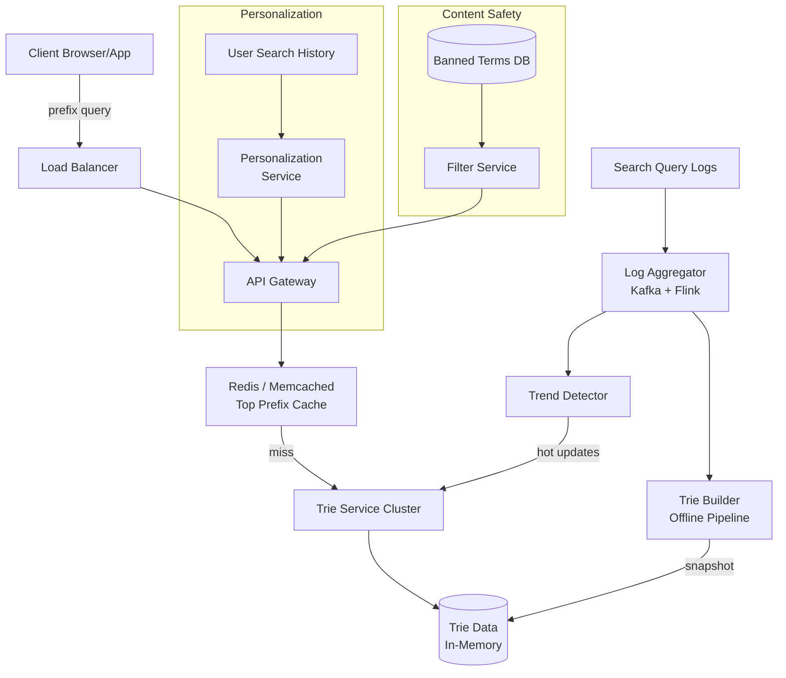
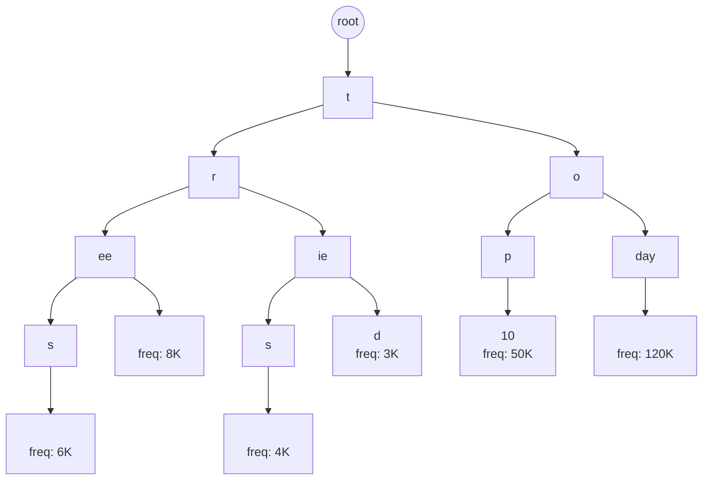
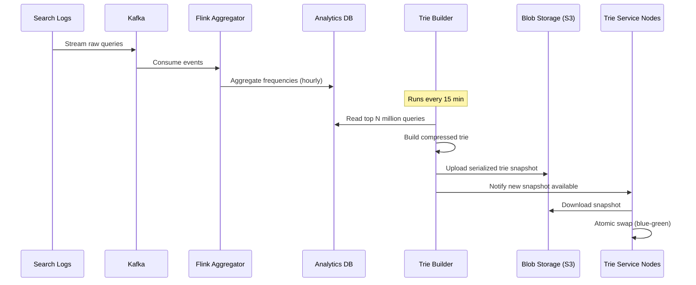
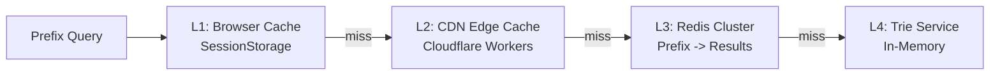
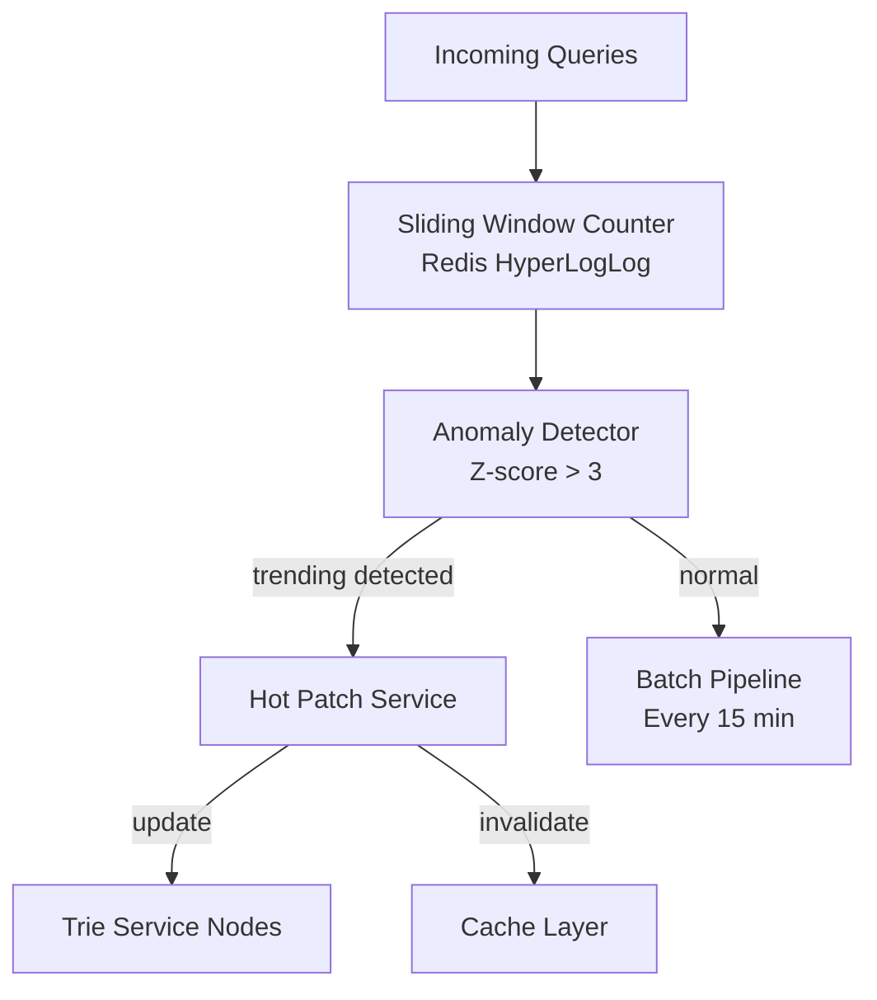
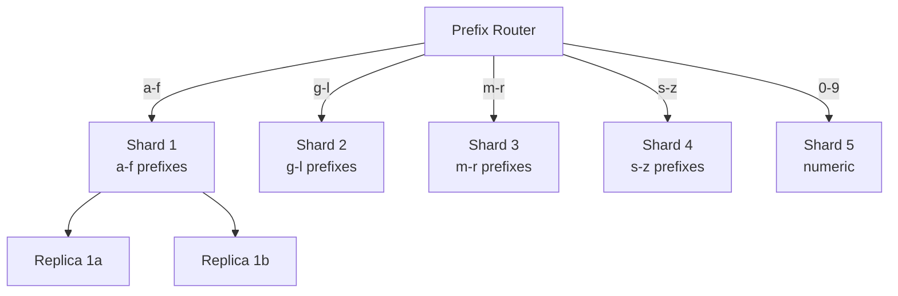
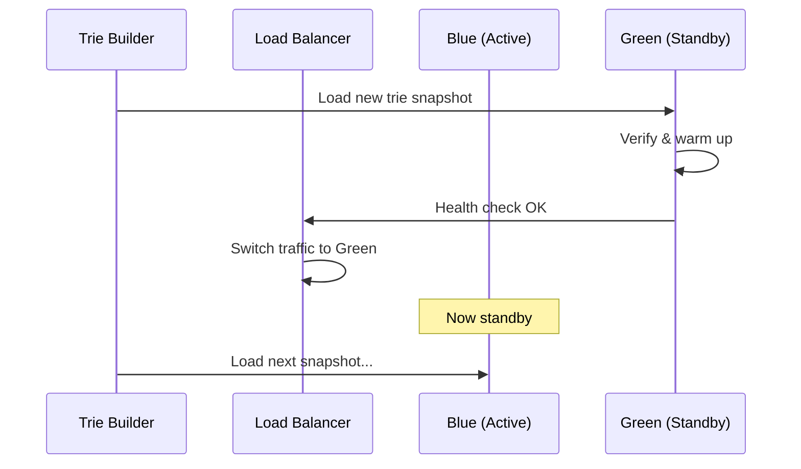

# Design Typeahead / Autocomplete

## 1. Problem Statement & Requirements

A user types into a search box and sees instant suggestions after every keystroke. Think Google Search suggestions, YouTube search, or e-commerce product search.

### Functional Requirements

| # | Requirement |
|---|-------------|
| FR-1 | Return top-N (e.g., 10) suggestions for a given prefix |
| FR-2 | Rank suggestions by popularity / frequency |
| FR-3 | Update suggestion corpus in near-real-time (trending queries) |
| FR-4 | Support multi-language input (Unicode) |
| FR-5 | Handle personalized suggestions per user |
| FR-6 | Filter offensive / banned terms |

### Non-Functional Requirements

| # | Requirement | Target |
|---|-------------|--------|
| NFR-1 | Latency | p99 < 100 ms |
| NFR-2 | Availability | 99.99 % |
| NFR-3 | Scalability | 500 K QPS peak |
| NFR-4 | Consistency | Eventual (seconds) |
| NFR-5 | Fault tolerance | No single point of failure |

---

## 2. Back-of-Envelope Estimation

### Traffic

- DAU: 500 million
- Searches per user per day: 6
- Average keystrokes per search: 8
- Total autocomplete requests per day:

$$
500 \times 10^6 \times 6 \times 8 = 24 \times 10^9 \text{ requests/day}
$$

$$
\text{QPS} = \frac{24 \times 10^9}{86400} \approx 278{,}000 \text{ QPS (avg)}
$$

$$
\text{Peak QPS} \approx 2 \times 278{,}000 \approx 556{,}000 \text{ QPS}
$$

### Storage

- Unique query strings: 1 billion
- Average query length: 25 bytes
- Frequency counter: 8 bytes
- Metadata (language, timestamp): 16 bytes

$$
\text{Raw data} = 1 \times 10^9 \times (25 + 8 + 16) = 49 \text{ GB}
$$

- Trie overhead (pointers, nodes): ~3x raw data

$$
\text{Trie memory} \approx 49 \times 3 = 147 \text{ GB}
$$

### Bandwidth

- Average response size: 10 suggestions x 30 bytes = 300 bytes
- Plus JSON overhead: ~500 bytes per response

$$
\text{Outbound} = 556{,}000 \times 500 = 278 \text{ MB/s} \approx 2.2 \text{ Gbps}
$$

---

## 3. High-Level Design



### API Design

```typescript
// GET /v1/autocomplete?prefix=how+to&limit=10&lang=en&userId=abc123

interface AutocompleteRequest {
  prefix: string;       // The typed prefix
  limit?: number;       // Max suggestions (default 10)
  lang?: string;        // ISO 639-1 language code
  userId?: string;      // For personalized results
}

interface AutocompleteResponse {
  suggestions: Suggestion[];
  latencyMs: number;
}

interface Suggestion {
  text: string;         // Full suggestion text
  score: number;        // Relevance score
  category?: string;    // Optional category hint
  metadata?: Record<string, string>;
}
```

::: tip Debouncing
Clients should debounce requests (50-100 ms) to avoid unnecessary load. If a user types "how", only send "ho" and "how" rather than "h", "ho", "how".
:::

---

## 4. Database Schema

### Query Frequency Table (Analytics DB)

```sql
CREATE TABLE query_frequencies (
    query_hash    BIGINT PRIMARY KEY,     -- MurmurHash of normalized query
    query_text    VARCHAR(500) NOT NULL,
    language      CHAR(2) NOT NULL DEFAULT 'en',
    frequency     BIGINT NOT NULL DEFAULT 0,
    last_seen     TIMESTAMP NOT NULL DEFAULT NOW(),
    created_at    TIMESTAMP NOT NULL DEFAULT NOW(),
    is_banned     BOOLEAN NOT NULL DEFAULT FALSE
);

CREATE INDEX idx_query_freq_lang ON query_frequencies(language, frequency DESC);
CREATE INDEX idx_query_freq_last ON query_frequencies(last_seen);
```

### User Search History

```sql
CREATE TABLE user_search_history (
    user_id       VARCHAR(64) NOT NULL,
    query_text    VARCHAR(500) NOT NULL,
    searched_at   TIMESTAMP NOT NULL DEFAULT NOW(),
    result_clicked BOOLEAN DEFAULT FALSE,
    PRIMARY KEY (user_id, searched_at)
) PARTITION BY RANGE (searched_at);

-- Keep 90 days of history
CREATE TABLE user_search_history_2026_q1
    PARTITION OF user_search_history
    FOR VALUES FROM ('2026-01-01') TO ('2026-04-01');
```

### Banned Terms

```sql
CREATE TABLE banned_terms (
    term_hash     BIGINT PRIMARY KEY,
    term_text     VARCHAR(500) NOT NULL,
    reason        VARCHAR(100),
    added_at      TIMESTAMP NOT NULL DEFAULT NOW(),
    added_by      VARCHAR(64)
);
```

---

## 5. Detailed Component Design

### 5.1 Trie Data Structure

The core data structure is a **compressed trie** (also called a Patricia trie or radix tree) where common prefixes share nodes.



#### Trie Node Implementation

```typescript
interface TrieNode {
  children: Map<string, TrieNode>;  // Character -> child node
  isEnd: boolean;                    // Marks end of a valid query
  frequency: number;                 // Search frequency
  topSuggestions: Suggestion[];      // Pre-computed top-K at this node
}

class CompressedTrie {
  private root: TrieNode;
  private readonly topK: number;

  constructor(topK: number = 10) {
    this.root = this.createNode();
    this.topK = topK;
  }

  private createNode(): TrieNode {
    return {
      children: new Map(),
      isEnd: false,
      frequency: 0,
      topSuggestions: [],
    };
  }

  insert(query: string, frequency: number): void {
    let node = this.root;
    for (const char of query) {
      if (!node.children.has(char)) {
        node.children.set(char, this.createNode());
      }
      node = node.children.get(char)!;
      // Update top suggestions at every prefix node
      this.updateTopSuggestions(node, query, frequency);
    }
    node.isEnd = true;
    node.frequency = frequency;
  }

  private updateTopSuggestions(
    node: TrieNode,
    query: string,
    frequency: number
  ): void {
    const existing = node.topSuggestions.findIndex(
      (s) => s.text === query
    );
    if (existing >= 0) {
      node.topSuggestions[existing].score = frequency;
    } else {
      node.topSuggestions.push({ text: query, score: frequency });
    }
    // Sort descending by score and keep only top K
    node.topSuggestions.sort((a, b) => b.score - a.score);
    if (node.topSuggestions.length > this.topK) {
      node.topSuggestions = node.topSuggestions.slice(0, this.topK);
    }
  }

  search(prefix: string): Suggestion[] {
    let node = this.root;
    for (const char of prefix) {
      if (!node.children.has(char)) {
        return [];
      }
      node = node.children.get(char)!;
    }
    return node.topSuggestions;
  }
}
```

::: info Key Optimization: Pre-computed Top-K
Instead of traversing the entire subtree for every query, we store the top-K suggestions at each node. This turns a potentially expensive DFS into an O(L) lookup where L is the prefix length.
:::

### 5.2 Trie Building Pipeline

The trie is built offline and swapped in atomically.



#### Trie Serialization

```typescript
interface SerializedTrie {
  version: number;
  timestamp: string;
  language: string;
  nodeCount: number;
  data: Buffer;        // Custom binary format
  checksum: string;    // SHA-256
}

class TrieSerializer {
  /**
   * Serialize trie to a compact binary format.
   * Format per node:
   *   - 1 byte: number of children
   *   - For each child: 4 bytes (UTF-8 char) + 4 bytes (offset)
   *   - 1 byte: flags (isEnd)
   *   - 8 bytes: frequency
   *   - 2 bytes: number of top suggestions
   *   - For each suggestion: 2 bytes (length) + N bytes (text) + 8 bytes (score)
   */
  serialize(trie: CompressedTrie): Buffer {
    const buffers: Buffer[] = [];
    this.serializeNode(trie.getRoot(), buffers);
    return Buffer.concat(buffers);
  }

  deserialize(data: Buffer): CompressedTrie {
    const trie = new CompressedTrie();
    let offset = 0;
    this.deserializeNode(trie.getRoot(), data, offset);
    return trie;
  }

  private serializeNode(node: TrieNode, buffers: Buffer[]): void {
    // Implementation details...
    const header = Buffer.alloc(1 + 1 + 8 + 2);
    header.writeUInt8(node.children.size, 0);
    header.writeUInt8(node.isEnd ? 1 : 0, 1);
    header.writeBigInt64BE(BigInt(node.frequency), 2);
    header.writeUInt16BE(node.topSuggestions.length, 10);
    buffers.push(header);

    for (const suggestion of node.topSuggestions) {
      const textBuf = Buffer.from(suggestion.text, 'utf-8');
      const sugHeader = Buffer.alloc(2 + 8);
      sugHeader.writeUInt16BE(textBuf.length, 0);
      sugHeader.writeBigInt64BE(BigInt(suggestion.score), 2);
      buffers.push(sugHeader, textBuf);
    }

    for (const [char, child] of node.children) {
      const charBuf = Buffer.from(char, 'utf-8');
      buffers.push(charBuf);
      this.serializeNode(child, buffers);
    }
  }
}
```

### 5.3 Caching Layer



#### Cache Strategy

```typescript
class AutocompleteCache {
  private redis: RedisCluster;
  private readonly TTL_SECONDS = 300; // 5 minutes
  private readonly HOT_TTL_SECONDS = 60; // 1 minute for trending

  async get(prefix: string, lang: string): Promise<Suggestion[] | null> {
    const key = this.buildKey(prefix, lang);
    const cached = await this.redis.get(key);
    if (cached) {
      return JSON.parse(cached);
    }
    return null;
  }

  async set(
    prefix: string,
    lang: string,
    suggestions: Suggestion[],
    isTrending: boolean = false
  ): Promise<void> {
    const key = this.buildKey(prefix, lang);
    const ttl = isTrending ? this.HOT_TTL_SECONDS : this.TTL_SECONDS;
    await this.redis.setex(key, ttl, JSON.stringify(suggestions));
  }

  private buildKey(prefix: string, lang: string): string {
    return `ac:${lang}:${prefix.toLowerCase()}`;
  }

  /**
   * Warm the cache with the most popular prefixes.
   * Top 1-2 character prefixes cover ~80% of traffic.
   */
  async warmCache(lang: string): Promise<void> {
    const alphabet = 'abcdefghijklmnopqrstuvwxyz0123456789';
    for (const c1 of alphabet) {
      // Single-char prefixes
      await this.warmPrefix(c1, lang);
      for (const c2 of alphabet) {
        // Two-char prefixes
        await this.warmPrefix(c1 + c2, lang);
      }
    }
  }

  private async warmPrefix(prefix: string, lang: string): Promise<void> {
    // Fetch from trie and populate cache
  }
}
```

::: warning Cache Invalidation
When a query suddenly trends (e.g., breaking news), stale caches can serve outdated suggestions. Use a **publish/subscribe** mechanism to invalidate affected prefixes across all cache layers.
:::

### 5.4 Real-Time Trending Updates

For handling sudden spikes (breaking news, viral events), we cannot wait for the 15-minute trie rebuild.



```typescript
class TrendDetector {
  private redis: RedisCluster;
  private readonly WINDOW_SECONDS = 300;    // 5-minute window
  private readonly Z_SCORE_THRESHOLD = 3.0;

  async recordQuery(query: string): Promise<boolean> {
    const normalizedQuery = query.toLowerCase().trim();
    const currentWindow = this.getCurrentWindow();
    const key = `trend:${currentWindow}:${normalizedQuery}`;

    const count = await this.redis.incr(key);
    await this.redis.expire(key, this.WINDOW_SECONDS * 2);

    if (count > 100) { // Minimum threshold
      return this.isAnomaly(normalizedQuery, count);
    }
    return false;
  }

  private async isAnomaly(
    query: string,
    currentCount: number
  ): Promise<boolean> {
    // Get historical average and stddev for this time window
    const stats = await this.getHistoricalStats(query);
    if (!stats) return currentCount > 1000; // Fallback threshold

    const zScore =
      (currentCount - stats.mean) / (stats.stddev || 1);
    return zScore > this.Z_SCORE_THRESHOLD;
  }

  private getCurrentWindow(): number {
    return Math.floor(Date.now() / (this.WINDOW_SECONDS * 1000));
  }

  private async getHistoricalStats(
    query: string
  ): Promise<{ mean: number; stddev: number } | null> {
    // Fetch from analytics DB
    return null;
  }
}
```

### 5.5 Multi-Language Support

```typescript
class MultiLanguageAutocomplete {
  private tries: Map<string, CompressedTrie> = new Map();
  private tokenizers: Map<string, Tokenizer> = new Map();

  constructor() {
    // Register language-specific tokenizers
    this.tokenizers.set('en', new LatinTokenizer());
    this.tokenizers.set('zh', new ChineseTokenizer());  // CJK segmentation
    this.tokenizers.set('ja', new JapaneseTokenizer()); // Mecab-based
    this.tokenizers.set('ko', new KoreanTokenizer());   // Jamo decomposition
    this.tokenizers.set('ar', new ArabicTokenizer());   // RTL + diacritics
  }

  async search(
    prefix: string,
    lang: string
  ): Promise<Suggestion[]> {
    const tokenizer = this.tokenizers.get(lang)
      ?? this.tokenizers.get('en')!;

    const normalizedPrefix = tokenizer.normalize(prefix);
    const trie = this.tries.get(lang);
    if (!trie) {
      throw new Error(`No trie loaded for language: ${lang}`);
    }

    return trie.search(normalizedPrefix);
  }
}

interface Tokenizer {
  normalize(input: string): string;
  tokenize(input: string): string[];
}

class ChineseTokenizer implements Tokenizer {
  normalize(input: string): string {
    // Convert traditional to simplified
    // Remove tone marks if present
    // Handle pinyin input
    return input.normalize('NFC');
  }

  tokenize(input: string): string[] {
    // Use jieba or similar for word segmentation
    return [];
  }
}
```

::: details CJK Language Challenges
Chinese, Japanese, and Korean present unique challenges for autocomplete:
- **No spaces** between words, so prefix matching must work at the character level
- **Pinyin input**: Chinese users often type pinyin (romanized), which must map to characters
- **Jamo decomposition**: Korean syllables decompose into component jamo for matching
- **Mixed scripts**: Japanese uses kanji, hiragana, katakana, and romaji

The solution is to maintain multiple index paths per query (original script + romanized) and merge results.
:::

### 5.6 Personalization

```typescript
class PersonalizedAutocomplete {
  private globalTrie: CompressedTrie;
  private userHistoryCache: RedisCluster;
  private readonly PERSONAL_WEIGHT = 0.3;
  private readonly GLOBAL_WEIGHT = 0.7;

  async getSuggestions(
    prefix: string,
    userId: string | null,
    limit: number = 10
  ): Promise<Suggestion[]> {
    // 1. Get global suggestions
    const globalSuggestions = this.globalTrie.search(prefix);

    if (!userId) {
      return globalSuggestions.slice(0, limit);
    }

    // 2. Get personal suggestions from user history
    const personalSuggestions =
      await this.getPersonalSuggestions(prefix, userId);

    // 3. Merge and re-rank
    return this.mergeSuggestions(
      globalSuggestions,
      personalSuggestions,
      limit
    );
  }

  private async getPersonalSuggestions(
    prefix: string,
    userId: string
  ): Promise<Suggestion[]> {
    const key = `user:history:${userId}`;
    const history: string[] = await this.userHistoryCache.lrange(
      key, 0, 100
    );

    return history
      .filter((q) => q.toLowerCase().startsWith(prefix.toLowerCase()))
      .map((q, i) => ({
        text: q,
        score: 100 - i, // Recency-based scoring
      }))
      .slice(0, 5);
  }

  private mergeSuggestions(
    global: Suggestion[],
    personal: Suggestion[],
    limit: number
  ): Suggestion[] {
    const merged = new Map<string, Suggestion>();

    for (const s of global) {
      merged.set(s.text, {
        ...s,
        score: s.score * this.GLOBAL_WEIGHT,
      });
    }

    for (const s of personal) {
      const existing = merged.get(s.text);
      if (existing) {
        existing.score += s.score * this.PERSONAL_WEIGHT;
      } else {
        merged.set(s.text, {
          ...s,
          score: s.score * this.PERSONAL_WEIGHT,
        });
      }
    }

    return Array.from(merged.values())
      .sort((a, b) => b.score - a.score)
      .slice(0, limit);
  }
}
```

### 5.7 Content Filtering

```typescript
class ContentFilter {
  private bannedTrie: CompressedTrie;
  private bannedSet: Set<string>;
  private regexPatterns: RegExp[];

  constructor() {
    this.bannedTrie = new CompressedTrie();
    this.bannedSet = new Set();
    this.regexPatterns = [];
  }

  async loadBannedTerms(): Promise<void> {
    // Load from database
    const terms = await this.fetchBannedTerms();
    for (const term of terms) {
      this.bannedSet.add(term.toLowerCase());
      this.bannedTrie.insert(term.toLowerCase(), 0);
    }
  }

  filterSuggestions(suggestions: Suggestion[]): Suggestion[] {
    return suggestions.filter((s) => {
      const normalized = s.text.toLowerCase();
      // Exact match check
      if (this.bannedSet.has(normalized)) return false;
      // Substring check
      for (const pattern of this.regexPatterns) {
        if (pattern.test(normalized)) return false;
      }
      return true;
    });
  }

  private async fetchBannedTerms(): Promise<string[]> {
    return [];
  }
}
```

---

## 6. Scaling & Bottlenecks

### What Breaks First?

| Bottleneck | Symptom | Solution |
|-----------|---------|----------|
| Single trie too large for memory | OOM on service nodes | Shard by first N characters |
| Hot prefixes overload single node | Latency spikes on "a", "th" | Replicate hot shards |
| Trie rebuild takes too long | Stale suggestions | Incremental updates |
| Cache stampede on expiry | Thundering herd | Staggered TTLs + lock |
| Cross-region latency | Slow for distant users | Regional trie replicas |

### Sharding Strategy



::: danger Uneven Shard Distribution
Letter frequency is not uniform. In English, prefixes starting with "s" and "c" are far more common than "x" or "z". Use **weighted sharding** based on actual traffic distribution, not alphabetical ranges.
:::

### Trie Partitioning by Language and Region

```typescript
class ShardRouter {
  private shardMap: Map<string, string[]>; // prefix range -> shard endpoints

  route(prefix: string, lang: string): string {
    const firstChar = prefix.charAt(0).toLowerCase();
    const shardKey = `${lang}:${this.getRange(firstChar)}`;
    const endpoints = this.shardMap.get(shardKey);
    if (!endpoints || endpoints.length === 0) {
      throw new Error(`No shard for key: ${shardKey}`);
    }
    // Consistent hashing for replica selection
    const hash = this.murmurhash(prefix);
    return endpoints[hash % endpoints.length];
  }

  private getRange(char: string): string {
    if (char >= 'a' && char <= 'f') return 'a-f';
    if (char >= 'g' && char <= 'l') return 'g-l';
    if (char >= 'm' && char <= 'r') return 'm-r';
    if (char >= 's' && char <= 'z') return 's-z';
    return 'other';
  }

  private murmurhash(key: string): number {
    let hash = 0;
    for (let i = 0; i < key.length; i++) {
      hash = (hash * 31 + key.charCodeAt(i)) | 0;
    }
    return Math.abs(hash);
  }
}
```

### Blue-Green Deployment for Trie Updates



---

## 7. Trade-offs & Alternatives

### Trie vs. Alternatives

| Approach | Pros | Cons |
|----------|------|------|
| **Trie (in-memory)** | O(L) lookup, pre-computed top-K | High memory, complex updates |
| **Elasticsearch prefix** | Full-text features, easy to scale | Higher latency (~20-50 ms) |
| **Redis sorted sets** | Simple, built-in scoring | Memory-heavy, no prefix structure |
| **B-tree index (SQL LIKE)** | Persistent, ACID | Too slow at scale |
| **Ternary search tree** | More memory-efficient than trie | Slower lookups |

### Pre-computed vs. On-the-Fly Ranking

| Strategy | Latency | Freshness | Memory |
|----------|---------|-----------|--------|
| Pre-computed top-K at each node | O(L) | Stale until rebuild | Higher |
| DFS at query time | O(N) worst case | Always fresh | Lower |
| **Hybrid** (pre-computed + hot patch) | O(L) | Near real-time | Medium |

::: tip Recommendation
Use the **hybrid approach**: pre-compute top-K during offline builds, but apply hot patches for trending queries in real-time. This gives you O(L) latency with near-real-time freshness.
:::

### Consistency vs. Availability

- Autocomplete is a **read-heavy, availability-critical** system
- Slightly stale suggestions are acceptable
- Choose **AP** in the CAP theorem
- Use eventual consistency with ~5s propagation delay

---

## 8. Advanced Topics

### 8.1 Fuzzy Matching & Typo Tolerance

```typescript
class FuzzyAutocomplete {
  private trie: CompressedTrie;
  private readonly MAX_EDIT_DISTANCE = 2;

  search(prefix: string, maxEdits: number = 1): Suggestion[] {
    const results: Suggestion[] = [];
    this.fuzzySearchHelper(
      this.trie.getRoot(),
      prefix,
      0,
      maxEdits,
      '',
      results
    );
    return results.sort((a, b) => b.score - a.score).slice(0, 10);
  }

  private fuzzySearchHelper(
    node: TrieNode,
    prefix: string,
    depth: number,
    remainingEdits: number,
    currentPath: string,
    results: Suggestion[]
  ): void {
    if (remainingEdits < 0) return;

    if (depth === prefix.length) {
      // Prefix fully matched (with possible edits)
      results.push(...node.topSuggestions);
      return;
    }

    const targetChar = prefix[depth];

    for (const [char, child] of node.children) {
      if (char === targetChar) {
        // Exact match - no edit cost
        this.fuzzySearchHelper(
          child, prefix, depth + 1,
          remainingEdits, currentPath + char, results
        );
      } else {
        // Substitution - costs 1 edit
        this.fuzzySearchHelper(
          child, prefix, depth + 1,
          remainingEdits - 1, currentPath + char, results
        );
      }
      // Insertion - costs 1 edit (skip a char in trie)
      this.fuzzySearchHelper(
        child, prefix, depth,
        remainingEdits - 1, currentPath + char, results
      );
    }
    // Deletion - costs 1 edit (skip a char in prefix)
    this.fuzzySearchHelper(
      node, prefix, depth + 1,
      remainingEdits - 1, currentPath, results
    );
  }
}
```

### 8.2 Sampling for Analytics

At 500K QPS, logging every query is expensive. Use sampling.

```typescript
class QuerySampler {
  private readonly SAMPLE_RATE = 0.1; // 10% sampling
  private readonly HEAVY_HITTER_THRESHOLD = 1000;
  private counters: Map<string, number> = new Map();

  shouldSample(query: string): boolean {
    // Always sample heavy hitters (popular queries)
    const count = this.counters.get(query) ?? 0;
    this.counters.set(query, count + 1);

    if (count > this.HEAVY_HITTER_THRESHOLD) {
      // Reduce sampling for very popular queries
      return Math.random() < 0.01;
    }

    return Math.random() < this.SAMPLE_RATE;
  }

  estimateFrequency(sampledCount: number, query: string): number {
    const count = this.counters.get(query) ?? 0;
    if (count > this.HEAVY_HITTER_THRESHOLD) {
      return sampledCount * 100; // 1% sample rate
    }
    return sampledCount * 10; // 10% sample rate
  }
}
```

### 8.3 Client-Side Optimization

```typescript
class ClientAutocomplete {
  private cache: Map<string, Suggestion[]> = new Map();
  private debounceTimer: ReturnType<typeof setTimeout> | null = null;
  private readonly DEBOUNCE_MS = 100;
  private inflight: AbortController | null = null;

  async onInput(prefix: string): Promise<Suggestion[]> {
    // 1. Check local cache first
    const cached = this.cache.get(prefix);
    if (cached) return cached;

    // 2. Try to derive from a shorter cached prefix
    for (let i = prefix.length - 1; i >= 1; i--) {
      const shorter = prefix.slice(0, i);
      const shorterResults = this.cache.get(shorter);
      if (shorterResults) {
        const filtered = shorterResults.filter((s) =>
          s.text.toLowerCase().startsWith(prefix.toLowerCase())
        );
        if (filtered.length >= 5) {
          this.cache.set(prefix, filtered);
          return filtered;
        }
      }
    }

    // 3. Cancel any inflight request
    if (this.inflight) {
      this.inflight.abort();
    }

    // 4. Debounce and fetch from server
    return new Promise((resolve) => {
      if (this.debounceTimer) clearTimeout(this.debounceTimer);
      this.debounceTimer = setTimeout(async () => {
        this.inflight = new AbortController();
        try {
          const response = await fetch(
            `/api/v1/autocomplete?prefix=${encodeURIComponent(prefix)}`,
            { signal: this.inflight.signal }
          );
          const data: AutocompleteResponse = await response.json();
          this.cache.set(prefix, data.suggestions);
          resolve(data.suggestions);
        } catch (e) {
          if ((e as Error).name !== 'AbortError') {
            resolve([]);
          }
        }
      }, this.DEBOUNCE_MS);
    });
  }
}
```

### 8.4 Monitoring & Alerting

Key metrics to track:

| Metric | Target | Alert Threshold |
|--------|--------|-----------------|
| p50 latency | < 20 ms | > 50 ms |
| p99 latency | < 100 ms | > 200 ms |
| Cache hit rate | > 90% | < 80% |
| Trie build time | < 10 min | > 20 min |
| Suggestion quality (CTR) | > 30% | < 20% |
| Error rate | < 0.01% | > 0.1% |

---

## 9. Interview Tips

::: tip Clarify First
Always start by asking:
- What is the scale? (Millions vs. billions of queries)
- How fresh do suggestions need to be? (Real-time vs. hourly?)
- Is personalization required?
- What languages must be supported?
- Is there a need for typo tolerance?
:::

::: tip Start Simple, Then Scale
1. Start with a single-server trie
2. Add caching (Redis)
3. Shard by prefix range
4. Add offline pipeline for trie building
5. Add real-time trending layer
6. Add personalization
:::

::: warning Common Mistakes
- Forgetting to debounce on the client side
- Not pre-computing top-K at trie nodes (too-slow DFS)
- Ignoring the trie update/rebuild strategy
- Not discussing how to handle offensive content
- Overlooking CJK language challenges
:::

::: details Sample Interview Timeline (45 min)
| Time | Phase |
|------|-------|
| 0-5 min | Requirements & clarifications |
| 5-10 min | Back-of-envelope estimation |
| 10-20 min | High-level design with diagram |
| 20-30 min | Deep dive: trie structure + caching |
| 30-38 min | Scaling: sharding, replication |
| 38-43 min | Real-time updates, personalization |
| 43-45 min | Trade-offs recap |
:::

### Key Talking Points

1. **Why trie over Elasticsearch?** Latency. Trie gives O(L) lookup; ES involves network hops + query parsing.
2. **How to handle 500K QPS?** Caching top prefixes handles 80%+ of traffic. Remaining goes to sharded trie replicas.
3. **How fresh are suggestions?** Hybrid: bulk rebuild every 15 min + real-time hot patches for trending.
4. **Memory optimization?** Compressed trie, only store top 50M queries per language, shard across machines.
5. **Fault tolerance?** Blue-green deployments, replicated shards, graceful fallback to cache.
