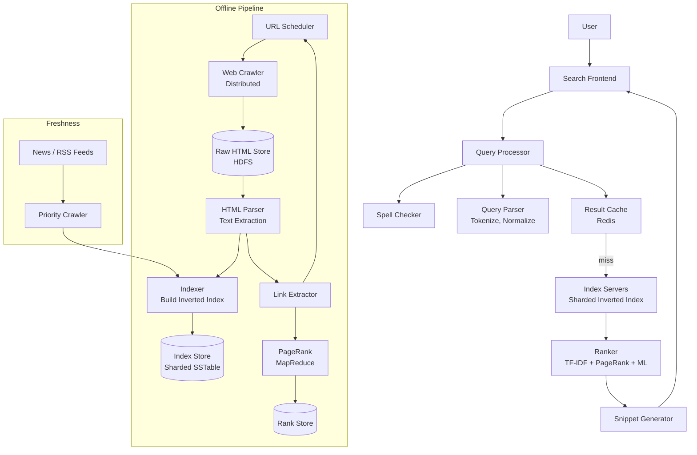
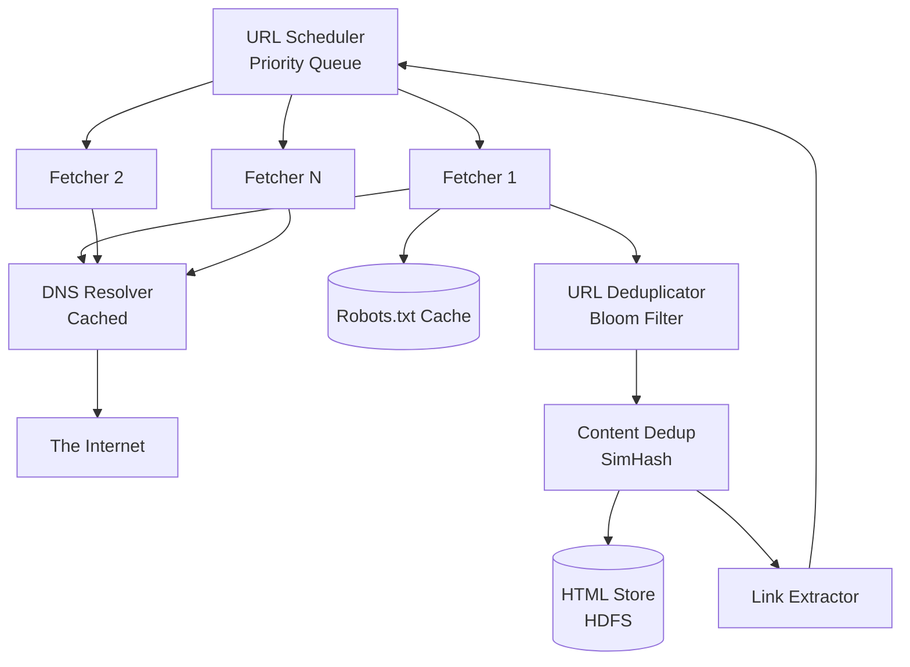
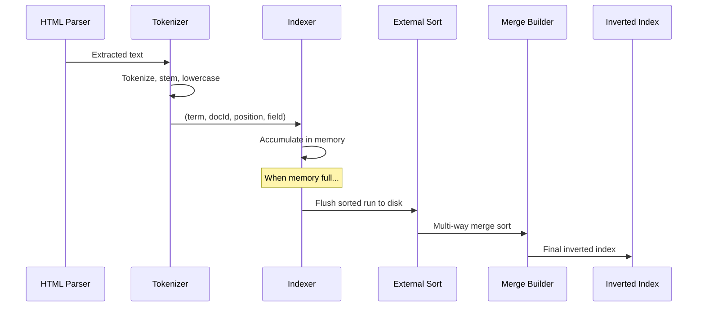
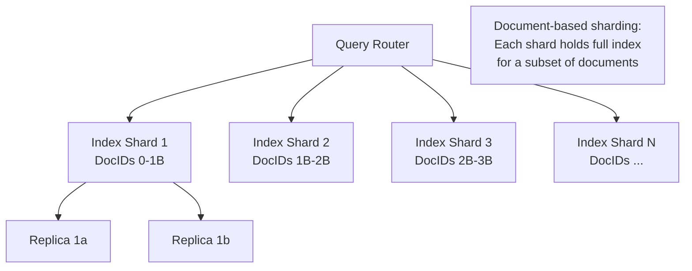

# Design a Search Engine

## 1. Problem Statement & Requirements

Design a web-scale search engine like Google or Bing that crawls the web, indexes pages, and serves ranked search results in real time.

### Functional Requirements

| # | Requirement |
|---|-------------|
| FR-1 | Crawl and index billions of web pages |
| FR-2 | Return ranked search results for text queries |
| FR-3 | Support Boolean queries (AND, OR, NOT) |
| FR-4 | Provide spelling correction ("Did you mean...") |
| FR-5 | Autocomplete / query suggestions |
| FR-6 | Snippet extraction with keyword highlighting |
| FR-7 | Support image / video search (basic) |
| FR-8 | Freshness: index new/updated pages within hours |

### Non-Functional Requirements

| # | Requirement | Target |
|---|-------------|--------|
| NFR-1 | Query latency | p99 < 500 ms |
| NFR-2 | Availability | 99.99% |
| NFR-3 | Index size | 100 billion pages |
| NFR-4 | Crawl rate | 1 billion pages/day |
| NFR-5 | QPS | 100,000 search queries/second |
| NFR-6 | Result quality | Top-3 results relevant > 90% of the time |

---

## 2. Back-of-Envelope Estimation

### Index Size

- 100 billion web pages
- Average page: 50 KB HTML -> ~5 KB extracted text
- Average unique terms per page: 500
- Total unique terms on the web: ~100 million

$$
\text{Raw text} = 100 \times 10^9 \times 5 \text{ KB} = 500 \text{ PB}
$$

- We don't store raw text in the main index. Inverted index size:

$$
\text{Postings} = 100 \times 10^9 \times 500 \text{ terms} = 50 \times 10^{12} \text{ postings}
$$

- Each posting (docID + position): ~12 bytes

$$
\text{Inverted index} = 50 \times 10^{12} \times 12 = 600 \text{ TB}
$$

### Crawl Bandwidth

$$
\text{Pages/sec} = \frac{10^9}{86400} \approx 11{,}574 \text{ pages/sec}
$$

$$
\text{Bandwidth} = 11{,}574 \times 50 \text{ KB} \approx 579 \text{ MB/s} \approx 4.6 \text{ Gbps}
$$

### Query Traffic

$$
\text{QPS} = 100{,}000
$$

- Average query processes 2-3 terms across the index:

$$
\text{Index lookups} = 100{,}000 \times 3 = 300{,}000 \text{ index reads/sec}
$$

- Average result page: ~10 results x 500 bytes each = 5 KB

$$
\text{Outbound} = 100{,}000 \times 5 \text{ KB} = 500 \text{ MB/s}
$$

---

## 3. High-Level Design



### API Design

```typescript
// GET /search?q=distributed+systems&page=1&lang=en&safe=on
interface SearchRequest {
  q: string;              // Query text
  page?: number;          // Result page (default 1)
  resultsPerPage?: number; // Default 10
  lang?: string;          // Language filter
  dateRange?: string;     // 'day', 'week', 'month', 'year'
  safe?: 'on' | 'off';   // Safe search
  type?: 'web' | 'image' | 'video' | 'news';
}

interface SearchResponse {
  results: SearchResult[];
  totalResults: number;
  spellingCorrection?: string;
  suggestions?: string[];
  searchTimeMs: number;
}

interface SearchResult {
  url: string;
  title: string;
  snippet: string;          // HTML with <b> highlights
  favicon?: string;
  lastCrawled: string;
  relevanceScore: number;
}
```

---

## 4. Database / Storage Schema

### URL Frontier (Crawl Queue)

```sql
CREATE TABLE url_frontier (
    url_hash        BIGINT PRIMARY KEY,
    url             TEXT NOT NULL,
    domain          VARCHAR(255) NOT NULL,
    priority        INT DEFAULT 5,           -- 1 (highest) to 10 (lowest)
    last_crawled    TIMESTAMPTZ,
    next_crawl      TIMESTAMPTZ NOT NULL DEFAULT NOW(),
    crawl_frequency INTERVAL DEFAULT '7 days',
    http_status     INT,
    content_hash    CHAR(64),                -- SHA-256 for change detection
    retry_count     INT DEFAULT 0,
    created_at      TIMESTAMPTZ DEFAULT NOW()
);

CREATE INDEX idx_frontier_next ON url_frontier(next_crawl, priority)
    WHERE retry_count < 5;
CREATE INDEX idx_frontier_domain ON url_frontier(domain, next_crawl);
```

### Document Store

```sql
CREATE TABLE documents (
    doc_id          BIGINT PRIMARY KEY,
    url_hash        BIGINT NOT NULL,
    url             TEXT NOT NULL,
    title           TEXT,
    content_text    TEXT,                     -- Extracted plain text
    content_hash    CHAR(64),
    language        CHAR(2),
    page_rank       DOUBLE PRECISION DEFAULT 0,
    inlink_count    INT DEFAULT 0,
    outlink_count   INT DEFAULT 0,
    crawled_at      TIMESTAMPTZ NOT NULL,
    indexed_at      TIMESTAMPTZ
) PARTITION BY HASH (doc_id);
```

### Inverted Index (On-Disk Format)

```typescript
// Inverted index entry for a single term
interface PostingList {
  term: string;
  documentFrequency: number;  // How many docs contain this term
  postings: Posting[];        // Sorted by docId
}

interface Posting {
  docId: number;
  termFrequency: number;      // How many times the term appears
  positions: number[];        // Word positions for phrase queries
  fieldBoosts: {              // Per-field scoring
    title: number;
    body: number;
    url: number;
    anchor: number;
  };
}
```

---

## 5. Detailed Component Design

### 5.1 Web Crawler



```typescript
class WebCrawler {
  private urlFrontier: URLFrontier;
  private robotsCache: Map<string, RobotsRules> = new Map();
  private dnsCache: Map<string, string> = new Map();
  private urlDedup: BloomFilter;
  private contentDedup: SimHashStore;
  private readonly MAX_CONCURRENT = 1000;
  private readonly POLITENESS_DELAY_MS = 1000; // Per domain

  async crawl(): Promise<void> {
    while (true) {
      const urls = await this.urlFrontier.dequeue(this.MAX_CONCURRENT);

      // Group by domain for politeness
      const byDomain = this.groupByDomain(urls);

      const promises = Array.from(byDomain.entries()).map(
        ([domain, domainUrls]) =>
          this.crawlDomain(domain, domainUrls)
      );

      await Promise.allSettled(promises);
    }
  }

  private async crawlDomain(
    domain: string,
    urls: CrawlURL[]
  ): Promise<void> {
    // Check robots.txt
    const robots = await this.getRobotsRules(domain);

    for (const url of urls) {
      if (!robots.isAllowed(url.path, 'SearchBot')) {
        continue; // Respect robots.txt
      }

      try {
        const response = await this.fetch(url.url);

        // Check for duplicate content
        const simHash = SimHash.compute(response.body);
        if (await this.contentDedup.isDuplicate(simHash)) {
          continue;
        }

        // Store raw HTML
        await this.store(url, response);

        // Extract and enqueue new links
        const links = this.extractLinks(response.body, url.url);
        for (const link of links) {
          if (!this.urlDedup.mightContain(link)) {
            await this.urlFrontier.enqueue(link);
            this.urlDedup.add(link);
          }
        }

        // Politeness: delay between requests to same domain
        await this.delay(this.POLITENESS_DELAY_MS);
      } catch (error) {
        await this.urlFrontier.markFailed(url);
      }
    }
  }

  private async getRobotsRules(domain: string): Promise<RobotsRules> {
    if (this.robotsCache.has(domain)) {
      return this.robotsCache.get(domain)!;
    }

    try {
      const response = await this.fetch(
        `https://${domain}/robots.txt`
      );
      const rules = RobotsRules.parse(response.body);
      this.robotsCache.set(domain, rules);
      return rules;
    } catch {
      return RobotsRules.allowAll();
    }
  }
}
```

::: warning Crawler Ethics
1. **Always respect robots.txt** -- it's both ethical and legal
2. **Implement politeness delays** -- don't DDoS websites (1+ second between requests to the same domain)
3. **Identify your bot** -- use a descriptive User-Agent with contact info
4. **Respect `noindex` / `nofollow`** meta tags
5. **Handle rate limit responses** (429) with exponential backoff
:::

### 5.2 Inverted Index Construction



```typescript
class InvertedIndexBuilder {
  private memoryIndex: Map<string, Posting[]> = new Map();
  private sortedRuns: string[] = [];
  private readonly MAX_MEMORY_BYTES = 2 * 1024 * 1024 * 1024; // 2 GB
  private currentMemory = 0;

  async addDocument(doc: ParsedDocument): Promise<void> {
    const terms = this.tokenize(doc.text);

    for (let pos = 0; pos < terms.length; pos++) {
      const term = terms[pos];
      if (!this.memoryIndex.has(term)) {
        this.memoryIndex.set(term, []);
      }

      const postings = this.memoryIndex.get(term)!;
      let posting = postings.find((p) => p.docId === doc.docId);

      if (!posting) {
        posting = {
          docId: doc.docId,
          termFrequency: 0,
          positions: [],
          fieldBoosts: { title: 0, body: 0, url: 0, anchor: 0 },
        };
        postings.push(posting);
        this.currentMemory += 48; // Approximate posting size
      }

      posting.termFrequency++;
      posting.positions.push(pos);
      this.currentMemory += 4; // Position entry
    }

    // Flush if memory limit reached
    if (this.currentMemory >= this.MAX_MEMORY_BYTES) {
      await this.flushToDisk();
    }
  }

  private async flushToDisk(): Promise<void> {
    // Sort terms alphabetically
    const sortedTerms = Array.from(this.memoryIndex.keys()).sort();

    // Write sorted run to disk
    const runPath = `/tmp/index_run_${this.sortedRuns.length}`;
    const writer = new SortedRunWriter(runPath);

    for (const term of sortedTerms) {
      const postings = this.memoryIndex.get(term)!;
      // Sort postings by docId for efficient merging
      postings.sort((a, b) => a.docId - b.docId);
      await writer.write(term, postings);
    }

    await writer.close();
    this.sortedRuns.push(runPath);
    this.memoryIndex.clear();
    this.currentMemory = 0;
  }

  /**
   * Merge all sorted runs into the final inverted index.
   * Uses k-way merge sort.
   */
  async buildFinalIndex(): Promise<void> {
    if (this.memoryIndex.size > 0) {
      await this.flushToDisk();
    }

    const readers = this.sortedRuns.map(
      (path) => new SortedRunReader(path)
    );

    const writer = new InvertedIndexWriter('/data/index');

    // Priority queue of (term, reader_index)
    const heap = new MinHeap<{ term: string; readerIdx: number }>(
      (a, b) => a.term.localeCompare(b.term)
    );

    // Initialize heap with first entry from each reader
    for (let i = 0; i < readers.length; i++) {
      const entry = await readers[i].next();
      if (entry) {
        heap.push({ term: entry.term, readerIdx: i });
      }
    }

    // Merge
    let currentTerm = '';
    let currentPostings: Posting[] = [];

    while (heap.size() > 0) {
      const { term, readerIdx } = heap.pop()!;

      if (term !== currentTerm) {
        if (currentTerm) {
          await writer.writePostingList(currentTerm, currentPostings);
        }
        currentTerm = term;
        currentPostings = [];
      }

      const reader = readers[readerIdx];
      const postings = reader.currentPostings();
      currentPostings.push(...postings);

      // Advance the reader
      const next = await reader.next();
      if (next) {
        heap.push({ term: next.term, readerIdx });
      }
    }

    // Write last term
    if (currentTerm) {
      await writer.writePostingList(currentTerm, currentPostings);
    }

    await writer.close();
  }

  private tokenize(text: string): string[] {
    return text
      .toLowerCase()
      .replace(/[^\w\s]/g, ' ')
      .split(/\s+/)
      .filter((t) => t.length > 0 && !this.isStopWord(t))
      .map((t) => this.stem(t));
  }

  private stem(word: string): string {
    // Porter stemmer (simplified)
    if (word.endsWith('ing')) return word.slice(0, -3);
    if (word.endsWith('ed')) return word.slice(0, -2);
    if (word.endsWith('ly')) return word.slice(0, -2);
    if (word.endsWith('tion')) return word.slice(0, -4) + 't';
    return word;
  }

  private isStopWord(word: string): boolean {
    const stopWords = new Set([
      'the', 'a', 'an', 'is', 'are', 'was', 'were',
      'in', 'on', 'at', 'to', 'for', 'of', 'with',
      'and', 'or', 'not', 'it', 'this', 'that',
    ]);
    return stopWords.has(word);
  }
}
```

### 5.3 Query Processing

```mermaid
graph LR
    Query["distributed systems consensus"] --> Tokenizer[Tokenizer<br/>lowercase, stem]
    Tokenizer --> SpellCheck[Spell Check<br/>Edit Distance]
    SpellCheck --> QueryPlan[Query Plan<br/>AND / OR logic]
    QueryPlan --> IndexLookup[Index Lookup<br/>Fetch posting lists]
    IndexLookup --> Intersect[Posting List<br/>Intersection]
    Intersect --> Score[Scoring<br/>TF-IDF + PageRank]
    Score --> TopK[Top-K Selection<br/>Priority Queue]
    TopK --> Snippets[Snippet Generation]
    Snippets --> Results[Final Results]
```



```typescript
class QueryProcessor {
  private index: InvertedIndex;
  private spellChecker: SpellChecker;
  private ranker: Ranker;
  private cache: ResultCache;

  async search(request: SearchRequest): Promise<SearchResponse> {
    const startTime = Date.now();

    // 1. Check cache
    const cacheKey = this.buildCacheKey(request);
    const cached = await this.cache.get(cacheKey);
    if (cached) {
      return { ...cached, searchTimeMs: Date.now() - startTime };
    }

    // 2. Tokenize and normalize query
    const tokens = this.tokenize(request.q);

    // 3. Spell check
    const corrected = await this.spellChecker.correct(tokens);
    const spellingCorrection = corrected.changed
      ? corrected.text
      : undefined;

    // 4. Fetch posting lists for each query term
    const postingLists = await Promise.all(
      tokens.map((term) => this.index.getPostingList(term))
    );

    // 5. Intersect posting lists (AND semantics by default)
    const candidates = this.intersectPostingLists(postingLists);

    // 6. Score and rank candidates
    const scored = this.ranker.rank(candidates, tokens);

    // 7. Get top K results
    const offset = ((request.page ?? 1) - 1) * (request.resultsPerPage ?? 10);
    const topResults = scored.slice(
      offset, offset + (request.resultsPerPage ?? 10)
    );

    // 8. Generate snippets
    const results = await Promise.all(
      topResults.map(async (doc) => ({
        url: doc.url,
        title: doc.title,
        snippet: await this.generateSnippet(doc, tokens),
        relevanceScore: doc.score,
        lastCrawled: doc.crawledAt,
      }))
    );

    const response: SearchResponse = {
      results,
      totalResults: scored.length,
      spellingCorrection,
      searchTimeMs: Date.now() - startTime,
    };

    // 9. Cache results
    await this.cache.set(cacheKey, response, 300); // 5 min TTL

    return response;
  }

  /**
   * Intersect multiple posting lists using the "zipper" algorithm.
   * O(n) where n is the length of the shortest list.
   */
  private intersectPostingLists(
    lists: PostingList[]
  ): Posting[] {
    if (lists.length === 0) return [];
    if (lists.length === 1) return lists[0].postings;

    // Sort by length (shortest first for efficiency)
    const sorted = lists
      .filter((l) => l.postings.length > 0)
      .sort((a, b) => a.postings.length - b.postings.length);

    if (sorted.length === 0) return [];

    let result = sorted[0].postings;

    for (let i = 1; i < sorted.length; i++) {
      result = this.intersectTwo(result, sorted[i].postings);
      if (result.length === 0) break;
    }

    return result;
  }

  private intersectTwo(a: Posting[], b: Posting[]): Posting[] {
    const result: Posting[] = [];
    let i = 0;
    let j = 0;

    while (i < a.length && j < b.length) {
      if (a[i].docId === b[j].docId) {
        // Merge posting data
        result.push({
          docId: a[i].docId,
          termFrequency: a[i].termFrequency + b[j].termFrequency,
          positions: [...a[i].positions, ...b[j].positions].sort(
            (x, y) => x - y
          ),
          fieldBoosts: {
            title: a[i].fieldBoosts.title + b[j].fieldBoosts.title,
            body: a[i].fieldBoosts.body + b[j].fieldBoosts.body,
            url: a[i].fieldBoosts.url + b[j].fieldBoosts.url,
            anchor: a[i].fieldBoosts.anchor + b[j].fieldBoosts.anchor,
          },
        });
        i++;
        j++;
      } else if (a[i].docId < b[j].docId) {
        i++;
      } else {
        j++;
      }
    }

    return result;
  }
}
```

### 5.4 Ranking: TF-IDF + PageRank

```typescript
class Ranker {
  private pageRanks: Map<number, number>; // docId -> PageRank score
  private totalDocs: number;
  private avgDocLength: number;

  // BM25 parameters
  private readonly K1 = 1.2;
  private readonly B = 0.75;

  // Weight factors
  private readonly WEIGHTS = {
    bm25: 0.4,
    pageRank: 0.3,
    freshness: 0.1,
    titleMatch: 0.15,
    urlMatch: 0.05,
  };

  rank(candidates: Posting[], queryTerms: string[]): ScoredDoc[] {
    const scored: ScoredDoc[] = [];

    for (const candidate of candidates) {
      const score = this.computeScore(candidate, queryTerms);
      scored.push({
        docId: candidate.docId,
        score,
        // ... other fields filled later
      } as ScoredDoc);
    }

    return scored.sort((a, b) => b.score - a.score);
  }

  private computeScore(posting: Posting, queryTerms: string[]): number {
    // 1. BM25 score (improved TF-IDF)
    const bm25 = this.computeBM25(posting, queryTerms);

    // 2. PageRank score (log-normalized)
    const pr = this.pageRanks.get(posting.docId) ?? 0;
    const pageRankScore = Math.log(1 + pr * 1000);

    // 3. Freshness score (newer = higher)
    const freshnessScore = 0; // Computed from crawl date

    // 4. Title match boost
    const titleScore = posting.fieldBoosts.title > 0 ? 1 : 0;

    // 5. URL match boost
    const urlScore = posting.fieldBoosts.url > 0 ? 0.5 : 0;

    return (
      this.WEIGHTS.bm25 * bm25 +
      this.WEIGHTS.pageRank * pageRankScore +
      this.WEIGHTS.freshness * freshnessScore +
      this.WEIGHTS.titleMatch * titleScore +
      this.WEIGHTS.urlMatch * urlScore
    );
  }

  /**
   * BM25 scoring function.
   * An improvement over raw TF-IDF that handles
   * term frequency saturation and document length normalization.
   *
   * Formula:
   * score = SUM over terms of:
   *   IDF(t) * (tf(t,d) * (k1 + 1)) / (tf(t,d) + k1 * (1 - b + b * |d|/avgdl))
   */
  private computeBM25(posting: Posting, queryTerms: string[]): number {
    let score = 0;
    const docLength = posting.positions.length; // Approximate

    for (const term of queryTerms) {
      // IDF: log((N - df + 0.5) / (df + 0.5))
      const df = 1; // Would come from posting list header
      const idf = Math.log(
        (this.totalDocs - df + 0.5) / (df + 0.5) + 1
      );

      const tf = posting.termFrequency;
      const tfNorm =
        (tf * (this.K1 + 1)) /
        (tf + this.K1 * (1 - this.B + this.B * docLength / this.avgDocLength));

      score += idf * tfNorm;
    }

    return score;
  }
}
```

### 5.5 PageRank

```typescript
class PageRankCalculator {
  private readonly DAMPING_FACTOR = 0.85;
  private readonly ITERATIONS = 20;
  private readonly CONVERGENCE_THRESHOLD = 0.0001;

  /**
   * Compute PageRank for all pages using iterative power method.
   *
   * PR(A) = (1-d)/N + d * SUM(PR(T)/L(T)) for all T linking to A
   *
   * where:
   *   d = damping factor (0.85)
   *   N = total number of pages
   *   T = pages linking to A
   *   L(T) = number of outgoing links from T
   */
  compute(
    graph: Map<number, number[]>,  // docId -> outlinks
    inlinks: Map<number, number[]> // docId -> inlinks
  ): Map<number, number> {
    const N = graph.size;
    const initialRank = 1 / N;

    // Initialize all ranks equally
    let ranks = new Map<number, number>();
    for (const docId of graph.keys()) {
      ranks.set(docId, initialRank);
    }

    for (let iter = 0; iter < this.ITERATIONS; iter++) {
      const newRanks = new Map<number, number>();
      let maxDiff = 0;

      for (const [docId] of graph) {
        const incoming = inlinks.get(docId) ?? [];

        let sum = 0;
        for (const sourceId of incoming) {
          const sourceRank = ranks.get(sourceId) ?? 0;
          const sourceOutlinks = graph.get(sourceId)?.length ?? 1;
          sum += sourceRank / sourceOutlinks;
        }

        const newRank = (1 - this.DAMPING_FACTOR) / N +
          this.DAMPING_FACTOR * sum;
        newRanks.set(docId, newRank);

        const diff = Math.abs(newRank - (ranks.get(docId) ?? 0));
        maxDiff = Math.max(maxDiff, diff);
      }

      ranks = newRanks;

      // Check convergence
      if (maxDiff < this.CONVERGENCE_THRESHOLD) {
        console.log(`PageRank converged after ${iter + 1} iterations`);
        break;
      }
    }

    return ranks;
  }
}
```

### 5.6 Spelling Correction

```typescript
class SpellChecker {
  private dictionary: Map<string, number>; // word -> frequency
  private readonly MAX_EDIT_DISTANCE = 2;

  async correct(
    tokens: string[]
  ): Promise<{ text: string; changed: boolean }> {
    const corrected: string[] = [];
    let changed = false;

    for (const token of tokens) {
      if (this.dictionary.has(token)) {
        corrected.push(token);
        continue;
      }

      const suggestion = this.findBestCorrection(token);
      if (suggestion && suggestion !== token) {
        corrected.push(suggestion);
        changed = true;
      } else {
        corrected.push(token);
      }
    }

    return { text: corrected.join(' '), changed };
  }

  private findBestCorrection(word: string): string | null {
    let bestWord: string | null = null;
    let bestScore = -1;

    // Generate candidates within edit distance
    const candidates = this.generateCandidates(word);

    for (const candidate of candidates) {
      const freq = this.dictionary.get(candidate);
      if (freq && freq > bestScore) {
        bestScore = freq;
        bestWord = candidate;
      }
    }

    return bestWord;
  }

  private generateCandidates(word: string): Set<string> {
    const edits1 = this.edits(word);
    const edits2 = new Set<string>();

    for (const edit of edits1) {
      for (const edit2 of this.edits(edit)) {
        edits2.add(edit2);
      }
    }

    return new Set([...edits1, ...edits2]);
  }

  private edits(word: string): Set<string> {
    const results = new Set<string>();
    const letters = 'abcdefghijklmnopqrstuvwxyz';

    // Deletions
    for (let i = 0; i < word.length; i++) {
      results.add(word.slice(0, i) + word.slice(i + 1));
    }

    // Transpositions
    for (let i = 0; i < word.length - 1; i++) {
      results.add(
        word.slice(0, i) + word[i + 1] + word[i] + word.slice(i + 2)
      );
    }

    // Replacements
    for (let i = 0; i < word.length; i++) {
      for (const c of letters) {
        results.add(word.slice(0, i) + c + word.slice(i + 1));
      }
    }

    // Insertions
    for (let i = 0; i <= word.length; i++) {
      for (const c of letters) {
        results.add(word.slice(0, i) + c + word.slice(i));
      }
    }

    return results;
  }
}
```

### 5.7 Snippet Generation

```typescript
class SnippetGenerator {
  private readonly SNIPPET_LENGTH = 200; // Characters

  generate(
    docText: string,
    queryTerms: string[]
  ): string {
    const sentences = this.splitSentences(docText);
    const querySet = new Set(queryTerms.map((t) => t.toLowerCase()));

    // Score each sentence by query term density
    const scored = sentences.map((sentence, index) => {
      const words = sentence.toLowerCase().split(/\s+/);
      const matchCount = words.filter((w) => querySet.has(w)).length;
      return {
        sentence,
        index,
        score: matchCount / words.length,
        matchCount,
      };
    });

    // Pick best consecutive sentences up to SNIPPET_LENGTH
    scored.sort((a, b) => b.score - a.score);
    const bestIndex = scored[0]?.index ?? 0;

    let snippet = '';
    let length = 0;
    for (
      let i = Math.max(0, bestIndex - 1);
      i < sentences.length && length < this.SNIPPET_LENGTH;
      i++
    ) {
      snippet += sentences[i] + ' ';
      length += sentences[i].length;
    }

    // Highlight query terms
    for (const term of queryTerms) {
      const regex = new RegExp(`\\b(${term})\\b`, 'gi');
      snippet = snippet.replace(regex, '<b>$1</b>');
    }

    return snippet.trim();
  }

  private splitSentences(text: string): string[] {
    return text.split(/[.!?]+/).filter((s) => s.trim().length > 10);
  }
}
```

---

## 6. Scaling & Bottlenecks

### Index Sharding Strategy



| Bottleneck | Symptom | Solution |
|-----------|---------|----------|
| Index too large for one machine | OOM | Document-based sharding |
| Hot queries overload single shard | High latency | Replicate shards, cache results |
| Crawl rate insufficient | Stale index | More crawler instances, priority scheduling |
| Ranking too slow | > 500ms latency | Pre-compute PageRank offline, use approximate top-K |
| Index freshness | Old results | Incremental indexing, priority re-crawl |

---

## 7. Trade-offs & Alternatives

| Decision | Option A | Option B | Our Choice |
|----------|----------|----------|------------|
| Index sharding | By document (horizontal) | By term (vertical) | **By document** -- better query parallelism |
| Ranking | TF-IDF only | BM25 + PageRank + ML | **BM25 + PageRank** for production quality |
| Storage | Custom SSTable | Elasticsearch/Lucene | **Custom** for web scale, **Lucene** for smaller scale |
| Crawl strategy | Breadth-first | Priority-based | **Priority** -- important pages first |
| Freshness | Full re-index | Incremental updates | **Incremental** with periodic full rebuild |

---

## 8. Advanced Topics

### 8.1 Personalized Search

Factor in user's search history, location, language, and click history to re-rank results.

### 8.2 Knowledge Graph

Extract entities and relationships to answer factual queries directly ("What is the capital of France?") without requiring the user to click through to a page.

### 8.3 Distributed PageRank with MapReduce

For 100B pages, PageRank computation requires distributed processing:
- **Map phase**: For each page, emit (target_page, source_rank / num_outlinks) for every outlink
- **Reduce phase**: Sum contributions for each target page, apply damping formula
- **Repeat** for 20-50 iterations until convergence

### 8.4 Click-Through Rate Feedback

Use implicit signals (which results users click, dwell time, bounce rate) to improve ranking:

```typescript
interface ClickSignal {
  queryHash: string;
  docId: number;
  position: number;      // Where it was shown
  clicked: boolean;
  dwellTimeMs?: number;  // How long user stayed on the page
}
```

---

## 9. Interview Tips

::: tip Scope the Problem
A search engine is enormous. Clarify with the interviewer which components to focus on: crawling, indexing, ranking, or query processing. You cannot cover everything in 45 minutes.
:::

::: warning Common Mistakes
- Trying to cover everything -- pick 2-3 components to go deep on
- Not discussing how the inverted index is sharded across machines
- Forgetting about crawl politeness and robots.txt
- Not explaining the ranking formula (TF-IDF or BM25)
- Ignoring result caching (same queries are searched repeatedly)
:::

::: details Sample Interview Timeline (45 min)
| Time | Phase |
|------|-------|
| 0-5 min | Requirements & scope |
| 5-10 min | Back-of-envelope: index size, crawl rate |
| 10-18 min | High-level architecture |
| 18-25 min | Deep dive: inverted index construction |
| 25-32 min | Query processing: posting list intersection |
| 32-38 min | Ranking: BM25 + PageRank |
| 38-43 min | Crawling strategy |
| 43-45 min | Scaling & trade-offs |
:::

### Key Talking Points

1. **Why inverted index?** It allows O(1) lookup by term, returning all documents containing that term. Forward index would require scanning every document.
2. **How to handle 100B documents?** Shard the index by document range across thousands of machines. Each shard handles its own posting lists independently.
3. **How does ranking work?** BM25 (improved TF-IDF) for textual relevance, PageRank for authority, combined with ML-learned weights.
4. **How to keep the index fresh?** Priority-based re-crawling (news sites every hour, blogs every week), incremental index updates without full rebuild.
5. **How to serve 100K QPS?** Result caching (top queries repeat often), replicated index shards, parallel query execution across shards.
