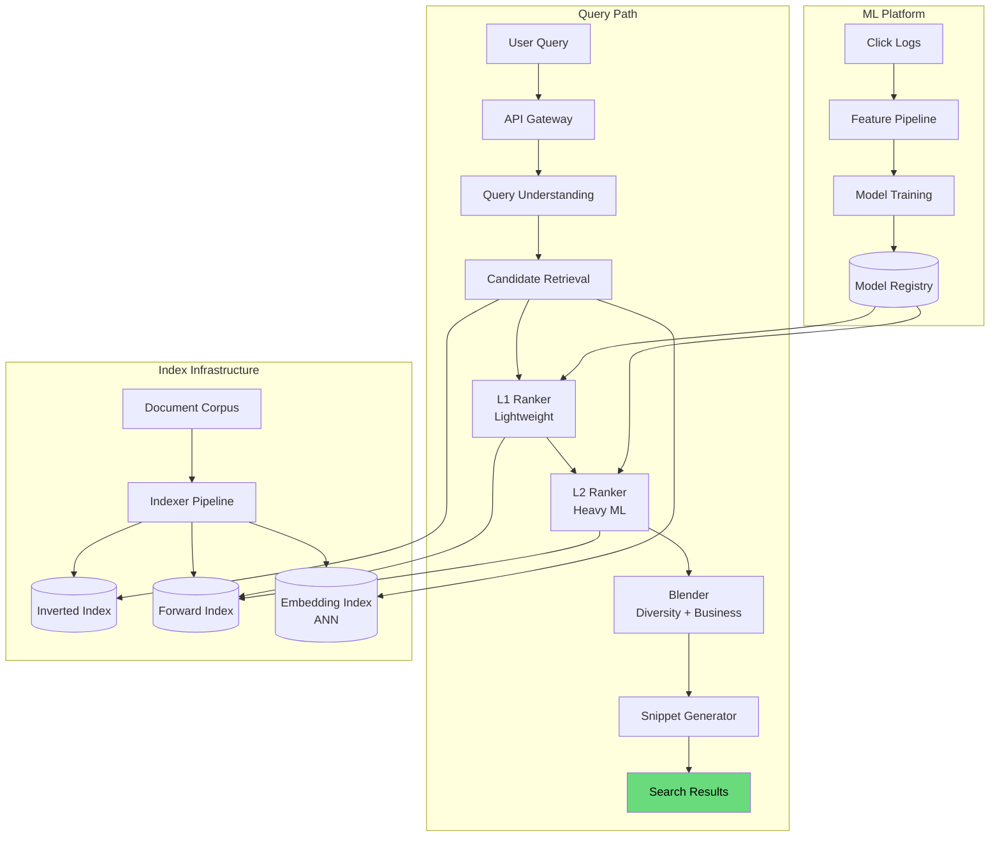
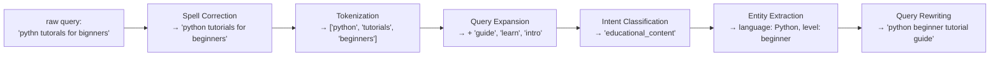
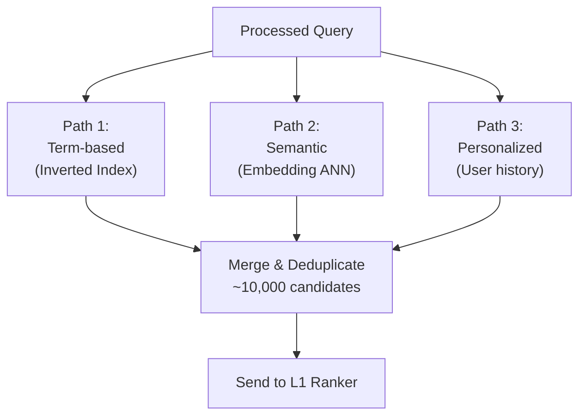
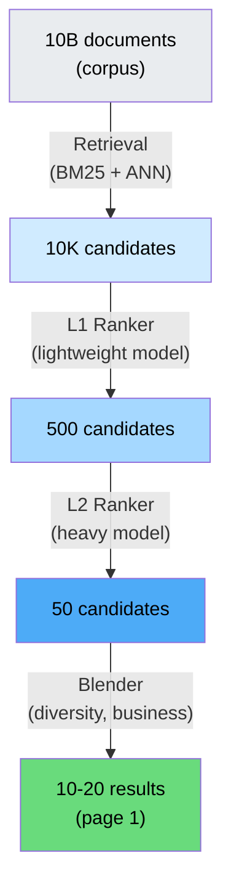
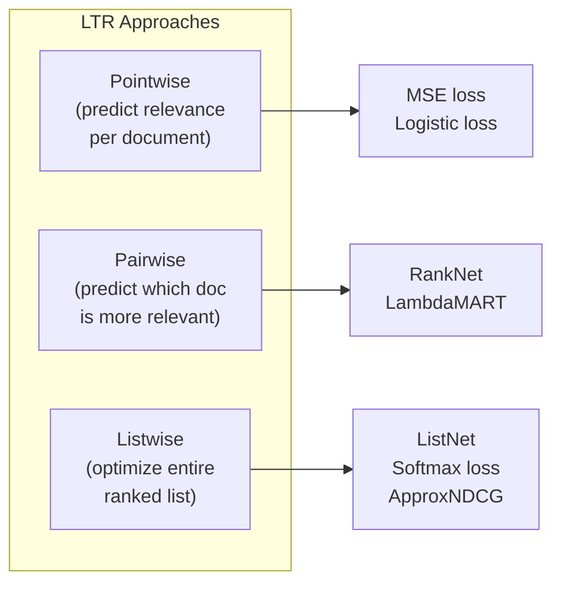
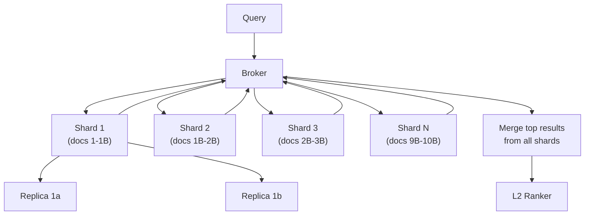
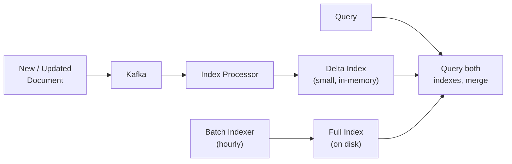

# Design Search Ranking System

Search ranking is how Google, Amazon, LinkedIn, and every search-powered product decide which results to show you first. The challenge is not finding results — inverted indexes do that. The challenge is ordering millions of candidates by relevance in under 200 milliseconds, while balancing freshness, personalization, diversity, and business objectives.

This walkthrough covers the full search ranking pipeline: query understanding, candidate retrieval, multi-stage ranking with learning-to-rank models, feature engineering, and evaluation frameworks.

---

## 1. Problem Statement & Requirements

### Functional Requirements

1. **Query processing** — Accept text queries, handle typos, synonyms, and intent classification
2. **Candidate retrieval** — Fetch relevant documents from a corpus of billions
3. **Ranking** — Order candidates by relevance using ML models
4. **Personalization** — Adjust ranking based on user history and preferences
5. **Freshness** — Recent content ranked appropriately (news, social posts)
6. **Spell correction** — "pythn tutoral" should return Python tutorials
7. **Query suggestions** — Autocomplete and "did you mean" suggestions
8. **Filters and facets** — Filter by category, price range, date, etc.
9. **Result snippets** — Generate relevant text snippets highlighting query terms

### Non-Functional Requirements

1. **Latency** — P99 < 200 ms end-to-end
2. **Throughput** — 100K queries per second at peak
3. **Availability** — 99.99% (search is the core product)
4. **Corpus size** — 10 billion documents
5. **Freshness** — New documents searchable within 5 minutes
6. **Scalability** — Support 10x growth without architecture changes

### Clarifying Questions

::: tip Questions to Ask
- What type of content are we searching? (Web pages, products, people, posts?)
- Is this a general search engine or domain-specific (e-commerce, job search)?
- How important is personalization vs universal relevance?
- What is the current click-through rate we are trying to improve?
- Do we need to handle multiple languages?
- Are there any content quality or safety constraints?
- Is real-time indexing required (social) or is batch acceptable (web)?
:::

---

## 2. Back-of-Envelope Estimation

### Traffic

- 100K QPS at peak, 40K QPS average
- Each query touches the ranking pipeline

$$
\text{Daily queries} = 40{,}000 \times 86{,}400 = 3.46 \text{ billion/day}
$$

### Ranking Compute

- Candidate retrieval returns ~10,000 documents per query
- L1 ranker reduces to ~500 candidates
- L2 ranker scores 500 candidates with full feature set

$$
\text{L2 scoring throughput} = 100K \text{ QPS} \times 500 \text{ candidates} = 50M \text{ scorings/second}
$$

### Index Size

- 10 billion documents, average 5 KB per document
- Raw corpus: 50 TB
- Inverted index: ~15% of corpus = 7.5 TB
- Forward index (features): ~20% = 10 TB
- Total index storage: ~70 TB (sharded across hundreds of machines)

### Latency Budget

| Stage | Budget | Parallelism |
|-------|--------|-------------|
| Query understanding | 10 ms | Serial |
| Candidate retrieval | 30 ms | Parallel across shards |
| L1 ranking | 20 ms | Parallel |
| L2 ranking | 50 ms | Sequential on reduced set |
| Snippet generation | 15 ms | Parallel |
| Blending / business rules | 5 ms | Sequential |
| **Total** | **~130 ms** | |

---

## 3. High-Level Design



---

## 4. Deep Dive: Query Understanding

Query understanding transforms raw user input into a structured intent before retrieval begins.

### Query Understanding Pipeline



### Spell Correction

```python
class SpellCorrector:
    """Noisy channel model: P(correction|query) ~ P(query|correction) * P(correction)"""

    def __init__(self, language_model, error_model):
        self.lm = language_model        # P(correction) from query logs
        self.em = error_model            # P(query|correction) from edit distance

    def correct(self, query: str) -> str:
        tokens = query.split()
        corrected = []

        for token in tokens:
            if token in self.lm.vocab:
                corrected.append(token)
                continue

            # Generate candidates within edit distance 2
            candidates = self.generate_candidates(token, max_edit_dist=2)

            # Score by noisy channel model
            best = max(
                candidates,
                key=lambda c: (
                    self.em.log_prob(token, c) +  # Error model
                    self.lm.log_prob(c)            # Language model
                )
            )
            corrected.append(best)

        return ' '.join(corrected)
```

### Intent Classification

| Query | Intent | Ranking Strategy |
|-------|--------|-----------------|
| "python tutorials" | Informational | Prioritize educational, high-quality content |
| "buy iphone 15 pro" | Transactional | Prioritize product pages, price, reviews |
| "amazon.com" | Navigational | Direct to the specific site |
| "weather nyc" | Instant answer | Show answer card above results |
| "pizza near me" | Local | Trigger local map results |

---

## 5. Deep Dive: Candidate Retrieval

Retrieval reduces the 10-billion-document corpus to ~10,000 candidates. This stage optimizes for **recall** — do not miss relevant results. Precision is handled by the ranker.

### Multi-Path Retrieval



### Term-Based Retrieval (BM25)

The classic inverted index with BM25 scoring:

```python
# BM25 scoring (simplified)
# score(D, Q) = SUM over query terms t:
#   IDF(t) * (tf(t,D) * (k1 + 1)) / (tf(t,D) + k1 * (1 - b + b * |D|/avgdl))

def bm25_score(query_terms, document, corpus_stats, k1=1.2, b=0.75):
    score = 0.0
    doc_len = len(document)
    avg_doc_len = corpus_stats.avg_doc_length

    for term in query_terms:
        tf = document.term_frequency(term)
        df = corpus_stats.doc_frequency(term)
        N = corpus_stats.total_docs

        idf = math.log((N - df + 0.5) / (df + 0.5) + 1)
        tf_component = (tf * (k1 + 1)) / (
            tf + k1 * (1 - b + b * doc_len / avg_doc_len)
        )
        score += idf * tf_component

    return score
```

### Semantic Retrieval (Dense Vectors)

For queries where term matching fails (e.g., "how to not feel sad" should match "dealing with depression"):

```python
# Encode query and documents with a bi-encoder (e.g., sentence-transformers)
from sentence_transformers import SentenceTransformer
import faiss

# Offline: build ANN index
model = SentenceTransformer('all-MiniLM-L6-v2')
doc_embeddings = model.encode(all_documents)  # Shape: (N, 384)

# Build FAISS index for approximate nearest neighbor
index = faiss.IndexIVFFlat(
    faiss.IndexFlatIP(384),  # Inner product (cosine after normalization)
    384,                      # Dimension
    1024                      # Number of clusters (nlist)
)
index.train(doc_embeddings)
index.add(doc_embeddings)

# Online: query
query_embedding = model.encode(["how to not feel sad"])
distances, indices = index.search(query_embedding, k=1000)
```

::: tip
Use **hybrid retrieval** — merge BM25 results with semantic results. Term matching catches exact keyword matches (product names, error codes), while semantic search catches conceptual matches. The ranker learns to reconcile both signals.
:::

---

## 6. Deep Dive: Multi-Stage Ranking

### The Ranking Funnel



### L1 Ranker (Lightweight)

The L1 ranker scores 10K candidates in < 20 ms. It uses a simple model with cheap-to-compute features:

```python
class L1Ranker:
    """Lightweight ranker: logistic regression or small GBDT."""

    def __init__(self):
        self.model = load_model("l1_ranker_v12.onnx")

    def score(self, query, candidates):
        features = []
        for doc in candidates:
            f = [
                doc.bm25_score,
                doc.semantic_similarity,
                doc.page_rank,
                doc.freshness_score,
                doc.click_through_rate,
                doc.domain_authority,
                len(set(query.terms) & set(doc.title_terms)),  # title overlap
                len(set(query.terms) & set(doc.url_terms)),    # URL overlap
            ]
            features.append(f)

        scores = self.model.predict(np.array(features))
        return sorted(
            zip(candidates, scores),
            key=lambda x: x[1],
            reverse=True
        )[:500]
```

### L2 Ranker (Heavy ML)

The L2 ranker scores 500 candidates with a full feature set (~200 features) using a cross-encoder or large GBDT:

| Feature Category | Count | Examples |
|-----------------|-------|---------|
| **Query-document** | 40 | BM25, semantic sim, title/body/URL term overlap |
| **Document quality** | 30 | PageRank, domain authority, content length, reading level |
| **Freshness** | 10 | Age, update frequency, time decay |
| **User context** | 25 | Past clicks on this domain, query history similarity |
| **Engagement** | 30 | Historical CTR, dwell time, bounce rate, share rate |
| **Semantic** | 20 | Cross-encoder score, entity match, topic overlap |
| **Business** | 15 | Sponsored flag, content type boost, diversity penalty |
| **Click model** | 30 | Position-debiased CTR, examination probability |

### Learning-to-Rank (LTR)



| Approach | Loss Function | Pros | Cons |
|----------|-------------|------|------|
| **Pointwise** | MSE on relevance label | Simple, fast training | Ignores relative ordering |
| **Pairwise (LambdaMART)** | Cross-entropy on pairs | Best accuracy for GBDT | O(n^2) pairs per query |
| **Listwise (ApproxNDCG)** | Differentiable NDCG | Directly optimizes target metric | Harder to train, needs neural model |

```python
import lightgbm as lgb

# LambdaMART with LightGBM
train_data = lgb.Dataset(
    X_train,
    label=y_train,
    group=query_groups_train  # How many docs per query
)

params = {
    'objective': 'lambdarank',
    'metric': 'ndcg',
    'ndcg_eval_at': [5, 10],
    'num_leaves': 255,
    'learning_rate': 0.05,
    'min_data_in_leaf': 50,
    'feature_fraction': 0.8,
}

model = lgb.train(
    params,
    train_data,
    num_boost_round=1000,
    valid_sets=[valid_data],
    callbacks=[lgb.early_stopping(50)]
)
```

---

## 7. Deep Dive: Click Models and Position Bias

Users are far more likely to click results at position 1 than position 5, regardless of relevance. Raw click data is biased by position.

### Position Bias

| Position | Examination Prob | Observed CTR | True Relevance CTR |
|----------|-----------------|-------------|-------------------|
| 1 | 100% | 35% | 35% |
| 2 | 85% | 22% | 26% |
| 3 | 70% | 14% | 20% |
| 5 | 45% | 6% | 13% |
| 10 | 15% | 1.5% | 10% |

### Inverse Propensity Weighting

```python
def debias_click_label(click, position, propensity_model):
    """Debias click signal using inverse propensity weighting."""
    exam_prob = propensity_model.examination_probability(position)

    if click:
        # Upweight clicks at low positions (they are more meaningful)
        return 1.0 / exam_prob
    else:
        # A non-click at position 1 means "not relevant"
        # A non-click at position 10 might mean "not examined"
        return 0.0  # Or use a soft label based on exam_prob

# Propensity estimated from randomization experiments
class PropensityModel:
    def examination_probability(self, position):
        # Estimated from position-swap experiments
        return 1.0 / (1.0 + 0.2 * position)
```

::: warning
If you train a ranking model on raw clicks without position debiasing, the model learns to rank already-top-ranked documents higher, creating a feedback loop that prevents new good content from surfacing. Always debias.
:::

---

## 8. Deep Dive: Online and Offline Evaluation

### Offline Metrics

| Metric | What It Measures | Formula |
|--------|-----------------|---------|
| **NDCG@K** | Quality of top K results | Normalized Discounted Cumulative Gain |
| **MAP** | Average precision across queries | Mean of per-query Average Precision |
| **MRR** | Position of first relevant result | Mean of 1/rank of first relevant result |
| **Precision@K** | Fraction of top K that are relevant | Relevant in top K / K |
| **Recall@K** | Fraction of relevant docs in top K | Relevant in top K / total relevant |

```python
def ndcg_at_k(relevance_scores, k=10):
    """Compute NDCG@K for a ranked list."""
    dcg = sum(
        rel / math.log2(i + 2)  # i+2 because log2(1) = 0
        for i, rel in enumerate(relevance_scores[:k])
    )

    ideal = sorted(relevance_scores, reverse=True)[:k]
    idcg = sum(
        rel / math.log2(i + 2)
        for i, rel in enumerate(ideal)
    )

    return dcg / idcg if idcg > 0 else 0.0
```

### Online Metrics (A/B Testing)

| Metric | Direction | What It Signals |
|--------|-----------|----------------|
| **Click-through rate** | Higher is better | Results look relevant |
| **Mean reciprocal rank of clicks** | Higher is better | Relevant results ranked higher |
| **Dwell time** | Longer is better | Users found useful content |
| **Pogo-sticking rate** | Lower is better | Users do not click back quickly |
| **Queries per session** | Depends | Lower can mean better (found answer), or worse (gave up) |
| **Zero-result rate** | Lower is better | Fewer queries with no results |
| **Abandonment rate** | Lower is better | Users engage with results |

::: tip
No single metric tells the whole story. A model that increases CTR but also increases pogo-sticking (quick back-clicks) is showing clickbait, not better results. Always monitor a dashboard of complementary metrics.
:::

### Interleaving Experiments

Interleaving is faster than A/B testing for detecting ranking differences. Instead of splitting users, interleave results from both models on every query:

```python
def team_draft_interleave(ranking_a, ranking_b, k=10):
    """Interleave two rankings using team-draft method."""
    interleaved = []
    team_a, team_b = [], []
    i, j = 0, 0

    while len(interleaved) < k and (i < len(ranking_a) or j < len(ranking_b)):
        # Alternate which team picks first (coin flip for first)
        if len(team_a) <= len(team_b):
            # Team A picks
            while i < len(ranking_a) and ranking_a[i] in interleaved:
                i += 1
            if i < len(ranking_a):
                interleaved.append(ranking_a[i])
                team_a.append(ranking_a[i])
                i += 1
        else:
            # Team B picks
            while j < len(ranking_b) and ranking_b[j] in interleaved:
                j += 1
            if j < len(ranking_b):
                interleaved.append(ranking_b[j])
                team_b.append(ranking_b[j])
                j += 1

    return interleaved, team_a, team_b
```

---

## 9. System Architecture Details

### Index Sharding



| Sharding Strategy | How | When |
|-------------------|-----|------|
| **Document-based** | Docs partitioned by hash(doc_id) | General purpose, even load |
| **Term-based** | Each shard owns certain terms | Rare, complex to manage |
| **Tiered** | Hot tier (recent, popular) + cold tier (archival) | Web search, news |
| **Geographic** | Docs sharded by region | Local search, maps |

### Real-Time Indexing



::: tip
Use a dual-index architecture: a large immutable base index rebuilt periodically, plus a small real-time delta index. Queries hit both, with results merged. The delta index is periodically folded into the base index. This is the approach used by Elasticsearch, Solr, and most production search systems.
:::

---

## 10. Handling Edge Cases

### Query-Specific Challenges

| Challenge | Solution |
|-----------|----------|
| **No results** | Relax query (drop terms), suggest alternatives, show related content |
| **Ambiguous queries** | Show diverse results ("apple" = company + fruit), add disambiguation card |
| **Very long queries** | Extract key terms, use semantic understanding to summarize intent |
| **Adversarial queries** | SEO spam detection, content quality classifier in ranking features |
| **Trending queries** | Boost freshness weight, pre-compute popular query results |
| **Sensitive queries** | Content safety classifier, safe search enforcement |

---

## Key Takeaways

1. **Multi-stage funnel** — retrieval (recall-optimized), L1 ranker (lightweight filter), L2 ranker (heavy ML), blender (diversity/business)
2. **Hybrid retrieval** — combine term-based (BM25) and semantic (ANN) retrieval for best recall
3. **LambdaMART dominates** — for GBDT-based ranking, pairwise learning-to-rank is the industry standard
4. **Position bias is real** — always debias click data before training ranking models
5. **Feature engineering matters more than model architecture** — 200 well-crafted features outperform a fancy model with poor features
6. **Interleaving > A/B testing** — interleaving detects ranking quality differences 10x faster
7. **Latency budget is sacred** — every millisecond in the ranking pipeline must be justified; pre-compute everything possible
