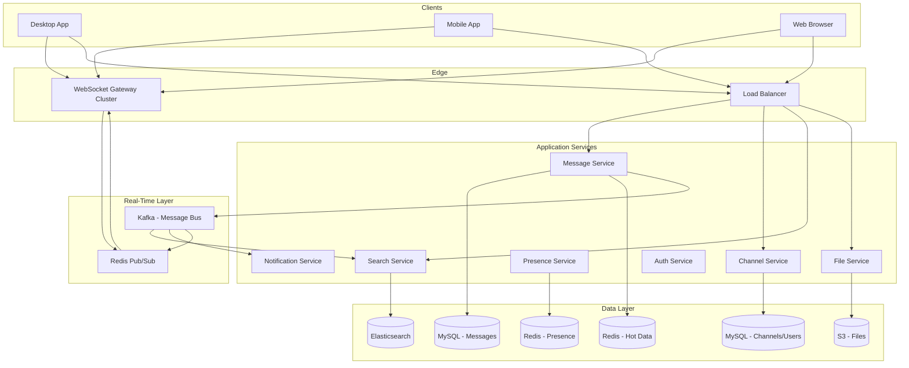
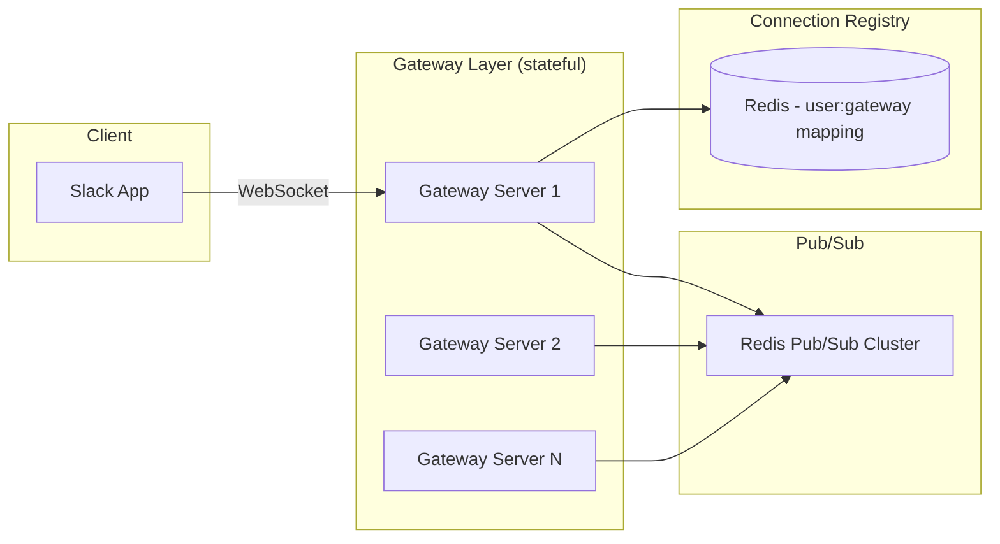
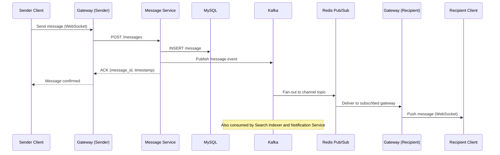
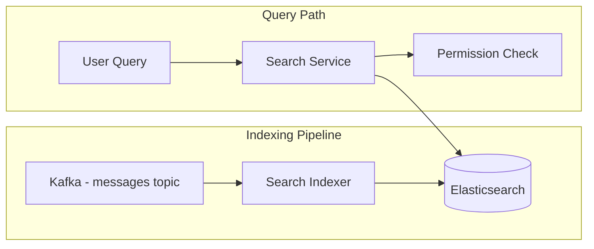
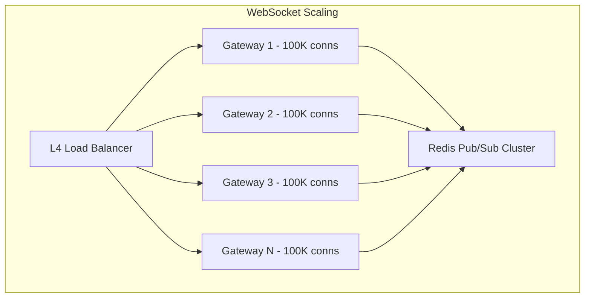

# Design Slack

Slack is a real-time workplace messaging platform. Designing it covers persistent WebSocket connections, channel-based messaging, threaded conversations, full-text search across message history, file sharing, presence indicators, and notifications — all while maintaining message ordering and delivery guarantees across distributed infrastructure.

---

## 1. Requirements Clarification

### Functional Requirements

1. **Channels** — Create public/private channels, join/leave, list members
2. **Direct messages** — 1:1 and group DMs
3. **Real-time messaging** — Send and receive messages with sub-second latency
4. **Threads** — Reply to messages in threads without cluttering the channel
5. **Message history** — Scroll back through history with pagination
6. **Search** — Full-text search across all messages, files, channels
7. **File sharing** — Upload and share images, documents, code snippets
8. **Reactions** — Add emoji reactions to messages
9. **Presence** — Show online/offline/away/DND status
10. **Notifications** — Push notifications for mentions, DMs, and keywords

### Non-Functional Requirements

1. **Real-time delivery** — Messages delivered to online users within 200ms
2. **High availability** — 99.99% uptime (< 52 minutes downtime/year)
3. **Message ordering** — Messages appear in correct order within a channel
4. **Durability** — Zero message loss; all messages persisted
5. **Scale** — 20M DAU, 750K organizations, 5B messages/week
6. **Consistency** — Read-your-writes consistency for the message sender
7. **Search latency** — Full-text search results in < 500ms

### Clarifying Questions

::: tip Questions to Ask
- What is the maximum message size?
- Do we need message editing and deletion?
- What file types and sizes should we support?
- How long should message history be retained?
- Do we need end-to-end encryption?
- Should we support bots and integrations?
:::

---

## 2. Back-of-the-Envelope Estimation

### Traffic

- 20M DAU across 750K workspaces
- Average user sends 40 messages/day, reads 200 messages/day

$$
\text{Message Send QPS} = \frac{20M \times 40}{86400} \approx 9{,}259 \text{ QPS}
$$

$$
\text{Peak Send QPS} \approx 9{,}259 \times 3 = 27{,}778 \text{ QPS}
$$

$$
\text{Message Read QPS} = \frac{20M \times 200}{86400} \approx 46{,}296 \text{ QPS}
$$

$$
\text{WebSocket connections} = 20M \times 1.5 \text{ (multi-device)} = 30M \text{ concurrent}
$$

### Storage

**Messages:**
- Average message size: 200 bytes (text) + 300 bytes (metadata) = 500 bytes

$$
\text{Daily messages} = 20M \times 40 = 800M \text{ messages/day}
$$

$$
\text{Daily storage} = 800M \times 500 \text{ B} = 400 \text{ GB/day}
$$

$$
\text{Annual storage} = 400 \text{ GB} \times 365 = 146 \text{ TB/year}
$$

**Files:**
- 5% of messages include a file, average file size 2 MB

$$
\text{Daily file storage} = 800M \times 0.05 \times 2 \text{ MB} = 80 \text{ TB/day}
$$

### Bandwidth

$$
\text{Message egress} = 46K \text{ QPS} \times 500 \text{ B} = 23 \text{ MB/s} = 184 \text{ Mbps}
$$

$$
\text{WebSocket overhead} = 30M \times 100 \text{ B heartbeat/30s} = 100 \text{ MB/s}
$$

---

## 3. High-Level Design



---

## 4. Detailed Design

### 4.1 WebSocket Connection Management

Each client maintains a persistent WebSocket connection. The WebSocket gateway layer is the critical real-time path.



```typescript
class WebSocketGateway {
  private connections: Map<string, WebSocket[]> = new Map(); // userId -> sockets

  async onConnect(ws: WebSocket, userId: string): Promise<void> {
    // 1. Register this connection
    if (!this.connections.has(userId)) {
      this.connections.set(userId, []);
    }
    this.connections.get(userId)!.push(ws);

    // 2. Register user-to-gateway mapping in Redis
    await this.redis.sadd(`user:${userId}:gateways`, this.gatewayId);
    await this.redis.expire(`user:${userId}:gateways`, 300);

    // 3. Subscribe to channels the user belongs to
    const channels = await this.channelService.getUserChannels(userId);
    for (const channel of channels) {
      await this.pubsub.subscribe(`channel:${channel.id}`);
    }

    // 4. Update presence
    await this.presenceService.setOnline(userId);

    // 5. Send initial state (unread counts, presence of contacts)
    const initialState = await this.buildInitialState(userId);
    ws.send(JSON.stringify({ type: 'hello', data: initialState }));
  }

  async onDisconnect(ws: WebSocket, userId: string): Promise<void> {
    const sockets = this.connections.get(userId) || [];
    const remaining = sockets.filter(s => s !== ws);

    if (remaining.length === 0) {
      this.connections.delete(userId);
      await this.redis.srem(`user:${userId}:gateways`, this.gatewayId);
      // Set presence to away after grace period (handle reconnects)
      await this.presenceService.scheduleOffline(userId, 30_000);
    } else {
      this.connections.set(userId, remaining);
    }
  }

  async deliverToUser(userId: string, message: any): Promise<void> {
    const sockets = this.connections.get(userId);
    if (sockets) {
      const payload = JSON.stringify(message);
      for (const ws of sockets) {
        ws.send(payload);
      }
    }
  }
}
```

### 4.2 Message Send & Delivery Flow



```typescript
class MessageService {
  async sendMessage(params: SendMessageParams): Promise<Message> {
    const { channelId, userId, text, threadTs, files } = params;

    // 1. Validate membership
    const isMember = await this.channelService.isMember(channelId, userId);
    if (!isMember) throw new ForbiddenError('Not a channel member');

    // 2. Generate message timestamp (Slack uses timestamps as IDs)
    // Format: epoch.sequence (e.g., "1679012345.000100")
    const ts = await this.generateMessageTs(channelId);

    // 3. Parse mentions and extract metadata
    const mentions = this.parseMentions(text);    // @user, @channel, @here
    const links = this.parseLinks(text);

    // 4. Persist message
    const message = await this.db.query(`
      INSERT INTO messages (channel_id, ts, user_id, text, thread_ts, has_files, mentions)
      VALUES (?, ?, ?, ?, ?, ?, ?)
    `, [channelId, ts, userId, text, threadTs, files?.length > 0, JSON.stringify(mentions)]);

    // 5. Update channel's latest message
    await this.cache.hset(`channel:${channelId}`, 'latest_ts', ts);

    // 6. Publish to Kafka for fan-out
    await this.kafka.send('messages', {
      key: channelId,
      value: {
        type: 'message.created',
        channelId,
        ts,
        userId,
        text,
        threadTs,
        mentions,
      },
    });

    // 7. Update unread counts for all channel members
    const members = await this.channelService.getMembers(channelId);
    const pipeline = this.redis.pipeline();
    for (const memberId of members) {
      if (memberId !== userId) {
        pipeline.hincrby(`unreads:${memberId}`, channelId, 1);
        // Track mention-specific unreads
        if (mentions.includes(memberId) || mentions.includes('@channel')) {
          pipeline.hincrby(`mentions:${memberId}`, channelId, 1);
        }
      }
    }
    await pipeline.exec();

    return message;
  }
}
```

### 4.3 Presence System

```typescript
class PresenceService {
  // Use Redis sorted sets with expiry for presence tracking
  // Score = last heartbeat timestamp

  async setOnline(userId: string): Promise<void> {
    const now = Date.now();
    await this.redis.zadd('presence:online', now, userId);

    // Broadcast to user's contacts
    await this.broadcastPresenceChange(userId, 'online');
  }

  async heartbeat(userId: string): Promise<void> {
    await this.redis.zadd('presence:online', Date.now(), userId);
  }

  async scheduleOffline(userId: string, delayMs: number): Promise<void> {
    // Don't immediately set offline — user might reconnect
    setTimeout(async () => {
      const gateways = await this.redis.smembers(`user:${userId}:gateways`);
      if (gateways.length === 0) {
        await this.redis.zrem('presence:online', userId);
        await this.broadcastPresenceChange(userId, 'offline');
      }
    }, delayMs);
  }

  async getPresence(userIds: string[]): Promise<Map<string, PresenceStatus>> {
    const result = new Map<string, PresenceStatus>();
    const now = Date.now();
    const AWAY_THRESHOLD = 5 * 60 * 1000; // 5 minutes

    for (const userId of userIds) {
      const lastSeen = await this.redis.zscore('presence:online', userId);
      if (!lastSeen) {
        result.set(userId, 'offline');
      } else if (now - Number(lastSeen) > AWAY_THRESHOLD) {
        result.set(userId, 'away');
      } else {
        result.set(userId, 'online');
      }
    }

    return result;
  }

  // Periodic cleanup: remove stale entries
  async cleanupStalePresence(): Promise<void> {
    const threshold = Date.now() - 10 * 60 * 1000; // 10 min
    await this.redis.zremrangebyscore('presence:online', '-inf', threshold);
  }
}
```

### 4.4 Search



```typescript
class SearchService {
  async search(userId: string, query: SearchQuery): Promise<SearchResults> {
    const { text, channelId, from, hasFile, before, after, cursor, limit } = query;

    // 1. Get channels the user has access to (for permission filtering)
    const accessibleChannels = await this.channelService.getUserChannels(userId);
    const channelIds = accessibleChannels.map(c => c.id);

    // 2. Build Elasticsearch query
    const esQuery = {
      bool: {
        must: [
          { match: { text: { query: text, operator: 'and' } } },
        ],
        filter: [
          { terms: { channel_id: channelIds } },  // Permission filter
          ...(channelId ? [{ term: { channel_id: channelId } }] : []),
          ...(from ? [{ term: { user_id: from } }] : []),
          ...(hasFile ? [{ term: { has_files: true } }] : []),
          ...(before ? [{ range: { ts: { lte: before } } }] : []),
          ...(after ? [{ range: { ts: { gte: after } } }] : []),
        ],
      },
    };

    // 3. Execute search
    const results = await this.es.search({
      index: 'messages',
      body: {
        query: esQuery,
        highlight: { fields: { text: {} } },
        sort: [{ _score: 'desc' }, { ts: 'desc' }],
        size: limit,
        search_after: cursor ? JSON.parse(cursor) : undefined,
      },
    });

    return {
      messages: results.hits.hits.map(hit => ({
        ...hit._source,
        highlights: hit.highlight?.text,
      })),
      cursor: results.hits.hits.length > 0
        ? JSON.stringify(results.hits.hits[results.hits.hits.length - 1].sort)
        : null,
      total: results.hits.total.value,
    };
  }
}
```

### 4.5 File Sharing

```typescript
class FileService {
  async uploadFile(userId: string, channelId: string, file: UploadedFile): Promise<FileRecord> {
    const fileId = generateId();

    // 1. Upload to S3
    const key = `files/${channelId}/${fileId}/${file.filename}`;
    await this.s3.upload({
      Bucket: 'slack-files',
      Key: key,
      Body: file.buffer,
      ContentType: file.mimetype,
    });

    // 2. Generate thumbnail for images
    let thumbnailUrl = null;
    if (file.mimetype.startsWith('image/')) {
      thumbnailUrl = await this.generateThumbnail(file.buffer, fileId);
    }

    // 3. Store metadata
    const record = await this.db.query(`
      INSERT INTO files (id, channel_id, user_id, filename, mimetype, size_bytes, s3_key, thumbnail_url)
      VALUES (?, ?, ?, ?, ?, ?, ?, ?)
    `, [fileId, channelId, userId, file.filename, file.mimetype, file.size, key, thumbnailUrl]);

    // 4. Index content for search (PDFs, text files)
    if (this.isSearchableType(file.mimetype)) {
      const content = await this.extractText(file);
      await this.searchService.indexFile(fileId, content, channelId);
    }

    return record;
  }
}
```

---

## 5. Data Model

### MySQL Schema (sharded by workspace_id)

```sql
-- Workspaces (organizations)
CREATE TABLE workspaces (
    id              BIGINT PRIMARY KEY AUTO_INCREMENT,
    name            VARCHAR(255) NOT NULL,
    domain          VARCHAR(100) UNIQUE,
    plan            ENUM('free', 'pro', 'business', 'enterprise'),
    created_at      TIMESTAMP DEFAULT CURRENT_TIMESTAMP
);

-- Channels
CREATE TABLE channels (
    id              BIGINT PRIMARY KEY AUTO_INCREMENT,
    workspace_id    BIGINT NOT NULL,
    name            VARCHAR(80),
    topic           VARCHAR(500),
    purpose         VARCHAR(500),
    type            ENUM('public', 'private', 'dm', 'group_dm'),
    is_archived     BOOLEAN DEFAULT FALSE,
    member_count    INT DEFAULT 0,
    created_by      BIGINT NOT NULL,
    created_at      TIMESTAMP DEFAULT CURRENT_TIMESTAMP,
    INDEX idx_workspace (workspace_id, type)
);

-- Channel Membership
CREATE TABLE channel_members (
    channel_id      BIGINT NOT NULL,
    user_id         BIGINT NOT NULL,
    role            ENUM('member', 'admin', 'owner') DEFAULT 'member',
    last_read_ts    VARCHAR(20),            -- last message timestamp the user has read
    muted           BOOLEAN DEFAULT FALSE,
    joined_at       TIMESTAMP DEFAULT CURRENT_TIMESTAMP,
    PRIMARY KEY (channel_id, user_id),
    INDEX idx_user_channels (user_id)
);

-- Messages (sharded by channel_id, partitioned by date)
CREATE TABLE messages (
    channel_id      BIGINT NOT NULL,
    ts              VARCHAR(20) NOT NULL,   -- Slack-style timestamp ID: "1679012345.000100"
    user_id         BIGINT NOT NULL,
    text            TEXT,
    thread_ts       VARCHAR(20),            -- parent message ts (NULL for top-level)
    reply_count     INT DEFAULT 0,
    has_files       BOOLEAN DEFAULT FALSE,
    has_reactions   BOOLEAN DEFAULT FALSE,
    mentions        JSON,
    edited_at       TIMESTAMP,
    deleted_at      TIMESTAMP,
    PRIMARY KEY (channel_id, ts),
    INDEX idx_thread (channel_id, thread_ts, ts)
) PARTITION BY RANGE (UNIX_TIMESTAMP(
    FROM_UNIXTIME(CAST(SUBSTRING_INDEX(ts, '.', 1) AS UNSIGNED))
));

-- Reactions
CREATE TABLE reactions (
    channel_id      BIGINT NOT NULL,
    message_ts      VARCHAR(20) NOT NULL,
    user_id         BIGINT NOT NULL,
    emoji           VARCHAR(100) NOT NULL,
    created_at      TIMESTAMP DEFAULT CURRENT_TIMESTAMP,
    PRIMARY KEY (channel_id, message_ts, user_id, emoji)
);

-- Files
CREATE TABLE files (
    id              BIGINT PRIMARY KEY AUTO_INCREMENT,
    channel_id      BIGINT NOT NULL,
    user_id         BIGINT NOT NULL,
    filename        VARCHAR(255) NOT NULL,
    mimetype        VARCHAR(100),
    size_bytes      BIGINT,
    s3_key          VARCHAR(500),
    thumbnail_url   VARCHAR(500),
    created_at      TIMESTAMP DEFAULT CURRENT_TIMESTAMP,
    INDEX idx_channel (channel_id, created_at DESC)
);
```

### Redis Data Structures

```
# Unread counts per user
Key: unreads:{userId}
Type: Hash { channelId -> unreadCount }

# Mention counts per user
Key: mentions:{userId}
Type: Hash { channelId -> mentionCount }

# Presence tracking
Key: presence:online
Type: Sorted Set { userId -> lastHeartbeatTimestamp }

# User-to-gateway mapping
Key: user:{userId}:gateways
Type: Set { gatewayId1, gatewayId2 }

# Channel latest message cache
Key: channel:{channelId}
Type: Hash { latest_ts, latest_text, latest_user }

# Rate limiting
Key: ratelimit:{userId}:messages
Type: String (counter with TTL)
```

---

## 6. API Design

```typescript
// WebSocket message protocol
type WSMessage =
  | { type: 'message'; channel: string; text: string; thread_ts?: string }
  | { type: 'typing'; channel: string }
  | { type: 'presence_change'; user: string; status: 'online' | 'away' | 'offline' }
  | { type: 'reaction_added'; channel: string; ts: string; emoji: string }
  | { type: 'mark_read'; channel: string; ts: string };

// REST API endpoints

// POST /api/v1/chat.postMessage
interface PostMessageRequest {
  channel: string;
  text: string;
  thread_ts?: string;
  attachments?: Attachment[];
  blocks?: Block[];
}

interface PostMessageResponse {
  ok: boolean;
  channel: string;
  ts: string;      // message timestamp/ID
  message: Message;
}

// GET /api/v1/conversations.history?channel=C123&cursor=abc&limit=50
// GET /api/v1/conversations.replies?channel=C123&ts=1679012345.000100
// GET /api/v1/conversations.list?types=public_channel,private_channel

// POST /api/v1/conversations.create
interface CreateChannelRequest {
  name: string;
  is_private: boolean;
  team_id: string;
}

// POST /api/v1/reactions.add
interface AddReactionRequest {
  channel: string;
  timestamp: string;
  name: string;     // emoji name without colons
}

// GET /api/v1/search.messages?query=deploy+in:engineering+from:alice
// GET /api/v1/users.getPresence?user=U123
// POST /api/v1/files.upload (multipart/form-data)
```

---

## 7. Scaling

### WebSocket Gateway Scaling

| Challenge | Solution |
|-----------|----------|
| 30M concurrent connections | Horizontal scaling — each gateway handles ~100K connections; need ~300 servers |
| Connection routing | Redis stores user-to-gateway mapping; fan-out via Pub/Sub |
| Gateway failure | Client reconnects to any gateway; Redis registry enables session migration |
| Cross-gateway delivery | Redis Pub/Sub or internal message bus between gateways |



### Message Database Scaling

```
Messages table: Shard by workspace_id (all messages for a workspace co-located)
  - Within each shard, partition by time (monthly partitions)
  - Hot data (last 30 days): SSD-backed MySQL with read replicas
  - Cold data (older): compressed and archived to cheaper storage

Channel members table: Shard by workspace_id
  - Heavily cached in Redis (membership checks on every message)

Read replicas: 3 per shard for message history reads
```

### Search Scaling

- Elasticsearch cluster: 1 index per workspace (large workspaces get dedicated shards)
- Index messages asynchronously via Kafka consumers
- Retention: free plan indexes last 90 days; paid plans index everything
- Use routing by workspace_id for query efficiency

::: tip Slack's Real Architecture
Slack migrated from MySQL to Vitess (sharded MySQL) to handle their message growth. They also use a service called "Channel Server" that holds channel state in memory for fast membership checks and message routing.
:::

---

## 8. Trade-offs & Alternatives

### Message Delivery: Push vs Pull

| Approach | Latency | Complexity | Resource Usage |
|----------|---------|------------|----------------|
| WebSocket push (Slack's choice) | ~100ms | High (connection management) | High (persistent connections) |
| Long polling | ~1-2s | Medium | Medium (frequent reconnects) |
| Short polling | ~5-30s | Low | Low (but wasteful) |
| SSE (Server-Sent Events) | ~100ms | Medium | Medium (one-way only) |

**Decision:** WebSocket for real-time delivery. Fall back to long polling for constrained environments.

### Message Storage: SQL vs NoSQL

| Aspect | MySQL/Vitess (Slack's choice) | Cassandra | DynamoDB |
|--------|-------------------------------|-----------|----------|
| Consistency | Strong (ACID) | Tunable | Strong (per-item) |
| Message ordering | Natural (timestamp PK) | Clustering key ordering | Sort key ordering |
| Range queries | Excellent | Good | Good |
| Operational cost | High (sharding) | High (wide rows) | Low (managed) |
| **Verdict** | Battle-tested for messaging | Good for write-heavy | Good for serverless |

### Presence: Centralized vs Gossip

| Approach | Accuracy | Scalability | Complexity |
|----------|----------|-------------|------------|
| Centralized Redis (chosen) | High | Limited by Redis cluster | Low |
| Gossip protocol (SWIM) | Eventual | Excellent | High |
| Heartbeat + expiry | Medium | Good | Low |

::: warning Presence at Scale
For 20M concurrent users, centralized presence tracking requires a large Redis cluster. Consider batching presence updates and only broadcasting changes to users who are currently viewing a workspace where the affected user is a member.
:::

---

## 9. Common Interview Questions

::: details "How do you guarantee message ordering in a channel?"
Use the channel as the Kafka partition key, ensuring all messages for a channel are processed sequentially. The message timestamp (ts) serves as both the ID and the ordering key. Within MySQL, the primary key is (channel_id, ts), which provides natural ordering. For concurrent writes to the same channel, the Message Service uses an atomic counter to generate unique, monotonically increasing timestamps.
:::

::: details "How do you handle a channel with 50,000 members?"
For large channels, fan-out on write becomes expensive. Use a hybrid approach: push messages via Pub/Sub to online users (they're subscribed to the channel topic), and let offline users pull on reconnect by querying their unread messages. Batch presence updates for large channels. Use the channel-level Pub/Sub topic rather than per-user delivery to avoid 50K individual pushes.
:::

::: details "What happens when a WebSocket gateway crashes?"
The client detects the disconnect and reconnects to any available gateway (via load balancer). On reconnect, the client sends its last known message timestamp. The server replays any missed messages since that timestamp. Redis stores the user-to-gateway mapping, which is cleaned up when the gateway fails health checks. The 30-second grace period before marking a user offline prevents flapping during reconnects.
:::

::: details "How do you implement 'typing' indicators efficiently?"
Typing events are ephemeral — they don't need persistence or delivery guarantees. Send them directly through WebSocket/Pub/Sub without writing to Kafka or the database. Throttle typing events client-side (max 1 per 3 seconds). The gateway broadcasts to other channel members currently connected. If a typing event is lost, the UX impact is negligible.
:::

::: details "How do you implement message search with access control?"
Index all messages in Elasticsearch, including the channel_id. At query time, first fetch the list of channels the user has access to (from Redis cache), then add a terms filter to the ES query restricting results to those channel IDs. This ensures users never see messages from channels they can't access. Cache the channel access list per user with a 5-minute TTL.
:::

### Time Allocation (45-minute interview)

| Phase | Time | Focus |
|-------|------|-------|
| Requirements | 4 min | Real-time messaging, channels, threads, search |
| Estimation | 3 min | 20M DAU, 30M connections, message QPS |
| High-level design | 8 min | WebSocket gateways, message flow, data stores |
| WebSocket & delivery | 10 min | Connection management, fan-out, Pub/Sub |
| Message storage | 8 min | Schema, ordering, sharding by workspace |
| Search & presence | 7 min | Elasticsearch indexing, Redis presence |
| Scaling | 5 min | Gateway scaling, database sharding, search |

---

## Summary

| Component | Technology | Scale |
|-----------|-----------|-------|
| WebSocket Gateway | Custom stateful servers | 30M concurrent connections |
| Message Bus | Kafka (partitioned by channel) | 28K peak QPS |
| Message Storage | MySQL/Vitess (sharded by workspace) | 800M messages/day |
| Presence | Redis Sorted Sets | 20M users tracked |
| Unread Counts | Redis Hashes | Real-time per-user counters |
| Search | Elasticsearch | 146 TB/year indexed |
| File Storage | S3 | 80 TB/day |
| Real-Time Pub/Sub | Redis Pub/Sub | Channel-level fan-out |
| Notifications | Kafka + APNs/FCM | Push for offline users |
