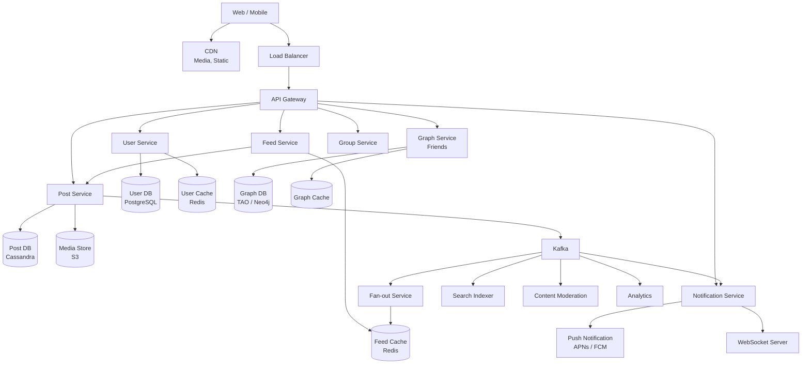
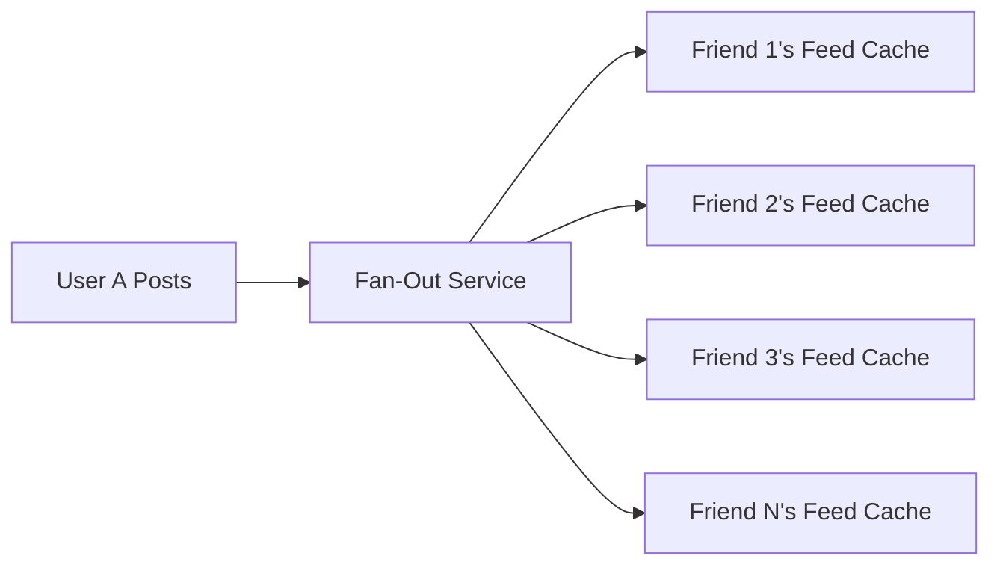
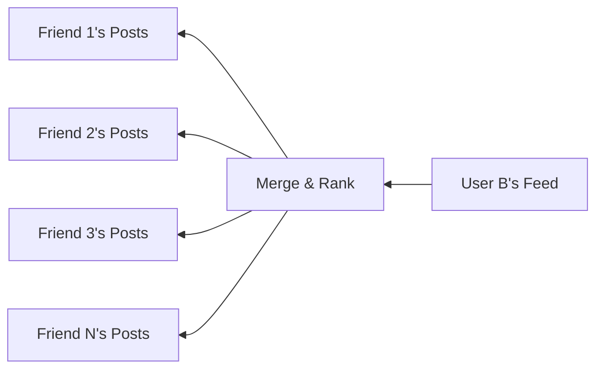

# Design Facebook / Social Network

## 1. Problem Statement & Requirements

Design a social network like Facebook where users create profiles, connect with friends, share posts, and interact with a personalized news feed.

### Functional Requirements

| # | Requirement |
|---|-------------|
| FR-1 | User profiles (create, edit, view) |
| FR-2 | Friend/follow system (send request, accept, unfriend) |
| FR-3 | Create posts (text, images, video, links) |
| FR-4 | News feed: personalized, ranked timeline |
| FR-5 | Reactions (like, love, haha, etc.) and comments |
| FR-6 | Groups and events |
| FR-7 | Privacy controls (who can see posts) |
| FR-8 | Notifications (real-time) |
| FR-9 | Content moderation (spam, hate speech detection) |

### Non-Functional Requirements

| # | Requirement | Target |
|---|-------------|--------|
| NFR-1 | Availability | 99.99% |
| NFR-2 | News feed latency | p99 < 500 ms |
| NFR-3 | Post publishing latency | p99 < 2 s |
| NFR-4 | DAU | 2 billion |
| NFR-5 | Consistency | Eventual (feed), Strong (friend graph) |
| NFR-6 | Feed freshness | < 30 seconds |

---

## 2. Back-of-Envelope Estimation

### Traffic

- DAU: 2 billion
- Posts per user per day: 0.5 (1 billion posts/day)
- Feed refreshes per user per day: 10
- Average friends per user: 300

$$
\text{Feed QPS} = \frac{2 \times 10^9 \times 10}{86400} \approx 231{,}481 \text{ QPS}
$$

$$
\text{Peak feed QPS} \approx 3 \times 231{,}481 \approx 694{,}444 \text{ QPS}
$$

$$
\text{Post write QPS} = \frac{10^9}{86400} \approx 11{,}574 \text{ QPS}
$$

### Fan-out Calculation

When a user with 300 friends publishes a post (push model):

$$
\text{Fan-out writes/sec} = 11{,}574 \times 300 = 3.47 \times 10^6 \text{ writes/sec}
$$

For a celebrity with 10M followers:

$$
\text{Celebrity fan-out} = 10{,}000{,}000 \text{ writes per post!}
$$

### Storage

- Post record: ~1 KB text + metadata
- Posts per day: 1 billion

$$
\text{Post storage/day} = 10^9 \times 1 \text{ KB} = 1 \text{ TB/day}
$$

- Photos/videos: 200M uploads/day x average 2 MB:

$$
\text{Media storage/day} = 200 \times 10^6 \times 2 \text{ MB} = 400 \text{ TB/day}
$$

- Friend edges: 2B users x 300 friends / 2 = 300B edges

$$
\text{Graph storage} = 300 \times 10^9 \times 32 \text{ bytes} = 9.6 \text{ TB}
$$

---

## 3. High-Level Design



### API Design

```typescript
// POST /v1/posts
interface CreatePostRequest {
  content: string;
  mediaIds?: string[];       // Pre-uploaded media
  visibility: 'PUBLIC' | 'FRIENDS' | 'PRIVATE' | 'CUSTOM';
  allowedUserIds?: string[]; // For CUSTOM visibility
  taggedUserIds?: string[];
  locationId?: string;
}

// GET /v1/feed?cursor=xxx&limit=20
interface FeedResponse {
  posts: FeedPost[];
  nextCursor: string;
  hasMore: boolean;
}

interface FeedPost {
  postId: string;
  author: UserSummary;
  content: string;
  media?: MediaInfo[];
  createdAt: string;
  reactions: ReactionSummary;
  commentCount: number;
  shareCount: number;
  isLikedByMe: boolean;
  feedReason: string;        // "Your friend posted", "Suggested for you"
}

// POST /v1/friends/request
interface FriendRequest {
  targetUserId: string;
}

// POST /v1/posts/:postId/reactions
interface ReactionRequest {
  type: 'LIKE' | 'LOVE' | 'HAHA' | 'WOW' | 'SAD' | 'ANGRY';
}
```

---

## 4. Database Schema

### Users

```sql
CREATE TABLE users (
    user_id         UUID PRIMARY KEY,
    username        VARCHAR(50) UNIQUE NOT NULL,
    email           VARCHAR(255) UNIQUE NOT NULL,
    display_name    VARCHAR(100),
    bio             TEXT,
    avatar_url      VARCHAR(500),
    cover_url       VARCHAR(500),
    location        VARCHAR(200),
    privacy_level   VARCHAR(20) DEFAULT 'FRIENDS',
    created_at      TIMESTAMPTZ DEFAULT NOW(),
    last_active     TIMESTAMPTZ DEFAULT NOW()
);
```

### Friendships (Graph Edges)

```sql
CREATE TABLE friendships (
    user_id_1       UUID NOT NULL,
    user_id_2       UUID NOT NULL,
    status          VARCHAR(20) NOT NULL, -- 'PENDING', 'ACCEPTED', 'BLOCKED'
    initiated_by    UUID NOT NULL,
    created_at      TIMESTAMPTZ DEFAULT NOW(),
    PRIMARY KEY (user_id_1, user_id_2),
    CHECK (user_id_1 < user_id_2)        -- Canonical ordering
);

CREATE INDEX idx_friendships_user1 ON friendships(user_id_1, status);
CREATE INDEX idx_friendships_user2 ON friendships(user_id_2, status);
```

### Posts (Cassandra-style)

```sql
-- Cassandra table: partition by user_id for timeline queries
-- CREATE TABLE posts (
--   user_id UUID,
--   post_id TIMEUUID,
--   content TEXT,
--   media_urls LIST<TEXT>,
--   visibility TEXT,
--   reaction_count MAP<TEXT, BIGINT>,
--   comment_count BIGINT,
--   created_at TIMESTAMP,
--   PRIMARY KEY (user_id, post_id)
-- ) WITH CLUSTERING ORDER BY (post_id DESC);

-- PostgreSQL equivalent for schema illustration:
CREATE TABLE posts (
    post_id         UUID PRIMARY KEY,
    user_id         UUID NOT NULL,
    content         TEXT,
    media_urls      JSONB,
    visibility      VARCHAR(20) DEFAULT 'FRIENDS',
    allowed_users   UUID[],
    location_id     UUID,
    tagged_users    UUID[],
    reaction_counts JSONB DEFAULT '{}',
    comment_count   INT DEFAULT 0,
    share_count     INT DEFAULT 0,
    is_deleted      BOOLEAN DEFAULT FALSE,
    created_at      TIMESTAMPTZ DEFAULT NOW()
) PARTITION BY RANGE (created_at);

CREATE INDEX idx_posts_user ON posts(user_id, created_at DESC);
```

### Reactions

```sql
CREATE TABLE reactions (
    post_id         UUID NOT NULL,
    user_id         UUID NOT NULL,
    reaction_type   VARCHAR(10) NOT NULL,
    created_at      TIMESTAMPTZ DEFAULT NOW(),
    PRIMARY KEY (post_id, user_id)
);

CREATE INDEX idx_reactions_user ON reactions(user_id, created_at DESC);
```

### Comments

```sql
CREATE TABLE comments (
    comment_id      UUID PRIMARY KEY,
    post_id         UUID NOT NULL,
    user_id         UUID NOT NULL,
    parent_id       UUID,                   -- For threaded comments
    content         TEXT NOT NULL,
    reaction_counts JSONB DEFAULT '{}',
    created_at      TIMESTAMPTZ DEFAULT NOW(),
    is_deleted      BOOLEAN DEFAULT FALSE
);

CREATE INDEX idx_comments_post ON comments(post_id, created_at);
CREATE INDEX idx_comments_parent ON comments(parent_id);
```

---

## 5. Detailed Component Design

### 5.1 News Feed: Fan-Out Strategies

The central challenge of a social network is: how do you generate a personalized feed for 2 billion users?

#### Fan-Out on Write (Push Model)

When a user publishes a post, immediately push it into all friends' feed caches.



**Pros:** Feed reads are fast (pre-computed). **Cons:** Expensive for popular users (celebrity problem).

#### Fan-Out on Read (Pull Model)

When a user opens their feed, fetch posts from all friends in real time.



**Pros:** No wasted writes. **Cons:** Slow feed reads (must merge N post lists).

#### Hybrid Approach (Facebook's Choice)

```typescript
class FeedService {
  private feedCache: RedisCluster;
  private postService: PostService;
  private graphService: GraphService;
  private ranker: FeedRanker;

  // Threshold: users with > 10K followers use pull model
  private readonly CELEBRITY_THRESHOLD = 10_000;

  async getFeed(
    userId: string,
    cursor: string | null,
    limit: number = 20
  ): Promise<FeedResponse> {
    // 1. Get pre-computed feed from cache (push model results)
    const cachedPosts = await this.getCachedFeed(userId, cursor, limit * 2);

    // 2. Get posts from celebrity friends (pull model)
    const celebrityFriends = await this.graphService
      .getCelebrityFriends(userId, this.CELEBRITY_THRESHOLD);

    const celebrityPosts = await Promise.all(
      celebrityFriends.map((friendId) =>
        this.postService.getRecentPosts(friendId, 5)
      )
    );

    // 3. Merge and deduplicate
    const allPosts = this.mergePosts(
      cachedPosts,
      celebrityPosts.flat()
    );

    // 4. Rank using ML model
    const ranked = await this.ranker.rank(userId, allPosts);

    // 5. Return top results with cursor
    const pageResults = ranked.slice(0, limit);
    const nextCursor = pageResults.length > 0
      ? pageResults[pageResults.length - 1].postId
      : null;

    return {
      posts: pageResults,
      nextCursor: nextCursor ?? '',
      hasMore: ranked.length > limit,
    };
  }
}
```

::: info War Story
Facebook's real feed system uses a hybrid approach. For normal users (< 5K friends), posts are fanned out on write. For celebrities and pages with millions of followers, posts are pulled on read and merged. This is sometimes called "fan-out with celebrity exception."
:::

### 5.2 Fan-Out Service

```typescript
class FanOutService {
  private graphService: GraphService;
  private feedCache: RedisCluster;
  private kafka: KafkaConsumer;
  private readonly FEED_MAX_SIZE = 1000; // Max posts in feed cache

  async processPost(event: PostCreatedEvent): Promise<void> {
    const authorId = event.userId;
    const followerCount = await this.graphService
      .getFollowerCount(authorId);

    if (followerCount > 10_000) {
      // Celebrity: skip fan-out, handled on read
      return;
    }

    // Get all friends
    const friends = await this.graphService.getFriends(authorId);

    // Filter by visibility
    const visibleTo = await this.filterByVisibility(
      event, friends
    );

    // Fan-out to all visible friends' feeds
    const pipeline = this.feedCache.multi();
    for (const friendId of visibleTo) {
      const feedKey = `feed:${friendId}`;
      pipeline.lpush(feedKey, JSON.stringify({
        postId: event.postId,
        authorId,
        score: Date.now(),
        createdAt: event.createdAt,
      }));
      pipeline.ltrim(feedKey, 0, this.FEED_MAX_SIZE - 1);
    }

    await pipeline.exec();
  }

  private async filterByVisibility(
    post: PostCreatedEvent,
    friends: string[]
  ): Promise<string[]> {
    switch (post.visibility) {
      case 'PUBLIC':
        return friends;
      case 'FRIENDS':
        return friends; // All friends
      case 'PRIVATE':
        return []; // Only author's timeline
      case 'CUSTOM':
        return friends.filter((f) =>
          post.allowedUserIds?.includes(f)
        );
      default:
        return friends;
    }
  }
}
```

### 5.3 Feed Ranking

```typescript
class FeedRanker {
  private mlClient: MLModelClient;

  async rank(
    userId: string,
    posts: FeedPost[]
  ): Promise<FeedPost[]> {
    // Feature extraction for each post
    const features = await Promise.all(
      posts.map((post) => this.extractFeatures(userId, post))
    );

    // ML model scoring
    const scores = await this.mlClient.batchPredict(features);

    // Combine with diversity/freshness heuristics
    const scored = posts.map((post, i) => ({
      ...post,
      relevanceScore: scores[i],
    }));

    // Sort by score, then apply diversity rules
    scored.sort((a, b) => b.relevanceScore - a.relevanceScore);

    return this.applyDiversityRules(scored);
  }

  private async extractFeatures(
    userId: string,
    post: FeedPost
  ): Promise<number[]> {
    return [
      // Author features
      await this.getInteractionScore(userId, post.author.userId),
      post.author.followerCount,

      // Post features
      post.reactions.total,
      post.commentCount,
      post.shareCount,
      post.media ? 1 : 0,
      post.media?.length ?? 0,

      // Temporal features
      (Date.now() - new Date(post.createdAt).getTime()) / 3600_000,

      // User-post affinity
      await this.getCategoryAffinity(userId, post.category),
    ];
  }

  /**
   * Prevent the feed from being dominated by a single
   * author or content type.
   */
  private applyDiversityRules(posts: FeedPost[]): FeedPost[] {
    const result: FeedPost[] = [];
    const authorCounts = new Map<string, number>();
    const typeCounts = new Map<string, number>();

    for (const post of posts) {
      const authorCount = authorCounts.get(post.author.userId) ?? 0;
      if (authorCount >= 3) continue; // Max 3 posts per author

      const typeCount = typeCounts.get(post.contentType) ?? 0;
      // Don't let one type dominate (e.g., max 50% text-only)
      if (typeCount > result.length * 0.5 && result.length > 5) {
        continue;
      }

      result.push(post);
      authorCounts.set(post.author.userId, authorCount + 1);
      typeCounts.set(post.contentType, typeCount + 1);
    }

    return result;
  }
}
```

### 5.4 Graph Service (Friend Relationships)

```typescript
class GraphService {
  private graphDB: GraphDatabase;
  private cache: RedisCluster;

  async sendFriendRequest(
    fromUserId: string,
    toUserId: string
  ): Promise<void> {
    // Enforce canonical ordering for storage
    const [id1, id2] = [fromUserId, toUserId].sort();

    await this.graphDB.query(`
      INSERT INTO friendships (user_id_1, user_id_2, status, initiated_by)
      VALUES ($1, $2, 'PENDING', $3)
      ON CONFLICT (user_id_1, user_id_2) DO NOTHING
    `, [id1, id2, fromUserId]);

    // Notify the recipient
    await this.notificationService.send(toUserId, {
      type: 'FRIEND_REQUEST',
      fromUserId,
    });
  }

  async acceptFriendRequest(
    userId: string,
    requesterId: string
  ): Promise<void> {
    const [id1, id2] = [userId, requesterId].sort();

    await this.graphDB.query(`
      UPDATE friendships
      SET status = 'ACCEPTED'
      WHERE user_id_1 = $1 AND user_id_2 = $2
        AND status = 'PENDING'
        AND initiated_by = $3
    `, [id1, id2, requesterId]);

    // Invalidate caches
    await this.cache.del(`friends:${userId}`);
    await this.cache.del(`friends:${requesterId}`);
    await this.cache.del(`friend_count:${userId}`);
    await this.cache.del(`friend_count:${requesterId}`);
  }

  async getFriends(userId: string): Promise<string[]> {
    const cached = await this.cache.smembers(`friends:${userId}`);
    if (cached.length > 0) return cached;

    const result = await this.graphDB.query(`
      SELECT CASE
        WHEN user_id_1 = $1 THEN user_id_2
        ELSE user_id_1
      END AS friend_id
      FROM friendships
      WHERE (user_id_1 = $1 OR user_id_2 = $1)
        AND status = 'ACCEPTED'
    `, [userId]);

    const friendIds = result.rows.map((r) => r.friend_id);

    // Cache friend list
    if (friendIds.length > 0) {
      await this.cache.sadd(`friends:${userId}`, ...friendIds);
      await this.cache.expire(`friends:${userId}`, 3600);
    }

    return friendIds;
  }

  /**
   * Find mutual friends between two users.
   */
  async getMutualFriends(
    userId1: string,
    userId2: string
  ): Promise<string[]> {
    const [friends1, friends2] = await Promise.all([
      this.getFriends(userId1),
      this.getFriends(userId2),
    ]);

    const set2 = new Set(friends2);
    return friends1.filter((f) => set2.has(f));
  }

  /**
   * People You May Know: friends-of-friends, weighted by mutual connections.
   */
  async getSuggestions(userId: string): Promise<FriendSuggestion[]> {
    const friends = await this.getFriends(userId);
    const friendSet = new Set(friends);

    const fofCounts = new Map<string, number>();

    for (const friendId of friends.slice(0, 100)) {
      const fof = await this.getFriends(friendId);
      for (const candidate of fof) {
        if (candidate === userId || friendSet.has(candidate)) continue;
        fofCounts.set(candidate, (fofCounts.get(candidate) ?? 0) + 1);
      }
    }

    return Array.from(fofCounts.entries())
      .sort(([, a], [, b]) => b - a)
      .slice(0, 50)
      .map(([candidateId, mutualCount]) => ({
        userId: candidateId,
        mutualFriends: mutualCount,
      }));
  }
}
```

### 5.5 Notification Service

```typescript
class NotificationService {
  private redis: RedisCluster;
  private wsManager: WebSocketManager;
  private pushGateway: PushGateway;

  async send(
    userId: string,
    notification: Notification
  ): Promise<void> {
    // 1. Store notification
    const notifId = crypto.randomUUID();
    await this.redis.lpush(
      `notifs:${userId}`,
      JSON.stringify({ ...notification, id: notifId, read: false, createdAt: Date.now() })
    );
    await this.redis.ltrim(`notifs:${userId}`, 0, 499);

    // 2. Increment unread counter
    await this.redis.incr(`notifs:unread:${userId}`);

    // 3. Real-time delivery via WebSocket
    const delivered = await this.wsManager.sendToUser(
      userId, { type: 'NOTIFICATION', data: notification }
    );

    // 4. If not connected, send push notification
    if (!delivered) {
      const preferences = await this.getUserPreferences(userId);
      if (preferences.pushEnabled) {
        await this.pushGateway.send(userId, {
          title: notification.title,
          body: notification.body,
          data: { type: notification.type, entityId: notification.entityId },
        });
      }
    }
  }

  async getNotifications(
    userId: string,
    cursor: number = 0,
    limit: number = 20
  ): Promise<NotificationList> {
    const notifs = await this.redis.lrange(
      `notifs:${userId}`, cursor, cursor + limit - 1
    );

    // Mark as read
    await this.redis.set(`notifs:unread:${userId}`, '0');

    return {
      notifications: notifs.map((n) => JSON.parse(n)),
      nextCursor: cursor + limit,
      unreadCount: 0,
    };
  }
}
```

### 5.6 Content Moderation

```typescript
class ContentModerationService {
  private textClassifier: MLModelClient;
  private imageClassifier: MLModelClient;

  async moderatePost(post: Post): Promise<ModerationResult> {
    const signals: ModerationSignal[] = [];

    // 1. Text analysis
    if (post.content) {
      const textResult = await this.textClassifier.predict({
        text: post.content,
        categories: [
          'hate_speech', 'harassment', 'violence',
          'spam', 'misinformation', 'adult_content',
        ],
      });

      for (const [category, score] of Object.entries(textResult.scores)) {
        if (score > 0.5) {
          signals.push({ type: 'text', category, score });
        }
      }
    }

    // 2. Image analysis (if media attached)
    if (post.mediaUrls?.length > 0) {
      for (const url of post.mediaUrls) {
        const imageResult = await this.imageClassifier.predict({
          imageUrl: url,
          checks: ['nudity', 'violence', 'hate_symbols'],
        });

        for (const [check, score] of Object.entries(imageResult.scores)) {
          if (score > 0.7) {
            signals.push({ type: 'image', category: check, score });
          }
        }
      }
    }

    // 3. Decision
    const maxScore = Math.max(...signals.map((s) => s.score), 0);

    if (maxScore > 0.9) {
      return { action: 'REMOVE', signals, requiresReview: false };
    } else if (maxScore > 0.7) {
      return { action: 'QUEUE_FOR_REVIEW', signals, requiresReview: true };
    } else if (maxScore > 0.5) {
      return { action: 'REDUCE_DISTRIBUTION', signals, requiresReview: false };
    }

    return { action: 'APPROVE', signals, requiresReview: false };
  }
}
```

---

## 6. Scaling & Bottlenecks

### What Breaks First?

| Bottleneck | Symptom | Solution |
|-----------|---------|----------|
| Fan-out for celebrities | Minutes to propagate a popular post | Hybrid push/pull model |
| Feed cache memory | 2B users x 1000 posts cache | Only cache active users (last 7 days) |
| Graph queries (friend-of-friend) | Slow friend suggestions | Pre-compute, cache friend lists |
| Media upload/serving | Bandwidth bottleneck | CDN, chunked upload, transcoding pipeline |
| Real-time notifications | WebSocket connection count | Sticky sessions, connection pooling |

### Feed Cache Sizing

$$
\text{Active users (30-day)} \approx 1.5 \times 10^9
$$

$$
\text{Feed cache per user} = 1000 \text{ posts} \times 200 \text{ bytes} = 200 \text{ KB}
$$

$$
\text{Total feed cache} = 1.5 \times 10^9 \times 200 \text{ KB} = 300 \text{ TB}
$$

This requires a large Redis cluster (or similar in-memory store) sharded across many nodes.

---

## 7. Trade-offs & Alternatives

| Decision | Option A | Option B | Our Choice |
|----------|----------|----------|------------|
| Feed generation | Push (fan-out on write) | Pull (fan-out on read) | **Hybrid** -- push for normal users, pull for celebrities |
| Post storage | PostgreSQL | Cassandra | **Cassandra** -- time-series queries, horizontal scaling |
| Graph storage | PostgreSQL + adjacency list | Graph DB (TAO/Neo4j) | **TAO-like** custom graph store with heavy caching |
| Notifications | Polling | WebSocket + push | **WebSocket** for online, **push** for offline |
| Feed ranking | Chronological | ML-ranked | **ML-ranked** with chronological option |

---

## 8. Advanced Topics

### 8.1 Privacy Architecture

```typescript
class PrivacyService {
  async canView(
    viewerId: string,
    postAuthorId: string,
    post: Post
  ): Promise<boolean> {
    if (viewerId === postAuthorId) return true;

    switch (post.visibility) {
      case 'PUBLIC':
        return true;
      case 'FRIENDS':
        return this.graphService.areFriends(viewerId, postAuthorId);
      case 'FRIENDS_OF_FRIENDS':
        const mutual = await this.graphService.getMutualFriends(
          viewerId, postAuthorId
        );
        return mutual.length > 0;
      case 'CUSTOM':
        return post.allowedUsers?.includes(viewerId) ?? false;
      case 'PRIVATE':
        return false;
      default:
        return false;
    }
  }
}
```

### 8.2 Activity Aggregation

Instead of showing "Alice liked your post" and "Bob liked your post" separately, aggregate: "Alice, Bob, and 5 others liked your post."

### 8.3 Anti-Abuse Systems

Monitor for: fake accounts, coordinated inauthentic behavior, engagement bots, account scraping, and spam rings.

---

## 9. Interview Tips

::: tip Focus on the Feed
The news feed is the core differentiator. Spend most of your time on the feed generation strategy (push vs. pull vs. hybrid) and ranking algorithm.
:::

::: warning Common Mistakes
- Not addressing the celebrity problem (fan-out to millions)
- Using a simple chronological feed (real social networks use ML ranking)
- Forgetting privacy filters during feed generation
- Not discussing content moderation (critical for any social platform)
- Using a single database for everything (profiles, posts, graph need different storage engines)
:::

::: details Sample Interview Timeline (45 min)
| Time | Phase |
|------|-------|
| 0-5 min | Requirements & scope |
| 5-10 min | Back-of-envelope: fan-out calculation |
| 10-18 min | High-level architecture |
| 18-28 min | Deep dive: news feed (push vs. pull vs. hybrid) |
| 28-35 min | Feed ranking |
| 35-40 min | Friend graph & privacy |
| 40-45 min | Notifications, moderation, trade-offs |
:::

### Key Talking Points

1. **Why hybrid fan-out?** Pure push is infeasible for celebrities (10M writes per post). Pure pull is too slow (merge 300 friend timelines). Hybrid gives the best of both.
2. **How is the feed ranked?** ML model considers: author affinity, post engagement signals, content type, recency, and diversity requirements.
3. **How to handle 2B users?** Shard everything: user DB by user_id, posts by user_id + time, feed cache by user_id. Only cache active users.
4. **Privacy at scale?** Privacy checks must be efficient because they run on every feed item. Cache friend lists in Redis sets for O(1) membership checks.
5. **Why Cassandra for posts?** Time-series access pattern (latest posts by user), write-heavy workload, horizontal scalability across data centers.
