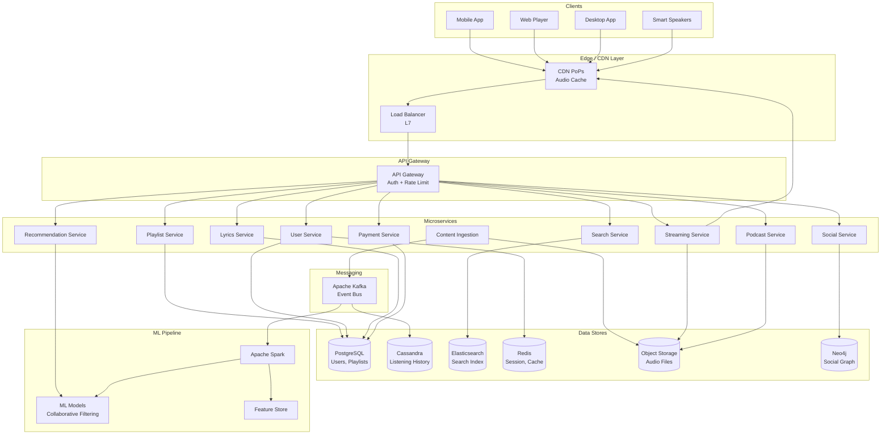
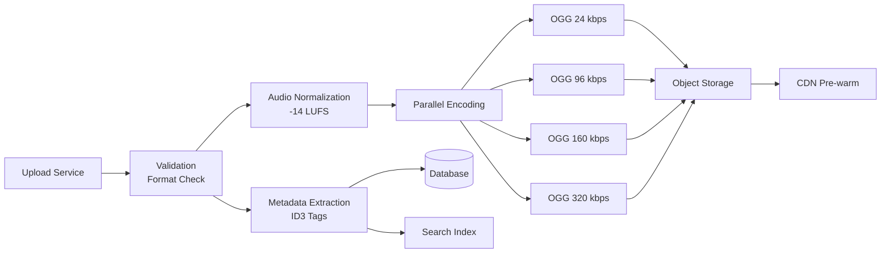
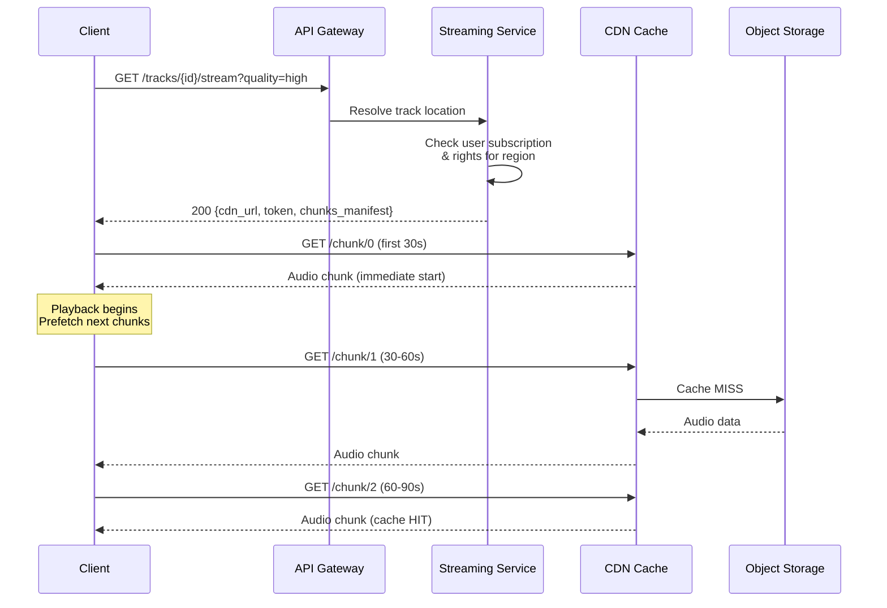
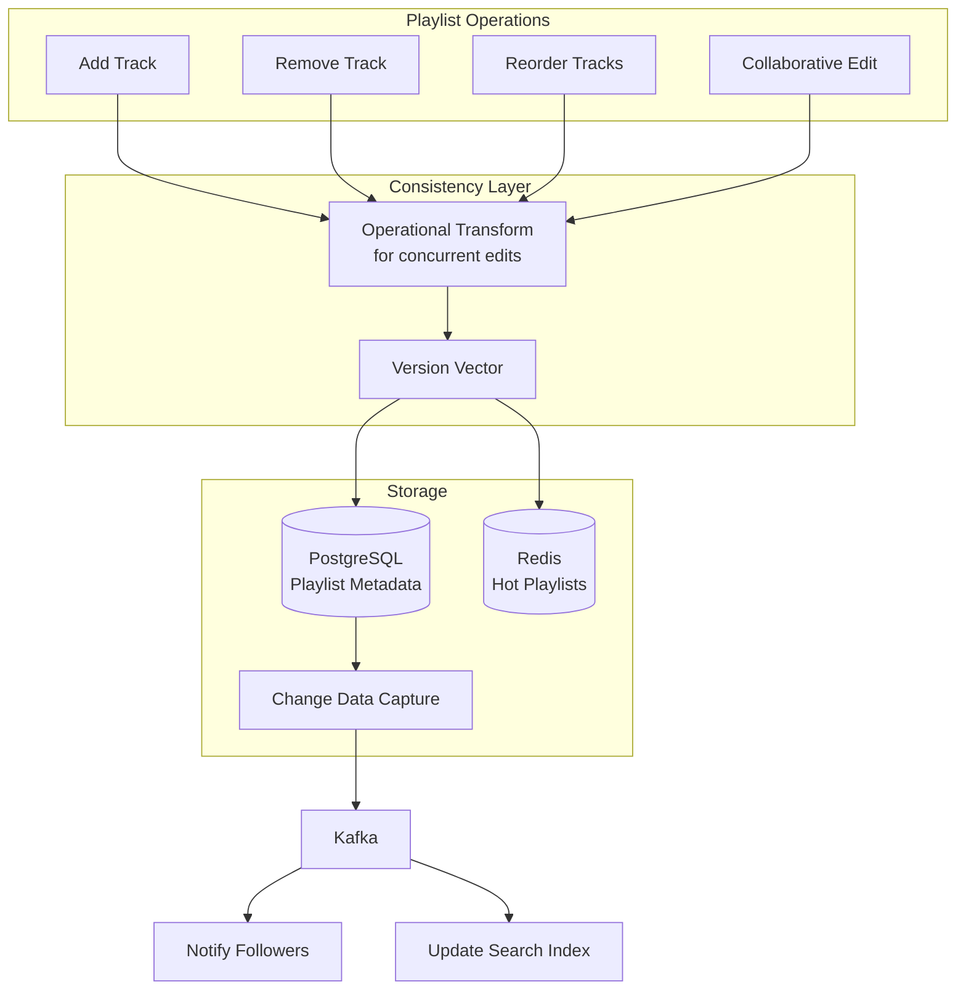
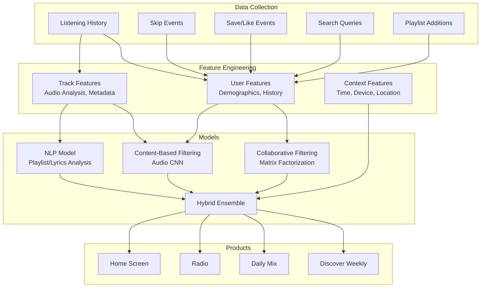
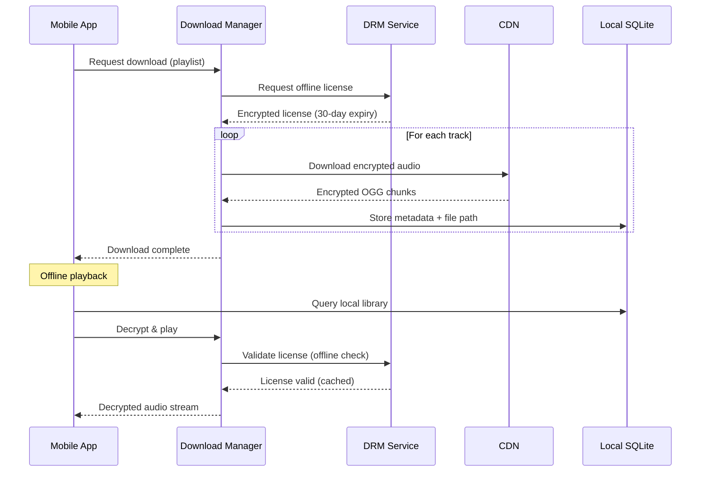
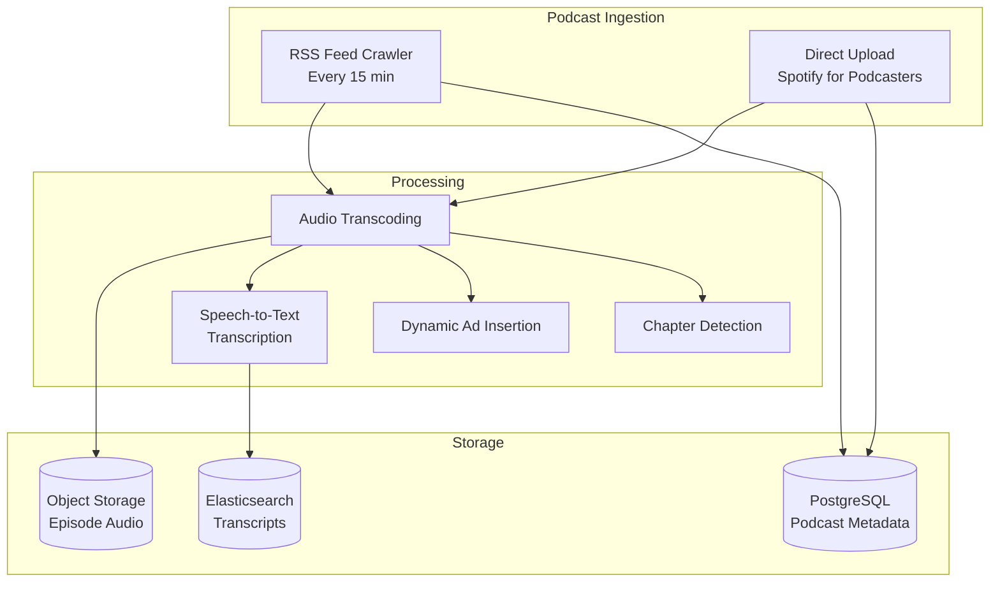
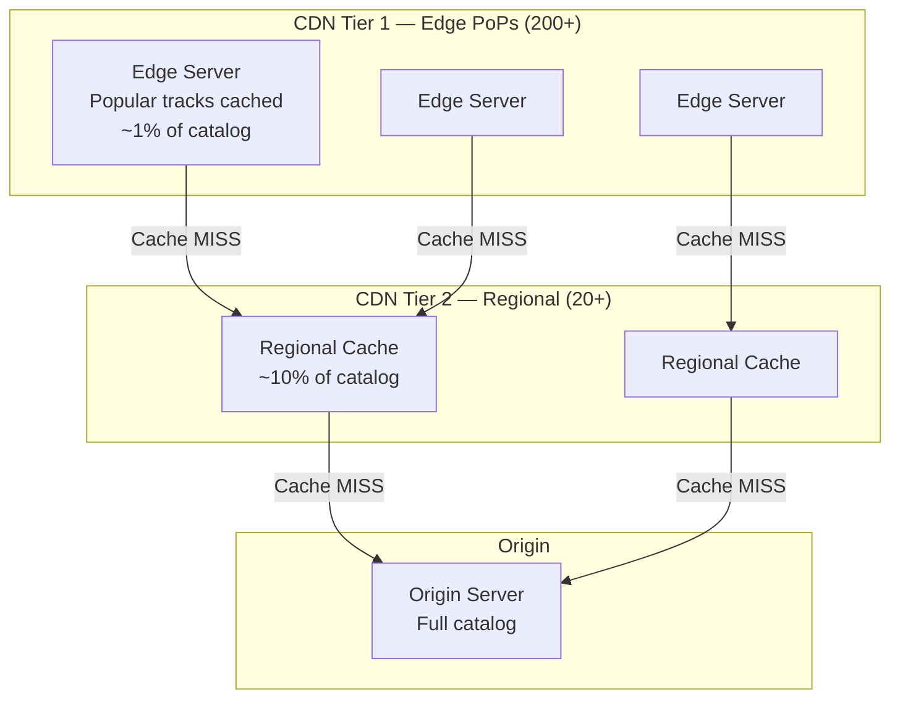
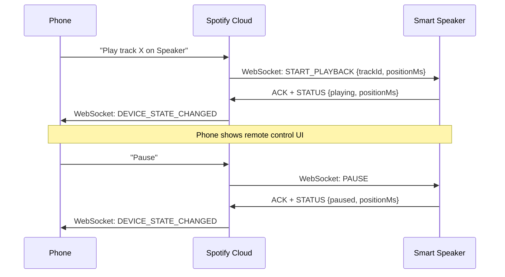

# Design Spotify — Music Streaming Platform

## 1. Problem Statement & Requirements

### Functional Requirements

| # | Requirement | Details |
|---|-------------|---------|
| FR-1 | Music Streaming | Stream songs on demand with play/pause/seek |
| FR-2 | Search | Search by song, artist, album, genre, lyrics |
| FR-3 | Playlists | Create, edit, share, collaborative playlists |
| FR-4 | Recommendations | Personalized Discover Weekly, Daily Mix, Radio |
| FR-5 | Offline Mode | Download songs for offline playback |
| FR-6 | Lyrics Sync | Real-time synchronized lyrics display |
| FR-7 | Podcasts | Stream and download podcast episodes |
| FR-8 | Social | Follow artists, friends, share listening activity |
| FR-9 | Library | Save albums, songs, podcasts to personal library |
| FR-10 | Queue | Manage playback queue with drag-and-drop reorder |

### Non-Functional Requirements

| # | Requirement | Target |
|---|-------------|--------|
| NFR-1 | Availability | 99.99% uptime (< 52 min downtime/year) |
| NFR-2 | Latency | Song playback start < 200ms |
| NFR-3 | Throughput | Support 100M+ concurrent streams |
| NFR-4 | Consistency | Eventual consistency for playlists, strong for payments |
| NFR-5 | Durability | Zero data loss for user data and audio files |
| NFR-6 | Scalability | 600M+ registered users, 200M+ premium |

---

## 2. Back-of-Envelope Estimation

### User Scale

$$
\text{Total Users} = 600M \quad \text{DAU} = 200M \quad \text{Concurrent} \approx 30M
$$

### Storage Estimation

**Music Library:**

$$
\text{Total Songs} = 100M
$$

$$
\text{Avg Song Duration} = 3.5 \text{ min} = 210 \text{ sec}
$$

$$
\text{Bitrates Stored} = \{24, 96, 160, 320\} \text{ kbps (OGG Vorbis)}
$$

$$
\text{Avg File Size (320 kbps)} = 210 \times 320 / 8 = 8.4 \text{ MB}
$$

$$
\text{Storage per song (all bitrates)} \approx 8.4 + 4.2 + 2.1 + 0.63 \approx 15.3 \text{ MB}
$$

$$
\text{Total Music Storage} = 100M \times 15.3 \text{ MB} = 1.53 \text{ EB}
$$

**Metadata & User Data:**

$$
\text{User Metadata} = 600M \times 5 \text{ KB} = 3 \text{ TB}
$$

$$
\text{Playlist Data} = 4B \text{ playlists} \times 2 \text{ KB avg} = 8 \text{ TB}
$$

$$
\text{Listening History} = 200M \text{ DAU} \times 30 \text{ songs/day} \times 100 \text{ B} = 600 \text{ GB/day}
$$

### Bandwidth Estimation

$$
\text{Concurrent Streams} = 30M
$$

$$
\text{Avg Bitrate} = 160 \text{ kbps}
$$

$$
\text{Bandwidth} = 30M \times 160 \text{ kbps} = 4.8 \text{ Tbps}
$$

### QPS Estimation

$$
\text{Play Requests} = \frac{200M \times 30}{86400} \approx 69{,}444 \text{ req/s}
$$

$$
\text{Search QPS} \approx 50{,}000 \text{ req/s}
$$

$$
\text{Metadata QPS} \approx 200{,}000 \text{ req/s}
$$

---

## 3. High-Level Design

### Architecture Diagram



### API Design

```typescript
// Streaming APIs
GET  /api/v1/tracks/{trackId}/stream?quality=high
GET  /api/v1/tracks/{trackId}/metadata
POST /api/v1/tracks/{trackId}/play-event

// Search APIs
GET  /api/v1/search?q={query}&type=track,artist,album&limit=20&offset=0

// Playlist APIs
POST   /api/v1/playlists
GET    /api/v1/playlists/{playlistId}
PUT    /api/v1/playlists/{playlistId}
POST   /api/v1/playlists/{playlistId}/tracks
DELETE /api/v1/playlists/{playlistId}/tracks/{trackId}

// Recommendation APIs
GET /api/v1/recommendations/discover-weekly
GET /api/v1/recommendations/daily-mix
GET /api/v1/recommendations/radio?seed_track={trackId}

// Offline APIs
POST /api/v1/downloads/{trackId}
GET  /api/v1/downloads/status

// Lyrics APIs
GET /api/v1/tracks/{trackId}/lyrics

// Podcast APIs
GET  /api/v1/podcasts/{podcastId}/episodes
GET  /api/v1/podcasts/{podcastId}/episodes/{episodeId}/stream
POST /api/v1/podcasts/{podcastId}/subscribe
```

---

## 4. Database Schema

### Users Table (PostgreSQL)

```sql
CREATE TABLE users (
    user_id         UUID PRIMARY KEY DEFAULT gen_random_uuid(),
    email           VARCHAR(255) UNIQUE NOT NULL,
    username        VARCHAR(50) UNIQUE NOT NULL,
    display_name    VARCHAR(100),
    password_hash   VARCHAR(255) NOT NULL,
    subscription    VARCHAR(20) DEFAULT 'free', -- free, premium, family, student
    country         CHAR(2) NOT NULL,
    created_at      TIMESTAMPTZ DEFAULT NOW(),
    updated_at      TIMESTAMPTZ DEFAULT NOW()
);

CREATE INDEX idx_users_email ON users(email);
CREATE INDEX idx_users_country ON users(country);
```

### Tracks Table (PostgreSQL)

```sql
CREATE TABLE tracks (
    track_id        UUID PRIMARY KEY DEFAULT gen_random_uuid(),
    title           VARCHAR(500) NOT NULL,
    artist_id       UUID NOT NULL REFERENCES artists(artist_id),
    album_id        UUID REFERENCES albums(album_id),
    duration_ms     INTEGER NOT NULL,
    isrc            VARCHAR(12) UNIQUE,
    explicit        BOOLEAN DEFAULT FALSE,
    popularity      SMALLINT DEFAULT 0,
    release_date    DATE,
    audio_files     JSONB NOT NULL, -- {"320kbps": "s3://...", "160kbps": "s3://..."}
    created_at      TIMESTAMPTZ DEFAULT NOW()
);

CREATE INDEX idx_tracks_artist ON tracks(artist_id);
CREATE INDEX idx_tracks_album ON tracks(album_id);
CREATE INDEX idx_tracks_popularity ON tracks(popularity DESC);
CREATE INDEX idx_tracks_release ON tracks(release_date DESC);
```

### Playlists Table (PostgreSQL)

```sql
CREATE TABLE playlists (
    playlist_id     UUID PRIMARY KEY DEFAULT gen_random_uuid(),
    owner_id        UUID NOT NULL REFERENCES users(user_id),
    name            VARCHAR(200) NOT NULL,
    description     TEXT,
    is_public       BOOLEAN DEFAULT TRUE,
    collaborative   BOOLEAN DEFAULT FALSE,
    cover_image_url VARCHAR(500),
    follower_count  INTEGER DEFAULT 0,
    created_at      TIMESTAMPTZ DEFAULT NOW(),
    updated_at      TIMESTAMPTZ DEFAULT NOW()
);

CREATE TABLE playlist_tracks (
    playlist_id     UUID NOT NULL REFERENCES playlists(playlist_id),
    track_id        UUID NOT NULL REFERENCES tracks(track_id),
    position        INTEGER NOT NULL,
    added_by        UUID REFERENCES users(user_id),
    added_at        TIMESTAMPTZ DEFAULT NOW(),
    PRIMARY KEY (playlist_id, track_id)
);

CREATE INDEX idx_playlist_tracks_pos ON playlist_tracks(playlist_id, position);
```

### Listening History (Cassandra)

```sql
CREATE TABLE listening_history (
    user_id     UUID,
    listened_at TIMESTAMP,
    track_id    UUID,
    duration_ms INT,
    context     TEXT,       -- playlist, album, radio, search
    source      TEXT,       -- mobile, web, desktop
    PRIMARY KEY ((user_id), listened_at)
) WITH CLUSTERING ORDER BY (listened_at DESC)
  AND default_time_to_live = 31536000; -- 1 year TTL
```

### Lyrics Table (PostgreSQL)

```sql
CREATE TABLE lyrics (
    track_id        UUID PRIMARY KEY REFERENCES tracks(track_id),
    provider        VARCHAR(50) NOT NULL,
    synced_lyrics   JSONB, -- [{"time_ms": 0, "text": "..."}, ...]
    plain_lyrics    TEXT,
    language        CHAR(2),
    updated_at      TIMESTAMPTZ DEFAULT NOW()
);
```

---

## 5. Detailed Component Design

### 5.1 Audio Storage & Encoding Pipeline

When a label or artist uploads a track, it goes through a multi-stage ingestion pipeline.



**Encoding details:**

```typescript
interface AudioEncodingJob {
  trackId: string;
  sourceFile: string; // Lossless WAV/FLAC from label
  outputProfiles: EncodingProfile[];
}

interface EncodingProfile {
  codec: 'ogg_vorbis' | 'aac' | 'opus';
  bitrate: number;       // kbps
  sampleRate: number;    // 44100 or 48000
  channels: number;      // 1 (mono for low) or 2 (stereo)
  loudnessTarget: number; // -14 LUFS (Spotify standard)
}

const ENCODING_PROFILES: EncodingProfile[] = [
  { codec: 'ogg_vorbis', bitrate: 24,  sampleRate: 22050, channels: 1, loudnessTarget: -14 },
  { codec: 'ogg_vorbis', bitrate: 96,  sampleRate: 44100, channels: 2, loudnessTarget: -14 },
  { codec: 'ogg_vorbis', bitrate: 160, sampleRate: 44100, channels: 2, loudnessTarget: -14 },
  { codec: 'ogg_vorbis', bitrate: 320, sampleRate: 44100, channels: 2, loudnessTarget: -14 },
];
```

**Audio normalization** uses ReplayGain / loudness normalization to -14 LUFS so all songs play at consistent volume. This prevents listeners from constantly adjusting volume between tracks.

**Storage layout in object storage:**

```
s3://spotify-audio/
  tracks/
    {track_id}/
      24kbps.ogg
      96kbps.ogg
      160kbps.ogg
      320kbps.ogg
      waveform.json    # For seek bar visualization
      fingerprint.bin  # Audio fingerprint for dedup
```

### 5.2 Streaming Protocol

Spotify uses a custom streaming protocol inspired by HLS/DASH but optimized for audio.

**Chunked streaming approach:**



**Key design decisions:**

1. **Chunk size: 30 seconds** — Balance between seek granularity and request overhead
2. **Prefetch: 2 chunks ahead** — Ensures gapless playback
3. **Adaptive bitrate** — Client monitors bandwidth and downgrades quality if needed

```typescript
class AudioStreamManager {
  private currentQuality: number = 160;
  private bandwidthSamples: number[] = [];

  async getNextChunk(trackId: string, chunkIndex: number): Promise<AudioChunk> {
    const quality = this.selectQuality();
    const url = `${this.cdnBase}/tracks/${trackId}/${quality}kbps/chunk_${chunkIndex}`;

    const start = performance.now();
    const response = await fetch(url, {
      headers: { Authorization: `Bearer ${this.streamToken}` },
    });
    const elapsed = performance.now() - start;

    const data = await response.arrayBuffer();
    this.updateBandwidthEstimate(data.byteLength, elapsed);

    return { data, quality, chunkIndex };
  }

  private selectQuality(): number {
    const avgBandwidth = this.getAverageBandwidth();
    const qualities = [320, 160, 96, 24];

    for (const q of qualities) {
      if (avgBandwidth > q * 1.5) return q; // 1.5x safety margin
    }
    return 24;
  }

  private updateBandwidthEstimate(bytes: number, elapsedMs: number): void {
    const kbps = (bytes * 8) / elapsedMs;
    this.bandwidthSamples.push(kbps);
    if (this.bandwidthSamples.length > 10) this.bandwidthSamples.shift();
  }

  private getAverageBandwidth(): number {
    return this.bandwidthSamples.reduce((a, b) => a + b, 0) / this.bandwidthSamples.length;
  }
}
```

### 5.3 Playlist Management

Playlists are one of Spotify's most critical features — 4B+ playlists exist.

**Collaborative playlist architecture:**



**Handling reorder with gap-based positioning:**

```typescript
// Instead of dense integer positions (1,2,3,4),
// use gap-based positions to avoid cascading updates on reorder

class PlaylistManager {
  private static readonly POSITION_GAP = 65536;

  async addTrack(playlistId: string, trackId: string): Promise<void> {
    const lastPos = await this.db.query(
      `SELECT MAX(position) as max_pos FROM playlist_tracks WHERE playlist_id = $1`,
      [playlistId]
    );
    const newPosition = (lastPos.rows[0]?.max_pos ?? 0) + PlaylistManager.POSITION_GAP;

    await this.db.query(
      `INSERT INTO playlist_tracks (playlist_id, track_id, position, added_by)
       VALUES ($1, $2, $3, $4)`,
      [playlistId, trackId, newPosition, this.currentUserId]
    );

    await this.invalidateCache(playlistId);
    await this.publishEvent('playlist.track.added', { playlistId, trackId });
  }

  async reorderTrack(
    playlistId: string,
    trackId: string,
    afterTrackId: string | null,
    beforeTrackId: string | null
  ): Promise<void> {
    let newPosition: number;

    if (!afterTrackId) {
      // Move to beginning
      const firstPos = await this.getPosition(playlistId, beforeTrackId!);
      newPosition = firstPos / 2;
    } else if (!beforeTrackId) {
      // Move to end
      const lastPos = await this.getPosition(playlistId, afterTrackId);
      newPosition = lastPos + PlaylistManager.POSITION_GAP;
    } else {
      // Move between two tracks
      const afterPos = await this.getPosition(playlistId, afterTrackId);
      const beforePos = await this.getPosition(playlistId, beforeTrackId);
      newPosition = (afterPos + beforePos) / 2;
    }

    // If gap too small, rebalance positions
    if (this.needsRebalance(newPosition)) {
      await this.rebalancePositions(playlistId);
      return this.reorderTrack(playlistId, trackId, afterTrackId, beforeTrackId);
    }

    await this.db.query(
      `UPDATE playlist_tracks SET position = $1
       WHERE playlist_id = $2 AND track_id = $3`,
      [newPosition, playlistId, trackId]
    );
  }
}
```

### 5.4 Recommendation Engine

Spotify's recommendation system uses multiple ML approaches.



**Collaborative Filtering with Matrix Factorization:**

$$
R \approx U \times V^T
$$

Where:
- $R$ is the user-track interaction matrix ($600M \times 100M$)
- $U$ is the user latent factor matrix ($600M \times k$)
- $V$ is the track latent factor matrix ($100M \times k$)
- $k$ is the latent dimension (typically 128-256)

```typescript
// Simplified ALS (Alternating Least Squares) for collaborative filtering
interface LatentFactors {
  userId: string;
  factors: Float32Array; // k-dimensional vector
}

class CollaborativeFilteringEngine {
  private readonly LATENT_DIM = 256;
  private readonly REGULARIZATION = 0.01;

  async computeRecommendations(userId: string, limit: number = 30): Promise<string[]> {
    // Get user's latent factors
    const userFactors = await this.featureStore.getUserFactors(userId);

    // Compute dot product with all track factors using approximate nearest neighbor
    const candidates = await this.annIndex.search(
      userFactors,
      limit * 10 // Over-retrieve for filtering
    );

    // Filter already-listened tracks
    const listened = await this.getRecentListeningHistory(userId);
    const filtered = candidates.filter(c => !listened.has(c.trackId));

    // Re-rank with additional signals
    const reranked = await this.rerank(filtered, userId);

    return reranked.slice(0, limit).map(r => r.trackId);
  }

  private async rerank(
    candidates: TrackCandidate[],
    userId: string
  ): Promise<TrackCandidate[]> {
    const userContext = await this.getUserContext(userId);

    return candidates
      .map(candidate => ({
        ...candidate,
        score: this.computeFinalScore(candidate, userContext),
      }))
      .sort((a, b) => b.score - a.score);
  }

  private computeFinalScore(candidate: TrackCandidate, context: UserContext): number {
    const cfScore = candidate.cfScore;           // Collaborative filtering score
    const cbfScore = candidate.contentScore;      // Content-based score
    const freshness = candidate.releaseRecency;   // Prefer newer releases
    const popularity = candidate.popularity / 100; // Normalized popularity

    return (
      0.4 * cfScore +
      0.25 * cbfScore +
      0.15 * freshness +
      0.1 * popularity +
      0.1 * this.contextBoost(candidate, context)
    );
  }
}
```

**Audio content analysis using CNN:**

Spotify analyzes raw audio spectrograms to extract features like tempo, key, energy, danceability, and valence. This powers the "audio features" API and helps recommend sonically similar tracks even when collaborative data is sparse (cold start problem).

### 5.5 Offline Mode



**DRM and offline constraints:**

```typescript
interface OfflineLicense {
  trackId: string;
  userId: string;
  encryptionKey: Buffer;       // AES-256 key wrapped with device key
  expiresAt: Date;             // 30 days from download
  maxDevices: number;           // Premium: 5, Family: 6
  offlinePlayLimit: number;     // Must go online once every 30 days
}

class OfflineManager {
  private readonly MAX_OFFLINE_TRACKS = 10_000;
  private readonly OFFLINE_RENEWAL_DAYS = 30;

  async downloadPlaylist(playlistId: string): Promise<DownloadResult> {
    const tracks = await this.api.getPlaylistTracks(playlistId);

    // Check storage limits
    const currentCount = await this.localDb.getDownloadedCount();
    if (currentCount + tracks.length > this.MAX_OFFLINE_TRACKS) {
      throw new Error(`Exceeds offline limit of ${this.MAX_OFFLINE_TRACKS} tracks`);
    }

    const results: DownloadResult[] = [];
    // Download in parallel batches of 5
    for (const batch of this.chunk(tracks, 5)) {
      const batchResults = await Promise.all(
        batch.map(track => this.downloadTrack(track.trackId))
      );
      results.push(...batchResults);
    }

    return { success: results.filter(r => r.ok).length, failed: results.filter(r => !r.ok).length };
  }

  async downloadTrack(trackId: string): Promise<DownloadResult> {
    // Get offline license with encryption key
    const license = await this.api.getOfflineLicense(trackId);

    // Download encrypted audio file
    const quality = await this.getPreferredQuality();
    const audioData = await this.cdn.downloadFile(trackId, quality);

    // Store locally
    await this.localDb.storeTrack({
      trackId,
      filePath: await this.storage.writeFile(trackId, audioData),
      license,
      downloadedAt: new Date(),
    });

    return { ok: true, trackId };
  }
}
```

### 5.6 Lyrics Sync

Real-time synchronized lyrics require precise timestamp mapping.

```typescript
interface SyncedLyricLine {
  startTimeMs: number;
  endTimeMs: number;
  text: string;
  syllables?: SyncedSyllable[]; // For karaoke-style word-by-word sync
}

interface SyncedSyllable {
  startTimeMs: number;
  endTimeMs: number;
  text: string;
}

class LyricsRenderer {
  private lyrics: SyncedLyricLine[] = [];
  private currentLineIndex: number = 0;

  async loadLyrics(trackId: string): Promise<void> {
    const response = await fetch(`/api/v1/tracks/${trackId}/lyrics`);
    const data = await response.json();
    this.lyrics = data.syncedLyrics;
  }

  onTimeUpdate(currentTimeMs: number): LyricDisplayState {
    // Binary search for current line
    const lineIndex = this.findCurrentLine(currentTimeMs);

    if (lineIndex !== this.currentLineIndex) {
      this.currentLineIndex = lineIndex;
    }

    const currentLine = this.lyrics[lineIndex];
    const progress = currentLine
      ? (currentTimeMs - currentLine.startTimeMs) /
        (currentLine.endTimeMs - currentLine.startTimeMs)
      : 0;

    return {
      previousLine: this.lyrics[lineIndex - 1]?.text ?? '',
      currentLine: currentLine?.text ?? '',
      nextLine: this.lyrics[lineIndex + 1]?.text ?? '',
      progress, // 0.0 to 1.0 for animation
      syllableIndex: this.findCurrentSyllable(currentLine, currentTimeMs),
    };
  }

  private findCurrentLine(timeMs: number): number {
    let low = 0, high = this.lyrics.length - 1;
    while (low <= high) {
      const mid = Math.floor((low + high) / 2);
      if (this.lyrics[mid].startTimeMs <= timeMs && timeMs < this.lyrics[mid].endTimeMs) {
        return mid;
      } else if (this.lyrics[mid].startTimeMs > timeMs) {
        high = mid - 1;
      } else {
        low = mid + 1;
      }
    }
    return Math.max(0, low - 1);
  }
}
```

### 5.7 Podcast Support

Podcasts differ from music in key ways:

| Aspect | Music | Podcasts |
|--------|-------|----------|
| File Size | 3-10 MB | 50-200 MB |
| Duration | 2-7 min | 30-180 min |
| New Content | Album releases | Weekly episodes |
| Playback | Shuffle/repeat | Sequential with resume |
| Ads | Platform ads | Host-read + dynamic insertion |



**Podcast playback state sync:**

```typescript
interface PodcastPlaybackState {
  episodeId: string;
  positionMs: number;
  playbackSpeed: number; // 0.5x, 1x, 1.5x, 2x, 3x
  completed: boolean;
  lastUpdated: Date;
}

class PodcastService {
  // Sync playback position across devices
  async syncPlaybackState(
    userId: string,
    state: PodcastPlaybackState
  ): Promise<void> {
    // Debounce: only sync every 30 seconds
    const key = `podcast:position:${userId}:${state.episodeId}`;
    await this.redis.set(key, JSON.stringify(state), 'EX', 86400);

    // Persist to durable storage periodically
    await this.eventBus.publish('podcast.position.updated', {
      userId,
      ...state,
    });
  }

  // Resume episode on different device
  async getResumePosition(
    userId: string,
    episodeId: string
  ): Promise<number> {
    const key = `podcast:position:${userId}:${episodeId}`;
    const cached = await this.redis.get(key);
    if (cached) return JSON.parse(cached).positionMs;

    const stored = await this.db.query(
      `SELECT position_ms FROM podcast_playback
       WHERE user_id = $1 AND episode_id = $2`,
      [userId, episodeId]
    );
    return stored.rows[0]?.position_ms ?? 0;
  }
}
```

---

## 6. Scaling & Bottlenecks

### What Breaks First

| Component | Bottleneck | Solution |
|-----------|-----------|----------|
| Audio Storage | 1.5 EB raw storage | Tiered storage: hot (SSD) for top 1% songs, cold (HDD/tape) for tail |
| CDN Bandwidth | 4.8 Tbps peak | Multi-CDN strategy, pre-warm popular tracks, P2P for desktop |
| Metadata DB | 200K+ QPS reads | Read replicas + Redis cache (99% hit rate) |
| Search | 50K QPS | Elasticsearch cluster with geo-sharding |
| Recommendation | Nightly batch for 600M users | Incremental updates with Spark Streaming |
| Playlist writes | Hot playlists (millions of followers) | Async fan-out, eventual consistency |

### CDN Strategy



**Cache hit rates by tier:**

$$
\text{Edge hit rate} \approx 80\% \quad \text{(top 1M songs cover 80% of plays)}
$$

$$
\text{Regional hit rate} \approx 95\% \quad \text{(top 10M songs)}
$$

$$
\text{Origin serves only} \approx 5\% \text{ of requests (long tail)}
$$

### Hot Playlist Problem

When a playlist like "Today's Top Hits" (35M+ followers) is updated, naive fan-out creates a thundering herd.

```typescript
class PlaylistUpdateFanout {
  async handlePlaylistUpdate(playlistId: string): Promise<void> {
    const followerCount = await this.getFollowerCount(playlistId);

    if (followerCount > 100_000) {
      // Pull-based: don't fan out, let clients poll
      await this.cache.invalidate(`playlist:${playlistId}`);
      await this.cache.set(`playlist:${playlistId}:version`, Date.now());
    } else if (followerCount > 1_000) {
      // Batched push: fan out in chunks with jitter
      await this.batchedFanout(playlistId, followerCount);
    } else {
      // Direct push: immediate notification to all followers
      await this.directFanout(playlistId);
    }
  }

  private async batchedFanout(playlistId: string, count: number): Promise<void> {
    const BATCH_SIZE = 1000;
    const batches = Math.ceil(count / BATCH_SIZE);

    for (let i = 0; i < batches; i++) {
      // Add random jitter to prevent thundering herd
      const delay = i * 100 + Math.random() * 50;
      await this.queue.enqueue('fanout', {
        playlistId,
        batchIndex: i,
        batchSize: BATCH_SIZE,
      }, { delay });
    }
  }
}
```

---

## 7. Trade-offs & Alternatives

### Audio Codec Selection

| Codec | Pro | Con | Use Case |
|-------|-----|-----|----------|
| OGG Vorbis | Open source, good quality at low bitrate | Less hardware support | Spotify's current choice |
| AAC | Wide hardware support, efficient | Licensed | Apple Music, YouTube |
| Opus | Best quality/bitrate ratio | Newer, less legacy support | Discord, WebRTC |
| FLAC | Lossless | 3-5x larger files | Spotify HiFi (premium) |

### Storage: Blob Store vs. File System

| Approach | Pro | Con |
|----------|-----|-----|
| Object Store (S3) | Infinite scale, durable, cheap | Higher latency, no partial reads |
| Distributed FS (HDFS) | Low latency, partial reads | Complex ops, finite capacity |
| Custom (Spotify) | Optimized for audio access patterns | Engineering cost |

Spotify historically built custom storage but has been migrating to Google Cloud Storage (GCS) for cost and operational benefits.

### Recommendation Approaches

| Approach | Pro | Con |
|----------|-----|-----|
| Collaborative Filtering | Great accuracy with data | Cold start problem |
| Content-Based (Audio CNN) | Works for new tracks | Misses social signals |
| Knowledge Graph | Handles diversity well | Complex to build |
| Hybrid (Spotify) | Best of all worlds | Engineering complexity |

---

## 8. Advanced Topics

### 8.1 Audio Fingerprinting for Dedup

When labels upload the same song multiple times (remasters, re-releases), audio fingerprinting detects duplicates.

$$
\text{Fingerprint} = \text{Hash}(\text{Spectrogram Peaks})
$$

Spotify uses a Chromaprint-like system to generate a compact fingerprint from the audio spectrogram, enabling O(1) lookup for duplicates.

### 8.2 Gapless Playback & Crossfade

```typescript
class GaplessPlayer {
  private currentSource: AudioBufferSourceNode | null = null;
  private nextSource: AudioBufferSourceNode | null = null;
  private crossfadeDurationMs: number = 5000;

  async prepareNext(nextTrackId: string): Promise<void> {
    // Start decoding next track 10s before current ends
    const nextBuffer = await this.decodeAudio(nextTrackId);
    this.nextSource = this.audioContext.createBufferSource();
    this.nextSource.buffer = nextBuffer;
  }

  crossfade(): void {
    const now = this.audioContext.currentTime;
    const fadeTime = this.crossfadeDurationMs / 1000;

    // Fade out current
    this.currentGain.gain.setValueAtTime(1, now);
    this.currentGain.gain.linearRampToValueAtTime(0, now + fadeTime);

    // Fade in next
    this.nextGain.gain.setValueAtTime(0, now);
    this.nextGain.gain.linearRampToValueAtTime(1, now + fadeTime);

    this.nextSource!.start(now);
  }
}
```

### 8.3 Spotify Connect (Multi-Device Playback)

Spotify Connect allows controlling playback across devices (phone controls desktop, etc.).



### 8.4 Royalty Calculation

$$
\text{Per-Stream Payout} = \frac{\text{Total Revenue Pool} \times \text{Artist's Stream Share}}{\text{Total Platform Streams}}
$$

$$
\text{Example: } \frac{\$1B \times (1M / 10B)}{1} = \$0.003 - \$0.005 \text{ per stream}
$$

This is computed daily via a massive Spark job over billions of play events.

### 8.5 A/B Testing for UI and Algorithms

```typescript
interface Experiment {
  id: string;
  name: string;
  variants: Variant[];
  targetPercentage: number; // % of users in experiment
  metrics: string[];        // ["streams_per_session", "skip_rate", "retention_d7"]
}

class ExperimentAssignment {
  assign(userId: string, experimentId: string): string {
    // Deterministic assignment using hash
    const hash = murmurhash3(userId + experimentId);
    const bucket = hash % 1000; // 0.1% granularity

    // Check if user falls within experiment target
    const experiment = this.getExperiment(experimentId);
    if (bucket >= experiment.targetPercentage * 10) {
      return 'control';
    }

    // Assign to variant based on sub-bucket
    const variantBucket = hash % experiment.variants.length;
    return experiment.variants[variantBucket].id;
  }
}
```

---

## 9. Interview Tips

::: tip Key Points to Emphasize
1. **Start with streaming** — It is the core feature. Explain chunked delivery, CDN caching, and adaptive bitrate.
2. **Discuss the recommendation engine** — Collaborative filtering + content analysis is a differentiator.
3. **Address the long-tail problem** — 80% of plays go to 1% of songs. Optimize caching accordingly.
4. **Mention DRM** — Premium offline playback requires encryption and license management.
5. **Scale numbers matter** — 600M users, 100M songs, 4B playlists. Know your math.
:::

::: warning Common Mistakes
- Designing a generic media server instead of optimizing for audio specifically.
- Ignoring the cold start problem in recommendations.
- Not discussing rights management and regional licensing.
- Forgetting about podcast support — it is now 25%+ of Spotify's usage.
- Treating playlists as simple lists — collaborative playlists need conflict resolution.
:::

::: info Follow-Up Questions to Expect
- How would you handle Spotify Wrapped (yearly stats for 600M users)?
- How does the shuffle algorithm work? (Not truly random — it avoids clustering same artist.)
- How would you design Spotify's ad system for free-tier users?
- How would you support HiFi lossless streaming without blowing up CDN costs?
:::

### Comparison with Similar Systems

| System | Key Difference from Spotify |
|--------|----------------------------|
| Apple Music | Tighter hardware integration, AAC codec, iCloud library sync |
| YouTube Music | Video + audio hybrid, leverages YouTube's massive CDN |
| SoundCloud | User-generated content, longer tail, waveform visualization |
| Tidal | HiFi focus, larger file sizes, smaller user base |

### Time Allocation in 45-min Interview

| Phase | Time | Focus |
|-------|------|-------|
| Requirements | 5 min | Clarify music vs. podcasts, scale, free vs. premium |
| High-Level Design | 10 min | Architecture diagram, major components |
| Deep Dive: Streaming | 10 min | CDN, chunking, adaptive bitrate |
| Deep Dive: Recommendations | 10 min | Collaborative filtering, cold start |
| Scaling | 5 min | CDN tiers, hot playlists, storage tiers |
| Q&A | 5 min | Trade-offs, alternatives |
