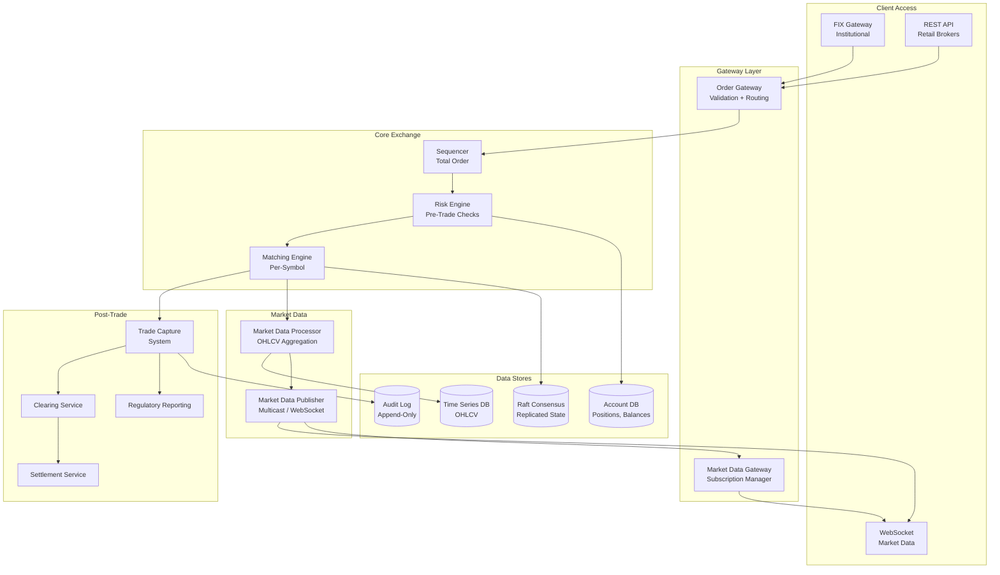
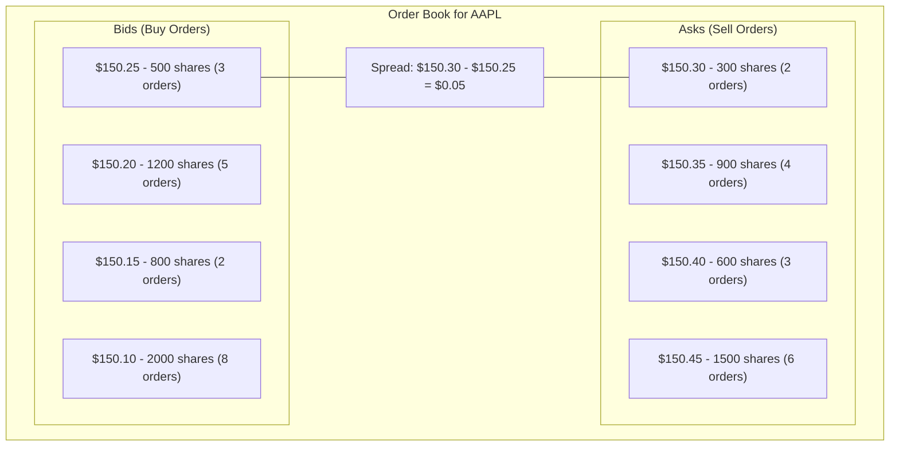
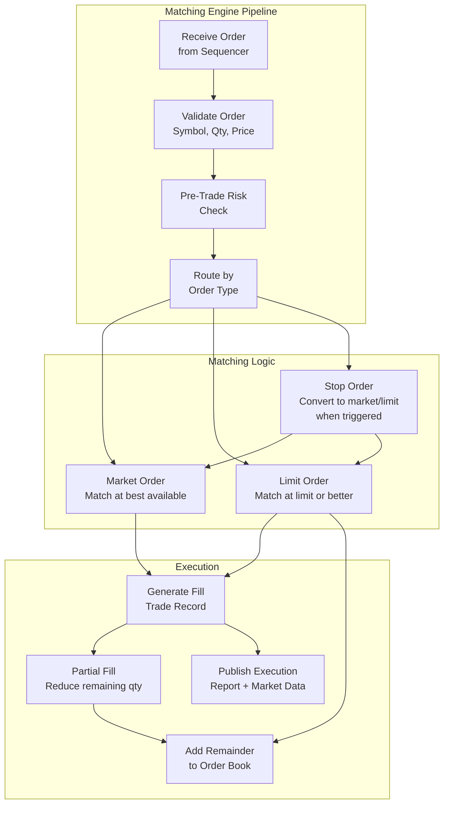
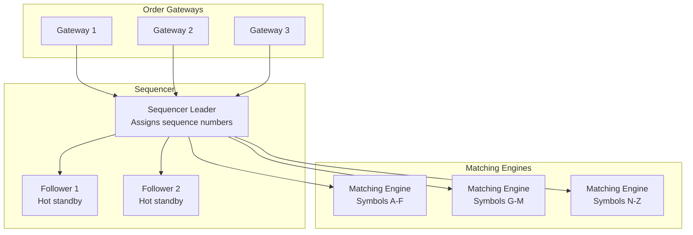
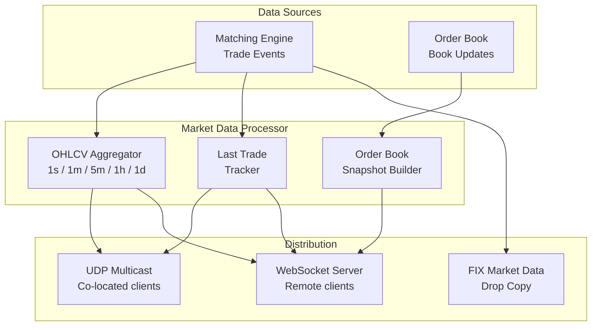
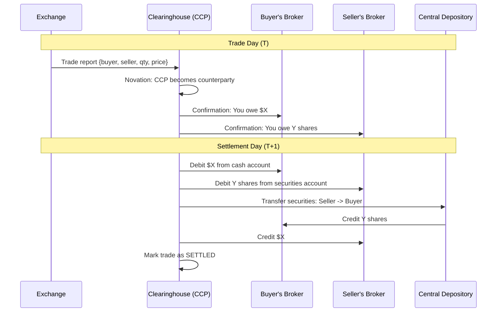

# Design a Stock Exchange — Order Matching Engine

## 1. Problem Statement & Requirements

### Functional Requirements

| # | Requirement | Details |
|---|-------------|---------|
| FR-1 | Order Placement | Submit market, limit, and stop orders |
| FR-2 | Order Book | Maintain sorted buy/sell order book per security |
| FR-3 | Matching Engine | Match buy and sell orders by price-time priority |
| FR-4 | Real-Time Price Feed | Stream live price updates via WebSocket |
| FR-5 | Order Management | Cancel, modify existing orders |
| FR-6 | Trade Execution | Generate trade records when orders match |
| FR-7 | Account Management | Track positions, balances, margin |
| FR-8 | Market Data | Historical OHLCV, order book depth, last trade |
| FR-9 | Risk Management | Pre-trade risk checks, circuit breakers |
| FR-10 | Settlement | T+1/T+2 trade settlement with clearinghouse |

### Non-Functional Requirements

| # | Requirement | Target |
|---|-------------|--------|
| NFR-1 | Latency | Order-to-ack < 10 microseconds (matching engine) |
| NFR-2 | Throughput | 1M+ orders/second |
| NFR-3 | Availability | 99.999% during market hours |
| NFR-4 | Consistency | Strict ordering — every order processed exactly once, in sequence |
| NFR-5 | Determinism | Same input sequence always produces same output |
| NFR-6 | Auditability | Complete audit trail for regulatory compliance |

---

## 2. Back-of-Envelope Estimation

### Scale Parameters

$$
\text{Listed Securities} = 10{,}000 \quad \text{Active Traders} = 5M
$$

### Order Volume

$$
\text{NYSE daily volume} \approx 3B \text{ shares/day in } 6.5 \text{ market hours}
$$

$$
\text{Orders/Day} \approx 5B \text{ (including cancels, many cancel before fill)}
$$

$$
\text{Peak Orders/Second} = \frac{5B}{23{,}400} \times 5 \approx 1{,}068{,}376 \text{ orders/s}
$$

### Matching Engine Latency Budget

$$
\text{Total Budget} < 10 \mu s
$$

| Step | Budget |
|------|--------|
| Network receive | 1 $\mu s$ |
| Parse + validate | 2 $\mu s$ |
| Risk check | 1 $\mu s$ |
| Match (order book lookup) | 3 $\mu s$ |
| Generate execution reports | 2 $\mu s$ |
| Network send | 1 $\mu s$ |

### Market Data

$$
\text{Price Updates/Second} = 10{,}000 \text{ securities} \times 100 \text{ updates/s} = 1M \text{ updates/s}
$$

$$
\text{WebSocket Subscribers} = 500{,}000 \text{ concurrent connections}
$$

$$
\text{Fanout} = 1M \times 500K = 500B \text{ messages/s (filtered by subscription)}
$$

### Storage

$$
\text{Trade Records/Day} = 200M \quad \text{Record Size} = 200 \text{ B}
$$

$$
\text{Daily Trade Storage} = 200M \times 200 \text{ B} = 40 \text{ GB/day}
$$

$$
\text{Order Audit Log} = 5B \times 300 \text{ B} = 1.5 \text{ TB/day}
$$

---

## 3. High-Level Design

### Architecture Diagram



### API Design

```typescript
// Order APIs (FIX protocol or REST)
POST /api/v1/orders
     // Body: { symbol, side: "buy"|"sell", type: "market"|"limit"|"stop"|"stop_limit",
     //         quantity, price?, stopPrice?, timeInForce: "GTC"|"IOC"|"FOK"|"DAY" }
DELETE /api/v1/orders/{orderId}
PUT    /api/v1/orders/{orderId}
       // Body: { quantity?, price? }
GET    /api/v1/orders?status={open|filled|cancelled}

// Market Data APIs
GET /api/v1/market-data/{symbol}/quote
    // Returns: { bid, ask, last, volume, open, high, low, close }
GET /api/v1/market-data/{symbol}/orderbook?depth=10
    // Returns: { bids: [{price, qty}], asks: [{price, qty}] }
GET /api/v1/market-data/{symbol}/trades?limit=100
GET /api/v1/market-data/{symbol}/ohlcv?interval=1m&from={ts}&to={ts}

// WebSocket
WS  /api/v1/ws/market-data
    // Subscribe: { "action": "subscribe", "channels": ["trades.AAPL", "orderbook.AAPL"] }

// Account APIs
GET /api/v1/accounts/{accountId}/positions
GET /api/v1/accounts/{accountId}/balances
GET /api/v1/accounts/{accountId}/trades?from={date}&to={date}
```

---

## 4. Database Schema

### Orders Table

```sql
CREATE TABLE orders (
    order_id            BIGINT PRIMARY KEY,
    client_order_id     VARCHAR(50) NOT NULL,
    account_id          BIGINT NOT NULL,
    symbol              VARCHAR(10) NOT NULL,
    side                CHAR(1) NOT NULL,     -- 'B' (buy) or 'S' (sell)
    order_type          VARCHAR(10) NOT NULL,  -- MARKET, LIMIT, STOP, STOP_LIMIT
    quantity            BIGINT NOT NULL,       -- In shares (integer, no decimals)
    price               BIGINT,               -- In cents (integer arithmetic)
    stop_price          BIGINT,               -- Trigger price for stop orders
    time_in_force       VARCHAR(3) NOT NULL,   -- GTC, IOC, FOK, DAY
    filled_quantity     BIGINT DEFAULT 0,
    avg_fill_price      BIGINT DEFAULT 0,
    status              VARCHAR(15) NOT NULL,  -- NEW, PARTIAL, FILLED, CANCELLED, REJECTED
    sequence_number     BIGINT NOT NULL,       -- Sequencer-assigned
    received_at         TIMESTAMP(6) NOT NULL, -- Microsecond precision
    updated_at          TIMESTAMP(6) NOT NULL,
    INDEX idx_orders_symbol (symbol, status),
    INDEX idx_orders_account (account_id, status)
) PARTITION BY RANGE (received_at);
```

### Trades Table

```sql
CREATE TABLE trades (
    trade_id            BIGINT PRIMARY KEY,
    symbol              VARCHAR(10) NOT NULL,
    buy_order_id        BIGINT NOT NULL,
    sell_order_id       BIGINT NOT NULL,
    buyer_account_id    BIGINT NOT NULL,
    seller_account_id   BIGINT NOT NULL,
    quantity            BIGINT NOT NULL,
    price               BIGINT NOT NULL,      -- In cents
    executed_at         TIMESTAMP(6) NOT NULL,
    sequence_number     BIGINT NOT NULL,
    settlement_date     DATE NOT NULL,         -- T+1 or T+2
    settlement_status   VARCHAR(10) DEFAULT 'PENDING',
    INDEX idx_trades_symbol (symbol, executed_at),
    INDEX idx_trades_account (buyer_account_id, executed_at),
    INDEX idx_trades_settlement (settlement_date, settlement_status)
) PARTITION BY RANGE (executed_at);
```

### Account Positions

```sql
CREATE TABLE positions (
    account_id          BIGINT NOT NULL,
    symbol              VARCHAR(10) NOT NULL,
    quantity            BIGINT NOT NULL,       -- Positive = long, negative = short
    avg_cost            BIGINT NOT NULL,       -- Average cost basis in cents
    market_value        BIGINT NOT NULL,
    unrealized_pnl      BIGINT NOT NULL,
    realized_pnl        BIGINT NOT NULL,
    updated_at          TIMESTAMP(6) NOT NULL,
    PRIMARY KEY (account_id, symbol)
);
```

### Order Audit Log (Append-Only)

```sql
CREATE TABLE order_audit_log (
    sequence_number     BIGINT NOT NULL,
    event_type          VARCHAR(20) NOT NULL,
    -- NEW, MODIFY, CANCEL, FILL, PARTIAL_FILL, REJECT
    order_id            BIGINT NOT NULL,
    symbol              VARCHAR(10) NOT NULL,
    details             JSONB NOT NULL,
    timestamp_us        BIGINT NOT NULL,       -- Microseconds since epoch
    PRIMARY KEY (sequence_number)
);
```

---

## 5. Detailed Component Design

### 5.1 Order Book Data Structure

The order book is the central data structure — it must support O(1) best-price lookup and O(log n) insertion.



```typescript
// Price levels use sorted tree (red-black tree) for O(log n) operations
// Orders within a price level use FIFO queue (doubly-linked list) for O(1) add/remove

interface Order {
  orderId: number;
  accountId: number;
  side: 'B' | 'S';
  price: number;          // In cents (integer arithmetic, no floating point!)
  quantity: number;
  remainingQty: number;
  timestamp: bigint;       // Nanosecond precision
  sequenceNumber: number;
}

interface PriceLevel {
  price: number;
  totalQuantity: number;
  orderCount: number;
  orders: DoublyLinkedList<Order>; // FIFO queue
}

class OrderBook {
  private bids: RedBlackTree<number, PriceLevel>;  // Sorted descending (highest first)
  private asks: RedBlackTree<number, PriceLevel>;   // Sorted ascending (lowest first)
  private orderMap: Map<number, Order>;              // orderId -> Order (for O(1) cancel)

  constructor(public readonly symbol: string) {
    this.bids = new RedBlackTree((a, b) => b - a); // Descending
    this.asks = new RedBlackTree((a, b) => a - b); // Ascending
    this.orderMap = new Map();
  }

  getBestBid(): PriceLevel | null {
    return this.bids.first();
  }

  getBestAsk(): PriceLevel | null {
    return this.asks.first();
  }

  getSpread(): number {
    const bestBid = this.getBestBid();
    const bestAsk = this.getBestAsk();
    if (!bestBid || !bestAsk) return Infinity;
    return bestAsk.price - bestBid.price;
  }

  addOrder(order: Order): void {
    const tree = order.side === 'B' ? this.bids : this.asks;

    let level = tree.get(order.price);
    if (!level) {
      level = {
        price: order.price,
        totalQuantity: 0,
        orderCount: 0,
        orders: new DoublyLinkedList(),
      };
      tree.insert(order.price, level);
    }

    level.orders.append(order);
    level.totalQuantity += order.remainingQty;
    level.orderCount++;
    this.orderMap.set(order.orderId, order);
  }

  removeOrder(orderId: number): Order | null {
    const order = this.orderMap.get(orderId);
    if (!order) return null;

    const tree = order.side === 'B' ? this.bids : this.asks;
    const level = tree.get(order.price);

    if (level) {
      level.orders.remove(order);
      level.totalQuantity -= order.remainingQty;
      level.orderCount--;

      // Remove empty price level
      if (level.orderCount === 0) {
        tree.remove(order.price);
      }
    }

    this.orderMap.delete(orderId);
    return order;
  }

  // Get order book depth (top N levels)
  getDepth(levels: number): OrderBookSnapshot {
    return {
      bids: this.getLevels(this.bids, levels),
      asks: this.getLevels(this.asks, levels),
    };
  }

  private getLevels(tree: RedBlackTree<number, PriceLevel>, n: number): DepthLevel[] {
    const result: DepthLevel[] = [];
    for (const [price, level] of tree.entries()) {
      if (result.length >= n) break;
      result.push({
        price,
        quantity: level.totalQuantity,
        orderCount: level.orderCount,
      });
    }
    return result;
  }
}
```

### 5.2 Matching Engine

The matching engine is the heart of the exchange — it must be deterministic, fast, and correct.



```typescript
class MatchingEngine {
  private orderBooks: Map<string, OrderBook> = new Map();
  private sequenceNumber: number = 0;
  private stopOrders: Map<string, StopOrder[]> = new Map();

  processOrder(incomingOrder: IncomingOrder): ExecutionReport[] {
    const book = this.getOrCreateOrderBook(incomingOrder.symbol);
    const reports: ExecutionReport[] = [];

    // Acknowledge receipt
    reports.push(this.createAck(incomingOrder));

    switch (incomingOrder.orderType) {
      case 'MARKET':
        this.matchMarketOrder(book, incomingOrder, reports);
        break;
      case 'LIMIT':
        this.matchLimitOrder(book, incomingOrder, reports);
        break;
      case 'STOP':
        this.registerStopOrder(incomingOrder);
        break;
      case 'STOP_LIMIT':
        this.registerStopLimitOrder(incomingOrder);
        break;
    }

    // Check if any stop orders are triggered
    this.checkStopOrders(book, reports);

    return reports;
  }

  private matchLimitOrder(
    book: OrderBook,
    order: IncomingOrder,
    reports: ExecutionReport[]
  ): void {
    const oppositeSide = order.side === 'B' ? book.asks : book.bids;
    let remainingQty = order.quantity;

    // Match against opposite side of the book
    while (remainingQty > 0) {
      const bestLevel = order.side === 'B' ? book.getBestAsk() : book.getBestBid();

      if (!bestLevel) break; // No orders on opposite side

      // Price check: can we match?
      if (order.side === 'B' && bestLevel.price > order.price) break;  // Ask too high
      if (order.side === 'S' && bestLevel.price < order.price) break;  // Bid too low

      // Match against orders at this price level (FIFO)
      const levelOrders = bestLevel.orders.toArray();
      for (const restingOrder of levelOrders) {
        if (remainingQty <= 0) break;

        const fillQty = Math.min(remainingQty, restingOrder.remainingQty);
        const fillPrice = restingOrder.price; // Price-time priority: resting order's price

        // Generate trade
        const trade = this.createTrade(
          order, restingOrder, fillQty, fillPrice
        );
        reports.push(trade);

        // Update quantities
        remainingQty -= fillQty;
        restingOrder.remainingQty -= fillQty;

        // Remove fully filled resting order
        if (restingOrder.remainingQty === 0) {
          book.removeOrder(restingOrder.orderId);
          reports.push(this.createFillReport(restingOrder, 'FILLED'));
        } else {
          reports.push(this.createFillReport(restingOrder, 'PARTIAL'));
        }
      }
    }

    // Handle remaining quantity based on time-in-force
    if (remainingQty > 0) {
      switch (order.timeInForce) {
        case 'IOC': // Immediate or Cancel - cancel remainder
          reports.push(this.createCancelReport(order, remainingQty, 'IOC_EXPIRED'));
          break;
        case 'FOK': // Fill or Kill - should have been checked before matching
          // If we are here with remaining, we need to roll back (FOK check done upfront)
          break;
        case 'GTC': // Good Till Cancel - add to book
        case 'DAY': // Good for day - add to book
          const bookOrder: Order = {
            orderId: order.orderId,
            accountId: order.accountId,
            side: order.side,
            price: order.price,
            quantity: order.quantity,
            remainingQty: remainingQty,
            timestamp: BigInt(Date.now()) * 1000000n,
            sequenceNumber: this.sequenceNumber++,
          };
          book.addOrder(bookOrder);
          reports.push(this.createRestingReport(order, remainingQty));
          break;
      }
    } else {
      reports.push(this.createFillReport(order, 'FILLED'));
    }
  }

  private matchMarketOrder(
    book: OrderBook,
    order: IncomingOrder,
    reports: ExecutionReport[]
  ): void {
    // Market order: match at any price, no remainder goes to book
    const limitOrder = { ...order, price: order.side === 'B' ? Infinity : 0 };
    this.matchLimitOrder(book, limitOrder, reports);

    // If not fully filled, cancel remainder (market orders do not rest)
    // Already handled by time-in-force logic
  }

  private checkStopOrders(book: OrderBook, reports: ExecutionReport[]): void {
    const symbol = book.symbol;
    const stops = this.stopOrders.get(symbol) ?? [];
    const lastTradePrice = this.getLastTradePrice(symbol);

    const triggered: StopOrder[] = [];

    for (const stop of stops) {
      if (
        (stop.side === 'B' && lastTradePrice >= stop.stopPrice) ||
        (stop.side === 'S' && lastTradePrice <= stop.stopPrice)
      ) {
        triggered.push(stop);
      }
    }

    // Remove triggered stops and convert to market/limit orders
    for (const stop of triggered) {
      const idx = stops.indexOf(stop);
      stops.splice(idx, 1);

      if (stop.orderType === 'STOP') {
        this.matchMarketOrder(book, { ...stop, orderType: 'MARKET' }, reports);
      } else {
        this.matchLimitOrder(book, { ...stop, orderType: 'LIMIT' }, reports);
      }
    }
  }

  private createTrade(
    aggressor: IncomingOrder,
    resting: Order,
    quantity: number,
    price: number
  ): ExecutionReport {
    return {
      type: 'TRADE',
      tradeId: this.sequenceNumber++,
      symbol: aggressor.symbol,
      buyOrderId: aggressor.side === 'B' ? aggressor.orderId : resting.orderId,
      sellOrderId: aggressor.side === 'S' ? aggressor.orderId : resting.orderId,
      quantity,
      price,
      timestamp: process.hrtime.bigint(),
    };
  }
}
```

### 5.3 Sequencer (Total Ordering)

All orders must be processed in a deterministic, totally ordered sequence.



```typescript
class Sequencer {
  private sequence: bigint = 0n;
  private journal: AppendOnlyLog;
  private replicas: SequencerReplica[];

  async processMessage(message: RawOrder): Promise<SequencedOrder> {
    // Assign monotonically increasing sequence number
    const seqNum = this.sequence++;

    const sequenced: SequencedOrder = {
      ...message,
      sequenceNumber: seqNum,
      timestamp: process.hrtime.bigint(), // Nanosecond precision
    };

    // Write to journal (append-only, durable)
    await this.journal.append(sequenced);

    // Replicate to followers (synchronous for durability)
    await Promise.all(
      this.replicas.map(r => r.replicate(sequenced))
    );

    // Route to correct matching engine based on symbol
    const partition = this.getPartition(message.symbol);
    await this.matchingEngines[partition].enqueue(sequenced);

    return sequenced;
  }

  // Leader election via Raft consensus
  async electLeader(): Promise<void> {
    // If leader fails, follower with most up-to-date journal becomes new leader
    // Recovery: replay journal from last checkpoint
  }
}
```

### 5.4 Real-Time Price Feed



```typescript
class MarketDataService {
  private subscribers: Map<string, Set<WebSocket>> = new Map();
  private ohlcvBuckets: Map<string, Map<string, OHLCVBar>> = new Map(); // symbol -> interval -> bar

  // Handle new trade event from matching engine
  onTrade(trade: TradeEvent): void {
    // Update last trade
    this.publishToSubscribers(`trades.${trade.symbol}`, {
      type: 'trade',
      symbol: trade.symbol,
      price: trade.price,
      quantity: trade.quantity,
      timestamp: trade.timestamp,
      side: trade.aggressorSide,
    });

    // Update OHLCV bars
    this.updateOHLCV(trade);

    // Update ticker
    this.publishToSubscribers(`ticker.${trade.symbol}`, {
      type: 'ticker',
      symbol: trade.symbol,
      last: trade.price,
      bid: this.getBestBid(trade.symbol),
      ask: this.getBestAsk(trade.symbol),
      volume: this.getDailyVolume(trade.symbol),
      change: this.getDailyChange(trade.symbol),
    });
  }

  // Handle order book update
  onBookUpdate(symbol: string, book: OrderBookSnapshot): void {
    this.publishToSubscribers(`orderbook.${symbol}`, {
      type: 'orderbook',
      symbol,
      bids: book.bids.slice(0, 20), // Top 20 levels
      asks: book.asks.slice(0, 20),
      timestamp: Date.now(),
    });
  }

  private updateOHLCV(trade: TradeEvent): void {
    const intervals = ['1s', '1m', '5m', '15m', '1h', '4h', '1d'];

    for (const interval of intervals) {
      const bucketKey = this.getBucketKey(trade.timestamp, interval);
      const symbolBuckets = this.ohlcvBuckets.get(trade.symbol) ?? new Map();

      let bar = symbolBuckets.get(bucketKey);
      if (!bar) {
        bar = {
          open: trade.price,
          high: trade.price,
          low: trade.price,
          close: trade.price,
          volume: 0,
          timestamp: this.getBucketStart(trade.timestamp, interval),
        };
        symbolBuckets.set(bucketKey, bar);
        this.ohlcvBuckets.set(trade.symbol, symbolBuckets);
      }

      bar.high = Math.max(bar.high, trade.price);
      bar.low = Math.min(bar.low, trade.price);
      bar.close = trade.price;
      bar.volume += trade.quantity;
    }
  }

  // WebSocket subscription management
  handleSubscription(ws: WebSocket, channel: string, action: 'subscribe' | 'unsubscribe'): void {
    if (action === 'subscribe') {
      const subs = this.subscribers.get(channel) ?? new Set();
      subs.add(ws);
      this.subscribers.set(channel, subs);

      // Send initial snapshot
      if (channel.startsWith('orderbook.')) {
        const symbol = channel.split('.')[1];
        const snapshot = this.getCurrentSnapshot(symbol);
        ws.send(JSON.stringify({ type: 'snapshot', ...snapshot }));
      }
    } else {
      this.subscribers.get(channel)?.delete(ws);
    }
  }

  private publishToSubscribers(channel: string, data: object): void {
    const subs = this.subscribers.get(channel);
    if (!subs) return;

    const message = JSON.stringify(data);
    for (const ws of subs) {
      if (ws.readyState === WebSocket.OPEN) {
        ws.send(message);
      }
    }
  }
}
```

### 5.5 Risk Management

```typescript
class RiskEngine {
  async preTradeCheck(order: IncomingOrder): Promise<RiskCheckResult> {
    const checks: RiskCheckResult[] = await Promise.all([
      this.checkOrderSize(order),
      this.checkPriceBand(order),
      this.checkAccountBalance(order),
      this.checkPositionLimit(order),
      this.checkRateLimit(order),
      this.checkCircuitBreaker(order.symbol),
    ]);

    const failed = checks.find(c => !c.passed);
    if (failed) {
      return { passed: false, reason: failed.reason };
    }

    return { passed: true };
  }

  private async checkPriceBand(order: IncomingOrder): Promise<RiskCheckResult> {
    if (order.orderType === 'MARKET') return { passed: true };

    const lastPrice = await this.getLastTradePrice(order.symbol);
    if (!lastPrice) return { passed: true }; // No reference price yet

    const deviation = Math.abs(order.price - lastPrice) / lastPrice;
    const maxDeviation = 0.10; // 10% from last trade

    if (deviation > maxDeviation) {
      return {
        passed: false,
        reason: `Price ${order.price} deviates ${(deviation * 100).toFixed(1)}% from last trade ${lastPrice}`,
      };
    }

    return { passed: true };
  }

  private async checkCircuitBreaker(symbol: string): Promise<RiskCheckResult> {
    const dayOpen = await this.getDayOpenPrice(symbol);
    const lastPrice = await this.getLastTradePrice(symbol);

    if (!dayOpen || !lastPrice) return { passed: true };

    const dayChange = (lastPrice - dayOpen) / dayOpen;

    // Level 1: 7% drop - 15 min halt
    // Level 2: 13% drop - 15 min halt
    // Level 3: 20% drop - halt for day
    if (Math.abs(dayChange) > 0.20) {
      return { passed: false, reason: `Circuit breaker Level 3: ${symbol} halted for day` };
    }
    if (Math.abs(dayChange) > 0.13) {
      return { passed: false, reason: `Circuit breaker Level 2: ${symbol} halted 15 min` };
    }
    if (Math.abs(dayChange) > 0.07) {
      return { passed: false, reason: `Circuit breaker Level 1: ${symbol} halted 15 min` };
    }

    return { passed: true };
  }

  private async checkAccountBalance(order: IncomingOrder): Promise<RiskCheckResult> {
    if (order.side === 'S') {
      // Sell: check if account has shares
      const position = await this.getPosition(order.accountId, order.symbol);
      if (position.quantity < order.quantity) {
        return { passed: false, reason: 'Insufficient shares' };
      }
    } else {
      // Buy: check if account has buying power
      const buyingPower = await this.getBuyingPower(order.accountId);
      const cost = order.orderType === 'MARKET'
        ? await this.estimateMarketOrderCost(order.symbol, order.quantity)
        : order.price * order.quantity;

      if (cost > buyingPower) {
        return { passed: false, reason: 'Insufficient buying power' };
      }
    }

    return { passed: true };
  }
}
```

### 5.6 Trade Settlement



```typescript
class SettlementService {
  // Run daily at end of trading day
  async processDailySettlement(settlementDate: Date): Promise<SettlementReport> {
    // Get all trades due for settlement today
    const trades = await this.getTradesForSettlement(settlementDate);

    // Net positions per account per symbol (multilateral netting)
    const netPositions = this.calculateNetPositions(trades);

    // Validate all parties can settle
    const validationResults = await Promise.all(
      netPositions.map(np => this.validateSettlement(np))
    );

    const failed = validationResults.filter(v => !v.valid);
    if (failed.length > 0) {
      await this.handleSettlementFailures(failed);
    }

    // Execute settlement
    for (const position of netPositions) {
      await this.executeSettlement(position);
    }

    return {
      date: settlementDate,
      tradesSettled: trades.length,
      totalValue: trades.reduce((sum, t) => sum + t.price * t.quantity, 0),
      failures: failed.length,
    };
  }

  private calculateNetPositions(trades: Trade[]): NetPosition[] {
    // Multilateral netting reduces the number of actual transfers
    const netMap = new Map<string, Map<string, number>>(); // account -> symbol -> net qty

    for (const trade of trades) {
      // Buyer gets shares
      const buyerKey = `${trade.buyerAccountId}`;
      if (!netMap.has(buyerKey)) netMap.set(buyerKey, new Map());
      const buyerPositions = netMap.get(buyerKey)!;
      buyerPositions.set(
        trade.symbol,
        (buyerPositions.get(trade.symbol) ?? 0) + trade.quantity
      );

      // Seller delivers shares
      const sellerKey = `${trade.sellerAccountId}`;
      if (!netMap.has(sellerKey)) netMap.set(sellerKey, new Map());
      const sellerPositions = netMap.get(sellerKey)!;
      sellerPositions.set(
        trade.symbol,
        (sellerPositions.get(trade.symbol) ?? 0) - trade.quantity
      );
    }

    // Convert to array
    const positions: NetPosition[] = [];
    for (const [account, symbols] of netMap) {
      for (const [symbol, netQty] of symbols) {
        positions.push({ accountId: account, symbol, netQuantity: netQty });
      }
    }
    return positions;
  }
}
```

---

## 6. Scaling & Bottlenecks

### What Breaks First

| Component | Bottleneck | Solution |
|-----------|-----------|----------|
| Matching Engine | Single-threaded per symbol | Partition by symbol, each symbol on dedicated core |
| Sequencer | Single point of serialization | LMAX Disruptor pattern, mechanical sympathy |
| Market Data | 1M updates/s x 500K subscribers | Topic-based pub/sub, UDP multicast for co-located |
| Order Gateway | Network I/O | Kernel bypass (DPDK), FPGA NICs |
| Audit Log | 1.5 TB/day writes | Append-only log with async replication |
| WebSocket | 500K connections | Horizontal WebSocket server fleet |

### Low-Latency Techniques

```typescript
// LMAX Disruptor-inspired ring buffer for lock-free messaging
class RingBuffer<T> {
  private buffer: T[];
  private writePos: number = 0;
  private readPos: number = 0;
  private readonly size: number;

  constructor(size: number) {
    // Size must be power of 2 for bitwise modulo
    this.size = size;
    this.buffer = new Array(size);
  }

  // Single writer, multiple readers
  publish(event: T): boolean {
    if (this.writePos - this.readPos >= this.size) {
      return false; // Buffer full
    }
    this.buffer[this.writePos & (this.size - 1)] = event;
    this.writePos++;
    return true;
  }

  consume(): T | null {
    if (this.readPos >= this.writePos) {
      return null; // No data
    }
    const event = this.buffer[this.readPos & (this.size - 1)];
    this.readPos++;
    return event;
  }
}
```

**Key low-latency principles:**

1. **No garbage collection pauses** — Use pre-allocated object pools
2. **No system calls in hot path** — Memory-mapped files, kernel bypass
3. **CPU affinity** — Pin matching engine thread to specific CPU core
4. **Cache-friendly data structures** — Arrays over linked lists, struct-of-arrays
5. **No locks** — Lock-free data structures (CAS operations)
6. **Integer arithmetic** — Prices in cents, no floating point

$$
\text{Floating point: } 0.1 + 0.2 = 0.30000000000000004 \quad \text{(WRONG for finance)}
$$

$$
\text{Integer: } 10 + 20 = 30 \text{ cents} \quad \text{(CORRECT)}
$$

---

## 7. Trade-offs & Alternatives

### Matching Engine Architecture

| Approach | Pro | Con |
|----------|-----|-----|
| Single-threaded per symbol | Deterministic, simple | Limited throughput per symbol |
| Multi-threaded per symbol | Higher throughput | Complex synchronization, non-deterministic |
| FPGA-based | Sub-microsecond latency | Expensive, hard to update |
| GPU-based | Massive parallelism | High latency per operation |

### Communication Protocol

| Protocol | Pro | Con | Use Case |
|----------|-----|-----|----------|
| FIX | Industry standard, reliable | Verbose, text-based | Institutional clients |
| Binary (SBE) | Compact, fast parse | Not human-readable | Internal, co-located |
| WebSocket | Easy integration | Higher latency | Retail clients |
| UDP Multicast | Lowest latency | Unreliable, LAN only | Market data (co-located) |

### State Replication

| Approach | Pro | Con |
|----------|-----|-----|
| Raft Consensus | Strong consistency | Latency overhead |
| Primary-Backup | Simple, fast | Manual failover |
| Event Sourcing | Perfect replay | Storage heavy |
| LMAX-style (replicated journal) | Deterministic replay | Complex implementation |

---

## 8. Advanced Topics

### 8.1 Order Types Deep Dive

| Order Type | Behavior | Use Case |
|-----------|----------|----------|
| Market | Execute immediately at best available | Urgency, guaranteed fill |
| Limit | Execute at specified price or better | Price control |
| Stop | Trigger market order when price reached | Stop loss |
| Stop-Limit | Trigger limit order when price reached | Controlled stop loss |
| Iceberg | Show only portion of total quantity | Hide large orders |
| TWAP | Execute evenly over time period | Minimize market impact |

### 8.2 Market Microstructure

$$
\text{Spread} = \text{Best Ask} - \text{Best Bid}
$$

$$
\text{Mid Price} = \frac{\text{Best Bid} + \text{Best Ask}}{2}
$$

$$
\text{VWAP} = \frac{\sum_{i} P_i \times Q_i}{\sum_{i} Q_i}
$$

### 8.3 Regulatory Compliance

- **MiFID II (EU)**: Report all trades within 15 minutes, best execution obligation
- **Reg NMS (US)**: National best bid/offer, trade-through protection
- **Market Abuse Regulation**: Detect spoofing, layering, wash trading

### 8.4 Disaster Recovery

Two matching engine instances run simultaneously. The backup replays the same journal and can take over within milliseconds if the primary fails.

---

## 9. Interview Tips

::: tip Key Points to Emphasize
1. **The order book is the core data structure** — Red-black tree of price levels, each with a FIFO queue of orders.
2. **Price-time priority** — Orders match at the resting order's price; time priority within a price level.
3. **Determinism is non-negotiable** — Same sequence of inputs must always produce same outputs.
4. **Integer arithmetic for prices** — Never use floating point for financial calculations.
5. **Sequencer provides total ordering** — All events flow through a single sequencer for deterministic replay.
:::

::: warning Common Mistakes
- Using floating point for prices — this is a critical error in financial systems.
- Making the matching engine multi-threaded per symbol — it breaks determinism.
- Not discussing the sequencer — total ordering is essential for correctness and recovery.
- Treating market data as a simple database query — it needs real-time streaming at massive scale.
- Forgetting settlement — the exchange is not done when a trade executes; settlement is days later.
:::

::: info Follow-Up Questions to Expect
- How would you handle a flash crash? (Circuit breakers at security level and market-wide.)
- How do you detect market manipulation (spoofing, layering)?
- How would you add support for options/derivatives?
- What happens when the primary matching engine fails? (Failover to hot standby replaying the same journal.)
- How do you handle market open (all orders accumulated overnight execute at once)?
:::

### Time Allocation in 45-min Interview

| Phase | Time | Focus |
|-------|------|-------|
| Requirements | 3 min | Order types, latency targets, throughput |
| High-Level Design | 8 min | Architecture, key components |
| Deep Dive: Order Book | 10 min | Data structure, price-time priority |
| Deep Dive: Matching | 10 min | Limit order matching, edge cases |
| Deep Dive: Market Data | 7 min | WebSocket feed, OHLCV aggregation |
| Risk & Compliance | 5 min | Pre-trade checks, circuit breakers |
| Q&A | 2 min | Settlement, failover, latency optimization |
