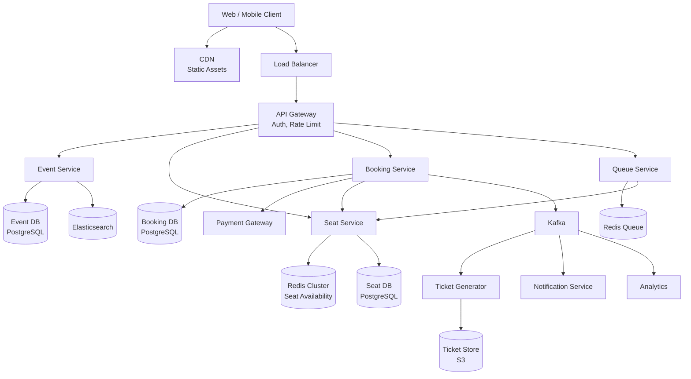
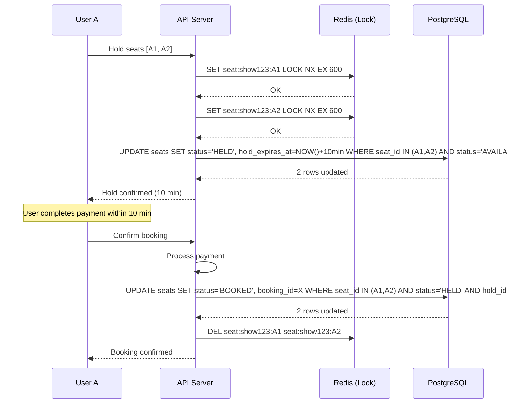
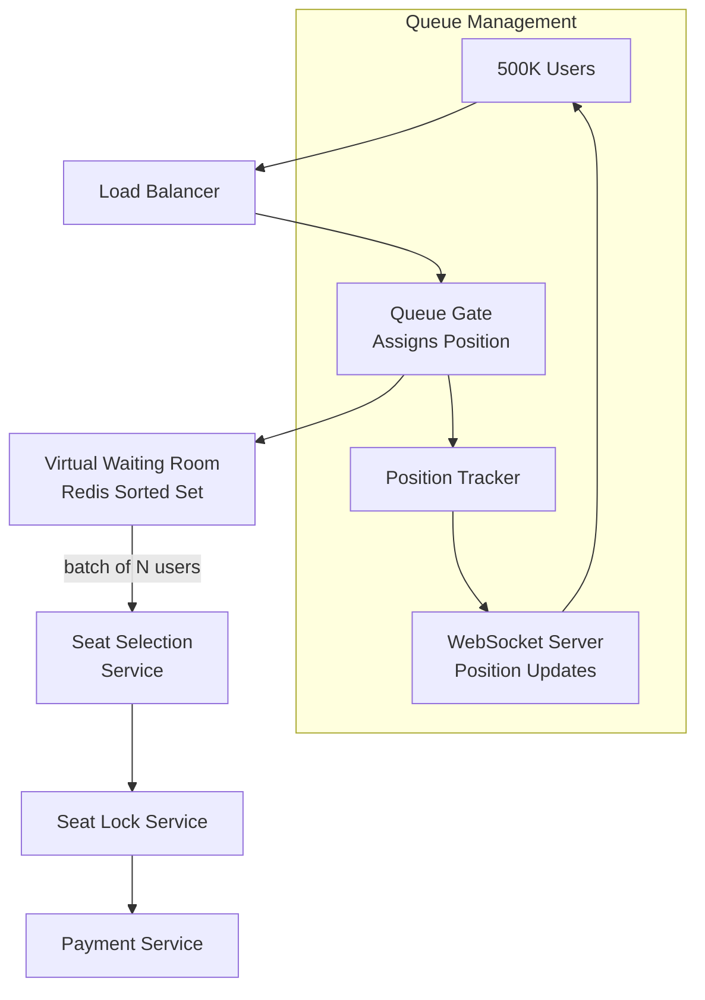
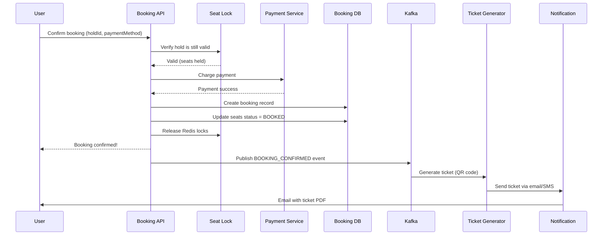
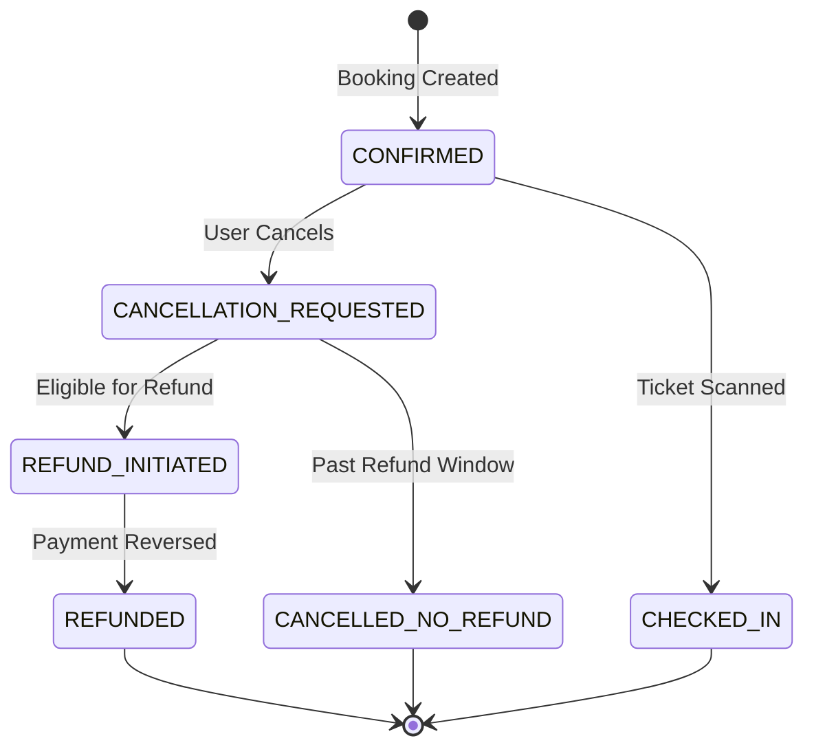
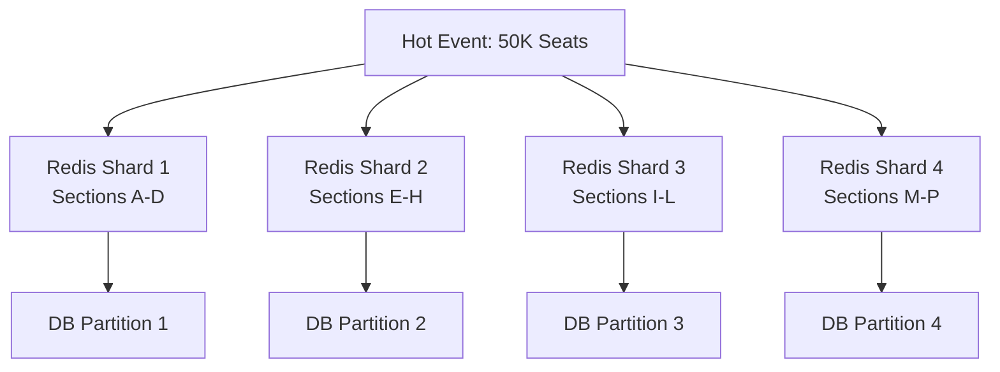

# Design BookMyShow / Ticketmaster

## 1. Problem Statement & Requirements

Design a ticket booking platform where users can browse events, select seats, and purchase tickets with guaranteed seat availability even under extreme concurrency.

### Functional Requirements

| # | Requirement |
|---|-------------|
| FR-1 | Browse and search events (movies, concerts, sports) |
| FR-2 | View venue seating map with real-time availability |
| FR-3 | Select and temporarily hold seats during checkout |
| FR-4 | Complete booking with payment |
| FR-5 | Handle waiting queues for high-demand events |
| FR-6 | Issue digital tickets (QR codes) |
| FR-7 | Support cancellations and refunds |
| FR-8 | Prevent double-booking of the same seat |

### Non-Functional Requirements

| # | Requirement | Target |
|---|-------------|--------|
| NFR-1 | Availability | 99.99% |
| NFR-2 | Seat selection latency | p99 < 500 ms |
| NFR-3 | Booking consistency | Strong (no double-booking) |
| NFR-4 | Flash sale throughput | 100K+ concurrent users per event |
| NFR-5 | Hold timeout | 10 minutes |
| NFR-6 | Ticket delivery | < 5 seconds after payment |

---

## 2. Back-of-Envelope Estimation

### Traffic

- Daily active users: 10 million
- Events listed: 500,000
- Bookings per day: 2 million
- Average seats per booking: 2.5

$$
\text{Seat transactions/day} = 2 \times 10^6 \times 2.5 = 5 \times 10^6
$$

$$
\text{Avg TPS} = \frac{5 \times 10^6}{86400} \approx 58 \text{ TPS}
$$

- Flash sale peak (top concert, 50K seats, sold in 2 minutes):

$$
\text{Peak TPS} = \frac{50{,}000}{120} \approx 417 \text{ seat TPS}
$$

- But concurrent users attempting to book: 500K, each making 5+ requests:

$$
\text{Peak request rate} = \frac{500{,}000 \times 5}{120} \approx 20{,}833 \text{ QPS}
$$

### Storage

- Event record: ~5 KB
- Seat record: ~200 bytes
- Booking record: ~2 KB
- Average venue: 5,000 seats

$$
\text{Seat data} = 500{,}000 \times 5{,}000 \times 200 = 500 \text{ GB}
$$

$$
\text{Booking data/year} = 2 \times 10^6 \times 365 \times 2 \text{ KB} = 1.46 \text{ TB}
$$

### Bandwidth

- Seat map payload (SVG + availability): ~50 KB per request
- At peak: 20K QPS x 50 KB = 1 GB/s

$$
\text{Peak outbound} \approx 8 \text{ Gbps}
$$

---

## 3. High-Level Design



### API Design

```typescript
// GET /v1/events?city=mumbai&category=movies&date=2026-03-20
interface EventSearchRequest {
  city?: string;
  category?: 'movies' | 'concerts' | 'sports' | 'theater';
  date?: string;
  query?: string;
  page?: number;
  limit?: number;
}

// GET /v1/events/:eventId/shows/:showId/seats
interface SeatMapResponse {
  showId: string;
  venue: VenueLayout;
  sections: SeatSection[];
  lastUpdated: string; // For cache invalidation
}

interface SeatSection {
  sectionId: string;
  name: string;
  priceCategory: string;
  price: number;
  seats: SeatInfo[];
}

interface SeatInfo {
  seatId: string;
  row: string;
  number: number;
  status: 'AVAILABLE' | 'HELD' | 'BOOKED';
}

// POST /v1/bookings/hold
interface HoldRequest {
  showId: string;
  seatIds: string[];
  userId: string;
}

interface HoldResponse {
  holdId: string;
  seats: string[];
  expiresAt: string;    // 10-minute hold
  totalAmount: number;
}

// POST /v1/bookings/confirm
interface ConfirmRequest {
  holdId: string;
  paymentMethodId: string;
}

// DELETE /v1/bookings/:bookingId
interface CancelRequest {
  reason?: string;
}
```

---

## 4. Database Schema

### Events

```sql
CREATE TABLE events (
    event_id        UUID PRIMARY KEY,
    title           VARCHAR(500) NOT NULL,
    description     TEXT,
    category        VARCHAR(30) NOT NULL,
    city            VARCHAR(100) NOT NULL,
    venue_id        UUID NOT NULL REFERENCES venues(venue_id),
    start_date      DATE NOT NULL,
    end_date        DATE,
    poster_url      VARCHAR(500),
    metadata        JSONB,
    status          VARCHAR(20) DEFAULT 'ACTIVE',
    created_at      TIMESTAMPTZ DEFAULT NOW()
);

CREATE INDEX idx_events_city_cat ON events(city, category, start_date);
CREATE INDEX idx_events_search ON events USING GIN (to_tsvector('english', title));
```

### Shows (Specific Showtimes)

```sql
CREATE TABLE shows (
    show_id         UUID PRIMARY KEY,
    event_id        UUID NOT NULL REFERENCES events(event_id),
    venue_id        UUID NOT NULL REFERENCES venues(venue_id),
    show_time       TIMESTAMPTZ NOT NULL,
    total_seats     INT NOT NULL,
    available_seats INT NOT NULL,
    status          VARCHAR(20) DEFAULT 'OPEN',
    created_at      TIMESTAMPTZ DEFAULT NOW()
);

CREATE INDEX idx_shows_event ON shows(event_id, show_time);
```

### Seats

```sql
CREATE TABLE seats (
    seat_id         UUID PRIMARY KEY,
    show_id         UUID NOT NULL REFERENCES shows(show_id),
    section_id      VARCHAR(50) NOT NULL,
    row_label       VARCHAR(10) NOT NULL,
    seat_number     INT NOT NULL,
    price_cents     INT NOT NULL,
    status          VARCHAR(20) DEFAULT 'AVAILABLE',
    hold_id         UUID,
    hold_expires_at TIMESTAMPTZ,
    booking_id      UUID,
    version         INT DEFAULT 0,        -- Optimistic locking
    UNIQUE (show_id, section_id, row_label, seat_number)
);

CREATE INDEX idx_seats_show_status ON seats(show_id, status);
CREATE INDEX idx_seats_hold_expiry ON seats(hold_expires_at)
    WHERE status = 'HELD';
```

### Bookings

```sql
CREATE TABLE bookings (
    booking_id      UUID PRIMARY KEY,
    user_id         UUID NOT NULL,
    show_id         UUID NOT NULL,
    hold_id         UUID NOT NULL,
    total_amount    INT NOT NULL,
    currency        CHAR(3) DEFAULT 'INR',
    payment_id      UUID,
    status          VARCHAR(20) DEFAULT 'PENDING',
    booked_at       TIMESTAMPTZ DEFAULT NOW(),
    cancelled_at    TIMESTAMPTZ,
    ticket_url      VARCHAR(500)
);

CREATE INDEX idx_bookings_user ON bookings(user_id, booked_at DESC);
CREATE INDEX idx_bookings_show ON bookings(show_id);
```

### Waiting Queue

```sql
CREATE TABLE waiting_queue (
    queue_id        UUID PRIMARY KEY,
    show_id         UUID NOT NULL,
    user_id         UUID NOT NULL,
    position        INT NOT NULL,
    status          VARCHAR(20) DEFAULT 'WAITING',
    joined_at       TIMESTAMPTZ DEFAULT NOW(),
    notified_at     TIMESTAMPTZ,
    expires_at      TIMESTAMPTZ,
    UNIQUE (show_id, user_id)
);

CREATE INDEX idx_queue_show ON waiting_queue(show_id, position)
    WHERE status = 'WAITING';
```

---

## 5. Detailed Component Design

### 5.1 Seat Locking — The Core Challenge

The hardest problem is ensuring that two users cannot book the same seat simultaneously. We use a **two-phase approach**: temporary hold, then permanent booking.



#### Distributed Lock Implementation

```typescript
class SeatLockService {
  private redis: RedisCluster;
  private readonly HOLD_DURATION_SECONDS = 600; // 10 minutes

  /**
   * Attempt to hold a set of seats atomically.
   * Either all seats are held, or none are.
   */
  async holdSeats(
    showId: string,
    seatIds: string[],
    userId: string
  ): Promise<{ holdId: string; expiresAt: Date } | null> {
    const holdId = crypto.randomUUID();
    const expiresAt = new Date(
      Date.now() + this.HOLD_DURATION_SECONDS * 1000
    );

    // Use Redis MULTI/EXEC for atomicity
    const pipeline = this.redis.multi();

    for (const seatId of seatIds) {
      const key = `seat:${showId}:${seatId}`;
      pipeline.set(key, JSON.stringify({ holdId, userId }),
        'NX', 'EX', this.HOLD_DURATION_SECONDS);
    }

    const results = await pipeline.exec();
    if (!results) {
      return null;
    }

    // Check if ALL seats were locked successfully
    const allLocked = results.every(
      ([err, result]) => !err && result === 'OK'
    );

    if (!allLocked) {
      // Rollback: release any seats we did lock
      await this.releaseSeats(showId, seatIds, holdId);
      return null;
    }

    // Persist to DB
    await this.persistHold(showId, seatIds, holdId, expiresAt);

    return { holdId, expiresAt };
  }

  /**
   * Release held seats (on timeout or cancellation).
   */
  async releaseSeats(
    showId: string,
    seatIds: string[],
    holdId: string
  ): Promise<void> {
    for (const seatId of seatIds) {
      const key = `seat:${showId}:${seatId}`;
      // Only release if we own the lock
      const lockData = await this.redis.get(key);
      if (lockData) {
        const parsed = JSON.parse(lockData);
        if (parsed.holdId === holdId) {
          await this.redis.del(key);
        }
      }
    }

    // Update DB
    await this.db.query(`
      UPDATE seats
      SET status = 'AVAILABLE', hold_id = NULL, hold_expires_at = NULL
      WHERE show_id = $1
        AND seat_id = ANY($2)
        AND hold_id = $3
        AND status = 'HELD'
    `, [showId, seatIds, holdId]);
  }

  private async persistHold(
    showId: string,
    seatIds: string[],
    holdId: string,
    expiresAt: Date
  ): Promise<void> {
    await this.db.query(`
      UPDATE seats
      SET status = 'HELD',
          hold_id = $1,
          hold_expires_at = $2,
          version = version + 1
      WHERE show_id = $3
        AND seat_id = ANY($4)
        AND status = 'AVAILABLE'
    `, [holdId, expiresAt, showId, seatIds]);
  }
}
```

::: danger Distributed Lock Pitfalls
1. **Redis failover**: If Redis master fails before replication, locks can be lost. Use **RedLock** across multiple independent Redis instances for critical sections.
2. **Clock skew**: TTL-based locks can expire early/late with clock drift. Use monotonic clocks where possible.
3. **Partial lock acquisition**: Always implement all-or-nothing semantics. If seat A1 locks but A2 doesn't, release A1 immediately.
:::

### 5.2 Hold Expiry Cleanup

```typescript
class HoldExpiryService {
  private redis: RedisCluster;
  private db: DatabasePool;

  /**
   * Runs every 30 seconds to clean up expired holds.
   */
  async cleanupExpiredHolds(): Promise<number> {
    const expired = await this.db.query(`
      UPDATE seats
      SET status = 'AVAILABLE',
          hold_id = NULL,
          hold_expires_at = NULL,
          version = version + 1
      WHERE status = 'HELD'
        AND hold_expires_at < NOW()
      RETURNING seat_id, show_id
    `);

    // Also clean up Redis locks (belt and suspenders)
    for (const row of expired.rows) {
      const key = `seat:${row.show_id}:${row.seat_id}`;
      await this.redis.del(key);
    }

    // Update available seat counts
    const showIds = [...new Set(expired.rows.map((r) => r.show_id))];
    for (const showId of showIds) {
      await this.updateAvailableCount(showId);
    }

    return expired.rowCount;
  }

  private async updateAvailableCount(showId: string): Promise<void> {
    await this.db.query(`
      UPDATE shows
      SET available_seats = (
        SELECT COUNT(*) FROM seats
        WHERE show_id = $1 AND status = 'AVAILABLE'
      )
      WHERE show_id = $1
    `, [showId]);
  }
}
```

### 5.3 Flash Sale Queue System

For extremely high-demand events, a queue-based approach prevents system overload.



```typescript
class VirtualQueueService {
  private redis: RedisCluster;
  private readonly BATCH_SIZE = 100;        // Users admitted at once
  private readonly BATCH_INTERVAL_MS = 5000; // Every 5 seconds

  /**
   * Add user to the virtual queue for an event.
   */
  async joinQueue(
    showId: string,
    userId: string
  ): Promise<{ position: number; estimatedWaitMinutes: number }> {
    const queueKey = `queue:${showId}`;
    const timestamp = Date.now();

    // Use sorted set with timestamp as score
    await this.redis.zadd(queueKey, timestamp, userId);
    const position = await this.redis.zrank(queueKey, userId);

    if (position === null) {
      throw new Error('Failed to join queue');
    }

    const estimatedWait = Math.ceil(
      (position / this.BATCH_SIZE) *
      (this.BATCH_INTERVAL_MS / 60_000)
    );

    return {
      position: position + 1,
      estimatedWaitMinutes: estimatedWait,
    };
  }

  /**
   * Admit the next batch of users from the queue.
   * Called periodically by a scheduler.
   */
  async admitNextBatch(showId: string): Promise<string[]> {
    const queueKey = `queue:${showId}`;
    const activeKey = `queue:active:${showId}`;

    // Check if there are seats available
    const availableSeats = await this.getAvailableSeats(showId);
    if (availableSeats <= 0) {
      return [];
    }

    // Pop the first BATCH_SIZE users
    const batch = await this.redis.zpopmin(
      queueKey, this.BATCH_SIZE
    );

    const admittedUsers: string[] = [];
    for (let i = 0; i < batch.length; i += 2) {
      const userId = batch[i];
      admittedUsers.push(userId);
      // Mark as active (allowed to select seats for 10 min)
      await this.redis.setex(
        `${activeKey}:${userId}`, 600, 'active'
      );
    }

    // Notify admitted users via WebSocket
    for (const userId of admittedUsers) {
      await this.notifyUser(userId, {
        type: 'QUEUE_ADMITTED',
        showId,
        message: 'You can now select seats!',
        expiresInSeconds: 600,
      });
    }

    return admittedUsers;
  }

  /**
   * Check if a user is allowed to select seats.
   */
  async isAdmitted(showId: string, userId: string): Promise<boolean> {
    const key = `queue:active:${showId}:${userId}`;
    const result = await this.redis.get(key);
    return result === 'active';
  }

  /**
   * Get current queue position for a user.
   */
  async getPosition(
    showId: string,
    userId: string
  ): Promise<number | null> {
    const rank = await this.redis.zrank(
      `queue:${showId}`, userId
    );
    return rank !== null ? rank + 1 : null;
  }
}
```

::: tip Fair Queue Design
Use a FIFO queue (Redis sorted set with timestamp score) rather than random selection. Users who arrived first should be served first. Display estimated wait time to manage expectations.
:::

### 5.4 Seat Map Real-Time Updates

```typescript
class SeatMapService {
  private redis: RedisCluster;
  private wsServer: WebSocketServer;

  /**
   * Get current seat availability for a show.
   * Uses Redis bitmap for efficient storage.
   */
  async getSeatAvailability(showId: string): Promise<SeatMap> {
    const cacheKey = `seatmap:${showId}`;
    const cached = await this.redis.get(cacheKey);

    if (cached) {
      return JSON.parse(cached);
    }

    // Fetch from DB
    const seats = await this.db.query(`
      SELECT seat_id, section_id, row_label, seat_number,
             price_cents, status
      FROM seats
      WHERE show_id = $1
      ORDER BY section_id, row_label, seat_number
    `, [showId]);

    const seatMap = this.buildSeatMap(seats.rows);

    // Cache for 5 seconds (short TTL for freshness)
    await this.redis.setex(cacheKey, 5, JSON.stringify(seatMap));

    return seatMap;
  }

  /**
   * Broadcast seat status changes via WebSocket.
   */
  async broadcastSeatUpdate(
    showId: string,
    seatIds: string[],
    newStatus: string
  ): Promise<void> {
    const channel = `show:${showId}:seats`;
    const message = JSON.stringify({
      type: 'SEAT_UPDATE',
      seats: seatIds.map((id) => ({ seatId: id, status: newStatus })),
      timestamp: Date.now(),
    });

    // Publish to Redis pub/sub for cross-server broadcast
    await this.redis.publish(channel, message);
  }

  /**
   * Handle WebSocket connections for seat map updates.
   */
  handleConnection(ws: WebSocket, showId: string): void {
    const channel = `show:${showId}:seats`;

    const subscriber = this.redis.duplicate();
    subscriber.subscribe(channel, (message) => {
      if (ws.readyState === WebSocket.OPEN) {
        ws.send(message);
      }
    });

    ws.on('close', () => {
      subscriber.unsubscribe(channel);
      subscriber.quit();
    });
  }
}
```

### 5.5 Booking Confirmation Flow



```typescript
class BookingService {
  async confirmBooking(
    holdId: string,
    userId: string,
    paymentMethodId: string
  ): Promise<BookingResponse> {
    // 1. Verify hold exists and belongs to user
    const hold = await this.getHold(holdId);
    if (!hold || hold.userId !== userId) {
      throw new Error('Invalid or expired hold');
    }
    if (new Date(hold.expiresAt) < new Date()) {
      throw new Error('Hold has expired');
    }

    // 2. Calculate total
    const seats = await this.getSeatDetails(hold.seatIds);
    const totalAmount = seats.reduce(
      (sum, s) => sum + s.priceCents, 0
    );

    // 3. Process payment
    const payment = await this.paymentService.charge({
      amount: totalAmount,
      currency: 'INR',
      paymentMethodId,
      idempotencyKey: `booking:${holdId}`,
      metadata: { holdId, showId: hold.showId },
    });

    if (payment.status !== 'CAPTURED') {
      throw new Error(`Payment failed: ${payment.failureReason}`);
    }

    // 4. Create booking in a transaction
    const booking = await this.db.transaction(async (tx) => {
      const bookingId = crypto.randomUUID();

      await tx.query(`
        INSERT INTO bookings
          (booking_id, user_id, show_id, hold_id,
           total_amount, payment_id, status)
        VALUES ($1, $2, $3, $4, $5, $6, 'CONFIRMED')
      `, [bookingId, userId, hold.showId, holdId,
          totalAmount, payment.paymentId]);

      // Mark seats as BOOKED
      await tx.query(`
        UPDATE seats
        SET status = 'BOOKED',
            booking_id = $1,
            hold_id = NULL,
            hold_expires_at = NULL,
            version = version + 1
        WHERE seat_id = ANY($2)
          AND hold_id = $3
          AND status = 'HELD'
      `, [bookingId, hold.seatIds, holdId]);

      // Decrement available seats
      await tx.query(`
        UPDATE shows
        SET available_seats = available_seats - $1
        WHERE show_id = $2
      `, [hold.seatIds.length, hold.showId]);

      return { bookingId, totalAmount };
    });

    // 5. Release Redis locks
    await this.seatLockService.releaseSeats(
      hold.showId, hold.seatIds, holdId
    );

    // 6. Publish event
    await this.kafka.publish('bookings', {
      type: 'BOOKING_CONFIRMED',
      bookingId: booking.bookingId,
      userId,
      showId: hold.showId,
      seatIds: hold.seatIds,
      amount: totalAmount,
    });

    // 7. Broadcast seat update
    await this.seatMapService.broadcastSeatUpdate(
      hold.showId, hold.seatIds, 'BOOKED'
    );

    return {
      bookingId: booking.bookingId,
      status: 'CONFIRMED',
      seats: seats.map((s) => ({
        section: s.sectionId,
        row: s.rowLabel,
        number: s.seatNumber,
      })),
      totalAmount,
      paymentId: payment.paymentId,
    };
  }
}
```

### 5.6 Ticket Generation

```typescript
class TicketGenerator {
  async generateTicket(booking: BookingEvent): Promise<string> {
    const qrData = {
      bookingId: booking.bookingId,
      showId: booking.showId,
      seats: booking.seatIds,
      hash: this.generateHash(booking), // Anti-forgery
    };

    // Generate QR code
    const qrBuffer = await QRCode.toBuffer(
      JSON.stringify(qrData),
      { errorCorrectionLevel: 'H', width: 300 }
    );

    // Generate PDF ticket
    const pdf = await this.createTicketPDF(booking, qrBuffer);

    // Upload to S3
    const key = `tickets/${booking.bookingId}.pdf`;
    await this.s3.upload({
      Bucket: 'tickets-bucket',
      Key: key,
      Body: pdf,
      ContentType: 'application/pdf',
    });

    // Update booking with ticket URL
    const ticketUrl = `https://cdn.example.com/${key}`;
    await this.db.query(
      'UPDATE bookings SET ticket_url = $1 WHERE booking_id = $2',
      [ticketUrl, booking.bookingId]
    );

    return ticketUrl;
  }

  private generateHash(booking: BookingEvent): string {
    const data = `${booking.bookingId}:${booking.showId}:${booking.seatIds.join(',')}`;
    return crypto.createHmac('sha256', process.env.TICKET_SECRET!)
      .update(data)
      .digest('hex')
      .slice(0, 16);
  }
}
```

### 5.7 Cancellation & Refund Flow



```typescript
class CancellationService {
  private readonly FULL_REFUND_HOURS = 24;
  private readonly PARTIAL_REFUND_HOURS = 4;

  async cancelBooking(
    bookingId: string,
    userId: string
  ): Promise<CancellationResult> {
    const booking = await this.getBooking(bookingId);
    if (!booking || booking.userId !== userId) {
      throw new Error('Booking not found');
    }
    if (booking.status !== 'CONFIRMED') {
      throw new Error('Booking cannot be cancelled');
    }

    const show = await this.getShow(booking.showId);
    const hoursUntilShow = (
      new Date(show.showTime).getTime() - Date.now()
    ) / 3600_000;

    let refundPercentage: number;
    if (hoursUntilShow >= this.FULL_REFUND_HOURS) {
      refundPercentage = 100;
    } else if (hoursUntilShow >= this.PARTIAL_REFUND_HOURS) {
      refundPercentage = 50;
    } else {
      refundPercentage = 0;
    }

    // Release seats
    await this.db.transaction(async (tx) => {
      await tx.query(`
        UPDATE seats
        SET status = 'AVAILABLE', booking_id = NULL, version = version + 1
        WHERE booking_id = $1
      `, [bookingId]);

      await tx.query(`
        UPDATE shows
        SET available_seats = available_seats + $1
        WHERE show_id = $2
      `, [booking.seatCount, booking.showId]);

      await tx.query(`
        UPDATE bookings
        SET status = 'CANCELLED', cancelled_at = NOW()
        WHERE booking_id = $1
      `, [bookingId]);
    });

    // Process refund
    let refundAmount = 0;
    if (refundPercentage > 0) {
      refundAmount = Math.floor(
        booking.totalAmount * refundPercentage / 100
      );
      await this.paymentService.refund({
        paymentId: booking.paymentId,
        amount: refundAmount,
        reason: `Cancellation (${refundPercentage}% refund)`,
      });
    }

    // Notify waiting queue users
    await this.queueService.notifySeatsAvailable(
      booking.showId, booking.seatCount
    );

    return {
      bookingId,
      status: 'CANCELLED',
      refundAmount,
      refundPercentage,
    };
  }
}
```

---

## 6. Scaling & Bottlenecks

### What Breaks First?

| Bottleneck | Symptom | Solution |
|-----------|---------|----------|
| Redis lock contention (hot event) | Timeout on seat holds | Shard seats across Redis nodes |
| DB write throughput during flash sale | Booking latency > 5s | Queue-based admission control |
| WebSocket connections (500K per event) | Memory exhaustion | Fan-out via Redis pub/sub |
| Seat map reads (everyone refreshing) | API overwhelmed | CDN caching + WebSocket push |
| Payment gateway timeout | Stuck bookings | Async payment with webhook |

### Sharding Strategy for Hot Events



::: warning Thundering Herd on Seat Map
When a popular event goes on sale, hundreds of thousands of users will simultaneously request the seat map. Mitigate with:
1. **CDN caching** with 2-3 second TTL
2. **WebSocket push** for updates instead of polling
3. **Coalesced requests** -- deduplicate identical in-flight queries
4. **Progressive loading** -- show section availability first, then individual seats
:::

---

## 7. Trade-offs & Alternatives

| Decision | Option A | Option B | Our Choice |
|----------|----------|----------|------------|
| Seat locking | Optimistic (DB version) | Pessimistic (Redis lock) | **Redis lock** -- faster, avoids DB contention |
| Queue system | In-memory | Redis sorted set | **Redis** -- survives server restarts |
| Seat map updates | Polling (5s) | WebSocket push | **WebSocket** -- lower latency, less server load |
| Flash sale handling | First-come-first-served | Lottery | **FCFS with queue** -- fair and transparent |
| Payment timing | Pre-authorize then capture | Charge on confirm | **Pre-auth** -- reduces failed bookings |

---

## 8. Advanced Topics

### 8.1 Overbooking Strategy

Some venues intentionally overbook by 2-5% (like airlines) because of expected no-shows.

```typescript
class OverbookingService {
  private readonly OVERBOOK_PERCENTAGE = 0.03; // 3%

  async getEffectiveCapacity(showId: string): Promise<number> {
    const show = await this.getShow(showId);
    const historicalNoShowRate = await this.getNoShowRate(
      show.eventId, show.venueId
    );

    const overbookFactor = Math.min(
      historicalNoShowRate,
      this.OVERBOOK_PERCENTAGE
    );

    return Math.floor(
      show.totalSeats * (1 + overbookFactor)
    );
  }
}
```

### 8.2 Dynamic Pricing

```typescript
class DynamicPricingService {
  async calculatePrice(
    showId: string,
    seatId: string,
    basePrice: number
  ): Promise<number> {
    const factors = await Promise.all([
      this.getDemandMultiplier(showId),
      this.getTimeMultiplier(showId),
      this.getInventoryMultiplier(showId),
    ]);

    const demandMultiplier = factors[0];   // 0.8 - 2.0
    const timeMultiplier = factors[1];      // 0.9 - 1.5
    const inventoryMultiplier = factors[2]; // 0.8 - 3.0

    const finalPrice = Math.round(
      basePrice *
      demandMultiplier *
      timeMultiplier *
      inventoryMultiplier
    );

    // Cap the price increase
    const maxPrice = basePrice * 3;
    const minPrice = Math.floor(basePrice * 0.7);

    return Math.max(minPrice, Math.min(maxPrice, finalPrice));
  }

  private async getDemandMultiplier(showId: string): Promise<number> {
    const viewsLastHour = await this.redis.get(
      `views:${showId}:hourly`
    );
    const avgViews = await this.getAvgHourlyViews(showId);
    return Math.min(2.0, (Number(viewsLastHour) || 0) / (avgViews || 1));
  }

  private async getInventoryMultiplier(
    showId: string
  ): Promise<number> {
    const show = await this.getShow(showId);
    const occupancyRate =
      1 - show.availableSeats / show.totalSeats;

    if (occupancyRate > 0.95) return 3.0;
    if (occupancyRate > 0.85) return 2.0;
    if (occupancyRate > 0.70) return 1.5;
    if (occupancyRate > 0.50) return 1.0;
    return 0.8; // Discount to fill seats
  }
}
```

### 8.3 Anti-Bot / Anti-Scalping Measures

```typescript
class AntiBotService {
  async validateRequest(
    userId: string,
    showId: string,
    request: HoldRequest
  ): Promise<{ allowed: boolean; reason?: string }> {
    // 1. Rate limiting per user
    const userRequests = await this.redis.incr(
      `ratelimit:user:${userId}`
    );
    if (userRequests > 10) {
      return { allowed: false, reason: 'Rate limit exceeded' };
    }

    // 2. Device fingerprint check
    const deviceCount = await this.getDeviceCount(userId);
    if (deviceCount > 3) {
      return {
        allowed: false,
        reason: 'Too many devices',
      };
    }

    // 3. CAPTCHA verification for suspicious patterns
    if (await this.isSuspicious(userId)) {
      return {
        allowed: false,
        reason: 'CAPTCHA required',
      };
    }

    // 4. Max tickets per user per event
    const existingBookings = await this.getBookingCount(
      userId, showId
    );
    if (existingBookings >= 6) {
      return {
        allowed: false,
        reason: 'Maximum tickets per user reached',
      };
    }

    return { allowed: true };
  }
}
```

---

## 9. Interview Tips

::: tip Focus on Concurrency
The interviewer wants to see how you handle the seat locking problem. This is the core challenge. Start with a simple Redis lock, then discuss edge cases (partial lock failure, Redis failover, hold expiry).
:::

::: warning Common Mistakes
- Not handling the case where a Redis lock succeeds but DB update fails (inconsistency)
- Forgetting hold expiry cleanup
- Not discussing how to handle flash sales (the system melts under 500K concurrent users without a queue)
- Using SELECT FOR UPDATE for seat locking (works but doesn't scale)
- Ignoring anti-bot measures for high-demand events
:::

::: details Sample Interview Timeline (45 min)
| Time | Phase |
|------|-------|
| 0-5 min | Requirements & clarifications |
| 5-10 min | Back-of-envelope estimation |
| 10-18 min | High-level architecture |
| 18-28 min | Deep dive: seat locking mechanism |
| 28-35 min | Flash sale queue system |
| 35-40 min | Real-time seat map updates |
| 40-45 min | Scaling, trade-offs |
:::

### Key Talking Points

1. **Why Redis for locking instead of DB locks?** DB locks (SELECT FOR UPDATE) create contention under high concurrency. Redis SET NX is non-blocking and O(1).
2. **What if Redis crashes?** Use RedLock for critical paths, and the DB serves as the source of truth. The hold expiry cleanup job reconciles any inconsistencies.
3. **How to handle 500K users for a single event?** Virtual waiting queue with batch admission. Only 100-200 users interact with the seat selection system at any time.
4. **How to prevent double-booking?** Three layers: Redis lock (fast reject), DB optimistic locking (consistency), hold expiry cleanup (recovery).
5. **Why WebSocket for seat maps?** Polling 500K users every 2 seconds = 250K QPS just for seat status. WebSocket push = 0 QPS when nothing changes.
