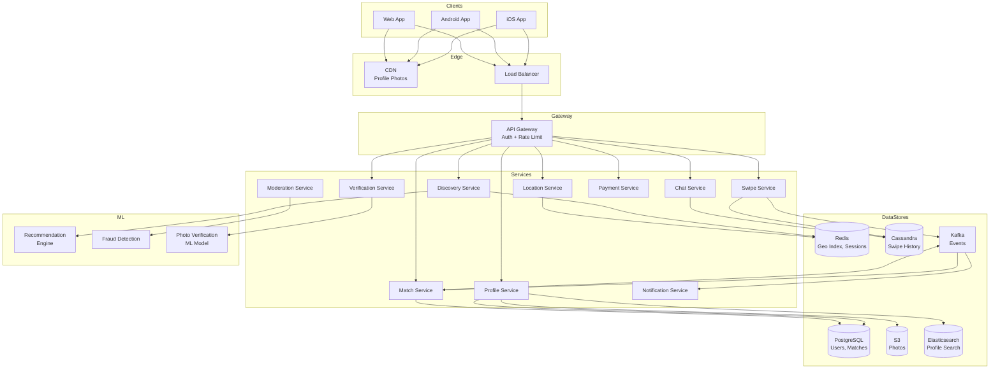
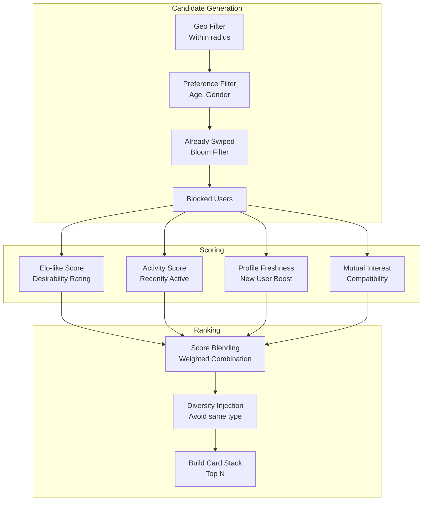
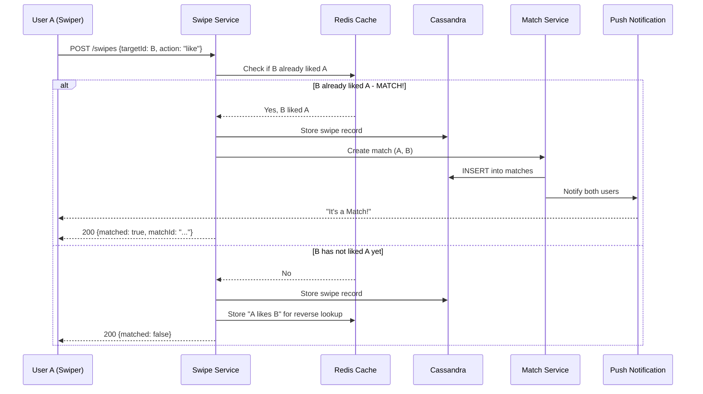
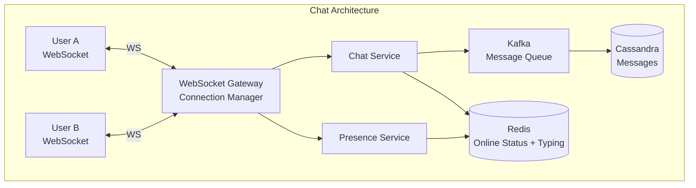
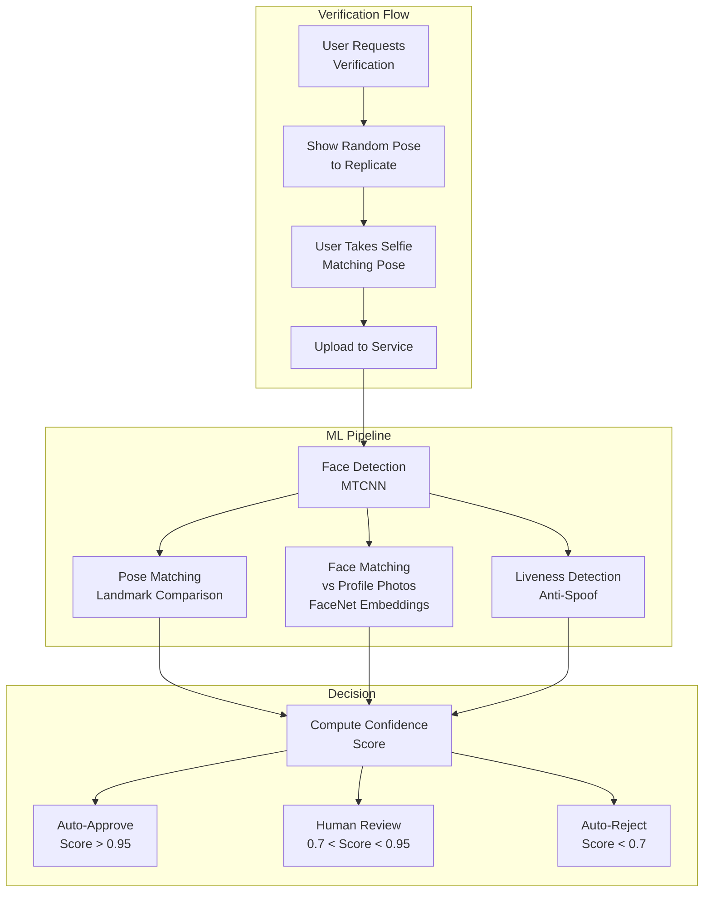

# Design Tinder — Dating App with Geospatial Matching

## 1. Problem Statement & Requirements

### Functional Requirements

| # | Requirement | Details |
|---|-------------|---------|
| FR-1 | Profile Creation | Photos, bio, age, preferences (gender, age range, distance) |
| FR-2 | Swipe/Discovery | Show nearby profiles; swipe right (like), left (pass), up (super like) |
| FR-3 | Matching | When two users both swipe right, create a match |
| FR-4 | Chat | Real-time messaging between matched users |
| FR-5 | Geospatial Filtering | Find users within a configurable radius (1-160 km) |
| FR-6 | Profile Verification | Photo verification to prevent catfishing |
| FR-7 | Boost/Premium | Paid features: see who liked you, boost profile, unlimited swipes |
| FR-8 | Undo | Undo last swipe (premium feature) |
| FR-9 | Location Update | Update user location periodically |
| FR-10 | Block & Report | Block users, report inappropriate content |

### Non-Functional Requirements

| # | Requirement | Target |
|---|-------------|--------|
| NFR-1 | Availability | 99.99% uptime |
| NFR-2 | Latency | Card stack load < 200ms |
| NFR-3 | Throughput | 2B+ swipes per day |
| NFR-4 | Consistency | Strong consistency for matching, eventual for profiles |
| NFR-5 | Privacy | GDPR compliance, location obfuscation |
| NFR-6 | Scale | 75M MAU, 10M DAU |

---

## 2. Back-of-Envelope Estimation

### User Scale

$$
\text{MAU} = 75M \quad \text{DAU} = 10M \quad \text{Peak Concurrent} = 3M
$$

### Swipe Volume

$$
\text{Avg Swipes per DAU} = 200
$$

$$
\text{Daily Swipes} = 10M \times 200 = 2B
$$

$$
\text{Swipe QPS} = \frac{2B}{86{,}400} \approx 23{,}000 \text{ swipes/s}
$$

$$
\text{Peak Swipe QPS} \approx 23{,}000 \times 3 = 69{,}000 \text{ swipes/s}
$$

### Match Rate

$$
\text{Right Swipe Rate} \approx 30\%
$$

$$
\text{Match Rate (mutual right swipe)} \approx 5\% \text{ of right swipes}
$$

$$
\text{Daily Matches} = 2B \times 0.30 \times 0.05 = 30M \text{ matches/day}
$$

### Storage Estimation

**User Profiles:**

$$
\text{Profile Size} = 5 \text{ KB metadata} + 6 \text{ photos} \times 500 \text{ KB} = 3 \text{ MB}
$$

$$
\text{Total Profile Storage} = 75M \times 3 \text{ MB} = 225 \text{ TB}
$$

**Swipe History:**

$$
\text{Swipe Record} = 32 \text{ bytes (2 UUIDs + timestamp + action)}
$$

$$
\text{Daily Swipe Storage} = 2B \times 32 \text{ B} = 64 \text{ GB/day}
$$

$$
\text{Annual Swipe Storage} = 64 \times 365 \approx 23 \text{ TB/year}
$$

### Geospatial Query Volume

$$
\text{Location Updates} = 10M \times 10 \text{ per day} = 100M \text{ updates/day}
$$

$$
\text{Discovery Queries} = 10M \times 20 \text{ sessions} = 200M \text{ geo queries/day}
$$

$$
\text{Geo QPS} = \frac{200M}{86{,}400} \approx 2{,}300 \text{ req/s}
$$

---

## 3. High-Level Design

### Architecture Diagram



### API Design

```typescript
// Profile APIs
POST   /api/v1/profiles
PUT    /api/v1/profiles/{userId}
POST   /api/v1/profiles/{userId}/photos
DELETE /api/v1/profiles/{userId}/photos/{photoId}
POST   /api/v1/profiles/{userId}/verify

// Discovery APIs
GET    /api/v1/discovery/recommendations?limit=20
POST   /api/v1/discovery/location
       // Body: { latitude, longitude }

// Swipe APIs
POST   /api/v1/swipes
       // Body: { targetUserId, action: "like"|"pass"|"super_like" }
POST   /api/v1/swipes/undo

// Match APIs
GET    /api/v1/matches
GET    /api/v1/matches/{matchId}
DELETE /api/v1/matches/{matchId}  // Unmatch

// Chat APIs
GET    /api/v1/matches/{matchId}/messages?before={cursor}
POST   /api/v1/matches/{matchId}/messages
       // Body: { text, mediaUrl? }
WS     /api/v1/ws/chat  // WebSocket for real-time messages

// Moderation APIs
POST   /api/v1/reports
       // Body: { reportedUserId, reason, details }
POST   /api/v1/blocks/{userId}
```

---

## 4. Database Schema

### Users Table (PostgreSQL)

```sql
CREATE TABLE users (
    user_id         UUID PRIMARY KEY DEFAULT gen_random_uuid(),
    phone_number    VARCHAR(20) UNIQUE,
    email           VARCHAR(255),
    name            VARCHAR(100) NOT NULL,
    birth_date      DATE NOT NULL,
    gender          VARCHAR(20) NOT NULL,
    bio             TEXT,
    job_title       VARCHAR(100),
    company         VARCHAR(100),
    school          VARCHAR(200),
    verified        BOOLEAN DEFAULT FALSE,
    subscription    VARCHAR(20) DEFAULT 'free', -- free, plus, gold, platinum
    created_at      TIMESTAMPTZ DEFAULT NOW(),
    updated_at      TIMESTAMPTZ DEFAULT NOW(),
    last_active     TIMESTAMPTZ DEFAULT NOW()
);

CREATE INDEX idx_users_last_active ON users(last_active DESC);
```

### User Preferences Table

```sql
CREATE TABLE user_preferences (
    user_id         UUID PRIMARY KEY REFERENCES users(user_id),
    interested_in   VARCHAR(20)[] NOT NULL, -- ['male', 'female', 'non-binary']
    age_min         SMALLINT DEFAULT 18,
    age_max         SMALLINT DEFAULT 100,
    distance_km     SMALLINT DEFAULT 50,
    show_me         BOOLEAN DEFAULT TRUE,
    global_mode     BOOLEAN DEFAULT FALSE
);
```

### User Locations (Redis Geo)

```
-- Redis GEO commands for location storage
GEOADD user_locations {longitude} {latitude} {userId}
GEORADIUS user_locations {lng} {lat} {radius} km COUNT 200 ASC
```

### Photos Table

```sql
CREATE TABLE photos (
    photo_id        UUID PRIMARY KEY DEFAULT gen_random_uuid(),
    user_id         UUID NOT NULL REFERENCES users(user_id),
    url             VARCHAR(500) NOT NULL,
    position        SMALLINT NOT NULL, -- 0 = primary
    is_verified     BOOLEAN DEFAULT FALSE,
    moderation_status VARCHAR(20) DEFAULT 'pending',
    width           INT,
    height          INT,
    created_at      TIMESTAMPTZ DEFAULT NOW()
);

CREATE INDEX idx_photos_user ON photos(user_id, position);
```

### Swipes Table (Cassandra)

```sql
CREATE TABLE swipes (
    swiper_id   UUID,
    swiped_id   UUID,
    action      TEXT,       -- 'like', 'pass', 'super_like'
    swiped_at   TIMESTAMP,
    PRIMARY KEY ((swiper_id), swiped_id)
);

-- Reverse index for "who liked me" feature
CREATE TABLE incoming_likes (
    target_id   UUID,
    liker_id    UUID,
    liked_at    TIMESTAMP,
    PRIMARY KEY ((target_id), liked_at)
) WITH CLUSTERING ORDER BY (liked_at DESC);
```

### Matches Table (PostgreSQL)

```sql
CREATE TABLE matches (
    match_id        UUID PRIMARY KEY DEFAULT gen_random_uuid(),
    user_id_1       UUID NOT NULL REFERENCES users(user_id),
    user_id_2       UUID NOT NULL REFERENCES users(user_id),
    matched_at      TIMESTAMPTZ DEFAULT NOW(),
    unmatched_at    TIMESTAMPTZ,
    last_message_at TIMESTAMPTZ,
    status          VARCHAR(20) DEFAULT 'active',
    CONSTRAINT unique_match UNIQUE (user_id_1, user_id_2),
    CONSTRAINT ordered_ids CHECK (user_id_1 < user_id_2)
);

CREATE INDEX idx_matches_user1 ON matches(user_id_1, status) WHERE status = 'active';
CREATE INDEX idx_matches_user2 ON matches(user_id_2, status) WHERE status = 'active';
```

### Messages Table (Cassandra)

```sql
CREATE TABLE messages (
    match_id    UUID,
    message_id  TIMEUUID,
    sender_id   UUID,
    content     TEXT,
    media_url   TEXT,
    read_at     TIMESTAMP,
    PRIMARY KEY ((match_id), message_id)
) WITH CLUSTERING ORDER BY (message_id DESC);
```

---

## 5. Detailed Component Design

### 5.1 Geospatial Matching with Geohash

The core challenge is efficiently finding nearby users within a configurable radius.

**Geohash encoding:**

$$
\text{Geohash maps } (lat, lng) \rightarrow \text{base32 string}
$$

| Geohash Length | Cell Size | Use Case |
|---------------|-----------|----------|
| 4 | ~39 km x 19.5 km | Coarse filtering |
| 5 | ~5 km x 5 km | City-level |
| 6 | ~1.2 km x 0.6 km | Neighborhood-level |
| 7 | ~150 m x 150 m | Block-level |

```mermaid
graph TB
    subgraph "Geospatial Query Flow"
        UserLoc[User Location<br/>lat: 40.7128, lng: -74.0060]
        GeoHash[Compute Geohash<br/>"dr5ru"]
        Neighbors[Get 8 Neighbors<br/>"dr5rv", "dr5rg", ...]
        Query[Query Redis GEO<br/>GEORADIUS]
        Filter[Filter by Preferences<br/>Age, Gender, Distance]
        Rank[Rank by Algorithm<br/>Score + Freshness]
        Return[Return Card Stack<br/>Top 20 profiles]
    end

    UserLoc --> GeoHash
    GeoHash --> Neighbors
    Neighbors --> Query
    Query --> Filter
    Filter --> Rank
    Rank --> Return
```

**Redis GEO implementation:**

```typescript
class LocationService {
  private redis: Redis;

  async updateLocation(userId: string, lat: number, lng: number): Promise<void> {
    // Store in Redis GEO set
    await this.redis.geoadd('user_locations', lng, lat, userId);

    // Also store in gender-specific sets for faster filtering
    const user = await this.getUser(userId);
    await this.redis.geoadd(`user_locations:${user.gender}`, lng, lat, userId);

    // Update last-active timestamp
    await this.redis.zadd('user_activity', Date.now(), userId);

    // Publish location update event
    await this.kafka.publish('user.location.updated', { userId, lat, lng });
  }

  async findNearbyUsers(
    userId: string,
    lat: number,
    lng: number,
    radiusKm: number,
    preferences: UserPreferences
  ): Promise<NearbyUser[]> {
    // Query Redis GEO for each preferred gender
    const nearbyUserIds: string[] = [];

    for (const gender of preferences.interested_in) {
      const results = await this.redis.georadius(
        `user_locations:${gender}`,
        lng, lat,
        radiusKm, 'km',
        'WITHCOORD', 'WITHDIST',
        'COUNT', 500,
        'ASC' // Sort by distance
      );
      nearbyUserIds.push(...results.map(r => r.member));
    }

    return nearbyUserIds.map(id => ({
      userId: id,
      distance: this.getDistance(id),
    }));
  }
}
```

**Geohash-based sharding for scale:**

```typescript
// Shard user locations by geohash prefix
class GeoShardedLocationService {
  private readonly SHARD_GEOHASH_PRECISION = 3; // ~156km cells

  getShardKey(lat: number, lng: number): string {
    const geohash = this.encodeGeohash(lat, lng, this.SHARD_GEOHASH_PRECISION);
    return `geo_shard:${geohash}`;
  }

  async findNearby(lat: number, lng: number, radiusKm: number): Promise<string[]> {
    // Get all geohash cells that overlap with the search radius
    const centerHash = this.encodeGeohash(lat, lng, this.SHARD_GEOHASH_PRECISION);
    const neighborHashes = this.getNeighborGeohashes(centerHash);
    const cellsToQuery = [centerHash, ...neighborHashes];

    // Query each shard in parallel
    const results = await Promise.all(
      cellsToQuery.map(hash =>
        this.queryShard(`geo_shard:${hash}`, lat, lng, radiusKm)
      )
    );

    return results.flat();
  }

  private encodeGeohash(lat: number, lng: number, precision: number): string {
    const BASE32 = '0123456789bcdefghjkmnpqrstuvwxyz';
    let hash = '';
    let minLat = -90, maxLat = 90;
    let minLng = -180, maxLng = 180;
    let isLng = true;
    let bits = 0;
    let charIndex = 0;

    while (hash.length < precision) {
      if (isLng) {
        const mid = (minLng + maxLng) / 2;
        if (lng > mid) {
          charIndex = charIndex * 2 + 1;
          minLng = mid;
        } else {
          charIndex = charIndex * 2;
          maxLng = mid;
        }
      } else {
        const mid = (minLat + maxLat) / 2;
        if (lat > mid) {
          charIndex = charIndex * 2 + 1;
          minLat = mid;
        } else {
          charIndex = charIndex * 2;
          maxLat = mid;
        }
      }

      isLng = !isLng;
      bits++;

      if (bits === 5) {
        hash += BASE32[charIndex];
        bits = 0;
        charIndex = 0;
      }
    }

    return hash;
  }
}
```

### 5.2 Recommendation Algorithm

Tinder's recommendation engine determines the order of cards shown.



**Elo-like scoring system:**

$$
\text{New Rating}_A = \text{Old Rating}_A + K \times (S - E)
$$

Where:
- $S$ = actual outcome (1 for right swipe received, 0 for left swipe)
- $E$ = expected outcome based on rating difference
- $K$ = adjustment factor (higher for new users)

$$
E = \frac{1}{1 + 10^{(\text{Rating}_B - \text{Rating}_A) / 400}}
$$

```typescript
class RecommendationEngine {
  async getRecommendations(userId: string, limit: number = 20): Promise<Profile[]> {
    const user = await this.getUser(userId);
    const preferences = await this.getPreferences(userId);
    const location = await this.getLocation(userId);

    // Phase 1: Candidate generation (fast, rough filtering)
    let candidates = await this.locationService.findNearby(
      location.lat, location.lng, preferences.distance_km
    );

    // Phase 2: Preference filtering
    candidates = await this.filterByPreferences(candidates, preferences);

    // Phase 3: Remove already-swiped users (Bloom filter for speed)
    candidates = await this.filterAlreadySwiped(userId, candidates);

    // Phase 4: Score and rank
    const scored = await Promise.all(
      candidates.map(async (candidateId) => {
        const score = await this.computeScore(userId, candidateId);
        return { userId: candidateId, score };
      })
    );

    // Phase 5: Sort, apply diversity, return top N
    scored.sort((a, b) => b.score - a.score);
    const diversified = this.applyDiversity(scored);

    return this.loadProfiles(diversified.slice(0, limit));
  }

  private async computeScore(userId: string, candidateId: string): Promise<number> {
    const userRating = await this.getRating(userId);
    const candidateRating = await this.getRating(candidateId);

    // Components
    const eloScore = this.normalizeRating(candidateRating);
    const activityScore = await this.getActivityScore(candidateId);
    const freshnessScore = await this.getFreshnessScore(candidateId);
    const mutualScore = await this.getMutualInterestScore(userId, candidateId);

    // Weighted combination
    return (
      0.30 * eloScore +
      0.25 * activityScore +
      0.20 * freshnessScore +
      0.15 * mutualScore +
      0.10 * Math.random() // Small random factor for exploration
    );
  }

  // Bloom filter to efficiently check if user already swiped
  private async filterAlreadySwiped(
    userId: string,
    candidates: string[]
  ): Promise<string[]> {
    const bloomFilter = await this.getSwipeBloomFilter(userId);
    return candidates.filter(c => !bloomFilter.mightContain(c));
  }

  // Ensure diversity in card stack
  private applyDiversity(scored: ScoredCandidate[]): ScoredCandidate[] {
    const result: ScoredCandidate[] = [];
    const recentTypes = new Map<string, number>();

    for (const candidate of scored) {
      const type = candidate.profileType; // e.g., verified, premium, new
      const recentCount = recentTypes.get(type) ?? 0;

      // Penalize if too many of the same type in a row
      if (recentCount < 3) {
        result.push(candidate);
        recentTypes.set(type, recentCount + 1);
      }

      if (result.length >= scored.length) break;
    }

    return result;
  }
}
```

### 5.3 Swipe Mechanics & Matching



```typescript
class SwipeService {
  async recordSwipe(
    swiperId: string,
    targetId: string,
    action: 'like' | 'pass' | 'super_like'
  ): Promise<SwipeResult> {
    // Rate limiting: max 100 right swipes per day for free users
    if (action !== 'pass') {
      const dailyLikes = await this.getDailyLikeCount(swiperId);
      const subscription = await this.getSubscription(swiperId);
      if (subscription === 'free' && dailyLikes >= 100) {
        throw new SwipeLimitExceededError();
      }
    }

    // Store the swipe
    await this.cassandra.execute(
      'INSERT INTO swipes (swiper_id, swiped_id, action, swiped_at) VALUES (?, ?, ?, ?)',
      [swiperId, targetId, action, new Date()]
    );

    // Update Elo ratings
    await this.updateRatings(swiperId, targetId, action);

    // Check for match (only if like or super_like)
    if (action === 'like' || action === 'super_like') {
      // Store in Redis for fast reverse lookup
      await this.redis.sadd(`likes:${targetId}`, swiperId);

      // Store in incoming_likes table
      await this.cassandra.execute(
        'INSERT INTO incoming_likes (target_id, liker_id, liked_at) VALUES (?, ?, ?)',
        [targetId, swiperId, new Date()]
      );

      // Check if target already liked swiper
      const isMatch = await this.redis.sismember(`likes:${swiperId}`, targetId);

      if (isMatch) {
        return this.createMatch(swiperId, targetId, action === 'super_like');
      }
    }

    return { matched: false };
  }

  private async createMatch(
    userId1: string,
    userId2: string,
    isSuperLike: boolean
  ): Promise<SwipeResult> {
    // Ensure consistent ordering
    const [first, second] = userId1 < userId2
      ? [userId1, userId2]
      : [userId2, userId1];

    const matchId = crypto.randomUUID();

    await this.postgres.query(
      `INSERT INTO matches (match_id, user_id_1, user_id_2, matched_at)
       VALUES ($1, $2, $3, NOW())
       ON CONFLICT DO NOTHING`,
      [matchId, first, second]
    );

    // Notify both users
    await this.notificationService.sendMatchNotification(userId1, userId2, isSuperLike);

    // Clean up likes from Redis
    await this.redis.srem(`likes:${userId1}`, userId2);
    await this.redis.srem(`likes:${userId2}`, userId1);

    // Publish event for analytics
    await this.kafka.publish('match.created', {
      matchId, userId1, userId2, isSuperLike,
    });

    return { matched: true, matchId };
  }

  private async updateRatings(
    swiperId: string,
    targetId: string,
    action: string
  ): Promise<void> {
    const swiperRating = await this.getRating(swiperId);
    const targetRating = await this.getRating(targetId);

    const expected = 1 / (1 + Math.pow(10, (swiperRating - targetRating) / 400));
    const actual = action === 'pass' ? 0 : 1;
    const K = 32;

    const newTargetRating = targetRating + K * (actual - expected);
    await this.setRating(targetId, newTargetRating);
  }
}
```

### 5.4 Real-Time Chat



```typescript
class ChatService {
  private connections: Map<string, WebSocket> = new Map();

  handleConnection(ws: WebSocket, userId: string): void {
    this.connections.set(userId, ws);
    this.presenceService.setOnline(userId);

    ws.on('message', (data: string) => {
      const message = JSON.parse(data);
      this.handleMessage(userId, message);
    });

    ws.on('close', () => {
      this.connections.delete(userId);
      this.presenceService.setOffline(userId);
    });
  }

  async handleMessage(senderId: string, payload: ChatPayload): Promise<void> {
    switch (payload.type) {
      case 'text_message':
        await this.sendTextMessage(senderId, payload.matchId, payload.text);
        break;
      case 'typing_start':
        await this.broadcastTyping(senderId, payload.matchId, true);
        break;
      case 'typing_stop':
        await this.broadcastTyping(senderId, payload.matchId, false);
        break;
      case 'read_receipt':
        await this.markAsRead(senderId, payload.matchId, payload.messageId);
        break;
    }
  }

  private async sendTextMessage(
    senderId: string,
    matchId: string,
    text: string
  ): Promise<void> {
    // Validate the match exists and sender is a participant
    const match = await this.validateMatch(matchId, senderId);
    const recipientId = match.user_id_1 === senderId ? match.user_id_2 : match.user_id_1;

    // Content moderation check
    const modResult = await this.moderationService.checkMessage(text);
    if (modResult.blocked) {
      throw new ContentPolicyViolation(modResult.reason);
    }

    const messageId = TimeUuid.now();

    // Store in Cassandra
    await this.cassandra.execute(
      'INSERT INTO messages (match_id, message_id, sender_id, content) VALUES (?, ?, ?, ?)',
      [matchId, messageId, senderId, text]
    );

    // Update last_message_at on match
    await this.postgres.query(
      'UPDATE matches SET last_message_at = NOW() WHERE match_id = $1',
      [matchId]
    );

    // Deliver to recipient
    const recipientWs = this.connections.get(recipientId);
    if (recipientWs) {
      recipientWs.send(JSON.stringify({
        type: 'new_message',
        matchId,
        messageId: messageId.toString(),
        senderId,
        text,
        timestamp: new Date().toISOString(),
      }));
    } else {
      // User offline - send push notification
      await this.notificationService.sendPush(recipientId, {
        title: 'New message',
        body: text.substring(0, 100),
        data: { matchId },
      });
    }
  }
}
```

### 5.5 Profile Verification



```typescript
class VerificationService {
  async verifyUser(userId: string, selfieBuffer: Buffer): Promise<VerificationResult> {
    // Get user's profile photos
    const profilePhotos = await this.getProfilePhotos(userId);

    // Step 1: Face detection in selfie
    const selfiFace = await this.faceDetector.detect(selfieBuffer);
    if (!selfiFace) {
      return { status: 'rejected', reason: 'No face detected in selfie' };
    }

    // Step 2: Liveness check (anti-spoofing)
    const livenessScore = await this.livenessDetector.check(selfieBuffer);
    if (livenessScore < 0.8) {
      return { status: 'rejected', reason: 'Liveness check failed' };
    }

    // Step 3: Pose matching
    const poseScore = await this.poseChecker.compare(
      selfiFace.landmarks,
      this.currentPoseTemplate
    );

    // Step 4: Face matching against profile photos
    const selfieEmbedding = await this.faceEncoder.encode(selfiFace);
    let bestMatchScore = 0;

    for (const photo of profilePhotos) {
      const photoFace = await this.faceDetector.detect(photo.buffer);
      if (!photoFace) continue;

      const photoEmbedding = await this.faceEncoder.encode(photoFace);
      const similarity = this.cosineSimilarity(selfieEmbedding, photoEmbedding);
      bestMatchScore = Math.max(bestMatchScore, similarity);
    }

    // Step 5: Combined score
    const combinedScore = 0.4 * bestMatchScore + 0.3 * poseScore + 0.3 * livenessScore;

    if (combinedScore > 0.95) {
      await this.markVerified(userId);
      return { status: 'verified', confidence: combinedScore };
    } else if (combinedScore > 0.7) {
      await this.queueForHumanReview(userId, selfieBuffer, combinedScore);
      return { status: 'pending_review', confidence: combinedScore };
    } else {
      return { status: 'rejected', reason: 'Face does not match profile photos' };
    }
  }
}
```

### 5.6 Abuse Prevention

```typescript
class AbusePreventionService {
  // Detect inappropriate content in photos
  async moderatePhoto(photoBuffer: Buffer): Promise<ModerationResult> {
    const analysis = await this.nsfwDetector.analyze(photoBuffer);

    if (analysis.nsfw > 0.9) {
      return { action: 'reject', reason: 'explicit_content' };
    }
    if (analysis.nsfw > 0.7) {
      return { action: 'human_review', reason: 'possible_nsfw' };
    }
    return { action: 'approve' };
  }

  // Detect spam/scam patterns in messages
  async moderateMessage(text: string, senderId: string): Promise<ModerationResult> {
    // Check for known scam patterns
    const scamScore = await this.scamDetector.score(text);
    if (scamScore > 0.8) {
      await this.flagUser(senderId, 'potential_scam');
      return { action: 'block', reason: 'scam_detected' };
    }

    // Check message velocity (spam detection)
    const recentMessages = await this.getMessageCount(senderId, 60); // Last 60 seconds
    if (recentMessages > 20) {
      return { action: 'rate_limit', reason: 'message_spam' };
    }

    // Check for external links (common in scams)
    if (this.containsUrl(text) && !await this.isUrlSafe(text)) {
      return { action: 'block', reason: 'unsafe_url' };
    }

    return { action: 'allow' };
  }

  // Behavioral analysis for fake profiles
  async detectFakeProfile(userId: string): Promise<FakeProfileAssessment> {
    const signals = {
      photoAnalysis: await this.analyzeProfilePhotos(userId),
      behaviorPattern: await this.analyzeBehavior(userId),
      reportCount: await this.getReportCount(userId),
      accountAge: await this.getAccountAge(userId),
      verificationStatus: await this.isVerified(userId),
    };

    // ML model for fake detection
    const fakeScore = await this.fakeDetectorModel.predict(signals);

    if (fakeScore > 0.9) {
      await this.shadowBan(userId); // User can still use app but is not shown to others
      return { isFake: true, confidence: fakeScore, action: 'shadow_ban' };
    }

    return { isFake: false, confidence: fakeScore };
  }
}
```

---

## 6. Scaling & Bottlenecks

### What Breaks First

| Component | Bottleneck | Solution |
|-----------|-----------|----------|
| Geo Queries | Redis single-node memory limit | Shard by geohash prefix |
| Swipe History | 2B writes/day | Cassandra with time-bucketed partitions |
| Bloom Filters | Memory per user (already-swiped set) | Redis Bloom filters with TTL |
| Match Checking | Every right swipe = 1 lookup | Redis SET with O(1) SISMEMBER |
| Card Stack | Computing recommendations | Pre-compute and cache card stacks |
| Photos | 225 TB, high read throughput | CDN with aggressive caching |
| WebSocket | 3M concurrent connections | Horizontal WS gateway fleet |

### Pre-Computing Card Stacks

```typescript
class CardStackPrecomputer {
  // Run periodically (every 30 minutes) for active users
  async precompute(userId: string): Promise<void> {
    const recommendations = await this.recoEngine.getRecommendations(userId, 100);
    const profiles = await this.loadProfiles(recommendations);

    // Cache the pre-computed stack
    await this.redis.set(
      `card_stack:${userId}`,
      JSON.stringify(profiles),
      'EX', 1800 // 30 min TTL
    );
  }

  // When user opens app, serve cached stack
  async getCardStack(userId: string): Promise<Profile[]> {
    const cached = await this.redis.get(`card_stack:${userId}`);
    if (cached) return JSON.parse(cached);

    // Cache miss: compute on the fly (slower)
    return this.recoEngine.getRecommendations(userId, 20);
  }
}
```

### Handling Location Updates Efficiently

```typescript
class BatchedLocationUpdater {
  private buffer: Map<string, { lat: number; lng: number }> = new Map();
  private readonly FLUSH_INTERVAL = 5000; // 5 seconds

  constructor() {
    setInterval(() => this.flush(), this.FLUSH_INTERVAL);
  }

  enqueue(userId: string, lat: number, lng: number): void {
    this.buffer.set(userId, { lat, lng }); // Deduplicate: keep latest
  }

  private async flush(): Promise<void> {
    const batch = new Map(this.buffer);
    this.buffer.clear();

    // Pipeline Redis commands for efficiency
    const pipeline = this.redis.pipeline();
    for (const [userId, loc] of batch) {
      pipeline.geoadd('user_locations', loc.lng, loc.lat, userId);
    }
    await pipeline.exec();
  }
}
```

---

## 7. Trade-offs & Alternatives

### Geospatial Index Options

| Approach | Pro | Con | Best For |
|----------|-----|-----|----------|
| Redis GEO | Fast, simple, in-memory | Memory cost, single-threaded | Hot data, < 100M users |
| PostGIS | Rich queries, ACID | Slower than Redis | Complex spatial queries |
| Elasticsearch | Full-text + geo | Heavier, more latency | Combined search + geo |
| Custom Geohash | Shardable, controllable | More code to maintain | Massive scale (1B+ users) |

### Matching Algorithm

| Approach | Pro | Con |
|----------|-----|-----|
| Elo Rating | Simple, well-understood | Can create echo chambers |
| ML-based | More nuanced matching | Black box, harder to debug |
| Mutual interest | Better matches | Slower to surface new users |
| Random with filters | Maximum discovery | Poor match quality |

### Message Storage

| Approach | Pro | Con |
|----------|-----|-----|
| Cassandra | High write throughput, time-series optimized | No full-text search |
| MongoDB | Flexible schema, decent reads | Write contention at scale |
| DynamoDB | Managed, auto-scaling | Cost at high volume |

---

## 8. Advanced Topics

### 8.1 Location Privacy

```typescript
class LocationPrivacyManager {
  // Obfuscate location to protect user privacy
  obfuscateLocation(lat: number, lng: number): { lat: number; lng: number } {
    // Add random noise within 500m radius
    const noiseRadius = 0.005; // ~500m in degrees
    const angle = Math.random() * 2 * Math.PI;
    const distance = Math.random() * noiseRadius;

    return {
      lat: lat + distance * Math.cos(angle),
      lng: lng + distance * Math.sin(angle),
    };
  }

  // Show approximate distance, not exact
  formatDistance(distanceKm: number): string {
    if (distanceKm < 1) return 'Less than 1 km away';
    if (distanceKm < 5) return 'About 2 km away';
    if (distanceKm < 10) return `About ${Math.round(distanceKm)} km away`;
    return `${Math.round(distanceKm / 5) * 5} km away`; // Round to nearest 5
  }
}
```

### 8.2 Smart Photos (Auto-Reorder)

Tinder's Smart Photos feature automatically reorders a user's photos to put the best-performing photo first.

$$
\text{Photo Score}_i = \frac{\text{Right Swipes when Photo}_i \text{ is first}}{\text{Total Impressions when Photo}_i \text{ is first}}
$$

```typescript
class SmartPhotos {
  async reorderPhotos(userId: string): Promise<void> {
    const photos = await this.getPhotos(userId);
    const photoStats = await this.getPhotoPerformance(userId);

    // Multi-armed bandit: Thompson Sampling
    const ranked = photos.map(photo => {
      const stats = photoStats.get(photo.id) ?? { impressions: 0, rightSwipes: 0 };
      const alpha = stats.rightSwipes + 1;
      const beta = stats.impressions - stats.rightSwipes + 1;
      const sample = this.betaSample(alpha, beta);
      return { photo, sample };
    });

    ranked.sort((a, b) => b.sample - a.sample);

    // Update photo positions
    for (let i = 0; i < ranked.length; i++) {
      await this.updatePhotoPosition(ranked[i].photo.id, i);
    }
  }
}
```

### 8.3 Passport Feature (Global Mode)

Users can "teleport" to a different location to discover users in another city.

### 8.4 Group Activities (Tinder Social)

Enabling group matching where groups of friends can match with other groups.

---

## 9. Interview Tips

::: tip Key Points to Emphasize
1. **Geospatial indexing is the core challenge** — Explain Redis GEO or geohash-based approaches.
2. **Matching must be real-time** — The check-for-match on every right swipe must be O(1).
3. **Bloom filters for "already swiped"** — Efficiently track billions of swipe pairs.
4. **Privacy is critical** — Location obfuscation, data deletion (GDPR), content moderation.
5. **Scalable WebSocket layer** — Millions of concurrent connections for chat.
:::

::: warning Common Mistakes
- Using SQL for swipe history — 2B writes/day demands a write-optimized store like Cassandra.
- Doing real-time recommendation computation — Pre-compute card stacks for active users.
- Ignoring the "already swiped" filter — Without it, users see the same profiles repeatedly.
- Not discussing abuse prevention — It is a critical part of any social/dating platform.
- Forgetting about the bidirectional nature of matching — Both users must like each other.
:::

::: info Follow-Up Questions to Expect
- How would you handle the "New User Boost" (showing new profiles more prominently)?
- How would you implement "Super Like" differently from a regular like?
- How would you design the "Top Picks" daily curated list?
- How would you handle cross-timezone matching for the Passport feature?
- How does the system handle gender-specific load imbalance (often unequal M/F ratios)?
:::

### Time Allocation in 45-min Interview

| Phase | Time | Focus |
|-------|------|-------|
| Requirements | 5 min | Clarify features, scale, privacy requirements |
| High-Level Design | 8 min | Architecture diagram, core services |
| Deep Dive: Geo Matching | 10 min | Geohash, Redis GEO, candidate generation |
| Deep Dive: Swipe & Match | 8 min | Bloom filter, bidirectional check, Elo rating |
| Deep Dive: Chat | 7 min | WebSocket, message delivery, moderation |
| Scaling | 5 min | Pre-computed stacks, sharding strategy |
| Q&A | 2 min | Trade-offs, privacy, abuse |
