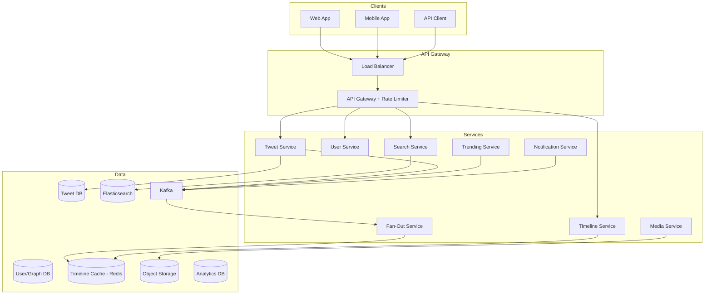
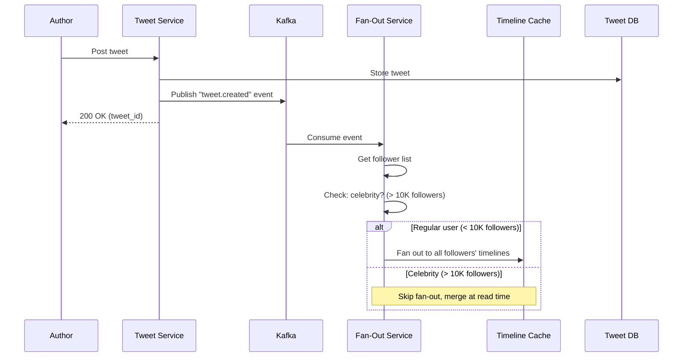
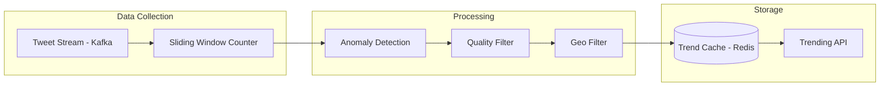
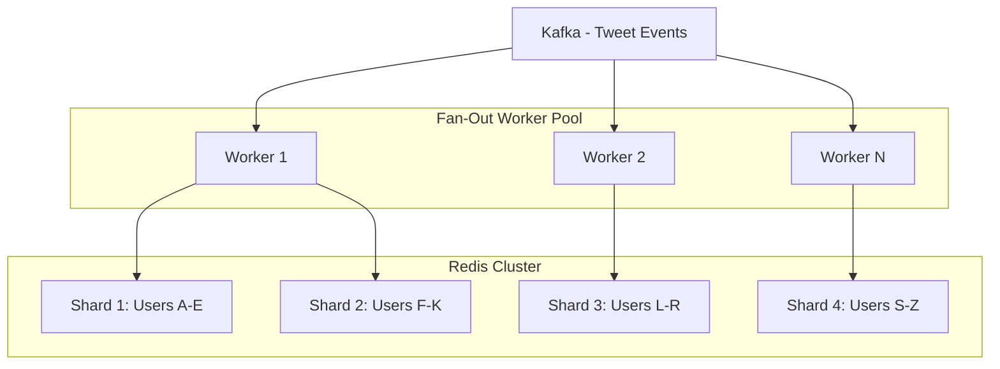

# Design Twitter/X Feed

Twitter (now X) is a microblogging platform where users post short messages (tweets), follow other users, and consume a personalized feed (timeline). This design covers tweet posting, the fan-out service, home timeline generation, trending topics, search, the follow graph, media attachments, and retweets.

---

## 1. Problem Statement & Requirements

### Functional Requirements

1. **Post tweets** — Text (280 chars), images, videos, polls
2. **Home timeline** — Feed of tweets from accounts the user follows, ranked by relevance
3. **Follow/Unfollow** — Asymmetric follow relationships
4. **Retweet and Quote Tweet** — Reshare with or without commentary
5. **Like tweets** — Express engagement
6. **Search** — Search for tweets, users, hashtags
7. **Trending topics** — Surface trending hashtags and topics
8. **Notifications** — Mentions, likes, retweets, new followers
9. **Direct Messages** — Private messaging (simplified scope)

### Non-Functional Requirements

1. **High availability** — 99.99% uptime
2. **Low latency** — Timeline loads in < 300ms (p99)
3. **Scale** — 400M DAU, 600M tweets/day
4. **Eventual consistency** — Acceptable for timelines (few seconds delay)
5. **Read-heavy** — Timeline reads far exceed tweet writes (~100:1)

### Clarifying Questions

::: tip Questions to Ask
- Is the timeline chronological or algorithmically ranked?
- What is the average number of followers per user?
- What percentage of users are "heavy" (> 100K followers)?
- Do we need to support tweet editing?
- What about embedded links and link previews?
- Are spaces/audio rooms in scope?
:::

---

## 2. Back-of-Envelope Estimation

### Traffic

- 400M DAU
- 600M tweets/day
- Average user reads timeline 10 times/day

$$
\text{Tweet Write QPS} = \frac{600M}{86400} \approx 6{,}944 \text{ QPS}
$$

$$
\text{Peak Write QPS} \approx 6{,}944 \times 5 \approx 35K \text{ QPS}
$$

$$
\text{Timeline Read QPS} = \frac{400M \times 10}{86400} \approx 46{,}296 \text{ QPS}
$$

$$
\text{Peak Read QPS} \approx 46K \times 3 \approx 139K \text{ QPS}
$$

### Storage

**Tweet storage:**
- Average tweet: 280 bytes text + 200 bytes metadata = ~500 bytes
- 20% of tweets have media: avg 500KB per media

$$
\text{Daily text storage} = 600M \times 500B = 300 \text{ GB/day}
$$

$$
\text{Daily media storage} = 600M \times 0.2 \times 500KB = 60 \text{ TB/day}
$$

$$
\text{Annual text} = 300 \text{ GB} \times 365 = 109.5 \text{ TB/year}
$$

$$
\text{Annual media} = 60 \text{ TB} \times 365 = 21.9 \text{ PB/year}
$$

### Fan-Out Estimation

Average user has 200 followers. When a user tweets:

$$
\text{Fan-out operations/sec} = 6{,}944 \times 200 = 1.39M \text{ Redis writes/sec}
$$

For celebrities (10M+ followers), a single tweet would require 10M+ Redis writes, which is why the hybrid approach is essential.

### Timeline Cache

Each timeline stores 800 tweet IDs in Redis:

$$
\text{Active timelines} = 400M \text{ DAU}
$$

$$
\text{Per timeline} = 800 \times 8B = 6.4 \text{ KB}
$$

$$
\text{Total cache} = 400M \times 6.4KB = 2.56 \text{ TB}
$$

---

## 3. High-Level Design



### API Design

```typescript
// Post a tweet
// POST /api/v2/tweets
interface CreateTweetRequest {
  text: string;                  // Max 280 characters
  mediaIds?: string[];           // Pre-uploaded media
  replyToTweetId?: string;       // If this is a reply
  quoteTweetId?: string;         // If this is a quote tweet
  poll?: {
    options: string[];
    durationMinutes: number;
  };
}

interface TweetResponse {
  id: string;
  authorId: string;
  author: UserSummary;
  text: string;
  mediaUrls: string[];
  likeCount: number;
  retweetCount: number;
  replyCount: number;
  quoteCount: number;
  createdAt: string;
  replyToTweetId?: string;
  quotedTweet?: TweetResponse;
  entities: {
    hashtags: string[];
    mentions: string[];
    urls: UrlEntity[];
  };
}

// Get home timeline
// GET /api/v2/timeline/home?cursor=xxx&limit=20
interface TimelineResponse {
  tweets: TweetResponse[];
  cursor: string | null;
  hasMore: boolean;
}

// Search
// GET /api/v2/search?q=query&type=tweets|users&cursor=xxx&limit=20

// Follow/Unfollow
// POST /api/v2/users/:userId/follow
// DELETE /api/v2/users/:userId/follow

// Like
// POST /api/v2/tweets/:tweetId/like
// DELETE /api/v2/tweets/:tweetId/like

// Retweet
// POST /api/v2/tweets/:tweetId/retweet
// DELETE /api/v2/tweets/:tweetId/retweet

// Get trending topics
// GET /api/v2/trends?location=US
```

---

## 4. Database Schema

### Tweet Storage (PostgreSQL, sharded by author_id)

```sql
CREATE TABLE tweets (
    id              BIGINT PRIMARY KEY,  -- Snowflake ID
    author_id       BIGINT NOT NULL,
    text            VARCHAR(280),
    reply_to_id     BIGINT,              -- NULL for original tweets
    quote_of_id     BIGINT,              -- NULL for non-quote tweets
    conversation_id BIGINT,              -- Root tweet of thread
    like_count      INT DEFAULT 0,
    retweet_count   INT DEFAULT 0,
    reply_count     INT DEFAULT 0,
    quote_count     INT DEFAULT 0,
    visibility      VARCHAR(20) DEFAULT 'public',
    source          VARCHAR(100),         -- 'web', 'ios', 'android', 'api'
    language        VARCHAR(5),
    created_at      TIMESTAMP WITH TIME ZONE DEFAULT NOW()
);

CREATE INDEX idx_tweets_author ON tweets(author_id, created_at DESC);
CREATE INDEX idx_tweets_reply ON tweets(reply_to_id) WHERE reply_to_id IS NOT NULL;
CREATE INDEX idx_tweets_conversation ON tweets(conversation_id, created_at);

-- Tweet media
CREATE TABLE tweet_media (
    tweet_id        BIGINT NOT NULL,
    media_id        BIGINT NOT NULL,
    media_type      VARCHAR(20),         -- 'image', 'video', 'gif'
    media_url       VARCHAR(500),
    thumbnail_url   VARCHAR(500),
    width           INT,
    height          INT,
    duration_ms     INT,                  -- for video
    alt_text        VARCHAR(1000),
    display_order   SMALLINT DEFAULT 0,
    PRIMARY KEY (tweet_id, media_id)
);

-- Tweet entities (hashtags, mentions, URLs)
CREATE TABLE tweet_entities (
    tweet_id        BIGINT NOT NULL,
    entity_type     VARCHAR(20),         -- 'hashtag', 'mention', 'url'
    entity_value    VARCHAR(500),
    start_pos       INT,
    end_pos         INT
);

CREATE INDEX idx_entities_hashtag ON tweet_entities(entity_value)
    WHERE entity_type = 'hashtag';
```

### Social Graph (PostgreSQL, sharded by follower_id)

```sql
CREATE TABLE follows (
    follower_id     BIGINT NOT NULL,
    followee_id     BIGINT NOT NULL,
    created_at      TIMESTAMP WITH TIME ZONE DEFAULT NOW(),
    PRIMARY KEY (follower_id, followee_id)
);

-- "Who does this user follow?" — fast on follower shard
CREATE INDEX idx_follows_follower ON follows(follower_id, created_at DESC);
-- "Who follows this user?" — cross-shard query or denormalized
CREATE INDEX idx_follows_followee ON follows(followee_id, created_at DESC);

-- Denormalized follower count
CREATE TABLE user_stats (
    user_id         BIGINT PRIMARY KEY,
    follower_count  BIGINT DEFAULT 0,
    following_count BIGINT DEFAULT 0,
    tweet_count     BIGINT DEFAULT 0,
    like_count      BIGINT DEFAULT 0
);
```

### Likes and Retweets

```sql
CREATE TABLE likes (
    user_id         BIGINT NOT NULL,
    tweet_id        BIGINT NOT NULL,
    created_at      TIMESTAMP WITH TIME ZONE DEFAULT NOW(),
    PRIMARY KEY (user_id, tweet_id)
);

CREATE INDEX idx_likes_tweet ON likes(tweet_id, created_at DESC);

CREATE TABLE retweets (
    user_id         BIGINT NOT NULL,
    tweet_id        BIGINT NOT NULL,
    created_at      TIMESTAMP WITH TIME ZONE DEFAULT NOW(),
    PRIMARY KEY (user_id, tweet_id)
);

CREATE INDEX idx_retweets_tweet ON retweets(tweet_id, created_at DESC);
```

### Timeline Cache (Redis)

```
# Each user's home timeline: sorted set of tweet IDs scored by timestamp
Key: timeline:{userId}
Type: Sorted Set
Score: tweet Snowflake ID (encodes timestamp)
Member: tweet_id
Max size: 800 entries (trimmed on insert)
TTL: 7 days for inactive users
```

---

## 5. Detailed Component Design

### 5.1 Tweet ID Generation (Snowflake)

Twitter invented Snowflake for distributed, time-ordered ID generation:

```
| 1 bit (unused) | 41 bits (timestamp) | 5 bits (datacenter) | 5 bits (worker) | 12 bits (sequence) |
|       0        |    ms since epoch   |       0-31          |      0-31       |      0-4095        |
```

```typescript
class SnowflakeIdGenerator {
  private static readonly EPOCH = 1288834974657n; // Twitter epoch (Nov 4, 2010)
  private sequence = 0n;
  private lastTimestamp = -1n;

  constructor(
    private readonly datacenterId: bigint,  // 0-31
    private readonly workerId: bigint       // 0-31
  ) {}

  nextId(): bigint {
    let timestamp = BigInt(Date.now());

    if (timestamp === this.lastTimestamp) {
      this.sequence = (this.sequence + 1n) & 4095n; // 12-bit mask
      if (this.sequence === 0n) {
        // Sequence exhausted — wait for next millisecond
        while (timestamp <= this.lastTimestamp) {
          timestamp = BigInt(Date.now());
        }
      }
    } else {
      this.sequence = 0n;
    }

    this.lastTimestamp = timestamp;

    return (
      ((timestamp - SnowflakeIdGenerator.EPOCH) << 22n) |
      (this.datacenterId << 17n) |
      (this.workerId << 12n) |
      this.sequence
    );
  }
}

// Usage
const generator = new SnowflakeIdGenerator(1n, 1n);
const tweetId = generator.nextId();
// Result: time-sorted, globally unique, 64-bit integer
```

**Properties:**
- ~4096 IDs per millisecond per worker
- 1024 workers total (32 datacenters x 32 workers)
- Sortable by time (higher ID = newer tweet)
- Total capacity: ~4M IDs/sec across all workers

### 5.2 Fan-Out Service

The fan-out service is the heart of Twitter's architecture. When a user tweets, the service distributes that tweet ID to the timeline caches of all followers.



```typescript
class FanOutService {
  private readonly CELEBRITY_THRESHOLD = 10_000;
  private readonly TIMELINE_MAX_SIZE = 800;
  private readonly BATCH_SIZE = 500;

  async processTweetCreated(event: TweetCreatedEvent): Promise<void> {
    const { tweetId, authorId } = event;

    // 1. Check if author is a celebrity
    const followerCount = await this.getFollowerCount(authorId);

    if (followerCount > this.CELEBRITY_THRESHOLD) {
      // Celebrity: don't fan out (merge at read time)
      // Just index for search and trending
      await this.indexForSearch(event);
      await this.processForTrending(event);
      return;
    }

    // 2. Get all followers
    const followers = await this.getFollowers(authorId);

    // 3. Fan out in batches
    for (let i = 0; i < followers.length; i += this.BATCH_SIZE) {
      const batch = followers.slice(i, i + this.BATCH_SIZE);
      const pipeline = this.redis.pipeline();

      for (const followerId of batch) {
        // Add tweet to follower's timeline (sorted set)
        pipeline.zadd(`timeline:${followerId}`, tweetId.toString(), tweetId.toString());
        // Trim timeline to max size
        pipeline.zremrangebyrank(`timeline:${followerId}`, 0, -(this.TIMELINE_MAX_SIZE + 1));
      }

      await pipeline.exec();
    }

    // 4. Index for search and trending
    await this.indexForSearch(event);
    await this.processForTrending(event);
  }
}
```

### 5.3 Timeline Service

```typescript
class TimelineService {
  async getHomeTimeline(userId: string, cursor?: string, limit: number = 20): Promise<TimelineResponse> {
    // 1. Get pre-computed timeline from cache
    const maxScore = cursor || '+inf';
    const cachedTweetIds = await this.redis.zrevrangebyscore(
      `timeline:${userId}`,
      maxScore,
      '-inf',
      'LIMIT', 0, limit + 10  // Fetch extra for filtering
    );

    // 2. Get celebrity tweets (fan-out on read)
    const celebrityFollowees = await this.getCelebrityFollowees(userId);
    let celebrityTweets: string[] = [];
    if (celebrityFollowees.length > 0) {
      celebrityTweets = await this.getRecentTweetsFromUsers(celebrityFollowees, cursor, 50);
    }

    // 3. Merge and deduplicate
    const allTweetIds = [...new Set([...cachedTweetIds, ...celebrityTweets])];

    // 4. Hydrate tweet objects (batch fetch from DB + cache)
    const tweets = await this.hydrateTweets(allTweetIds);

    // 5. Rank (algorithmic timeline)
    const ranked = await this.rankTimeline(userId, tweets);

    // 6. Apply filtering (muted accounts, blocked content)
    const filtered = await this.applyFilters(userId, ranked);

    // 7. Paginate
    const page = filtered.slice(0, limit);
    const nextCursor = page.length > 0 ? page[page.length - 1].id : null;

    return {
      tweets: page,
      cursor: nextCursor,
      hasMore: filtered.length > limit,
    };
  }

  // Hydrate tweet IDs into full tweet objects
  private async hydrateTweets(tweetIds: string[]): Promise<Tweet[]> {
    if (tweetIds.length === 0) return [];

    // 1. Check cache first
    const cacheKeys = tweetIds.map(id => `tweet:${id}`);
    const cached = await this.redis.mget(...cacheKeys);

    const tweets: Tweet[] = [];
    const missingIds: string[] = [];

    cached.forEach((value, index) => {
      if (value) {
        tweets.push(JSON.parse(value));
      } else {
        missingIds.push(tweetIds[index]);
      }
    });

    // 2. Fetch missing from DB
    if (missingIds.length > 0) {
      const dbTweets = await this.db.query(
        `SELECT * FROM tweets WHERE id = ANY($1)`,
        [missingIds]
      );

      // Cache for future requests
      const pipeline = this.redis.pipeline();
      for (const tweet of dbTweets) {
        pipeline.setEx(`tweet:${tweet.id}`, 3600, JSON.stringify(tweet));
        tweets.push(tweet);
      }
      await pipeline.exec();
    }

    return tweets;
  }
}
```

### 5.4 Timeline Ranking

```typescript
class TimelineRanker {
  async rank(userId: string, tweets: Tweet[]): Promise<Tweet[]> {
    const userProfile = await this.getUserProfile(userId);

    const scored = tweets.map(tweet => ({
      tweet,
      score: this.calculateScore(userProfile, tweet),
    }));

    // Sort by score descending
    scored.sort((a, b) => b.score - a.score);

    // Insert diversity breaks (don't show 5 tweets from same author in a row)
    return this.diversify(scored.map(s => s.tweet));
  }

  private calculateScore(user: UserProfile, tweet: Tweet): number {
    let score = 0;

    // 1. Recency (exponential decay, half-life = 6 hours)
    const ageHours = (Date.now() - new Date(tweet.createdAt).getTime()) / 3600000;
    score += 100 * Math.exp(-ageHours / 8.66); // ln(2) * half_life

    // 2. Engagement (log scale to prevent viral tweets from dominating)
    score += Math.log1p(tweet.likeCount) * 5;
    score += Math.log1p(tweet.retweetCount) * 8;
    score += Math.log1p(tweet.replyCount) * 3;

    // 3. Author relationship strength
    const interactionScore = user.interactionHistory[tweet.authorId] || 0;
    score += interactionScore * 20;

    // 4. Content relevance (topic matching)
    const topicMatch = this.calculateTopicMatch(user.interests, tweet);
    score += topicMatch * 15;

    // 5. Media boost (tweets with images/videos get slight boost)
    if (tweet.mediaUrls && tweet.mediaUrls.length > 0) {
      score *= 1.1;
    }

    // 6. Verified author boost
    if (tweet.author.isVerified) {
      score *= 1.05;
    }

    return score;
  }

  private diversify(tweets: Tweet[]): Tweet[] {
    const result: Tweet[] = [];
    const authorConsecutive: Map<string, number> = new Map();

    for (const tweet of tweets) {
      const consecutive = authorConsecutive.get(tweet.authorId) || 0;
      if (consecutive >= 2) {
        // Skip — too many consecutive tweets from same author
        // Add to a "deferred" list and insert later
        continue;
      }

      result.push(tweet);

      // Reset all other authors, increment this one
      for (const [key] of authorConsecutive) {
        if (key !== tweet.authorId) authorConsecutive.set(key, 0);
      }
      authorConsecutive.set(tweet.authorId, consecutive + 1);
    }

    return result;
  }
}
```

### 5.5 Trending Topics



```typescript
class TrendingService {
  private readonly WINDOW_SIZES = [
    { name: '1h', seconds: 3600 },
    { name: '6h', seconds: 21600 },
    { name: '24h', seconds: 86400 },
  ];

  async processHashtag(hashtag: string, location: string, timestamp: number): Promise<void> {
    const normalizedTag = hashtag.toLowerCase();

    for (const window of this.WINDOW_SIZES) {
      const bucket = Math.floor(timestamp / window.seconds);
      const key = `trending:${window.name}:${bucket}`;

      // Increment count in sorted set
      await this.redis.zincrby(key, 1, normalizedTag);
      await this.redis.expire(key, window.seconds * 2); // Keep 2 windows
    }

    // Location-specific trending
    if (location) {
      const locKey = `trending:1h:${location}:${Math.floor(timestamp / 3600)}`;
      await this.redis.zincrby(locKey, 1, normalizedTag);
      await this.redis.expire(locKey, 7200);
    }
  }

  async getTrending(location?: string, limit: number = 30): Promise<TrendingTopic[]> {
    const currentBucket = Math.floor(Date.now() / 1000 / 3600);
    const previousBucket = currentBucket - 1;

    // Current and previous hour counts
    const currentKey = location
      ? `trending:1h:${location}:${currentBucket}`
      : `trending:1h:${currentBucket}`;
    const previousKey = location
      ? `trending:1h:${location}:${previousBucket}`
      : `trending:1h:${previousBucket}`;

    const current = await this.redis.zrevrangebyscore(currentKey, '+inf', 0, 'WITHSCORES', 'LIMIT', 0, 100);
    const previous = await this.redis.zrevrangebyscore(previousKey, '+inf', 0, 'WITHSCORES', 'LIMIT', 0, 100);

    // Calculate velocity (how fast is this trending?)
    const trends: TrendingTopic[] = [];
    for (let i = 0; i < current.length; i += 2) {
      const hashtag = current[i];
      const currentCount = parseInt(current[i + 1]);
      const previousCount = parseInt(await this.redis.zscore(previousKey, hashtag) || '0');

      const velocity = previousCount > 0
        ? (currentCount - previousCount) / previousCount
        : currentCount; // New trend: velocity = count

      trends.push({
        hashtag,
        tweetCount: currentCount,
        velocity,
      });
    }

    // Sort by velocity (not just count) to surface emerging trends
    trends.sort((a, b) => b.velocity - a.velocity);

    // Filter low-quality trends (spam, offensive)
    const filtered = await this.filterTrends(trends);

    return filtered.slice(0, limit);
  }
}
```

### 5.6 Search

```typescript
class TweetSearchService {
  // Index tweets as they're created
  async indexTweet(tweet: Tweet): Promise<void> {
    await this.elasticsearch.index({
      index: 'tweets',
      id: tweet.id,
      body: {
        text: tweet.text,
        author_id: tweet.authorId,
        author_username: tweet.author.username,
        author_verified: tweet.author.isVerified,
        hashtags: tweet.entities.hashtags,
        mentions: tweet.entities.mentions,
        language: tweet.language,
        created_at: tweet.createdAt,
        like_count: tweet.likeCount,
        retweet_count: tweet.retweetCount,
        has_media: tweet.mediaUrls.length > 0,
      },
    });
  }

  async search(query: string, options: SearchOptions): Promise<SearchResult> {
    const { type = 'top', cursor, limit = 20 } = options;

    let sort: any[];
    if (type === 'latest') {
      sort = [{ created_at: 'desc' }];
    } else {
      sort = [{ _score: 'desc' }, { created_at: 'desc' }];
    }

    const result = await this.elasticsearch.search({
      index: 'tweets',
      body: {
        query: {
          bool: {
            must: [
              {
                multi_match: {
                  query,
                  fields: ['text^3', 'hashtags^2', 'author_username'],
                  type: 'best_fields',
                },
              },
            ],
            should: [
              // Boost verified authors
              { term: { author_verified: { value: true, boost: 2.0 } } },
              // Boost recent tweets
              {
                range: {
                  created_at: { gte: 'now-24h', boost: 1.5 },
                },
              },
              // Boost high-engagement tweets
              {
                function_score: {
                  field_value_factor: {
                    field: 'like_count',
                    modifier: 'log1p',
                    factor: 0.5,
                  },
                },
              },
            ],
          },
        },
        sort,
        size: limit,
        search_after: cursor ? JSON.parse(cursor) : undefined,
      },
    });

    const tweets = result.hits.hits.map(hit => hit._source);
    const nextCursor = result.hits.hits.length > 0
      ? JSON.stringify(result.hits.hits[result.hits.hits.length - 1].sort)
      : null;

    return { tweets, cursor: nextCursor, hasMore: tweets.length === limit };
  }
}
```

### 5.7 Retweet and Quote Tweet

```typescript
class RetweetService {
  async retweet(userId: string, tweetId: string): Promise<void> {
    // 1. Check if already retweeted
    const existing = await this.db.query(
      'SELECT 1 FROM retweets WHERE user_id = $1 AND tweet_id = $2',
      [userId, tweetId]
    );
    if (existing) throw new ConflictError('Already retweeted');

    // 2. Record retweet
    await this.db.query(
      'INSERT INTO retweets (user_id, tweet_id) VALUES ($1, $2)',
      [userId, tweetId]
    );

    // 3. Increment retweet count
    await this.db.query(
      'UPDATE tweets SET retweet_count = retweet_count + 1 WHERE id = $1',
      [tweetId]
    );

    // 4. Fan out the retweet to the user's followers' timelines
    //    (The retweeted tweet appears in their timelines, attributed to the retweeter)
    await this.kafka.send('tweet-events', {
      key: userId,
      value: {
        type: 'retweet',
        retweeterId: userId,
        originalTweetId: tweetId,
        timestamp: Date.now(),
      },
    });

    // 5. Notify original author
    await this.kafka.send('notifications', {
      key: tweetId,
      value: {
        type: 'retweet',
        actorId: userId,
        tweetId,
      },
    });
  }

  async quoteTweet(userId: string, tweetId: string, text: string): Promise<Tweet> {
    // Quote tweet is a new tweet with a reference to the quoted tweet
    const quoteTweet = await this.tweetService.createTweet({
      authorId: userId,
      text,
      quoteTweetId: tweetId,
    });

    // Increment quote count on original
    await this.db.query(
      'UPDATE tweets SET quote_count = quote_count + 1 WHERE id = $1',
      [tweetId]
    );

    return quoteTweet;
  }
}
```

---

## 6. Scaling & Bottlenecks

### What Breaks First?

| Scale | Bottleneck | Solution |
|-------|-----------|----------|
| 1M DAU | Single database | Read replicas |
| 10M DAU | Timeline generation latency | Fan-out on write + Redis |
| 100M DAU | Celebrity fan-out | Hybrid approach |
| 400M DAU | Redis cluster memory | Tiered caching, evict inactive |
| 1B+ DAU | Global latency | Multi-region deployment |

### Fan-Out Scaling



- Fan-out workers consume from Kafka and write to Redis
- Redis cluster: ~30 nodes for 2.5TB timeline cache
- Kafka partitioned by author_id for ordered processing

### Database Sharding

```
Tweet Table:
  Shard key: author_id (user's tweets co-located)
  16 shards, each with 3 replicas
  Cross-shard: tweet lookup by ID uses a tweet-to-shard mapping

Follow Graph:
  Shard key: follower_id
  "Who does user X follow?" is single-shard
  "Who follows user X?" requires scatter-gather or a reverse index

Likes Table:
  Shard key: tweet_id
  "Who liked this tweet?" is single-shard
  "What tweets did user X like?" requires scatter-gather or user-likes index
```

### Search Scaling

Elasticsearch cluster for tweet search:
- 20+ data nodes for 600M tweets/day
- Shard by time (daily indices): `tweets-2026-03-18`
- Keep 30 days in hot storage, older in warm/cold
- Index lifecycle management (ILM) to auto-rotate

---

## 7. Trade-offs & Alternatives

### Fan-Out Strategy Comparison

| Approach | Write Cost | Read Cost | Memory | Latency |
|----------|-----------|-----------|--------|---------|
| Pure fan-out on write | O(followers) | O(1) | High | Low read |
| Pure fan-out on read | O(1) | O(following) | Low | High read |
| **Hybrid (recommended)** | **O(followers), skip celebrities** | **O(1) + O(celeb_following)** | **Medium** | **Low read** |

### ID Generation Alternatives

| Approach | Ordered | Distributed | Compact | Predictable |
|----------|---------|-------------|---------|-------------|
| **Snowflake** | **Yes** | **Yes** | **64-bit** | **Somewhat** |
| UUID v4 | No | Yes | 128-bit | No |
| UUID v7 | Yes | Yes | 128-bit | Somewhat |
| ULID | Yes | Yes | 128-bit | Somewhat |
| Auto-increment | Yes | No (single point) | 64-bit | Yes |

Twitter chose Snowflake for its compactness (64-bit fits in a long) and time-ordering property.

### Timeline: Algorithmic vs Chronological

| Aspect | Algorithmic | Chronological |
|--------|------------|---------------|
| User engagement | Higher (+5-8%) | Lower |
| User satisfaction | Controversial | Preferred by power users |
| Engineering complexity | High (ML models) | Low |
| Content discovery | Good | Poor (miss tweets if not online) |
| **Twitter's approach** | **Default** | **Available as "Latest" tab** |

---

## 8. Advanced Topics

### 8.1 Thread (Conversation) Support

```typescript
class ThreadService {
  async getThread(tweetId: string): Promise<ThreadResponse> {
    // 1. Get the root tweet (walk up reply chain)
    let rootTweet = await this.getTweet(tweetId);
    while (rootTweet.replyToId) {
      rootTweet = await this.getTweet(rootTweet.replyToId);
    }

    // 2. Get all tweets in the conversation
    const conversationTweets = await this.db.query(
      `SELECT * FROM tweets WHERE conversation_id = $1 ORDER BY created_at ASC`,
      [rootTweet.id]
    );

    // 3. Build tree structure
    const tree = this.buildReplyTree(conversationTweets);

    return { rootTweet, replies: tree };
  }

  private buildReplyTree(tweets: Tweet[]): ThreadNode[] {
    const tweetMap = new Map<string, ThreadNode>();
    const roots: ThreadNode[] = [];

    for (const tweet of tweets) {
      tweetMap.set(tweet.id, { tweet, replies: [] });
    }

    for (const tweet of tweets) {
      const node = tweetMap.get(tweet.id)!;
      if (tweet.replyToId && tweetMap.has(tweet.replyToId)) {
        tweetMap.get(tweet.replyToId)!.replies.push(node);
      } else {
        roots.push(node);
      }
    }

    return roots;
  }
}
```

### 8.2 Mute and Block

```typescript
class ModerationService {
  async muteUser(userId: string, targetId: string): Promise<void> {
    await this.db.query(
      'INSERT INTO muted_users (user_id, muted_id) VALUES ($1, $2) ON CONFLICT DO NOTHING',
      [userId, targetId]
    );

    // Update cache — muted users' tweets are filtered from timeline at read time
    await this.redis.sadd(`muted:${userId}`, targetId);
  }

  async blockUser(userId: string, targetId: string): Promise<void> {
    await this.db.query(
      'INSERT INTO blocked_users (user_id, blocked_id) VALUES ($1, $2) ON CONFLICT DO NOTHING',
      [userId, targetId]
    );

    // Also remove the follow relationship in both directions
    await this.db.query(
      'DELETE FROM follows WHERE (follower_id = $1 AND followee_id = $2) OR (follower_id = $2 AND followee_id = $1)',
      [userId, targetId]
    );

    // Remove blocked user's tweets from the blocker's timeline cache
    const blockedTweets = await this.getRecentTweetIds(targetId, 800);
    if (blockedTweets.length > 0) {
      await this.redis.zrem(`timeline:${userId}`, ...blockedTweets);
    }
  }
}
```

### 8.3 Rate Limiting

```typescript
const rateLimits = {
  tweet: { window: 900, max: 300 },      // 300 tweets per 15 min
  like: { window: 900, max: 1000 },       // 1000 likes per 15 min
  follow: { window: 86400, max: 400 },    // 400 follows per day
  dm: { window: 86400, max: 500 },        // 500 DMs per day
  search: { window: 900, max: 180 },      // 180 searches per 15 min (API)
  timeline: { window: 900, max: 900 },    // 900 timeline reads per 15 min
};

class RateLimiter {
  async check(userId: string, action: string): Promise<RateLimitResult> {
    const config = rateLimits[action];
    const key = `ratelimit:${action}:${userId}`;

    const current = await this.redis.incr(key);
    if (current === 1) {
      await this.redis.expire(key, config.window);
    }

    const remaining = Math.max(0, config.max - current);
    const resetAt = await this.redis.ttl(key);

    return {
      allowed: current <= config.max,
      remaining,
      resetAt: Date.now() + resetAt * 1000,
      limit: config.max,
    };
  }
}
```

### 8.4 Tweet Analytics

```typescript
class TweetAnalytics {
  async recordImpression(tweetId: string, viewerId: string): Promise<void> {
    // Use HyperLogLog for approximate unique impression counting
    await this.redis.pfadd(`impressions:${tweetId}`, viewerId);

    // Batch to Kafka for detailed analytics
    await this.kafka.send('impressions', {
      key: tweetId,
      value: { tweetId, viewerId, timestamp: Date.now() },
    });
  }

  async getTweetAnalytics(tweetId: string): Promise<TweetAnalyticsData> {
    const [impressions, engagements] = await Promise.all([
      this.redis.pfcount(`impressions:${tweetId}`),
      this.getEngagementMetrics(tweetId),
    ]);

    return {
      impressions,
      engagements: engagements.total,
      engagementRate: engagements.total / impressions,
      likes: engagements.likes,
      retweets: engagements.retweets,
      replies: engagements.replies,
      profileClicks: engagements.profileClicks,
      linkClicks: engagements.linkClicks,
    };
  }
}
```

---

## 9. Interview Tips

### What Interviewers Look For

1. **Fan-out strategy** — Can you explain push vs pull and the hybrid approach?
2. **Celebrity problem** — Do you identify the issue with high-follower fan-out?
3. **ID generation** — Do you understand why sequential, distributed IDs are needed?
4. **Timeline ranking** — Can you describe factors in algorithmic ranking?
5. **Trending algorithm** — Velocity-based, not just raw count

### Common Follow-Up Questions

::: details "What happens when a user with 50M followers tweets?"
In the hybrid model, this tweet is NOT fanned out on write. It is stored in the tweet database and indexed for search. When any follower loads their timeline, the timeline service fetches recent tweets from celebrity accounts they follow and merges them with the pre-computed timeline cache. This adds 10-50ms of latency but avoids 50M Redis writes.
:::

::: details "How do you ensure tweets are not lost?"
Tweets are first written to the database (PostgreSQL with synchronous replication). The fan-out event is published to Kafka (replicated topic, acks=all). Even if the fan-out service fails, the tweet is durably stored and will appear when followers view the author's profile. Timeline cache is a best-effort optimization.
:::

::: details "How does 'delete tweet' work with fan-out?"
When a tweet is deleted, publish a "tweet.deleted" event to Kafka. The fan-out service removes the tweet ID from all affected timeline caches. However, some timelines may have already been served with the deleted tweet — this is accepted as eventual consistency. The tweet is also soft-deleted in the database.
:::

::: details "How do you handle trending topic manipulation?"
Use velocity-based detection (rate of increase, not absolute count). Apply spam filters to exclude tweets from bot-like accounts. Require minimum unique author count for a topic to trend. Monitor for coordinated behavior (many accounts tweeting the same hashtag simultaneously from similar patterns).
:::

::: details "How do you handle a tweet that goes viral?"
The tweet itself is cached in Redis/Memcached. Engagement counts (likes, retweets) are updated via Redis counters and batch-flushed to the DB. If the author is a regular user, the initial fan-out already happened. As more people engage, the tweet surfaces through the algorithmic timeline and trending system without additional fan-out.
:::

### Time Allocation (45-minute interview)

| Phase | Time | Focus |
|-------|------|-------|
| Requirements | 4 min | Core features, scale, timeline type |
| Estimation | 4 min | QPS, fan-out volume, cache size |
| High-level design | 10 min | Architecture diagram, data flow |
| Fan-out deep dive | 12 min | Push vs pull vs hybrid, celebrity problem |
| Timeline + ranking | 5 min | Cache structure, ranking factors |
| Search + trending | 5 min | ES indexing, velocity-based trending |
| Scaling | 5 min | Sharding, Redis cluster, multi-region |

::: info War Story
Twitter's original architecture used a pure fan-out-on-write approach with MySQL. This worked until they experienced the "thundering herd" problem during events like the Super Bowl or World Cup, where millions of users tweet simultaneously about the same event. The fan-out queues would back up for hours, causing timelines to be hours behind real-time. The solution was the hybrid approach: celebrity tweets (the ones most likely to be seen during big events) are merged at read time, and the fan-out service only handles regular users. This reduced peak fan-out load by 90%.
:::

---

## Summary

| Component | Technology | Scale |
|-----------|-----------|-------|
| Tweet Storage | PostgreSQL (sharded by author_id) | 600M tweets/day |
| Timeline Cache | Redis Cluster (30 nodes) | 2.5 TB, 139K QPS |
| Fan-Out | Kafka + Worker Pool | 1.39M writes/sec |
| ID Generation | Snowflake | 4M IDs/sec |
| Search | Elasticsearch (daily indices) | 28K QPS |
| Trending | Redis Sorted Sets + Sliding Window | Real-time |
| Media | S3 + CDN | 60 TB/day |
| Social Graph | PostgreSQL (sharded by follower_id) | 400M users |
| Notifications | Kafka + Push Services | Millions/sec |
