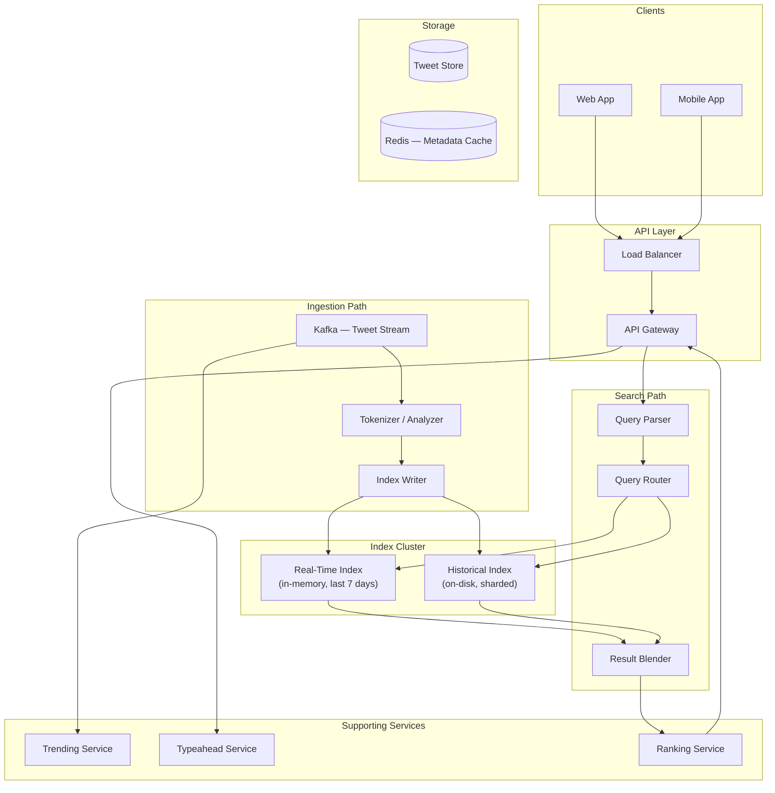
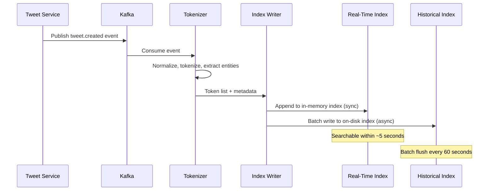
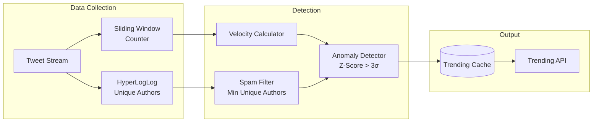
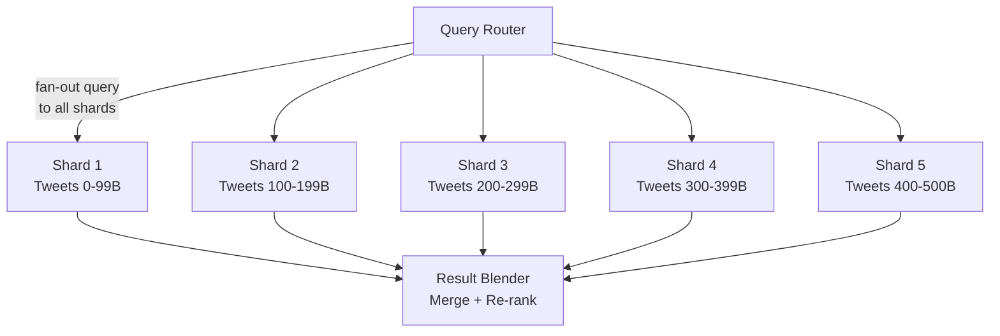

# Design Twitter Search

Twitter Search is fundamentally different from web search. Web search indexes documents that rarely change and can tolerate hours of crawl delay. Twitter Search must ingest 600 million tweets per day — roughly 7,000 tweets per second — and make every tweet searchable within seconds of posting. The index is append-heavy, recency-biased, and must support real-time trending detection alongside traditional keyword queries.

---

## 1. Problem Statement & Requirements

### Functional Requirements

| # | Requirement |
|---|-------------|
| FR-1 | Full-text search across all public tweets |
| FR-2 | Return results ranked by relevance and recency |
| FR-3 | Support hashtag search (`#AI`) |
| FR-4 | Support mention search (`@elonmusk`) |
| FR-5 | Filter by date range, language, media type, verified status |
| FR-6 | Support Boolean operators (`AND`, `OR`, `-exclude`) |
| FR-7 | Trending topics — surface topics gaining velocity |
| FR-8 | Near-real-time indexing — tweets searchable within 10 seconds |
| FR-9 | Typeahead suggestions while typing a search query |

### Non-Functional Requirements

| # | Requirement | Target |
|---|-------------|--------|
| NFR-1 | Search latency | p99 < 500 ms |
| NFR-2 | Indexing latency | < 10 seconds from tweet creation |
| NFR-3 | Availability | 99.99% |
| NFR-4 | Throughput | 50,000 search QPS |
| NFR-5 | Scale | 500 billion historical tweets |
| NFR-6 | Consistency | Eventual (seconds) — acceptable for search |

### Clarifying Questions

::: tip Questions to Ask
- Do we need to search deleted tweets? (No — they must be removed from the index promptly)
- Is the ranking chronological or relevance-based? (Relevance by default, chronological as an option)
- Do we need to support geo-search? (Bonus, not core)
- Are DMs in scope? (No — only public tweets)
- How far back must results go? (Full history — 15+ years)
- Do we need personalized results? (Yes — boosted by social graph)
:::

---

## 2. Back-of-Envelope Estimation

### Traffic

- 400M DAU, ~15% perform searches daily
- Average searches per searching user: 5

$$
\text{Search QPS} = \frac{400M \times 0.15 \times 5}{86{,}400} \approx 34{,}722 \text{ QPS}
$$

$$
\text{Peak Search QPS} \approx 35K \times 3 \approx 105K \text{ QPS}
$$

### Indexing Load

- 600M tweets/day, average tweet 40 tokens after normalization

$$
\text{Tweet Ingest Rate} = \frac{600M}{86{,}400} \approx 6{,}944 \text{ tweets/sec}
$$

$$
\text{Token Ingest Rate} = 6{,}944 \times 40 = 277{,}760 \text{ tokens/sec}
$$

### Index Size

$$
\text{Historical tweets} = 500 \times 10^9
$$

- Each posting: `(tweetId: 8B, position: 2B, timestamp: 4B)` = 14 bytes
- Average 40 postings per tweet

$$
\text{Postings total} = 500 \times 10^9 \times 40 = 20 \times 10^{12}
$$

$$
\text{Inverted index size} = 20 \times 10^{12} \times 14B = 280 \text{ TB}
$$

### Storage

$$
\text{Tweet metadata store} = 500 \times 10^9 \times 500B = 250 \text{ TB}
$$

$$
\text{Total storage} \approx 280 + 250 = 530 \text{ TB}
$$

---

## 3. High-Level Design



### Core Insight: Two-Tier Index

The key architectural decision is splitting the index into two tiers:

1. **Real-Time Index** — in-memory inverted index covering the last 7 days. Optimized for write throughput and low-latency reads. This is where 80%+ of search traffic goes (people mostly search recent content).
2. **Historical Index** — on-disk inverted index covering the full archive. Sharded by time ranges. Optimized for large-scale batch reads with acceptable higher latency.

::: warning Why Not Just Elasticsearch?
Twitter's Earlybird (their custom search engine) exists because generic search engines like Elasticsearch are not optimized for the append-heavy, time-ordered, real-time workload of social media. Earlybird uses a single-writer model with lock-free concurrent reads, achieving 10x better write throughput than Elasticsearch on the same hardware.
:::

---

## 4. API Design

```typescript
// Search tweets
// GET /api/v2/search?q=query&type=top|latest|people&cursor=xxx&limit=20

interface SearchRequest {
  q: string;                    // Query string with operators
  type?: 'top' | 'latest' | 'people' | 'photos' | 'videos';
  cursor?: string;              // Opaque pagination token
  limit?: number;               // Max results per page (default 20)
  lang?: string;                // ISO 639-1 language filter
  since?: string;               // Date lower bound (ISO 8601)
  until?: string;               // Date upper bound (ISO 8601)
  fromUser?: string;            // Filter by author
  minLikes?: number;            // Engagement filter
  minRetweets?: number;
}

interface SearchResponse {
  results: TweetResult[];
  cursor: string | null;
  hasMore: boolean;
  queryId: string;              // For analytics tracking
  latencyMs: number;
}

interface TweetResult {
  tweetId: string;
  authorId: string;
  author: UserSummary;
  text: string;
  highlightedText: string;      // With <mark> tags
  mediaUrls: string[];
  likeCount: number;
  retweetCount: number;
  replyCount: number;
  createdAt: string;
  score: number;                // Relevance score
}

// Get trending topics
// GET /api/v2/trends?location=US&limit=30

// Get typeahead suggestions
// GET /api/v2/search/suggestions?q=prefix&limit=10
```

---

## 5. Data Model

### Inverted Index Structure

The inverted index maps each token to a postings list — a sorted list of tweet IDs containing that token.

```
Token: "openai"
Postings: [
  { tweetId: 1829347, position: 3, timestamp: 1710892800 },
  { tweetId: 1829412, position: 0, timestamp: 1710892815 },
  { tweetId: 1829598, position: 7, timestamp: 1710892830 },
  ...
]
```

### Tweet Metadata Store (PostgreSQL, sharded by tweet_id)

```sql
CREATE TABLE tweet_search_metadata (
    tweet_id        BIGINT PRIMARY KEY,
    author_id       BIGINT NOT NULL,
    language        CHAR(2),
    has_media       BOOLEAN DEFAULT FALSE,
    media_type      VARCHAR(10),           -- 'photo', 'video', 'gif'
    is_verified     BOOLEAN DEFAULT FALSE,
    like_count      INT DEFAULT 0,
    retweet_count   INT DEFAULT 0,
    reply_count     INT DEFAULT 0,
    created_at      TIMESTAMP WITH TIME ZONE NOT NULL,
    is_deleted      BOOLEAN DEFAULT FALSE
);

CREATE INDEX idx_search_meta_author ON tweet_search_metadata(author_id);
CREATE INDEX idx_search_meta_created ON tweet_search_metadata(created_at DESC);
```

### Trending Data (Redis)

```
-- Sorted sets for sliding-window counting
ZADD trending:1h:{​{bucket}} {score} {hashtag}
ZADD trending:global:{​{bucket}} {score} {topic}

-- HyperLogLog for unique author count (anti-spam)
PFADD trend:authors:{​{topic}}:{​{window}} {authorId}
```

---

## 6. Detailed Design

### 6.1 Tweet Ingestion Pipeline



```typescript
class TweetTokenizer {
  private readonly STOP_WORDS = new Set([
    'the', 'a', 'an', 'is', 'are', 'was', 'in', 'on', 'at', 'to', 'for',
  ]);

  tokenize(tweet: RawTweet): TokenizedTweet {
    const tokens: Token[] = [];

    // 1. Extract hashtags (preserve as-is, also lowercase)
    const hashtags = this.extractHashtags(tweet.text);
    for (const tag of hashtags) {
      tokens.push({ term: `#${tag.toLowerCase()}`, position: tag.position, type: 'hashtag' });
    }

    // 2. Extract mentions
    const mentions = this.extractMentions(tweet.text);
    for (const mention of mentions) {
      tokens.push({ term: `@${mention.username.toLowerCase()}`, position: mention.position, type: 'mention' });
    }

    // 3. Tokenize text
    const words = tweet.text
      .replace(/https?:\/\/\S+/g, '')     // Remove URLs
      .replace(/[^\w\s#@]/g, ' ')          // Remove punctuation
      .toLowerCase()
      .split(/\s+/)
      .filter(w => w.length > 1 && !this.STOP_WORDS.has(w));

    let pos = 0;
    for (const word of words) {
      tokens.push({ term: word, position: pos++, type: 'word' });
    }

    // 4. Extract URLs for domain indexing
    const urls = this.extractUrls(tweet.text);
    for (const url of urls) {
      tokens.push({ term: `domain:${url.domain}`, position: pos++, type: 'url' });
    }

    return {
      tweetId: tweet.id,
      authorId: tweet.authorId,
      tokens,
      language: tweet.language,
      createdAt: tweet.createdAt,
    };
  }

  private extractHashtags(text: string): { tag: string; position: number }[] {
    const regex = /#(\w+)/g;
    const results: { tag: string; position: number }[] = [];
    let match;
    while ((match = regex.exec(text)) !== null) {
      results.push({ tag: match[1], position: match.index });
    }
    return results;
  }

  private extractMentions(text: string): { username: string; position: number }[] {
    const regex = /@(\w+)/g;
    const results: { username: string; position: number }[] = [];
    let match;
    while ((match = regex.exec(text)) !== null) {
      results.push({ username: match[1], position: match.index });
    }
    return results;
  }

  private extractUrls(text: string): { domain: string }[] {
    const regex = /https?:\/\/([^\s/]+)/g;
    const results: { domain: string }[] = [];
    let match;
    while ((match = regex.exec(text)) !== null) {
      results.push({ domain: match[1] });
    }
    return results;
  }
}
```

### 6.2 Real-Time In-Memory Index

The real-time index uses a concurrent hash map of postings lists with lock-free reads.

```typescript
class RealTimeIndex {
  // Token -> sorted postings list (sorted by tweetId descending = chronological)
  private index: Map<string, PostingsList> = new Map();
  private readonly MAX_AGE_MS = 7 * 24 * 60 * 60 * 1000; // 7 days

  append(tokenized: TokenizedTweet): void {
    const posting: Posting = {
      tweetId: tokenized.tweetId,
      authorId: tokenized.authorId,
      timestamp: new Date(tokenized.createdAt).getTime(),
    };

    for (const token of tokenized.tokens) {
      let list = this.index.get(token.term);
      if (!list) {
        list = new PostingsList();
        this.index.set(token.term, list);
      }
      list.append(posting, token.position);
    }
  }

  search(term: string, maxResults: number): Posting[] {
    const list = this.index.get(term);
    if (!list) return [];
    return list.getRecent(maxResults);
  }

  // Intersect postings for multi-term queries
  intersect(terms: string[], maxResults: number): Posting[] {
    const lists = terms
      .map(t => this.index.get(t))
      .filter((l): l is PostingsList => l !== undefined)
      .sort((a, b) => a.size() - b.size()); // Start with shortest list

    if (lists.length === 0) return [];
    if (lists.length === 1) return lists[0].getRecent(maxResults);

    // Sorted merge intersection (all lists sorted by tweetId desc)
    return this.sortedIntersect(lists, maxResults);
  }

  private sortedIntersect(lists: PostingsList[], maxResults: number): Posting[] {
    const iterators = lists.map(l => l.iterator());
    const result: Posting[] = [];

    // Advance all iterators to their first element
    const current = iterators.map(it => it.next());

    while (result.length < maxResults && current.every(c => !c.done)) {
      const maxId = Math.max(...current.map(c => c.value!.tweetId));
      const allMatch = current.every(c => c.value!.tweetId === maxId);

      if (allMatch) {
        result.push(current[0].value!);
        // Advance all iterators
        for (let i = 0; i < iterators.length; i++) {
          current[i] = iterators[i].next();
        }
      } else {
        // Advance iterators that are behind
        for (let i = 0; i < iterators.length; i++) {
          while (!current[i].done && current[i].value!.tweetId > maxId) {
            current[i] = iterators[i].next();
          }
        }
      }
    }

    return result;
  }

  // Periodic cleanup of expired postings
  gc(): void {
    const cutoff = Date.now() - this.MAX_AGE_MS;
    for (const [term, list] of this.index) {
      list.removeBefore(cutoff);
      if (list.size() === 0) {
        this.index.delete(term);
      }
    }
  }
}
```

### 6.3 Query Parser

```typescript
class QueryParser {
  parse(queryString: string): ParsedQuery {
    const must: string[] = [];
    const should: string[] = [];
    const mustNot: string[] = [];
    const filters: QueryFilter[] = [];

    const tokens = this.tokenizeQuery(queryString);

    for (let i = 0; i < tokens.length; i++) {
      const token = tokens[i];

      if (token === 'OR' && i + 1 < tokens.length) {
        should.push(tokens[++i]);
      } else if (token.startsWith('-')) {
        mustNot.push(token.slice(1));
      } else if (token.startsWith('from:')) {
        filters.push({ type: 'author', value: token.slice(5) });
      } else if (token.startsWith('since:')) {
        filters.push({ type: 'since', value: token.slice(6) });
      } else if (token.startsWith('until:')) {
        filters.push({ type: 'until', value: token.slice(6) });
      } else if (token.startsWith('lang:')) {
        filters.push({ type: 'language', value: token.slice(5) });
      } else if (token.startsWith('min_faves:')) {
        filters.push({ type: 'minLikes', value: token.slice(10) });
      } else if (token.startsWith('#') || token.startsWith('@')) {
        must.push(token.toLowerCase());
      } else {
        must.push(token.toLowerCase());
      }
    }

    return { must, should, mustNot, filters };
  }

  private tokenizeQuery(input: string): string[] {
    // Handle quoted phrases as single tokens
    const tokens: string[] = [];
    const regex = /"([^"]+)"|(\S+)/g;
    let match;
    while ((match = regex.exec(input)) !== null) {
      tokens.push(match[1] || match[2]);
    }
    return tokens;
  }
}
```

### 6.4 Search Ranking

```typescript
class SearchRanker {
  rank(postings: Posting[], query: ParsedQuery, userId?: string): ScoredResult[] {
    return postings.map(posting => ({
      posting,
      score: this.score(posting, query, userId),
    }))
    .sort((a, b) => b.score - a.score);
  }

  private score(posting: Posting, query: ParsedQuery, userId?: string): number {
    let score = 0;

    // 1. Recency — exponential decay, half-life = 12 hours
    const ageHours = (Date.now() - posting.timestamp) / 3_600_000;
    score += 50 * Math.exp(-ageHours / 17.3); // ln(2) * 12

    // 2. Engagement (fetched from metadata cache)
    const meta = posting.metadata;
    if (meta) {
      score += Math.log1p(meta.likeCount) * 3;
      score += Math.log1p(meta.retweetCount) * 5;
      score += Math.log1p(meta.replyCount) * 2;
    }

    // 3. Author quality signals
    if (meta?.isVerified) score += 10;

    // 4. Term frequency in tweet
    score += Math.min(posting.termFrequency * 5, 20);

    // 5. Social graph boost (if user is logged in)
    if (userId && posting.authorId) {
      const follows = this.checkFollow(userId, posting.authorId);
      if (follows) score += 15;
    }

    return score;
  }

  private checkFollow(userId: string, authorId: string): boolean {
    // Check social graph cache
    return false;
  }
}
```

### 6.5 Trending Detection



```typescript
class TrendingDetector {
  private readonly WINDOWS = [300, 3600, 86400]; // 5min, 1hr, 24hr
  private readonly MIN_UNIQUE_AUTHORS = 50;
  private readonly Z_SCORE_THRESHOLD = 3.0;

  async processTweet(tweet: TokenizedTweet): Promise<void> {
    const topics = this.extractTopics(tweet);

    for (const topic of topics) {
      for (const window of this.WINDOWS) {
        const bucket = Math.floor(Date.now() / 1000 / window);
        const key = `trend:${window}:${bucket}:${topic}`;

        // Increment count
        await this.redis.incr(key);
        await this.redis.expire(key, window * 2);

        // Track unique authors (anti-spam)
        await this.redis.pfadd(`trend:authors:${topic}:${bucket}`, tweet.authorId);
      }
    }
  }

  async detectTrends(location?: string): Promise<TrendingTopic[]> {
    const window = 3600; // 1-hour window
    const currentBucket = Math.floor(Date.now() / 1000 / window);
    const previousBucket = currentBucket - 1;

    // Get all topics in current window
    const topics = await this.getTopicsInWindow(currentBucket);
    const trends: TrendingTopic[] = [];

    for (const topic of topics) {
      const currentCount = await this.getCount(topic, currentBucket);
      const previousCount = await this.getCount(topic, previousBucket);
      const uniqueAuthors = await this.redis.pfcount(`trend:authors:${topic}:${currentBucket}`);

      // Anti-spam: require minimum unique authors
      if (uniqueAuthors < this.MIN_UNIQUE_AUTHORS) continue;

      // Calculate velocity
      const velocity = previousCount > 0
        ? (currentCount - previousCount) / previousCount
        : currentCount / 100; // Normalize new topics

      // Anomaly detection: z-score against historical baseline
      const stats = await this.getHistoricalStats(topic);
      if (stats) {
        const zScore = (currentCount - stats.mean) / (stats.stddev || 1);
        if (zScore < this.Z_SCORE_THRESHOLD && velocity < 2) continue;
      }

      trends.push({
        topic,
        tweetCount: currentCount,
        velocity,
        uniqueAuthors,
      });
    }

    return trends.sort((a, b) => b.velocity - a.velocity).slice(0, 30);
  }

  private extractTopics(tweet: TokenizedTweet): string[] {
    return tweet.tokens
      .filter(t => t.type === 'hashtag' || t.type === 'word')
      .map(t => t.term);
  }

  private async getCount(topic: string, bucket: number): Promise<number> {
    const val = await this.redis.get(`trend:3600:${bucket}:${topic}`);
    return parseInt(val || '0');
  }

  private async getHistoricalStats(topic: string): Promise<{ mean: number; stddev: number } | null> {
    // Fetch from analytics DB — 30-day rolling stats
    return null;
  }

  private async getTopicsInWindow(bucket: number): Promise<string[]> {
    // Scan Redis keys for this bucket
    return [];
  }
}
```

### 6.6 Early Termination

For "latest" search, we can terminate once we find enough results because postings are sorted by time:

```typescript
class EarlyTerminationSearch {
  async searchLatest(query: ParsedQuery, limit: number): Promise<Posting[]> {
    const terms = query.must;
    if (terms.length === 0) return [];

    // 1. Try real-time index first (covers last 7 days)
    let results = this.realTimeIndex.intersect(terms, limit);

    if (results.length >= limit) {
      return results; // Early termination — enough recent results
    }

    // 2. Fall through to historical index only if needed
    const remaining = limit - results.length;
    const historicalResults = await this.historicalIndex.search(terms, remaining);
    results = [...results, ...historicalResults];

    return results;
  }
}
```

::: tip Early Termination Saves 80% of Queries
Most search queries on Twitter are recency-biased — users want to see what's happening NOW. By checking the real-time index first and short-circuiting when enough results are found, roughly 80% of queries never touch the expensive historical index.
:::

---

## 7. Scaling & Bottlenecks

### Sharding the Index



| Strategy | Pros | Cons |
|----------|------|------|
| **Shard by time range** | Recent queries hit fewer shards; old shards are read-only | Uneven load (recent shard is hottest) |
| **Shard by tweet ID hash** | Even write distribution | Every query must fan out to all shards |
| **Shard by term hash** | Single shard per term | Hot terms (e.g., "trump") create massive shards |

::: warning Recommendation
Use **time-range sharding** for the historical index. The real-time index is a single replicated cluster. This exploits the access pattern: most queries care about recent tweets, so most queries only hit the newest shard plus the real-time index.
:::

### What Breaks First?

| Bottleneck | Symptom | Solution |
|-----------|---------|----------|
| Real-time index memory | OOM as tweet volume grows | 7-day rolling window + flush to disk |
| Hot terms (e.g., "#worldcup") | Postings list too long to iterate | Pre-compute top results for hot terms |
| Fan-out to all shards | Tail latency from slowest shard | Hedged requests, early termination |
| Tweet deletion lag | Deleted tweets appear in results | Bloom filter of deleted IDs at query time |
| Trending spam | Coordinated hashtag manipulation | Unique-author threshold via HyperLogLog |

### Replication & Fault Tolerance

- Each shard has 3 replicas (1 leader + 2 followers)
- Reads are distributed across replicas
- If a replica fails, traffic shifts to remaining replicas
- Leader failure triggers leader election (Raft-based)

---

## 8. Trade-offs

### Custom Index vs. Elasticsearch

| Dimension | Custom (Earlybird) | Elasticsearch |
|-----------|-------------------|---------------|
| Write throughput | 10,000+ tweets/sec/node | ~2,000 docs/sec/node |
| Latency p99 | < 100 ms | ~200-500 ms |
| Operational complexity | Very high (custom code) | Low (managed service) |
| Feature richness | Basic IR features | Aggregations, ML ranking, etc. |
| Cost at Twitter scale | Lower (optimized) | 3-5x higher hardware |

::: tip When to Use Each
**Custom index**: when you have Twitter-scale volume (billions of documents, tens of thousands of writes/sec) and a dedicated search infrastructure team. **Elasticsearch**: for 99% of companies — the operational simplicity and feature richness far outweigh the performance gap.
:::

### Real-Time vs. Batch Indexing

| Approach | Indexing Delay | Write Throughput | Complexity |
|----------|---------------|-----------------|------------|
| Real-time (per-tweet) | < 10 seconds | Lower per-node | Higher |
| Micro-batch (every 5s) | 5-15 seconds | Higher | Medium |
| Batch (every minute) | 30-90 seconds | Highest | Lowest |

### Relevance vs. Recency

- **"Latest" tab**: pure chronological, no ranking
- **"Top" tab**: relevance-ranked (engagement, author quality, social graph)
- **Trade-off**: relevance ranking requires fetching metadata for every candidate, which is expensive. Use a two-phase approach: first retrieve candidates by index score, then re-rank the top 1000 by full relevance model.

---

## 9. Interview Tips

### What Interviewers Look For

1. **Two-tier index** — Do you recognize the need for a real-time + historical split?
2. **Inverted index fundamentals** — Can you explain postings lists, intersection, and early termination?
3. **Real-time ingestion** — How do you get tweets searchable in seconds?
4. **Trending detection** — Velocity-based, not just raw count. Anti-spam via unique-author counting.
5. **Scaling** — Time-range sharding, fan-out queries, hedged requests.

### Common Follow-Up Questions

::: details "How do you handle a tweet deletion?"
Publish a `tweet.deleted` event to Kafka. The real-time index removes the posting immediately. For the historical index, maintain a bloom filter of deleted tweet IDs that is checked at query time. Periodically compact the historical index to physically remove deleted entries.
:::

::: details "How do you handle a search query during a major event (Super Bowl)?"
Hot terms like "#SuperBowl" generate enormous postings lists. Pre-compute and cache the top results for trending terms. Use early termination for "latest" queries. Scale out read replicas for the real-time index. Apply query-level rate limiting per user to prevent abuse.
:::

::: details "How is this different from Google Search?"
Google indexes relatively static web pages and updates its index over hours/days. Twitter Search indexes ephemeral, fast-moving content and must update the index in seconds. Google's ranking is dominated by PageRank (link analysis); Twitter's ranking is dominated by recency and engagement. Google's query volume is higher, but Twitter's write volume is proportionally much higher relative to its index size.
:::

### Time Allocation (45-minute interview)

| Phase | Time | Focus |
|-------|------|-------|
| Requirements | 4 min | Scope, scale, real-time constraint |
| Estimation | 4 min | QPS, index size, storage |
| High-level design | 10 min | Two-tier index, ingestion pipeline |
| Inverted index deep dive | 10 min | Postings, tokenization, intersection |
| Trending detection | 7 min | Sliding window, z-score, anti-spam |
| Scaling | 5 min | Sharding, replication, early termination |
| Trade-offs | 5 min | Custom vs. ES, real-time vs. batch |

---

## Summary

| Component | Technology | Scale |
|-----------|-----------|-------|
| Real-Time Index | Custom in-memory inverted index | 7 days, ~4.2B tweets |
| Historical Index | Custom on-disk sharded index | 500B tweets, 280 TB |
| Ingestion | Kafka + Tokenizer + Index Writer | 7K tweets/sec |
| Trending | Redis sorted sets + HyperLogLog | Real-time |
| Tweet Metadata | PostgreSQL (sharded) + Redis cache | 250 TB |
| Query Routing | Fan-out to shards + result blending | 105K peak QPS |
| Typeahead | Trie service (see [Design Typeahead](/system-design-interviews/typeahead)) | - |

**Related**: [Design Twitter/X Feed](/system-design-interviews/twitter-feed) | [Design a Search Engine](/system-design-interviews/search-engine) | [Design Autocomplete](/system-design-interviews/search-autocomplete)
