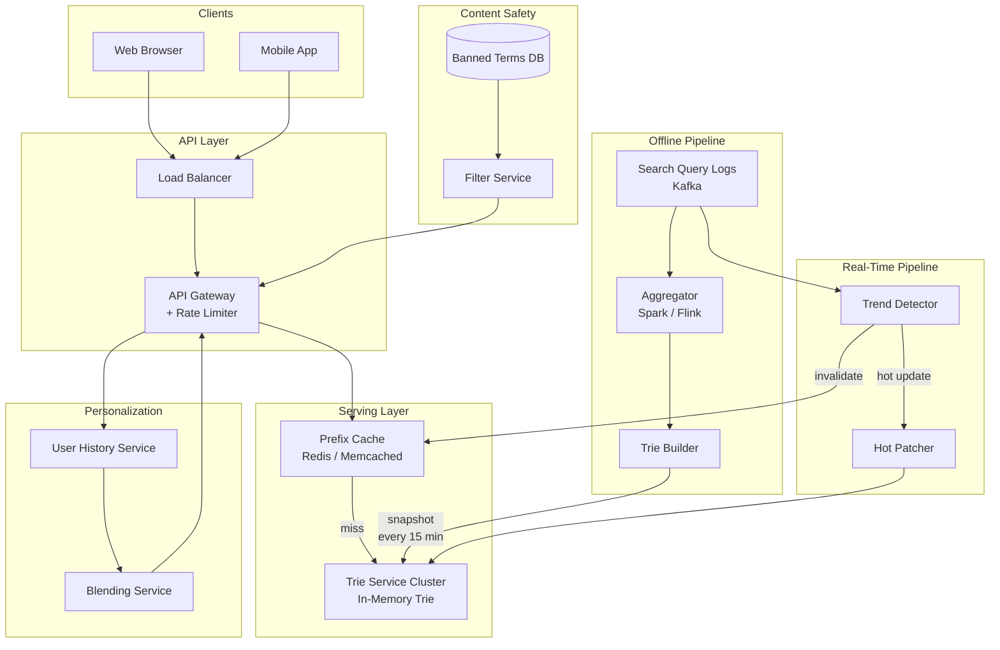
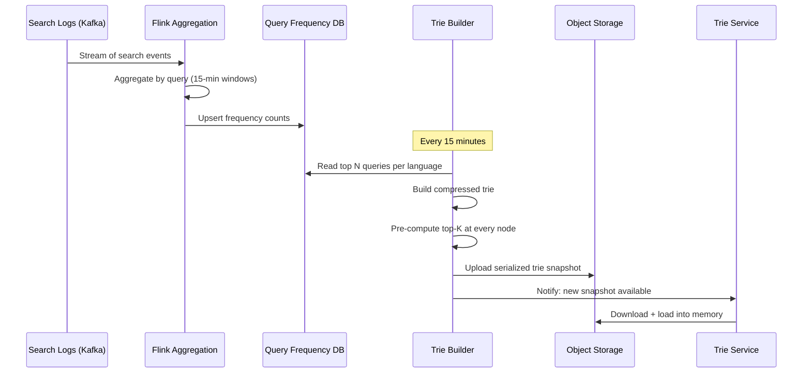
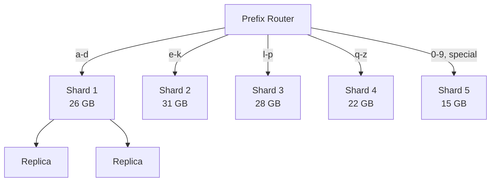
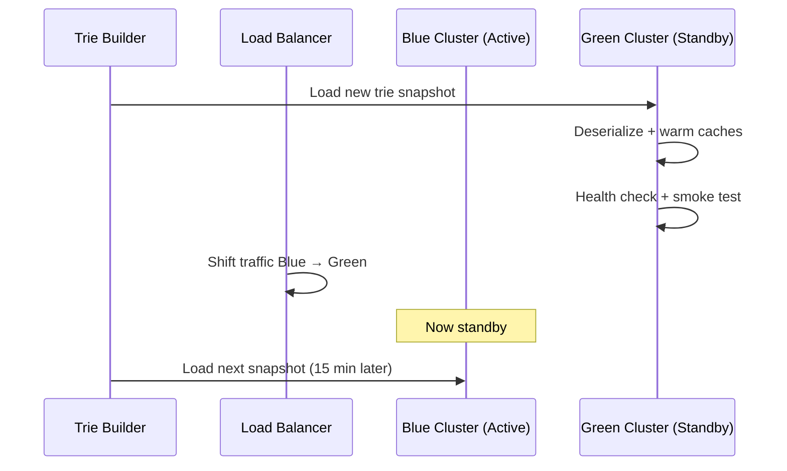

# Design Typeahead / Autocomplete System

A typeahead system returns ranked suggestions within 100 milliseconds of each keystroke. Users expect instant feedback — any perceptible delay destroys the illusion that the system is "reading their mind." This design covers the end-to-end architecture: trie construction from search logs, distributed serving, real-time trending integration, personalization, and multi-language challenges.

**Related**: [Design Autocomplete (alternate take)](/system-design-interviews/search-autocomplete) covers the same problem with different depth emphasis.

---

## 1. Problem Statement & Requirements

### Functional Requirements

| # | Requirement |
|---|-------------|
| FR-1 | Return top-10 suggestions for any typed prefix |
| FR-2 | Rank by global popularity (search frequency) |
| FR-3 | Support personalized suggestions based on user search history |
| FR-4 | Update suggestions in near-real-time for trending queries |
| FR-5 | Support multi-language input (Latin, CJK, Arabic) |
| FR-6 | Filter offensive, illegal, and banned content |
| FR-7 | Support phrase completion (not just single words) |

### Non-Functional Requirements

| # | Requirement | Target |
|---|-------------|--------|
| NFR-1 | Latency | p99 < 100 ms |
| NFR-2 | Availability | 99.99% |
| NFR-3 | Scale | 500K peak QPS |
| NFR-4 | Freshness | Trending queries reflected within 60 seconds |
| NFR-5 | Fault tolerance | No single point of failure |
| NFR-6 | Data privacy | Personal search history encrypted at rest |

### Clarifying Questions

::: tip Questions to Ask
- What platform is this for? (Web search, e-commerce, social media?)
- How many unique queries exist? (Millions vs. billions)
- Is personalization required or a stretch goal?
- Must we handle typos / fuzzy matching?
- What languages are in scope?
- Should we surface trending queries differently (e.g., with a flame icon)?
:::

---

## 2. Back-of-Envelope Estimation

### Traffic

- 500M DAU
- 6 searches per user per day
- Average 7 keystrokes per search (each triggers a request)

$$
\text{Requests/day} = 500 \times 10^6 \times 6 \times 7 = 21 \times 10^9
$$

$$
\text{Average QPS} = \frac{21 \times 10^9}{86{,}400} \approx 243{,}000 \text{ QPS}
$$

$$
\text{Peak QPS} \approx 243K \times 2.5 \approx 607K \text{ QPS}
$$

### Storage

- 1 billion unique query strings
- Average query: 25 bytes + 8 bytes frequency + 16 bytes metadata = 49 bytes

$$
\text{Raw query data} = 10^9 \times 49B = 49 \text{ GB}
$$

- Trie overhead (node pointers, top-K lists): ~4x raw data

$$
\text{Trie memory per language} \approx 49 \times 4 = 196 \text{ GB}
$$

### Bandwidth

- Average response: 10 suggestions x 30 bytes = 300 bytes + JSON overhead = ~500 bytes

$$
\text{Outbound bandwidth} = 607K \times 500B = 303 \text{ MB/s} \approx 2.4 \text{ Gbps}
$$

::: warning Debouncing Reduces Actual QPS
Client-side debouncing (50-100ms) eliminates ~40% of requests. Actual server-side QPS is closer to 360K peak, but always design for the un-debounced worst case.
:::

---

## 3. High-Level Design



### Data Flow

1. **Client types a character** -> debounced request to API gateway
2. **API gateway** checks Redis cache for the prefix
3. **Cache hit** -> return immediately (handles ~85% of traffic)
4. **Cache miss** -> route to trie service, which does O(L) lookup (L = prefix length)
5. **Personalization blend** -> merge global suggestions with user history
6. **Content filter** -> remove banned/offensive terms
7. **Response** -> top-10 suggestions returned in < 100ms

---

## 4. API Design

```typescript
// GET /v1/suggestions?prefix=how+to&limit=10&lang=en&userId=abc123

interface SuggestionRequest {
  prefix: string;          // The typed prefix (URL-encoded)
  limit?: number;          // Max suggestions (default 10)
  lang?: string;           // ISO 639-1 language
  userId?: string;         // For personalized results
  sessionId?: string;      // For session-based personalization
}

interface SuggestionResponse {
  suggestions: Suggestion[];
  isCached: boolean;
  latencyMs: number;
}

interface Suggestion {
  text: string;            // Full query string
  score: number;           // Normalized relevance (0-100)
  category?: string;       // Optional: "trending", "personal", "recent"
  icon?: string;           // Optional: "flame" for trending
  metadata?: {
    searchCount?: number;  // How many times this was searched
  };
}
```

::: tip Debouncing Contract
The API should document a recommended debounce interval (50-100ms). Clients that send requests faster than 30ms apart should be rate-limited.
:::

---

## 5. Data Model

### Query Frequency Table

```sql
CREATE TABLE query_frequencies (
    query_hash     BIGINT PRIMARY KEY,        -- MurmurHash of normalized query
    query_text     VARCHAR(500) NOT NULL,
    language       CHAR(2) NOT NULL DEFAULT 'en',
    frequency      BIGINT NOT NULL DEFAULT 0,
    last_seen      TIMESTAMP NOT NULL DEFAULT NOW(),
    first_seen     TIMESTAMP NOT NULL DEFAULT NOW(),
    is_banned      BOOLEAN NOT NULL DEFAULT FALSE
);

CREATE INDEX idx_freq_lang ON query_frequencies(language, frequency DESC);
```

### User Search History

```sql
CREATE TABLE user_search_history (
    user_id        VARCHAR(64) NOT NULL,
    query_text     VARCHAR(500) NOT NULL,
    searched_at    TIMESTAMP NOT NULL DEFAULT NOW(),
    clicked        BOOLEAN DEFAULT FALSE,
    PRIMARY KEY (user_id, searched_at)
) PARTITION BY RANGE (searched_at);
```

### Trie Node (In-Memory Representation)

```typescript
interface TrieNode {
  children: Map<string, TrieNode>;    // char -> child
  isTerminal: boolean;                 // end of valid query
  frequency: number;                   // search count (terminal nodes only)
  topK: Suggestion[];                  // pre-computed top-K at this prefix
}
```

---

## 6. Detailed Design

### 6.1 Trie Construction (Offline Pipeline)



```typescript
class TrieBuilder {
  private readonly TOP_K = 10;

  build(queries: QueryFrequency[]): CompressedTrie {
    const trie = new CompressedTrie(this.TOP_K);

    // Sort by frequency descending for efficient top-K propagation
    queries.sort((a, b) => b.frequency - a.frequency);

    for (const q of queries) {
      if (q.isBanned) continue;
      trie.insert(q.queryText, q.frequency);
    }

    return trie;
  }
}

class CompressedTrie {
  private root: TrieNode;
  private readonly topK: number;

  constructor(topK: number) {
    this.root = this.newNode();
    this.topK = topK;
  }

  insert(query: string, frequency: number): void {
    let node = this.root;
    for (const char of query) {
      if (!node.children.has(char)) {
        node.children.set(char, this.newNode());
      }
      node = node.children.get(char)!;
      this.updateTopK(node, query, frequency);
    }
    node.isTerminal = true;
    node.frequency = frequency;
  }

  search(prefix: string): Suggestion[] {
    let node = this.root;
    for (const char of prefix) {
      if (!node.children.has(char)) return [];
      node = node.children.get(char)!;
    }
    return node.topK;
  }

  private updateTopK(node: TrieNode, text: string, score: number): void {
    const idx = node.topK.findIndex(s => s.text === text);
    if (idx >= 0) {
      node.topK[idx].score = score;
    } else if (node.topK.length < this.topK) {
      node.topK.push({ text, score });
    } else if (score > node.topK[node.topK.length - 1].score) {
      node.topK[node.topK.length - 1] = { text, score };
    }
    node.topK.sort((a, b) => b.score - a.score);
  }

  private newNode(): TrieNode {
    return { children: new Map(), isTerminal: false, frequency: 0, topK: [] };
  }
}
```

### 6.2 Serving with Prefix Cache

```typescript
class TypeaheadService {
  private trie: CompressedTrie;
  private cache: RedisCluster;
  private readonly CACHE_TTL = 300; // 5 minutes

  async getSuggestions(prefix: string, lang: string, limit: number): Promise<Suggestion[]> {
    const cacheKey = `ta:${lang}:${prefix}`;

    // 1. Check cache
    const cached = await this.cache.get(cacheKey);
    if (cached) return JSON.parse(cached);

    // 2. Query trie
    const results = this.trie.search(prefix).slice(0, limit);

    // 3. Cache the result (with jittered TTL to prevent stampede)
    const jitter = Math.floor(Math.random() * 60);
    await this.cache.setex(cacheKey, this.CACHE_TTL + jitter, JSON.stringify(results));

    return results;
  }
}
```

::: tip Cache Hit Rate Optimization
The top 1,000 single-character and two-character prefixes account for 60-70% of all traffic. Pre-warm these on startup:
```typescript
async warmCache(lang: string): Promise<void> {
  const alphabet = 'abcdefghijklmnopqrstuvwxyz0123456789';
  for (const c of alphabet) {
    await this.getSuggestions(c, lang, 10);
    for (const c2 of alphabet) {
      await this.getSuggestions(c + c2, lang, 10);
    }
  }
}
```
:::

### 6.3 Real-Time Trending Updates

The offline pipeline rebuilds every 15 minutes, but breaking news can't wait.

```typescript
class HotPatcher {
  private redis: RedisCluster;
  private readonly ANOMALY_THRESHOLD = 3.0; // Z-score

  async detectAndPatch(query: string, count: number): Promise<void> {
    // 1. Check if this is anomalous
    const baseline = await this.getBaseline(query);
    if (!baseline) {
      if (count < 1000) return; // New query, needs minimum threshold
    } else {
      const zScore = (count - baseline.mean) / (baseline.stddev || 1);
      if (zScore < this.ANOMALY_THRESHOLD) return;
    }

    // 2. Broadcast hot patch to all trie service nodes
    await this.redis.publish('trie:hot-patch', JSON.stringify({
      query,
      frequency: count,
      action: 'upsert',
      timestamp: Date.now(),
    }));

    // 3. Invalidate affected cache prefixes
    for (let i = 1; i <= query.length; i++) {
      const prefix = query.substring(0, i);
      await this.redis.del(`ta:en:${prefix}`);
    }
  }

  private async getBaseline(query: string): Promise<{ mean: number; stddev: number } | null> {
    // Fetch from analytics DB
    return null;
  }
}
```

### 6.4 Personalization

```typescript
class PersonalizedTypeahead {
  private readonly PERSONAL_WEIGHT = 0.3;
  private readonly GLOBAL_WEIGHT = 0.7;

  async blend(
    globalSuggestions: Suggestion[],
    userId: string | null,
    prefix: string
  ): Promise<Suggestion[]> {
    if (!userId) return globalSuggestions;

    // Fetch recent search history (last 100 queries)
    const history = await this.getRecentHistory(userId, 100);

    // Filter history by prefix
    const personalMatches = history
      .filter(q => q.toLowerCase().startsWith(prefix.toLowerCase()))
      .slice(0, 5)
      .map((q, i) => ({
        text: q,
        score: (100 - i * 10) * this.PERSONAL_WEIGHT,
        category: 'personal' as const,
      }));

    // Re-score global suggestions
    const weighted = globalSuggestions.map(s => ({
      ...s,
      score: s.score * this.GLOBAL_WEIGHT,
    }));

    // Merge, deduplicate, sort
    const merged = new Map<string, Suggestion>();
    for (const s of [...personalMatches, ...weighted]) {
      const existing = merged.get(s.text);
      if (existing) {
        existing.score += s.score;
      } else {
        merged.set(s.text, s);
      }
    }

    return Array.from(merged.values())
      .sort((a, b) => b.score - a.score)
      .slice(0, 10);
  }

  private async getRecentHistory(userId: string, limit: number): Promise<string[]> {
    return [];
  }
}
```

### 6.5 Multi-Language Support

| Language | Challenge | Solution |
|----------|-----------|----------|
| English | Simple tokenization | Standard trie |
| Chinese | No word boundaries, pinyin input | Character-level trie + pinyin mapping |
| Japanese | Mixed scripts (kanji, hiragana, katakana) | Multiple trie paths per query |
| Korean | Jamo decomposition for partial syllables | Decompose syllables into jamo for matching |
| Arabic | RTL, diacritics | Normalize diacritics, handle RTL display |

```typescript
class MultiLanguageRouter {
  private tries: Map<string, CompressedTrie> = new Map();

  async search(prefix: string, lang: string): Promise<Suggestion[]> {
    const trie = this.tries.get(lang);
    if (!trie) {
      // Fallback to English trie
      return this.tries.get('en')?.search(prefix) ?? [];
    }

    // Language-specific normalization
    const normalized = this.normalize(prefix, lang);
    const results = trie.search(normalized);

    // For CJK: also search romanized version
    if (['zh', 'ja', 'ko'].includes(lang)) {
      const romanized = this.romanize(prefix, lang);
      if (romanized !== normalized) {
        const romanResults = trie.search(romanized);
        return this.mergeResults(results, romanResults);
      }
    }

    return results;
  }

  private normalize(input: string, lang: string): string {
    return input.normalize('NFC').toLowerCase();
  }

  private romanize(input: string, lang: string): string {
    // Convert to pinyin (zh), romaji (ja), or romanized Korean (ko)
    return input;
  }

  private mergeResults(a: Suggestion[], b: Suggestion[]): Suggestion[] {
    const seen = new Set(a.map(s => s.text));
    return [...a, ...b.filter(s => !seen.has(s.text))].slice(0, 10);
  }
}
```

### 6.6 Content Filtering

```typescript
class SuggestionFilter {
  private bannedExact: Set<string> = new Set();
  private bannedPatterns: RegExp[] = [];

  filter(suggestions: Suggestion[]): Suggestion[] {
    return suggestions.filter(s => {
      const lower = s.text.toLowerCase();
      if (this.bannedExact.has(lower)) return false;
      return !this.bannedPatterns.some(p => p.test(lower));
    });
  }
}
```

---

## 7. Scaling & Bottlenecks

### Sharding the Trie



::: danger Uneven Shard Distribution
Letter frequency is not uniform. Prefixes starting with "s", "c", "p" are 3-5x more common than "x", "z", "q". Use **weighted sharding** based on actual query distribution, not alphabetical ranges.
:::

### Blue-Green Deployment for Trie Updates



### Bottleneck Analysis

| Bottleneck | Symptom | Solution |
|-----------|---------|----------|
| 196 GB trie doesn't fit one machine | OOM | Shard by prefix range, 4-6 shards |
| Hot prefixes ("a", "the", "how") | p99 latency spike | Replicate hot shards 3-5x |
| Trie rebuild takes 30+ minutes | Stale suggestions | Incremental builds + hot patches |
| Cache stampede on TTL expiry | Thundering herd | Jittered TTLs + probabilistic early refresh |
| Cross-region latency | 200ms for distant users | Regional trie replicas + edge caches |
| Trending query flood | Overwhelms hot-patch system | Rate-limit hot patches to 100/min |

---

## 8. Trade-offs & Alternatives

### Trie vs. Alternatives

| Approach | Latency | Memory | Update Speed | Complexity |
|----------|---------|--------|-------------|------------|
| **Trie (in-memory)** | O(L) ~5ms | High | Snapshot-based | Medium |
| **Elasticsearch prefix** | ~20-50ms | Lower | Near real-time | Low |
| **Redis sorted sets** | ~10ms | High | Real-time | Low |
| **B-tree (SQL LIKE)** | ~50-200ms | Low (on disk) | Real-time | Low |
| **Ternary search tree** | O(L) ~8ms | Lower than trie | Snapshot-based | Medium |

::: tip Which to Choose
- **< 100K QPS**: Redis sorted sets or Elasticsearch — simple, good enough
- **100K-500K QPS**: Trie with prefix cache — best latency/throughput ratio
- **> 500K QPS**: Sharded trie with blue-green deployment — Twitter/Google scale
:::

### Pre-computed Top-K vs. On-the-Fly DFS

| Strategy | Lookup Time | Memory | Freshness |
|----------|------------|--------|-----------|
| Pre-computed top-K at each node | O(L) | Higher (stores lists) | Stale until rebuild |
| DFS traversal at query time | O(subtree) | Lower | Always fresh |
| **Hybrid**: pre-computed + hot patches | O(L) | Medium | Near real-time |

---

## 9. Interview Tips

::: tip Start Simple, Then Scale
1. Single-server trie with top-K at each node
2. Add Redis prefix cache for hot prefixes
3. Shard trie by prefix range for memory scaling
4. Add offline pipeline (Spark/Flink) for trie building
5. Add real-time trending layer
6. Add personalization blending
:::

::: warning Common Mistakes
- Forgetting client-side debouncing (50-100ms)
- Not pre-computing top-K at trie nodes (causes expensive DFS)
- Ignoring the trie update/rebuild lifecycle
- Not discussing content safety / banned terms
- Overlooking CJK language challenges (no word boundaries)
- Designing for exact match instead of prefix match
:::

### Key Talking Points

1. **Why trie over Elasticsearch?** Latency. Trie gives O(L) prefix lookup; ES involves network hops + query parsing (~20-50ms overhead).
2. **How to handle 500K QPS?** Prefix caching handles 85%+ of traffic. Remaining hits sharded trie replicas.
3. **How fresh are suggestions?** Hybrid: bulk rebuild every 15 min + real-time hot patches for trending via pub/sub.
4. **Memory optimization?** Compressed trie (path compression), only store top 50M queries, shard across machines.
5. **Fault tolerance?** Blue-green deployments, replicated shards, graceful fallback to stale cache.

### Time Allocation (45-minute interview)

| Phase | Time | Focus |
|-------|------|-------|
| Requirements & clarifications | 5 min | Scale, freshness, personalization |
| Estimation | 4 min | QPS, trie memory, bandwidth |
| High-level design | 8 min | Architecture diagram, data flow |
| Trie deep dive | 10 min | Data structure, top-K, prefix cache |
| Real-time trending | 5 min | Anomaly detection, hot patching |
| Scaling | 8 min | Sharding, replication, blue-green |
| Trade-offs | 5 min | Trie vs. alternatives, consistency |

---

## Summary

| Component | Technology | Scale |
|-----------|-----------|-------|
| Trie Service | Custom in-memory compressed trie | 196 GB, sharded 4-6 ways |
| Prefix Cache | Redis Cluster | 85%+ hit rate, 5-min TTL |
| Offline Pipeline | Kafka + Flink + Trie Builder | 15-min rebuild cycle |
| Real-Time Trending | Redis counters + anomaly detection | < 60s freshness |
| Personalization | User history cache + blending | 100 recent queries/user |
| Content Filter | Banned terms DB + regex patterns | In-line filtering |
| Serving | Blue-green deployment across regions | 607K peak QPS |

**Related**: [Design Autocomplete](/system-design-interviews/search-autocomplete) | [Design Twitter Search](/system-design-interviews/twitter-search) | [Design a Search Engine](/system-design-interviews/search-engine)
