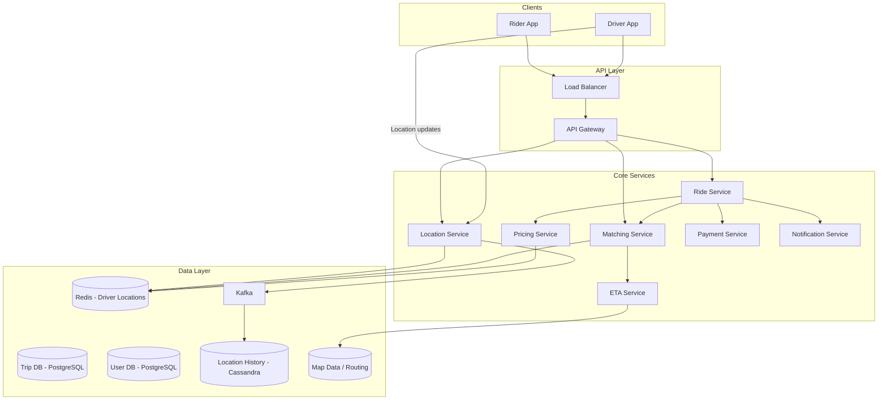
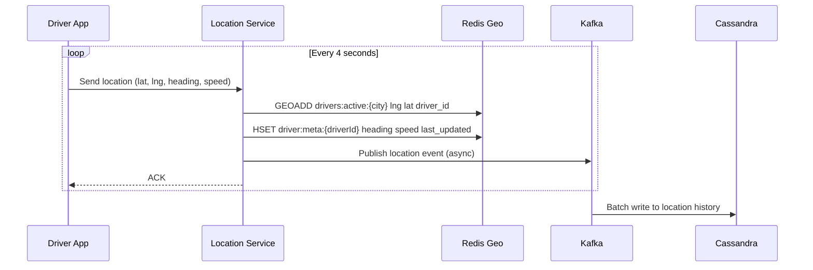
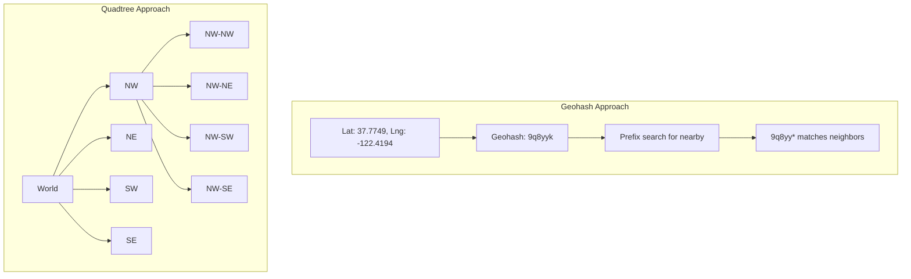
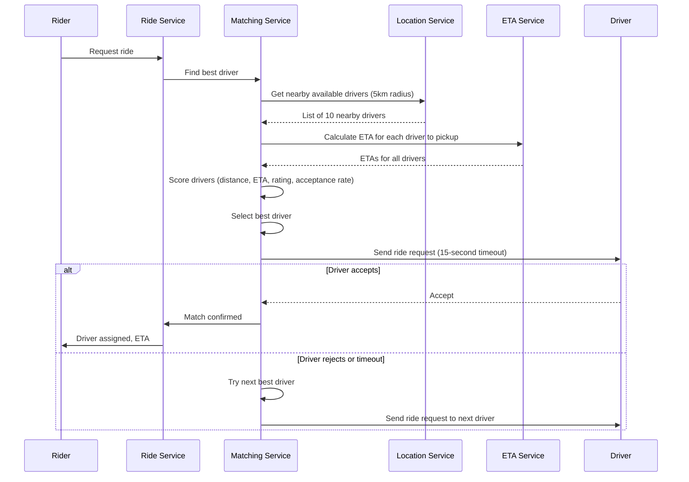
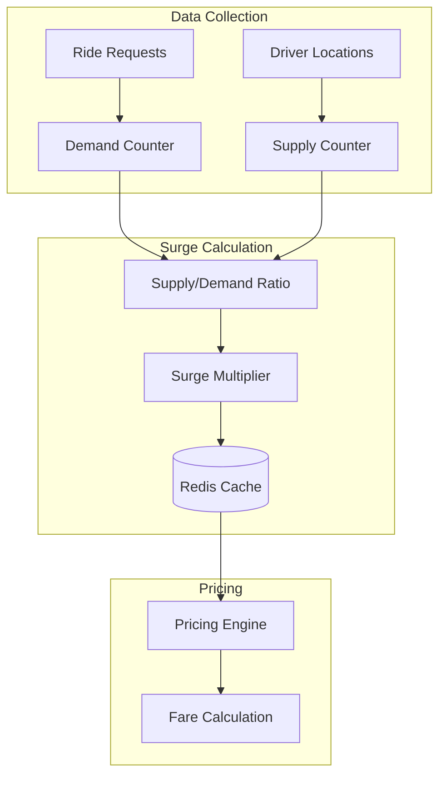
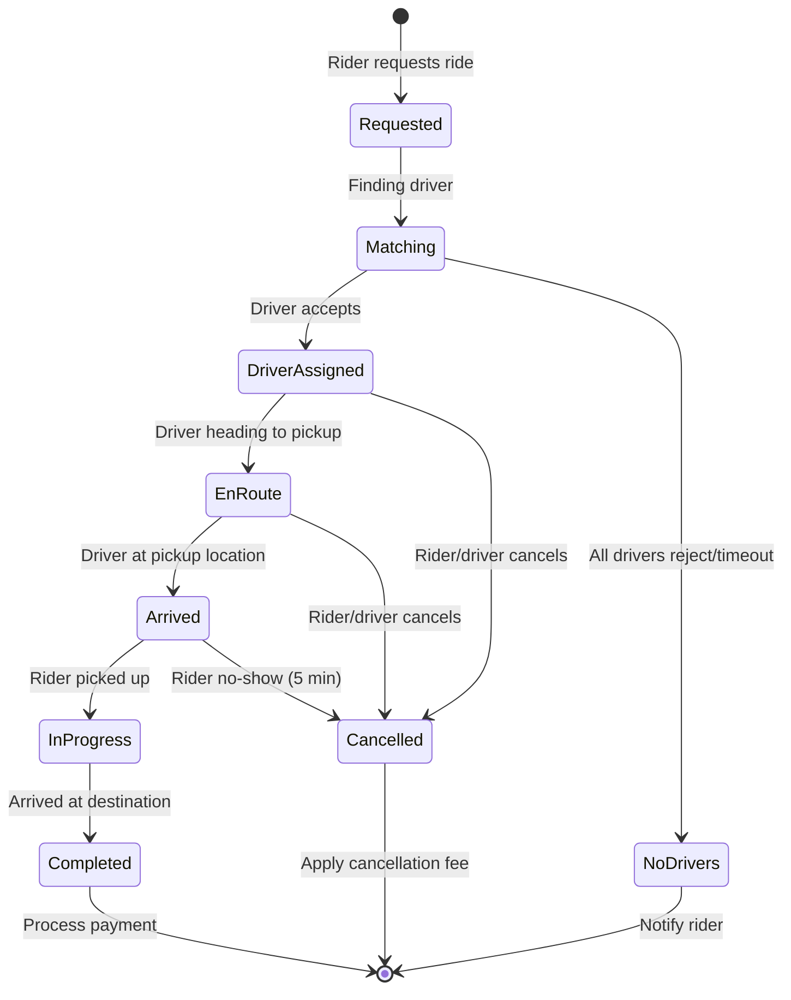
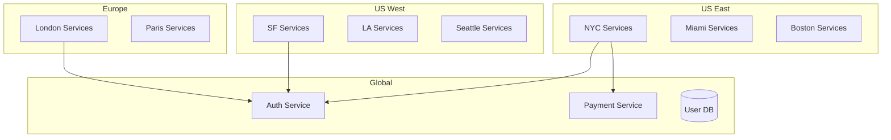

# Design Uber/Lyft

Uber is a ride-sharing platform that matches riders with nearby drivers in real time. This design covers real-time location tracking, geospatial indexing, ride matching, pricing/surge, ETA calculation, driver allocation algorithms, and the payment flow.

---

## 1. Problem Statement & Requirements

### Functional Requirements

1. **Request a ride** — Rider specifies pickup and dropoff location, sees fare estimate
2. **Match with driver** — System finds the best nearby driver and sends a ride request
3. **Real-time tracking** — Both rider and driver see each other's location on a map
4. **ETA calculation** — Estimated time of arrival for both pickup and dropoff
5. **Surge pricing** — Dynamic pricing based on supply and demand
6. **Payment** — Automatic payment processing at ride completion
7. **Rating** — Riders and drivers rate each other after the ride
8. **Trip history** — Both riders and drivers can view past trips
9. **Driver availability** — Drivers toggle online/offline status

### Non-Functional Requirements

1. **Real-time** — Location updates every 3-4 seconds, match within 10 seconds
2. **High availability** — 99.99% for ride matching; payment can have brief retries
3. **Low latency** — Nearby driver search < 100ms, ETA < 500ms
4. **Scale** — 100M monthly riders, 5M active drivers, 20M rides/day
5. **Global** — Operate across hundreds of cities worldwide
6. **Accuracy** — ETA within 2-minute accuracy, fare calculation precise

### Clarifying Questions

::: tip Questions to Ask
- What is the average ride duration?
- How many concurrent ride requests do we expect?
- Do we need to support ride pools (shared rides)?
- What is the driver acceptance timeout?
- Do we need to handle multi-stop trips?
- Should we support scheduling rides in advance?
:::

---

## 2. Back-of-Envelope Estimation

### Traffic

- 20M rides/day
- 5M drivers, ~1M online at any time
- Drivers send location updates every 4 seconds

$$
\text{Ride Request QPS} = \frac{20M}{86400} \approx 231 \text{ QPS}
$$

$$
\text{Peak Ride QPS} \approx 231 \times 5 \approx 1{,}155 \text{ QPS}
$$

$$
\text{Location Update QPS} = \frac{1M}{4} = 250{,}000 \text{ QPS}
$$

$$
\text{Peak Location QPS} \approx 250K \times 2 = 500K \text{ QPS}
$$

### Storage

**Location history:**
- Each update: lat(8B) + lng(8B) + timestamp(8B) + driverId(8B) + metadata(20B) = ~52 bytes
- Daily: 250K QPS x 86400 sec x 52 bytes = 1.12 TB/day
- Annual: 1.12 TB x 365 = 409 TB/year

**Trip data:**
- Each trip: ~2KB (route, fare, metadata)
- Daily: 20M x 2KB = 40 GB/day
- Annual: 14.6 TB/year

### Bandwidth

$$
\text{Location ingress} = 500K \times 52B = 26 \text{ MB/s}
$$

$$
\text{Map tile egress} \approx 10M \text{ concurrent users} \times 20 \text{ KB/update} = 200 \text{ GB/s (served by CDN)}
$$

### Geospatial Index Size

1M active drivers, each with lat/lng:
- Geohash index: 1M x (12B hash + 8B driverId) = 20 MB (fits entirely in memory)

---

## 3. High-Level Design



### API Design

```typescript
// Request a ride
// POST /api/v1/rides/estimate
interface RideEstimateRequest {
  pickupLocation: { lat: number; lng: number };
  dropoffLocation: { lat: number; lng: number };
  rideType: 'uberx' | 'uberxl' | 'comfort' | 'black';
}

interface RideEstimateResponse {
  estimatedFare: {
    min: number;
    max: number;
    currency: string;
    surgeMultiplier: number;
  };
  estimatedPickupTime: number;   // seconds
  estimatedTripDuration: number; // seconds
  estimatedDistance: number;     // meters
}

// Confirm ride request
// POST /api/v1/rides
interface RideRequest {
  pickupLocation: { lat: number; lng: number; address: string };
  dropoffLocation: { lat: number; lng: number; address: string };
  rideType: string;
  paymentMethodId: string;
}

interface RideResponse {
  rideId: string;
  status: 'matching' | 'driver_assigned' | 'en_route' | 'arrived' | 'in_progress' | 'completed' | 'cancelled';
  driver?: DriverInfo;
  vehicle?: VehicleInfo;
  estimatedPickupTime?: number;
  fare?: FareBreakdown;
}

// Driver: update location
// POST /api/v1/drivers/location
interface LocationUpdate {
  lat: number;
  lng: number;
  heading: number;        // 0-360 degrees
  speed: number;          // m/s
  accuracy: number;       // meters
  timestamp: number;
}

// Driver: toggle availability
// PUT /api/v1/drivers/status
interface DriverStatusUpdate {
  status: 'online' | 'offline';
}

// Driver: accept/reject ride
// POST /api/v1/rides/:rideId/respond
interface RideResponseAction {
  action: 'accept' | 'reject';
}

// Get trip details
// GET /api/v1/rides/:rideId

// Rate the ride
// POST /api/v1/rides/:rideId/rate
interface RatingRequest {
  rating: number;       // 1-5
  feedback?: string;
  tags?: string[];      // 'clean_car', 'great_conversation', etc.
}
```

---

## 4. Database Schema

### Trip Database (PostgreSQL, sharded by city)

```sql
CREATE TABLE rides (
    id              UUID PRIMARY KEY DEFAULT gen_random_uuid(),
    rider_id        BIGINT NOT NULL,
    driver_id       BIGINT,
    city_id         INT NOT NULL,
    ride_type       VARCHAR(20) NOT NULL,
    status          VARCHAR(20) NOT NULL DEFAULT 'matching',
    pickup_lat      DECIMAL(10, 8) NOT NULL,
    pickup_lng      DECIMAL(11, 8) NOT NULL,
    pickup_address  TEXT,
    dropoff_lat     DECIMAL(10, 8) NOT NULL,
    dropoff_lng     DECIMAL(11, 8) NOT NULL,
    dropoff_address TEXT,
    estimated_fare  DECIMAL(10, 2),
    actual_fare     DECIMAL(10, 2),
    surge_multiplier DECIMAL(3, 2) DEFAULT 1.00,
    distance_meters INT,
    duration_seconds INT,
    requested_at    TIMESTAMP WITH TIME ZONE DEFAULT NOW(),
    accepted_at     TIMESTAMP WITH TIME ZONE,
    pickup_at       TIMESTAMP WITH TIME ZONE,
    dropoff_at      TIMESTAMP WITH TIME ZONE,
    cancelled_at    TIMESTAMP WITH TIME ZONE,
    cancel_reason   VARCHAR(100),
    rider_rating    SMALLINT,
    driver_rating   SMALLINT,
    payment_status  VARCHAR(20) DEFAULT 'pending',
    payment_id      VARCHAR(100)
);

CREATE INDEX idx_rides_rider ON rides(rider_id, requested_at DESC);
CREATE INDEX idx_rides_driver ON rides(driver_id, requested_at DESC);
CREATE INDEX idx_rides_status ON rides(status) WHERE status IN ('matching', 'en_route', 'in_progress');
CREATE INDEX idx_rides_city_time ON rides(city_id, requested_at DESC);

-- Fare breakdown
CREATE TABLE fare_breakdowns (
    ride_id         UUID PRIMARY KEY REFERENCES rides(id),
    base_fare       DECIMAL(10, 2),
    distance_fare   DECIMAL(10, 2),
    time_fare       DECIMAL(10, 2),
    surge_amount    DECIMAL(10, 2),
    tolls           DECIMAL(10, 2) DEFAULT 0,
    booking_fee     DECIMAL(10, 2),
    discount        DECIMAL(10, 2) DEFAULT 0,
    tip             DECIMAL(10, 2) DEFAULT 0,
    total           DECIMAL(10, 2)
);

-- Users
CREATE TABLE users (
    id              BIGSERIAL PRIMARY KEY,
    type            VARCHAR(10) NOT NULL, -- 'rider' | 'driver'
    name            VARCHAR(100) NOT NULL,
    email           VARCHAR(255) UNIQUE,
    phone           VARCHAR(20) UNIQUE NOT NULL,
    avatar_url      VARCHAR(500),
    rating          DECIMAL(3, 2) DEFAULT 5.00,
    total_rides     INT DEFAULT 0,
    city_id         INT,
    created_at      TIMESTAMP WITH TIME ZONE DEFAULT NOW()
);

-- Driver-specific info
CREATE TABLE drivers (
    user_id         BIGINT PRIMARY KEY REFERENCES users(id),
    license_number  VARCHAR(50),
    vehicle_make    VARCHAR(50),
    vehicle_model   VARCHAR(50),
    vehicle_year    INT,
    vehicle_color   VARCHAR(30),
    license_plate   VARCHAR(20),
    vehicle_type    VARCHAR(20),  -- 'sedan', 'suv', 'luxury'
    is_active       BOOLEAN DEFAULT TRUE,
    documents_verified BOOLEAN DEFAULT FALSE
);
```

### Location Data (Redis — real-time, Cassandra — historical)

**Redis (real-time driver locations):**

```
# Using Redis Geospatial Index
Key: drivers:active:{cityId}
Type: Geo Set
Members: driver_id -> (lng, lat)

# Driver metadata
Key: driver:meta:{driverId}
Type: Hash
Fields: status, heading, speed, ride_type, current_ride_id, last_updated

# Supply-demand metrics per geohash cell
Key: supply:{cityId}:{geohash6}
Type: Integer (count of available drivers)
TTL: 60 seconds

Key: demand:{cityId}:{geohash6}
Type: Integer (count of ride requests in last 5 min)
TTL: 300 seconds
```

**Cassandra (location history):**

```sql
CREATE TABLE driver_locations (
    driver_id   BIGINT,
    day         DATE,
    timestamp   TIMESTAMP,
    lat         DOUBLE,
    lng         DOUBLE,
    heading     FLOAT,
    speed       FLOAT,
    ride_id     UUID,
    PRIMARY KEY ((driver_id, day), timestamp)
) WITH CLUSTERING ORDER BY (timestamp DESC)
  AND default_time_to_live = 2592000; -- 30-day retention
```

---

## 5. Detailed Component Design

### 5.1 Location Service

The location service handles 500K updates per second from drivers:



```typescript
class LocationService {
  async updateDriverLocation(driverId: string, update: LocationUpdate): Promise<void> {
    const cityId = await this.getCityFromCoords(update.lat, update.lng);

    // 1. Update position in Redis Geo index
    await this.redis.geoadd(
      `drivers:active:${cityId}`,
      update.lng,
      update.lat,
      driverId
    );

    // 2. Update driver metadata
    await this.redis.hmset(`driver:meta:${driverId}`, {
      heading: update.heading.toString(),
      speed: update.speed.toString(),
      lat: update.lat.toString(),
      lng: update.lng.toString(),
      lastUpdated: Date.now().toString(),
      cityId: cityId.toString(),
    });

    // 3. Update supply count for the geohash cell
    const geohash = this.computeGeohash(update.lat, update.lng, 6);
    await this.redis.incr(`supply:${cityId}:${geohash}`);
    await this.redis.expire(`supply:${cityId}:${geohash}`, 60);

    // 4. Async: persist to Cassandra for history
    await this.kafka.send('driver-locations', {
      key: driverId,
      value: {
        driverId,
        ...update,
        cityId,
        timestamp: Date.now(),
      },
    });

    // 5. If driver is on an active ride, push location to rider
    const currentRide = await this.redis.hget(`driver:meta:${driverId}`, 'currentRideId');
    if (currentRide) {
      await this.pushLocationToRider(currentRide, driverId, update);
    }
  }

  async findNearbyDrivers(
    lat: number,
    lng: number,
    radiusKm: number,
    rideType: string,
    limit: number = 20
  ): Promise<NearbyDriver[]> {
    const cityId = await this.getCityFromCoords(lat, lng);

    // 1. Query Redis Geo index for drivers within radius
    const nearbyDriverIds = await this.redis.georadius(
      `drivers:active:${cityId}`,
      lng,
      lat,
      radiusKm,
      'km',
      'WITHCOORD',
      'WITHDIST',
      'COUNT', limit * 2,
      'ASC'                     // Sort by distance
    );

    // 2. Filter by ride type and availability
    const drivers: NearbyDriver[] = [];
    for (const [driverId, dist, [dLng, dLat]] of nearbyDriverIds) {
      const meta = await this.redis.hgetall(`driver:meta:${driverId}`);

      if (meta.status !== 'available') continue;
      if (!this.matchesRideType(meta.vehicleType, rideType)) continue;

      drivers.push({
        driverId,
        lat: parseFloat(dLat),
        lng: parseFloat(dLng),
        distance: parseFloat(dist),
        heading: parseFloat(meta.heading),
        rating: parseFloat(meta.rating),
        vehicleType: meta.vehicleType,
      });

      if (drivers.length >= limit) break;
    }

    return drivers;
  }
}
```

### 5.2 Geospatial Indexing Deep Dive



**Geohash:** Encodes lat/lng into a string. Longer string = more precise.

| Precision | Cell Size | Use Case |
|-----------|----------|----------|
| 4 chars | ~39km x 20km | Country level |
| 5 chars | ~5km x 5km | City level |
| 6 chars | ~1.2km x 0.6km | Neighborhood |
| 7 chars | ~150m x 150m | Block level |
| 8 chars | ~38m x 19m | Building level |

**Redis Geo** uses a sorted set with geohash-encoded scores, giving O(log N + M) nearby lookups where N is total members and M is results returned.

```typescript
// Alternative: S2 Geometry (used by Uber in production)
class S2GeospatialIndex {
  // S2 divides the sphere into cells at different levels
  // Level 12 cells are ~3.3km^2 — good for neighborhood-level
  // Level 16 cells are ~50m^2 — good for block-level

  getCellId(lat: number, lng: number, level: number): string {
    // S2 maps sphere to cube faces, uses Hilbert curve
    // Returns a 64-bit cell ID
    const point = S2LatLng.fromDegrees(lat, lng);
    const cellId = S2CellId.fromLatLng(point).parent(level);
    return cellId.toString();
  }

  // Find nearby: get covering cells for a circle, query each
  async findNearby(lat: number, lng: number, radiusM: number): Promise<string[]> {
    const cap = S2Cap.fromCenterAngle(
      S2LatLng.fromDegrees(lat, lng).toPoint(),
      S2Earth.toAngle(radiusM)
    );

    // Get the S2 cells that cover this circle
    const coverer = new S2RegionCoverer();
    coverer.setMaxLevel(12);
    coverer.setMaxCells(20);
    const covering = coverer.getCovering(cap);

    // Query each cell for drivers
    const driverIds: string[] = [];
    for (const cellId of covering) {
      const drivers = await this.redis.smembers(`s2cell:${cellId.toString()}`);
      driverIds.push(...drivers);
    }

    return driverIds;
  }
}
```

::: info Why S2 over Geohash?
Geohash has edge effects: two nearby points can have completely different geohashes if they're on opposite sides of a cell boundary. S2 cells don't have this problem because they use a Hilbert curve mapping that preserves locality. Uber uses S2 with the H3 hexagonal grid for their production geospatial indexing.
:::

### 5.3 Ride Matching Service



```typescript
class MatchingService {
  private readonly SEARCH_RADIUS_KM = 5;
  private readonly DRIVER_TIMEOUT_MS = 15_000;
  private readonly MAX_RETRIES = 5;

  async findMatch(ride: RideRequest): Promise<MatchResult> {
    let attempt = 0;
    let radius = this.SEARCH_RADIUS_KM;

    while (attempt < this.MAX_RETRIES) {
      // 1. Find nearby available drivers
      const nearbyDrivers = await this.locationService.findNearbyDrivers(
        ride.pickupLat,
        ride.pickupLng,
        radius,
        ride.rideType
      );

      if (nearbyDrivers.length === 0) {
        radius *= 1.5; // Expand search radius
        attempt++;
        continue;
      }

      // 2. Calculate ETA for each driver
      const driversWithETA = await Promise.all(
        nearbyDrivers.map(async driver => ({
          ...driver,
          eta: await this.etaService.calculateETA(
            driver.lat, driver.lng,
            ride.pickupLat, ride.pickupLng
          ),
        }))
      );

      // 3. Score and rank drivers
      const ranked = this.rankDrivers(driversWithETA, ride);

      // 4. Try to match with highest-ranked driver
      for (const driver of ranked) {
        const accepted = await this.sendRideRequest(driver.driverId, ride);
        if (accepted) {
          return {
            driverId: driver.driverId,
            eta: driver.eta,
            matched: true,
          };
        }
        // Driver rejected or timed out — try next
      }

      attempt++;
      radius *= 1.5;
    }

    return { matched: false, reason: 'no_drivers_available' };
  }

  private rankDrivers(drivers: DriverWithETA[], ride: RideRequest): DriverWithETA[] {
    return drivers
      .map(driver => ({
        ...driver,
        score: this.calculateMatchScore(driver, ride),
      }))
      .sort((a, b) => b.score - a.score);
  }

  private calculateMatchScore(driver: DriverWithETA, ride: RideRequest): number {
    let score = 0;

    // ETA (lower is better) — most important factor
    score += Math.max(0, 100 - driver.eta / 60 * 10); // 10 points lost per minute

    // Distance (lower is better)
    score += Math.max(0, 50 - driver.distance * 10);

    // Driver rating
    score += driver.rating * 10;

    // Acceptance rate (historical)
    score += (driver.acceptanceRate || 0.8) * 20;

    // Direction bonus: driver already heading toward pickup
    const headingToPickup = this.calculateBearing(
      driver.lat, driver.lng,
      ride.pickupLat, ride.pickupLng
    );
    const headingDiff = Math.abs(driver.heading - headingToPickup);
    if (headingDiff < 45) score += 15; // Bonus for same direction

    return score;
  }

  private async sendRideRequest(driverId: string, ride: RideRequest): Promise<boolean> {
    // Send push notification to driver with ride details
    await this.notificationService.sendToDriver(driverId, {
      type: 'ride_request',
      rideId: ride.id,
      pickupAddress: ride.pickupAddress,
      dropoffAddress: ride.dropoffAddress,
      estimatedFare: ride.estimatedFare,
      timeout: this.DRIVER_TIMEOUT_MS,
    });

    // Wait for response with timeout
    return new Promise((resolve) => {
      const timeout = setTimeout(() => {
        this.pendingResponses.delete(ride.id);
        resolve(false);
      }, this.DRIVER_TIMEOUT_MS);

      this.pendingResponses.set(ride.id, (accepted: boolean) => {
        clearTimeout(timeout);
        resolve(accepted);
      });
    });
  }
}
```

### 5.4 ETA Calculation

```typescript
class ETAService {
  // Calculate ETA between two points considering real-time traffic
  async calculateETA(
    fromLat: number, fromLng: number,
    toLat: number, toLng: number
  ): Promise<number> {
    // 1. Check cache (same origin-destination cell pair)
    const cacheKey = this.buildCacheKey(fromLat, fromLng, toLat, toLng);
    const cached = await this.redis.get(cacheKey);
    if (cached) return parseInt(cached);

    // 2. Query routing engine (OSRM, Valhalla, or Google Maps)
    const route = await this.routingEngine.route({
      origin: { lat: fromLat, lng: fromLng },
      destination: { lat: toLat, lng: toLng },
      trafficModel: 'best_guess',
      departureTime: 'now',
    });

    // 3. Adjust for real-time conditions
    let eta = route.duration; // seconds

    // Apply city-specific ML correction factor
    const correctionFactor = await this.getMLCorrectionFactor(
      fromLat, fromLng, toLat, toLng
    );
    eta *= correctionFactor;

    // 4. Cache for 2 minutes (traffic can change)
    await this.redis.setEx(cacheKey, 120, Math.round(eta).toString());

    return Math.round(eta);
  }

  // ML-based ETA correction using historical ride data
  private async getMLCorrectionFactor(
    fromLat: number, fromLng: number,
    toLat: number, toLng: number
  ): Promise<number> {
    // Features: time of day, day of week, weather, events, historical accuracy
    const features = {
      hour: new Date().getHours(),
      dayOfWeek: new Date().getDay(),
      fromGeohash: this.geohash(fromLat, fromLng, 5),
      toGeohash: this.geohash(toLat, toLng, 5),
    };

    // Query ML model (pre-trained on historical rides)
    const correction = await this.etaModel.predict(features);
    return Math.max(0.8, Math.min(1.5, correction)); // Bound between 0.8x-1.5x
  }

  private buildCacheKey(fromLat: number, fromLng: number, toLat: number, toLng: number): string {
    // Round to ~100m precision for cache efficiency
    const round = (n: number) => Math.round(n * 1000) / 1000;
    return `eta:${round(fromLat)}:${round(fromLng)}:${round(toLat)}:${round(toLng)}`;
  }
}
```

### 5.5 Surge Pricing



```typescript
class SurgePricingService {
  // Recalculate surge every 2 minutes per geohash cell
  async calculateSurge(cityId: string): Promise<void> {
    const cells = await this.getActiveGeohashCells(cityId);

    for (const cell of cells) {
      // 1. Count supply (available drivers in this cell)
      const supply = await this.redis.get(`supply:${cityId}:${cell}`) || '0';

      // 2. Count demand (ride requests in last 5 minutes)
      const demand = await this.redis.get(`demand:${cityId}:${cell}`) || '0';

      const supplyCount = parseInt(supply);
      const demandCount = parseInt(demand);

      // 3. Calculate surge multiplier
      let surgeMultiplier = 1.0;

      if (supplyCount === 0 && demandCount > 0) {
        surgeMultiplier = 3.0; // Max surge
      } else if (supplyCount > 0) {
        const ratio = demandCount / supplyCount;

        if (ratio <= 0.5) surgeMultiplier = 1.0;       // Plenty of drivers
        else if (ratio <= 1.0) surgeMultiplier = 1.2;   // Balanced
        else if (ratio <= 1.5) surgeMultiplier = 1.5;   // Moderate surge
        else if (ratio <= 2.0) surgeMultiplier = 2.0;   // High surge
        else if (ratio <= 3.0) surgeMultiplier = 2.5;   // Very high
        else surgeMultiplier = 3.0;                      // Maximum surge
      }

      // 4. Smooth transition (don't jump from 1x to 3x instantly)
      const previousSurge = parseFloat(
        await this.redis.get(`surge:${cityId}:${cell}`) || '1.0'
      );
      surgeMultiplier = previousSurge * 0.7 + surgeMultiplier * 0.3; // EMA smoothing

      // 5. Store in cache
      await this.redis.setEx(`surge:${cityId}:${cell}`, 300, surgeMultiplier.toFixed(2));
    }
  }

  async getFare(ride: RideRequest): Promise<FareEstimate> {
    const geohash = this.computeGeohash(ride.pickupLat, ride.pickupLng, 6);
    const cityId = await this.getCityId(ride.pickupLat, ride.pickupLng);

    // Get current surge multiplier
    const surge = parseFloat(
      await this.redis.get(`surge:${cityId}:${geohash}`) || '1.0'
    );

    // Get route info
    const route = await this.etaService.getRoute(
      ride.pickupLat, ride.pickupLng,
      ride.dropoffLat, ride.dropoffLng
    );

    // Calculate fare
    const rateCard = await this.getRateCard(cityId, ride.rideType);

    const baseFare = rateCard.baseFare;
    const distanceFare = (route.distanceMeters / 1000) * rateCard.perKmRate;
    const timeFare = (route.durationSeconds / 60) * rateCard.perMinuteRate;
    const subtotal = baseFare + distanceFare + timeFare;
    const surgeAmount = subtotal * (surge - 1);
    const bookingFee = rateCard.bookingFee;
    const total = (subtotal + surgeAmount + bookingFee);

    // Apply min/max fare
    const fare = Math.max(rateCard.minimumFare, Math.min(total, rateCard.maximumFare || Infinity));

    return {
      baseFare,
      distanceFare,
      timeFare,
      surgeMultiplier: surge,
      surgeAmount,
      bookingFee,
      total: fare,
      currency: rateCard.currency,
      // Show a range since actual can vary
      min: fare * 0.9,
      max: fare * 1.2,
    };
  }
}
```

### 5.6 Ride Lifecycle



```typescript
class RideService {
  async updateRideStatus(rideId: string, newStatus: string, actor: string): Promise<void> {
    const ride = await this.getRide(rideId);

    // Validate state transition
    const validTransitions: Record<string, string[]> = {
      'matching': ['driver_assigned', 'cancelled'],
      'driver_assigned': ['en_route', 'cancelled'],
      'en_route': ['arrived', 'cancelled'],
      'arrived': ['in_progress', 'cancelled'],
      'in_progress': ['completed'],
    };

    if (!validTransitions[ride.status]?.includes(newStatus)) {
      throw new Error(`Invalid transition: ${ride.status} -> ${newStatus}`);
    }

    // Update status
    await this.db.query(
      `UPDATE rides SET status = $1, ${this.getTimestampField(newStatus)} = NOW() WHERE id = $2`,
      [newStatus, rideId]
    );

    // Handle state-specific logic
    switch (newStatus) {
      case 'completed':
        await this.completeRide(ride);
        break;
      case 'cancelled':
        await this.cancelRide(ride, actor);
        break;
      case 'driver_assigned':
        await this.notifyRider(ride, 'driver_assigned');
        break;
    }

    // Notify both parties via push
    await this.broadcastRideUpdate(rideId, newStatus);
  }

  private async completeRide(ride: Ride): Promise<void> {
    // 1. Calculate final fare based on actual route
    const actualRoute = await this.getActualRoute(ride.id);
    const finalFare = await this.pricingService.calculateFinalFare(ride, actualRoute);

    // 2. Update ride with actual fare
    await this.db.query(
      `UPDATE rides SET actual_fare = $1, distance_meters = $2, duration_seconds = $3 WHERE id = $4`,
      [finalFare.total, actualRoute.distanceMeters, actualRoute.durationSeconds, ride.id]
    );

    // 3. Process payment
    await this.paymentService.charge(ride.riderId, finalFare, ride.paymentMethodId);

    // 4. Make driver available again
    await this.redis.hset(`driver:meta:${ride.driverId}`, 'status', 'available');
    await this.redis.hdel(`driver:meta:${ride.driverId}`, 'currentRideId');

    // 5. Prompt for ratings
    await this.notifyRider(ride, 'rate_driver');
    await this.notifyDriver(ride, 'rate_rider');
  }
}
```

### 5.7 Payment Service

```typescript
class PaymentService {
  async charge(
    riderId: string,
    fare: FareBreakdown,
    paymentMethodId: string
  ): Promise<PaymentResult> {
    // 1. Create payment record
    const paymentId = generateUUID();
    await this.db.query(
      `INSERT INTO payments (id, rider_id, amount, currency, status, payment_method_id)
       VALUES ($1, $2, $3, $4, 'pending', $5)`,
      [paymentId, riderId, fare.total, fare.currency, paymentMethodId]
    );

    try {
      // 2. Charge via payment processor (Stripe, Braintree)
      const result = await this.paymentProcessor.charge({
        customerId: riderId,
        paymentMethodId,
        amount: Math.round(fare.total * 100), // cents
        currency: fare.currency,
        idempotencyKey: paymentId,
      });

      // 3. Update payment status
      await this.db.query(
        `UPDATE payments SET status = 'completed', processor_id = $1 WHERE id = $2`,
        [result.chargeId, paymentId]
      );

      // 4. Calculate driver payout (typically 75-80% of fare)
      const driverPayout = fare.total * 0.75;
      await this.scheduleDriverPayout(riderId, driverPayout, fare.currency);

      return { success: true, paymentId };
    } catch (error) {
      await this.db.query(
        `UPDATE payments SET status = 'failed', error = $1 WHERE id = $2`,
        [error.message, paymentId]
      );

      // Retry logic
      await this.kafka.send('payment-retries', {
        key: paymentId,
        value: { paymentId, attempt: 1 },
      });

      return { success: false, paymentId, error: error.message };
    }
  }
}
```

---

## 6. Scaling & Bottlenecks

### What Breaks First?

| Scale | Bottleneck | Solution |
|-------|-----------|----------|
| 100K drivers | Single Redis | Redis Cluster by city |
| 1M drivers | Location update throughput | Batch updates, UDP |
| 10M rides/day | Matching latency | Regional matching services |
| 100 cities | Global deployment | Per-city service instances |
| 500 cities | Operational complexity | City-level sharding, independent deployments |

### City-Based Architecture

Uber's real insight: ride-sharing is fundamentally a per-city problem. A driver in New York never matches with a rider in San Francisco.



Each city gets its own:
- Location service + Redis instance
- Matching service
- Surge pricing calculator
- ETA service with local map data

Shared globally:
- User accounts and authentication
- Payment processing
- Trip history

### Location Update Optimization

At 500K updates/sec, optimizations matter:

```typescript
// 1. Batch location updates (driver sends batch every 4 seconds, not individual points)
interface BatchLocationUpdate {
  driverId: string;
  points: Array<{
    lat: number;
    lng: number;
    timestamp: number;
    heading: number;
    speed: number;
  }>;
}

// 2. Delta compression: only send changes
interface DeltaLocationUpdate {
  driverId: string;
  latDelta: number;   // Change from last position
  lngDelta: number;
  heading: number;
  speed: number;
}

// 3. Skip updates when stationary
class LocationUpdateFilter {
  shouldSendUpdate(current: Location, previous: Location): boolean {
    const distance = haversineDistance(current, previous);
    if (distance < 5) return false;  // Skip if moved less than 5 meters
    return true;
  }
}
```

---

## 7. Trade-offs & Alternatives

### Geospatial Index Comparison

| Approach | Pros | Cons | Best For |
|----------|------|------|----------|
| Redis Geo | Simple, fast, built-in | Single node limit | < 10M points |
| **S2/H3** | **Uniform cells, no edge effects** | **Complex implementation** | **Production ride-sharing** |
| PostGIS | Rich spatial queries | Slower than in-memory | Analytics, batch queries |
| Geohash | Simple encoding | Edge effects, rectangles | Caching keys |
| Quadtree | Adaptive density | Complex to distribute | Static point sets |

### Matching: Nearest vs Best

| Strategy | Description | Pros | Cons |
|----------|------------|------|------|
| Nearest driver | Assign closest available | Simple, fast pickup | May not be globally optimal |
| **Batched matching** | **Collect requests, solve as assignment problem** | **Better for system efficiency** | **Adds latency (30s batch)** |
| Broadcast | Send to all nearby, first accept wins | Fast matching | Poor driver experience |

Uber uses batched matching in high-demand areas: collect requests over 30 seconds, then solve the assignment problem to minimize total wait time across all riders.

### Consistency Model

| Data | Consistency | Why |
|------|------------|-----|
| Driver location | Eventual | 4-second staleness acceptable |
| Ride status | Strong | Must not double-assign a driver |
| Payment | Strong | Financial accuracy required |
| Surge pricing | Eventual | 2-minute update cycle is fine |
| Ratings | Eventual | No real-time requirement |

---

## 8. Advanced Topics

### 8.1 Ride Pools (Shared Rides)

```typescript
class RidePoolMatcher {
  async findPoolMatch(newRequest: RideRequest): Promise<PoolMatch | null> {
    // Find active pool rides that can accommodate this rider
    const activePoolRides = await this.getActivePoolRidesNearby(
      newRequest.pickupLat,
      newRequest.pickupLng,
      2  // 2km radius
    );

    for (const poolRide of activePoolRides) {
      // Check if adding this rider doesn't add too much detour
      const detour = await this.calculateDetour(poolRide, newRequest);

      if (detour.additionalTime < 600) { // Max 10 minutes extra
        if (detour.additionalDistance < 3000) { // Max 3km extra
          return {
            poolRideId: poolRide.id,
            newPickupOrder: detour.optimizedStops,
            additionalTime: detour.additionalTime,
            discountPercent: 30, // 30% discount for sharing
          };
        }
      }
    }

    return null; // No suitable pool found — create new ride
  }
}
```

### 8.2 Scheduled Rides

```typescript
class ScheduledRideService {
  async scheduleRide(request: ScheduleRideRequest): Promise<void> {
    // Store scheduled ride
    await this.db.query(
      `INSERT INTO scheduled_rides (id, rider_id, pickup_lat, pickup_lng, dropoff_lat, dropoff_lng, scheduled_at)
       VALUES ($1, $2, $3, $4, $5, $6, $7)`,
      [generateUUID(), request.riderId, request.pickupLat, request.pickupLng,
       request.dropoffLat, request.dropoffLng, request.scheduledAt]
    );

    // Schedule a job to initiate matching 10 minutes before pickup time
    await this.scheduler.schedule(
      'initiate-matching',
      { rideId: request.rideId },
      new Date(request.scheduledAt.getTime() - 10 * 60 * 1000)
    );
  }
}
```

### 8.3 Safety Features

```typescript
class SafetyService {
  // Detect if a ride has gone off-route
  async monitorRide(rideId: string): Promise<void> {
    const ride = await this.getRide(rideId);
    const expectedRoute = await this.getExpectedRoute(ride);
    const currentLocation = await this.getCurrentDriverLocation(ride.driverId);

    const distanceFromRoute = this.distanceToPolyline(currentLocation, expectedRoute);

    if (distanceFromRoute > 500) { // 500 meters off route
      // Alert rider with option to share trip / call emergency
      await this.notifyRider(rideId, 'off_route_alert', {
        expectedRoute,
        currentLocation,
      });

      // Log for safety team review
      await this.logSafetyEvent(rideId, 'off_route', { distanceFromRoute });
    }
  }

  // Emergency SOS
  async triggerSOS(rideId: string, userId: string): Promise<void> {
    const ride = await this.getRide(rideId);
    const location = await this.getCurrentLocation(ride.driverId);

    // 1. Alert safety team
    await this.alertSafetyTeam(rideId, location);

    // 2. Share live location with emergency contacts
    await this.shareLiveLocation(rideId, userId);

    // 3. Call local emergency services if needed
    // (Manual action by safety team)

    // 4. Record audio (if user consented)
    await this.startAudioRecording(rideId);
  }
}
```

### 8.4 Driver Incentives and Heat Maps

```typescript
class IncentiveService {
  // Generate heat map showing high-demand areas
  async getDriverHeatMap(cityId: string): Promise<HeatMapCell[]> {
    const cells = await this.getActiveGeohashCells(cityId);
    const heatMap: HeatMapCell[] = [];

    for (const cell of cells) {
      const demand = parseInt(await this.redis.get(`demand:${cityId}:${cell}`) || '0');
      const supply = parseInt(await this.redis.get(`supply:${cityId}:${cell}`) || '0');
      const surge = parseFloat(await this.redis.get(`surge:${cityId}:${cell}`) || '1.0');

      if (demand > 0 && demand / Math.max(supply, 1) > 1.5) {
        const center = this.geohashToLatLng(cell);
        heatMap.push({
          lat: center.lat,
          lng: center.lng,
          intensity: demand / Math.max(supply, 1),
          surgeMultiplier: surge,
        });
      }
    }

    return heatMap;
  }
}
```

---

## 9. Interview Tips

### What Interviewers Look For

1. **Geospatial indexing** — Can you explain how to efficiently find nearby drivers?
2. **Matching algorithm** — How do you select the best driver, not just the nearest?
3. **Real-time location** — How do you handle 500K location updates/sec?
4. **Surge pricing** — Can you explain supply/demand-based pricing?
5. **State management** — How do you manage ride lifecycle transitions?

### Common Follow-Up Questions

::: details "How do you handle the case where supply and demand are imbalanced?"
Surge pricing incentivizes more drivers to come online and go to high-demand areas. The driver app shows heat maps of surge areas. Simultaneously, higher prices reduce rider demand (elastic demand). The system naturally equilibrates. Additionally, pre-positioning predictions can suggest drivers move to areas where demand is expected (e.g., concert ending, rain starting).
:::

::: details "What if the driver's GPS is inaccurate?"
Average smartphone GPS accuracy is 5-15 meters outdoors. Use Kalman filtering to smooth GPS readings. When the driver arrives at pickup, use geofencing (100m radius) to automatically trigger the "arrived" state. For ETA calculation, snap driver location to the nearest road using map matching algorithms.
:::

::: details "How do you handle network partitions?"
Each city's services operate independently — a partition between NYC and SF services doesn't affect either city. Within a city, the matching service uses Redis with replication. If Redis is temporarily unavailable, fall back to database-backed matching (slower but functional). Location updates can be buffered on the driver's device and sent when reconnected.
:::

::: details "How do you prevent surge pricing abuse?"
Cap surge at 3x maximum. Apply smoothing (exponential moving average) to prevent rapid jumps. Monitor for anomalies (e.g., drivers colluding to go offline simultaneously). Offer riders the option to wait for lower prices. In some jurisdictions, legal caps apply during emergencies.
:::

### Time Allocation (45-minute interview)

| Phase | Time | Focus |
|-------|------|-------|
| Requirements | 4 min | Core features, scale (rides/day, drivers) |
| Estimation | 3 min | Location QPS, storage, geospatial index size |
| High-level design | 10 min | Architecture, service breakdown |
| Location + geospatial | 8 min | Redis Geo, S2/H3, update throughput |
| Matching algorithm | 8 min | Find nearby, score, assign, timeout/retry |
| Surge pricing | 5 min | Supply/demand, smoothing, cell granularity |
| Ride lifecycle | 4 min | State machine, payment |
| Scaling | 3 min | City-based sharding, multi-region |

::: info War Story
Uber's early architecture used a single Python process per city. When demand surged, they would literally spin up a larger server for that city. As they scaled to hundreds of cities, they moved to a microservices architecture with city-level sharding. The key insight that simplified everything: ride-sharing is a local problem. There is zero cross-city state (a driver in Paris never needs to know about a rider in Tokyo), so each city can be an independent deployment. This is why Uber could scale to 600+ cities relatively quickly — each city is essentially a separate instance of the same system.
:::

---

## Summary

| Component | Technology | Scale |
|-----------|-----------|-------|
| Driver Locations | Redis Geo (per city) | 500K updates/sec |
| Geospatial Index | S2/H3 cells | 1M active drivers |
| Location History | Cassandra | 1.12 TB/day |
| Matching | Custom scoring + assignment | 1.2K rides/sec |
| ETA | OSRM/Valhalla + ML correction | Per request |
| Surge Pricing | Redis counters per geohash cell | 2-minute update cycle |
| Trip Data | PostgreSQL (sharded by city) | 20M rides/day |
| Payment | Stripe/Braintree | Per ride completion |
| Real-time Updates | WebSocket / Push | Millions concurrent |
| Maps | Custom tiles + CDN | Served via CDN |
