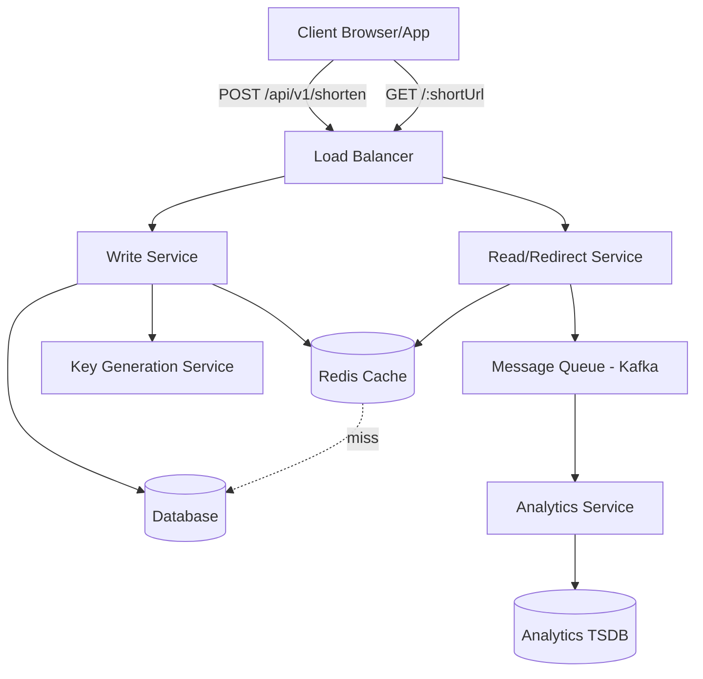
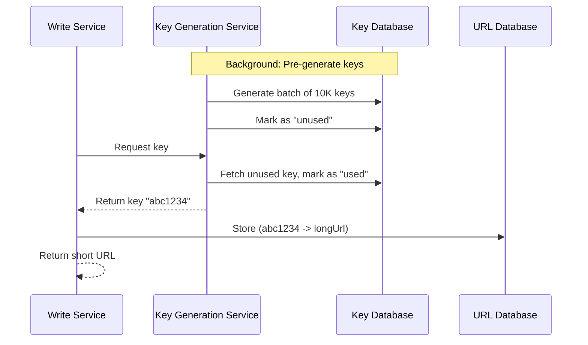
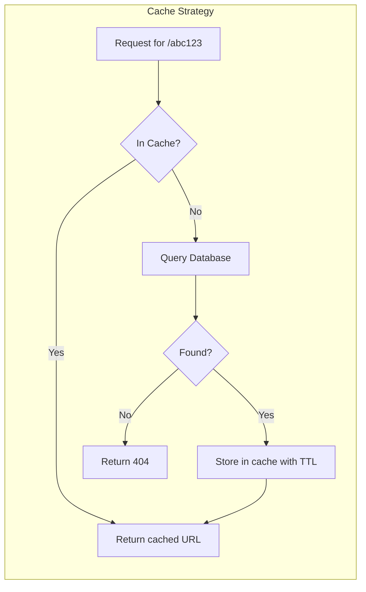
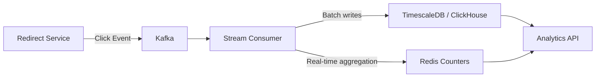
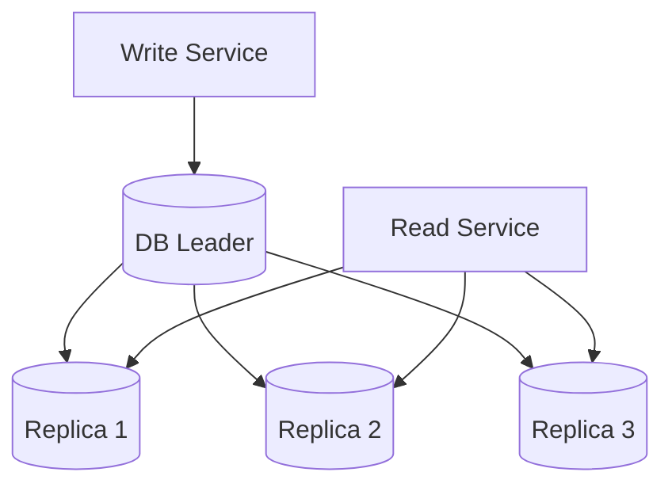
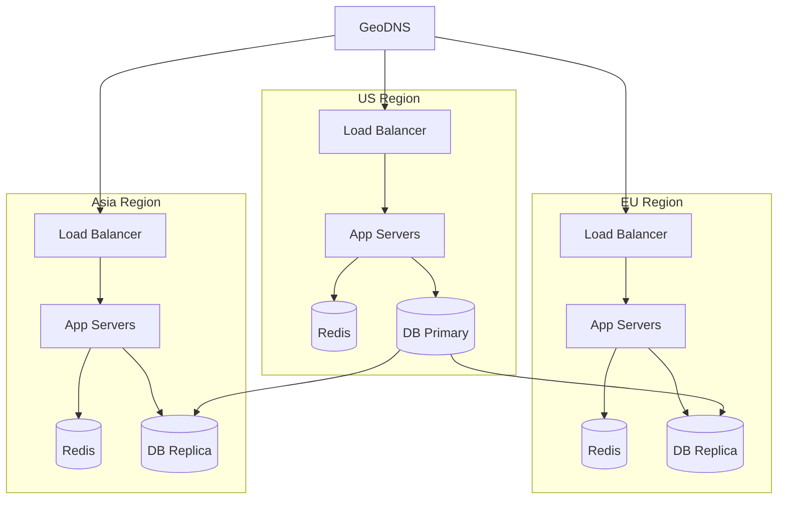

# Design a URL Shortener (TinyURL / Bit.ly)

A URL shortener converts long URLs into short, shareable links and redirects users when they click. Despite its apparent simplicity, this problem covers hashing, caching, analytics pipelines, and read-heavy system design.

---

## 1. Problem Statement & Requirements

### Functional Requirements

1. **Shorten URL** — Given a long URL, generate a unique short URL
2. **Redirect** — Given a short URL, redirect to the original long URL
3. **Custom aliases** — Users can optionally specify a custom short URL
4. **Expiration** — URLs can have an optional expiration date
5. **Analytics** — Track click count, geographic distribution, referrer, device type

### Non-Functional Requirements

1. **High availability** — The redirect service must be always-on (99.99%)
2. **Low latency** — Redirects must complete in < 50ms (p99)
3. **Read-heavy** — 100:1 read-to-write ratio
4. **Scale** — 500M total URLs, 100M DAU
5. **Durability** — Once created, a URL mapping must never be lost
6. **Not guessable** — Short URLs should not be easily enumerable

### Clarifying Questions to Ask

::: tip Questions to Ask the Interviewer
- Should we support user accounts and authentication?
- What is the expected length of the short URL?
- Do we need real-time analytics or is near-real-time acceptable?
- Should we support QR code generation?
- What character set should short URLs use? (alphanumeric only?)
- Do we need to handle spam/malicious URL detection?
:::

---

## 2. Back-of-Envelope Estimation

### Traffic Estimation

Given:
- 500M URLs in the system
- 100M DAU, each clicking ~2 short links/day
- Write:Read ratio = 1:100

$$
\text{Read QPS} = \frac{100M \times 2}{86400} \approx 2{,}315 \text{ QPS}
$$

$$
\text{Peak Read QPS} \approx 2{,}315 \times 3 \approx 7{,}000 \text{ QPS}
$$

$$
\text{Write QPS} = \frac{2{,}315}{100} \approx 23 \text{ QPS}
$$

$$
\text{Peak Write QPS} \approx 23 \times 3 \approx 70 \text{ QPS}
$$

### Storage Estimation

Each URL mapping requires:
- Short URL key: 7 bytes
- Long URL: ~200 bytes average
- Created timestamp: 8 bytes
- Expiration timestamp: 8 bytes
- User ID: 8 bytes
- Metadata: ~100 bytes

$$
\text{Per record} \approx 331 \text{ bytes} \approx 500 \text{ bytes (with overhead)}
$$

$$
\text{Total storage} = 500M \times 500 \text{ bytes} = 250 \text{ GB}
$$

New URLs per year (assuming 23 QPS average):

$$
23 \times 86400 \times 365 \approx 725M \text{ new URLs/year}
$$

$$
725M \times 500 \text{ bytes} \approx 362 \text{ GB/year}
$$

### Cache Estimation

Following the 80/20 rule (80% of traffic goes to 20% of URLs):

$$
\text{Cache size} = 0.2 \times 500M \times 500 \text{ bytes} = 50 \text{ GB}
$$

This fits comfortably in a Redis cluster.

### Bandwidth Estimation

$$
\text{Read bandwidth} = 7{,}000 \times 500 \text{ bytes} = 3.5 \text{ MB/s (negligible)}
$$

### URL Key Space

Using base62 encoding (a-z, A-Z, 0-9):

$$
62^6 = 56.8 \text{ billion combinations}
$$

$$
62^7 = 3.52 \text{ trillion combinations}
$$

A 7-character key gives us more than enough headroom for 500M URLs.

---

## 3. High-Level Design



### Core Components

| Component | Responsibility |
|-----------|---------------|
| **Write Service** | Accepts long URLs, generates short codes, stores mapping |
| **Read/Redirect Service** | Resolves short URL to long URL, issues 301/302 redirect |
| **Key Generation Service** | Pre-generates unique keys to avoid collisions |
| **Cache (Redis)** | Stores hot URL mappings for fast reads |
| **Database** | Persistent storage for all URL mappings |
| **Analytics Pipeline** | Async click tracking via Kafka |

### API Design

```typescript
// Shorten a URL
// POST /api/v1/shorten
interface ShortenRequest {
  longUrl: string;
  customAlias?: string;     // optional custom short code
  expiresAt?: string;       // ISO 8601 timestamp
}

interface ShortenResponse {
  shortUrl: string;         // e.g., "https://tiny.url/abc1234"
  longUrl: string;
  expiresAt: string | null;
  createdAt: string;
}

// Redirect (no explicit API — browser follows redirect)
// GET /:shortCode
// Response: 301 (permanent) or 302 (temporary) redirect

// Get analytics
// GET /api/v1/analytics/:shortCode
interface AnalyticsResponse {
  shortCode: string;
  totalClicks: number;
  clicksByCountry: Record<string, number>;
  clicksByDevice: Record<string, number>;
  clicksByDate: Array<{ date: string; count: number }>;
  referrers: Array<{ referrer: string; count: number }>;
}

// Delete a URL
// DELETE /api/v1/urls/:shortCode
// Response: 204 No Content
```

::: warning 301 vs 302 Redirect
- **301 (Moved Permanently):** Browser caches the redirect. Reduces server load but makes analytics tracking impossible for repeat visits.
- **302 (Found/Temporary):** Browser always hits your server. Higher load but accurate analytics.
- **Use 302** if analytics matter (which they usually do in an interview).
:::

---

## 4. Database Schema

### Option A: Relational (PostgreSQL)

```sql
-- URL mappings table
CREATE TABLE urls (
    id              BIGSERIAL PRIMARY KEY,
    short_code      VARCHAR(10) NOT NULL UNIQUE,
    long_url        TEXT NOT NULL,
    user_id         BIGINT REFERENCES users(id),
    created_at      TIMESTAMP WITH TIME ZONE DEFAULT NOW(),
    expires_at      TIMESTAMP WITH TIME ZONE,
    is_active       BOOLEAN DEFAULT TRUE,
    click_count     BIGINT DEFAULT 0
);

-- Indexes
CREATE UNIQUE INDEX idx_urls_short_code ON urls(short_code);
CREATE INDEX idx_urls_user_id ON urls(user_id);
CREATE INDEX idx_urls_expires_at ON urls(expires_at) WHERE expires_at IS NOT NULL;
CREATE INDEX idx_urls_long_url_hash ON urls(md5(long_url));

-- Users table
CREATE TABLE users (
    id              BIGSERIAL PRIMARY KEY,
    email           VARCHAR(255) NOT NULL UNIQUE,
    api_key         VARCHAR(64) NOT NULL UNIQUE,
    created_at      TIMESTAMP WITH TIME ZONE DEFAULT NOW(),
    tier            VARCHAR(20) DEFAULT 'free'  -- free, pro, enterprise
);

-- Click events (for detailed analytics — consider moving to TSDB at scale)
CREATE TABLE click_events (
    id              BIGSERIAL,
    short_code      VARCHAR(10) NOT NULL,
    clicked_at      TIMESTAMP WITH TIME ZONE DEFAULT NOW(),
    ip_address      INET,
    country_code    CHAR(2),
    user_agent      TEXT,
    referrer        TEXT,
    device_type     VARCHAR(20)
) PARTITION BY RANGE (clicked_at);

-- Monthly partitions
CREATE TABLE click_events_2026_01 PARTITION OF click_events
    FOR VALUES FROM ('2026-01-01') TO ('2026-02-01');
CREATE TABLE click_events_2026_02 PARTITION OF click_events
    FOR VALUES FROM ('2026-02-01') TO ('2026-03-01');
-- ... continue for each month
```

### Option B: NoSQL (DynamoDB)

```
Table: url_mappings
  Partition Key: short_code (String)
  Attributes: long_url, user_id, created_at, expires_at, is_active

  GSI-1: user_id-index
    Partition Key: user_id
    Sort Key: created_at

Table: click_events
  Partition Key: short_code (String)
  Sort Key: clicked_at (Number - epoch ms)
  Attributes: country, device, referrer, ip
  TTL: clicked_at + 365 days (auto-expire old analytics)
```

### Partitioning Strategy

For the relational approach:
- **URL table:** Shard by `short_code` hash (even distribution since codes are random)
- **Click events:** Partition by time (monthly) for efficient range queries and data lifecycle management
- At 500M URLs across ~50 shards = ~10M URLs per shard (very manageable)

---

## 5. Detailed Component Design

### 5.1 Key Generation: The Core Problem

This is the most critical design decision. There are several approaches:

#### Approach 1: Hash + Truncate

Take an MD5/SHA-256 hash of the long URL, then base62-encode the first 7 characters.

```typescript
import crypto from 'crypto';

function generateShortCode(longUrl: string): string {
  const hash = crypto.createHash('md5').update(longUrl).digest('hex');
  // Take first 43 bits (enough for 7 base62 chars)
  const num = BigInt('0x' + hash.substring(0, 11));
  return toBase62(num).substring(0, 7);
}

function toBase62(num: bigint): string {
  const chars = '0123456789abcdefghijklmnopqrstuvwxyzABCDEFGHIJKLMNOPQRSTUVWXYZ';
  let result = '';
  while (num > 0n) {
    result = chars[Number(num % 62n)] + result;
    num = num / 62n;
  }
  return result || '0';
}
```

**Pros:** Deterministic (same URL always produces same code), no coordination needed
**Cons:** Collisions possible (must handle), same URL always maps to same short code (can't create multiple short links for the same URL)

**Collision Handling:**

```typescript
async function shortenWithCollisionHandling(longUrl: string): Promise<string> {
  let shortCode = generateShortCode(longUrl);
  let attempt = 0;

  while (await codeExists(shortCode)) {
    attempt++;
    // Append attempt number before hashing to get different hash
    shortCode = generateShortCode(longUrl + attempt.toString());
    if (attempt > 5) {
      throw new Error('Too many collisions');
    }
  }

  await saveMapping(shortCode, longUrl);
  return shortCode;
}
```

#### Approach 2: Pre-Generated Key Service (Recommended)

A dedicated service pre-generates unique keys and stores them in a pool. When the write service needs a key, it fetches one from the pool.



```typescript
class KeyGenerationService {
  private localKeyBuffer: string[] = [];
  private readonly BUFFER_SIZE = 1000;
  private readonly REFILL_THRESHOLD = 200;

  async getKey(): Promise<string> {
    if (this.localKeyBuffer.length < this.REFILL_THRESHOLD) {
      // Async refill — don't block
      this.refillBuffer();
    }

    if (this.localKeyBuffer.length === 0) {
      // Synchronous refill if buffer is empty
      await this.refillBuffer();
    }

    return this.localKeyBuffer.pop()!;
  }

  private async refillBuffer(): Promise<void> {
    // Atomic fetch-and-mark in the key database
    const keys = await this.keyDb.fetchAndMarkUsed(this.BUFFER_SIZE);
    this.localKeyBuffer.push(...keys);
  }

  // Background job: generate keys
  async generateKeys(count: number): Promise<void> {
    const keys: string[] = [];
    for (let i = 0; i < count; i++) {
      keys.push(this.generateRandomBase62(7));
    }
    // Bulk insert, ignoring duplicates
    await this.keyDb.bulkInsertUnused(keys);
  }

  private generateRandomBase62(length: number): string {
    const chars = '0123456789abcdefghijklmnopqrstuvwxyzABCDEFGHIJKLMNOPQRSTUVWXYZ';
    let result = '';
    const randomBytes = crypto.randomBytes(length);
    for (let i = 0; i < length; i++) {
      result += chars[randomBytes[i] % 62];
    }
    return result;
  }
}
```

**Pros:** Zero collisions, O(1) key generation, no coordination between write servers
**Cons:** Additional infrastructure, keys can be "wasted" if a server crashes with unused keys in its buffer (acceptable)

#### Approach 3: Counter-Based (Snowflake-like)

Use a distributed counter (like Twitter Snowflake) to generate unique IDs, then base62-encode them.

```
| 1 bit unused | 41 bits timestamp | 5 bits datacenter | 5 bits machine | 12 bits sequence |
```

**Pros:** Sortable by time, no coordination needed
**Cons:** Predictable (IDs are sequential), requires machine ID assignment

### 5.2 Read/Redirect Service

```typescript
class RedirectService {
  private cache: RedisClient;
  private db: DatabaseClient;
  private analyticsQueue: KafkaProducer;

  async redirect(shortCode: string, request: Request): Promise<Response> {
    // 1. Check cache first
    let longUrl = await this.cache.get(`url:${shortCode}`);

    if (!longUrl) {
      // 2. Cache miss — query database
      const urlRecord = await this.db.query(
        'SELECT long_url, expires_at, is_active FROM urls WHERE short_code = $1',
        [shortCode]
      );

      if (!urlRecord) {
        return new Response('Not Found', { status: 404 });
      }

      // 3. Check expiration
      if (urlRecord.expires_at && new Date(urlRecord.expires_at) < new Date()) {
        return new Response('URL Expired', { status: 410 });
      }

      if (!urlRecord.is_active) {
        return new Response('URL Deactivated', { status: 410 });
      }

      longUrl = urlRecord.long_url;

      // 4. Populate cache (TTL: 24 hours)
      await this.cache.setEx(`url:${shortCode}`, 86400, longUrl);
    }

    // 5. Fire analytics event asynchronously
    this.analyticsQueue.send('click-events', {
      shortCode,
      timestamp: Date.now(),
      ip: request.ip,
      userAgent: request.headers['user-agent'],
      referrer: request.headers['referer'],
    });

    // 6. Return 302 redirect
    return new Response(null, {
      status: 302,
      headers: { Location: longUrl },
    });
  }
}
```

### 5.3 Cache Layer Design



**Cache eviction policy:** LRU (Least Recently Used)

**Cache warming:** On startup, load the top 1000 most-clicked URLs into cache.

```typescript
// Cache warming on service startup
async function warmCache(): Promise<void> {
  const topUrls = await db.query(`
    SELECT short_code, long_url
    FROM urls
    WHERE is_active = true
    ORDER BY click_count DESC
    LIMIT 1000
  `);

  const pipeline = redis.pipeline();
  for (const url of topUrls) {
    pipeline.setEx(`url:${url.short_code}`, 86400, url.long_url);
  }
  await pipeline.exec();
}
```

### 5.4 Custom Alias Handling

```typescript
async function createCustomAlias(
  longUrl: string,
  customAlias: string,
  userId: string
): Promise<ShortenResponse> {
  // Validate custom alias
  if (!/^[a-zA-Z0-9_-]{3,30}$/.test(customAlias)) {
    throw new ValidationError(
      'Custom alias must be 3-30 characters, alphanumeric with hyphens and underscores'
    );
  }

  // Check reserved words
  const reserved = ['api', 'admin', 'help', 'about', 'login', 'signup'];
  if (reserved.includes(customAlias.toLowerCase())) {
    throw new ValidationError('This alias is reserved');
  }

  // Check availability (atomic check-and-insert)
  try {
    await db.query(
      `INSERT INTO urls (short_code, long_url, user_id, created_at)
       VALUES ($1, $2, $3, NOW())`,
      [customAlias, longUrl, userId]
    );
  } catch (error) {
    if (error.code === '23505') { // unique_violation
      throw new ConflictError('This custom alias is already taken');
    }
    throw error;
  }

  return {
    shortUrl: `https://tiny.url/${customAlias}`,
    longUrl,
    expiresAt: null,
    createdAt: new Date().toISOString(),
  };
}
```

### 5.5 Analytics Pipeline



```typescript
// Kafka consumer for click analytics
class ClickAnalyticsConsumer {
  async processClickEvent(event: ClickEvent): Promise<void> {
    const { shortCode, timestamp, ip, userAgent, referrer } = event;

    // 1. GeoIP lookup
    const geo = await this.geoipService.lookup(ip);

    // 2. Parse user agent
    const device = this.parseDevice(userAgent);

    // 3. Increment real-time counter in Redis
    await this.redis.multi()
      .incr(`clicks:${shortCode}:total`)
      .hincrby(`clicks:${shortCode}:country`, geo.countryCode, 1)
      .hincrby(`clicks:${shortCode}:device`, device.type, 1)
      .hincrby(`clicks:${shortCode}:date`, this.dateKey(timestamp), 1)
      .exec();

    // 4. Write to TSDB for historical queries
    await this.tsdb.insert('click_events', {
      short_code: shortCode,
      timestamp,
      country_code: geo.countryCode,
      city: geo.city,
      device_type: device.type,
      browser: device.browser,
      os: device.os,
      referrer: referrer || 'direct',
    });
  }

  private dateKey(timestamp: number): string {
    return new Date(timestamp).toISOString().split('T')[0]; // "2026-03-18"
  }
}
```

### 5.6 URL Expiration

```typescript
// Background job: clean up expired URLs
class ExpirationWorker {
  async run(): Promise<void> {
    // Run every minute
    setInterval(async () => {
      const expired = await this.db.query(`
        UPDATE urls
        SET is_active = false
        WHERE expires_at < NOW()
          AND is_active = true
        RETURNING short_code
      `);

      // Invalidate cache for expired URLs
      for (const url of expired) {
        await this.cache.del(`url:${url.short_code}`);
      }

      console.log(`Expired ${expired.length} URLs`);
    }, 60_000);
  }
}
```

Alternatively, use lazy expiration: check the `expires_at` field during the redirect and return 410 Gone if expired. This avoids a background job but leaves stale entries in cache.

---

## 6. Scaling & Bottlenecks

### What Breaks First?

At 7K read QPS, a single PostgreSQL instance can handle the load. But as we grow:

| Scale | Bottleneck | Solution |
|-------|-----------|----------|
| 10K QPS | Single DB read load | Add Redis cache (hit rate > 90%) |
| 50K QPS | Cache memory | Redis Cluster (3-5 nodes, 50GB each) |
| 100K QPS | Application server | Horizontal scaling behind LB |
| 500K QPS | Database write throughput | Shard by short_code hash |
| 1M+ QPS | Network, everything | Multi-region deployment |

### Database Sharding

Shard the `urls` table by hashing `short_code`:

```typescript
function getShardId(shortCode: string, numShards: number): number {
  const hash = crypto.createHash('md5').update(shortCode).digest();
  return hash.readUInt32BE(0) % numShards;
}

// Route to correct shard
async function lookupUrl(shortCode: string): Promise<string | null> {
  const shardId = getShardId(shortCode, 16); // 16 shards
  const db = shardConnections[shardId];
  const result = await db.query(
    'SELECT long_url FROM urls WHERE short_code = $1',
    [shortCode]
  );
  return result?.long_url ?? null;
}
```

### Read Replicas

For the read-heavy workload (100:1 ratio), add read replicas:



### Cache Stampede Prevention

When a popular URL's cache entry expires, hundreds of requests simultaneously hit the database:

```typescript
// Solution: Probabilistic early expiration
async function getUrlWithEarlyExpiry(shortCode: string): Promise<string | null> {
  const cached = await redis.get(`url:${shortCode}`);
  if (cached) {
    const { value, expiry, delta } = JSON.parse(cached);
    const now = Date.now();

    // Probabilistically refresh before actual expiry
    const timeRemaining = expiry - now;
    const threshold = delta * Math.log(Math.random()) * -1;

    if (timeRemaining < threshold) {
      // Refresh in background
      this.refreshCache(shortCode);
    }

    return value;
  }

  // Cache miss — use distributed lock to prevent stampede
  const lock = await redis.set(`lock:url:${shortCode}`, '1', 'NX', 'EX', 5);
  if (lock) {
    const url = await db.query('SELECT long_url FROM urls WHERE short_code = $1', [shortCode]);
    if (url) {
      await redis.setEx(`url:${shortCode}`, 86400, url.long_url);
    }
    await redis.del(`lock:url:${shortCode}`);
    return url?.long_url ?? null;
  }

  // Another request is refreshing — wait briefly and retry
  await sleep(50);
  return this.getUrlWithEarlyExpiry(shortCode);
}
```

### Multi-Region Deployment



---

## 7. Trade-offs & Alternatives

### SQL vs NoSQL

| Criterion | SQL (PostgreSQL) | NoSQL (DynamoDB) |
|-----------|-----------------|------------------|
| Schema | Fixed, with migrations | Flexible |
| Transactions | Full ACID | Limited |
| Scaling | Manual sharding | Auto-scaling |
| Query flexibility | Rich SQL | Key-value lookups |
| Cost at scale | Lower (self-managed) | Higher (managed) |
| **Verdict** | Good for < 100M URLs | Better for > 100M URLs |

For a URL shortener, the access pattern is simple key-value lookup, making NoSQL a natural fit at scale. However, SQL is perfectly fine for moderate scale and offers better analytics query support.

### Encoding: Base62 vs Base58 vs Base64

| Encoding | Characters | Pros | Cons |
|----------|-----------|------|------|
| Base62 | a-z, A-Z, 0-9 | URL-safe, no ambiguity | Case-sensitive |
| Base58 | Base62 minus 0, O, l, I | No confusing chars | Slightly smaller space |
| Base64 | Base62 + / and + | Maximum density | Not URL-safe |

**Recommendation:** Base62 — best balance of density and URL-safety.

### Consistency Model

- **Strong consistency** for writes: Ensure no duplicate short codes are created
- **Eventual consistency** for reads: A slight delay in replication is acceptable (user can retry if redirect fails momentarily)
- **Eventual consistency** for analytics: Near-real-time is sufficient

### Redirect: 301 vs 302

| Aspect | 301 (Permanent) | 302 (Temporary) |
|--------|-----------------|-----------------|
| Browser caching | Yes | No |
| Server load | Lower (cached) | Higher (every click) |
| Analytics accuracy | Poor (cached clicks invisible) | Excellent |
| SEO | Link juice passes through | No link juice transfer |
| **Recommendation** | Only if analytics don't matter | **Use this** for analytics |

---

## 8. Advanced Topics

### 8.1 Spam and Malicious URL Detection

```typescript
class UrlSafetyChecker {
  async isUrlSafe(longUrl: string): Promise<boolean> {
    // 1. Check against Google Safe Browsing API
    const safeBrowsingResult = await this.googleSafeBrowsing.check(longUrl);
    if (!safeBrowsingResult.safe) return false;

    // 2. Check against internal blacklist
    const domain = new URL(longUrl).hostname;
    if (await this.blacklist.contains(domain)) return false;

    // 3. Check against PhishTank
    const phishResult = await this.phishTank.check(longUrl);
    if (phishResult.isPhishing) return false;

    // 4. Rate limit by IP (prevent mass URL creation for spam)
    // Handled at the API gateway level

    return true;
  }
}
```

### 8.2 Rate Limiting

```typescript
// Token bucket rate limiter per API key
class RateLimiter {
  async checkLimit(apiKey: string): Promise<boolean> {
    const key = `ratelimit:${apiKey}`;
    const limit = await this.getUserTierLimit(apiKey);

    const current = await this.redis.incr(key);
    if (current === 1) {
      await this.redis.expire(key, 60); // Reset every minute
    }

    return current <= limit;
  }

  private async getUserTierLimit(apiKey: string): Promise<number> {
    // Free: 10 req/min, Pro: 100 req/min, Enterprise: 1000 req/min
    const tier = await this.cache.get(`tier:${apiKey}`);
    const limits: Record<string, number> = {
      free: 10,
      pro: 100,
      enterprise: 1000,
    };
    return limits[tier ?? 'free'];
  }
}
```

### 8.3 QR Code Generation

```typescript
// Generate QR code for a short URL on-demand
import QRCode from 'qrcode';

async function generateQRCode(shortUrl: string, size: number = 300): Promise<Buffer> {
  const cacheKey = `qr:${shortUrl}:${size}`;
  const cached = await redis.getBuffer(cacheKey);
  if (cached) return cached;

  const qrBuffer = await QRCode.toBuffer(shortUrl, {
    width: size,
    margin: 2,
    color: { dark: '#000000', light: '#FFFFFF' },
  });

  await redis.setEx(cacheKey, 86400 * 7, qrBuffer); // Cache for 7 days
  return qrBuffer;
}
```

### 8.4 URL Preview / Metadata

```typescript
// Fetch Open Graph metadata for the destination URL
interface UrlPreview {
  title: string;
  description: string;
  image: string;
  favicon: string;
}

async function fetchUrlPreview(longUrl: string): Promise<UrlPreview> {
  const cacheKey = `preview:${longUrl}`;
  const cached = await redis.get(cacheKey);
  if (cached) return JSON.parse(cached);

  const response = await fetch(longUrl, {
    headers: { 'User-Agent': 'TinyURL Preview Bot/1.0' },
    signal: AbortSignal.timeout(5000), // 5 second timeout
  });

  const html = await response.text();
  const preview = parseOpenGraphTags(html);

  await redis.setEx(cacheKey, 86400, JSON.stringify(preview));
  return preview;
}
```

### 8.5 A/B Testing with Short URLs

Allow users to create A/B test short URLs that distribute traffic across multiple long URLs:

```typescript
interface ABTestConfig {
  shortCode: string;
  variants: Array<{
    longUrl: string;
    weight: number; // 0-100, must sum to 100
    label: string;
  }>;
}

function selectVariant(config: ABTestConfig): string {
  const rand = Math.random() * 100;
  let cumulative = 0;
  for (const variant of config.variants) {
    cumulative += variant.weight;
    if (rand < cumulative) {
      return variant.longUrl;
    }
  }
  return config.variants[0].longUrl;
}
```

---

## 9. Interview Tips

### What Interviewers Look For

1. **Requirements gathering** — Did you ask about scale, analytics, custom aliases?
2. **Key generation strategy** — Can you articulate the trade-offs between hash-based and pre-generated keys?
3. **Read-heavy optimization** — Did you add caching without being prompted?
4. **Estimation skills** — Can you calculate QPS and storage?
5. **Trade-off discussion** — 301 vs 302, SQL vs NoSQL, consistency model

### Common Follow-Up Questions

::: details "How do you handle a hash collision?"
Use approach 1 (hash + retry with salt) or approach 2 (pre-generated keys, which have zero collisions). If using hashing, append a counter to the input and re-hash. After 3-5 retries, fall back to a random key.
:::

::: details "How do you prevent abuse?"
Rate limiting per API key/IP, URL safety scanning (Google Safe Browsing), CAPTCHA for anonymous users, blacklisting known spam domains.
:::

::: details "How would you make this globally distributed?"
GeoDNS to route users to the nearest datacenter. Each region has its own Redis cache. URL creation goes to a single primary region; reads are served from any region's read replica. Key generation service runs in the primary region.
:::

::: details "What if a single URL gets billions of hits (viral)?"
- Redis handles 500K+ QPS per instance, so cache is fine
- The 302 redirect is stateless — just add more app servers behind the LB
- Pre-warm the cache for known viral links
- Consider 301 for viral links to offload to browser cache
:::

::: details "How do you handle the custom alias 'api' conflicting with your API routes?"
Reserve a list of protected paths (api, admin, health, metrics, etc.). Validate custom aliases against this list during creation. Use a separate subdomain for the API (api.tiny.url) vs redirects (tiny.url/:code).
:::

### Time Allocation (45-minute interview)

| Phase | Time | What to Cover |
|-------|------|--------------|
| Requirements | 5 min | Functional + non-functional, clarify scale |
| Estimation | 3 min | QPS, storage, cache size |
| High-level design | 12 min | Architecture diagram, component overview |
| Key generation deep-dive | 10 min | Hash vs pre-generated, collision handling |
| Caching + read path | 5 min | Cache-aside, eviction, stampede |
| Analytics | 5 min | Async pipeline, Kafka, TSDB |
| Scaling discussion | 5 min | Sharding, multi-region, bottlenecks |

::: info War Story
At Bit.ly's scale (billions of clicks per month), the analytics pipeline is actually the hardest part of the system — not the URL mapping itself. The redirect service is a simple cache lookup 99% of the time. The real engineering challenge is processing billions of click events, deduplicating bots, and providing real-time dashboards. If the interviewer seems senior, consider volunteering to deep-dive into the analytics pipeline instead of the basic redirect flow.
:::

---

## Summary

| Component | Technology Choice | Why |
|-----------|------------------|-----|
| Key Generation | Pre-generated key pool | Zero collisions, O(1) generation |
| Primary Database | PostgreSQL (< 100M) or DynamoDB (> 100M) | Simple key-value pattern |
| Cache | Redis Cluster | 50GB+ capacity, sub-ms latency |
| Analytics Queue | Kafka | High throughput, durability |
| Analytics Storage | ClickHouse / TimescaleDB | Fast aggregations on time-series data |
| Load Balancer | AWS ALB / Nginx | Layer 7 routing |
| CDN | Not needed | Dynamic content (redirects) |

The URL shortener is often the first system design problem candidates encounter. Its simplicity is deceptive — a strong answer covers key generation trade-offs, caching strategies, analytics pipelines, and scaling patterns that apply to many other systems.
