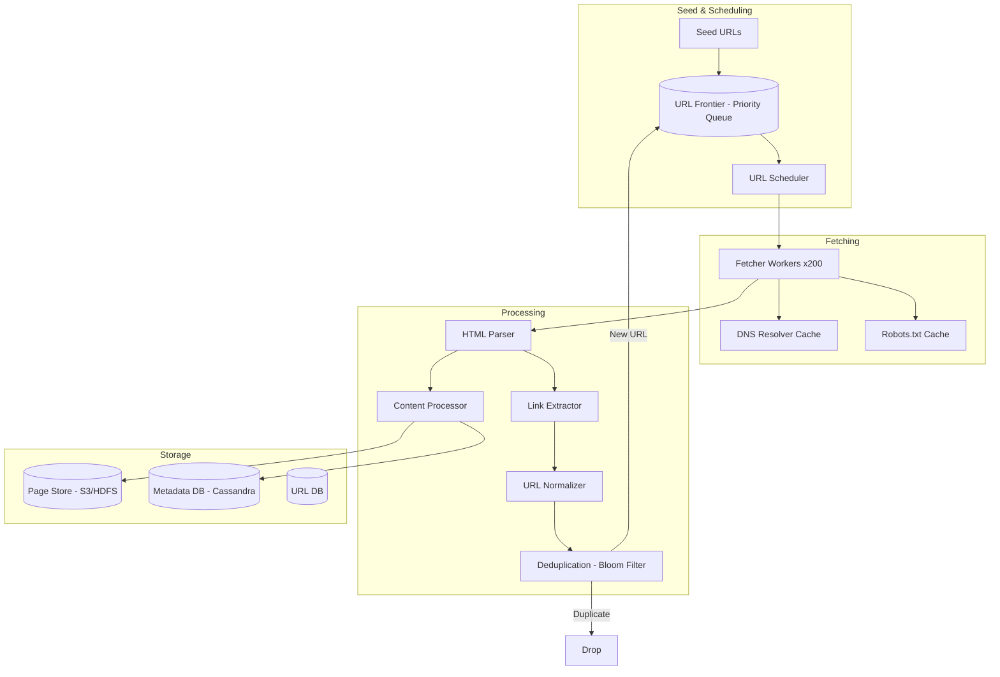
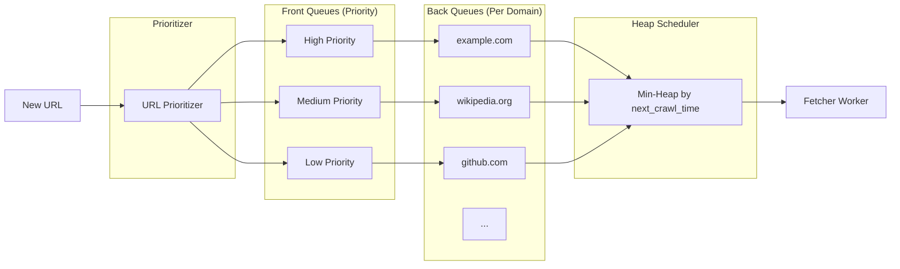
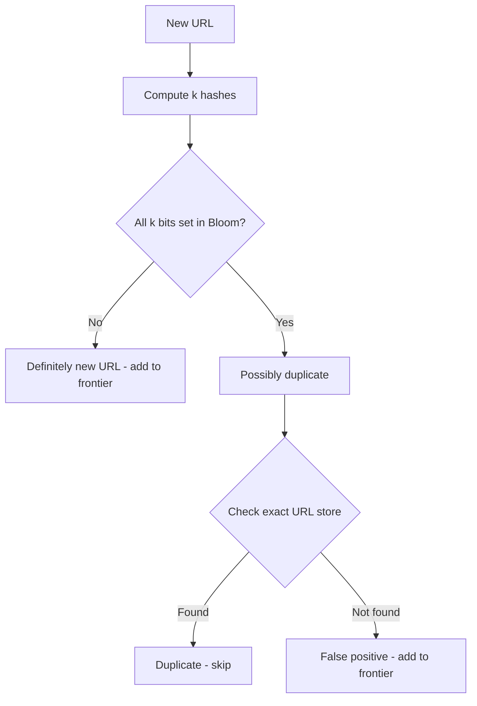
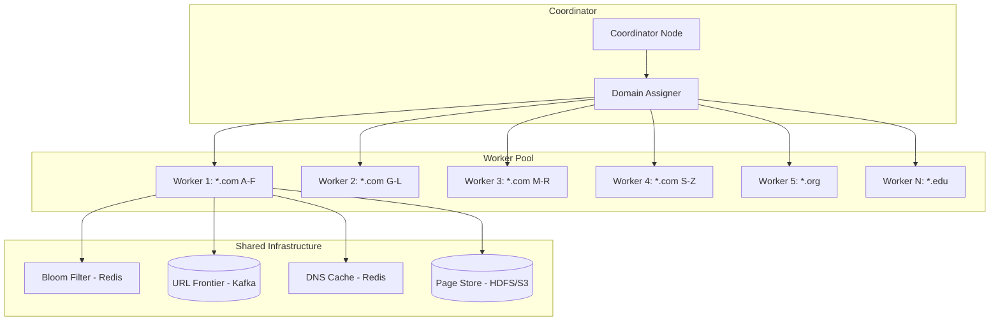
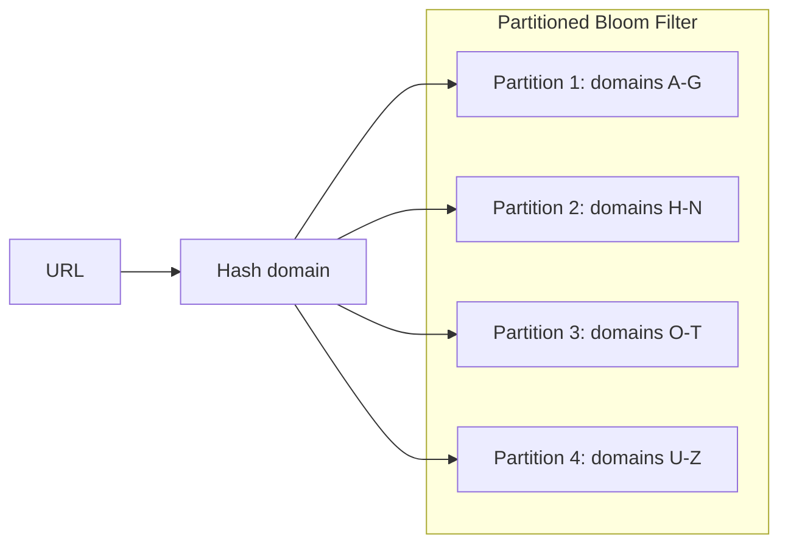

# Design a Web Crawler

A web crawler systematically browses the internet by fetching web pages, extracting links, and following them to discover new content. This design covers the URL frontier, politeness constraints, distributed crawling, duplicate detection (Bloom filters), robots.txt compliance, incremental crawling, and trap avoidance.

---

## 1. Problem Statement & Requirements

### Functional Requirements

1. **Crawl web pages** — Given seed URLs, discover and fetch pages across the internet
2. **Extract content** — Parse HTML to extract text, links, metadata
3. **Follow links** — Discover new pages by following extracted URLs
4. **Store pages** — Persist crawled content for indexing/analysis
5. **Respect robots.txt** — Honor website crawling policies
6. **Incremental crawling** — Re-crawl previously visited pages for updates
7. **Priority crawling** — Important pages are crawled more frequently
8. **URL normalization** — Treat equivalent URLs as the same page

### Non-Functional Requirements

1. **Scalability** — Crawl 1 billion pages per day
2. **Politeness** — Don't overwhelm any single domain
3. **Robustness** — Handle malformed HTML, infinite loops, spider traps
4. **Efficiency** — Minimize redundant work (duplicate URLs, unchanged pages)
5. **Freshness** — Keep crawled content up to date
6. **Extensibility** — Easy to add new content extractors or processing steps

### Clarifying Questions

::: tip Questions to Ask
- What is the crawl budget (pages per day)?
- Should we crawl only HTML or also PDFs, images, JS-rendered pages?
- Do we need to render JavaScript (SPA sites)?
- What is the primary use case? (Search engine? Data mining? Archival?)
- Are there geographic preferences?
- Do we need to support crawl depth limits?
:::

---

## 2. Back-of-Envelope Estimation

### Crawl Volume

Target: 1 billion pages per day

$$
\text{Pages per second} = \frac{1B}{86400} \approx 11{,}574 \text{ pages/sec}
$$

$$
\text{Peak} \approx 11{,}574 \times 2 \approx 23K \text{ pages/sec}
$$

### Network Bandwidth

Average page size: 500KB (HTML + embedded resources)

$$
\text{Bandwidth} = 11{,}574 \times 500KB = 5.79 \text{ GB/s} \approx 46 \text{ Gbps}
$$

### Storage

$$
\text{Daily storage (raw)} = 1B \times 500KB = 500 \text{ TB/day}
$$

$$
\text{Daily storage (compressed)} = 500 \text{ TB} \times 0.3 = 150 \text{ TB/day}
$$

$$
\text{Annual} = 150 \text{ TB} \times 365 = 54.75 \text{ PB/year}
$$

### URL Frontier Size

Assume we've discovered 10 billion unique URLs:

$$
\text{URL storage} = 10B \times 100 \text{ bytes (avg URL)} = 1 \text{ TB}
$$

### Bloom Filter Size

For 10 billion URLs with 1% false positive rate:

$$
m = -\frac{n \times \ln(p)}{(\ln 2)^2} = -\frac{10^{10} \times \ln(0.01)}{0.693^2} \approx 96 \text{ billion bits} \approx 12 \text{ GB}
$$

$$
k = \frac{m}{n} \times \ln 2 = \frac{96B}{10B} \times 0.693 \approx 7 \text{ hash functions}
$$

### Crawl Workers

If each worker can fetch ~100 pages/second (network-bound):

$$
\text{Workers needed} = \frac{11{,}574}{100} \approx 116 \text{ workers}
$$

With redundancy and headroom: ~200 workers across multiple datacenters.

---

## 3. High-Level Design



### Core Components

| Component | Responsibility |
|-----------|---------------|
| **URL Frontier** | Priority queue of URLs to crawl, organized by domain |
| **Scheduler** | Controls crawl rate per domain (politeness) |
| **Fetcher Workers** | Download web pages via HTTP |
| **DNS Resolver** | Resolve domain names with caching |
| **HTML Parser** | Parse HTML, extract text and links |
| **URL Normalizer** | Canonicalize URLs to detect duplicates |
| **Bloom Filter** | Efficiently detect already-seen URLs |
| **Content Processor** | Extract structured data, compute fingerprints |
| **Page Store** | Persist raw HTML for later processing |

---

## 4. Database Schema

### URL Metadata (Cassandra)

```sql
-- URL metadata: stores info about every discovered URL
CREATE TABLE url_metadata (
    url_hash        TEXT,           -- SHA-256 of normalized URL (partition key)
    url             TEXT,
    domain          TEXT,
    last_crawled    TIMESTAMP,
    last_modified   TIMESTAMP,      -- From HTTP Last-Modified header
    etag            TEXT,           -- From HTTP ETag header
    status_code     INT,
    content_hash    TEXT,           -- Fingerprint of page content
    crawl_priority  FLOAT,         -- 0.0 to 1.0
    crawl_frequency INT,           -- Re-crawl interval in hours
    depth           INT,           -- Distance from seed URL
    PRIMARY KEY (url_hash)
);

-- Domain metadata: tracks politeness per domain
CREATE TABLE domain_metadata (
    domain          TEXT PRIMARY KEY,
    robots_txt      TEXT,
    robots_fetched  TIMESTAMP,
    crawl_delay     INT,           -- From robots.txt Crawl-delay
    last_crawled    TIMESTAMP,     -- Last time any page on this domain was crawled
    pages_crawled   BIGINT,
    avg_response_ms INT,
    is_blocked      BOOLEAN DEFAULT FALSE
);
```

### Page Content Store (S3/HDFS)

```
s3://crawler-pages/
  {domain}/
    {url_hash}/
      {timestamp}/
        content.html.gz     -- Compressed HTML
        metadata.json        -- HTTP headers, status, timing
```

### URL Frontier (Redis + Disk-backed Queue)

```
# Per-domain queues (ensures politeness)
Key: frontier:{domain}
Type: Sorted Set
Score: priority (higher = crawl sooner)
Member: url_hash

# Domain scheduling queue
Key: domain_schedule
Type: Sorted Set
Score: next_allowed_crawl_time (epoch ms)
Member: domain

# Bloom filter for seen URLs
Key: seen_urls
Type: Bloom Filter (RedisBloom module)
```

---

## 5. Detailed Component Design

### 5.1 URL Frontier

The URL frontier is the most critical data structure in a web crawler. It must support:
1. **Prioritization** — Important pages are crawled first
2. **Politeness** — Don't overload any single domain
3. **Fairness** — All domains get crawled, not just high-priority ones



```typescript
class URLFrontier {
  private priorityQueues: Map<string, PriorityQueue>; // domain -> priority queue
  private domainScheduler: MinHeap<DomainSchedule>;    // min-heap by next_allowed_time
  private bloomFilter: BloomFilter;

  async addUrl(url: string, priority: number, depth: number): Promise<boolean> {
    // 1. Normalize URL
    const normalized = this.normalizeUrl(url);
    const urlHash = sha256(normalized);

    // 2. Check Bloom filter for duplicates
    if (this.bloomFilter.mightContain(urlHash)) {
      // Probably already seen — check exact store for false positive
      const exists = await this.urlDB.exists(urlHash);
      if (exists) return false; // Definitely a duplicate
    }

    // 3. Add to Bloom filter
    this.bloomFilter.add(urlHash);

    // 4. Calculate priority
    const domain = new URL(normalized).hostname;
    const adjustedPriority = this.calculatePriority(normalized, priority, depth);

    // 5. Add to domain-specific queue
    await this.redis.zadd(
      `frontier:${domain}`,
      adjustedPriority,
      urlHash
    );

    // 6. Ensure domain is in the scheduler
    const domainExists = await this.redis.zscore('domain_schedule', domain);
    if (domainExists === null) {
      await this.redis.zadd('domain_schedule', Date.now(), domain);
    }

    return true;
  }

  async getNextUrl(): Promise<CrawlTarget | null> {
    // 1. Get the domain whose next crawl time has passed
    const now = Date.now();
    const domains = await this.redis.zrangebyscore(
      'domain_schedule',
      0,
      now,
      'LIMIT', 0, 1
    );

    if (domains.length === 0) return null;

    const domain = domains[0];

    // 2. Pop highest-priority URL from this domain's queue
    const results = await this.redis.zpopmax(`frontier:${domain}`);
    if (!results || results.length === 0) {
      // Domain queue is empty — remove from scheduler
      await this.redis.zrem('domain_schedule', domain);
      return null;
    }

    const [urlHash, priority] = results;

    // 3. Get full URL and metadata
    const urlData = await this.urlDB.get(urlHash);

    // 4. Schedule next crawl for this domain (politeness delay)
    const crawlDelay = await this.getDomainCrawlDelay(domain);
    await this.redis.zadd('domain_schedule', now + crawlDelay, domain);

    return {
      url: urlData.url,
      urlHash,
      domain,
      priority: parseFloat(priority),
    };
  }

  private calculatePriority(url: string, basePriority: number, depth: number): number {
    let priority = basePriority;

    // Depth penalty: deeper pages get lower priority
    priority -= depth * 0.1;

    // PageRank-like boost (if available)
    // High-authority domains get a boost
    const domainRank = this.getDomainAuthority(new URL(url).hostname);
    priority += domainRank * 0.3;

    // Freshness boost for frequently updated domains
    // (news sites, social media)

    return Math.max(0, Math.min(1, priority));
  }
}
```

### 5.2 Politeness and Rate Limiting

```typescript
class PolitenessEnforcer {
  private readonly DEFAULT_CRAWL_DELAY = 1000; // 1 second between requests to same domain
  private readonly MAX_CRAWL_DELAY = 30000;    // Max 30 seconds
  private domainDelays: Map<string, number> = new Map();

  async getCrawlDelay(domain: string): Promise<number> {
    // Check cached delay
    if (this.domainDelays.has(domain)) {
      return this.domainDelays.get(domain)!;
    }

    // Fetch robots.txt
    const robotsTxt = await this.fetchRobotsTxt(domain);

    let delay = this.DEFAULT_CRAWL_DELAY;

    if (robotsTxt) {
      // Parse Crawl-delay directive
      const crawlDelay = this.parseCrawlDelay(robotsTxt);
      if (crawlDelay !== null) {
        delay = Math.min(crawlDelay * 1000, this.MAX_CRAWL_DELAY);
      }
    }

    // Adaptive delay: if domain responds slowly, increase delay
    const avgResponseTime = await this.getAvgResponseTime(domain);
    if (avgResponseTime > 2000) {
      delay = Math.max(delay, avgResponseTime * 2);
    }

    this.domainDelays.set(domain, delay);
    return delay;
  }

  async isUrlAllowed(url: string, userAgent: string): Promise<boolean> {
    const domain = new URL(url).hostname;
    const path = new URL(url).pathname;

    const robotsTxt = await this.getRobotsTxt(domain);
    if (!robotsTxt) return true; // No robots.txt = allow everything

    return this.robotsParser.isAllowed(robotsTxt, userAgent, path);
  }

  private async fetchRobotsTxt(domain: string): Promise<string | null> {
    const cacheKey = `robots:${domain}`;
    const cached = await this.redis.get(cacheKey);
    if (cached) return cached === 'NONE' ? null : cached;

    try {
      const response = await fetch(`https://${domain}/robots.txt`, {
        signal: AbortSignal.timeout(5000),
        headers: { 'User-Agent': 'MyBot/1.0' },
      });

      if (response.status === 200) {
        const text = await response.text();
        await this.redis.setEx(cacheKey, 86400, text); // Cache for 24 hours
        return text;
      }
    } catch {
      // robots.txt not available — default to allow
    }

    await this.redis.setEx(cacheKey, 86400, 'NONE');
    return null;
  }
}
```

::: warning robots.txt Compliance
Respecting robots.txt is both an ethical obligation and a legal requirement in many jurisdictions. Crawling pages disallowed by robots.txt can result in IP bans, legal action, or being blocked permanently. Always implement robots.txt parsing as a hard requirement, not a nice-to-have.
:::

### 5.3 URL Normalization

URL normalization prevents crawling the same page multiple times via different URL representations:

```typescript
class URLNormalizer {
  normalize(url: string): string {
    try {
      const parsed = new URL(url);

      // 1. Lowercase scheme and host
      parsed.protocol = parsed.protocol.toLowerCase();
      parsed.hostname = parsed.hostname.toLowerCase();

      // 2. Remove default ports
      if (parsed.port === '80' && parsed.protocol === 'http:') parsed.port = '';
      if (parsed.port === '443' && parsed.protocol === 'https:') parsed.port = '';

      // 3. Remove fragment (hash)
      parsed.hash = '';

      // 4. Sort query parameters
      const params = new URLSearchParams(parsed.search);
      const sortedParams = new URLSearchParams([...params].sort());
      parsed.search = sortedParams.toString() ? '?' + sortedParams.toString() : '';

      // 5. Remove trailing slash (except for root)
      let path = parsed.pathname;
      if (path !== '/' && path.endsWith('/')) {
        path = path.slice(0, -1);
      }

      // 6. Remove common tracking parameters
      const trackingParams = ['utm_source', 'utm_medium', 'utm_campaign', 'utm_term',
        'utm_content', 'fbclid', 'gclid', 'ref', 'source'];
      for (const param of trackingParams) {
        sortedParams.delete(param);
      }

      // 7. Decode unnecessary percent-encoding
      path = decodeURIComponent(path);
      // Re-encode only necessary characters
      path = path.split('/').map(segment => encodeURIComponent(segment)).join('/');

      // 8. Remove index.html, index.php, default.asp
      path = path.replace(/\/(index|default)\.(html?|php|aspx?)$/i, '/');

      parsed.pathname = path;

      return parsed.toString();
    } catch {
      return url; // Return as-is if parsing fails
    }
  }
}
```

### 5.4 Duplicate Detection with Bloom Filter



```typescript
class BloomFilter {
  private bits: Uint8Array;
  private numHashFunctions: number;
  private size: number; // in bits

  constructor(expectedItems: number, falsePositiveRate: number) {
    // Calculate optimal size and hash functions
    this.size = Math.ceil(
      -expectedItems * Math.log(falsePositiveRate) / Math.pow(Math.log(2), 2)
    );
    this.numHashFunctions = Math.ceil((this.size / expectedItems) * Math.log(2));
    this.bits = new Uint8Array(Math.ceil(this.size / 8));
  }

  add(item: string): void {
    const hashes = this.getHashes(item);
    for (const hash of hashes) {
      const index = hash % this.size;
      this.bits[Math.floor(index / 8)] |= (1 << (index % 8));
    }
  }

  mightContain(item: string): boolean {
    const hashes = this.getHashes(item);
    for (const hash of hashes) {
      const index = hash % this.size;
      if ((this.bits[Math.floor(index / 8)] & (1 << (index % 8))) === 0) {
        return false; // Definitely not in the set
      }
    }
    return true; // Might be in the set (could be false positive)
  }

  private getHashes(item: string): number[] {
    // Double hashing technique: h(i) = h1 + i * h2
    const hash = crypto.createHash('md5').update(item).digest();
    const h1 = hash.readUInt32BE(0);
    const h2 = hash.readUInt32BE(4);

    const hashes: number[] = [];
    for (let i = 0; i < this.numHashFunctions; i++) {
      hashes.push(Math.abs((h1 + i * h2) % this.size));
    }
    return hashes;
  }

  // For distributed crawler: use Redis Bloom Filter
  // redis> BF.ADD seen_urls "https://example.com/page1"
  // redis> BF.EXISTS seen_urls "https://example.com/page1"
}
```

::: info Bloom Filter Properties
- **Space efficient:** 12 GB for 10 billion URLs (vs ~1 TB for a hash set)
- **O(k) lookup:** k hash functions, typically 5-10
- **No false negatives:** If Bloom filter says "not seen," it's 100% correct
- **False positives possible:** If it says "seen," there's a small chance it's wrong (configurable rate)
- **Cannot delete items:** Use Counting Bloom Filter for deletions
:::

### 5.5 Distributed Crawling Architecture



**Domain-based partitioning:** Assign domains to workers using consistent hashing. This ensures:
- Each domain is handled by a single worker (politeness enforcement)
- Load is distributed across workers
- Workers can be added/removed with minimal redistribution

```typescript
class CrawlCoordinator {
  private workerRing: ConsistentHashRing;
  private workers: Map<string, WorkerStatus> = new Map();

  assignDomainToWorker(domain: string): string {
    // Use consistent hashing to assign domains to workers
    return this.workerRing.getNode(domain);
  }

  async monitorWorkers(): Promise<void> {
    setInterval(async () => {
      for (const [workerId, status] of this.workers) {
        // Check worker heartbeat
        const lastHeartbeat = await this.redis.get(`worker:heartbeat:${workerId}`);
        if (!lastHeartbeat || Date.now() - parseInt(lastHeartbeat) > 30000) {
          // Worker is down — reassign its domains
          await this.reassignWorkerDomains(workerId);
        }

        // Check for stragglers (workers falling behind)
        if (status.queueDepth > 10000) {
          // Worker is overloaded — split its domains
          await this.splitWorkerLoad(workerId);
        }
      }
    }, 10000);
  }
}
```

### 5.6 Fetcher Worker

```typescript
class FetcherWorker {
  private httpClient: HttpClient;
  private dnsCache: DNSCache;
  private robotsCache: Map<string, RobotsTxt>;

  async crawlLoop(): Promise<void> {
    while (true) {
      // 1. Get next URL from frontier
      const target = await this.frontier.getNextUrl();
      if (!target) {
        await sleep(100);
        continue;
      }

      try {
        await this.crawlUrl(target);
      } catch (error) {
        await this.handleError(target, error);
      }
    }
  }

  async crawlUrl(target: CrawlTarget): Promise<void> {
    const { url, urlHash, domain } = target;

    // 1. Check robots.txt
    const allowed = await this.politeness.isUrlAllowed(url, 'MyBot/1.0');
    if (!allowed) {
      await this.markSkipped(urlHash, 'robots_blocked');
      return;
    }

    // 2. DNS resolution (with caching)
    const ip = await this.dnsCache.resolve(domain);

    // 3. Fetch page with conditional GET
    const previousMeta = await this.urlDB.get(urlHash);
    const headers: Record<string, string> = {
      'User-Agent': 'MyBot/1.0 (+https://mybot.com/about)',
    };

    if (previousMeta?.etag) {
      headers['If-None-Match'] = previousMeta.etag;
    }
    if (previousMeta?.lastModified) {
      headers['If-Modified-Since'] = previousMeta.lastModified;
    }

    const response = await this.httpClient.get(url, {
      headers,
      timeout: 30000,
      maxRedirects: 5,
      maxResponseSize: 10 * 1024 * 1024, // 10MB max
    });

    // 4. Handle response
    if (response.status === 304) {
      // Not modified — update last_crawled timestamp, skip processing
      await this.urlDB.update(urlHash, { lastCrawled: new Date() });
      return;
    }

    if (response.status !== 200) {
      await this.handleNonSuccessResponse(urlHash, response);
      return;
    }

    // 5. Content type check
    const contentType = response.headers['content-type'] || '';
    if (!contentType.includes('text/html')) {
      await this.handleNonHtmlContent(urlHash, url, response);
      return;
    }

    // 6. Parse HTML
    const html = response.body;
    const parsed = this.htmlParser.parse(html);

    // 7. Extract and process links
    const links = this.extractLinks(parsed, url);
    for (const link of links) {
      const normalizedLink = this.urlNormalizer.normalize(link);
      if (this.isValidCrawlTarget(normalizedLink)) {
        await this.frontier.addUrl(normalizedLink, 0.5, target.depth + 1);
      }
    }

    // 8. Compute content fingerprint (for duplicate content detection)
    const contentHash = this.computeContentFingerprint(parsed.textContent);

    // 9. Store page content
    await this.pageStore.store(urlHash, {
      html: await compress(html),
      textContent: parsed.textContent,
      title: parsed.title,
      links,
      contentHash,
      fetchedAt: Date.now(),
    });

    // 10. Update URL metadata
    await this.urlDB.update(urlHash, {
      lastCrawled: new Date(),
      statusCode: response.status,
      contentHash,
      etag: response.headers['etag'],
      lastModified: response.headers['last-modified'],
    });
  }

  private extractLinks(parsed: ParsedHTML, baseUrl: string): string[] {
    const links: string[] = [];

    for (const anchor of parsed.anchors) {
      try {
        const absoluteUrl = new URL(anchor.href, baseUrl).toString();
        links.push(absoluteUrl);
      } catch {
        // Invalid URL — skip
      }
    }

    return links;
  }
}
```

### 5.7 Spider Trap Detection

Spider traps are pages that generate infinite URLs (e.g., calendars, session IDs):

```typescript
class TrapDetector {
  // Detection strategies:

  // 1. URL depth limit
  isDepthExceeded(url: string, depth: number): boolean {
    return depth > 15; // Don't crawl beyond 15 links from seed
  }

  // 2. Path repetition detection
  hasRepeatingPattern(url: string): boolean {
    const path = new URL(url).pathname;
    const segments = path.split('/').filter(Boolean);

    // Check for repeating segment patterns
    // e.g., /a/b/a/b/a/b indicates a loop
    for (let patternLen = 1; patternLen <= segments.length / 3; patternLen++) {
      let isRepeating = true;
      for (let i = patternLen; i < segments.length; i++) {
        if (segments[i] !== segments[i % patternLen]) {
          isRepeating = false;
          break;
        }
      }
      if (isRepeating && segments.length / patternLen >= 3) return true;
    }

    return false;
  }

  // 3. Per-domain URL count limit
  async isOverCrawled(domain: string): Promise<boolean> {
    const count = await this.redis.get(`domain_count:${domain}`);
    return parseInt(count || '0') > 100000; // Max 100K pages per domain
  }

  // 4. URL length limit
  isUrlTooLong(url: string): boolean {
    return url.length > 2048;
  }

  // 5. Query parameter explosion
  hasTooManyParams(url: string): boolean {
    const params = new URL(url).searchParams;
    return [...params].length > 10;
  }

  // Combined check
  isTrap(url: string, depth: number, domain: string): boolean {
    return (
      this.isDepthExceeded(url, depth) ||
      this.hasRepeatingPattern(url) ||
      this.isUrlTooLong(url) ||
      this.hasTooManyParams(url)
    );
  }
}
```

### 5.8 Content Fingerprinting (Near-Duplicate Detection)

```typescript
class ContentFingerprinter {
  // SimHash: detect near-duplicate pages
  computeSimHash(text: string): bigint {
    const tokens = this.tokenize(text);
    const hashBits = 64;
    const vector = new Array(hashBits).fill(0);

    for (const token of tokens) {
      const hash = this.hash64(token);
      for (let i = 0; i < hashBits; i++) {
        if ((hash >> BigInt(i)) & 1n) {
          vector[i]++;
        } else {
          vector[i]--;
        }
      }
    }

    let simhash = 0n;
    for (let i = 0; i < hashBits; i++) {
      if (vector[i] > 0) {
        simhash |= (1n << BigInt(i));
      }
    }

    return simhash;
  }

  // Two pages are near-duplicates if their SimHash distance is <= 3
  areNearDuplicates(hash1: bigint, hash2: bigint): boolean {
    const xor = hash1 ^ hash2;
    let distance = 0;
    let bits = xor;
    while (bits > 0n) {
      distance++;
      bits &= (bits - 1n); // Clear lowest set bit
    }
    return distance <= 3;
  }

  private tokenize(text: string): string[] {
    return text
      .toLowerCase()
      .replace(/[^a-z0-9\s]/g, '')
      .split(/\s+/)
      .filter(t => t.length > 2);
  }
}
```

### 5.9 Incremental / Re-Crawling

```typescript
class RecrawlScheduler {
  // Determine re-crawl frequency based on page characteristics
  calculateRecrawlInterval(urlMeta: URLMetadata): number {
    let intervalHours = 168; // Default: 1 week

    // 1. If page changes frequently, crawl more often
    if (urlMeta.changeRate > 0.5) {
      intervalHours = 24; // Daily
    } else if (urlMeta.changeRate > 0.2) {
      intervalHours = 72; // Every 3 days
    }

    // 2. High-priority pages (news sites, front pages) crawl more often
    if (urlMeta.priority > 0.8) {
      intervalHours = Math.min(intervalHours, 6); // Every 6 hours
    }

    // 3. If page hasn't changed in last 3 crawls, slow down
    if (urlMeta.unchangedCount >= 3) {
      intervalHours *= 2;
    }

    // 4. Cap at reasonable bounds
    return Math.max(1, Math.min(intervalHours, 720)); // 1 hour to 30 days
  }

  async scheduleRecrawls(): Promise<void> {
    // Run periodically: find URLs due for re-crawl
    const dueUrls = await this.urlDB.query(`
      SELECT * FROM url_metadata
      WHERE last_crawled + crawl_frequency * INTERVAL '1 hour' < NOW()
      ORDER BY crawl_priority DESC
      LIMIT 10000
    `);

    for (const url of dueUrls) {
      await this.frontier.addUrl(url.url, url.crawl_priority, 0);
    }
  }
}
```

### 5.10 DNS Resolution Caching

```typescript
class DNSCache {
  private cache: Map<string, { ip: string; expiresAt: number }> = new Map();
  private readonly DEFAULT_TTL = 300_000; // 5 minutes

  async resolve(domain: string): Promise<string> {
    // 1. Check local cache
    const cached = this.cache.get(domain);
    if (cached && cached.expiresAt > Date.now()) {
      return cached.ip;
    }

    // 2. Check Redis cache (shared across workers)
    const redisCached = await this.redis.get(`dns:${domain}`);
    if (redisCached) {
      this.cache.set(domain, { ip: redisCached, expiresAt: Date.now() + this.DEFAULT_TTL });
      return redisCached;
    }

    // 3. Resolve via DNS
    const result = await dns.resolve4(domain);
    const ip = result[0];

    // 4. Cache locally and in Redis
    this.cache.set(domain, { ip, expiresAt: Date.now() + this.DEFAULT_TTL });
    await this.redis.setEx(`dns:${domain}`, 300, ip);

    return ip;
  }
}
```

---

## 6. Scaling & Bottlenecks

### What Breaks First?

| Scale | Bottleneck | Solution |
|-------|-----------|----------|
| 1M pages/day | Single machine | Add workers, shared Bloom filter |
| 10M pages/day | DNS resolution | Local DNS cache, Redis DNS cache |
| 100M pages/day | URL frontier throughput | Distributed frontier (Kafka topics per domain) |
| 1B pages/day | Storage I/O | HDFS/S3, compress content |
| 10B pages/day | Bloom filter size | Partitioned Bloom filters, counting variants |

### Distributed Bloom Filter



Partition the Bloom filter by domain hash to distribute memory and reduce contention. Each worker only checks the partition for the domains it handles.

### Crawl Throughput Optimization

1. **Connection pooling:** Reuse HTTP connections per domain
2. **Async I/O:** Non-blocking fetches (Node.js/Go goroutines)
3. **DNS prefetching:** Resolve DNS for queued URLs in advance
4. **Parallel downloads:** Multiple concurrent connections per worker
5. **Compression:** Accept gzip/br encoding to reduce bandwidth

---

## 7. Trade-offs & Alternatives

### BFS vs DFS Crawling

| Strategy | Pros | Cons | Best For |
|----------|------|------|----------|
| **BFS (Breadth-First)** | **Finds more domains, better coverage** | **Large frontier memory** | **Search engines** |
| DFS (Depth-First) | Low memory, deep crawl | Can get stuck in one site | Single-site crawlers |
| Priority-based | Best pages first | More complex scheduling | Production crawlers |

### URL Frontier: In-Memory vs Disk

| Approach | Latency | Capacity | Durability |
|----------|---------|----------|-----------|
| In-memory (Redis) | Sub-ms | Limited by RAM | Volatile |
| Disk-backed (RocksDB) | 1-10ms | Unlimited | Durable |
| **Hybrid** | **Sub-ms for hot, ms for cold** | **Large** | **Durable** |
| Kafka | ms | Very large | Durable, distributed |

### Duplicate Detection Alternatives

| Method | Memory | Accuracy | Supports Delete |
|--------|--------|----------|----------------|
| **Bloom Filter** | **12 GB / 10B items** | **99% (tunable)** | **No** |
| Counting Bloom | 48 GB / 10B items | 99% | Yes |
| Cuckoo Filter | 12 GB / 10B items | 99.99% | Yes |
| Hash Set | 1 TB / 10B items | 100% | Yes |
| Database | Unlimited | 100% | Yes |

### Fetching: Headless Browser vs HTTP Client

| Approach | Speed | JavaScript Support | Resource Usage |
|----------|-------|-------------------|----------------|
| **HTTP Client** | **Fast (100+ pages/sec)** | **No** | **Low** |
| Headless Browser | Slow (5-10 pages/sec) | Yes | High (CPU + RAM) |
| Hybrid | Moderate | Selective | Moderate |

**Decision:** HTTP client for most pages, headless browser (Puppeteer/Playwright) only for JavaScript-heavy SPA sites identified during crawling.

---

## 8. Advanced Topics

### 8.1 Handling JavaScript-Rendered Pages

```typescript
class JavaScriptRenderer {
  private browser: Browser;

  async renderPage(url: string): Promise<string> {
    const page = await this.browser.newPage();

    try {
      // Set reasonable limits
      await page.setRequestInterception(true);
      page.on('request', (req) => {
        // Block images, fonts, and stylesheets to speed up rendering
        const type = req.resourceType();
        if (['image', 'font', 'stylesheet'].includes(type)) {
          req.abort();
        } else {
          req.continue();
        }
      });

      await page.goto(url, {
        waitUntil: 'networkidle0', // Wait until no network activity
        timeout: 30000,
      });

      // Wait for dynamic content to load
      await page.waitForTimeout(2000);

      return await page.content();
    } finally {
      await page.close();
    }
  }

  // Detect if a page needs JavaScript rendering
  async needsRendering(html: string): Promise<boolean> {
    // Heuristics:
    // 1. Very little text content in raw HTML
    // 2. Large JavaScript bundles
    // 3. React/Angular/Vue root elements with no children
    // 4. "Loading..." or spinner placeholders

    const textLength = this.extractTextLength(html);
    const hasFramework = /react-root|ng-app|__nuxt|__next/i.test(html);
    const hasLoadingIndicator = /loading|spinner|skeleton/i.test(html);

    return textLength < 100 && (hasFramework || hasLoadingIndicator);
  }
}
```

### 8.2 Sitemap Processing

```typescript
class SitemapProcessor {
  async processSitemap(domain: string): Promise<void> {
    // 1. Check robots.txt for sitemap location
    const robotsTxt = await this.fetchRobotsTxt(domain);
    const sitemapUrls = this.extractSitemapUrls(robotsTxt);

    if (sitemapUrls.length === 0) {
      // Try default location
      sitemapUrls.push(`https://${domain}/sitemap.xml`);
    }

    // 2. Fetch and parse each sitemap
    for (const sitemapUrl of sitemapUrls) {
      const response = await this.fetch(sitemapUrl);
      if (response.status !== 200) continue;

      const xml = response.body;

      // Check if it's a sitemap index (contains other sitemaps)
      if (xml.includes('<sitemapindex')) {
        const childSitemaps = this.parseSitemapIndex(xml);
        for (const child of childSitemaps) {
          await this.processSitemapFile(child.loc);
        }
      } else {
        await this.processSitemapFile(sitemapUrl, xml);
      }
    }
  }

  private async processSitemapFile(url: string, xml?: string): Promise<void> {
    if (!xml) {
      const response = await this.fetch(url);
      xml = response.body;
    }

    const entries = this.parseSitemap(xml);

    for (const entry of entries) {
      // Calculate priority based on sitemap metadata
      const priority = entry.priority || 0.5;
      const changefreq = entry.changefreq || 'weekly';

      await this.frontier.addUrl(entry.loc, priority, 0);

      // Set re-crawl frequency from changefreq
      const intervalMap: Record<string, number> = {
        always: 1,
        hourly: 1,
        daily: 24,
        weekly: 168,
        monthly: 720,
        yearly: 8760,
        never: 99999,
      };

      await this.urlDB.update(sha256(entry.loc), {
        crawlFrequency: intervalMap[changefreq] || 168,
        crawlPriority: priority,
      });
    }
  }
}
```

### 8.3 Distributed Crawler Monitoring

```typescript
class CrawlerMonitor {
  async getDashboardMetrics(): Promise<CrawlerMetrics> {
    return {
      // Throughput
      pagesPerSecond: await this.getRate('crawled_pages'),
      bytesPerSecond: await this.getRate('crawled_bytes'),

      // Frontier
      frontierSize: await this.redis.dbsize(),
      uniqueDomainsInFrontier: await this.redis.scard('active_domains'),

      // Quality
      successRate: await this.getSuccessRate(),
      averageResponseTime: await this.getAvgResponseTime(),
      errorsByType: await this.getErrorBreakdown(),

      // Workers
      activeWorkers: await this.getActiveWorkerCount(),
      workerUtilization: await this.getWorkerUtilization(),

      // Storage
      totalPagesStored: await this.getPageCount(),
      storageUsedGB: await this.getStorageUsed(),

      // Deduplication
      bloomFilterSize: await this.getBloomFilterSize(),
      duplicateRate: await this.getDuplicateRate(),
    };
  }
}
```

---

## 9. Interview Tips

### What Interviewers Look For

1. **URL frontier design** — Can you explain priority + politeness?
2. **Duplicate detection** — Do you know Bloom filters and their properties?
3. **Politeness** — Do you mention robots.txt and crawl delays?
4. **Trap avoidance** — Can you identify and handle spider traps?
5. **Scalability** — How do you distribute crawling across workers?

### Common Follow-Up Questions

::: details "How do you handle a website that generates infinite URLs?"
Multiple defenses: (1) URL depth limit (15 from seed). (2) Per-domain page limit (100K). (3) Repeating path pattern detection. (4) URL length limit (2048 chars). (5) Query parameter count limit. (6) Content fingerprinting to detect pages that are structurally identical despite different URLs.
:::

::: details "How do you decide which pages to re-crawl first?"
Use a priority formula based on: (1) Page importance (PageRank, domain authority). (2) Historical change frequency. (3) Time since last crawl. (4) Sitemap hints (changefreq, priority). News homepages might re-crawl every hour; static documentation pages might re-crawl weekly.
:::

::: details "How do you scale to 1 billion pages per day?"
200 fetcher workers each doing 100 pages/sec. Domain-based partitioning for politeness enforcement. Distributed Bloom filter for dedup. Kafka as the URL frontier for durability and throughput. HDFS/S3 for page storage. DNS caching to avoid resolution bottlenecks. Compress everything.
:::

::: details "What happens if a worker crashes?"
Domains assigned to the crashed worker are redistributed via consistent hashing. URLs from the crashed worker's local queue are still in the persistent frontier (Kafka) and will be reprocessed. The Bloom filter is centralized (Redis), so no dedup state is lost. The system self-heals within seconds.
:::

::: details "How do you handle different languages and character encodings?"
Detect encoding from HTTP Content-Type header, HTML meta charset, or BOM (byte order mark). Convert everything to UTF-8 for storage. Use language detection libraries (e.g., CLD3) to classify page language. Support international domain names (IDN) via Punycode conversion.
:::

### Time Allocation (45-minute interview)

| Phase | Time | Focus |
|-------|------|-------|
| Requirements | 4 min | Crawl budget, scope, use case |
| Estimation | 3 min | Pages/sec, bandwidth, storage, Bloom filter size |
| High-level design | 10 min | Architecture diagram, component overview |
| URL frontier | 10 min | Priority queues, politeness, domain scheduling |
| Duplicate detection | 5 min | Bloom filter, URL normalization |
| Fetching pipeline | 5 min | robots.txt, HTTP client, error handling |
| Trap avoidance | 3 min | Depth limits, pattern detection |
| Scaling | 5 min | Distribution, worker management, monitoring |

::: info War Story
Google's original web crawler (Googlebot) crawled about 1 billion pages per day in the early 2000s. The biggest challenge wasn't raw throughput but freshness: with billions of pages and limited crawl budget, they had to predict which pages would change and prioritize accordingly. Their solution involved a page change prediction model that learned from historical crawl data — pages that changed frequently (news sites) were re-crawled hourly, while static pages (old blog posts) were re-crawled monthly. This approach, combined with sitemap protocol support, allowed them to keep the index remarkably fresh despite crawling only a fraction of the web on any given day.
:::

---

## Summary

| Component | Technology | Scale |
|-----------|-----------|-------|
| URL Frontier | Kafka + Redis | 10B URLs |
| Bloom Filter | Redis Bloom / In-memory | 12 GB for 10B URLs |
| Fetcher Workers | Go/Node.js HTTP clients | 200 workers, 11.5K pages/sec |
| DNS Cache | Redis + local cache | Sub-ms resolution |
| Page Store | S3/HDFS (compressed) | 150 TB/day |
| URL Metadata | Cassandra | 10B records |
| Content Dedup | SimHash | Near-duplicate detection |
| Robots.txt | Redis cache | 24-hour TTL |
| Scheduling | Min-heap + domain queues | Per-domain politeness |
| Monitoring | Prometheus + Grafana | Real-time dashboards |
