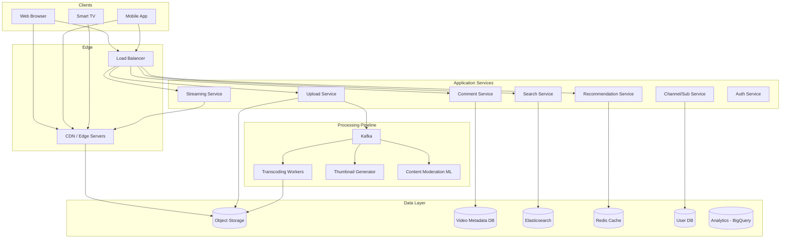
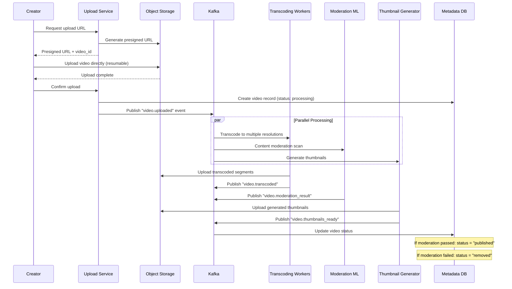
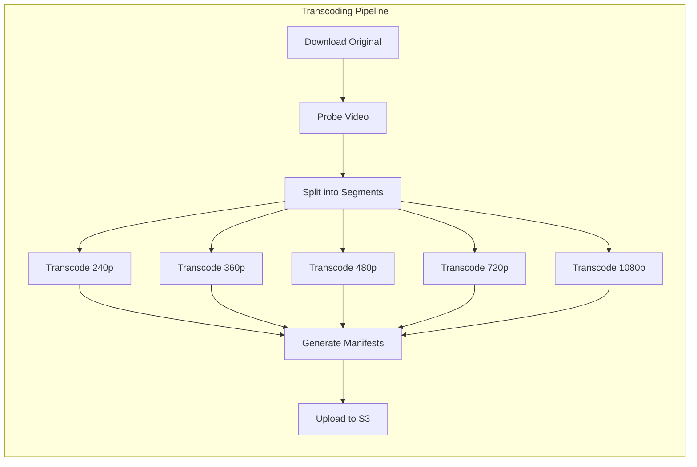
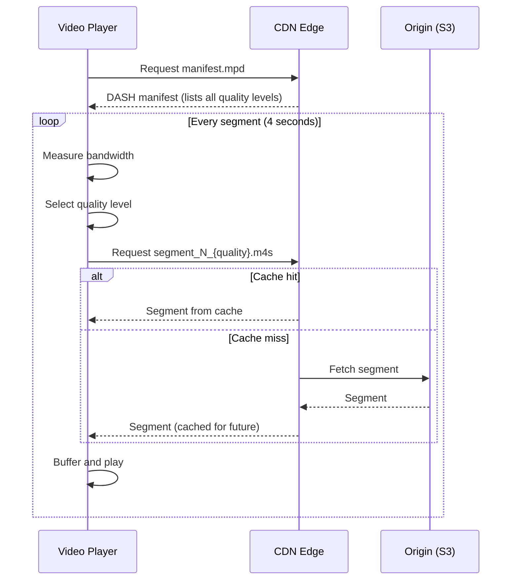
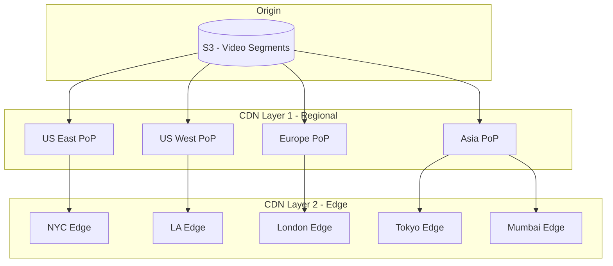
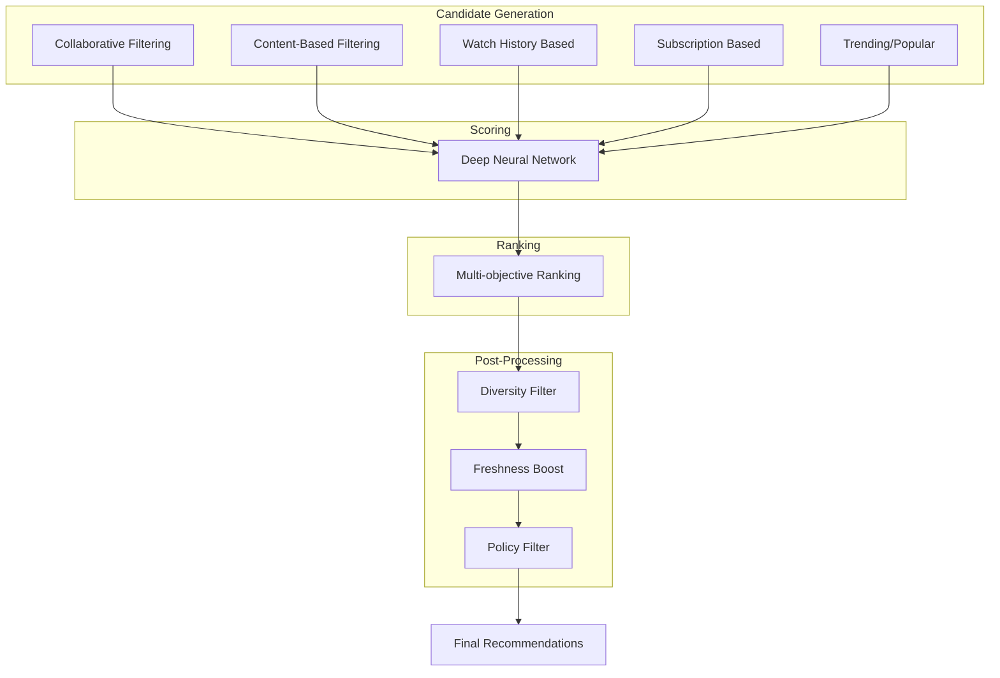
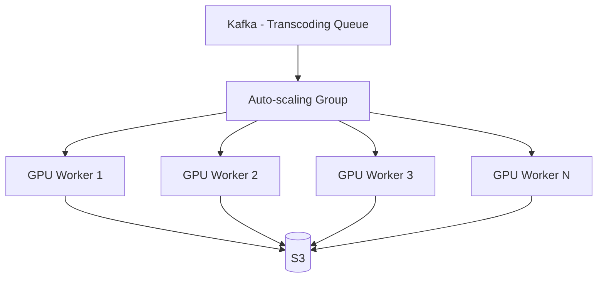

# Design YouTube

YouTube is the world's largest video sharing and streaming platform. Designing it covers the video upload and transcoding pipeline, adaptive bitrate streaming, CDN-based global distribution, recommendation engine, comments, live streaming, and content moderation.

---

## 1. Problem Statement & Requirements

### Functional Requirements

1. **Video upload** — Users can upload videos (up to 12 hours long, multiple formats)
2. **Video streaming** — Users can watch videos with adaptive quality
3. **Search** — Search videos by title, description, tags
4. **Recommendations** — Personalized video recommendations on the home page
5. **Comments** — Users can comment on videos (threaded)
6. **Likes/Dislikes** — Users can react to videos
7. **Subscriptions** — Users can subscribe to channels
8. **Live streaming** — Creators can broadcast live
9. **Content moderation** — Detect and flag policy-violating content

### Non-Functional Requirements

1. **High availability** — 99.99% for streaming; upload can tolerate brief outages
2. **Low latency** — Video playback starts within 2 seconds (p99)
3. **Scale** — 2B monthly users, 800M DAU, 500 hours of video uploaded per minute
4. **Durability** — No uploaded video should ever be lost
5. **Global reach** — Low-latency streaming worldwide via CDN
6. **Cost efficiency** — Storage and bandwidth are the primary costs

### Clarifying Questions

::: tip Questions to Ask
- What video formats and resolutions do we support?
- What is the maximum video length?
- Do we need to support offline downloads?
- Is live streaming in scope?
- How important are recommendations vs chronological feed?
- Do we need to support 4K/8K resolution?
:::

---

## 2. Back-of-Envelope Estimation

### Content Scale

- 800M DAU, 2B monthly active users
- 500 hours of video uploaded per minute = 720,000 hours/day
- Average video length: 5 minutes
- Average watch session: 40 minutes/day

### Storage

**Uploaded video (raw):**
- Average raw video: 5 min at 1080p ~ 600MB

$$
\text{Daily uploads} = \frac{500 \times 60}{5} = 6{,}000 \text{ videos/min} = 8.64M \text{ videos/day}
$$

$$
\text{Daily raw storage} = 8.64M \times 600MB = 5.18 \text{ PB/day}
$$

**Transcoded video (multiple resolutions):**
Each video is stored in ~5 resolutions (240p, 360p, 480p, 720p, 1080p) with different bitrates:

| Resolution | Bitrate | 5 min video size |
|-----------|---------|-----------------|
| 240p | 400 Kbps | 15 MB |
| 360p | 750 Kbps | 28 MB |
| 480p | 1 Mbps | 37.5 MB |
| 720p | 2.5 Mbps | 94 MB |
| 1080p | 5 Mbps | 187 MB |

$$
\text{Per video (all resolutions)} = 15 + 28 + 37.5 + 94 + 187 = 361.5 \text{ MB}
$$

$$
\text{Daily transcoded storage} = 8.64M \times 362MB \approx 3.13 \text{ PB/day}
$$

$$
\text{Annual storage} \approx 3.13 \times 365 \approx 1.14 \text{ EB/year (exabytes)}
$$

### Bandwidth

**Streaming egress:**

$$
\text{Concurrent viewers} = 800M \times \frac{40 \text{ min}}{1440 \text{ min}} \approx 22.2M
$$

$$
\text{Average bitrate} = 2.5 \text{ Mbps}
$$

$$
\text{Total egress} = 22.2M \times 2.5 \text{ Mbps} = 55.5 \text{ Tbps}
$$

This is why YouTube operates its own CDN infrastructure (Google Global Cache).

### QPS

**Video views:**

$$
\text{View QPS} = \frac{800M \times 8 \text{ videos/day}}{86400} \approx 74K \text{ QPS}
$$

**Search:**

$$
\text{Search QPS} \approx \frac{800M \times 3}{86400} \approx 28K \text{ QPS}
$$

---

## 3. High-Level Design



### API Design

```typescript
// Upload video
// POST /api/v1/videos/upload
// Content-Type: multipart/form-data
interface UploadVideoRequest {
  videoFile: File;
  title: string;
  description: string;
  tags: string[];
  category: string;
  visibility: 'public' | 'unlisted' | 'private';
  thumbnail?: File;
}

interface VideoResponse {
  id: string;
  title: string;
  description: string;
  channelId: string;
  channelName: string;
  thumbnailUrl: string;
  duration: number;           // seconds
  viewCount: number;
  likeCount: number;
  dislikeCount: number;
  publishedAt: string;
  status: 'processing' | 'published' | 'failed' | 'removed';
  streamingUrls: {
    dash: string;             // DASH manifest URL
    hls: string;              // HLS manifest URL
  };
}

// Get video stream manifest
// GET /api/v1/videos/:id/manifest.mpd (DASH)
// GET /api/v1/videos/:id/manifest.m3u8 (HLS)

// Search videos
// GET /api/v1/search?q=query&sort=relevance&cursor=xxx&limit=20

// Get recommendations
// GET /api/v1/recommendations?cursor=xxx&limit=20

// Post a comment
// POST /api/v1/videos/:id/comments
interface CommentRequest {
  text: string;
  parentCommentId?: string;  // for replies
}

// Subscribe to channel
// POST /api/v1/channels/:id/subscribe

// Get video analytics (creator dashboard)
// GET /api/v1/analytics/videos/:id
```

---

## 4. Database Schema

### Video Metadata (PostgreSQL, sharded by channel_id)

```sql
CREATE TABLE videos (
    id              UUID PRIMARY KEY DEFAULT gen_random_uuid(),
    channel_id      BIGINT NOT NULL,
    title           VARCHAR(500) NOT NULL,
    description     TEXT,
    category        VARCHAR(50),
    duration        INT,               -- seconds
    original_file_key VARCHAR(500),    -- S3 key for original upload
    status          VARCHAR(20) DEFAULT 'processing',
    visibility      VARCHAR(20) DEFAULT 'public',
    view_count      BIGINT DEFAULT 0,
    like_count      BIGINT DEFAULT 0,
    dislike_count   BIGINT DEFAULT 0,
    comment_count   BIGINT DEFAULT 0,
    thumbnail_url   VARCHAR(500),
    published_at    TIMESTAMP WITH TIME ZONE,
    created_at      TIMESTAMP WITH TIME ZONE DEFAULT NOW(),
    updated_at      TIMESTAMP WITH TIME ZONE DEFAULT NOW()
);

CREATE INDEX idx_videos_channel ON videos(channel_id, created_at DESC);
CREATE INDEX idx_videos_status ON videos(status) WHERE status != 'published';
CREATE INDEX idx_videos_published ON videos(published_at DESC)
    WHERE visibility = 'public' AND status = 'published';

-- Video transcoding outputs
CREATE TABLE video_variants (
    video_id        UUID REFERENCES videos(id),
    resolution      VARCHAR(10),       -- '240p', '360p', '480p', '720p', '1080p', '4k'
    bitrate         INT,               -- Kbps
    codec           VARCHAR(20),       -- 'h264', 'vp9', 'av1'
    file_key        VARCHAR(500),      -- S3 key
    file_size       BIGINT,            -- bytes
    segment_duration INT DEFAULT 4,    -- seconds per segment
    PRIMARY KEY (video_id, resolution, codec)
);

-- Channels
CREATE TABLE channels (
    id              BIGSERIAL PRIMARY KEY,
    user_id         BIGINT UNIQUE NOT NULL,
    name            VARCHAR(100) NOT NULL,
    description     TEXT,
    avatar_url      VARCHAR(500),
    banner_url      VARCHAR(500),
    subscriber_count BIGINT DEFAULT 0,
    video_count     INT DEFAULT 0,
    created_at      TIMESTAMP WITH TIME ZONE DEFAULT NOW()
);

-- Subscriptions
CREATE TABLE subscriptions (
    subscriber_id   BIGINT NOT NULL,
    channel_id      BIGINT NOT NULL,
    notification_level VARCHAR(20) DEFAULT 'personalized', -- 'all', 'personalized', 'none'
    created_at      TIMESTAMP WITH TIME ZONE DEFAULT NOW(),
    PRIMARY KEY (subscriber_id, channel_id)
);

CREATE INDEX idx_subs_channel ON subscriptions(channel_id);

-- Comments
CREATE TABLE comments (
    id              UUID PRIMARY KEY DEFAULT gen_random_uuid(),
    video_id        UUID NOT NULL,
    user_id         BIGINT NOT NULL,
    parent_id       UUID,              -- NULL for top-level comments
    text            TEXT NOT NULL,
    like_count      INT DEFAULT 0,
    reply_count     INT DEFAULT 0,
    is_pinned       BOOLEAN DEFAULT FALSE,
    created_at      TIMESTAMP WITH TIME ZONE DEFAULT NOW()
);

CREATE INDEX idx_comments_video ON comments(video_id, created_at DESC);
CREATE INDEX idx_comments_parent ON comments(parent_id) WHERE parent_id IS NOT NULL;
```

### View Count (Redis + Async Flush)

```
# Real-time view counting in Redis
Key: views:video:{videoId}
Type: HyperLogLog (for unique view counting)

Key: views:video:{videoId}:count
Type: Integer (approximate count, flushed to DB periodically)
```

### Search Index (Elasticsearch)

```typescript
const videoMapping = {
  properties: {
    title: { type: 'text', analyzer: 'standard', boost: 3.0 },
    description: { type: 'text', analyzer: 'standard' },
    tags: { type: 'keyword', boost: 2.0 },
    category: { type: 'keyword' },
    channel_name: { type: 'text', boost: 1.5 },
    channel_id: { type: 'long' },
    published_at: { type: 'date' },
    view_count: { type: 'long' },
    duration: { type: 'integer' },
    language: { type: 'keyword' },
    captions: { type: 'text' },  // Auto-generated captions for search
  }
};
```

---

## 5. Detailed Component Design

### 5.1 Video Upload Pipeline



```typescript
class VideoUploadService {
  async initiateUpload(userId: string, metadata: UploadVideoRequest): Promise<UploadInitiation> {
    const videoId = generateUUID();
    const channel = await this.getChannelByUserId(userId);

    // 1. Create video record in pending state
    await this.db.query(
      `INSERT INTO videos (id, channel_id, title, description, category, visibility, status)
       VALUES ($1, $2, $3, $4, $5, $6, 'uploading')`,
      [videoId, channel.id, metadata.title, metadata.description, metadata.category, metadata.visibility]
    );

    // 2. Generate resumable upload URL
    const uploadKey = `raw/${channel.id}/${videoId}/original`;
    const uploadUrl = await this.s3.createMultipartUpload({
      Bucket: 'youtube-raw-videos',
      Key: uploadKey,
      ContentType: 'video/*',
    });

    return {
      videoId,
      uploadUrl: uploadUrl.UploadId,
      uploadKey,
      maxSizeBytes: 128 * 1024 * 1024 * 1024, // 128GB max
    };
  }

  async confirmUpload(videoId: string, uploadKey: string): Promise<void> {
    // Verify the file exists in S3
    const headResult = await this.s3.headObject({
      Bucket: 'youtube-raw-videos',
      Key: uploadKey,
    });

    // Update video record
    await this.db.query(
      `UPDATE videos SET status = 'processing', original_file_key = $1,
       original_file_size = $2 WHERE id = $3`,
      [uploadKey, headResult.ContentLength, videoId]
    );

    // Publish processing event
    await this.kafka.send('video-processing', {
      key: videoId,
      value: {
        videoId,
        uploadKey,
        fileSize: headResult.ContentLength,
        contentType: headResult.ContentType,
      },
    });
  }
}
```

### 5.2 Video Transcoding Pipeline



```typescript
class TranscodingWorker {
  async transcodeVideo(job: TranscodeJob): Promise<void> {
    const { videoId, uploadKey } = job;

    // 1. Download original to local SSD
    const localPath = `/tmp/transcode/${videoId}/original`;
    await this.s3.download('youtube-raw-videos', uploadKey, localPath);

    // 2. Probe video metadata
    const probe = await this.ffprobe(localPath);
    const { duration, width, height, fps, audioCodec } = probe;

    // 3. Determine target resolutions (don't upscale)
    const targets = this.getTargetResolutions(width, height);

    // 4. Transcode each resolution
    for (const target of targets) {
      const outputDir = `/tmp/transcode/${videoId}/${target.label}`;
      await this.mkdir(outputDir);

      // Transcode to segmented MP4 (for DASH) and TS (for HLS)
      await this.ffmpeg(localPath, {
        resolution: target.resolution,
        bitrate: target.bitrate,
        codec: 'h264',         // Widest compatibility
        segmentDuration: 4,    // 4-second segments
        outputDir,
        format: 'dash',
      });

      // Also transcode to VP9/AV1 for modern browsers (better compression)
      await this.ffmpeg(localPath, {
        resolution: target.resolution,
        bitrate: Math.floor(target.bitrate * 0.7), // VP9 needs 30% less bitrate
        codec: 'vp9',
        segmentDuration: 4,
        outputDir: `${outputDir}_vp9`,
        format: 'dash',
      });

      // Upload segments to S3
      await this.uploadSegments(videoId, target.label, outputDir);
    }

    // 5. Generate DASH and HLS manifests
    await this.generateManifests(videoId, targets);

    // 6. Update video duration
    await this.db.query(
      `UPDATE videos SET duration = $1, status = 'transcoded' WHERE id = $2`,
      [duration, videoId]
    );

    // 7. Cleanup local files
    await this.cleanup(`/tmp/transcode/${videoId}`);
  }

  private getTargetResolutions(width: number, height: number): TranscodeTarget[] {
    const allTargets: TranscodeTarget[] = [
      { label: '240p', resolution: '426x240', bitrate: 400 },
      { label: '360p', resolution: '640x360', bitrate: 750 },
      { label: '480p', resolution: '854x480', bitrate: 1000 },
      { label: '720p', resolution: '1280x720', bitrate: 2500 },
      { label: '1080p', resolution: '1920x1080', bitrate: 5000 },
      { label: '4k', resolution: '3840x2160', bitrate: 15000 },
    ];

    // Don't upscale: filter targets to those <= original resolution
    return allTargets.filter(t => {
      const [tw, th] = t.resolution.split('x').map(Number);
      return tw <= width && th <= height;
    });
  }
}
```

### 5.3 Adaptive Bitrate Streaming (ABR)

Adaptive bitrate streaming adjusts video quality based on the viewer's network conditions:



**DASH Manifest (MPD) example:**

```xml
<!-- Simplified DASH manifest -->
<MPD mediaPresentationDuration="PT5M30S">
  <Period>
    <AdaptationSet mimeType="video/mp4">
      <Representation id="240p" bandwidth="400000" width="426" height="240">
        <SegmentTemplate media="240p/segment_$Number$.m4s"
                        initialization="240p/init.mp4"
                        duration="4000" timescale="1000"/>
      </Representation>
      <Representation id="720p" bandwidth="2500000" width="1280" height="720">
        <SegmentTemplate media="720p/segment_$Number$.m4s"
                        initialization="720p/init.mp4"
                        duration="4000" timescale="1000"/>
      </Representation>
      <Representation id="1080p" bandwidth="5000000" width="1920" height="1080">
        <SegmentTemplate media="1080p/segment_$Number$.m4s"
                        initialization="1080p/init.mp4"
                        duration="4000" timescale="1000"/>
      </Representation>
    </AdaptationSet>
    <AdaptationSet mimeType="audio/mp4">
      <Representation id="audio_128k" bandwidth="128000">
        <SegmentTemplate media="audio/segment_$Number$.m4s"
                        initialization="audio/init.mp4"
                        duration="4000" timescale="1000"/>
      </Representation>
    </AdaptationSet>
  </Period>
</MPD>
```

```typescript
// Client-side ABR algorithm (simplified)
class AdaptiveBitrateSelector {
  private bandwidthHistory: number[] = [];
  private bufferLevel: number = 0; // seconds of buffered content

  selectQuality(availableQualities: Quality[]): Quality {
    // 1. Estimate available bandwidth (weighted moving average)
    const estimatedBandwidth = this.estimateBandwidth();

    // 2. Buffer-based adjustment
    let targetBandwidth = estimatedBandwidth;

    if (this.bufferLevel < 5) {
      // Low buffer — be conservative, pick lower quality
      targetBandwidth *= 0.5;
    } else if (this.bufferLevel > 20) {
      // High buffer — can afford higher quality
      targetBandwidth *= 1.2;
    }

    // 3. Select highest quality that fits within bandwidth
    const sorted = availableQualities.sort((a, b) => b.bitrate - a.bitrate);
    return sorted.find(q => q.bitrate <= targetBandwidth * 0.8) || sorted[sorted.length - 1];
  }

  private estimateBandwidth(): number {
    if (this.bandwidthHistory.length === 0) return 1_000_000; // Default 1 Mbps
    // Weighted moving average (recent measurements weighted higher)
    const weights = this.bandwidthHistory.map((_, i) => Math.pow(0.9, this.bandwidthHistory.length - 1 - i));
    const totalWeight = weights.reduce((a, b) => a + b, 0);
    return this.bandwidthHistory.reduce((sum, bw, i) => sum + bw * weights[i], 0) / totalWeight;
  }
}
```

### 5.4 CDN and Video Delivery



**Two-tier CDN strategy:**
1. **Edge servers** (L2): Serve directly to users. Cache popular content. Thousands of locations.
2. **Regional servers** (L1): Act as mid-tier cache. Reduce origin load. Tens of locations.
3. **Origin** (S3): Source of truth. Only hit on cache misses from L1.

```typescript
// CDN cache warming for trending videos
class CacheWarmingService {
  async warmVideo(videoId: string, regions: string[]): Promise<void> {
    const variants = await this.db.query(
      'SELECT * FROM video_variants WHERE video_id = $1',
      [videoId]
    );

    // Pre-populate edge caches in target regions
    for (const region of regions) {
      for (const variant of variants) {
        // Request the first 10 segments (enough for first 40 seconds)
        for (let i = 0; i < 10; i++) {
          const segmentKey = `${videoId}/${variant.resolution}/segment_${i}.m4s`;
          await this.cdn.prefetch(segmentKey, region);
        }
      }
    }
  }
}
```

### 5.5 View Counting

View counting at YouTube's scale (74K QPS) requires careful design:

```typescript
class ViewCountService {
  async recordView(videoId: string, userId: string | null): Promise<void> {
    // 1. Deduplication: don't count the same user viewing the same video
    //    multiple times in a short window
    if (userId) {
      const dedupKey = `viewed:${videoId}:${userId}`;
      const alreadyViewed = await this.redis.set(dedupKey, '1', 'NX', 'EX', 3600);
      if (!alreadyViewed) return; // Already counted within the last hour
    }

    // 2. Check view validity (minimum watch time: 30 seconds or 50% for short videos)
    // This is tracked client-side and validated server-side

    // 3. Increment counter in Redis (batch flush to DB every minute)
    await this.redis.incr(`views:${videoId}`);

    // 4. Send to Kafka for analytics processing
    await this.kafka.send('view-events', {
      key: videoId,
      value: {
        videoId,
        userId,
        timestamp: Date.now(),
        watchDuration: 0, // Updated later by client heartbeat
        quality: '720p',
        device: 'mobile',
        country: 'US',
      },
    });
  }
}

// Background worker: flush Redis counters to DB
class ViewCountFlusher {
  async flush(): Promise<void> {
    // Run every 60 seconds
    const keys = await this.redis.keys('views:*');

    for (const key of keys) {
      const videoId = key.split(':')[1];
      const count = await this.redis.getdel(key);

      if (count && parseInt(count) > 0) {
        await this.db.query(
          'UPDATE videos SET view_count = view_count + $1 WHERE id = $2',
          [parseInt(count), videoId]
        );
      }
    }
  }
}
```

### 5.6 Recommendation Engine



```typescript
class RecommendationService {
  async getRecommendations(userId: string, limit: number = 20): Promise<Video[]> {
    // 1. Generate candidates from multiple sources (aim for ~1000 candidates)
    const [collaborative, contentBased, subscriptions, trending] = await Promise.all([
      this.collaborativeFilter(userId, 300),
      this.contentBasedFilter(userId, 300),
      this.subscriptionBased(userId, 200),
      this.trending(200),
    ]);

    let candidates = this.deduplicateAndMerge(
      collaborative, contentBased, subscriptions, trending
    );

    // 2. Remove already watched
    const watchHistory = await this.getRecentWatchHistory(userId, 1000);
    const watchedSet = new Set(watchHistory.map(v => v.videoId));
    candidates = candidates.filter(v => !watchedSet.has(v.id));

    // 3. Score each candidate using ML model
    const userFeatures = await this.getUserFeatures(userId);
    const scored = candidates.map(video => ({
      video,
      score: this.predictEngagement(userFeatures, video),
    }));

    // 4. Multi-objective ranking (engagement vs satisfaction vs diversity)
    const ranked = this.multiObjectiveRank(scored);

    // 5. Apply diversity constraints
    return this.applyDiversity(ranked, limit);
  }

  private predictEngagement(user: UserFeatures, video: Video): number {
    // Simplified scoring — real systems use deep learning
    let score = 0;

    // Click-through rate prediction
    score += this.ctrModel.predict(user, video) * 0.4;

    // Watch time prediction
    score += this.watchTimeModel.predict(user, video) * 0.4;

    // Satisfaction prediction (likes, shares)
    score += this.satisfactionModel.predict(user, video) * 0.2;

    return score;
  }
}
```

### 5.7 Content Moderation

```typescript
class ContentModerationPipeline {
  async moderateVideo(videoId: string, videoKey: string): Promise<ModerationResult> {
    // 1. Extract key frames (1 frame per second)
    const frames = await this.extractKeyFrames(videoKey);

    // 2. Audio transcription
    const transcript = await this.speechToText(videoKey);

    // 3. Run visual analysis on key frames
    const visualResults = await Promise.all(
      frames.map(frame => this.visualModerationModel.classify(frame))
    );

    // 4. Run text analysis on title, description, transcript
    const textResult = await this.textModerationModel.classify({
      title: await this.getVideoTitle(videoId),
      description: await this.getVideoDescription(videoId),
      transcript,
    });

    // 5. Aggregate results
    const overallScore = this.aggregateScores(visualResults, textResult);

    if (overallScore.severity === 'critical') {
      // Auto-remove
      await this.removeVideo(videoId, 'auto_moderation');
      return { action: 'removed', reason: overallScore.categories };
    }

    if (overallScore.severity === 'high') {
      // Queue for human review
      await this.queueForReview(videoId, overallScore);
      return { action: 'pending_review', reason: overallScore.categories };
    }

    if (overallScore.severity === 'medium') {
      // Age-restrict
      await this.ageRestrict(videoId);
      return { action: 'age_restricted', reason: overallScore.categories };
    }

    return { action: 'approved' };
  }
}
```

### 5.8 Live Streaming

```mermaid
graph LR
    subgraph "Ingest"
        Streamer[Streamer / OBS] -->|RTMP| Ingest[Ingest Server]
    end

    subgraph "Processing"
        Ingest --> TC[Live Transcoder]
        TC --> Seg[Segmenter - 2s chunks]
    end

    subgraph "Distribution"
        Seg --> Origin[Origin Server]
        Origin --> CDN1[CDN Edge 1]
        Origin --> CDN2[CDN Edge 2]
        Origin --> CDNN[CDN Edge N]
    end

    subgraph "Viewers"
        CDN1 --> V1[Viewer 1]
        CDN1 --> V2[Viewer 2]
        CDN2 --> V3[Viewer 3]
        CDNN --> VN[Viewer N]
    end
```

```typescript
class LiveStreamService {
  async startStream(channelId: string): Promise<StreamInfo> {
    const streamKey = crypto.randomBytes(32).toString('hex');
    const streamId = generateUUID();

    // Assign an ingest server (closest to the streamer)
    const ingestServer = await this.assignIngestServer(channelId);

    await this.db.query(
      `INSERT INTO live_streams (id, channel_id, stream_key, ingest_server, status)
       VALUES ($1, $2, $3, $4, 'waiting')`,
      [streamId, channelId, streamKey, ingestServer.hostname]
    );

    return {
      streamId,
      rtmpUrl: `rtmp://${ingestServer.hostname}/live`,
      streamKey,
    };
  }

  // Called by ingest server when RTMP connection is established
  async onStreamConnected(streamId: string): Promise<void> {
    await this.db.query(
      `UPDATE live_streams SET status = 'live', started_at = NOW() WHERE id = $1`,
      [streamId]
    );

    // Notify subscribers
    await this.kafka.send('notifications', {
      key: streamId,
      value: {
        type: 'channel_live',
        channelId: await this.getChannelId(streamId),
      },
    });
  }
}
```

**Live streaming latency targets:**

| Mode | Latency | Technology |
|------|---------|-----------|
| Normal | 15-30 seconds | HLS/DASH with 6s segments |
| Low latency | 3-5 seconds | LL-HLS/LL-DASH with 1-2s segments |
| Ultra-low latency | < 1 second | WebRTC |

---

## 6. Scaling & Bottlenecks

### What Breaks First?

| Scale | Bottleneck | Solution |
|-------|-----------|----------|
| 1M videos | Transcoding capacity | Auto-scaling transcoding workers |
| 10M videos | Storage cost | Multi-tier storage (hot/warm/cold) |
| 100M videos | CDN egress cost | Build own CDN (Google Global Cache) |
| 1B+ videos | Search/recommendation latency | Dedicated ML infrastructure |
| 55 Tbps egress | CDN capacity | Embed cache servers in ISPs |

### Transcoding Scaling



- Use spot/preemptible GPU instances for transcoding (70% cheaper)
- Auto-scale based on queue depth
- Priority queue: monetized channels get priority transcoding
- Hardware acceleration: NVENC on NVIDIA GPUs, or dedicated ASIC transcoders

### Database Scaling

```
Videos table:
  Shard by channel_id (user's videos co-located)
  16 shards, each with 2 read replicas
  ~500M videos per shard

Comments table:
  Shard by video_id (all comments for a video co-located)
  32 shards (comments are write-heavy)

View counts:
  Redis cluster (16 nodes) for real-time counts
  Batch flush to DB every 60 seconds
```

### CDN Cost Optimization

At 55 Tbps egress, CDN bandwidth is the largest expense:

1. **ISP cache embedding:** Place cache servers inside ISP networks (Google Global Cache / Netflix Open Connect)
2. **Codec efficiency:** VP9 reduces bandwidth by 30% vs H.264; AV1 reduces by 50%
3. **Quality adaptation:** Don't serve 1080p to users on 3G networks
4. **Off-peak pre-fetching:** Pre-populate caches during low-traffic hours
5. **Smart caching:** Cache popular videos at edge, rare videos at regional level only

---

## 7. Trade-offs & Alternatives

### Video Codec Comparison

| Codec | Quality | Compression | Encode Speed | Decode Support |
|-------|---------|-------------|-------------|----------------|
| H.264/AVC | Good | Baseline | Fast | Universal |
| H.265/HEVC | Better | 40% better than H.264 | Slow | Moderate |
| VP9 | Better | 30% better than H.264 | Slow | Chrome, Android |
| AV1 | Best | 50% better than H.264 | Very slow | Growing |

**Strategy:** Encode in H.264 (universal) + VP9/AV1 (for modern browsers). Serve the most efficient codec the client supports.

### Storage: S3 vs Custom

| Aspect | S3 (Cloud) | Custom (HDFS/Ceph) |
|--------|-----------|-------------------|
| Durability | 99.999999999% | Depends on config |
| Cost at scale | Expensive | Cheaper per GB |
| Operations | Zero | Significant |
| Latency | Variable | Predictable |
| **Verdict** | Good for < 1 PB | Better for > 10 PB |

YouTube uses a custom storage system (Colossus) because S3 costs would be prohibitive at exabyte scale.

### Streaming Protocol Comparison

| Protocol | Latency | Compatibility | ABR | DRM |
|----------|---------|---------------|-----|-----|
| HLS | 15-30s | Universal | Yes | Yes |
| DASH | 15-30s | Most browsers | Yes | Yes |
| LL-HLS | 2-5s | Apple ecosystem | Yes | Yes |
| WebRTC | < 1s | Browsers | Limited | No |

**Decision:** DASH primary (open standard) + HLS for Apple devices. WebRTC only for ultra-low-latency use cases.

---

## 8. Advanced Topics

### 8.1 Thumbnail Generation

```typescript
class ThumbnailGenerator {
  async generateThumbnails(videoId: string, videoKey: string): Promise<string[]> {
    // 1. Extract frames at regular intervals
    const frames = await this.extractFrames(videoKey, { interval: 5 }); // Every 5 seconds

    // 2. Score each frame for visual quality
    const scored = await Promise.all(
      frames.map(async (frame, index) => ({
        frame,
        index,
        score: await this.scoreFrame(frame),
      }))
    );

    // 3. Select top 3 frames as thumbnail candidates
    scored.sort((a, b) => b.score - a.score);
    const topFrames = scored.slice(0, 3);

    // 4. Generate multiple sizes for each candidate
    const thumbnailUrls: string[] = [];
    for (const { frame, index } of topFrames) {
      const sizes = [
        { width: 320, height: 180, suffix: 'default' },
        { width: 480, height: 360, suffix: 'hq' },
        { width: 1280, height: 720, suffix: 'maxres' },
      ];

      for (const size of sizes) {
        const resized = await sharp(frame).resize(size.width, size.height).jpeg({ quality: 85 }).toBuffer();
        const key = `thumbnails/${videoId}/${index}_${size.suffix}.jpg`;
        await this.s3.putObject(key, resized);
        thumbnailUrls.push(`https://cdn.youtube.com/${key}`);
      }
    }

    return thumbnailUrls;
  }

  private async scoreFrame(frame: Buffer): Promise<number> {
    // Score based on:
    // - Sharpness (Laplacian variance)
    // - Face detection (frames with faces score higher)
    // - Color saturation
    // - Brightness (not too dark, not too bright)
    // - Text detection (frames with text can be informative)
    const sharpness = await this.measureSharpness(frame);
    const hasFace = await this.detectFace(frame);
    const saturation = await this.measureSaturation(frame);

    return sharpness * 0.3 + (hasFace ? 30 : 0) + saturation * 0.2;
  }
}
```

### 8.2 Video Analytics (Creator Dashboard)

```typescript
class VideoAnalyticsService {
  async getVideoAnalytics(videoId: string, dateRange: DateRange): Promise<VideoAnalytics> {
    // Query from analytics TSDB (BigQuery / ClickHouse)
    const [views, watchTime, demographics, traffic, retention] = await Promise.all([
      this.analyticsDB.query(`
        SELECT date, COUNT(*) as views
        FROM view_events
        WHERE video_id = @videoId AND date BETWEEN @start AND @end
        GROUP BY date ORDER BY date
      `, { videoId, start: dateRange.start, end: dateRange.end }),

      this.analyticsDB.query(`
        SELECT SUM(watch_duration_seconds) as total_watch_time,
               AVG(watch_duration_seconds) as avg_watch_time,
               AVG(watch_duration_seconds / video_duration_seconds) as avg_percentage_watched
        FROM view_events WHERE video_id = @videoId
      `, { videoId }),

      this.analyticsDB.query(`
        SELECT country, age_group, gender, COUNT(*) as views
        FROM view_events WHERE video_id = @videoId
        GROUP BY country, age_group, gender
      `, { videoId }),

      this.analyticsDB.query(`
        SELECT traffic_source, COUNT(*) as views
        FROM view_events WHERE video_id = @videoId
        GROUP BY traffic_source
      `, { videoId }),

      this.getRetentionCurve(videoId),
    ]);

    return { views, watchTime, demographics, traffic, retention };
  }

  // Retention curve: what percentage of viewers are still watching at each second
  private async getRetentionCurve(videoId: string): Promise<RetentionPoint[]> {
    return this.analyticsDB.query(`
      SELECT
        second_bucket,
        COUNT(*) as viewers_remaining,
        COUNT(*) / MAX(total_views) as retention_pct
      FROM (
        SELECT
          FLOOR(watch_duration_seconds / 5) * 5 as second_bucket,
          COUNT(*) OVER () as total_views
        FROM view_events
        WHERE video_id = @videoId
      )
      GROUP BY second_bucket
      ORDER BY second_bucket
    `, { videoId });
  }
}
```

### 8.3 Copyright Detection (Content ID)

```typescript
class ContentIdService {
  // When a video is uploaded, check against the fingerprint database
  async checkCopyright(videoId: string, audioPath: string, videoPath: string): Promise<CopyrightMatch[]> {
    // 1. Generate audio fingerprint (similar to Shazam)
    const audioFingerprint = await this.generateAudioFingerprint(audioPath);

    // 2. Generate visual fingerprint (perceptual hashing of key frames)
    const visualFingerprint = await this.generateVisualFingerprint(videoPath);

    // 3. Search fingerprint database
    const audioMatches = await this.fingerprintDB.search(audioFingerprint, 'audio');
    const visualMatches = await this.fingerprintDB.search(visualFingerprint, 'visual');

    // 4. Return matches with confidence scores
    return [...audioMatches, ...visualMatches].filter(m => m.confidence > 0.8);
  }
}
```

---

## 9. Interview Tips

### What Interviewers Look For

1. **Upload pipeline understanding** — Can you describe the end-to-end flow from upload to playable video?
2. **Transcoding knowledge** — Do you understand why multiple resolutions and codecs are needed?
3. **ABR streaming** — Can you explain adaptive bitrate and how DASH/HLS work?
4. **CDN strategy** — Why is CDN critical and how do you optimize cache hit rates?
5. **Scale estimation** — Can you calculate storage and bandwidth at YouTube's scale?

### Common Follow-Up Questions

::: details "How do you handle a viral video that gets 100M views in an hour?"
Pre-warm CDN caches for trending videos. The CDN absorbs the read load — the origin servers are barely touched. Monitor cache hit rates and proactively push content to edge servers in regions with high viewership. The video is already transcoded and segmented, so no additional processing is needed.
:::

::: details "How do you prevent copyright infringement?"
Content ID system: generate audio and visual fingerprints for every uploaded video and compare against a database of copyrighted material. Rights holders can choose to block, monetize (ads), or track matching content. This happens during the transcoding pipeline before the video is published.
:::

::: details "How do you reduce storage costs?"
Multi-tier storage (hot/warm/cold). Videos not viewed in 90 days move to cheaper storage. Codec efficiency (AV1 cuts storage by 50% vs H.264). Deduplication of identical re-uploads. Delete lowest-quality variants for very old videos with low view counts.
:::

::: details "How does live streaming differ from VOD?"
Live streaming requires real-time transcoding (no time for multi-pass encoding), shorter segment durations (1-2s for low latency vs 4-6s for VOD), and a real-time ingest pipeline (RTMP from broadcaster to server). The biggest challenge is scaling to millions of concurrent viewers with low latency — this requires extensive CDN pre-positioning and efficient segment caching.
:::

::: details "How do you count views accurately at 74K QPS?"
Use HyperLogLog in Redis for approximate unique counting. Batch view events through Kafka into an analytics database. Apply fraud detection to filter bot views. A view is only counted after minimum watch time (30 seconds or 50% of the video, whichever is shorter).
:::

### Time Allocation (45-minute interview)

| Phase | Time | Focus |
|-------|------|-------|
| Requirements | 4 min | Core features, clarify scope (live streaming?) |
| Estimation | 4 min | Storage (PB/day), bandwidth (Tbps), QPS |
| High-level design | 10 min | Upload + streaming paths, CDN |
| Upload/transcoding pipeline | 10 min | Resumable upload, multi-resolution, codecs |
| Streaming + ABR | 7 min | DASH/HLS, segment-based, quality adaptation |
| CDN + delivery | 5 min | Multi-tier CDN, cache warming, ISP embedding |
| Scaling | 5 min | Transcoding workers, storage tiers, costs |

::: info War Story
YouTube processes over 500 hours of video per minute. Their transcoding pipeline uses custom hardware (TPUs and ASICs) for common codecs. A single video might produce 20+ variants (5 resolutions x 2 codecs x 2 container formats). The total compute cost of transcoding is staggering — estimated at hundreds of millions of dollars per year in infrastructure. This is why YouTube invested heavily in AV1: the 50% bandwidth savings across billions of video views translates to billions of dollars in CDN cost savings annually, far exceeding the additional encoding cost.
:::

---

## Summary

| Component | Technology | Scale |
|-----------|-----------|-------|
| Video Storage | Custom (Colossus) or S3 | ~1 EB/year |
| Transcoding | GPU workers (auto-scaled) | 8.64M videos/day |
| Streaming | DASH + HLS (ABR) | 55 Tbps egress |
| CDN | Google Global Cache / CloudFront | 400+ edge locations |
| Metadata | PostgreSQL (sharded) | ~10B video records |
| Search | Elasticsearch | 28K QPS |
| Recommendations | Custom ML pipeline | 74K QPS |
| View Counting | Redis + Kafka + BigQuery | 74K QPS |
| Content Moderation | ML pipeline + human review | Every upload |
| Live Streaming | RTMP ingest + LL-HLS | < 5s latency |
