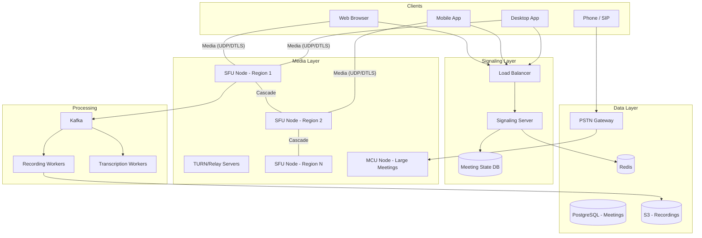
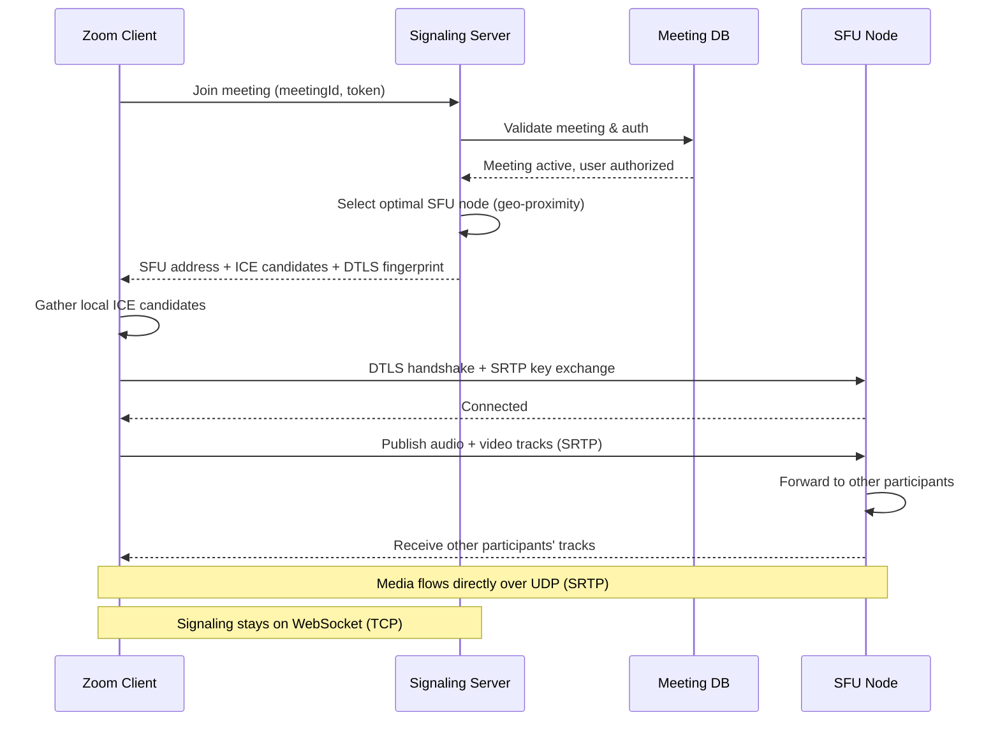
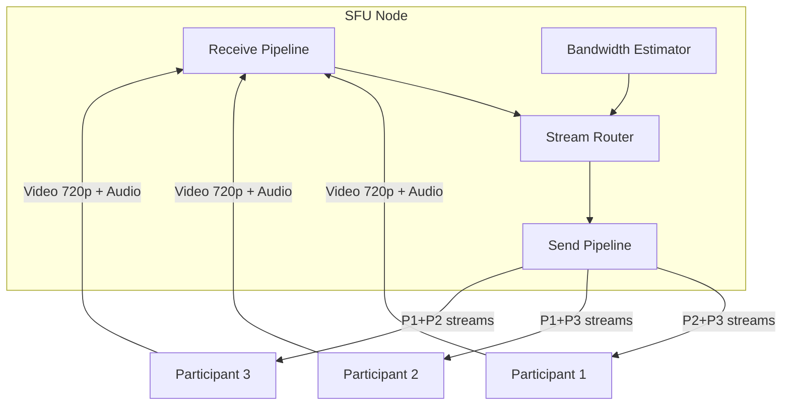
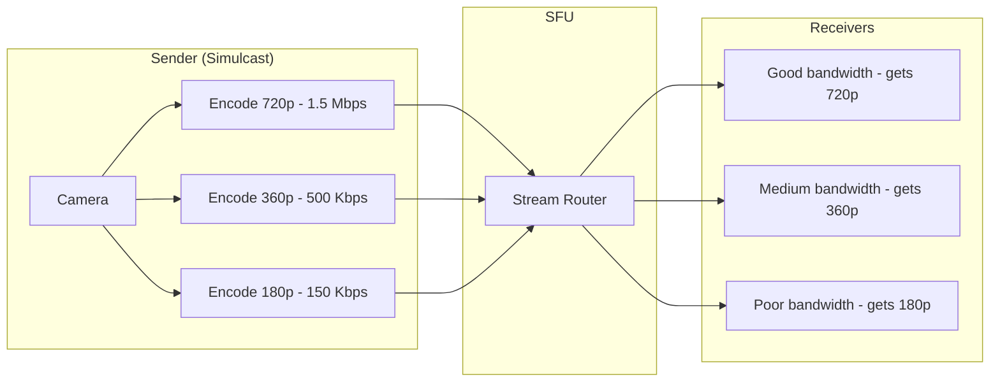
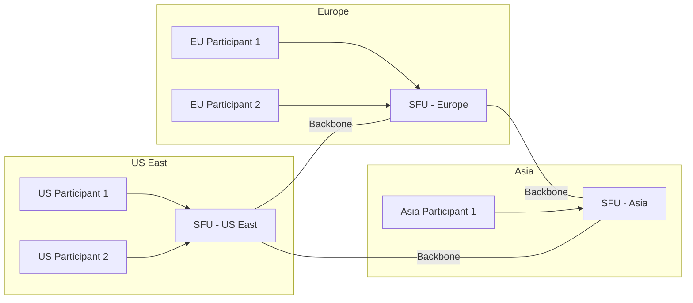
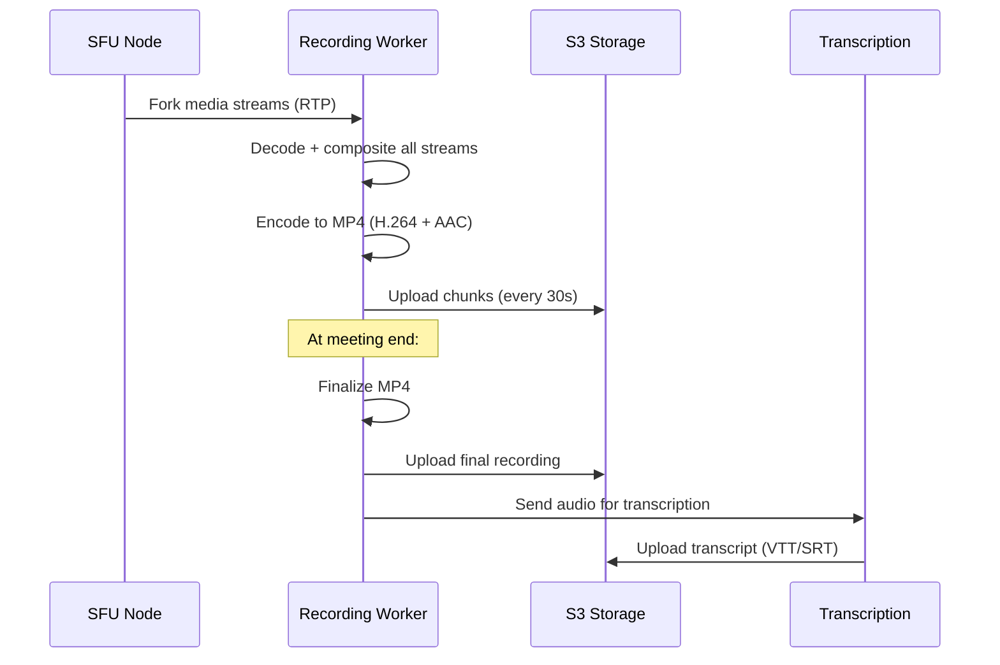
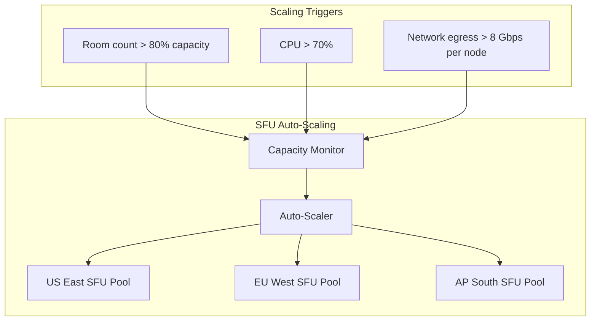

# Design Zoom

Zoom is a video conferencing platform supporting 1:1 calls, group meetings with hundreds of participants, screen sharing, recording, and virtual backgrounds. Designing it covers WebRTC media transport, SFU (Selective Forwarding Unit) vs MCU (Multipoint Control Unit) architectures, adaptive bitrate for video, signaling servers, and global low-latency media relay infrastructure.

---

## 1. Requirements Clarification

### Functional Requirements

1. **1:1 video calls** — Direct peer-to-peer or server-relayed video and audio
2. **Group meetings** — Up to 1,000 participants with video, 10,000 view-only
3. **Screen sharing** — Share screen, application window, or specific tab
4. **Chat** — In-meeting text chat with file sharing
5. **Recording** — Cloud and local recording of meetings
6. **Virtual backgrounds** — Real-time background replacement
7. **Scheduling** — Schedule meetings with calendar integration
8. **Waiting room** — Host controls who can join
9. **Breakout rooms** — Split meeting into smaller groups
10. **Reactions & hand raise** — Non-verbal participant feedback

### Non-Functional Requirements

1. **Ultra-low latency** — End-to-end video latency < 150ms for good interactivity
2. **High availability** — 99.99% for meeting join and media relay
3. **Scale** — 300M daily meeting participants, 3.3T annual meeting minutes
4. **Adaptive quality** — Adjust video quality based on network conditions
5. **Global reach** — Low-latency media routing across all continents
6. **Security** — End-to-end encryption option, meeting passwords, waiting rooms

### Clarifying Questions

::: tip Questions to Ask
- What is the maximum number of video-on participants?
- Do we need to support dial-in phone participants?
- Should recording support live transcription?
- What video resolutions should we target (720p, 1080p, 4K)?
- Do we need HIPAA compliance for healthcare meetings?
- Should we support webinar mode (view-only attendees)?
:::

---

## 2. Back-of-the-Envelope Estimation

### Traffic

- 300M daily meeting participants
- Average meeting duration: 45 minutes
- Average participants per meeting: 8
- Concurrent meetings at peak: ~10M

$$
\text{Daily meetings} = \frac{300M}{8} = 37.5M \text{ meetings/day}
$$

$$
\text{Meeting start QPS} = \frac{37.5M}{86400} \approx 434 \text{ QPS}
$$

$$
\text{Peak meeting starts} = 434 \times 5 = 2{,}170 \text{ QPS}
$$

$$
\text{Concurrent participants (peak)} = 300M \times \frac{45}{1440} \approx 9.4M
$$

### Bandwidth

**Per participant (sending):**
- Video: 720p at 1.5 Mbps
- Audio: Opus at 32 Kbps
- Total per sender: ~1.5 Mbps up

**SFU bandwidth for an 8-person meeting:**

$$
\text{Each participant receives} = 7 \times 1.5 \text{ Mbps} = 10.5 \text{ Mbps down}
$$

$$
\text{SFU ingress per meeting} = 8 \times 1.5 = 12 \text{ Mbps}
$$

$$
\text{SFU egress per meeting} = 8 \times 7 \times 1.5 = 84 \text{ Mbps}
$$

**Total platform bandwidth at peak:**

$$
\text{Total egress} \approx 9.4M \times 10.5 \text{ Mbps} \approx 98.7 \text{ Pbps (petabits/sec)}
$$

::: warning
This is a staggering number. In practice, not all participants have video on, Simulcast reduces bandwidth, and most traffic stays within regional data centers. Realistic peak egress is closer to 10-20 Pbps.
:::

### Storage (Recordings)

- 10% of meetings are recorded, average 45 min at 720p (~500 MB)

$$
\text{Daily recording storage} = 37.5M \times 0.1 \times 500 \text{ MB} = 1.875 \text{ PB/day}
$$

---

## 3. High-Level Design



---

## 4. Detailed Design

### 4.1 Signaling: Meeting Join Flow



```typescript
class SignalingServer {
  async handleJoin(ws: WebSocket, request: JoinRequest): Promise<void> {
    const { meetingId, userId, token } = request;

    // 1. Authenticate and authorize
    const meeting = await this.meetingService.getMeeting(meetingId);
    if (!meeting) throw new Error('Meeting not found');
    await this.auth.validateToken(token, userId);

    // 2. Check waiting room
    if (meeting.waitingRoom && !meeting.isHost(userId)) {
      await this.addToWaitingRoom(meetingId, userId);
      ws.send(JSON.stringify({ type: 'waiting_room', message: 'Host will let you in' }));
      return;
    }

    // 3. Select SFU node (closest to participant with available capacity)
    const clientRegion = this.geolocate(ws.remoteAddress);
    const sfuNode = await this.selectSFU(meetingId, clientRegion);

    // 4. Register participant in meeting state
    await this.meetingService.addParticipant(meetingId, {
      userId,
      sfuNodeId: sfuNode.id,
      joinedAt: Date.now(),
    });

    // 5. Send SFU connection details
    ws.send(JSON.stringify({
      type: 'sfu_offer',
      sfuAddress: sfuNode.address,
      sfuPort: sfuNode.port,
      iceServers: this.getIceServers(clientRegion),
      dtlsFingerprint: sfuNode.dtlsFingerprint,
      participantId: userId,
      existingParticipants: await this.meetingService.getParticipants(meetingId),
    }));

    // 6. Notify other participants
    this.broadcastToMeeting(meetingId, {
      type: 'participant_joined',
      participant: { userId, displayName: await this.getDisplayName(userId) },
    });
  }

  private async selectSFU(meetingId: string, clientRegion: string): Promise<SFUNode> {
    // Check if meeting already has an assigned SFU
    const existingSfu = await this.cache.get(`meeting:${meetingId}:sfu`);
    if (existingSfu) {
      const node = JSON.parse(existingSfu);
      // If participant is in same region, use same SFU
      if (node.region === clientRegion) return node;
      // If different region, use cascaded SFU
      return this.getOrCreateCascadeSFU(meetingId, clientRegion, node);
    }

    // Assign SFU with lowest load in the participant's region
    const sfuNodes = await this.getSFUNodes(clientRegion);
    const selected = sfuNodes.sort((a, b) => a.load - b.load)[0];
    await this.cache.set(`meeting:${meetingId}:sfu`, JSON.stringify(selected), 'EX', 86400);
    return selected;
  }
}
```

### 4.2 SFU Architecture (Selective Forwarding Unit)

The SFU receives media from each participant and selectively forwards it to others. This is far more scalable than an MCU which decodes and re-encodes all streams.



```typescript
class SFUNode {
  private rooms: Map<string, Room> = new Map();

  async onMediaTrack(participantId: string, track: MediaTrack): Promise<void> {
    const room = this.getRoom(participantId);

    // 1. Register the track
    room.addTrack(participantId, track);

    // 2. If Simulcast, register all layers
    if (track.simulcast) {
      // Simulcast: sender encodes 3 qualities simultaneously
      // High (720p), Medium (360p), Low (180p)
      for (const layer of track.simulcastLayers) {
        room.addSimulcastLayer(participantId, track.id, layer);
      }
    }

    // 3. Forward to all other participants (select appropriate quality)
    for (const recipient of room.getOtherParticipants(participantId)) {
      const selectedLayer = this.selectLayer(recipient, track);
      await this.forwardTrack(track, selectedLayer, recipient);
    }
  }

  private selectLayer(recipient: Participant, track: MediaTrack): SimulcastLayer {
    // Select quality based on:
    // 1. Recipient's available bandwidth (REMB feedback)
    // 2. Video layout (speaker view vs gallery view)
    // 3. Whether recipient has this video visible

    const bw = recipient.estimatedBandwidth;
    const isActiveSpeaker = track.participantId === recipient.currentSpeaker;
    const isVisible = recipient.visibleParticipants.has(track.participantId);

    if (!isVisible) {
      return 'none'; // Don't forward video for off-screen participants
    }

    if (isActiveSpeaker) {
      return 'high'; // Full quality for active speaker
    }

    if (bw > 2_000_000) return 'medium';  // > 2 Mbps: medium quality for gallery
    return 'low';                           // Low bandwidth: thumbnail quality
  }
}
```

### 4.3 Simulcast & Adaptive Quality



**Why Simulcast over SVC (Scalable Video Coding)?**

| Feature | Simulcast | SVC |
|---------|-----------|-----|
| Encoder complexity | Low (standard H.264) | High (special codec support) |
| Bandwidth overhead | 1.5x (three full streams) | 1.2x (layered encoding) |
| Browser support | Universal | Limited |
| Flexibility | Switch layers instantly | Drop layers at any point |
| **Verdict** | Industry standard for WebRTC | Better in theory, limited adoption |

### 4.4 SFU Cascading (Multi-Region)

For meetings with participants across multiple regions, cascading SFUs minimize latency.



- Each participant connects to the nearest SFU
- SFUs exchange media streams over a private backbone (lower latency than public internet)
- Only one copy of each stream traverses the backbone between regions
- Total inter-region bandwidth: $N_{regions} \times P_{streams}$ instead of $P_{total}^2$

### 4.5 Screen Sharing

```typescript
class ScreenShareService {
  async startScreenShare(participantId: string, roomId: string): Promise<void> {
    // 1. Screen capture uses different encoding settings than camera
    const screenTrack: MediaTrack = {
      type: 'screen',
      codec: 'VP9',                    // Better for screen content (sharp text)
      maxBitrate: 3_000_000,           // 3 Mbps for 1080p screen
      maxFramerate: 15,                // 15 fps (screens don't need 30 fps)
      contentHint: 'detail',           // Prioritize sharpness over smoothness
      simulcast: false,                // Single high-quality layer
    };

    // 2. Notify SFU to prioritize screen share
    const room = this.sfuNode.getRoom(roomId);
    room.setScreenShare(participantId, screenTrack);

    // 3. All participants receive screen share at full quality
    // Camera feeds drop to lower quality to save bandwidth
    for (const recipient of room.getOtherParticipants(participantId)) {
      await this.sfuNode.forwardTrack(screenTrack, 'high', recipient);
      // Reduce camera video quality for all participants
      this.sfuNode.setCameraQuality(recipient.id, 'low');
    }
  }
}
```

### 4.6 Recording



---

## 5. Data Model

```sql
-- Meetings
CREATE TABLE meetings (
    id              UUID PRIMARY KEY DEFAULT gen_random_uuid(),
    host_user_id    BIGINT NOT NULL,
    topic           VARCHAR(500),
    password_hash   VARCHAR(255),
    meeting_type    VARCHAR(20) DEFAULT 'instant', -- instant, scheduled, recurring
    scheduled_start TIMESTAMP WITH TIME ZONE,
    scheduled_end   TIMESTAMP WITH TIME ZONE,
    actual_start    TIMESTAMP WITH TIME ZONE,
    actual_end      TIMESTAMP WITH TIME ZONE,
    max_participants INT DEFAULT 100,
    waiting_room    BOOLEAN DEFAULT FALSE,
    e2e_encryption  BOOLEAN DEFAULT FALSE,
    recording_mode  VARCHAR(20) DEFAULT 'none',   -- none, cloud, local
    status          VARCHAR(20) DEFAULT 'scheduled',
    created_at      TIMESTAMP WITH TIME ZONE DEFAULT NOW()
);

CREATE INDEX idx_meetings_host ON meetings(host_user_id, scheduled_start);
CREATE INDEX idx_meetings_status ON meetings(status) WHERE status = 'active';

-- Meeting Participants (for active meeting state, stored in Redis)
-- Persisted to DB after meeting ends for analytics

CREATE TABLE meeting_participants (
    meeting_id      UUID NOT NULL,
    user_id         BIGINT NOT NULL,
    display_name    VARCHAR(100),
    joined_at       TIMESTAMP WITH TIME ZONE,
    left_at         TIMESTAMP WITH TIME ZONE,
    duration_sec    INT,
    sfu_node_id     VARCHAR(100),
    region          VARCHAR(20),
    PRIMARY KEY (meeting_id, user_id, joined_at)
);

CREATE INDEX idx_participants_meeting ON meeting_participants(meeting_id);

-- Recordings
CREATE TABLE recordings (
    id              UUID PRIMARY KEY DEFAULT gen_random_uuid(),
    meeting_id      UUID NOT NULL,
    s3_key          VARCHAR(500),
    duration_sec    INT,
    file_size_bytes BIGINT,
    format          VARCHAR(20) DEFAULT 'mp4',
    transcript_key  VARCHAR(500),
    status          VARCHAR(20) DEFAULT 'processing',
    created_at      TIMESTAMP WITH TIME ZONE DEFAULT NOW()
);

CREATE INDEX idx_recordings_meeting ON recordings(meeting_id);

-- SFU Node Registry (managed by orchestrator, refreshed via heartbeat)
CREATE TABLE sfu_nodes (
    id              VARCHAR(100) PRIMARY KEY,
    region          VARCHAR(20) NOT NULL,
    address         VARCHAR(255) NOT NULL,
    port            INT NOT NULL,
    capacity        INT DEFAULT 500,       -- max concurrent rooms
    current_load    INT DEFAULT 0,
    dtls_fingerprint VARCHAR(255),
    last_heartbeat  TIMESTAMP WITH TIME ZONE,
    status          VARCHAR(20) DEFAULT 'active'
);

CREATE INDEX idx_sfu_region ON sfu_nodes(region, status, current_load);
```

---

## 6. API Design

```typescript
// Create/Schedule meeting
// POST /api/v1/meetings
interface CreateMeetingRequest {
  topic: string;
  type: 'instant' | 'scheduled' | 'recurring';
  scheduledStart?: string;  // ISO 8601
  duration?: number;        // minutes
  password?: string;
  settings: {
    waitingRoom: boolean;
    muteOnEntry: boolean;
    allowScreenShare: 'host' | 'all';
    recording: 'none' | 'cloud' | 'local';
    e2eEncryption: boolean;
    maxParticipants: number;
  };
}

interface MeetingResponse {
  id: string;
  joinUrl: string;
  hostKey: string;
  password?: string;
  dialInNumbers: DialInNumber[];
}

// Join meeting
// POST /api/v1/meetings/:id/join
interface JoinMeetingRequest {
  displayName: string;
  password?: string;
  audioOnly: boolean;
}

interface JoinMeetingResponse {
  participantId: string;
  sfuAddress: string;
  sfuPort: number;
  iceServers: IceServer[];
  dtlsFingerprint: string;
  participants: Participant[];
  meetingSettings: MeetingSettings;
}

// Meeting controls (host only)
// POST /api/v1/meetings/:id/mute-all
// POST /api/v1/meetings/:id/lock
// POST /api/v1/meetings/:id/end
// POST /api/v1/meetings/:id/waiting-room/:userId/admit

// Signaling (WebSocket protocol)
type SignalingMessage =
  | { type: 'offer'; sdp: string }
  | { type: 'answer'; sdp: string }
  | { type: 'ice_candidate'; candidate: RTCIceCandidate }
  | { type: 'mute'; track: 'audio' | 'video' }
  | { type: 'unmute'; track: 'audio' | 'video' }
  | { type: 'screen_share_start' }
  | { type: 'screen_share_stop' }
  | { type: 'reaction'; emoji: string }
  | { type: 'hand_raise'; raised: boolean };

// Recordings
// GET /api/v1/meetings/:id/recordings
// GET /api/v1/recordings/:id/download
// DELETE /api/v1/recordings/:id
```

---

## 7. Scaling

### SFU Node Scaling

| Scale | Challenge | Solution |
|-------|-----------|----------|
| 100K concurrent rooms | SFU capacity | Auto-scale SFU fleet based on room count |
| 1M concurrent rooms | Regional distribution | Deploy SFU nodes in 20+ regions, cascade |
| 10M concurrent rooms | Backbone bandwidth | Private fiber between DCs, traffic engineering |
| 1000-person meetings | Single SFU overload | Cascade across multiple SFUs even within a region |



### Bandwidth Optimization

1. **Simulcast** — Senders encode 3 quality layers; SFU forwards the appropriate one
2. **Last-N** — In large meetings, only forward the top N active speakers' video
3. **Audio mixing** — For meetings with 50+ participants, mix audio server-side instead of sending N individual streams
4. **Pause inactive streams** — Don't forward video for participants not visible in the layout
5. **Regional SFU cascade** — Only one copy of each stream crosses region boundaries

### Recording Scaling

- Dedicated recording nodes that tap into the SFU media streams
- Recording workers auto-scale based on active recording count
- Use GPU-accelerated encoding (NVENC) for compositing multiple video streams
- Upload chunks to S3 every 30 seconds for durability (no data loss if recorder crashes)

---

## 8. Trade-offs & Alternatives

### SFU vs MCU vs Mesh

| Architecture | CPU Cost (Server) | Bandwidth (Client) | Latency | Max Participants |
|-------------|-------------------|--------------------|---------|--------------------|
| **Mesh (P2P)** | None | $O(N^2)$ per client | Lowest | 4-6 |
| **SFU** | Low (forward only) | $O(N)$ per client | Low | 500+ |
| **MCU** | Very high (decode+encode) | $O(1)$ per client | Medium | 1000+ (view-only) |

**Decision:** SFU for most meetings (best latency/cost balance). MCU for very large meetings or phone dial-in where clients can't handle multiple streams. Mesh for 1:1 calls on good networks.

### Transport: WebRTC vs Custom Protocol

| Aspect | WebRTC | Custom UDP Protocol |
|--------|--------|-------------------|
| Browser support | Native (no plugins) | Requires app install |
| NAT traversal | Built-in (ICE/STUN/TURN) | Must implement |
| Encryption | Mandatory (DTLS-SRTP) | Must implement |
| Congestion control | GCC algorithm | Custom tuning possible |
| Flexibility | Limited to WebRTC stack | Full control |
| **Zoom's approach** | Used for web client | Custom protocol for desktop app |

::: tip Zoom's Real Architecture
Zoom uses a custom multimedia routing protocol for its desktop/mobile apps (not standard WebRTC) which gives them finer control over congestion control, FEC (Forward Error Correction), and packet loss recovery. The web client uses standard WebRTC. This hybrid approach lets them optimize for both performance (native apps) and accessibility (browsers).
:::

### Codec Selection

| Codec | Quality | CPU Usage | Browser Support | Best For |
|-------|---------|-----------|-----------------|----------|
| VP8 | Good | Low | Universal | Compatibility |
| VP9 | Better | Medium | Chrome, Firefox | Screen share |
| H.264 | Good | Low (HW accel) | Universal | Camera video |
| AV1 | Best | High | Chrome 94+ | Future default |

**Decision:** H.264 for camera video (universal hardware acceleration), VP9 for screen sharing (better for sharp text), with AV1 as a future upgrade path.

---

## 9. Common Interview Questions

::: details "How do you handle 1,000 participants in a single meeting?"
Use a tiered approach: only the active speaker and a few recent speakers have their video forwarded (Last-N strategy, typically N=25). Other participants are audio-only or have their video paused. Audio is mixed server-side (MCU-style) so each participant receives a single mixed audio stream instead of 999 individual streams. The meeting cascades across multiple SFU nodes even within the same region to distribute load.
:::

::: details "What happens when a participant has poor network connectivity?"
The SFU monitors RTCP receiver reports and REMB (Receiver Estimated Maximum Bitrate) feedback. When bandwidth drops, the SFU switches to a lower Simulcast layer (e.g., from 720p to 180p). If packet loss exceeds 5%, enable FEC (Forward Error Correction) which adds redundancy at the cost of bandwidth. If loss exceeds 15%, the client freezes video and maintains audio-only. The client also applies jitter buffering (50-200ms) to smooth out packet arrival variations.
:::

::: details "How does end-to-end encryption work with an SFU?"
With E2EE, the SFU cannot decrypt media — it forwards encrypted packets as opaque blobs. Each participant's client handles encryption/decryption. The challenge is that the SFU cannot do Simulcast layer selection on encrypted video, so the sender must encrypt each Simulcast layer separately with the same key. Zoom uses the "Insertable Streams" API (WebRTC) or their own protocol to apply encryption after encoding but before sending to the SFU.
:::

::: details "How do you minimize join latency (time from clicking 'Join' to seeing video)?"
Pre-allocate DTLS certificates. Use ICE lite on the SFU side (reduces ICE negotiation time). Establish the WebSocket signaling connection while the user is in the pre-join lobby. Use early media — start sending audio before video is fully negotiated. Pre-warm the connection to the SFU using HTTP/3 (QUIC). Target: <2 seconds from click to first video frame.
:::

::: details "How do you handle the 'active speaker' detection?"
Audio level analysis on the SFU side. Each audio packet contains an RTP header extension with the audio level (dBov). The SFU tracks a rolling average per participant and switches the active speaker when a different participant's audio level consistently exceeds the current speaker's level for >500ms. Debouncing prevents rapid switching between speakers.
:::

### Time Allocation (45-minute interview)

| Phase | Time | Focus |
|-------|------|-------|
| Requirements | 4 min | Video conferencing features, scale |
| Estimation | 3 min | 300M daily participants, bandwidth math |
| High-level design | 8 min | Signaling + media paths, SFU nodes |
| SFU deep-dive | 10 min | Simulcast, layer selection, bandwidth estimation |
| Multi-region cascading | 7 min | Cross-region media relay, backbone |
| Screen share & recording | 5 min | Content encoding, recording pipeline |
| Scaling & trade-offs | 8 min | SFU vs MCU, codec selection, E2EE |

---

## Summary

| Component | Technology | Scale |
|-----------|-----------|-------|
| Signaling | WebSocket servers + Redis | 2K meeting starts/sec (peak) |
| Media Relay | SFU fleet (custom or Janus/mediasoup) | 10M concurrent rooms |
| Transport | DTLS-SRTP over UDP (WebRTC) | ~10 Pbps total egress |
| Codec | H.264 (camera) + VP9 (screen share) | Simulcast 3 layers |
| Recording | GPU-accelerated encoding workers | 1.875 PB/day |
| Meeting State | Redis (active) + PostgreSQL (persistent) | 300M participants/day |
| SFU Cascade | Private backbone between regions | 20+ regions |
| TURN/Relay | Distributed TURN servers | For NAT traversal fallback |
