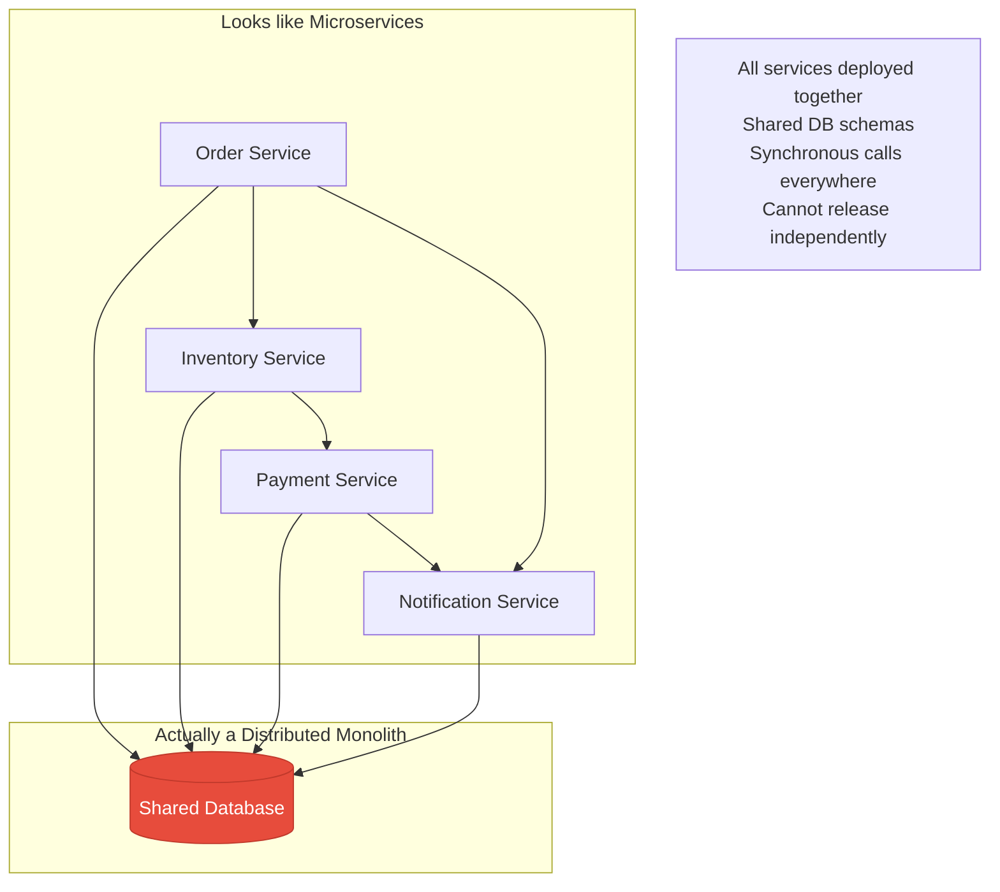
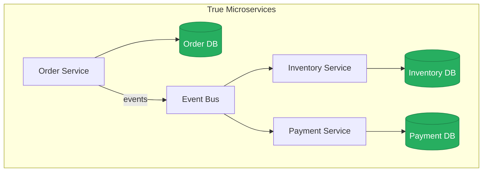
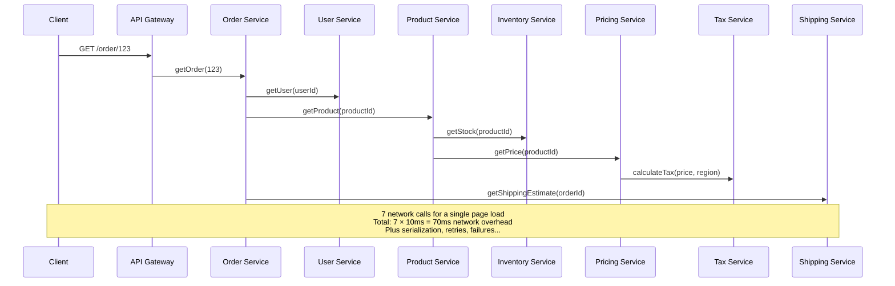
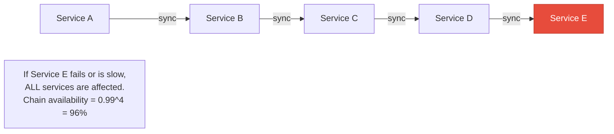
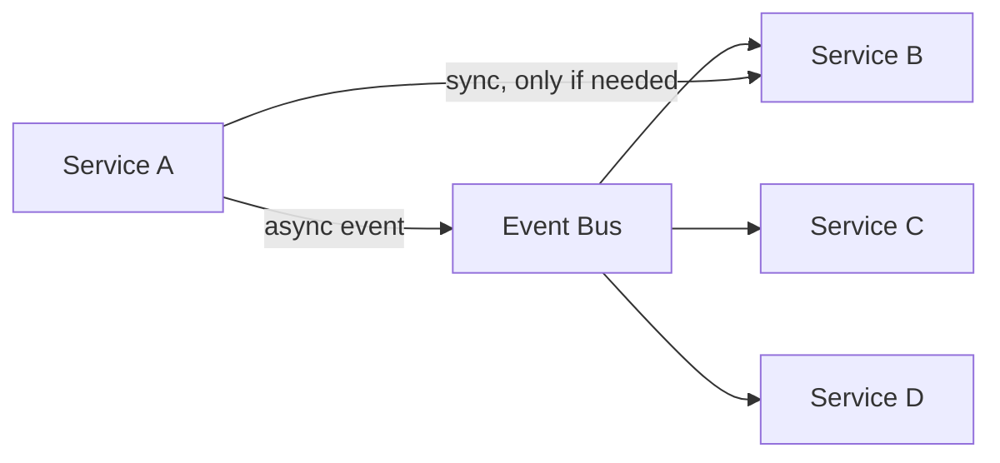
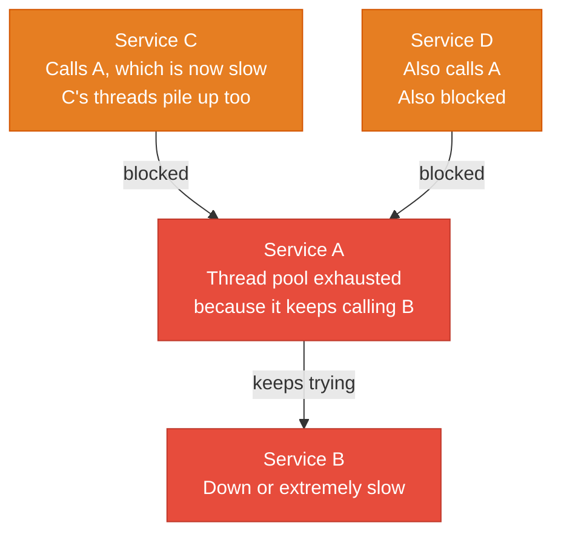
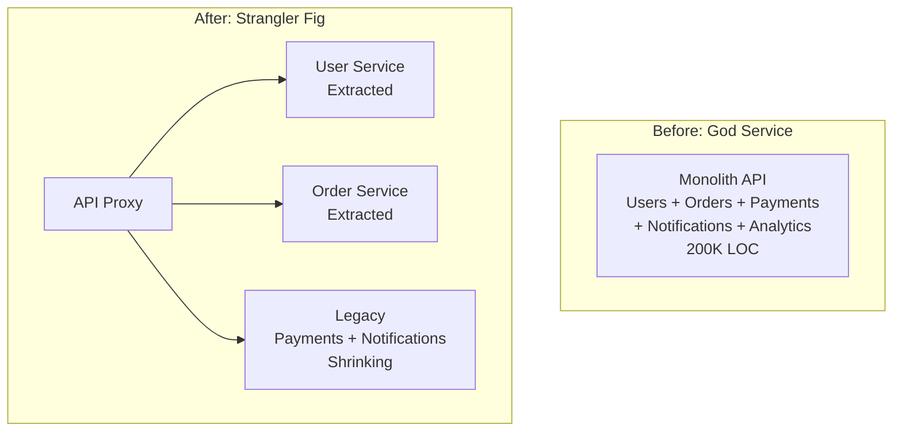

# System Design Anti-Patterns

Anti-patterns are common solutions that appear correct but actually create more problems than they solve. In system design, these mistakes compound — a chatty service design that works for 100 requests per second collapses at 10,000. This page documents the nine most destructive anti-patterns, explains why teams fall into them, and provides concrete alternatives.

## Anti-Pattern 1: The Distributed Monolith

**What it looks like:** You split your monolith into microservices, but they are all deployed together, share a database, and cannot be released independently.



**Why teams fall into it:** They read about microservices, split their code into separate repos and deployments, but do not change the data architecture or communication patterns. The result has all the complexity of microservices (network calls, distributed debugging, deployment orchestration) with none of the benefits (independent deployment, independent scaling, technology freedom).

**How to detect it:**
- Deploying Service A requires deploying Service B at the same time
- A change to the `orders` table schema requires changes in three services
- Teams cannot release without coordinating with other teams
- Integration tests require all services running together

**What to do instead:**



Each service owns its data, communicates via events or well-defined APIs, and can be deployed independently. See [Database Per Service](/system-design/advanced/database-per-service) for how to achieve this.

## Anti-Pattern 2: Premature Microservices

**What it looks like:** A team of 3-5 engineers building a new product starts with 10+ microservices from day one.

| Monolith | Premature Microservices |
|----------|----------------------|
| 1 deployment pipeline | 10+ deployment pipelines |
| Simple function calls | Network calls with retries, timeouts, serialization |
| Single debugger | Distributed tracing across 10 services |
| 1 database migration | 10 migration scripts |
| Ship a feature in 1 day | Ship a feature touching 4 services in 1 week |

**Why teams fall into it:** "Netflix uses microservices, so we should too." Netflix has thousands of engineers. You have five. Microservices are an organizational scaling pattern, not a technical best practice.

**How to detect it:**
- More services than engineers
- Simple features require changes in multiple repositories
- Most engineering time is spent on infrastructure, not product
- The team discusses service boundaries more than customer problems

**What to do instead:** Start with a well-structured monolith. Use clear module boundaries internally. Extract services only when a specific module needs independent scaling, independent deployment, or a different technology choice.

```typescript
// Well-structured monolith with clear module boundaries
// Can be extracted to services later when the pain is real

// src/modules/orders/order.service.ts
export class OrderService {
  constructor(
    private orderRepo: OrderRepository,
    private inventoryModule: InventoryModule, // Module interface, not HTTP call
    private paymentModule: PaymentModule,
  ) {}

  async createOrder(dto: CreateOrderDTO): Promise<Order> {
    // All in-process — no network calls
    const reserved = await this.inventoryModule.reserve(dto.productId, dto.quantity);
    const payment = await this.paymentModule.charge(dto.userId, dto.total);
    return this.orderRepo.create({ ...dto, reservationId: reserved.id, paymentId: payment.id });
  }
}

// When you need to extract: change InventoryModule from in-process to HTTP client
// The service boundary was already defined
```

## Anti-Pattern 3: Shared Database Across Services

**What it looks like:** Multiple services read from and write to the same database tables.

This is fully covered in [Database Per Service](/system-design/advanced/database-per-service). The short version: shared databases create schema coupling, performance coupling, technology lock-in, and ownership ambiguity. Every benefit of microservices is negated when services share a database.

**What to do instead:** Each service owns its data. Cross-service data access goes through APIs. Cross-service queries use API composition or CQRS.

## Anti-Pattern 4: Chatty Services

**What it looks like:** Fulfilling a single user request requires dozens of inter-service calls.



**Why teams fall into it:** Services are split too granularly — every noun becomes a service. The pricing of a product does not need its own service if it is always accessed alongside product data.

**How to detect it:**
- A single API call generates 10+ internal calls (visible in distributed traces)
- P99 latency is dominated by network hops, not computation
- Services frequently call each other in loops

**What to do instead:**

1. **Merge overly granular services** — Product + Pricing + Inventory can be one Catalog service
2. **Use batch/bulk APIs** — instead of N calls for N items, one call with all IDs
3. **Denormalize read data** — store commonly-accessed data together
4. **Backend for Frontend (BFF)** — aggregate data at the edge

```typescript
// Instead of 7 calls, use a BFF that aggregates
class OrderBFF {
  async getOrderDetails(orderId: string): Promise<OrderView> {
    const order = await this.orderService.getOrder(orderId);

    // Parallel bulk calls instead of sequential individual calls
    const [user, products, shipping] = await Promise.all([
      this.userService.getUser(order.userId),
      this.catalogService.getProductsBulk(order.productIds), // One call for all products
      this.shippingService.getEstimate(orderId),
    ]);

    // Catalog already includes price, stock, tax — no separate calls
    return this.assembleView(order, user, products, shipping);
  }
}
```

## Anti-Pattern 5: Synchronous Call Chains

**What it looks like:** Service A calls Service B, which calls Service C, which calls Service D — all synchronously. The failure of any service in the chain fails the entire request.



**The math is brutal:**

| Services in Chain | Individual Availability | Chain Availability |
|:-----------------:|:----------------------:|:-----------------:|
| 2 | 99.9% | 99.8% |
| 3 | 99.9% | 99.7% |
| 5 | 99.9% | 99.5% |
| 5 | 99.0% | 95.1% |
| 10 | 99.0% | 90.4% |

**What to do instead:**



1. **Use asynchronous communication** — events instead of synchronous HTTP calls
2. **Limit sync depth to 2** — if you need to call A → B → C, refactor C's data into B
3. **Use timeouts and circuit breakers** for any remaining synchronous calls
4. **Accept eventual consistency** where real-time consistency is not actually needed

```typescript
// Bad: synchronous chain
async function createOrder(dto: OrderDTO): Promise<Order> {
  const inventory = await inventoryService.reserve(dto.productId); // sync
  const payment = await paymentService.charge(dto.userId, dto.total); // sync
  const shipping = await shippingService.schedule(dto.orderId); // sync
  const notification = await notificationService.send(dto.userId); // sync
  return order;
}

// Good: sync only for critical path, async for the rest
async function createOrder(dto: OrderDTO): Promise<Order> {
  // Only inventory and payment are on the critical path
  const inventory = await inventoryService.reserve(dto.productId);
  const payment = await paymentService.charge(dto.userId, dto.total);

  const order = await orderRepo.create({ ...dto, status: 'confirmed' });

  // Fire-and-forget for non-critical operations
  await eventBus.publish('order.created', {
    orderId: order.id,
    userId: dto.userId,
  });
  // Shipping and notification services react to this event asynchronously

  return order;
}
```

## Anti-Pattern 6: No Circuit Breakers

**What it looks like:** When a downstream service fails, your service keeps sending requests, accumulating timed-out connections and eventually crashing too.

See our [Circuit Breaker Pattern](/system-design/distributed-systems/circuit-breaker) for full implementation details.

**The cascade:**



**What to do instead:**

```typescript
const circuitBreaker = new CircuitBreaker({
  failureThreshold: 5,    // Open after 5 failures
  resetTimeout: 30_000,   // Try again after 30s
  monitorInterval: 10_000,
});

async function callDownstream(request: Request): Promise<Response> {
  return circuitBreaker.execute(async () => {
    const response = await fetch('https://downstream/api', {
      signal: AbortSignal.timeout(3000), // Always set timeouts
    });
    if (!response.ok) throw new Error(`HTTP ${response.status}`);
    return response;
  }, {
    fallback: () => getCachedResponse(request), // Graceful degradation
  });
}
```

**Every synchronous inter-service call needs:**
1. A timeout (3-10 seconds, not 30)
2. A circuit breaker (stop calling after N failures)
3. A fallback (cached response, default value, or degraded mode)
4. Retry with exponential backoff (for transient failures)

## Anti-Pattern 7: The God Service

**What it looks like:** One service that does everything — handles users, orders, payments, notifications, analytics, and reporting.

**Why teams fall into it:** It starts as "we'll just add one more endpoint." Over time, the service grows to 50 endpoints, 200K lines of code, and 15-minute build times. Nobody fully understands it anymore.

**How to detect it:**
- One service has 10x more code than any other
- Deploy frequency is low because the blast radius is too high
- Multiple teams work in the same repository and step on each other
- A bug in the notification module brings down order processing

**What to do instead:** Apply the Strangler Fig pattern to gradually extract domains.



Extract one bounded context at a time. Start with the module that has the clearest boundary or the most independent scaling needs.

## Anti-Pattern 8: Database as Message Queue

**What it looks like:** Using a database table as a message queue — polling for new rows, updating a `status` column, and deleting processed rows.

```sql
-- The "poor man's queue"
CREATE TABLE job_queue (
    id SERIAL PRIMARY KEY,
    payload JSONB NOT NULL,
    status VARCHAR(20) DEFAULT 'pending',
    created_at TIMESTAMP DEFAULT NOW(),
    processed_at TIMESTAMP
);

-- Worker polls every second
SELECT * FROM job_queue
WHERE status = 'pending'
ORDER BY created_at
LIMIT 10
FOR UPDATE SKIP LOCKED;

-- After processing
UPDATE job_queue SET status = 'completed', processed_at = NOW() WHERE id = $1;
```

**Why it's an anti-pattern (at scale):**

| Issue | Impact |
|-------|--------|
| **Polling overhead** | Constant queries even when queue is empty |
| **Lock contention** | `FOR UPDATE` locks rows, limiting throughput |
| **No backpressure** | Database has no concept of consumer capacity |
| **No dead letter queue** | Failed messages need custom retry logic |
| **Table bloat** | Completed rows accumulate, slowing queries |
| **No fan-out** | Cannot have multiple consumer groups |

**When it's actually fine:** Low volume (< 100 messages/minute), simple workflows, team does not want to operate a message broker. The outbox pattern intentionally uses a database table as an intermediate step — but paired with CDC, not polling.

**What to do instead:** Use a proper message queue.

| Need | Use |
|------|-----|
| Simple job queue | SQS, Redis streams |
| Event streaming | Kafka, Kinesis |
| Pub/sub | SNS + SQS, NATS |
| Task scheduling | Temporal, Celery |

See our [Queue Selection Guide](/system-design/message-queues/queue-selection-guide) for detailed comparisons.

## Anti-Pattern 9: Not Designing for Failure

**What it looks like:** The architecture assumes everything will work. No retry logic, no fallbacks, no graceful degradation, no health checks, no alerting.

**The reality of distributed systems:**

| Failure | Frequency |
|---------|-----------|
| Network timeout | Multiple times per day |
| Service restart/deploy | Daily |
| Database failover | Monthly |
| Cloud provider incident | Quarterly |
| Regional outage | Yearly |
| Data center failure | Multi-year |

**What to do instead:** Design for failure at every level.

```typescript
// Defense in depth: every external call is wrapped in resilience patterns
class ResilientServiceClient {
  private circuitBreaker: CircuitBreaker;
  private retryPolicy: RetryPolicy;
  private cache: Cache;
  private metrics: MetricsClient;

  async callService<T>(
    operation: string,
    call: () => Promise<T>,
    options: {
      fallback?: () => T;
      cacheTtl?: number;
      retries?: number;
      timeout?: number;
    } = {},
  ): Promise<T> {
    const { fallback, cacheTtl = 60, retries = 3, timeout = 5000 } = options;

    // Layer 1: Check cache
    const cached = await this.cache.get<T>(operation);
    if (cached) return cached;

    // Layer 2: Circuit breaker
    try {
      const result = await this.circuitBreaker.execute(async () => {
        // Layer 3: Retry with backoff
        return this.retryPolicy.execute(async () => {
          // Layer 4: Timeout
          const controller = new AbortController();
          const timer = setTimeout(() => controller.abort(), timeout);
          try {
            const result = await call();
            clearTimeout(timer);

            // Cache successful result
            await this.cache.set(operation, result, cacheTtl);
            this.metrics.increment(`${operation}.success`);
            return result;
          } catch (error) {
            clearTimeout(timer);
            this.metrics.increment(`${operation}.error`);
            throw error;
          }
        }, retries);
      });

      return result;
    } catch (error) {
      this.metrics.increment(`${operation}.circuit_open`);

      // Layer 5: Fallback
      if (fallback) {
        this.metrics.increment(`${operation}.fallback`);
        return fallback();
      }
      throw error;
    }
  }
}
```

### The Resilience Checklist

For every external dependency your service has:

- [ ] **Timeout** configured (not infinite)
- [ ] **Circuit breaker** prevents cascading failure
- [ ] **Retry** with exponential backoff and jitter
- [ ] **Fallback** provides degraded but functional response
- [ ] **Health check** monitors dependency status
- [ ] **Alert** fires when error rate exceeds threshold
- [ ] **Bulkhead** isolates failure to one dependency (not all)
- [ ] **Graceful degradation** — the feature degrades, not the entire service

## Anti-Pattern Summary Table

| # | Anti-Pattern | Core Problem | Fix |
|:-:|-------------|-------------|-----|
| 1 | Distributed Monolith | Microservice boundaries without data boundaries | Database per service, event-driven communication |
| 2 | Premature Microservices | Solving organizational problems you don't have | Start with a well-structured monolith |
| 3 | Shared Database | Schema and performance coupling | Each service owns its data |
| 4 | Chatty Services | Too many network calls per request | Bulk APIs, BFF, denormalization |
| 5 | Synchronous Chains | Cascading failures, multiplicative latency | Async events, limit sync depth |
| 6 | No Circuit Breakers | One failure takes down everything | Circuit breaker + timeout + fallback |
| 7 | God Service | Too much code, too many responsibilities, too risky to change | Strangler Fig pattern to extract domains |
| 8 | DB as Queue | Polling overhead, lock contention, no backpressure | Use SQS, Kafka, or Redis Streams |
| 9 | No Failure Design | System assumes everything works | Design for failure at every layer |

## Related Pages

- [Circuit Breaker Pattern](/system-design/distributed-systems/circuit-breaker) — implementing circuit breakers
- [Database Per Service](/system-design/advanced/database-per-service) — eliminating shared databases
- [Queue Selection Guide](/system-design/message-queues/queue-selection-guide) — choosing the right queue
- [CQRS: When to Use It](/system-design/advanced/cqrs-when-to-use) — avoiding premature CQRS
- [Real-World Architectures](/system-design/advanced/real-world-architectures) — how companies avoid these anti-patterns
- [Architecture Review Exercises](/system-design/advanced/architecture-review) — practice spotting anti-patterns
- [Observability in Design](/system-design/advanced/observability-in-design) — detecting anti-patterns in production
