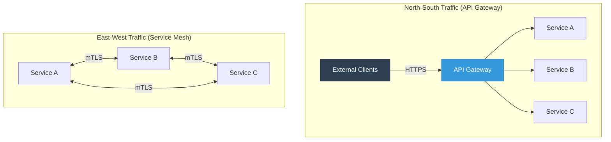
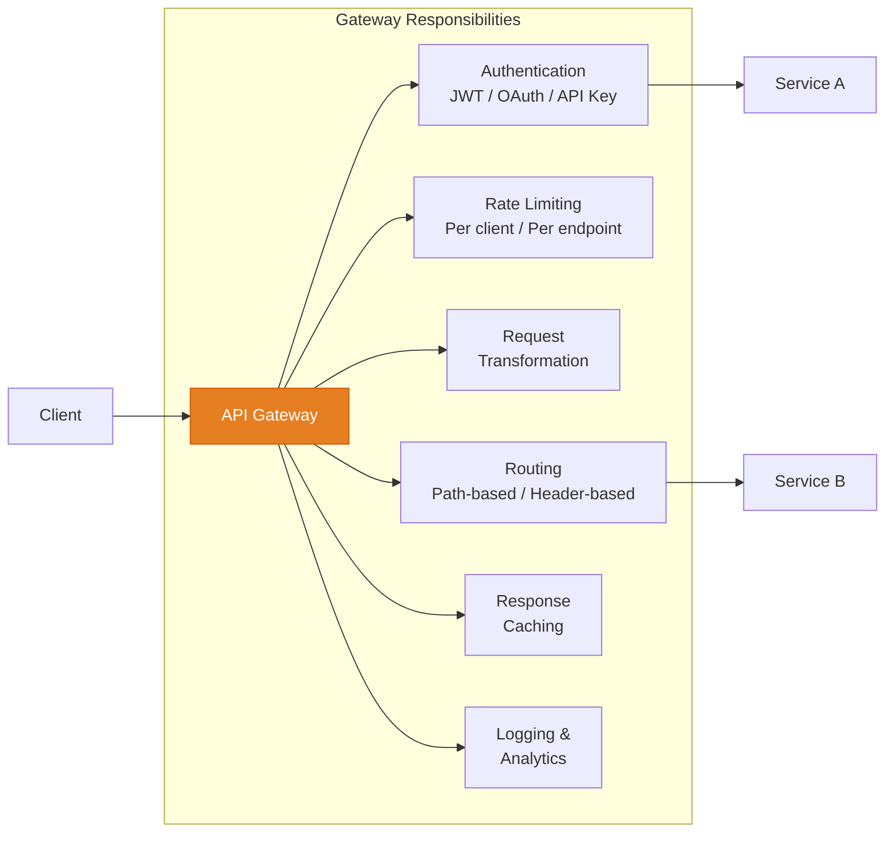
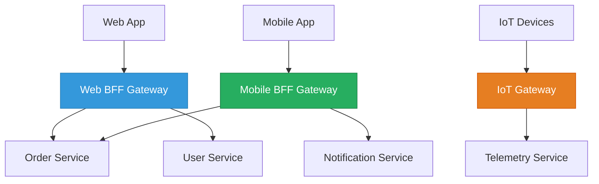
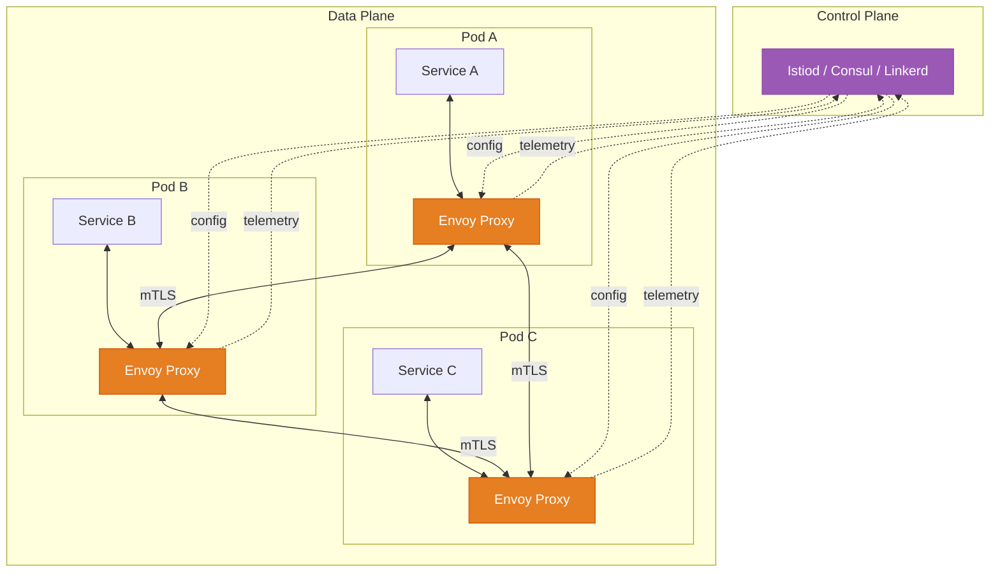
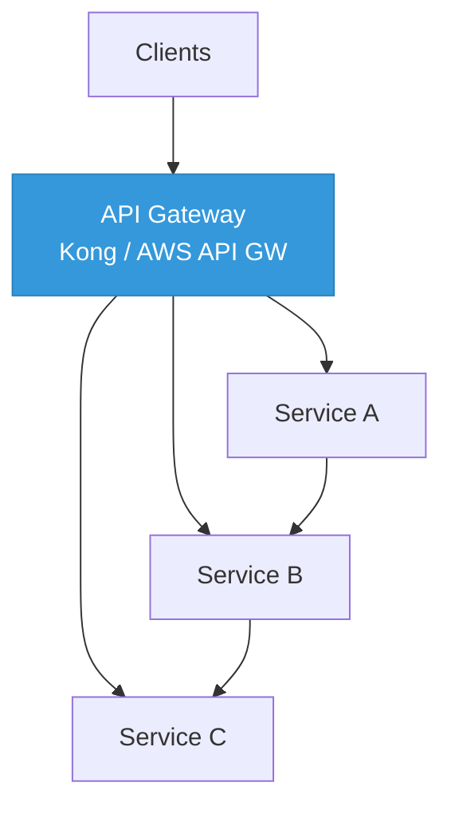
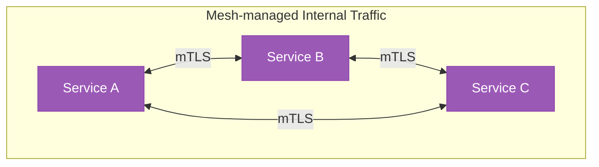
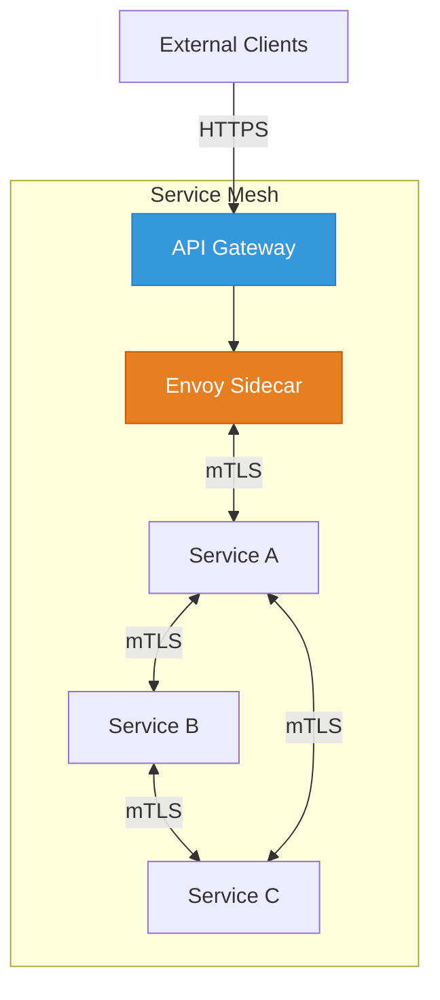
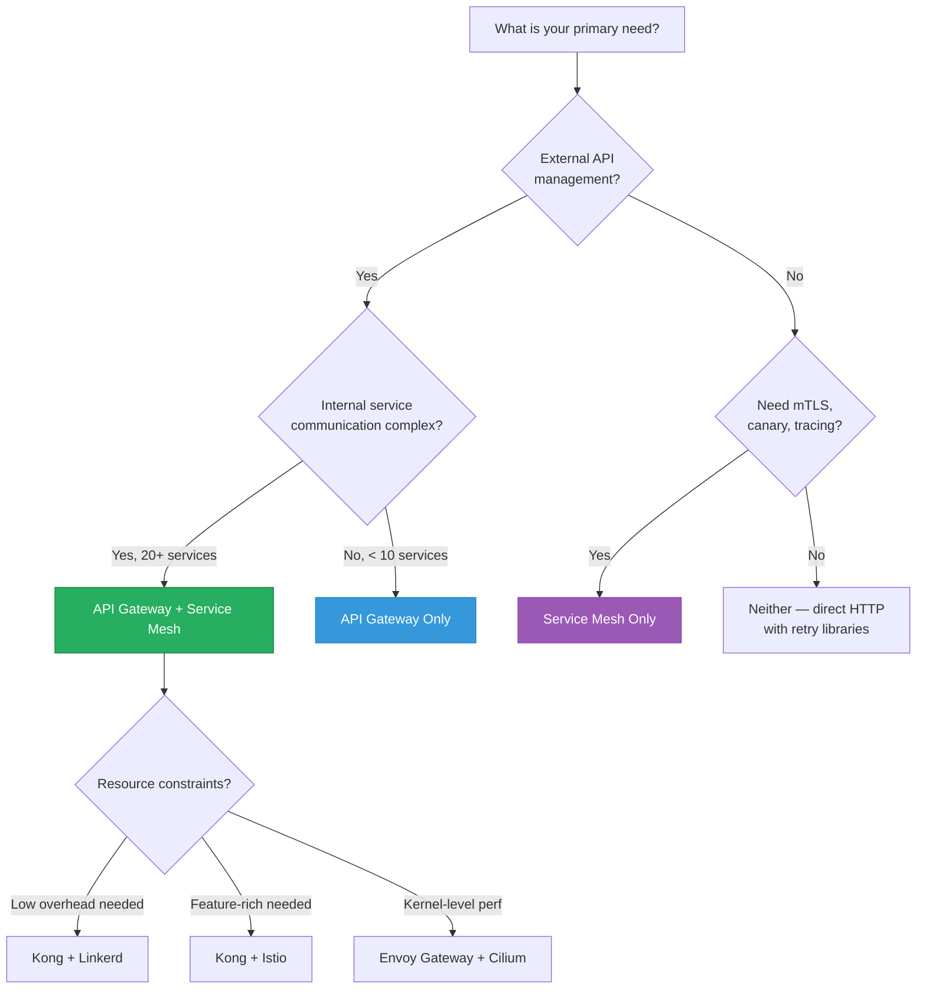

# API Gateway vs Service Mesh

API gateways and service meshes both sit in the request path and handle concerns like routing, authentication, rate limiting, and observability. They look similar on the surface, which is why teams confuse them — but they solve fundamentally different problems for different types of traffic. Understanding the distinction is essential for designing microservice architectures that are both secure and operationally manageable.

## Traffic Direction: The Key Distinction



| Direction | What It Means | Handled By |
|-----------|--------------|------------|
| **North-South** | Traffic entering/leaving your system from external clients | API Gateway |
| **East-West** | Traffic between services inside your system | Service Mesh |

North-south traffic is untrusted, comes from the internet, and needs authentication, rate limiting, and request transformation. East-west traffic is internal, comes from your own services, and needs mutual TLS, load balancing, circuit breaking, and observability.

## API Gateway Deep Dive

An API gateway is the single entry point for all external clients. It sits at the edge of your system and handles cross-cutting concerns before requests reach backend services.

### Core Responsibilities



| Responsibility | Description | Example |
|---------------|-------------|---------|
| **Authentication** | Validate tokens, API keys before requests reach services | Verify JWT, check API key quota |
| **Rate limiting** | Protect backends from traffic spikes | 1000 req/min per API key |
| **Request routing** | Route to different backends based on path, headers, query params | `/api/v1/orders` -> Order Service |
| **Protocol translation** | Convert between protocols | REST -> gRPC, WebSocket -> HTTP |
| **Request/response transformation** | Modify payloads between client and service | Add headers, reshape JSON |
| **API composition** | Aggregate responses from multiple services | BFF pattern |
| **Caching** | Cache responses to reduce backend load | Cache GET responses for 60s |
| **TLS termination** | Handle HTTPS at the edge | Offload TLS from services |

### Kong Gateway Example

```yaml
# Kong declarative configuration
_format_version: "3.0"

services:
  - name: order-service
    url: http://order-svc:3000
    routes:
      - name: orders-route
        paths:
          - /api/v1/orders
        strip_path: true
    plugins:
      - name: jwt
        config:
          key_claim_name: kid
      - name: rate-limiting
        config:
          minute: 100
          policy: redis
          redis_host: redis
      - name: cors
        config:
          origins: ["https://app.example.com"]
          methods: ["GET", "POST", "PUT", "DELETE"]
      - name: request-transformer
        config:
          add:
            headers:
              - "X-Request-ID:{​{ uuid() }}"

  - name: user-service
    url: http://user-svc:3000
    routes:
      - name: users-route
        paths:
          - /api/v1/users
        strip_path: true
    plugins:
      - name: key-auth
      - name: rate-limiting
        config:
          minute: 500
```

### API Gateway Patterns

**Backend for Frontend (BFF):**



Each client type gets a gateway optimized for its needs:
- **Web BFF** — returns full payloads, supports GraphQL
- **Mobile BFF** — returns compact payloads, handles spotty connectivity
- **IoT Gateway** — speaks MQTT, handles high-volume small messages

## Service Mesh Deep Dive

A service mesh manages communication between services using sidecar proxies deployed alongside every service instance. The application code does not need to implement networking concerns — the mesh handles them transparently.

### Architecture



**Control plane** — the brain. Distributes configuration, manages certificates, collects telemetry. Examples: Istiod, Linkerd control plane, Consul server.

**Data plane** — the muscle. Sidecar proxies that intercept all network traffic. Example: Envoy.

### Core Responsibilities

| Responsibility | Description | Without Mesh |
|---------------|-------------|-------------|
| **mTLS** | Automatic mutual TLS between all services | Manual certificate management per service |
| **Service discovery** | Automatic endpoint resolution | Each service implements discovery client |
| **Load balancing** | Client-side LB with locality awareness | Round-robin only, or custom LB code |
| **Circuit breaking** | Automatic failure detection and isolation | Import and configure circuit breaker library |
| **Retries + timeouts** | Configurable per route, with budgets | Each service implements its own retry logic |
| **Observability** | Distributed tracing, metrics, access logs | Instrument every service manually |
| **Traffic splitting** | Canary deployments, A/B testing | Deploy custom routing logic |
| **Authorization** | Fine-grained access control policies | Implement auth checks in each service |

### Istio Example Configuration

```yaml
# Istio VirtualService — traffic splitting for canary
apiVersion: networking.istio.io/v1beta1
kind: VirtualService
metadata:
  name: order-service
spec:
  hosts:
    - order-svc
  http:
    - match:
        - headers:
            x-canary:
              exact: "true"
      route:
        - destination:
            host: order-svc
            subset: v2
    - route:
        - destination:
            host: order-svc
            subset: v1
          weight: 90
        - destination:
            host: order-svc
            subset: v2
          weight: 10
      retries:
        attempts: 3
        perTryTimeout: 2s
        retryOn: 5xx
      timeout: 10s

---
# DestinationRule — circuit breaking + load balancing
apiVersion: networking.istio.io/v1beta1
kind: DestinationRule
metadata:
  name: order-service
spec:
  host: order-svc
  trafficPolicy:
    connectionPool:
      tcp:
        maxConnections: 100
      http:
        h2UpgradePolicy: UPGRADE
        maxRequestsPerConnection: 10
    outlierDetection:
      consecutive5xxErrors: 5
      interval: 30s
      baseEjectionTime: 30s
      maxEjectionPercent: 50
    loadBalancer:
      simple: LEAST_REQUEST
  subsets:
    - name: v1
      labels:
        version: v1
    - name: v2
      labels:
        version: v2

---
# AuthorizationPolicy — service-to-service access control
apiVersion: security.istio.io/v1beta1
kind: AuthorizationPolicy
metadata:
  name: order-service-policy
spec:
  selector:
    matchLabels:
      app: order-service
  rules:
    - from:
        - source:
            principals: ["cluster.local/ns/default/sa/api-gateway"]
        - source:
            principals: ["cluster.local/ns/default/sa/payment-service"]
      to:
        - operation:
            methods: ["GET", "POST"]
            paths: ["/orders/*"]
```

## Feature Comparison

| Feature | API Gateway | Service Mesh | Both? |
|---------|:-----------:|:------------:|:-----:|
| External authentication | Yes | No | Gateway |
| mTLS between services | No | Yes | Mesh |
| Rate limiting (external) | Yes | Partial | Gateway |
| Rate limiting (internal) | No | Yes | Mesh |
| Request transformation | Yes | No | Gateway |
| Protocol translation | Yes | No | Gateway |
| API versioning | Yes | No | Gateway |
| Circuit breaking | Partial | Yes | Mesh |
| Distributed tracing | Partial | Yes | Mesh |
| Canary deployments | No | Yes | Mesh |
| Service discovery | Partial | Yes | Mesh |
| API analytics | Yes | No | Gateway |
| Developer portal | Yes | No | Gateway |
| Response caching | Yes | No | Gateway |
| Access logging | Yes | Yes | Both |
| TLS termination | Yes (edge) | Yes (internal) | Both |
| Load balancing | Yes (L7) | Yes (L4/L7) | Both |

## When to Use What

### API Gateway Only

Use when you have a manageable number of services (under 10) and the primary concern is exposing APIs to external clients.



**Good for:**
- Small to medium microservice count (< 10 services)
- Primary need is external API management
- Team does not have Kubernetes expertise
- Services communicate via simple REST calls
- Need developer portal and API documentation

### Service Mesh Only

Use when all traffic is internal (no external API exposure needed) and you need advanced traffic management between services.



**Good for:**
- Internal platform services (no external API)
- Strong security requirements (zero-trust, mTLS everywhere)
- Complex traffic management (canary, blue-green)
- Need deep observability without code changes

### Both Together (Most Common at Scale)

At scale, you need both. The gateway handles external concerns, the mesh handles internal concerns.



**Good for:**
- Large microservice architectures (20+ services)
- External API exposure AND complex internal communication
- Compliance requirements (PCI-DSS, SOC2)
- Multiple teams managing independent services

## Technology Comparison

### API Gateways

| Gateway | Deployment | Strengths | Weaknesses |
|---------|-----------|-----------|------------|
| **Kong** | Self-hosted / Cloud | Plugin ecosystem, PostgreSQL-backed, Lua extensible | Complex clustering setup |
| **AWS API Gateway** | Managed | Native AWS integration, zero ops | Vendor lock-in, latency overhead |
| **Envoy** | Self-hosted | High performance, gRPC-native, extensible via WASM | Not a full gateway — needs control plane |
| **NGINX Plus** | Self-hosted | Proven performance, familiar config | Commercial license for advanced features |
| **Traefik** | Self-hosted | Auto-discovery with Docker/K8s, Let's Encrypt built-in | Less enterprise features |
| **Azure APIM** | Managed | Policy engine, developer portal | Azure ecosystem only |

### Service Meshes

| Mesh | Proxy | Strengths | Weaknesses |
|------|-------|-----------|------------|
| **Istio** | Envoy | Most feature-rich, industry standard | Resource-heavy, complex to operate |
| **Linkerd** | linkerd2-proxy (Rust) | Lightweight, simple, fast | Fewer features than Istio |
| **Consul Connect** | Envoy | Multi-platform (K8s + VMs), built-in KV store | HashiCorp licensing changes |
| **Cilium** | eBPF | Kernel-level performance, no sidecar needed | Requires newer Linux kernels |
| **AWS App Mesh** | Envoy | Native AWS integration | AWS-only, limited features |

### Resource Overhead Comparison

| Mesh | Memory per sidecar | CPU per sidecar | Latency added |
|------|-------------------|----------------|---------------|
| **Istio (Envoy)** | 50-100 MB | 0.1-0.5 vCPU | 2-5 ms p99 |
| **Linkerd** | 10-20 MB | 0.01-0.1 vCPU | 1-2 ms p99 |
| **Cilium (eBPF)** | 0 (no sidecar) | Kernel overhead | < 1 ms p99 |

For 100 services with 3 replicas each, Istio adds 15-30 GB of memory overhead. Linkerd adds 3-6 GB. Cilium adds near zero.

## Kong vs Envoy: Detailed Comparison

These two are often compared because Envoy can function as both a gateway (with a control plane) and a mesh data plane.

```typescript
// Kong plugin (Lua) — custom authentication
local BasePlugin = require "kong.plugins.base_plugin"
local CustomAuth = BasePlugin:extend()

function CustomAuth:access(conf)
  local token = kong.request.get_header("Authorization")
  if not token then
    return kong.response.exit(401, { message = "Missing token" })
  end

  local valid, claims = verify_token(token, conf.secret)
  if not valid then
    return kong.response.exit(403, { message = "Invalid token" })
  end

  -- Pass user info downstream
  kong.service.request.set_header("X-User-ID", claims.sub)
  kong.service.request.set_header("X-User-Role", claims.role)
end

return CustomAuth
```

```yaml
# Envoy filter chain — equivalent custom auth
static_resources:
  listeners:
    - name: listener_0
      address:
        socket_address:
          address: 0.0.0.0
          port_value: 8080
      filter_chains:
        - filters:
            - name: envoy.filters.network.http_connection_manager
              typed_config:
                "@type": type.googleapis.com/envoy.extensions.filters.network.http_connection_manager.v3.HttpConnectionManager
                route_config:
                  virtual_hosts:
                    - name: backend
                      domains: ["*"]
                      routes:
                        - match:
                            prefix: "/api/v1/orders"
                          route:
                            cluster: order-service
                            timeout: 10s
                            retry_policy:
                              retry_on: "5xx"
                              num_retries: 3
                http_filters:
                  - name: envoy.filters.http.jwt_authn
                    typed_config:
                      "@type": type.googleapis.com/envoy.extensions.filters.http.jwt_authn.v3.JwtAuthentication
                      providers:
                        auth0:
                          issuer: "https://auth.example.com/"
                          audiences: ["api.example.com"]
                          remote_jwks:
                            http_uri:
                              uri: "https://auth.example.com/.well-known/jwks.json"
                              cluster: auth0
                              timeout: 5s
                  - name: envoy.filters.http.router
                    typed_config:
                      "@type": type.googleapis.com/envoy.extensions.filters.http.router.v3.Router
```

## Decision Framework



## Common Anti-Patterns

| Anti-Pattern | Problem | Solution |
|-------------|---------|----------|
| Using API gateway for east-west traffic | Gateway becomes bottleneck and single point of failure for all internal calls | Use service mesh for internal traffic |
| Putting business logic in the gateway | Gateway becomes a monolith that every team depends on | Keep gateway logic limited to cross-cutting concerns |
| mTLS only at gateway, plain HTTP internally | Internal traffic is vulnerable to lateral movement attacks | Use service mesh for mTLS between all services |
| Over-configuring mesh policies | Too many retries and timeouts compound, causing retry storms | Set retry budgets and use circuit breaking |
| Not monitoring mesh overhead | Sidecar resource consumption goes unnoticed | Track proxy memory/CPU usage, tail latencies |

## Production Checklist

**API Gateway:**
- [ ] TLS termination configured with auto-renewal
- [ ] Rate limiting per client and per endpoint
- [ ] Authentication middleware configured
- [ ] Request/response logging enabled
- [ ] Health check endpoints excluded from auth
- [ ] CORS headers configured
- [ ] API versioning strategy implemented
- [ ] Gateway itself is horizontally scaled (2+ instances)

**Service Mesh:**
- [ ] mTLS mode set to STRICT (not PERMISSIVE) in production
- [ ] Circuit breaker thresholds tuned to actual traffic patterns
- [ ] Retry budgets configured (not unlimited retries)
- [ ] Distributed tracing sampling rate configured
- [ ] Control plane is highly available (3+ replicas)
- [ ] Sidecar resource limits set
- [ ] Authorization policies defined (deny-by-default)
- [ ] Egress traffic policy configured

## Related Pages

- [API Security Patterns](/system-design/api-design/api-security-patterns) — securing your gateway
- [Circuit Breaker Pattern](/system-design/distributed-systems/circuit-breaker) — the pattern meshes automate
- [Service Discovery](/system-design/networking/service-discovery) — how mesh resolves endpoints
- [Envoy Config](/system-design/load-balancing/envoy-config) — deep dive into Envoy proxy
- [gRPC Internals](/system-design/networking/grpc-internals) — protocol commonly used with mesh
- [Istio Service Mesh](/infrastructure/service-mesh) — our infrastructure-level Istio guide
- [L4 vs L7 Load Balancing](/system-design/load-balancing/l4-vs-l7) — understanding proxy layers
- [Observability in Design](/system-design/advanced/observability-in-design) — mesh as observability source
