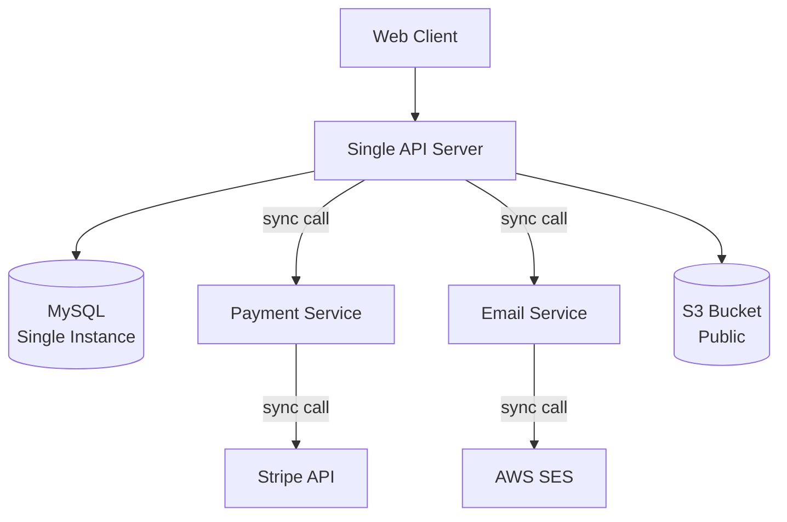
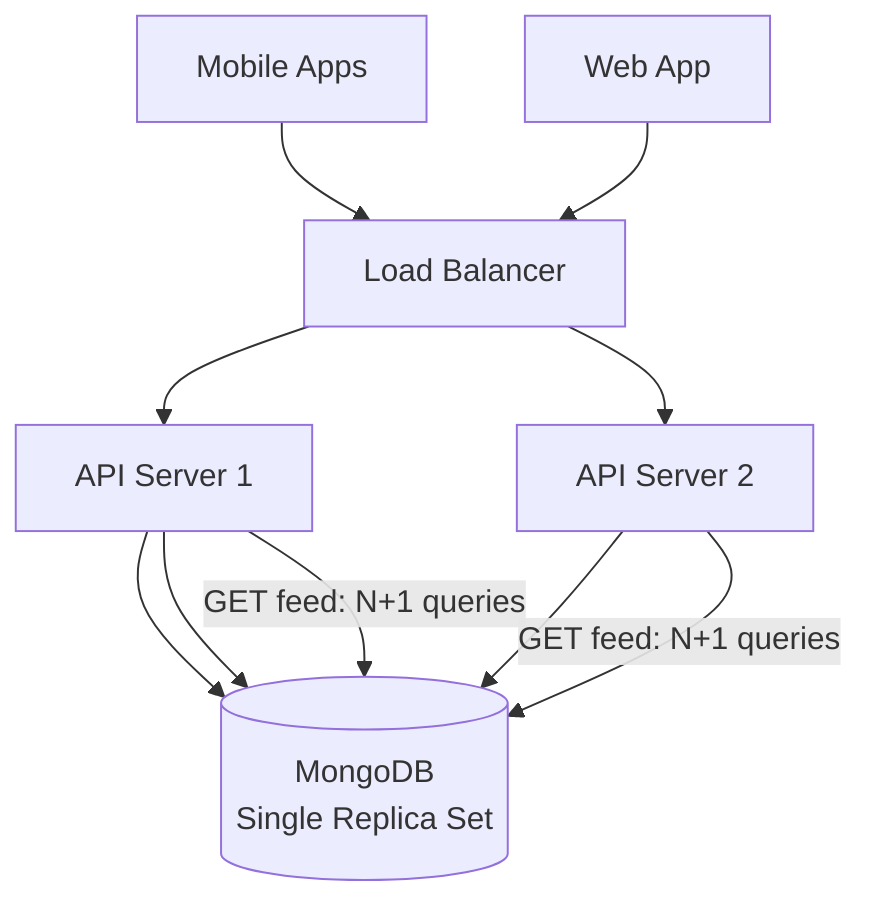
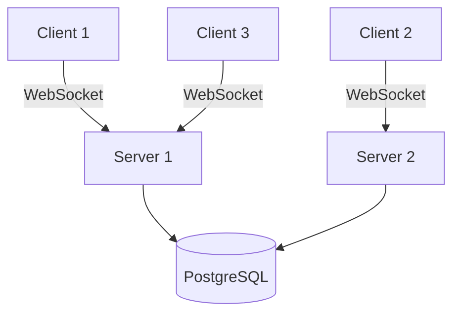
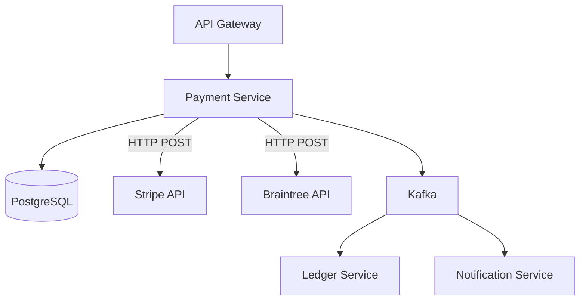
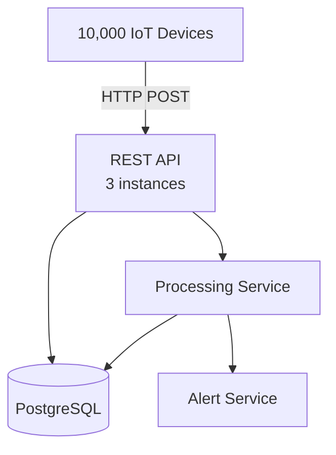
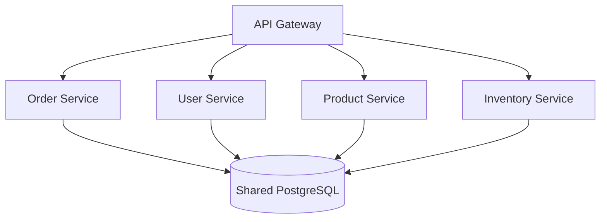
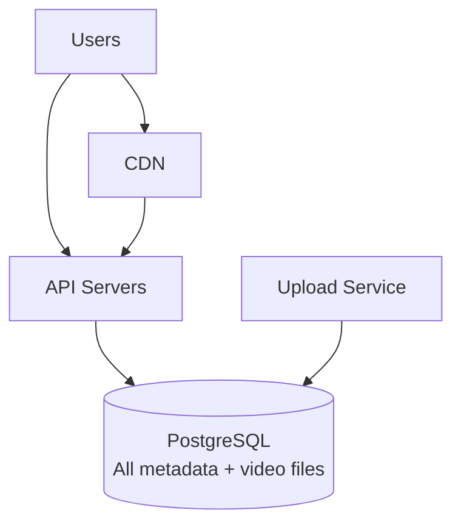
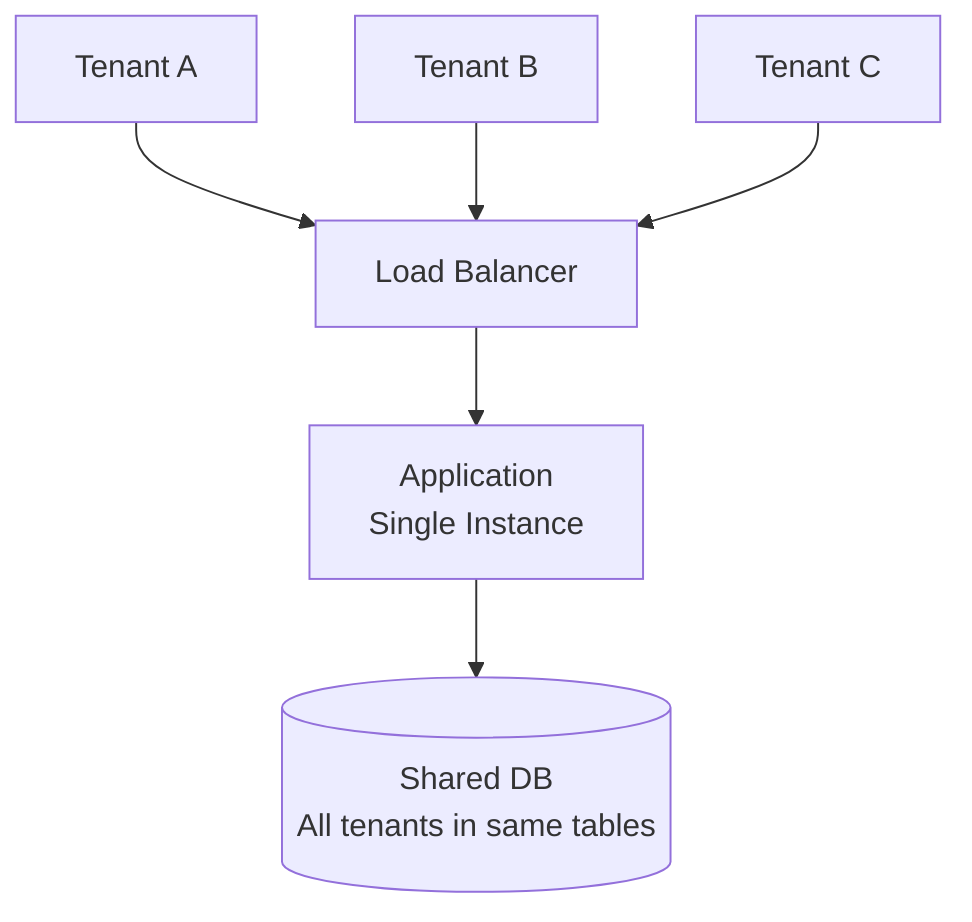
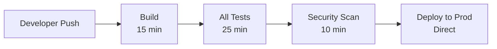
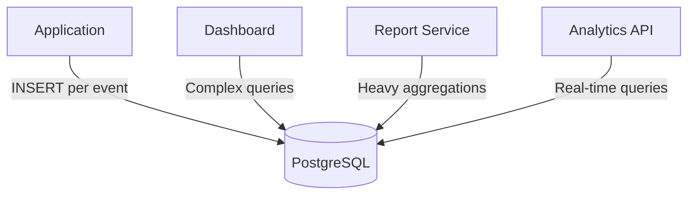

# Architecture Review Exercises

The ability to look at an architecture diagram and immediately spot problems is what separates senior engineers from mid-level ones. These 10 exercises present intentionally flawed architectures. For each one, find at least 5 issues and suggest fixes. Try to identify the issues before reading the answers.

## How to Review an Architecture

Before jumping into the exercises, use this checklist for any architecture review:

| Category | Questions to Ask |
|----------|-----------------|
| **Availability** | What are the single points of failure? What happens when X goes down? |
| **Scalability** | What is the bottleneck? Can each layer scale independently? |
| **Performance** | Where is caching? How many network hops per request? What is the latency budget? |
| **Security** | Where is authentication? Is internal traffic encrypted? Are secrets managed? |
| **Observability** | How do you know the system is healthy? How do you debug a slow request? |
| **Data** | Is the database choice appropriate? How is data replicated? Backed up? |
| **Failure** | What happens if a dependency is slow? Is there a circuit breaker? Fallback? |
| **Operations** | How is it deployed? How do you roll back? How do you scale up? |

---

## Exercise 1: E-Commerce Checkout

### Find the Issues

::: details Click to reveal issues

**Issue 1: Single point of failure — API Server**
There is one API server. If it crashes, the entire system is down. **Fix:** Auto-scaling group with minimum 2 instances behind a load balancer.

**Issue 2: Single point of failure — MySQL**
Single MySQL instance with no replication. Disk failure = data loss. **Fix:** Multi-AZ RDS deployment with automated failover and regular backups.

**Issue 3: Synchronous email sending**
Sending email synchronously in the checkout flow adds latency and can fail (SES downtime blocks checkout). **Fix:** Publish an event to a queue (SQS), email service consumes asynchronously. Checkout does not wait for email.

**Issue 4: No caching layer**
Every request hits the database. Product catalog pages, which are read-heavy and rarely change, should be cached. **Fix:** Add Redis cache for product data, session data, and cart.

**Issue 5: S3 bucket is public**
A public S3 bucket is a security risk. Customer uploads, invoices, or internal files could be exposed. **Fix:** Private bucket with presigned URLs for access. Use CloudFront with OAI for public assets.

**Issue 6: No monitoring or observability**
No mention of logging, metrics, tracing, or alerting. You cannot know the system is unhealthy until users complain. **Fix:** Add Prometheus metrics, structured logging, distributed tracing, and alerting.

**Issue 7: No circuit breaker on Stripe calls**
If Stripe is slow or down, the API server's thread pool fills up waiting for Stripe responses. **Fix:** Circuit breaker with timeout on Stripe calls. Queue payments for retry if Stripe is unavailable.

:::

---

## Exercise 2: Social Media Platform

### Find the Issues

::: details Click to reveal issues

**Issue 1: N+1 query problem for feed generation**
Generating a feed by querying each followed user's posts individually creates hundreds of queries per feed load. **Fix:** Pre-compute feeds using fanout-on-write (for regular users) or use aggregation pipeline. Cache feeds in Redis sorted sets.

**Issue 2: No CDN for static content**
Images, videos, and static assets served through the API server waste compute. **Fix:** CloudFront CDN for all media content and static assets.

**Issue 3: MongoDB for everything**
MongoDB is used for all data including user profiles, posts, follower graphs, and notifications. Follower graphs are better served by a graph database or relational model. **Fix:** Use MongoDB for posts/content (document-shaped), PostgreSQL or a graph DB for social graph, Redis for feeds.

**Issue 4: No search capability**
Users cannot search posts or other users. MongoDB text search is limited. **Fix:** Elasticsearch for full-text search, synced via change streams from MongoDB.

**Issue 5: No rate limiting**
No protection against abuse, bots, or DoS. A single malicious client can consume all API capacity. **Fix:** Rate limiting at load balancer (IP-based) and API level (user-based).

**Issue 6: No async processing**
Image/video uploads, notification delivery, and feed generation should be asynchronous. Processing them synchronously in the request path increases latency and couples concerns. **Fix:** SQS/Kafka for async jobs — media processing, notifications, feed updates.

**Issue 7: Single MongoDB replica set**
One replica set is a single point of failure at the data layer. For a social media platform with global users, this adds latency for remote users. **Fix:** Sharded MongoDB cluster or multi-region deployment.

:::

---

## Exercise 3: Real-Time Chat Application

### Find the Issues

::: details Click to reveal issues

**Issue 1: No message routing between servers**
If Client 1 (on Server 1) sends a message to Client 2 (on Server 2), Server 1 has no way to deliver it. WebSocket connections are server-specific. **Fix:** Add Redis Pub/Sub or Kafka for cross-server message routing. Each server subscribes to channels for its connected users.

**Issue 2: PostgreSQL for real-time messaging**
PostgreSQL is not optimized for the high-write, append-only, time-series nature of chat messages. **Fix:** Use Cassandra or ScyllaDB for message storage (append-optimized, time-partitioned). Keep PostgreSQL for user profiles and channel metadata.

**Issue 3: No presence system**
There is no mechanism to track who is online, typing, or away. **Fix:** Redis for presence data — set key `user:{id}:online` with TTL, clients send heartbeats.

**Issue 4: No message ordering guarantee**
Without a sequencing mechanism, messages can arrive out of order, especially across servers. **Fix:** Per-channel monotonically increasing sequence number, assigned by a centralized sequencer or using Lamport timestamps.

**Issue 5: No offline message delivery**
If a user is disconnected, they miss all messages. When they reconnect, there is no mechanism to sync missed messages. **Fix:** Store messages persistently, track last-read per user per channel, deliver unread messages on reconnect.

**Issue 6: No load balancer for WebSocket connections**
Clients connect directly to specific servers. If a server dies, those clients lose connection and cannot reconnect to the same server. **Fix:** Load balancer with WebSocket support (sticky sessions or connection draining).

:::

---

## Exercise 4: Payment Processing System

### Find the Issues

::: details Click to reveal issues

**Issue 1: No idempotency**
If a client retries a payment request (network timeout), the payment might be charged twice. **Fix:** Require idempotency key on all payment requests. Check if key was already processed before executing.

**Issue 2: No webhook handling for async payment updates**
Stripe and Braintree send async updates via webhooks (payment succeeded, disputed, refunded). This architecture has no webhook receiver. **Fix:** Add a webhook endpoint that processes async payment events and updates order status.

**Issue 3: Kafka without dead letter queue**
If the ledger service fails to process a message, it will be retried indefinitely, potentially blocking the partition. **Fix:** Configure DLQ for messages that fail after max retries. Add alerting on DLQ messages.

**Issue 4: No encryption at rest for payment data**
PostgreSQL stores sensitive payment data (card tokens, amounts, customer info) but no mention of encryption. **Fix:** Enable encryption at rest on RDS, use column-level encryption for PII, never store raw card numbers.

**Issue 5: No circuit breaker on payment providers**
If Stripe is down, all payment requests fail and timeout, potentially exhausting connection pools. **Fix:** Circuit breaker per provider. Failover from Stripe to Braintree when circuit opens.

:::

---

## Exercise 5: IoT Data Ingestion Pipeline

### Find the Issues

::: details Click to reveal issues

**Issue 1: HTTP for IoT devices**
HTTP is heavy for constrained IoT devices sending frequent small payloads. **Fix:** Use MQTT for device-to-cloud communication — lighter protocol designed for IoT. Use an MQTT broker (Mosquitto, AWS IoT Core).

**Issue 2: PostgreSQL for time-series data**
10,000 devices sending data every 5 seconds = 2 million writes/minute. PostgreSQL will struggle. **Fix:** Use a time-series database (TimescaleDB, InfluxDB) optimized for this write pattern with automatic time-based partitioning and downsampling.

**Issue 3: No buffering between ingestion and processing**
The API directly calls the processing service synchronously. If processing is slow, it backs up the API and devices cannot send data. **Fix:** Kafka or SQS between ingestion and processing. Decouple data receipt from data processing.

**Issue 4: No data aggregation**
Raw sensor data at 5-second intervals is useful for real-time monitoring but wasteful for historical queries. **Fix:** Implement downsampling — aggregate 5-second data to 1-minute averages after 1 day, 1-hour averages after 30 days.

**Issue 5: No device authentication**
No mention of how devices authenticate. An attacker could impersonate devices and inject false data. **Fix:** TLS client certificates or API keys per device. Validate device identity on every request.

:::

---

## Exercise 6: Microservices with Shared Database

### Find the Issues

::: details Click to reveal issues

**Issue 1: Shared database — distributed monolith**
Four services sharing one database means schema coupling, deployment coupling, and no independent scaling. **Fix:** Database per service. See [Database Per Service](/system-design/advanced/database-per-service).

**Issue 2: No inter-service communication shown**
When an order is placed, inventory must be reserved and the user's order history updated. With no event bus, these are presumably synchronous calls or direct database access. **Fix:** Event bus (Kafka) for inter-service communication.

**Issue 3: No caching**
Product catalog data is read-heavy and perfect for caching. **Fix:** Redis cache for product data, user sessions.

**Issue 4: Single database instance**
No replication, no failover. **Fix:** Multi-AZ RDS with read replicas.

**Issue 5: No API-level security**
No rate limiting, authentication, or authorization at the gateway. **Fix:** JWT validation at gateway, rate limiting per client.

:::

---

## Exercise 7: Video Streaming Service

### Find the Issues

::: details Click to reveal issues

**Issue 1: Video files stored in PostgreSQL**
Binary video files in a relational database is extremely inefficient. Queries slow down, backups become massive, and storage costs skyrocket. **Fix:** Store videos in S3 or equivalent object storage. Store only metadata (URL, duration, codec) in PostgreSQL.

**Issue 2: CDN pointing to API servers for video**
Video should be served directly from object storage through CDN, not through API servers. **Fix:** CDN origin should be S3 (or equivalent), not the API. API handles metadata only.

**Issue 3: No transcoding pipeline**
Users upload various formats and resolutions. Without transcoding, playback on different devices is impossible or inefficient. **Fix:** Upload service triggers a transcoding pipeline (Lambda/Fargate) that converts to multiple bitrates and formats (HLS/DASH).

**Issue 4: No search**
Users cannot search for videos by title, description, or tags. **Fix:** Elasticsearch synced from PostgreSQL via CDC.

**Issue 5: No recommendation engine**
No personalization for content discovery. **Fix:** Event pipeline (user watches, likes, searches) feeding into a recommendation service.

:::

---

## Exercise 8: Multi-Tenant SaaS Application

### Find the Issues

::: details Click to reveal issues

**Issue 1: No tenant isolation in the database**
All tenants share the same tables. A query bug could expose Tenant A's data to Tenant B. **Fix:** Row-level security (RLS) with `tenant_id` on every table, or schema-per-tenant, or database-per-tenant for enterprise customers.

**Issue 2: Single application instance**
No high availability. **Fix:** Multiple instances behind load balancer with auto-scaling.

**Issue 3: No tenant-level rate limiting**
One noisy tenant can consume all resources, degrading service for all others. **Fix:** Per-tenant rate limiting and resource quotas.

**Issue 4: No tenant-level monitoring**
Cannot identify which tenant is causing load. **Fix:** Metrics labeled by tenant ID. Per-tenant dashboards and alerts.

**Issue 5: No data residency support**
Some tenants may require data to be stored in specific regions (GDPR). A single shared database cannot satisfy this. **Fix:** Tenant routing to region-specific deployments based on data residency requirements.

:::

---

## Exercise 9: CI/CD Pipeline

### Find the Issues

::: details Click to reveal issues

**Issue 1: No staging environment**
Code goes directly from tests to production. No human verification, no smoke testing. **Fix:** Deploy to staging first, run smoke tests, then promote to production.

**Issue 2: No canary or gradual rollout**
100% of traffic hits the new version immediately. A bug affects all users. **Fix:** Canary deployment — roll out to 5% of traffic, monitor for 15 minutes, then 25%, 50%, 100%.

**Issue 3: No rollback mechanism**
If the deployment fails, there is no defined rollback process. **Fix:** Blue-green deployment or automatic rollback on health check failure.

**Issue 4: Pipeline is slow (50 minutes)**
50 minutes from push to production kills developer velocity. **Fix:** Parallelize test suites, use test impact analysis, cache build artifacts, run security scan in parallel with tests.

**Issue 5: No approval gate for production**
No human review before production deployment. For critical systems, this is risky. **Fix:** Add approval gate after staging. Auto-approve for low-risk changes, require manual for high-risk.

:::

---

## Exercise 10: Analytics Platform

### Find the Issues

::: details Click to reveal issues

**Issue 1: OLTP database used for OLAP workloads**
PostgreSQL is an OLTP database. Running heavy aggregation queries on the same instance that handles real-time event inserts will cause both to suffer. **Fix:** Separate OLTP (PostgreSQL for events) from OLAP (ClickHouse or BigQuery for analytics). Use CDC or batch ETL to sync.

**Issue 2: INSERT per event**
Inserting one row per event creates massive write load. At 10,000 events/second, PostgreSQL will struggle. **Fix:** Batch inserts. Collect events in a buffer (Kafka) and bulk-insert every second.

**Issue 3: No data pipeline**
Raw events go directly into the query database. No transformation, aggregation, or enrichment. **Fix:** ETL/ELT pipeline: raw events -> Kafka -> transformation (Spark/Flink) -> analytical database.

**Issue 4: Dashboard queries directly against production DB**
Dashboard users running ad-hoc queries against the production database can cause lock contention and performance issues. **Fix:** Read replica for dashboards, or a dedicated analytical database.

**Issue 5: No data retention policy**
Events accumulate forever, growing the database unboundedly. **Fix:** Retain raw events for 30 days, aggregated data for 1 year, summary data indefinitely. Archive raw events to S3/Glacier.

:::

## Scoring Guide

For each exercise, rate yourself:

| Issues Found | Rating |
|:------------:|--------|
| 5+ issues | Senior — you have strong architecture intuition |
| 3-4 issues | Mid-level — good foundation, keep practicing |
| 1-2 issues | Junior — review the fundamentals |
| 0 issues | Study the anti-patterns page first |

## Related Pages

- [Anti-Patterns](/system-design/advanced/anti-patterns) — the patterns these exercises test
- [Design Scenarios](/system-design/advanced/design-scenarios) — troubleshooting live systems
- [Observability in Design](/system-design/advanced/observability-in-design) — the monitoring most exercises lack
- [Security in Design](/system-design/advanced/security-in-design) — security issues in these architectures
- [Database Selection Guide](/system-design/databases/database-selection-guide) — choosing the right database
- [Cost of Scale](/system-design/advanced/cost-of-scale) — understanding infrastructure costs
