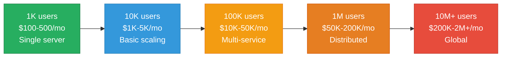
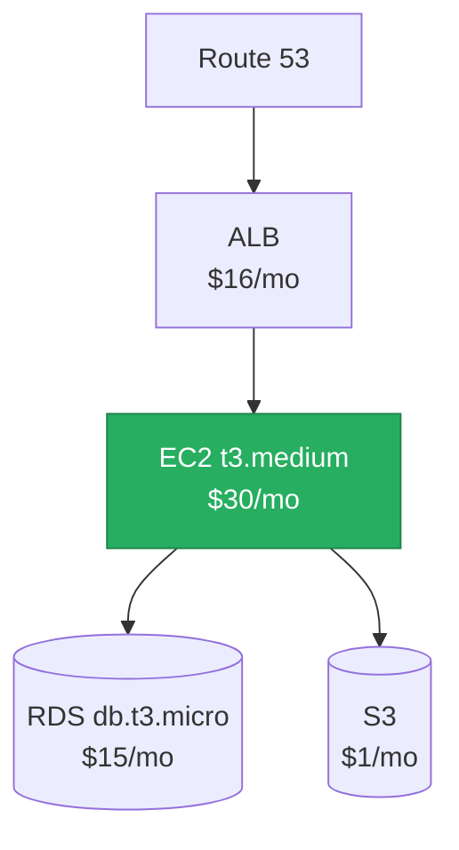
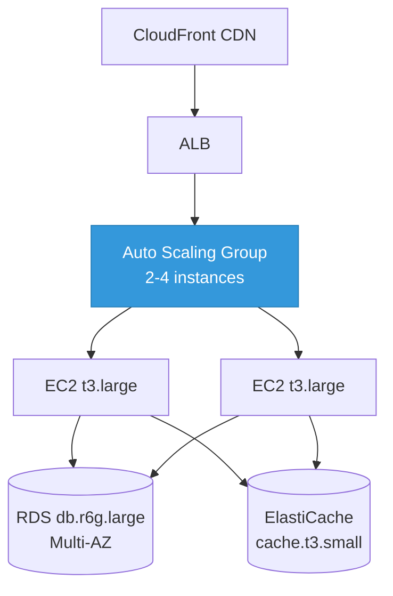
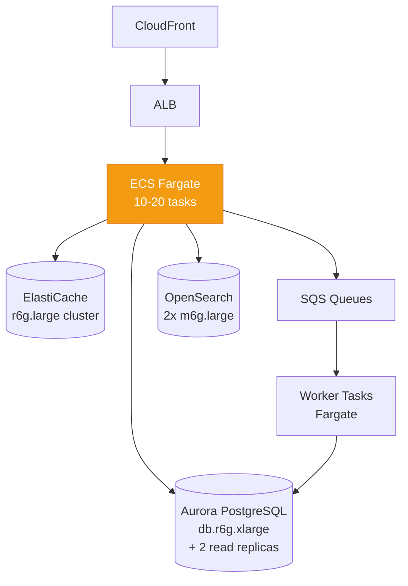
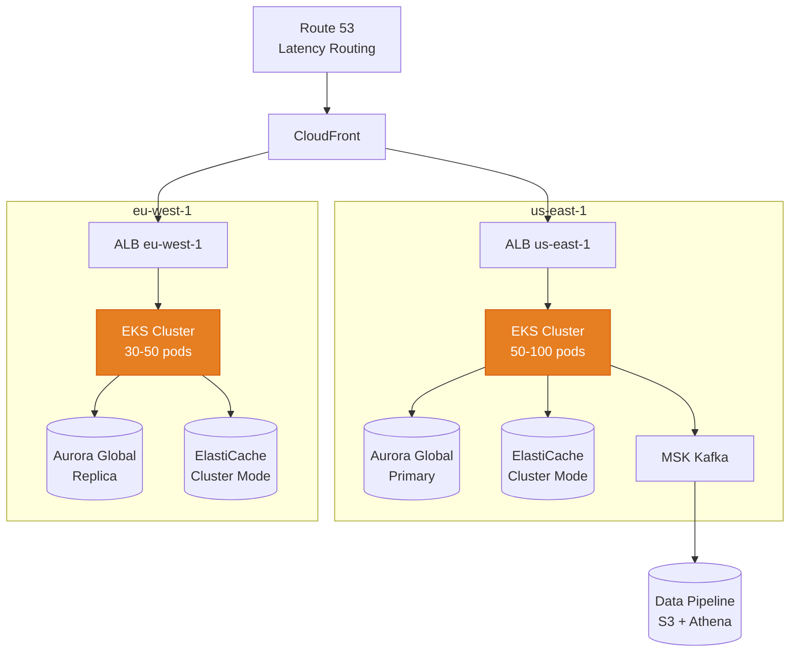
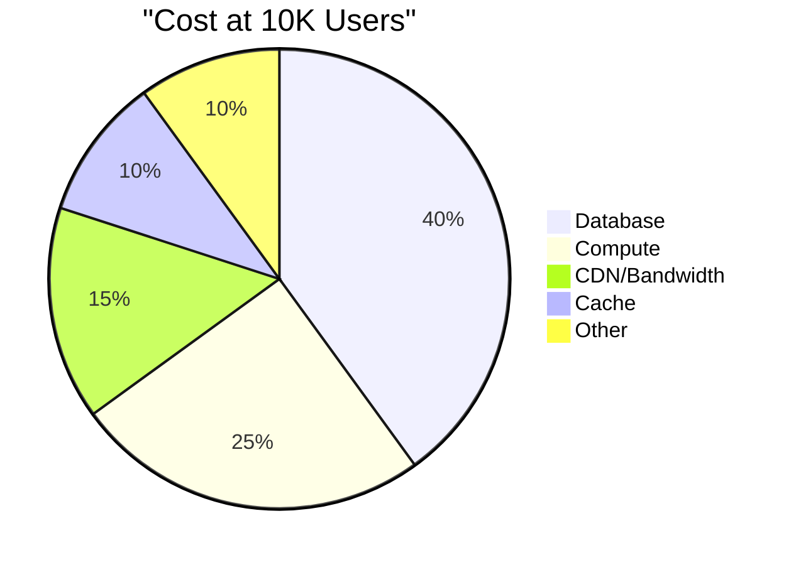
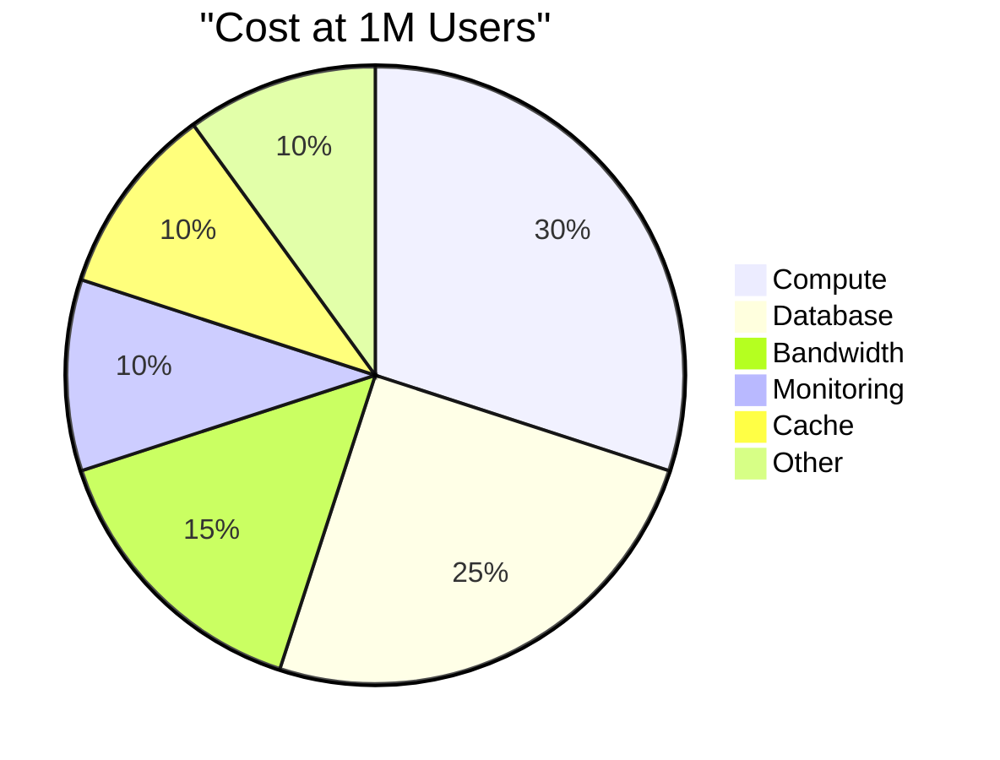
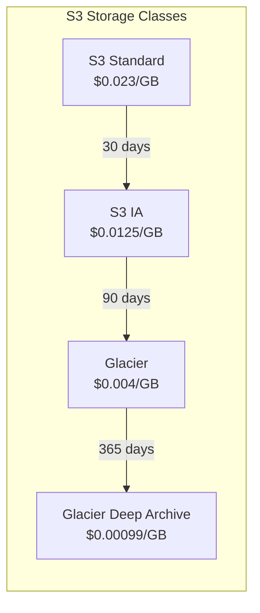

# The Cost of Scale

System design interviews and architecture discussions often ignore the most critical constraint: money. A beautiful architecture that costs $500K/month when your revenue is $100K/month is a failed design. Understanding cloud costs at different scales transforms you from a theoretical architect into a practical one. This page provides real AWS/GCP pricing (2025-2026) at each scale tier, the patterns that save money, and the FinOps mindset every system designer needs.

## The Scale Tiers



## Tier 1: 1,000 Users ($100-500/month)

### Architecture



### Cost Breakdown

| Component | Service | Spec | Monthly Cost |
|-----------|---------|------|:------------:|
| **Compute** | EC2 t3.medium | 2 vCPU, 4GB RAM | $30 |
| **Database** | RDS db.t3.micro | PostgreSQL, 20GB | $15 |
| **Load Balancer** | ALB | Basic routing | $16 |
| **Storage** | S3 | 10GB files | $1 |
| **DNS** | Route 53 | 1 hosted zone | $1 |
| **Monitoring** | CloudWatch | Basic metrics | Free tier |
| **Bandwidth** | Data transfer | ~50GB/mo out | $5 |
| **Total** | | | **~$68/mo** |

**At this scale:** Use a single EC2 instance or a PaaS like Railway/Render ($20-50/mo). Do not over-engineer. A $7/mo DigitalOcean droplet can handle 1K users for most applications.

## Tier 2: 10,000 Users ($1K-5K/month)

### Architecture



### Cost Breakdown

| Component | Service | Spec | Monthly Cost |
|-----------|---------|------|:------------:|
| **Compute** | EC2 t3.large x2 | 2 vCPU, 8GB each | $120 |
| **Database** | RDS db.r6g.large | Multi-AZ, 100GB | $350 |
| **Cache** | ElastiCache t3.small | Redis, single node | $25 |
| **CDN** | CloudFront | 100GB/mo transfer | $10 |
| **Load Balancer** | ALB | ~1M requests/mo | $20 |
| **Storage** | S3 | 100GB | $3 |
| **Monitoring** | CloudWatch + alarms | Custom metrics | $15 |
| **Bandwidth** | Data transfer | ~500GB/mo | $45 |
| **Total** | | | **~$590/mo** |

**Key decisions at this scale:**
- Add a Redis cache to reduce database load
- Enable Multi-AZ for database (doubles cost but prevents downtime)
- CloudFront for static assets and API caching
- Auto Scaling Group to handle traffic spikes

## Tier 3: 100,000 Users ($10K-50K/month)

### Architecture



### Cost Breakdown

| Component | Service | Spec | Monthly Cost |
|-----------|---------|------|:------------:|
| **Compute** | Fargate (API) | 10 tasks, 0.5 vCPU, 1GB | $440 |
| **Compute** | Fargate (Workers) | 5 tasks, 0.5 vCPU, 1GB | $220 |
| **Database** | Aurora PostgreSQL | db.r6g.xlarge + 2 readers | $1,800 |
| **Cache** | ElastiCache r6g.large | 3-node cluster | $540 |
| **Search** | OpenSearch | 2x m6g.large, 500GB | $700 |
| **CDN** | CloudFront | 1TB/mo | $85 |
| **Queues** | SQS | 50M messages/mo | $20 |
| **Load Balancer** | ALB | ~50M requests/mo | $45 |
| **Storage** | S3 | 1TB | $23 |
| **Monitoring** | CloudWatch + X-Ray | Full observability | $200 |
| **Bandwidth** | Data transfer | 5TB/mo | $400 |
| **Secrets** | Secrets Manager | 20 secrets | $8 |
| **Total** | | | **~$4,500/mo** |

**Key decisions at this scale:**
- Move to containers (ECS/Fargate) for better resource utilization
- Aurora for database — automatic failover, read replicas
- Search engine (OpenSearch/Elasticsearch) for complex queries
- SQS for async processing — decouple heavy work from API requests
- Full observability stack becomes mandatory

## Tier 4: 1,000,000 Users ($50K-200K/month)

### Architecture



### Cost Breakdown

| Component | Service | Spec | Monthly Cost |
|-----------|---------|------|:------------:|
| **Compute** | EKS + EC2 | 20x m6i.xlarge (mixed) | $8,500 |
| **Database** | Aurora Global | Primary + 4 readers + 1 global replica | $12,000 |
| **Cache** | ElastiCache | Cluster Mode, 6 shards, 2 replicas each | $4,800 |
| **Streaming** | MSK (Kafka) | 3x kafka.m5.xlarge | $3,200 |
| **Search** | OpenSearch | 6x r6g.xlarge, 3TB | $4,500 |
| **CDN** | CloudFront | 20TB/mo | $1,200 |
| **Queues** | SQS | 500M messages/mo | $200 |
| **Load Balancers** | ALB x2 | ~500M requests/mo | $500 |
| **Storage** | S3 | 50TB | $1,150 |
| **Monitoring** | Datadog (or equiv) | 100 hosts, APM | $5,000 |
| **Bandwidth** | Data transfer | 50TB/mo + cross-region | $4,000 |
| **WAF** | AWS WAF | 500M requests/mo | $300 |
| **Secrets/Config** | SSM + Secrets Manager | 100+ params | $50 |
| **CI/CD** | CodePipeline + builds | Continuous deployment | $200 |
| **Total** | | | **~$45,600/mo** |

## The Cost Progression Curve

| Metric | 1K Users | 10K | 100K | 1M | 10M |
|--------|:--------:|:---:|:----:|:--:|:---:|
| **Monthly cost** | $100 | $600 | $4,500 | $46K | $300K+ |
| **Cost per user** | $0.10 | $0.06 | $0.045 | $0.046 | $0.03 |
| **Biggest cost** | Compute | Database | Database | Compute + DB | Bandwidth + Compute |
| **Team size needed** | 1 | 1-2 | 3-5 | 8-15 | 20+ |
| **Infra engineer needed** | No | Maybe | Yes | Multiple | Team |

### Cost Distribution Shifts with Scale





## Cost Optimization Patterns

### 1. Reserved Instances (30-60% savings)

| Commitment | EC2 Savings | RDS Savings | Best For |
|-----------|:-----------:|:-----------:|---------|
| **No commitment** | 0% | 0% | Unpredictable workloads |
| **1-year, no upfront** | 30-40% | 25-35% | Growing but predictable |
| **1-year, all upfront** | 35-45% | 30-40% | Stable baseline |
| **3-year, all upfront** | 55-65% | 50-60% | Mature, predictable workloads |

```
# Example: 10x m6i.xlarge for API servers
On-Demand:   10 × $0.192/hr × 730 hrs = $1,402/mo
1yr Reserved: 10 × $0.121/hr × 730 hrs = $883/mo  (37% savings)
3yr Reserved: 10 × $0.076/hr × 730 hrs = $555/mo  (60% savings)

Annual savings with 1yr RI: $6,228
Annual savings with 3yr RI: $10,164
```

### 2. Spot Instances (60-90% savings)

Spot instances are unused EC2 capacity available at up to 90% discount. They can be interrupted with 2 minutes notice.

```yaml
# EKS node group with mixed instances (on-demand + spot)
apiVersion: eksctl.io/v1alpha5
kind: ClusterConfig
metadata:
  name: production
  region: us-east-1

managedNodeGroups:
  # Baseline: on-demand for reliability
  - name: baseline
    instanceType: m6i.xlarge
    minSize: 5
    maxSize: 5
    desiredCapacity: 5

  # Burst: spot instances for cost savings
  - name: spot-workers
    instanceTypes:
      - m6i.xlarge
      - m5.xlarge
      - m5a.xlarge  # Diversify to reduce interruption risk
      - m6a.xlarge
    spot: true
    minSize: 0
    maxSize: 20
    desiredCapacity: 10
```

**Safe for spot:**
- Stateless API servers (behind a load balancer)
- Batch processing workers
- CI/CD build agents
- Data pipeline workers

**Not safe for spot:**
- Database servers
- Kafka brokers
- Stateful services
- Single-instance services

### 3. Right-Sizing (20-40% savings)

Most cloud resources are over-provisioned. Right-sizing means matching instance types to actual utilization.

```typescript
// Right-sizing analysis
interface ResourceUtilization {
  instanceId: string;
  instanceType: string;
  avgCpuPercent: number;
  maxCpuPercent: number;
  avgMemoryPercent: number;
  maxMemoryPercent: number;
  monthlyCost: number;
}

function getRecommendation(util: ResourceUtilization): string {
  // If peak CPU < 30% and peak memory < 40%, downsize
  if (util.maxCpuPercent < 30 && util.maxMemoryPercent < 40) {
    return `DOWNSIZE: ${util.instanceType} is over-provisioned. ` +
           `Peak CPU: ${util.maxCpuPercent}%, Peak Memory: ${util.maxMemoryPercent}%. ` +
           `Consider one size smaller.`;
  }

  // If avg CPU > 70%, upsize or add instances
  if (util.avgCpuPercent > 70) {
    return `UPSIZE: ${util.instanceType} is under-provisioned. ` +
           `Avg CPU: ${util.avgCpuPercent}%. Risk of performance issues.`;
  }

  return `RIGHT-SIZED: ${util.instanceType} utilization is appropriate.`;
}
```

### 4. Storage Tiering (50-80% savings on storage)



| Storage Class | Cost/GB/mo | Retrieval | Use Case |
|--------------|:----------:|-----------|---------|
| **S3 Standard** | $0.023 | Instant | Active data |
| **S3 Infrequent Access** | $0.0125 | Instant | Accessed < 1x/month |
| **S3 Glacier Instant** | $0.004 | Milliseconds | Quarterly access |
| **S3 Glacier Flexible** | $0.0036 | 1-12 hours | Annual access |
| **Glacier Deep Archive** | $0.00099 | 12-48 hours | Compliance archives |

For 100TB of data:
- All in Standard: **$2,300/mo**
- With lifecycle policy: **$500/mo** (78% savings)

### 5. Bandwidth Optimization

Data transfer is often the surprise cost at scale.

| Transfer Type | Cost |
|--------------|------|
| Data IN to AWS | Free |
| Data OUT to internet | $0.09/GB (first 10TB) |
| Data between AZs | $0.01/GB |
| Data between regions | $0.02/GB |
| CloudFront to internet | $0.085/GB |
| S3 to CloudFront | Free |

**Optimization strategies:**
1. Use CloudFront — cheaper than direct EC2 egress
2. Enable gzip/brotli compression — 70% reduction in transfer size
3. Use VPC endpoints for S3/DynamoDB — eliminate NAT gateway costs
4. Keep chatty services in the same AZ when possible

### 6. Database Cost Optimization

```
# Aurora PostgreSQL cost comparison

# Scenario: 500GB database, moderate read traffic

# Option A: Single large writer
db.r6g.2xlarge writer: $1,190/mo
Storage: $50/mo
Total: $1,240/mo

# Option B: Smaller writer + read replicas
db.r6g.large writer: $595/mo
db.r6g.large reader x2: $1,190/mo
Storage: $50/mo
Total: $1,835/mo (48% more, but read scaling + HA)

# Option C: Aurora Serverless v2
Min: 2 ACU ($0.12/ACU-hr × 2 × 730 = $175)
Max: 16 ACU (scales up only when needed)
Average usage: 4 ACU ≈ $350/mo
Storage: $50/mo
Total: ~$400/mo for variable workloads (68% savings)
```

## FinOps Basics for System Designers

FinOps is the practice of bringing financial accountability to cloud spending.

### The Three FinOps Pillars

| Pillar | What | Actions |
|--------|------|---------|
| **Inform** | Understand where money goes | Tagging, cost allocation, dashboards |
| **Optimize** | Reduce waste | Right-sizing, RIs, spot, cleanup |
| **Operate** | Continuous governance | Budgets, alerts, anomaly detection |

### Cost Tagging Strategy

```json
{
  "Tags": {
    "Environment": "production",
    "Team": "order-platform",
    "Service": "order-api",
    "CostCenter": "CC-1234",
    "Owner": "alice@company.com"
  }
}
```

### Budget Alerts

```hcl
# Terraform — AWS Budget with alerts
resource "aws_budgets_budget" "monthly" {
  name         = "monthly-total"
  budget_type  = "COST"
  limit_amount = "50000"
  limit_unit   = "USD"
  time_unit    = "MONTHLY"

  notification {
    comparison_operator = "GREATER_THAN"
    threshold           = 80
    threshold_type      = "PERCENTAGE"
    notification_type   = "ACTUAL"
    subscriber_email_addresses = ["infra-team@company.com"]
  }

  notification {
    comparison_operator = "GREATER_THAN"
    threshold           = 100
    threshold_type      = "PERCENTAGE"
    notification_type   = "FORECASTED"
    subscriber_email_addresses = ["infra-team@company.com", "cto@company.com"]
  }
}
```

### Cost Anomaly Detection

```typescript
// Simple cost anomaly detection
interface DailyCost {
  date: string;
  service: string;
  amount: number;
}

function detectAnomalies(costs: DailyCost[], threshold: number = 2): Anomaly[] {
  const anomalies: Anomaly[] = [];

  // Group by service
  const byService = groupBy(costs, 'service');

  for (const [service, dailyCosts] of Object.entries(byService)) {
    const amounts = dailyCosts.map(c => c.amount);
    const mean = average(amounts);
    const stdDev = standardDeviation(amounts);

    // Flag days where cost exceeds mean + threshold * stdDev
    for (const day of dailyCosts) {
      if (day.amount > mean + threshold * stdDev) {
        anomalies.push({
          service,
          date: day.date,
          amount: day.amount,
          expected: mean,
          deviation: (day.amount - mean) / stdDev,
        });
      }
    }
  }

  return anomalies;
}
```

## Quick Reference: AWS vs GCP Pricing

| Service | AWS (us-east-1) | GCP (us-central1) |
|---------|:---------------:|:------------------:|
| **Compute (4 vCPU, 16GB)** | m6i.xlarge: $0.192/hr | e2-standard-4: $0.134/hr |
| **Managed PostgreSQL** | RDS db.r6g.large: $0.26/hr | Cloud SQL db-standard-4: $0.27/hr |
| **Redis (6.4GB)** | ElastiCache r6g.large: $0.25/hr | Memorystore 6GB: $0.25/hr |
| **Object storage** | S3: $0.023/GB | GCS: $0.020/GB |
| **Data egress (first 10TB)** | $0.09/GB | $0.12/GB |
| **Managed Kubernetes** | EKS: $0.10/hr + nodes | GKE: Free + nodes (Autopilot: $0.01/vCPU-hr) |
| **Serverless** | Lambda: $0.20/1M invocations | Cloud Functions: $0.40/1M invocations |

## Key Takeaways

1. **Database is the biggest cost until 1M users** — optimize it first (read replicas, connection pooling, query optimization)
2. **Bandwidth becomes significant at scale** — use CloudFront, compression, and VPC endpoints
3. **Reserved instances are free money** — if you have predictable baseline, commit and save 30-60%
4. **Spot instances for stateless workloads** — 60-90% savings with proper disruption handling
5. **Right-size everything** — most instances run at 10-20% CPU utilization
6. **Tag every resource** — you cannot optimize what you cannot measure
7. **Set budget alerts** — a misconfigured auto-scaler can cost thousands overnight
8. **Aurora Serverless v2** — the best option for variable workloads, can be 60-70% cheaper than provisioned

## Related Pages

- [Serverless Architecture](/system-design/advanced/serverless-architecture) — serverless cost model
- [Multi-Region Design](/system-design/advanced/multi-region-design) — multi-region cost multipliers
- [AWS Cost Optimization](/infrastructure/aws/cost-optimization) — AWS-specific optimization
- [GCP Cost Optimization](/infrastructure/gcp/cost-optimization) — GCP-specific optimization
- [FinOps](/infrastructure/finops) — full FinOps practice guide
- [Capacity Planning](/devops/sre/capacity-planning) — predicting infrastructure needs

## Real-World Examples

::: tip Dropbox
Dropbox saved **nearly $75 million over two years** by migrating from AWS S3 to their own storage infrastructure ("Magic Pocket") in 2016. At their scale (exabytes of data), the economics shifted — owning hardware became cheaper than renting cloud storage. However, they still use AWS for non-storage services, proving that optimization is selective, not all-or-nothing.
:::

::: tip Airbnb
Airbnb reduced their cloud costs by **over $100 million annually** through systematic right-sizing and reserved instance purchases. Their FinOps team built internal dashboards showing cost-per-booking for each service, enabling engineering teams to make informed trade-offs. They found that 40% of their EC2 instances were over-provisioned — running at under 10% CPU utilization.
:::

::: tip Figma
Figma uses **spot instances** for their real-time collaboration rendering pipeline. When a user opens a design, rendering tasks run on spot instances (60-90% cheaper). If a spot instance is interrupted, the task is automatically retried on another instance. The user experiences a brief delay in rendering but never loses data, because state is stored in their database — showing how spot instances work for stateless, interruptible workloads.
:::

## Interview Tip

::: tip What to say
"Cost is a first-class system design constraint. My approach: at early stage, optimize for development speed (use managed services even if they cost more per unit). At 100K+ users, database is the biggest cost — I'd use read replicas and caching before scaling the primary. At 1M+ users, bandwidth and compute dominate — I'd use CloudFront (cheaper than direct EC2 egress), spot instances for stateless workers (60-90% savings), and reserved instances for baseline capacity (30-60% savings). The most impactful optimization is usually the simplest: right-sizing. Airbnb found 40% of their instances were over-provisioned. I'd always tag every resource for cost attribution and set budget alerts — a misconfigured auto-scaler can cost thousands overnight."
:::
