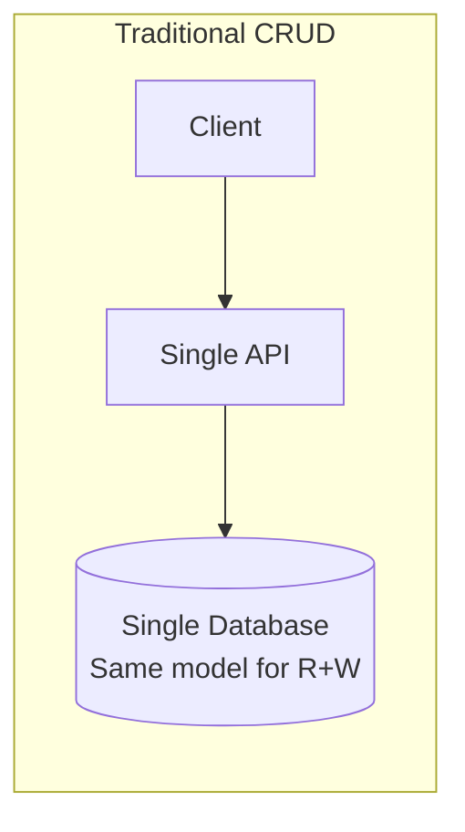
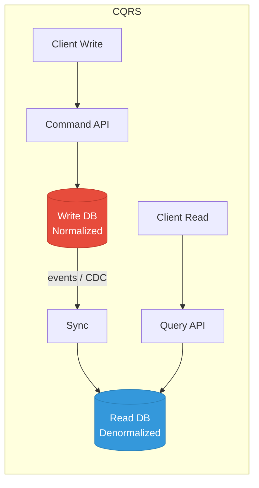
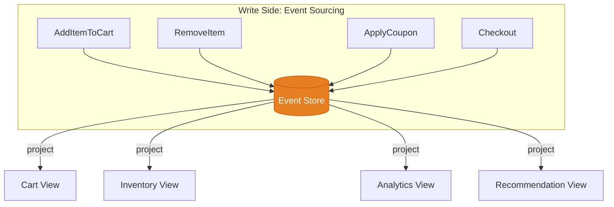
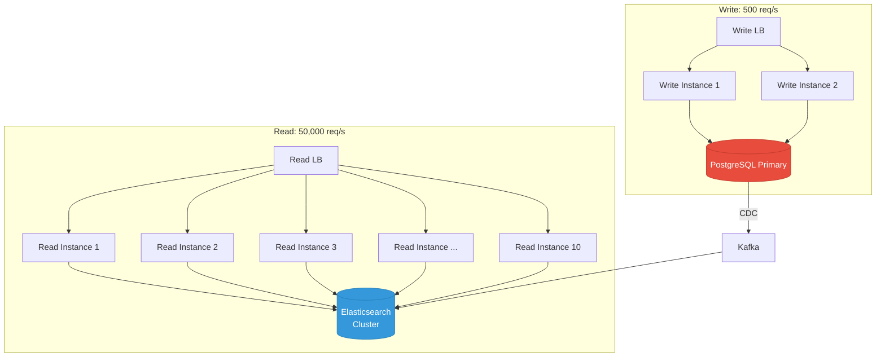
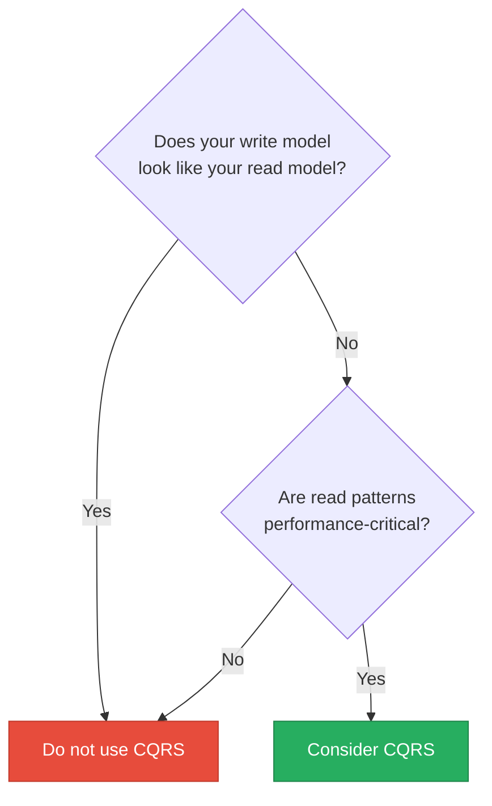
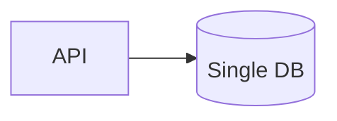
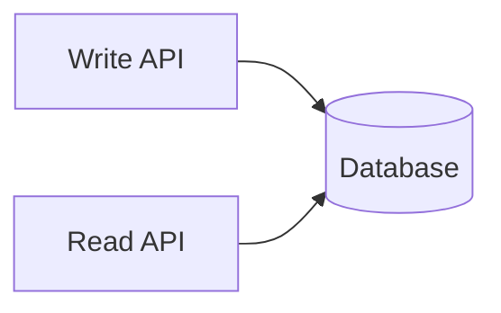
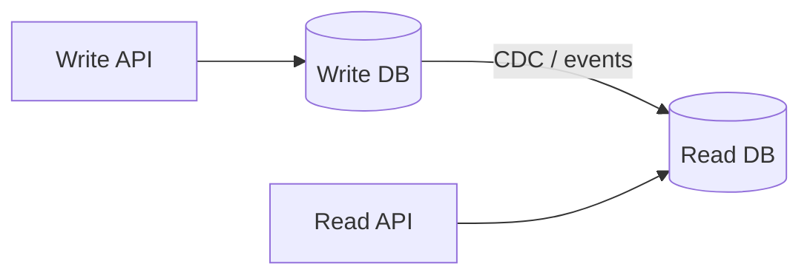
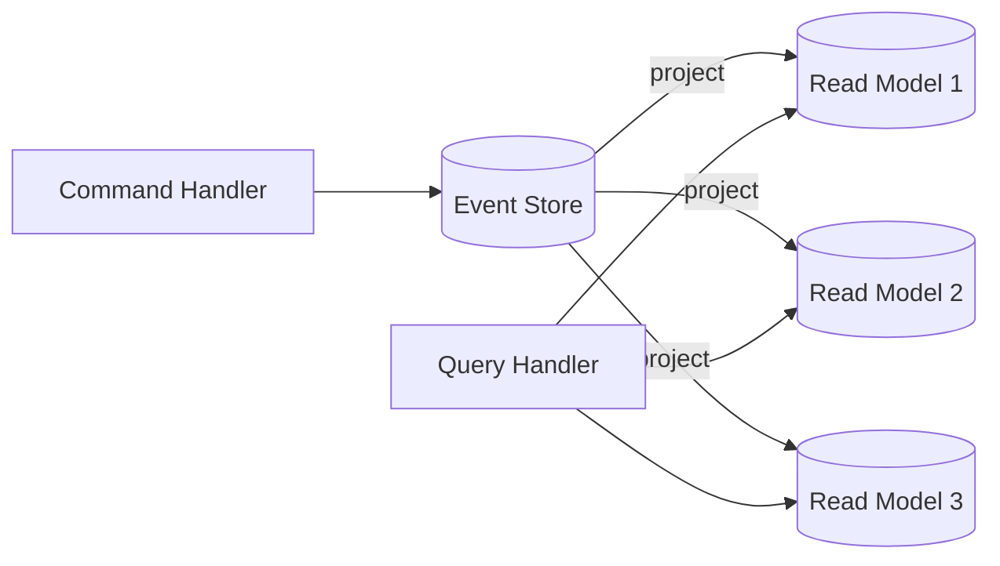

# CQRS: When to Actually Use It

Command Query Responsibility Segregation (CQRS) separates read and write operations into different models, potentially backed by different data stores. It is one of the most over-applied patterns in software engineering. Teams adopt it because it sounds sophisticated, then spend months fighting the complexity it introduces. This page is not about how CQRS works — it is about when you should and should not use it, with honest cost analysis.

## The Core Idea in 30 Seconds





Writes go to a model optimized for consistency and validation. Reads come from a model optimized for query performance. The read model is derived from the write model, usually via events or change data capture.

## When CQRS Actually Helps

### 1. Read/Write Ratio is Extremely Skewed

Most applications are read-heavy (90%+ reads). When reads dominate and the read patterns are fundamentally different from the write patterns, separate models make sense.

**Example: Product catalog**

```typescript
// Write model: normalized, enforces business rules
interface ProductWrite {
  id: string;
  name: string;
  categoryId: string;     // FK to categories
  brandId: string;        // FK to brands
  basePrice: number;
  variants: ProductVariant[];
  inventory: InventoryRecord[];
  status: 'draft' | 'active' | 'archived';
}

// Read model: denormalized for display
interface ProductRead {
  id: string;
  name: string;
  categoryName: string;   // Pre-joined
  categoryPath: string[]; // Pre-computed breadcrumb
  brandName: string;      // Pre-joined
  brandLogo: string;      // Pre-joined
  displayPrice: string;   // Pre-formatted "$29.99"
  lowestPrice: number;    // Pre-computed across variants
  inStock: boolean;       // Pre-computed from inventory
  totalReviews: number;   // Pre-aggregated
  averageRating: number;  // Pre-aggregated
  searchKeywords: string; // Pre-built for search
}
```

The write model has foreign keys and enforces invariants. The read model has pre-joined, pre-computed, pre-formatted data that makes queries trivial. Trying to serve both from a single model means either slow reads (lots of JOINs) or denormalized writes (data integrity risk).

### 2. Read and Write Models Are Structurally Different

When what you write looks nothing like what you read, CQRS eliminates the impedance mismatch.



One stream of events produces four completely different read views. Each view is optimized for its consumer:

| View | Optimized For | Storage |
|------|--------------|---------|
| Cart View | Fast lookups by user ID | Redis |
| Inventory View | Stock queries by product | PostgreSQL |
| Analytics View | Time-series aggregations | ClickHouse |
| Recommendation View | Graph traversals | Neo4j |

### 3. Scaling Reads and Writes Independently

When read and write workloads need different scaling strategies:



The write side scales to handle 500 writes per second on PostgreSQL. The read side scales independently to 50,000 reads per second on an Elasticsearch cluster. Neither impacts the other.

### 4. Cross-Service Query Aggregation

When you need to query data that lives across multiple microservices, CQRS provides a materialized read model. See [Database Per Service](/system-design/advanced/database-per-service) for the full pattern.

### 5. Audit Trail and Temporal Queries

When you need to answer "what did the data look like at time T?" or "what changes happened between T1 and T2?", event sourcing (often paired with CQRS) stores every state change.

```typescript
// Event-sourced write side preserves full history
const accountEvents = [
  { type: 'AccountOpened', data: { balance: 0 }, timestamp: '2026-01-01' },
  { type: 'MoneyDeposited', data: { amount: 1000 }, timestamp: '2026-01-05' },
  { type: 'MoneyWithdrawn', data: { amount: 200 }, timestamp: '2026-01-10' },
  { type: 'MoneyDeposited', data: { amount: 500 }, timestamp: '2026-01-15' },
  { type: 'MoneyWithdrawn', data: { amount: 100 }, timestamp: '2026-01-20' },
];

// Read model for current balance: just the final state
const currentBalance = { accountId: 'acc-1', balance: 1200 };

// But we can also answer: "What was the balance on Jan 12th?"
// Replay events up to that timestamp → $800
```

## When CQRS is Overkill

### 1. Simple CRUD Applications

If your application is fundamentally CRUD — create, read, update, delete with the same shape of data — CQRS adds complexity with no benefit.



**Blog CMS example — CQRS is overkill:**

```typescript
// Write: create a blog post
interface BlogPostWrite {
  title: string;
  content: string;
  authorId: string;
  tags: string[];
  status: 'draft' | 'published';
}

// Read: display a blog post
interface BlogPostRead {
  title: string;
  content: string;
  authorName: string;  // One JOIN
  tags: string[];
  status: 'draft' | 'published';
}

// The difference is ONE JOIN. This does not justify CQRS.
// A simple SQL query with a JOIN handles this perfectly:
// SELECT p.*, u.name as author_name FROM posts p JOIN users u ON p.author_id = u.id
```

### 2. Small Teams (Under 5 Engineers)

CQRS requires maintaining two models, a synchronization mechanism, and handling eventual consistency. A small team's velocity drops significantly.

| Team Size | CQRS Overhead | Recommendation |
|-----------|--------------|----------------|
| 1-3 engineers | 40-50% of dev time on infrastructure | Do not use CQRS |
| 4-8 engineers | 20-30% of dev time on infrastructure | Consider simple CQRS only |
| 8+ engineers | 10-15% of dev time on infrastructure | Full CQRS if needed |

### 3. Low Traffic Applications

If your application handles hundreds or low thousands of requests per second, a well-indexed single database serves both reads and writes fine.

```typescript
// PostgreSQL can handle this without CQRS
// 500 reads/sec + 50 writes/sec on a single db.r5.large instance

// Add read replicas if reads grow
// PostgreSQL primary → 2 read replicas
// Still not CQRS — just standard read replicas
```

### 4. The Domain is Simple

If your business logic is straightforward and does not involve complex aggregations, event processing, or multi-step workflows, CQRS introduces unnecessary abstraction layers.

### 5. Eventual Consistency is Unacceptable

If your users cannot tolerate seeing stale data — even for a few hundred milliseconds — the synchronization lag between write and read models creates UX problems.

```typescript
// The "I just saved but I cannot see my changes" problem
async function updateProfile(userId: string, data: ProfileUpdate) {
  await commandApi.updateProfile(userId, data);  // Writes to write DB

  // Read model has not caught up yet!
  const profile = await queryApi.getProfile(userId);  // Returns stale data
  // User sees old data and thinks the save failed
}

// Mitigation: read-your-writes consistency
async function updateProfile(userId: string, data: ProfileUpdate) {
  const result = await commandApi.updateProfile(userId, data);

  // Option 1: Return the write result directly (bypass read model)
  return result.updatedProfile;

  // Option 2: Include a version/sequence in the write response,
  // poll the read model until it catches up
  await waitForReadModel(userId, result.version);
  return await queryApi.getProfile(userId);
}
```

## The CQRS Spectrum

CQRS is not all-or-nothing. There is a spectrum from simple to full event sourcing.

### Level 0: No CQRS (Standard CRUD)



One model, one database. Most applications should start here and stay here.

### Level 1: Separate Read Endpoints



Same database, but write and read code paths are separated. Read queries can use optimized views or materialized views. **This is where most teams should stop.**

```sql
-- Materialized view for dashboard queries
CREATE MATERIALIZED VIEW order_dashboard AS
SELECT
    o.id,
    o.status,
    o.created_at,
    u.name AS customer_name,
    p.name AS product_name,
    pay.amount,
    pay.status AS payment_status
FROM orders o
JOIN users u ON o.user_id = u.id
JOIN products p ON o.product_id = p.id
LEFT JOIN payments pay ON o.id = pay.order_id;

-- Refresh periodically or on trigger
REFRESH MATERIALIZED VIEW CONCURRENTLY order_dashboard;
```

### Level 2: Separate Read Database



Different databases for reads and writes. The read database is denormalized and optimized for query patterns. This is "real" CQRS.

### Level 3: Full Event Sourcing + CQRS



Events are the source of truth. All state is derived from events. Multiple read models can be built from the same event stream. Maximum flexibility, maximum complexity.

### Complexity Cost at Each Level

| Level | Dev Effort | Ops Effort | Debugging | Consistency |
|-------|-----------|------------|-----------|-------------|
| **0: CRUD** | Low | Low | Easy | Strong (ACID) |
| **1: Separate endpoints** | Low | Low | Easy | Strong (ACID) |
| **2: Separate DB** | Medium | Medium | Moderate | Eventual |
| **3: Event sourcing** | High | High | Hard | Eventual |

## Implementation: Simple CQRS (Level 2)

The most common and practical CQRS implementation uses CDC to sync a write database to a read-optimized store.

```typescript
// Command side: handles writes
class OrderCommandHandler {
  constructor(
    private writeDb: PostgresPool,
    private eventEmitter: EventEmitter,
  ) {}

  async createOrder(cmd: CreateOrderCommand): Promise<string> {
    // Validate business rules against write model
    const product = await this.writeDb.query(
      'SELECT price, stock FROM products WHERE id = $1',
      [cmd.productId]
    );

    if (product.stock < cmd.quantity) {
      throw new InsufficientStockError();
    }

    // Write to normalized write database
    const orderId = await this.writeDb.transaction(async (tx) => {
      const order = await tx.query(
        `INSERT INTO orders (user_id, status, total)
         VALUES ($1, 'pending', $2) RETURNING id`,
        [cmd.userId, product.price * cmd.quantity]
      );

      await tx.query(
        `INSERT INTO order_items (order_id, product_id, quantity, unit_price)
         VALUES ($1, $2, $3, $4)`,
        [order.id, cmd.productId, cmd.quantity, product.price]
      );

      await tx.query(
        `UPDATE products SET stock = stock - $1 WHERE id = $2`,
        [cmd.quantity, cmd.productId]
      );

      return order.id;
    });

    // Emit event for read model sync
    this.eventEmitter.emit('order.created', {
      orderId,
      userId: cmd.userId,
      productId: cmd.productId,
      quantity: cmd.quantity,
      total: product.price * cmd.quantity,
      timestamp: new Date(),
    });

    return orderId;
  }
}

// Query side: handles reads
class OrderQueryHandler {
  constructor(private readDb: ElasticsearchClient) {}

  async searchOrders(query: OrderSearchQuery): Promise<OrderSearchResult> {
    // Read from denormalized read model — no JOINs needed
    const result = await this.readDb.search({
      index: 'orders',
      body: {
        query: {
          bool: {
            must: [
              query.userId ? { term: { userId: query.userId } } : null,
              query.status ? { term: { status: query.status } } : null,
              query.dateRange ? {
                range: {
                  createdAt: {
                    gte: query.dateRange.from,
                    lte: query.dateRange.to,
                  }
                }
              } : null,
              query.search ? {
                multi_match: {
                  query: query.search,
                  fields: ['productName', 'customerName'],
                }
              } : null,
            ].filter(Boolean),
          },
        },
        sort: [{ createdAt: 'desc' }],
        from: query.offset,
        size: query.limit,
      },
    });

    return {
      orders: result.hits.hits.map(h => h._source),
      total: result.hits.total.value,
    };
  }
}
```

### Projection: Syncing Write to Read

```typescript
// Projection listens to events and updates read model
class OrderReadProjection {
  constructor(
    private readDb: ElasticsearchClient,
    private userService: UserServiceClient,
    private productService: ProductServiceClient,
  ) {}

  @OnEvent('order.created')
  async onOrderCreated(event: OrderCreatedEvent) {
    // Enrich with data from other services
    const [user, product] = await Promise.all([
      this.userService.getUser(event.userId),
      this.productService.getProduct(event.productId),
    ]);

    // Write denormalized document to read store
    await this.readDb.index({
      index: 'orders',
      id: event.orderId,
      body: {
        orderId: event.orderId,
        status: 'pending',
        createdAt: event.timestamp,
        total: event.total,
        // Denormalized user data
        userId: user.id,
        customerName: user.name,
        customerEmail: user.email,
        // Denormalized product data
        productId: product.id,
        productName: product.name,
        productCategory: product.category,
        productImage: product.imageUrl,
      },
    });
  }

  @OnEvent('order.status.changed')
  async onOrderStatusChanged(event: OrderStatusChangedEvent) {
    await this.readDb.update({
      index: 'orders',
      id: event.orderId,
      body: {
        doc: {
          status: event.newStatus,
          updatedAt: event.timestamp,
        },
      },
    });
  }
}
```

## Handling Eventual Consistency in UI

The hardest part of CQRS is not the backend — it is the user experience when reads lag behind writes.

### Pattern 1: Optimistic UI Updates

```typescript
// Frontend: update UI immediately, sync later
function useCreateOrder() {
  const queryClient = useQueryClient();

  return useMutation({
    mutationFn: (order: CreateOrderInput) => api.createOrder(order),
    onMutate: async (newOrder) => {
      // Cancel outgoing refetches
      await queryClient.cancelQueries({ queryKey: ['orders'] });

      // Snapshot previous value
      const previousOrders = queryClient.getQueryData(['orders']);

      // Optimistically update the cache
      queryClient.setQueryData(['orders'], (old: Order[]) => [
        { ...newOrder, id: 'temp-id', status: 'pending', createdAt: new Date() },
        ...old,
      ]);

      return { previousOrders };
    },
    onError: (err, newOrder, context) => {
      // Rollback on error
      queryClient.setQueryData(['orders'], context.previousOrders);
    },
    onSettled: () => {
      // Refetch after mutation settles
      queryClient.invalidateQueries({ queryKey: ['orders'] });
    },
  });
}
```

### Pattern 2: Write-Through Read

```typescript
// After write, return the result directly from the write side
async function createOrder(input: CreateOrderInput): Promise<OrderView> {
  const writeResult = await commandApi.createOrder(input);

  // Don't read from read model — construct view from write result
  return {
    orderId: writeResult.id,
    status: writeResult.status,
    total: writeResult.total,
    createdAt: writeResult.createdAt,
    // Accept that some denormalized fields won't be available immediately
    customerName: currentUser.name, // From auth context
    productName: input.productName, // From the form data
  };
}
```

## Decision Checklist

Answer these questions honestly before adopting CQRS:

| Question | If Yes | If No |
|----------|--------|-------|
| Do reads and writes have fundamentally different shapes? | CQRS helps | CRUD is fine |
| Is your read-to-write ratio above 100:1? | CQRS helps | CRUD is fine |
| Do you need multiple read representations of the same data? | CQRS helps | CRUD is fine |
| Can your users tolerate 100ms-1s of stale data? | CQRS is feasible | CQRS adds UX pain |
| Do you have 5+ engineers to maintain it? | Go ahead | Think twice |
| Is your domain complex with many aggregation queries? | CQRS helps | Keep it simple |
| Do you need an audit trail of all changes? | Event sourcing + CQRS | Just add an audit log table |
| Are you building a new greenfield project? | Start with CRUD, add CQRS when pain is real | N/A |

**The golden rule:** Start with the simplest thing that works. Add CQRS only when you feel the pain of not having it. Premature CQRS is a worse sin than premature optimization.

## Related Pages

- [Database Per Service](/system-design/advanced/database-per-service) — CQRS for cross-service reads
- [Kafka Internals](/system-design/message-queues/kafka-internals) — event bus for CQRS projections
- [Event-Driven APIs](/system-design/api-design/event-driven-apis) — designing the events that feed CQRS
- [Elasticsearch Internals](/system-design/databases/elasticsearch-internals) — common read store for CQRS
- [Anti-Patterns](/system-design/advanced/anti-patterns) — premature CQRS as an anti-pattern
- [DDIA Summary](/system-design/advanced/ddia-summary) — Kleppmann's take on derived data
- [Database Selection Guide](/system-design/databases/database-selection-guide) — choosing read and write stores
