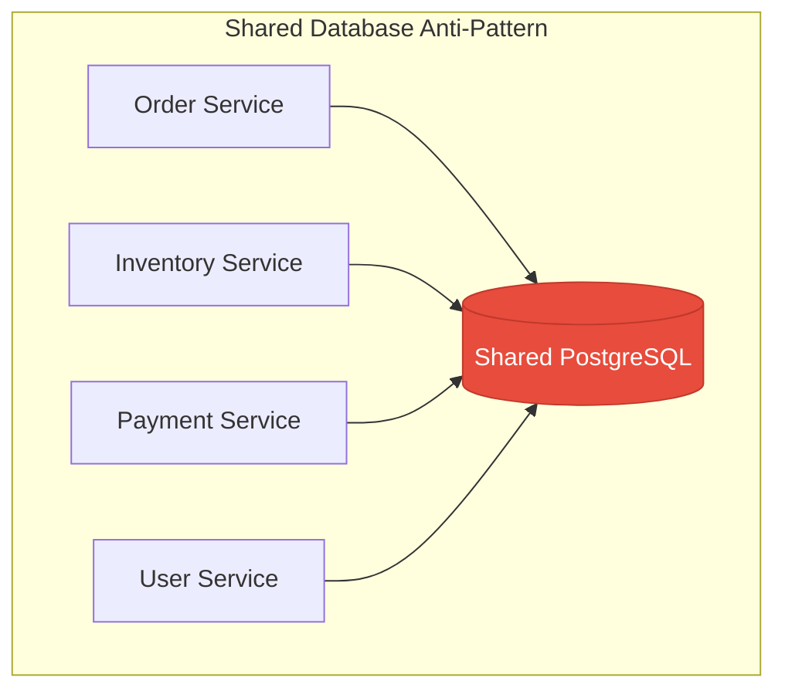
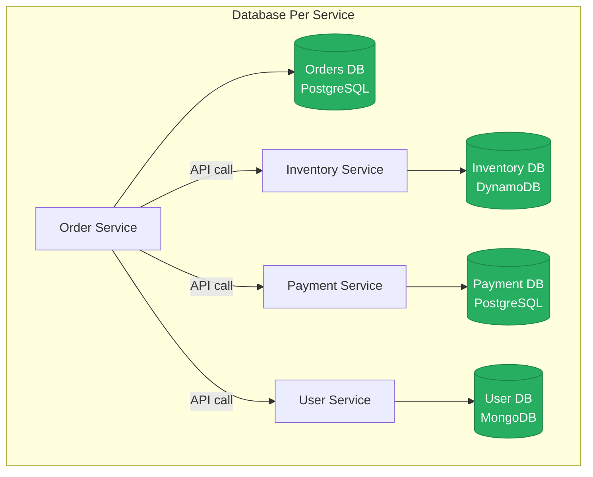
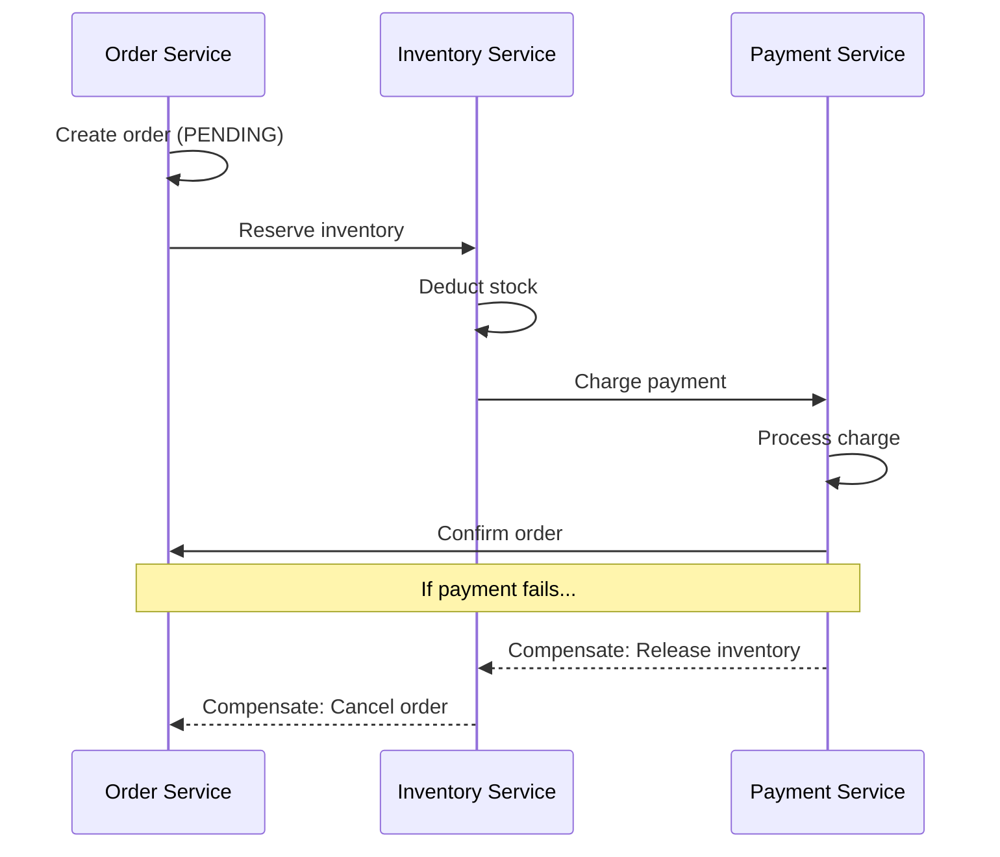
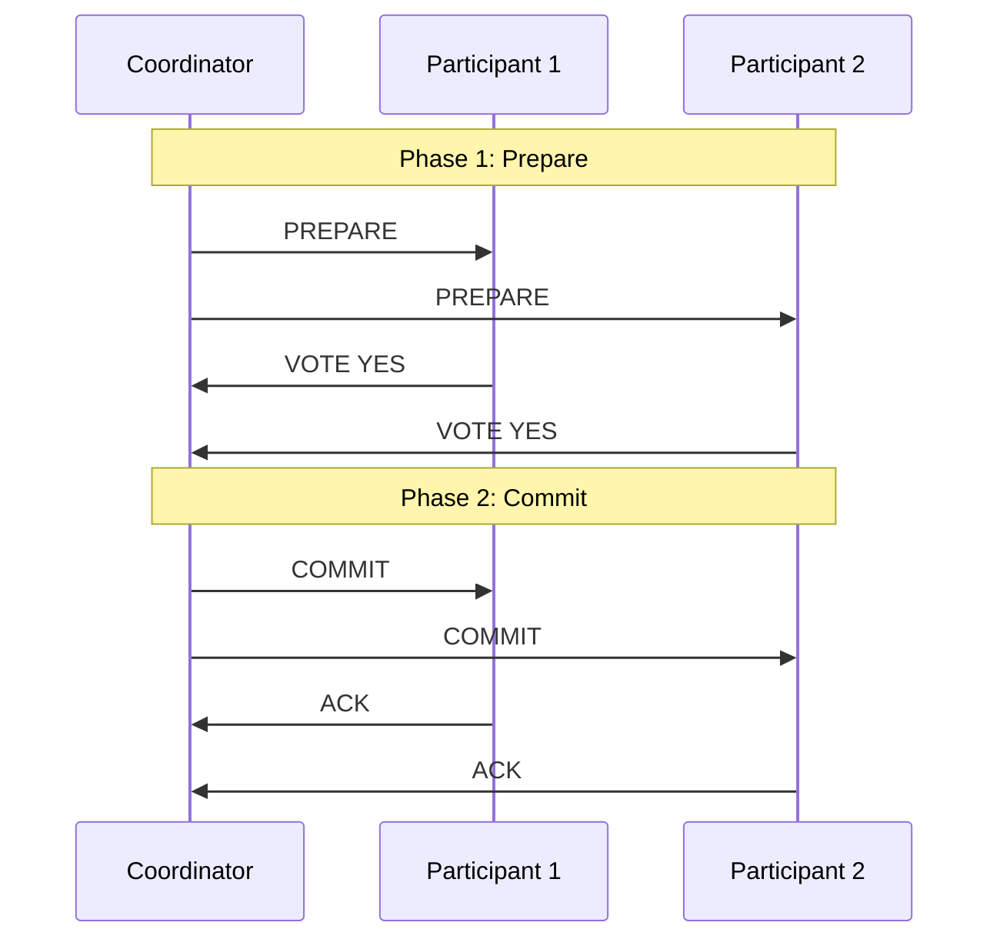
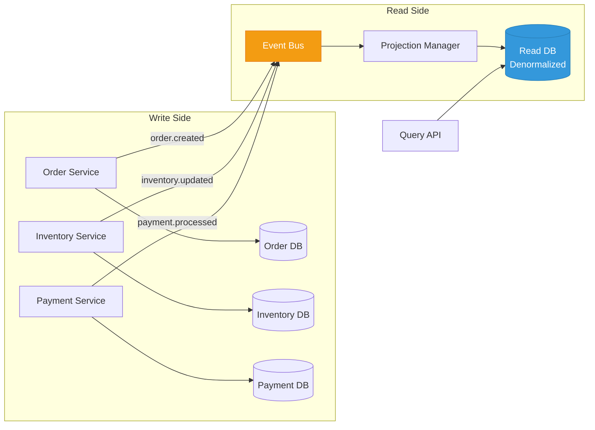
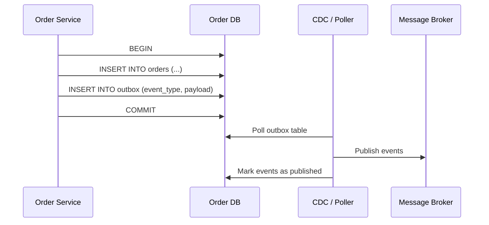
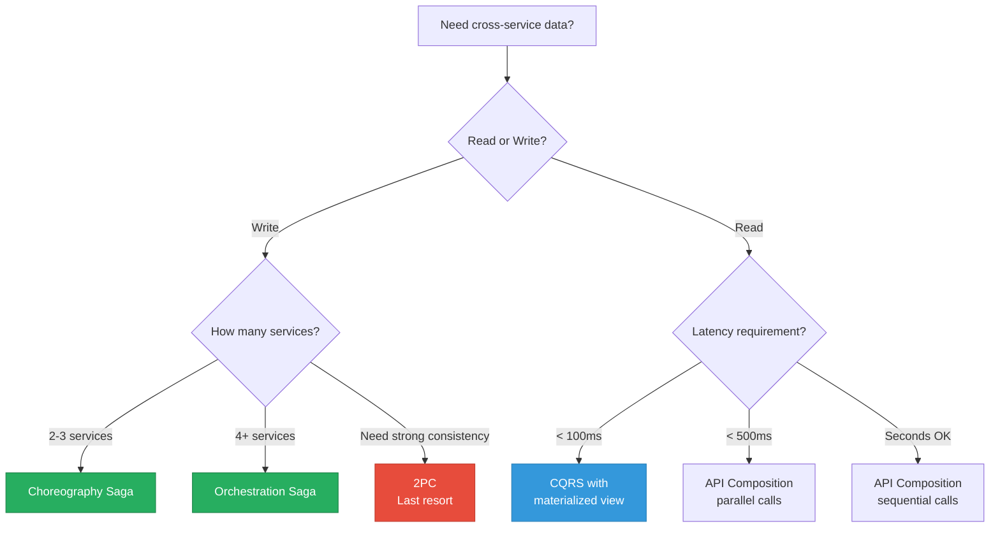
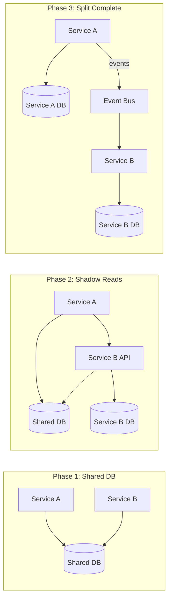
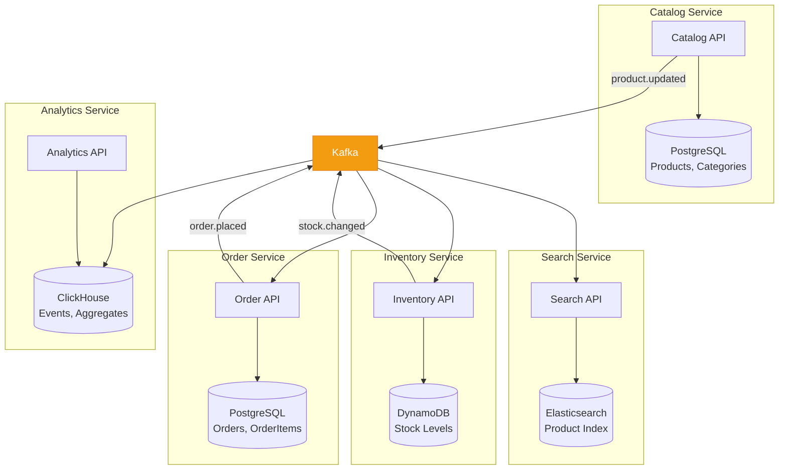

# Database Per Service Pattern

The database-per-service pattern gives each microservice its own dedicated data store. No other service can access that database directly — all data access goes through the owning service's API. This sounds simple until you realize that most business operations span multiple services and you can no longer write a SQL JOIN across them. That constraint is the entire challenge, and solving it well is what separates toy microservices from production-grade distributed systems.

## Why Shared Databases Are a Problem

Before understanding why each service needs its own database, you need to understand what happens when multiple services share one.



### The Seven Problems of Shared Databases

| Problem | Description | Consequence |
|---------|-------------|-------------|
| **Schema coupling** | Service A adds a column, breaks Service B's queries | Coordinated deployments required |
| **Performance coupling** | Service A's heavy query locks tables Service B needs | Cascading slowdowns |
| **Technology lock-in** | All services must use the same DB engine | Cannot use best-fit databases |
| **Scaling limits** | Single DB becomes the bottleneck for all services | Vertical scaling only |
| **Ownership ambiguity** | Who owns the `users` table? Three teams modify it | Data integrity issues |
| **Testing difficulty** | Integration tests need the full shared schema | Slow test suites |
| **Migration nightmares** | Schema changes require coordinating all consuming services | Deployment risk increases with team count |

### A Real-World Horror Story

Consider an e-commerce platform where Order, Inventory, and Payment services share a PostgreSQL instance:

```sql
-- Order Service writes
INSERT INTO orders (user_id, product_id, quantity, status) VALUES (1, 42, 2, 'pending');

-- Inventory Service reads the same table
SELECT o.product_id, SUM(o.quantity)
FROM orders o
WHERE o.status IN ('pending', 'confirmed')
GROUP BY o.product_id;

-- When Order Service renames 'status' to 'order_status'... Inventory Service breaks
```

The moment one team changes a column name, adds an index that slows down writes, or restructures a table, every service touching that table is at risk. With a shared database, you do not have microservices — you have a distributed monolith with extra network hops.

## Database Per Service: The Architecture



### Benefits

1. **Independent deployment** — change your schema without coordinating with other teams
2. **Technology freedom** — use PostgreSQL for transactions, DynamoDB for high-throughput writes, Elasticsearch for search
3. **Independent scaling** — scale the payment DB separately from the inventory DB
4. **Clear ownership** — one team owns the service and its data store
5. **Fault isolation** — if the inventory DB goes down, orders in flight can still be queued

### Implementation Strategies

**Physical separation** — each service gets its own database instance:

```yaml
# docker-compose.yml
services:
  order-db:
    image: postgres:16
    environment:
      POSTGRES_DB: orders
      POSTGRES_USER: order_svc
    ports:
      - "5432:5432"

  inventory-db:
    image: dynamodb-local:latest
    ports:
      - "8000:8000"

  payment-db:
    image: postgres:16
    environment:
      POSTGRES_DB: payments
      POSTGRES_USER: payment_svc
    ports:
      - "5433:5432"
```

**Schema-per-service** (shared instance, separate schemas) — a stepping stone for organizations not ready for full separation:

```sql
-- Each service gets its own schema on the same PostgreSQL instance
CREATE SCHEMA order_service AUTHORIZATION order_user;
CREATE SCHEMA inventory_service AUTHORIZATION inventory_user;
CREATE SCHEMA payment_service AUTHORIZATION payment_user;

-- Enforce isolation: each user can only access their own schema
REVOKE ALL ON ALL TABLES IN SCHEMA order_service FROM inventory_user;
REVOKE ALL ON ALL TABLES IN SCHEMA order_service FROM payment_user;
```

## Data Consistency: The Hard Part

With separate databases, you lose ACID transactions across services. You cannot do this:

```sql
BEGIN;
  INSERT INTO orders.orders (id, product_id, quantity) VALUES (1, 42, 2);
  UPDATE inventory.products SET stock = stock - 2 WHERE id = 42;
  INSERT INTO payments.charges (order_id, amount) VALUES (1, 59.98);
COMMIT;
```

You need distributed consistency patterns instead. Here are the four main approaches.

### 1. Saga Pattern

A saga is a sequence of local transactions where each step either succeeds or triggers a compensating action. See our [Saga Pattern deep dive](/system-design/distributed-systems/distributed-transactions) for full implementation details.



**Choreography vs Orchestration:**

| Aspect | Choreography | Orchestration |
|--------|-------------|---------------|
| **Coordination** | Each service listens to events and reacts | Central orchestrator directs the flow |
| **Coupling** | Lower — services only know about events | Higher — orchestrator knows all steps |
| **Debugging** | Harder — flow is implicit in event handlers | Easier — flow is explicit in one place |
| **Best for** | 2-3 services, simple flows | 4+ services, complex flows with branching |

**Choreography example:**

```typescript
// Order Service
class OrderService {
  async createOrder(dto: CreateOrderDTO): Promise<Order> {
    const order = await this.repo.create({
      ...dto,
      status: OrderStatus.PENDING,
    });

    // Emit event — Inventory Service is listening
    await this.eventBus.publish('order.created', {
      orderId: order.id,
      productId: dto.productId,
      quantity: dto.quantity,
    });

    return order;
  }

  // Listen for downstream results
  @OnEvent('payment.completed')
  async onPaymentCompleted(event: PaymentCompletedEvent) {
    await this.repo.updateStatus(event.orderId, OrderStatus.CONFIRMED);
  }

  @OnEvent('inventory.reservation.failed')
  async onInventoryFailed(event: InventoryFailedEvent) {
    await this.repo.updateStatus(event.orderId, OrderStatus.CANCELLED);
  }
}
```

**Orchestration example:**

```typescript
// Saga Orchestrator
class CreateOrderSaga {
  private steps: SagaStep[] = [
    {
      execute: (ctx) => this.orderService.createOrder(ctx),
      compensate: (ctx) => this.orderService.cancelOrder(ctx.orderId),
    },
    {
      execute: (ctx) => this.inventoryService.reserve(ctx),
      compensate: (ctx) => this.inventoryService.release(ctx.reservationId),
    },
    {
      execute: (ctx) => this.paymentService.charge(ctx),
      compensate: (ctx) => this.paymentService.refund(ctx.chargeId),
    },
  ];

  async execute(input: CreateOrderInput): Promise<SagaResult> {
    const ctx: SagaContext = { ...input };
    const completedSteps: SagaStep[] = [];

    for (const step of this.steps) {
      try {
        const result = await step.execute(ctx);
        Object.assign(ctx, result);
        completedSteps.push(step);
      } catch (error) {
        // Compensate in reverse order
        for (const completed of completedSteps.reverse()) {
          await completed.compensate(ctx);
        }
        throw new SagaFailedError(error);
      }
    }
    return ctx;
  }
}
```

### 2. Two-Phase Commit (2PC)

2PC provides strong consistency but at the cost of availability and performance. It is rarely used in microservices but important to understand.



**Why 2PC is problematic for microservices:**

| Issue | Impact |
|-------|--------|
| **Blocking** | If the coordinator crashes after PREPARE, all participants hold locks forever |
| **Latency** | Two network round trips minimum, with locks held throughout |
| **Availability** | Any participant being down blocks the entire transaction |
| **Heterogeneous DBs** | Not all databases support XA transactions |

### 3. API Composition

For read-only queries that previously used JOINs across tables, the API composition pattern aggregates data from multiple services at the application layer.

```typescript
// API Composition Service
class OrderDetailsComposer {
  async getOrderDetails(orderId: string): Promise<OrderDetailsView> {
    // Parallel calls to owning services
    const [order, inventory, payment, user] = await Promise.all([
      this.orderService.getOrder(orderId),
      this.inventoryService.getProduct(order.productId),
      this.paymentService.getCharge(orderId),
      this.userService.getUser(order.userId),
    ]);

    return {
      orderId: order.id,
      status: order.status,
      product: {
        name: inventory.name,
        sku: inventory.sku,
        inStock: inventory.stock > 0,
      },
      payment: {
        amount: payment.amount,
        method: payment.method,
        status: payment.status,
      },
      customer: {
        name: user.name,
        email: user.email,
      },
    };
  }
}
```

**Challenges with API composition:**

- **Latency** — even with parallel calls, you are bounded by the slowest service
- **Availability** — if any service is down, the composed response is incomplete
- **Data consistency** — data from different services may be at different points in time
- **Complexity** — filtering, sorting, and pagination across services is extremely hard

### 4. CQRS for Cross-Service Queries

When API composition becomes too slow or complex, CQRS (Command Query Responsibility Segregation) provides a dedicated read model that pre-joins data from multiple services. See our [CQRS deep dive](/system-design/advanced/cqrs-when-to-use) for detailed guidance.



```typescript
// Projection that materializes cross-service data
class OrderDashboardProjection {
  @OnEvent('order.created')
  async onOrderCreated(event: OrderCreatedEvent) {
    await this.readDb.upsert('order_dashboard', {
      orderId: event.orderId,
      status: event.status,
      createdAt: event.timestamp,
      userId: event.userId,
    });
  }

  @OnEvent('payment.processed')
  async onPaymentProcessed(event: PaymentProcessedEvent) {
    await this.readDb.update('order_dashboard', event.orderId, {
      paymentStatus: event.status,
      paymentAmount: event.amount,
      paymentMethod: event.method,
    });
  }

  @OnEvent('inventory.shipped')
  async onInventoryShipped(event: InventoryShippedEvent) {
    await this.readDb.update('order_dashboard', event.orderId, {
      shippingStatus: 'shipped',
      trackingNumber: event.trackingNumber,
    });
  }
}
```

## Join Elimination Strategies

The number one objection to database-per-service is "but I need JOINs." Here are concrete strategies to eliminate cross-service JOINs.

### Strategy 1: Data Denormalization via Events

Store a copy of the data you need from other services. Keep it updated via events.

```typescript
// Inventory Service listens for product name changes from Catalog Service
@OnEvent('catalog.product.updated')
async onProductUpdated(event: ProductUpdatedEvent) {
  // Store just the fields we need locally
  await this.localProductCache.upsert({
    productId: event.productId,
    name: event.name,        // Denormalized from Catalog
    category: event.category, // Denormalized from Catalog
  });
}

// Now Inventory queries can "join" with product info locally
async getInventoryReport(): Promise<InventoryReport[]> {
  return this.db.query(`
    SELECT i.product_id, i.stock, i.warehouse,
           p.name, p.category
    FROM inventory i
    JOIN local_product_cache p ON i.product_id = p.product_id
    WHERE i.stock < i.reorder_threshold
  `);
}
```

### Strategy 2: Materialized Views via Event Sourcing

```typescript
// Build a materialized view from events across services
class SalesReportMaterializer {
  async rebuild(): Promise<void> {
    const events = await this.eventStore.readAll([
      'order.confirmed',
      'payment.settled',
      'inventory.shipped',
    ]);

    for (const event of events) {
      await this.applyEvent(event);
    }
  }

  private async applyEvent(event: DomainEvent): Promise<void> {
    switch (event.type) {
      case 'order.confirmed':
        await this.db.upsert('sales_report', {
          orderId: event.data.orderId,
          orderDate: event.timestamp,
          amount: event.data.totalAmount,
        });
        break;

      case 'payment.settled':
        await this.db.update('sales_report', event.data.orderId, {
          paymentDate: event.timestamp,
          netRevenue: event.data.netAmount,
        });
        break;

      case 'inventory.shipped':
        await this.db.update('sales_report', event.data.orderId, {
          shipDate: event.timestamp,
          fulfillmentCost: event.data.shippingCost,
        });
        break;
    }
  }
}
```

### Strategy 3: Shared IDs, Not Shared Data

Services reference each other by ID. The UI or BFF layer resolves the references when needed.

```typescript
// Order stores userId, not user details
interface Order {
  id: string;
  userId: string;       // Reference, not embedded data
  productId: string;    // Reference, not embedded data
  quantity: number;
  status: OrderStatus;
}

// BFF resolves references for the frontend
class OrderBFF {
  async getOrderForUI(orderId: string): Promise<OrderUIResponse> {
    const order = await this.orderClient.getOrder(orderId);
    const [user, product] = await Promise.all([
      this.userClient.getUser(order.userId),
      this.catalogClient.getProduct(order.productId),
    ]);

    return { ...order, user, product };
  }
}
```

## Event-Driven Synchronization

Events are the glue that keeps data consistent across services without tight coupling. See our [Kafka Internals](/system-design/message-queues/kafka-internals) and [Event-Driven APIs](/system-design/api-design/event-driven-apis) pages for implementation details.

### Outbox Pattern

The outbox pattern ensures events are published reliably by writing them to a local outbox table in the same transaction as the business data.



```typescript
class OrderService {
  async createOrder(dto: CreateOrderDTO): Promise<Order> {
    return this.db.transaction(async (tx) => {
      // Business operation
      const order = await tx.insert('orders', {
        userId: dto.userId,
        productId: dto.productId,
        quantity: dto.quantity,
        status: 'pending',
      });

      // Outbox entry in the same transaction
      await tx.insert('outbox', {
        aggregateType: 'Order',
        aggregateId: order.id,
        eventType: 'order.created',
        payload: JSON.stringify({
          orderId: order.id,
          userId: dto.userId,
          productId: dto.productId,
          quantity: dto.quantity,
        }),
        createdAt: new Date(),
      });

      return order;
    });
  }
}
```

### Change Data Capture (CDC)

Instead of the application publishing events, CDC tools like Debezium watch the database transaction log and emit events automatically.

```yaml
# Debezium connector configuration
{
  "name": "orders-connector",
  "config": {
    "connector.class": "io.debezium.connector.postgresql.PostgresConnector",
    "database.hostname": "orders-db",
    "database.port": "5432",
    "database.user": "debezium",
    "database.dbname": "orders",
    "table.include.list": "public.orders",
    "topic.prefix": "orders",
    "plugin.name": "pgoutput"
  }
}
```

## Decision Framework

Use this decision tree to choose your data consistency approach:



## Migration: From Shared DB to Database Per Service

### Step-by-Step Migration

1. **Identify data ownership** — map every table to the service that should own it
2. **Create service APIs** — build APIs for data currently accessed via direct SQL
3. **Strangler fig** — route reads through the API, writes still go to shared DB
4. **Dual writes (temporary)** — write to both shared DB and service DB, compare results
5. **Switch reads** — point reads to the service DB
6. **Switch writes** — point writes to the service DB
7. **Decommission** — remove shared DB access



### Common Pitfalls During Migration

| Pitfall | Solution |
|---------|----------|
| Foreign key constraints across service boundaries | Replace with eventual consistency and event-based sync |
| Reporting queries that JOIN everything | Build a dedicated reporting database with CQRS |
| Stored procedures that span multiple domains | Decompose into service-level logic |
| Shared sequences/auto-increments | Use UUIDs or service-specific ID generators |
| Database-level triggers | Replace with application-level event handlers |

## Real-World Example: E-Commerce Platform



Each service uses the database technology best suited to its workload:

- **Catalog** → PostgreSQL for relational product data with complex queries
- **Orders** → PostgreSQL for transactional integrity
- **Inventory** → DynamoDB for high-throughput writes and low-latency reads
- **Search** → Elasticsearch for full-text search and faceted filtering
- **Analytics** → ClickHouse for columnar aggregations on billions of events

## Key Takeaways

1. **Shared databases create coupling** that defeats the purpose of microservices
2. **Database per service enables** independent deployment, scaling, and technology choice
3. **Sagas replace distributed transactions** — use choreography for simple flows, orchestration for complex ones
4. **API composition handles simple reads** — parallel calls to multiple services
5. **CQRS handles complex reads** — pre-materialized views updated via events
6. **The outbox pattern** ensures reliable event publishing without dual-write problems
7. **Migration is incremental** — use the strangler fig pattern to decompose a shared database gradually

## Related Pages

- [Distributed Transactions](/system-design/distributed-systems/distributed-transactions) — saga pattern implementation details
- [CQRS: When to Actually Use It](/system-design/advanced/cqrs-when-to-use) — deciding when CQRS complexity is worth it
- [Kafka Internals](/system-design/message-queues/kafka-internals) — the event bus that powers cross-service sync
- [Event-Driven APIs](/system-design/api-design/event-driven-apis) — designing event schemas and contracts
- [Anti-Patterns](/system-design/advanced/anti-patterns) — shared database is anti-pattern #3
- [Database Selection Guide](/system-design/databases/database-selection-guide) — choosing the right DB per service

## Real-World Examples

::: tip Netflix
Netflix uses **database-per-service with polyglot persistence** across 200+ microservices. Their Catalog Service uses Cassandra (high-throughput reads for browsing), the Viewing History Service uses Cassandra (massive write volume), the Billing Service uses MySQL (ACID transactions), and their Recommendation Service uses custom data stores optimized for ML model serving. Each team chooses the database that best fits their access patterns.
:::

::: tip Uber
Uber migrated from a **shared PostgreSQL database to database-per-service** using the Schemaless architecture. Their Trips Service uses Schemaless (custom append-only datastore), the Marketplace Service uses an in-memory geospatial database for driver matching, and the Payments Service uses MySQL for financial ACID compliance. They use Kafka as the event backbone to keep data synchronized across services.
:::

::: tip Wix
Wix uses the **outbox pattern** with Debezium CDC to reliably publish events from their databases. When their Site Service writes a new site to MySQL, Debezium reads the MySQL binlog and publishes the event to Kafka — guaranteeing that every database write produces exactly one event without dual-write problems. This powers their search indexing, analytics, and notification services.
:::

## Interview Tip

::: tip What to say
"Database-per-service is essential for true microservice independence, but it creates two hard problems: cross-service writes and cross-service reads. For writes, I'd use the saga pattern — choreography for simple 2-3 step flows, orchestration for complex flows with branching. For reads that previously used JOINs, I'd start with API composition (parallel calls in a BFF layer) and move to CQRS with materialized views when latency requirements demand pre-joined data. The outbox pattern solves reliable event publishing — writing the event and the business data in the same database transaction, then using CDC to publish to Kafka. The key insight is that this complexity is the cost of independent deployment and scaling — it's not always worth it."
:::
