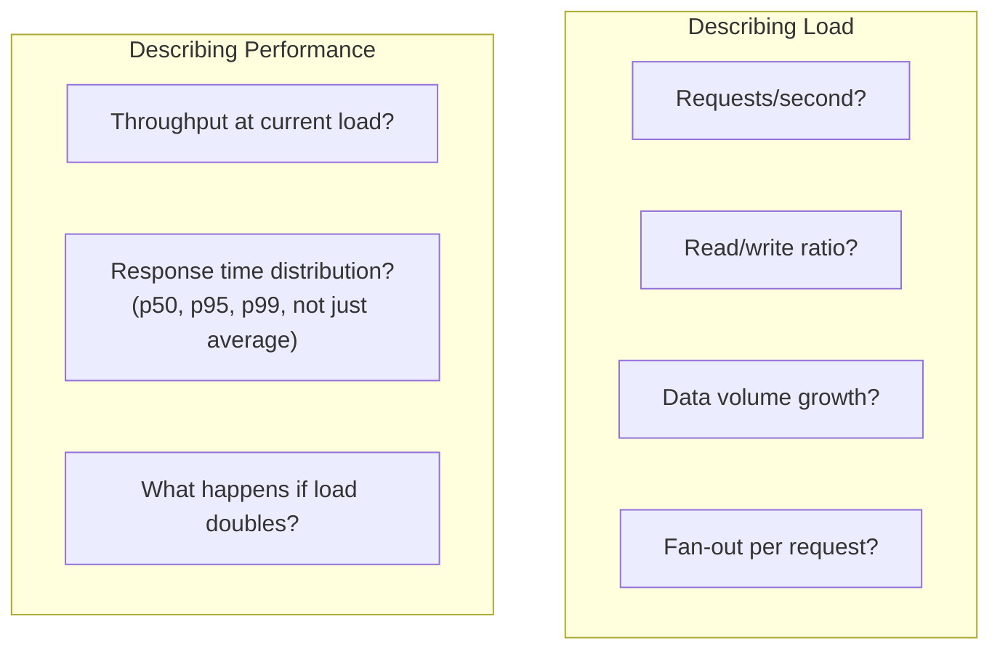
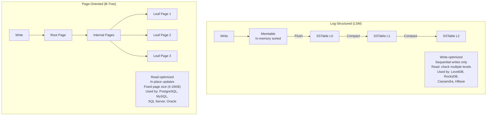
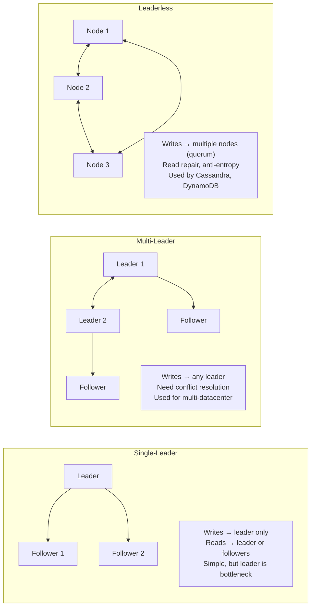
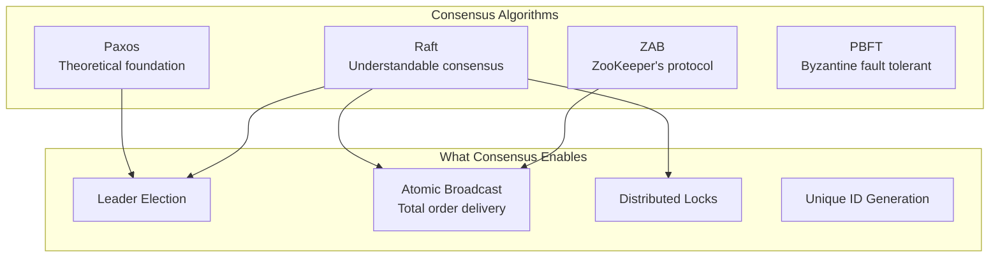
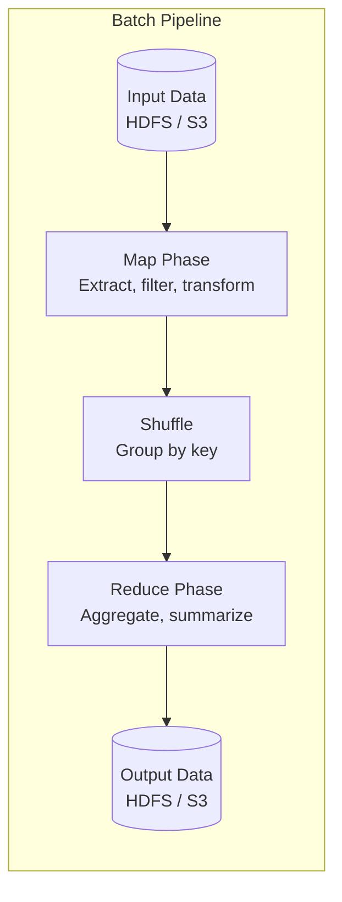
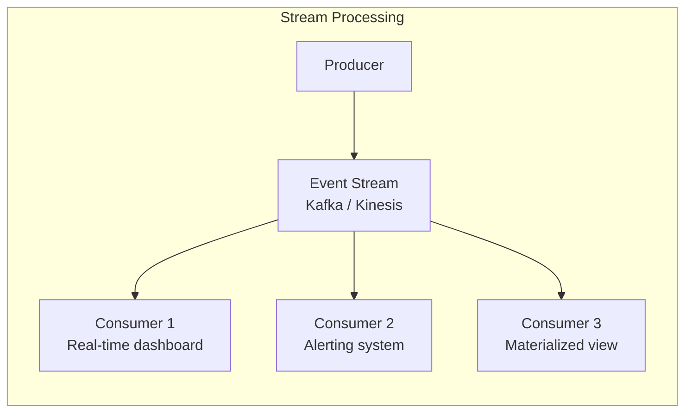
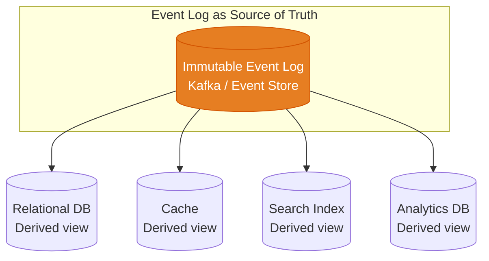

# Designing Data-Intensive Applications Summary

Martin Kleppmann's *Designing Data-Intensive Applications* (DDIA) is the most important book in modern system design. It covers the fundamental principles behind the databases, message queues, and distributed systems you use daily. This page summarizes each part with the key concepts, connects them to our deep-dive pages, and highlights the insights that matter most for system design interviews and real-world architecture.

## Part I: Foundations of Data Systems

### Chapter 1: Reliable, Scalable, and Maintainable Applications

Every data system must balance three goals:

| Goal | Definition | Threats |
|------|-----------|---------|
| **Reliability** | System works correctly even when things go wrong | Hardware faults, software bugs, human errors |
| **Scalability** | System handles growth in data, traffic, or complexity | Load increases, data growth |
| **Maintainability** | System can be worked on productively over time | Complexity, knowledge silos, technical debt |

**Key insight:** Reliability is not just "stays up." It means the system performs correctly (returns right answers), tolerates faults (hardware, software, human), and prevents unauthorized access. A system that returns wrong answers with 100% uptime is not reliable.

**Scalability is not "handles any load."** It is the ability to describe load (what are your key parameters?), describe performance (what happens when load increases?), and identify approaches for coping with growth.

**Maintainability has three sub-goals:**

- **Operability** — easy for ops teams to keep running (monitoring, automation, documentation)
- **Simplicity** — easy for new engineers to understand (abstractions, clean APIs)
- **Evolvability** — easy to make changes (decoupled modules, clear boundaries)

### Chapter 2: Data Models and Query Languages

The data model shapes how you think about the problem. The choice between relational, document, and graph models is not about technology preference — it is about the shape of your data and access patterns.

| Model | Structure | Best For | Weakness |
|-------|----------|---------|----------|
| **Relational** | Tables, rows, foreign keys | Structured data with relationships, complex joins | Schema rigidity, object-relational mismatch |
| **Document** | Nested JSON/BSON documents | Self-contained objects, variable schemas | Poor joins, data duplication |
| **Graph** | Nodes + edges | Highly connected data, relationship queries | Complex query optimization |

**Key insight:** Document databases are not "schema-less" — they are "schema-on-read." The schema still exists; it is just enforced by the application code instead of the database. This trades database-level guarantees for application-level flexibility.

**The relational vs document debate** is really about: do your data items have many relationships (relational wins), or do your data items are mostly self-contained (document wins)?

See our [Database Selection Guide](/system-design/databases/database-selection-guide) and [Graph Databases](/system-design/databases/graph-databases).

### Chapter 3: Storage and Data Structures

How databases physically store and retrieve data. The two main families:

| Engine | Write Speed | Read Speed | Space Amplification | Use Case |
|--------|:-----------:|:----------:|:-------------------:|---------|
| **LSM-Tree** | Faster (sequential writes) | Slower (check multiple levels) | Lower (compaction) | Write-heavy: logs, time-series |
| **B-Tree** | Slower (random I/O for in-place updates) | Faster (single tree traversal) | Higher (page overhead) | Read-heavy: OLTP, indexes |

See our [Storage Engines](/system-design/databases/storage-engines) and [Write-Ahead Logging](/system-design/databases/write-ahead-logging) pages.

### Chapter 4: Encoding and Evolution

Data encoding (serialization) matters more than most engineers think. When you change a schema, old code must read new data (backward compatibility) and new code must read old data (forward compatibility).

| Format | Human-Readable | Schema | Size | Speed | Compatibility |
|--------|:--------------:|:------:|:----:|:-----:|:-------------:|
| **JSON** | Yes | External (JSON Schema) | Large | Slow | Manual |
| **Protocol Buffers** | No | Built-in (.proto files) | Small | Fast | Excellent |
| **Avro** | No | Built-in (schema registry) | Smallest | Fast | Best (schema evolution) |
| **Thrift** | No | Built-in (.thrift files) | Small | Fast | Good |

**Key insight:** Schema evolution is critical for zero-downtime deployments. You cannot update all producers and consumers simultaneously. Avro and Protocol Buffers handle this gracefully with field numbering and optional fields.

See our [gRPC Internals](/system-design/networking/grpc-internals) (which uses Protocol Buffers).

## Part II: Distributed Data

### Chapter 5: Replication

Replication keeps copies of data on multiple machines for reliability, availability, and latency reduction.

**Key insight:** Replication lag is not a bug — it is a feature of asynchronous replication. The question is not whether lag exists, but what guarantees your application needs:

| Guarantee | Meaning | Implementation |
|-----------|---------|----------------|
| **Read-your-writes** | You see your own writes immediately | Route reads to leader after write |
| **Monotonic reads** | You never see time go backward | Pin user to same replica |
| **Consistent prefix reads** | You see causally related writes in order | Use causal ordering |

See our [Replication](/system-design/databases/replication) and [Consistency Models](/system-design/distributed-systems/consistency-models) pages.

### Chapter 6: Partitioning (Sharding)

Partitioning splits data across nodes so each node handles a subset. This is the primary mechanism for scaling beyond a single machine.

| Strategy | How It Works | Pros | Cons |
|----------|-------------|------|------|
| **Key range** | Partition by range (A-F, G-M, N-Z) | Range scans are efficient | Hot spots if keys are sequential |
| **Hash** | Partition by hash(key) % N | Even distribution | Range scans require scatter-gather |
| **Composite** | Hash the first part, range on the second | Balanced for time-series-like data | More complex routing |

**Key insight:** The hardest problem in partitioning is not splitting data — it is handling operations that span multiple partitions. A query that touches one partition is fast. A query that touches all partitions (scatter-gather) is slow. Design your partition key to match your access patterns.

See our [Sharding](/system-design/databases/sharding) and [Consistent Hashing](/system-design/distributed-systems/consistent-hashing) pages.

### Chapter 7: Transactions

Transactions provide safety guarantees grouped under ACID:

| Property | Meaning | Reality |
|----------|---------|---------|
| **Atomicity** | All or nothing — if any part fails, everything is rolled back | Well-implemented everywhere |
| **Consistency** | Application invariants are always maintained | Actually the application's responsibility |
| **Isolation** | Concurrent transactions don't interfere with each other | The complicated one — many levels |
| **Durability** | Committed data survives crashes | WAL + fsync, but not absolute (disk failure) |

**Isolation levels (from weakest to strongest):**

| Level | Prevents | Allows | Performance |
|-------|----------|--------|:-----------:|
| **Read Uncommitted** | Nothing | Dirty reads, non-repeatable reads, phantoms | Fastest |
| **Read Committed** | Dirty reads | Non-repeatable reads, phantoms | Fast |
| **Snapshot Isolation** | Dirty reads, non-repeatable reads | Write skew, phantoms | Medium |
| **Serializable** | Everything | Nothing | Slowest |

**Key insight:** Most databases default to Read Committed (PostgreSQL) or Repeatable Read (MySQL/InnoDB). True serializable isolation is rare in practice because of performance cost. Understanding the anomalies each level permits is crucial for designing correct systems.

See our [Isolation Levels](/system-design/databases/isolation-levels) and [MVCC](/system-design/databases/mvcc) pages.

### Chapter 8: The Trouble with Distributed Systems

This chapter is a cold shower of reality. In distributed systems, you cannot rely on:

| Assumption | Reality |
|-----------|---------|
| The network is reliable | Packets get lost, delayed, duplicated, reordered |
| Latency is zero | Cross-datacenter: 100ms+, cross-continent: 200ms+ |
| Clocks are synchronized | Clock skew of seconds is common; NTP is best-effort |
| Nodes don't fail | Any node can crash at any time, including mid-operation |

**Partial failures** are the defining characteristic of distributed systems. In a single machine, either everything works or everything fails. In a distributed system, some parts can fail while others continue — and you cannot always tell which is which.

**Key insight:** "I sent a request and got no response" is ambiguous. The request may have been lost. The response may have been lost. The remote node may be dead. The remote node may be alive but slow. You cannot distinguish these cases without additional mechanisms (timeouts, heartbeats, consensus protocols).

See our [Failure Detectors](/system-design/distributed-systems/failure-detectors) and [CAP Theorem](/system-design/distributed-systems/cap-theorem) pages.

### Chapter 9: Consistency and Consensus

Consensus is the fundamental problem of distributed systems: getting multiple nodes to agree on a value.

**Linearizability** is the strongest consistency model — every operation appears to take effect atomically at some point between invocation and response. It is expensive (requires coordination) and often unnecessary.

**Key insight:** Most applications do not need linearizability. They need causal consistency (if A happened before B, everyone sees them in that order). Causal consistency is achievable without the performance penalty of linearizability.

See our [Raft Full Walkthrough](/system-design/consensus/raft-full-walkthrough), [Paxos Made Simple](/system-design/consensus/paxos-made-simple), and [Leader Election](/system-design/consensus/leader-election) pages.

## Part III: Derived Data

### Chapter 10: Batch Processing

Batch processing transforms large datasets from one form to another. The fundamental model is MapReduce, but modern systems (Spark, Flink) improve on it.

**Key insight:** Batch processing has a beautiful property — if something goes wrong, you can rerun the entire job. Input data is immutable, so the process is repeatable. This makes batch systems much easier to reason about than systems that mutate state in place.

**The Unix philosophy applied to data:** small tools that do one thing well, connected by pipes (in data terms: datasets). MapReduce jobs are the "pipes" of data processing — each job reads input, transforms it, and writes output for the next job.

### Chapter 11: Stream Processing

Stream processing handles events as they arrive, rather than waiting for a batch. An event stream is an unbounded dataset — it never ends.

| Concept | Batch | Stream |
|---------|-------|--------|
| **Input** | Bounded dataset (files) | Unbounded event stream |
| **Processing** | Run-to-completion | Continuous |
| **Latency** | Minutes to hours | Milliseconds to seconds |
| **Fault tolerance** | Rerun the job | Exactly-once semantics (harder) |
| **Time** | Trivial (all data is historical) | Complex (event time vs processing time) |

**Key insight:** The hardest problem in stream processing is not speed — it is handling time correctly. An event might arrive late (delayed in the network), and your windowed aggregation might have already closed. Do you drop it? Recompute? This "event time vs processing time" distinction is fundamental.

See our [Kafka Internals](/system-design/message-queues/kafka-internals), [Kafka Streams](/system-design/message-queues/kafka-streams), and [Exactly-Once Semantics](/system-design/message-queues/exactly-once-semantics) pages.

### Chapter 12: The Future of Data Systems

Kleppmann's vision of the future revolves around "derived data" — systems where the source of truth is an immutable log of events, and all other representations (databases, caches, search indexes) are derived from that log.

**Key insight:** If the event log is the source of truth, you can rebuild any derived view by replaying the log. Lost your search index? Replay the log. Need a new analytics view? Create a new consumer. This is the foundation of event sourcing and CQRS.

See our [CQRS: When to Use It](/system-design/advanced/cqrs-when-to-use) and [Event-Driven APIs](/system-design/api-design/event-driven-apis) pages.

## DDIA Concepts to Knowledge Vault Mapping

| DDIA Concept | Our Deep Dive Page |
|-------------|-------------------|
| Reliability / Fault Tolerance | [Circuit Breaker](/system-design/distributed-systems/circuit-breaker) |
| Scalability | [Cost of Scale](/system-design/advanced/cost-of-scale) |
| Storage Engines | [Storage Engines](/system-design/databases/storage-engines) |
| Replication | [Replication](/system-design/databases/replication) |
| Partitioning / Sharding | [Sharding](/system-design/databases/sharding) |
| Transactions | [Isolation Levels](/system-design/databases/isolation-levels) |
| Consistency | [Consistency Models](/system-design/distributed-systems/consistency-models) |
| Consensus | [Raft Full Walkthrough](/system-design/consensus/raft-full-walkthrough) |
| Batch Processing | [Data Engineering](/data-engineering/lakehouse/query-engines) |
| Stream Processing | [Kafka Internals](/system-design/message-queues/kafka-internals) |
| Derived Data | [CQRS](/system-design/advanced/cqrs-when-to-use) |
| Encoding | [gRPC Internals](/system-design/networking/grpc-internals) |
| CAP Theorem | [CAP Theorem](/system-design/distributed-systems/cap-theorem) |

## Key Takeaways from DDIA

1. **There is no single "best" database** — every choice is a tradeoff between read speed, write speed, consistency, and complexity
2. **Replication and partitioning are orthogonal** — you can have either, both, or neither
3. **Transactions are not free** — stronger isolation levels reduce concurrency
4. **Distributed systems are fundamentally different from single-node systems** — partial failures change everything
5. **Consensus is expensive** — avoid it when possible, but you need it for leader election and atomic commits
6. **Immutable event logs are the most flexible data architecture** — you can derive any view from the log
7. **The most important question is always "what happens when X fails?"** — not if, when

## Related Pages

- [Database Selection Guide](/system-design/databases/database-selection-guide) — choosing the right database
- [Consistency Models](/system-design/distributed-systems/consistency-models) — deep dive into consistency
- [Raft Full Walkthrough](/system-design/consensus/raft-full-walkthrough) — consensus in practice
- [Kafka Internals](/system-design/message-queues/kafka-internals) — the event log in practice
- [Sharding](/system-design/databases/sharding) — partitioning strategies
- [Storage Engines](/system-design/databases/storage-engines) — LSM vs B-Tree in detail
- [Isolation Levels](/system-design/databases/isolation-levels) — transaction isolation deep dive
- [CAP Theorem](/system-design/distributed-systems/cap-theorem) — consistency vs availability
