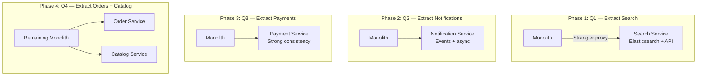

# System Design Decision Log Template

Every architecture decision has context that future engineers will not have. Why did you choose PostgreSQL over MongoDB? Why Kafka instead of SQS? Why microservices now, not six months ago? Architecture Decision Records (ADRs) capture the reasoning behind decisions so that the next person who asks "why did we do this?" has a documented answer instead of tribal knowledge.

## The ADR Template

```markdown
# ADR-{NUMBER}: {TITLE}

## Status
{Proposed | Accepted | Deprecated | Superseded by ADR-XXX}

## Date
{YYYY-MM-DD}

## Context
What is the situation that motivates this decision? What constraints exist?
Include: current system state, team size, traffic scale, pain points.

## Decision
What is the change that we are proposing or have agreed to implement?

## Alternatives Considered
What other options were evaluated? Why were they rejected?

## Consequences
### Positive
- What improves?

### Negative
- What gets harder?
- What new risks are introduced?

### Neutral
- What changes but is neither better nor worse?

## Review Date
When should this decision be revisited? (6 months, 1 year, when traffic doubles?)
```

### Why ADRs Matter

| Without ADRs | With ADRs |
|-------------|-----------|
| "Why is this Kafka? Nobody knows, the person who decided left." | "ADR-042 explains we chose Kafka for X, Y, Z reasons in March 2025." |
| New team members question every architectural choice | New team members read the decision log and understand the context |
| Same debates happen every 6 months | Decisions are documented; revisit only when context changes |
| Undocumented decisions get reversed without understanding consequences | Consequences section warns about risks of reversal |

See our [Architecture Decision Records](/devops/engineering-practices/architecture-decision-records) page for more on the ADR practice.

---

## Example 1: Why Kafka Over RabbitMQ for Our Event Bus

### ADR-015: Adopt Apache Kafka as the Primary Event Bus

**Status:** Accepted

**Date:** 2025-06-15

**Context:**
Our platform has grown to 15 microservices that need to communicate asynchronously. Currently, services communicate via synchronous HTTP calls, leading to cascading failures (3 incidents in the past quarter). We need a message broker for event-driven communication.

The system handles 5,000 events per second at peak and is growing 30% quarter-over-quarter. We need to support event replay (reprocess events after a bug fix), multiple consumer groups (different services process the same event differently), and event ordering within a partition.

Our team of 8 engineers has moderate distributed systems experience. Two engineers have prior Kafka experience.

**Decision:**
We will adopt Apache Kafka (managed via AWS MSK) as our primary event bus for all inter-service asynchronous communication.

**Alternatives Considered:**

| Option | Pros | Cons | Why Rejected |
|--------|------|------|-------------|
| **RabbitMQ** | Simpler operations, flexible routing, lower latency per message | No native event replay, limited retention, less suited for event sourcing | We need event replay for reprocessing. RabbitMQ deletes messages after consumption. |
| **AWS SQS + SNS** | Zero operations, built-in DLQ, pay-per-use | No ordering guarantees (FIFO limited to 300 msg/s per group), no replay, 14-day retention max | SQS FIFO throughput limit (300 msg/s per group ID) is too low for our order processing pipeline. |
| **Redis Streams** | Low latency, simple, team already uses Redis | Limited durability guarantees, no multi-AZ replication built-in, smaller ecosystem | We need strong durability guarantees for financial events. Redis Streams is good for ephemeral data, not the event bus backbone. |
| **NATS JetStream** | Lightweight, fast, growing ecosystem | Smaller community, fewer managed options, team has no experience | Risk of adopting a less-proven technology for a critical infrastructure component. |

**Consequences:**

### Positive
- Event replay capability: can reprocess events from any offset
- Multiple consumer groups: search, analytics, and notification services all consume the same events independently
- High throughput: Kafka handles 100K+ events/second, far beyond our current 5K/s
- Event ordering: within a partition, events are strictly ordered by offset
- Strong durability: replication factor 3, data survives broker failures
- Growing ecosystem: Kafka Connect for integrations, Kafka Streams for stream processing

### Negative
- Operational complexity: MSK still requires cluster management, partition planning, monitoring
- Learning curve: team needs to understand partitioning, consumer groups, offset management
- Cost: MSK 3-node cluster costs ~$3,200/month vs SQS which would cost ~$100/month at our volume
- Exactly-once semantics require careful configuration (idempotent producers, transactional consumers)

### Neutral
- We will use Avro for event schemas with a schema registry to enforce compatibility
- We will need to define partition key strategies per topic

**Review Date:** December 2025 — review MSK costs and operational burden after 6 months.

---

## Example 2: Why PostgreSQL Not MongoDB for Our SaaS

### ADR-023: Use PostgreSQL as the Primary Database for the SaaS Platform

**Status:** Accepted

**Date:** 2025-09-01

**Context:**
We are building a B2B SaaS platform for project management. The data model includes users, organizations (multi-tenant), projects, tasks, comments, file attachments, and permissions. The data is highly relational: tasks belong to projects, projects belong to organizations, permissions link users to organizations with roles.

Expected scale: 1,000 organizations, 50,000 users, 5 million tasks within the first year. Read-heavy workload (80% reads, 20% writes). Queries include: "all tasks assigned to user X across all their projects," "project timeline with task dependencies," and "organization-wide search across tasks and comments."

Team of 6 engineers: 4 have strong SQL experience, 2 have MongoDB experience.

**Decision:**
We will use PostgreSQL (managed via AWS Aurora PostgreSQL) as the primary database.

**Alternatives Considered:**

| Criteria | PostgreSQL | MongoDB |
|----------|:----------:|:-------:|
| **Data model fit** | Excellent — highly relational data with foreign keys, joins, constraints | Poor — data is relational, not document-shaped |
| **Multi-tenant isolation** | Row-level security (RLS) built-in | Custom tenant filtering on every query |
| **Complex queries** | JOINs, CTEs, window functions native | Aggregation pipeline is verbose and limited |
| **ACID transactions** | Full support, including cross-table | Multi-document transactions (added in 4.0, less mature) |
| **Full-text search** | `tsvector` built-in, adequate for our scale | Built-in text search, but limited ranking |
| **Team experience** | 4/6 engineers experienced | 2/6 engineers experienced |
| **Managed offering** | Aurora PostgreSQL — automatic failover, read replicas, backups | Atlas — similar managed offering |
| **Permission modeling** | Foreign keys enforce referential integrity | Must enforce in application code |

**Decision reasoning:**
Our data is fundamentally relational. Tasks reference projects, projects reference organizations, permissions are many-to-many relationships between users and organizations with roles. Modeling this in MongoDB would mean either embedded documents (data duplication, update anomalies) or references (losing the benefit of documents, essentially using MongoDB as a worse relational DB).

PostgreSQL's row-level security provides multi-tenant isolation at the database level — a critical security feature for B2B SaaS:

```sql
-- Row-level security for multi-tenancy
ALTER TABLE tasks ENABLE ROW LEVEL SECURITY;

CREATE POLICY tenant_isolation ON tasks
    USING (organization_id = current_setting('app.current_org_id')::uuid);
```

**Consequences:**

### Positive
- Strong data integrity with foreign keys and constraints
- Complex queries (task dependencies, cross-project reports) are natural SQL
- RLS provides database-level tenant isolation
- Team is already proficient in SQL
- Aurora provides automatic failover, read replicas, and point-in-time recovery

### Negative
- Schema migrations require planning (cannot just add fields like MongoDB)
- Horizontal scaling (sharding) is harder than MongoDB's built-in sharding
- Object-relational impedance mismatch with application code (mitigated by ORM)

### Neutral
- We will use Prisma as our ORM for type-safe database access
- We will add Elasticsearch later if full-text search needs exceed PostgreSQL's `tsvector` capabilities

**Review Date:** September 2026 — review if query patterns or scale outgrow single Aurora cluster.

---

## Example 3: Why We Chose Microservices at 50 Engineers

### ADR-031: Decompose the Monolith into Domain-Aligned Microservices

**Status:** Accepted

**Date:** 2025-11-15

**Context:**
Our platform started as a Django monolith 4 years ago. It has grown to 400,000 lines of Python code with 50 engineers across 8 teams. Current problems:

- **Deploy frequency:** Down from 10/day (2 years ago) to 2/week. Merge conflicts, test suite takes 45 minutes, blast radius is the entire application.
- **Team coupling:** The Payment team cannot ship without coordinating with the Order team because they share database tables and code modules.
- **Scaling:** The search module needs 10x the compute of the admin module, but they scale as one unit.
- **Onboarding:** New engineers take 3-4 weeks to understand the codebase enough to contribute.

We have already identified 6 bounded contexts with clear boundaries: User Management, Catalog, Orders, Payments, Search, and Notifications.

**Decision:**
We will decompose the monolith into domain-aligned microservices over 12 months, using the Strangler Fig pattern. Each bounded context becomes an independent service with its own database, deployment pipeline, and team ownership.

**Alternatives Considered:**

| Option | Pros | Cons | Why Rejected |
|--------|------|------|-------------|
| **Modular monolith** | Lower complexity, single deploy, internal modularity | Does not solve deploy coupling or independent scaling | Deploy coupling is our #1 pain point. With 50 engineers, the monolith deploy pipeline is the bottleneck. |
| **Microservices (immediate rewrite)** | Clean architecture from scratch | 6-12 month rewrite with zero features shipped | Business cannot afford a feature freeze. Strangler fig lets us extract incrementally. |
| **Stay as-is, invest in testing** | No migration risk | Does not solve fundamental coupling | Test suite improvements help but do not address the core problem. 50 engineers touching one codebase is the issue. |

**Migration Plan:**



**Why 50 engineers is the right time:**
- Below 20 engineers: monolith is simpler, faster to develop
- 20-50 engineers: modular monolith or micro-monolith
- 50+ engineers: team coupling becomes the dominant constraint, microservices solve the organizational problem

**Consequences:**

### Positive
- Teams can deploy independently (target: 5+ deploys/day per team)
- Services scale independently (Search can scale to 50 instances without scaling Payments)
- Technology freedom per service (Search uses Elasticsearch, Payments uses PostgreSQL)
- Smaller codebases (< 50K LOC each) — faster builds, easier onboarding
- Fault isolation — Search going down does not affect Payments

### Negative
- Distributed system complexity: network calls, partial failures, eventual consistency
- Need to build infrastructure: service mesh, event bus, distributed tracing, CI/CD per service
- Cross-cutting changes become harder (updating a shared data type requires multiple deploys)
- 12-month migration period with running costs of both architectures
- Estimated infrastructure cost increase: 30-40% (more instances, more networking, more tooling)

### Neutral
- We will adopt Kafka as the event bus (see ADR-015)
- We will use Kubernetes for orchestration (existing expertise)
- Each team owns 1-2 services end-to-end (build, deploy, monitor, on-call)

**Review Date:** November 2026 — review after migration is complete. Did we achieve the expected benefits?

---

## Example 4: Why Redis Not Memcached

### ADR-008: Use Redis as the Primary Caching Layer

**Status:** Accepted

**Date:** 2025-04-10

**Context:**
Our application needs a caching layer to reduce database load. Current database CPU is at 70% during peak hours, with 80% of queries being cacheable read operations. We need to cache user sessions, product catalog data, and API rate limiting counters.

Requirements: sub-millisecond reads, support for multiple data structures (strings, hashes, sorted sets), persistence option for session data, and pub/sub for real-time features.

**Decision:**
We will use Redis (ElastiCache for Redis) as our primary caching layer.

**Alternatives Considered:**

| Criteria | Redis | Memcached |
|----------|:-----:|:---------:|
| **Data structures** | Strings, Hashes, Lists, Sets, Sorted Sets, Streams, HyperLogLog | Strings only |
| **Persistence** | RDB snapshots + AOF | None (pure cache) |
| **Pub/Sub** | Built-in | Not available |
| **Replication** | Built-in primary-replica | Not built-in (client-side sharding) |
| **Lua scripting** | Yes (atomic operations) | Not available |
| **Memory efficiency** | Moderate (metadata overhead per key) | Better for simple string caching |
| **Multi-threading** | Single-threaded (I/O threads in Redis 6+) | Multi-threaded |
| **Max item size** | 512MB | 1MB |

**Why Redis wins for our use case:**

1. **Rate limiting** needs atomic increment with TTL — Redis `INCR` + `EXPIRE` (or `INCRBY` with Lua for sliding window)
2. **Session data** needs persistence — Redis RDB/AOF ensures sessions survive restarts
3. **Leaderboards** (product rankings) use sorted sets — `ZADD`, `ZRANGEBYSCORE`
4. **Real-time notifications** need pub/sub — Redis pub/sub for WebSocket event distribution
5. **Feature flags** need hash data structure — `HSET`, `HGET` for flag key-value pairs

If our only need were simple key-value caching of large objects, Memcached would be the better choice (multi-threaded, better memory efficiency for large values). But our requirements span multiple data structures and features.

**Consequences:**

### Positive
- Single technology serves caching, sessions, rate limiting, pub/sub, and real-time features
- Rich data structures reduce application-level complexity
- Persistence option for session data reliability

### Negative
- Single-threaded model means CPU is the bottleneck (mitigated by I/O threads in Redis 7)
- Higher memory overhead per key compared to Memcached
- More complex to operate than Memcached (persistence, replication, backup)

**Review Date:** April 2026 — review cluster sizing and evaluate Redis Cluster vs single node.

---

## Example 5: Why gRPC for Internal Services

### ADR-037: Use gRPC for Synchronous Inter-Service Communication

**Status:** Accepted

**Date:** 2026-01-20

**Context:**
Our 12 microservices currently communicate via REST/JSON over HTTP/1.1. Internal benchmarks show:
- JSON serialization/deserialization accounts for 15% of request latency on hot paths
- HTTP/1.1 head-of-line blocking causes p99 latency spikes under high concurrency
- API contracts are informally documented in Confluence — breaking changes happen without warning
- Each team defines different error response formats

We need a standardized, high-performance internal communication protocol with strong contract enforcement.

**Decision:**
We will adopt gRPC with Protocol Buffers for all new synchronous inter-service communication. Existing REST endpoints will be migrated as services are updated.

**Alternatives Considered:**

| Criteria | gRPC + Protobuf | REST + JSON | GraphQL |
|----------|:--------------:|:-----------:|:-------:|
| **Performance** | Binary serialization, HTTP/2 multiplexing | Text serialization, HTTP/1.1 | Text, single endpoint |
| **Contract** | .proto files, codegen, backward compatible | OpenAPI (optional), not enforced | Schema, but runtime errors |
| **Streaming** | Bidirectional streaming native | WebSocket (separate protocol) | Subscriptions (not standard) |
| **Code generation** | TypeScript, Go, Java, Python — type-safe clients | Manual or codegen from OpenAPI | Codegen available |
| **Browser support** | Requires gRPC-Web proxy | Native | Native |
| **Tooling** | grpcurl, Postman (limited), Buf | Postman, curl, browser | GraphiQL, Playground |

**Decision reasoning:**

gRPC solves our specific pain points:
1. **Performance:** Protocol Buffers are 5-10x faster to serialize than JSON and 3-10x smaller on the wire
2. **Contract enforcement:** `.proto` files are the single source of truth. Breaking changes are detected at compile time.
3. **Code generation:** `buf generate` creates type-safe clients in every language our services use
4. **HTTP/2 multiplexing:** eliminates head-of-line blocking that causes our p99 spikes
5. **Streaming:** we need server-streaming for real-time inventory updates and bidirectional streaming for our chat feature

We will keep REST for external-facing APIs (browser clients cannot use gRPC natively).

```protobuf
// Example: Order service proto definition
syntax = "proto3";
package order.v1;

service OrderService {
  rpc GetOrder(GetOrderRequest) returns (Order);
  rpc CreateOrder(CreateOrderRequest) returns (Order);
  rpc StreamOrderUpdates(StreamOrderRequest) returns (stream OrderUpdate);
}

message Order {
  string id = 1;
  string user_id = 2;
  OrderStatus status = 3;
  repeated OrderItem items = 4;
  google.protobuf.Timestamp created_at = 5;
}
```

**Consequences:**

### Positive
- 5-10x serialization speedup on hot paths
- Type-safe contracts enforced at compile time across all services
- HTTP/2 multiplexing eliminates head-of-line blocking
- Bidirectional streaming for real-time features
- Standardized error codes (gRPC status codes) across all services

### Negative
- Not browser-friendly (need gRPC-Web or REST gateway for external APIs)
- Steeper learning curve for engineers unfamiliar with Protocol Buffers
- Debugging is harder (binary format, need specialized tools like grpcurl)
- Proto file management requires a shared repository and CI pipeline

### Neutral
- We will use Buf for proto linting, breaking change detection, and code generation
- External APIs remain REST/JSON (API Gateway translates gRPC to REST for external consumers)
- We will adopt the gRPC health checking protocol for service mesh integration

**Review Date:** July 2026 — review adoption rate, performance improvements, and developer experience.

See our [gRPC Internals](/system-design/networking/grpc-internals) page.

---

## Starting Your Own Decision Log

### Where to Store ADRs

| Option | Pros | Cons |
|--------|------|------|
| **In the repo** (`docs/adr/`) | Versioned with code, reviewed in PRs | Scattered across repos |
| **Wiki/Confluence** | Centralized, searchable | Not versioned, gets stale |
| **Dedicated tool** (Log4brains, ADR Tools) | Structured, indexed | Another tool to maintain |

**Recommendation:** Store ADRs in the repository they affect most. For cross-cutting decisions, use a shared `platform-decisions` repository.

### When to Write an ADR

Write an ADR when the decision:
- Affects multiple teams or services
- Is expensive to reverse (database choice, message broker, protocol)
- Was debated for more than 30 minutes
- Future engineers will ask "why did we do this?"

### Numbered and Immutable

ADRs are numbered sequentially and never deleted. If a decision is superseded, mark the old one as "Superseded by ADR-XXX" and link to the new one. The old context and reasoning remain valuable for understanding history.

## Related Pages

- [Architecture Decision Records](/devops/engineering-practices/architecture-decision-records) — the ADR practice in depth
- [Design Doc Template](/devops/engineering-practices/design-doc-template) — for larger design proposals
- [RFC Template](/devops/engineering-practices/rfc-template) — for cross-team proposals
- [Anti-Patterns](/system-design/advanced/anti-patterns) — decisions to avoid
- [Database Selection Guide](/system-design/databases/database-selection-guide) — framework for DB decisions
- [Queue Selection Guide](/system-design/message-queues/queue-selection-guide) — framework for queue decisions
- [Real-World Architectures](/system-design/advanced/real-world-architectures) — decisions at scale
