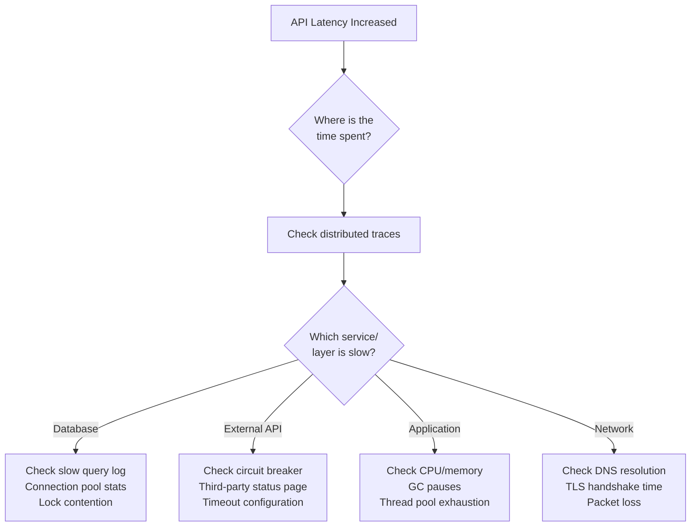
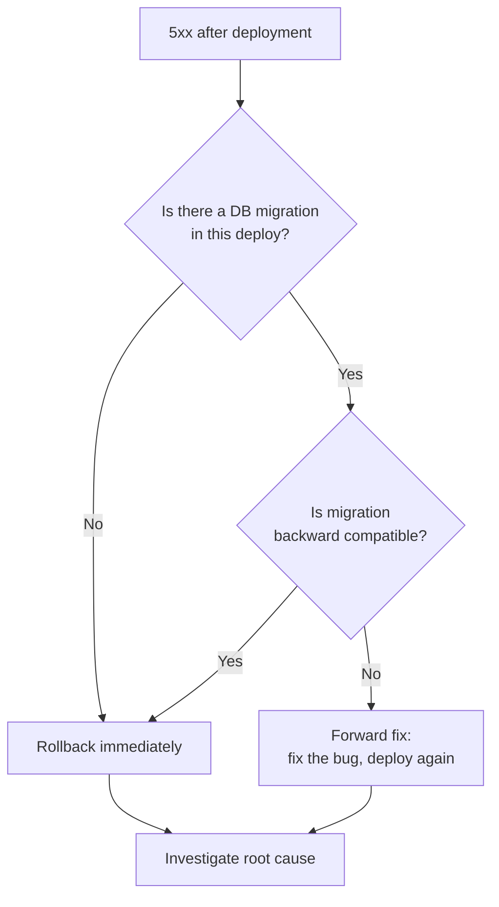
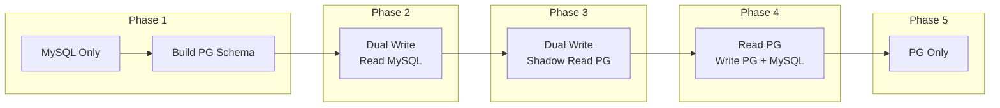

# Real-World Design Scenarios

These 15 scenarios test how you think under pressure. Unlike whiteboard system design where you build from scratch, these scenarios drop you into a running system with a real problem. Senior engineers are evaluated on their ability to methodically diagnose issues, prioritize actions, and communicate clearly. For each scenario, use the framework: **Assess → Hypothesize → Investigate → Act → Prevent.**

## Scenario 1: "The API is Slow — What Do You Check?"

**Situation:** Users are reporting that the application feels sluggish. Your monitoring shows p99 latency has increased from 200ms to 2.5 seconds over the past hour.

### Structured Approach



**Step 1 — Assess scope:**

| Question | How to Check |
|----------|-------------|
| Is it all endpoints or specific ones? | Filter metrics by route |
| Is it all users or specific regions? | Check by region/PoP |
| When did it start? | Correlate with recent deployments, config changes |
| Is it getting worse or stable? | Check trend over past hour |

**Step 2 — Check distributed traces (fastest path to root cause):**

Look at a slow trace. Where is the time spent? Common findings:

| Finding | Likely Cause | Fix |
|---------|-------------|-----|
| Database query takes 2s | Missing index, table lock, full table scan | Add index, optimize query |
| External API call takes 2s | Third-party is slow | Add timeout, circuit breaker, cache |
| Time between spans | Thread pool exhaustion, GC pause | Increase pool size, tune GC |
| First request slow, subsequent fast | Cold start, connection establishment | Connection pooling, warm-up |

**Step 3 — Quick wins while investigating:**

- Scale horizontally if the cause is saturation
- Enable query caching for expensive read paths
- Increase timeouts on the client side (prevent cascading failures)
- Redirect traffic away from problematic region/AZ

See our [API Slow Debugging Playbook](/debugging-playbooks/api-slow) for detailed runbooks.

---

## Scenario 2: "Database is at 90% Capacity"

**Situation:** CloudWatch alert: RDS storage utilization at 90%. The database is a 500GB PostgreSQL instance. Growth rate is 2GB/day.

### Structured Approach

**Step 1 — Buy time (you have ~5 days before 100%):**

```sql
-- What's consuming space?
SELECT
    tablename,
    pg_size_pretty(pg_total_relation_size(schemaname || '.' || tablename)) AS total_size,
    pg_size_pretty(pg_relation_size(schemaname || '.' || tablename)) AS data_size,
    pg_size_pretty(pg_indexes_size(schemaname || '.' || tablename)) AS index_size
FROM pg_tables
WHERE schemaname = 'public'
ORDER BY pg_total_relation_size(schemaname || '.' || tablename) DESC
LIMIT 20;

-- Check for bloat (dead tuples)
SELECT
    relname,
    n_live_tup,
    n_dead_tup,
    round(n_dead_tup::numeric / NULLIF(n_live_tup, 0) * 100, 1) AS dead_pct
FROM pg_stat_user_tables
WHERE n_dead_tup > 10000
ORDER BY n_dead_tup DESC;
```

**Step 2 — Immediate actions by priority:**

| Action | Space Freed | Risk | Time |
|--------|:----------:|:----:|:----:|
| VACUUM FULL on bloated tables | 10-50% of table size | Locks table | Hours |
| Drop unused indexes | 5-20% | None if truly unused | Minutes |
| Archive old data to S3 | Varies | Need to ensure no queries hit it | Days |
| Increase storage (AWS allows online resize) | N/A (buys time) | None | Minutes |
| Enable storage autoscaling | N/A (prevents recurrence) | Cost increase | Minutes |

**Step 3 — Long-term solutions:**

- Implement data retention policy: archive data older than N months
- Partition large tables by date: `CREATE TABLE orders PARTITION BY RANGE (created_at)`
- Move analytics data to a separate store (ClickHouse, S3 + Athena)
- Implement CDC to stream old data to cold storage

---

## Scenario 3: "Service is Failing Intermittently"

**Situation:** Service X returns 503 errors about 5% of the time. Retry usually succeeds. The error rate is not correlated with traffic.

### Structured Approach

**Intermittent failures are the hardest to debug because they are not reproducible on demand.**

| Hypothesis | Investigation | Evidence |
|-----------|--------------|---------|
| One unhealthy instance in the pool | Check per-instance error rates | Error rate 0% on 3/4 instances, 20% on 1 |
| DNS resolution failing intermittently | Check DNS cache TTL, resolution times | Spikes in DNS lookup time |
| Connection timeout to dependency | Check connection pool metrics | Pool exhaustion every few minutes |
| Memory pressure causing OOM kills | Check for OOM events in system logs | `dmesg` shows killed processes |
| Database connection limit reached | Check active connections vs max | Periodic spikes to max_connections |
| TLS certificate issue on some paths | Check certificate chain for all load balancer targets | One target has expired intermediate cert |

**Step 1 — Isolate the failure pattern:**

```
# Is it one instance?
per_instance_error_rate = metrics_query(
  'sum(rate(http_errors[5m])) by (instance)'
)

# Is it correlated with a dependency?
error_correlation = metrics_query(
  'rate(http_errors[5m]) / rate(dependency_errors[5m])'
)

# Is it time-based?
error_by_time = metrics_query(
  'sum(rate(http_errors[1m])) by (minute_of_hour)'
)
```

**Step 2 — Common culprits for 5% intermittent failure:**

1. **One bad instance** (most common) — one instance in the pool is unhealthy but health check passes. Remove it, investigate, replace.
2. **Connection pool exhaustion** — pool is sized for average load, not burst. Under transient bursts, requests queue then timeout.
3. **Downstream flapping** — a dependency toggles between healthy and unhealthy, causing circuit breaker oscillation.

---

## Scenario 4: "Deployment Caused a 5xx Spike"

**Situation:** The latest deployment went out at 14:00. Error rate jumped from 0.1% to 5% immediately after. The previous version was running fine.

### Structured Approach

**Step 1 — Stop the bleeding:**

| Action | When |
|--------|------|
| **Rollback immediately** if error rate > 1% and impact is customer-facing | Within 5 minutes |
| **Pause canary rollout** if in canary phase | Immediately |
| **Check if rollback is safe** (database migrations?) | Before rolling back |

**Step 2 — If rollback is safe, do it now, investigate later.**

**Step 3 — If rollback is risky (irreversible migration), investigate fast:**



**Common deployment failure causes:**

| Cause | How to Detect | Prevention |
|-------|--------------|------------|
| Breaking API change | Client errors in logs | API versioning, backward compatibility testing |
| Missing environment variable | "undefined" in error logs | Config validation on startup |
| Database migration failed | Migration error in deploy logs | Test migrations on staging |
| Dependency version mismatch | ImportError / ClassNotFound | Lock file, integration tests |
| Memory/CPU limits too low | OOM killed, throttled | Load test before deploy |
| Race condition in new code | Intermittent errors only under concurrency | Concurrency testing |

---

## Scenario 5: "We Need to Migrate Databases"

**Situation:** You need to migrate from MySQL to PostgreSQL for your main application database (50 tables, 500GB, 24/7 uptime requirement).

### Structured Approach

**Phase 1: Preparation (weeks 1-4)**
- Schema conversion: MySQL types to PostgreSQL types
- Application compatibility: ORM changes, raw SQL audit
- Set up PostgreSQL alongside MySQL
- Build data migration pipeline

**Phase 2: Dual-Write (weeks 5-8)**
- Write to both databases
- Read from MySQL (source of truth)
- Compare results to find discrepancies

**Phase 3: Shadow Read (weeks 9-10)**
- Read from PostgreSQL, compare with MySQL response
- Log any differences
- Fix data inconsistencies

**Phase 4: Cutover (week 11)**
- Switch reads to PostgreSQL
- Keep MySQL as hot standby for 1 week
- Decommission MySQL



---

## Scenario 6: "Traffic Grew 10x Overnight"

**Situation:** Your product went viral. Traffic went from 1,000 to 10,000 requests per second overnight. Some services are failing.

### Structured Approach

**Immediate (0-1 hour):**

| Priority | Action |
|:--------:|--------|
| 1 | Scale horizontally: increase auto-scaling group max, add nodes |
| 2 | Enable aggressive caching: cache everything for 60s |
| 3 | Disable non-essential features: analytics tracking, recommendations |
| 4 | Rate limit by client to prevent any single client from consuming all capacity |
| 5 | Check database connections — likely the first bottleneck |

**Short-term (1-24 hours):**

- Add read replicas for the database
- Scale cache cluster (more Redis nodes)
- Review and increase connection pool sizes
- Add CDN for all static and semi-static content
- Set up auto-scaling policies if not already present

**Medium-term (1-7 days):**

- Identify the actual bottlenecks from monitoring data
- Optimize the top 5 slowest queries
- Implement proper horizontal scaling patterns
- Add circuit breakers to prevent cascade failures
- Review architecture for single points of failure

---

## Scenario 7: "Customer Data Breach Detected"

**Situation:** Security team detected unusual data access patterns. A database dump of 100,000 customer records may have been exfiltrated.

### Structured Approach

**Hour 0-1: Contain**

| Action | Responsible |
|--------|------------|
| Revoke compromised credentials immediately | Security team |
| Block the source IP/access pattern | Network team |
| Preserve evidence (do not delete logs) | Security team |
| Activate incident response team | Incident commander |
| Check if exfiltration is ongoing | SOC / SIEM |

**Hour 1-4: Assess**

- What data was accessed? (PII, financial, health?)
- How many records affected?
- What was the attack vector? (SQL injection, stolen credentials, insider?)
- Is the vulnerability still present?
- Were other systems affected?

**Hour 4-24: Notify and remediate**

- Legal team: determine regulatory notification requirements (GDPR: 72 hours)
- Patch the vulnerability
- Rotate all secrets and API keys in the affected scope
- Review access logs for the past 30 days for similar patterns
- Force password reset for affected users

**Week 1-2: Post-incident**

- Full incident postmortem
- Implement missing controls (see what failed)
- Penetration test to find similar vulnerabilities
- Review and update security monitoring rules

---

## Scenario 8: "Third-Party API is Going Down"

**Situation:** Your payment provider (Stripe, PayPal, etc.) is experiencing intermittent outages. 20% of payment requests are failing.

### Structured Approach

| Action | Priority | Implementation |
|--------|:--------:|---------------|
| Activate circuit breaker | Immediate | Stop sending requests to failing provider |
| Failover to backup provider | Immediate | Route to secondary payment provider |
| Queue failed payments for retry | Immediate | Store payment intent, retry when provider recovers |
| Notify affected users | Within 30 min | "Payment is being processed, you'll be notified" |
| Cache authorization tokens | If applicable | Avoid re-auth during outage |

**Longer-term prevention:**

```typescript
class PaymentService {
  private providers: PaymentProvider[] = [
    new StripeProvider(),    // Primary
    new AdyenProvider(),     // Failover
  ];

  async processPayment(request: PaymentRequest): Promise<PaymentResult> {
    for (const provider of this.providers) {
      if (!this.circuitBreaker.isOpen(provider.name)) {
        try {
          return await provider.charge(request);
        } catch (error) {
          if (isNetworkError(error)) {
            this.circuitBreaker.recordFailure(provider.name);
            continue; // Try next provider
          }
          throw error; // Business errors (card declined) are not retried
        }
      }
    }

    // All providers down — queue for retry
    await this.retryQueue.enqueue({
      request,
      maxRetries: 10,
      retryAfter: new Date(Date.now() + 5 * 60 * 1000),
    });

    return { status: 'PENDING', message: 'Payment is being processed' };
  }
}
```

---

## Scenario 9: "Service Latency is High Only in One Region"

**Situation:** Users in EU are experiencing 3-5 second latency. US and APAC are normal.

### Investigation Checklist

| Check | Tool | What to Look For |
|-------|------|-----------------|
| Regional health | CloudWatch by region | Error rate, CPU, memory per region |
| DNS resolution | `dig api.example.com` from EU | Wrong/slow resolution |
| Database replication lag | DB monitoring | EU read replica is behind |
| CDN cache hit rate | CloudFront metrics by PoP | Low hit rate = origin calls for every request |
| Network path | `traceroute` from EU | Unexpected routing through US |
| Recent deployment | Deploy history | EU deployed a bad version? |

---

## Scenario 10: "Memory Usage is Growing Over Time"

**Situation:** Service memory usage increases linearly: 500MB at startup, 1.5GB after 24 hours, 3GB after 48 hours. Eventually OOM-killed.

### Common Memory Leak Sources

| Source | Detection | Fix |
|--------|----------|-----|
| Event listeners not removed | Heap dump shows growing listener arrays | Remove listeners on cleanup |
| Cache without size limit | Heap dump shows large Map/object | Add max size + LRU eviction |
| Closures holding references | Growing retained size in heap profile | Break closure references |
| Database connection leaks | Connection pool shows all connections active, none idle | Always close connections in `finally` block |
| Buffer accumulation | Growing Buffer objects in heap | Stream processing instead of buffering |
| Global state accumulation | Growing arrays/maps in module scope | Add cleanup / rotation |

---

## Scenario 11: "Need to Deprecate an API Version"

**Situation:** API v1 has 10,000 active clients. v2 has been available for 6 months. You need to sunset v1.

### Deprecation Timeline

| Phase | Duration | Actions |
|-------|----------|---------|
| **Announce** | Month 0 | Email all v1 users, add `Sunset` header to responses |
| **Warn** | Month 1-3 | Return `Deprecation` header, log v1 usage per client |
| **Degrade** | Month 4-5 | Rate-limit v1, return 299 warnings |
| **Sunset** | Month 6 | Return 410 Gone with migration guide link |

---

## Scenario 12: "Feature Flags Causing Inconsistent Behavior"

**Situation:** Users are reporting that a feature appears and disappears randomly. Feature flags are cached with 5-minute TTL.

### Root Cause Analysis

The problem is inconsistent flag evaluation across requests. If a user hits Server A (cache has new value) then Server B (cache has old value), the feature flickers.

**Fixes:**
1. **Sticky sessions** — route same user to same server
2. **Reduce cache TTL** to 30 seconds
3. **Server-side evaluation with user ID** — feature flag service returns consistent result per user ID
4. **Client-side SDK** — evaluate flags on the client, not the server

---

## Scenario 13: "Deployment Pipeline Takes 45 Minutes"

**Situation:** CI/CD pipeline from commit to production takes 45 minutes. Developer velocity is suffering.

### Pipeline Optimization

| Stage | Current | Optimized | Technique |
|-------|:-------:|:---------:|-----------|
| **Build** | 8 min | 2 min | Docker layer caching, parallel builds |
| **Unit tests** | 12 min | 4 min | Parallel test execution, test impact analysis |
| **Integration tests** | 15 min | 5 min | Run only affected tests, use test containers |
| **Security scan** | 5 min | 1 min | Incremental scanning, cache vulnerability DB |
| **Deploy** | 5 min | 3 min | Rolling deploy (not full replacement) |
| **Total** | **45 min** | **15 min** | |

---

## Scenario 14: "Microservices Are Too Complex for Our Team"

**Situation:** 5-person team manages 12 microservices. Most engineering time is spent on infrastructure, not product features.

### Honest Assessment

If the number of services exceeds the number of engineers, you likely have premature microservices. See our [Anti-Patterns](/system-design/advanced/anti-patterns) page.

**Action plan:**
1. Identify services that are always deployed together — merge them
2. Identify services with < 1 deploy/month — they are not earning their keep
3. Target: 2-3 services per engineer
4. Consider a "majestic monolith" with clear module boundaries

---

## Scenario 15: "Estimated Completion Time for Major Refactor?"

**Situation:** CTO asks: "How long will it take to refactor the monolith into microservices?"

### Honest Answer Framework

| Factor | Assessment |
|--------|-----------|
| Current codebase size | LOC, modules, dependencies |
| Team size and experience | Have they done this before? |
| Business continuity requirements | Can you stop new features during refactor? |
| Data entanglement | How tightly coupled is the database? |
| Testing coverage | Can you refactor safely? |

**Rule of thumb:** It always takes 2-3x longer than estimated. A 200KLOC monolith with 10 engineers, good test coverage, and clear module boundaries takes 6-12 months for a meaningful split. Without those prerequisites, 12-24 months.

**Better answer:** "Let me extract one bounded context first as a proof of concept. That will give us a realistic timeline for the rest."

## Scenario Answer Template

For any troubleshooting scenario in an interview:

1. **Clarify** — Ask what monitoring/tools are available
2. **Assess** — Determine scope and impact (how many users? which regions?)
3. **Stabilize** — Stop the bleeding (rollback, scale up, enable caching)
4. **Investigate** — Check metrics, traces, logs in that order
5. **Fix** — Apply the targeted fix
6. **Prevent** — What monitoring, testing, or architecture change prevents recurrence?

## Related Pages

- [API Slow Debugging Playbook](/debugging-playbooks/api-slow) — detailed slow API runbook
- [Intermittent 502 Debugging](/debugging-playbooks/intermittent-502) — debugging intermittent failures
- [Anti-Patterns](/system-design/advanced/anti-patterns) — architectural mistakes that cause these scenarios
- [Observability in Design](/system-design/advanced/observability-in-design) — monitoring that catches issues early
- [Circuit Breaker](/system-design/distributed-systems/circuit-breaker) — handling dependency failures
- [Incident Response](/devops/incident-response) — structured incident management
- [Postmortem Framework](/devops/incident-response/postmortem-framework) — learning from incidents
