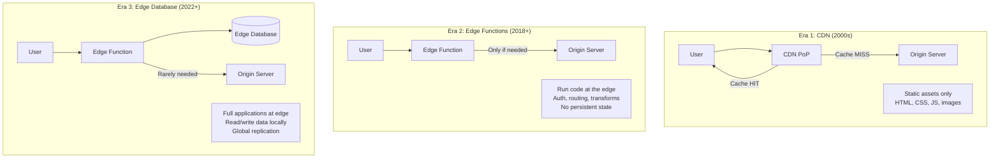
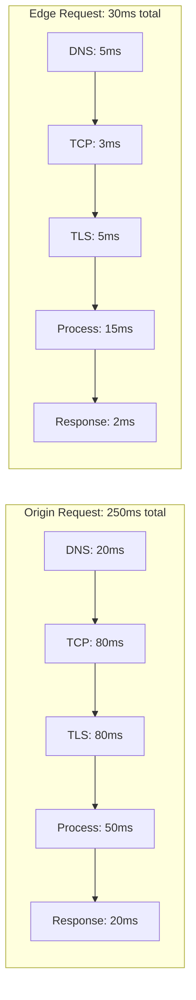
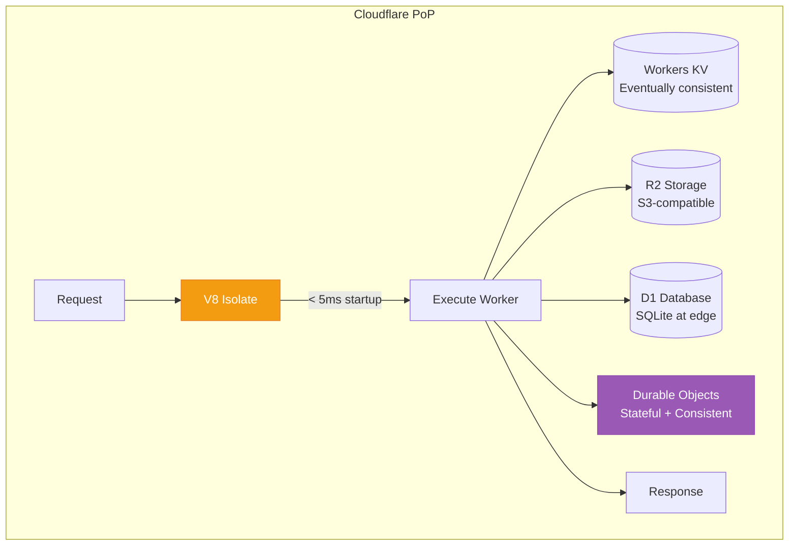
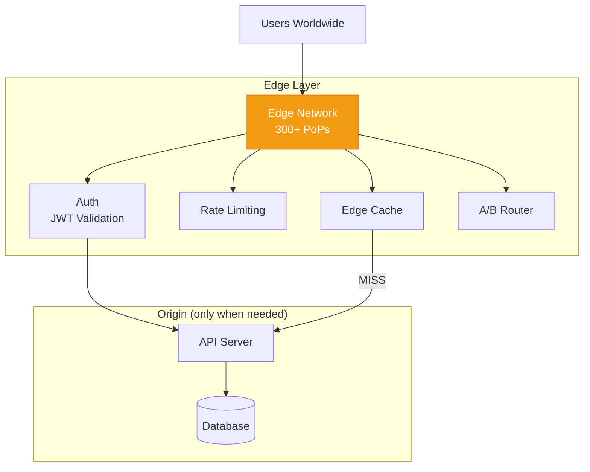
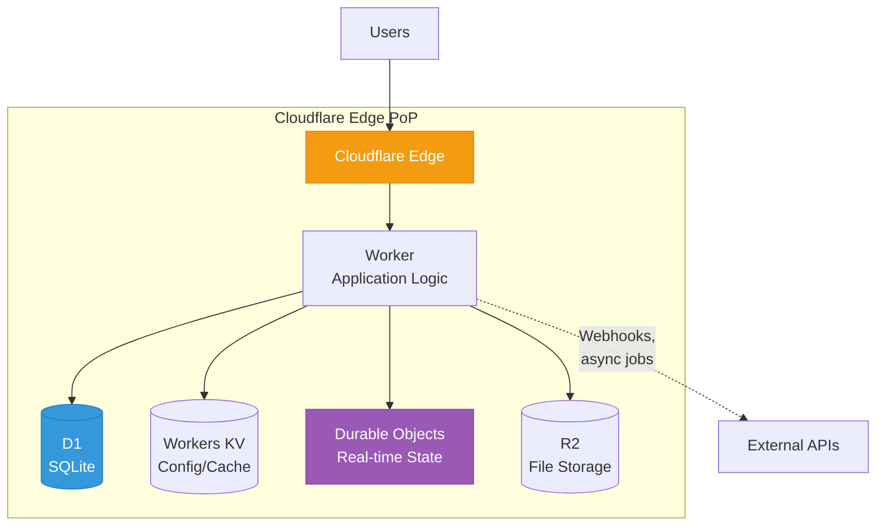
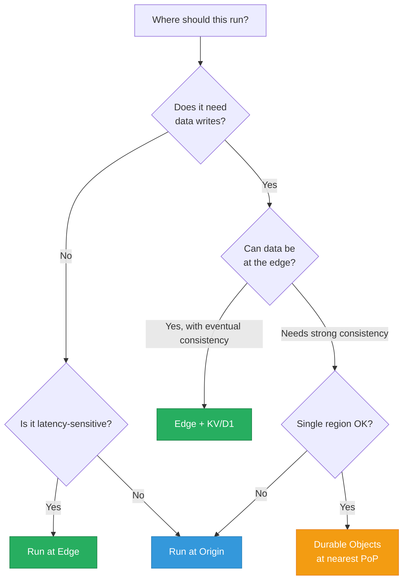

# Edge Computing Architecture

Edge computing moves computation from centralized data centers to locations physically close to users. Instead of every request traveling thousands of miles to your origin server in us-east-1, edge functions execute at the nearest point of presence (PoP) — often within 50ms of the user. This is not just caching static assets. Modern edge platforms run full JavaScript/WASM at 300+ locations worldwide, with access to distributed storage, key-value stores, and even SQLite databases at the edge.

## The Evolution: CDN to Edge Functions to Edge Databases



| Era | What's at the Edge | Latency | Capabilities |
|-----|-------------------|---------|-------------|
| **CDN** | Cached static files | ~5ms for cached content | Serve files, basic redirects |
| **Edge Functions** | Compute (JS/WASM) | ~10-50ms for dynamic content | Auth, transforms, routing, API proxying |
| **Edge Database** | Compute + Data | ~10-50ms for full CRUD | Complete applications with persistent storage |

## Latency: Edge vs Origin

Real-world measurements show why edge computing matters.

### Round-Trip Latency by Region

| User Location | Origin: us-east-1 | Edge PoP | Savings |
|--------------|:-----------------:|:--------:|:-------:|
| New York | 5ms | 2ms | 3ms |
| London | 80ms | 5ms | 75ms |
| Tokyo | 170ms | 8ms | 162ms |
| Sydney | 210ms | 10ms | 200ms |
| Mumbai | 190ms | 7ms | 183ms |
| Sao Paulo | 140ms | 6ms | 134ms |

For a page that makes 5 sequential API calls, a user in Tokyo saves **810ms** (5 x 162ms) by hitting the edge instead of us-east-1. That is the difference between a page feeling instant and feeling sluggish.

### Latency Budget Breakdown



Edge eliminates most of the network latency. The function executes on the same continent (often the same city) as the user.

## Cloudflare Workers

Cloudflare Workers run JavaScript/TypeScript on Cloudflare's V8 isolate-based runtime across 300+ locations. Unlike Lambda, there are no cold starts — isolates spin up in under 5ms.

### Execution Model



### Basic Worker Example

```typescript
// wrangler.toml
// name = "api-router"
// main = "src/index.ts"
// compatibility_date = "2026-03-01"
//
// [[kv_namespaces]]
// binding = "AUTH_CACHE"
// id = "abc123"

export default {
  async fetch(request: Request, env: Env): Promise<Response> {
    const url = new URL(request.url);

    // Auth check at the edge — no origin round-trip
    const token = request.headers.get('Authorization')?.replace('Bearer ', '');
    if (!token) {
      return new Response('Unauthorized', { status: 401 });
    }

    // Check token in edge KV cache
    const cached = await env.AUTH_CACHE.get(`token:${​{token}}`);
    if (!cached) {
      // Validate with origin, then cache at edge
      const valid = await validateTokenWithOrigin(token, env);
      if (!valid) {
        return new Response('Invalid token', { status: 403 });
      }
      await env.AUTH_CACHE.put(`token:${​{token}}`, 'valid', {
        expirationTtl: 300, // 5 minutes
      });
    }

    // Route to appropriate origin
    switch (url.pathname) {
      case '/api/v1/orders':
        return fetch(`${​{env.ORDER_SERVICE_URL}}${​{url.pathname}}`, {
          headers: request.headers,
        });
      case '/api/v1/users':
        return fetch(`${​{env.USER_SERVICE_URL}}${​{url.pathname}}`, {
          headers: request.headers,
        });
      default:
        return new Response('Not Found', { status: 404 });
    }
  },
};
```

### Durable Objects: Stateful Edge Computing

Durable Objects provide strongly consistent, single-threaded state at the edge. Each object has a unique ID and lives on exactly one server — requests are routed to that server automatically.

```typescript
// Durable Object for a collaborative document editor
export class DocumentSession {
  state: DurableObjectState;
  connections: Set<WebSocket> = new Set();
  document: DocumentContent = { ops: [] };

  constructor(state: DurableObjectState, env: Env) {
    this.state = state;
    // Restore state from storage
    this.state.blockConcurrencyWhile(async () => {
      const stored = await this.state.storage.get<DocumentContent>('document');
      if (stored) this.document = stored;
    });
  }

  async fetch(request: Request): Promise<Response> {
    const url = new URL(request.url);

    if (url.pathname === '/websocket') {
      // WebSocket upgrade for real-time collaboration
      const [client, server] = Object.values(new WebSocketPair());
      server.accept();

      server.addEventListener('message', async (event) => {
        const op = JSON.parse(event.data as string);
        this.document.ops.push(op);

        // Persist to durable storage
        await this.state.storage.put('document', this.document);

        // Broadcast to all connected clients
        for (const ws of this.connections) {
          if (ws !== server && ws.readyState === WebSocket.OPEN) {
            ws.send(JSON.stringify(op));
          }
        }
      });

      server.addEventListener('close', () => {
        this.connections.delete(server);
      });

      this.connections.add(server);
      return new Response(null, { status: 101, webSocket: client });
    }

    return new Response('Not found', { status: 404 });
  }
}
```

**Durable Objects use cases:**
- Real-time collaboration (Google Docs-like)
- Game state management
- Rate limiting with exact counts
- Shopping cart sessions
- Chat rooms
- Distributed locks

## Vercel Edge

Vercel Edge Functions run on Cloudflare's network but integrate tightly with Next.js.

### Edge Middleware

```typescript
// middleware.ts — runs at the edge before every request
import { NextRequest, NextResponse } from 'next/server';

export function middleware(request: NextRequest) {
  const url = request.nextUrl.clone();
  const country = request.geo?.country || 'US';
  const city = request.geo?.city || 'Unknown';

  // Geolocation-based routing
  if (country === 'CN') {
    url.pathname = '/cn' + url.pathname;
    return NextResponse.rewrite(url);
  }

  // A/B testing at the edge
  const bucket = request.cookies.get('ab-bucket')?.value;
  if (!bucket) {
    const newBucket = Math.random() < 0.5 ? 'control' : 'variant';
    const response = NextResponse.next();
    response.cookies.set('ab-bucket', newBucket, { maxAge: 60 * 60 * 24 * 30 });

    if (newBucket === 'variant') {
      url.pathname = '/experiment' + url.pathname;
      return NextResponse.rewrite(url, { headers: response.headers });
    }
    return response;
  }

  if (bucket === 'variant') {
    url.pathname = '/experiment' + url.pathname;
    return NextResponse.rewrite(url);
  }

  // Bot detection
  const ua = request.headers.get('user-agent') || '';
  if (isBot(ua) && !isGoodBot(ua)) {
    return new NextResponse('Forbidden', { status: 403 });
  }

  return NextResponse.next();
}

export const config = {
  matcher: ['/((?!_next/static|_next/image|favicon.ico).*)'],
};
```

### Edge API Routes

```typescript
// app/api/personalize/route.ts
import { NextRequest } from 'next/server';

export const runtime = 'edge'; // Run at the edge, not on origin

export async function GET(request: NextRequest) {
  const country = request.geo?.country || 'US';
  const city = request.geo?.city || 'Unknown';
  const latitude = request.geo?.latitude;
  const longitude = request.geo?.longitude;

  // Personalized content based on location
  const currency = getCurrencyForCountry(country);
  const language = getLanguageForCountry(country);
  const nearestStores = await findNearestStores(latitude, longitude);
  const localDeals = await getLocalDeals(country, city);

  return Response.json({
    currency,
    language,
    nearestStores: nearestStores.slice(0, 3),
    deals: localDeals,
    greeting: getLocalGreeting(language, city),
  });
}
```

## Data at the Edge

The biggest challenge is not running code at the edge — it is getting data there.

### Edge Data Solutions Comparison

| Solution | Consistency | Read Latency | Write Latency | Best For |
|----------|:----------:|:------------:|:-------------:|---------|
| **Workers KV** | Eventually consistent (60s) | ~5ms | ~500ms global propagation | Config, feature flags, static data |
| **Durable Objects** | Strongly consistent | ~5ms (same location) | ~5ms (same location) | Counters, sessions, collaboration |
| **D1 (Cloudflare SQLite)** | Strongly consistent per region | ~5ms | ~5ms local, async replication | Full CRUD apps, read-heavy |
| **Turso (libSQL)** | Strongly consistent per region | ~5ms | ~10ms local, async replication | SQLite at edge, embedded replicas |
| **PlanetScale** | MySQL-compatible, vitess-based | ~10-30ms | ~10-30ms | MySQL workloads at edge |
| **Neon** | PostgreSQL, serverless branching | ~10-50ms | ~10-50ms | PostgreSQL at edge |

### Turso: SQLite at the Edge

```typescript
// Edge function with Turso (embedded SQLite replica)
import { createClient } from '@libsql/client';

const db = createClient({
  url: 'libsql://mydb-myorg.turso.io',
  authToken: process.env.TURSO_AUTH_TOKEN,
});

export default {
  async fetch(request: Request): Promise<Response> {
    const url = new URL(request.url);
    const productId = url.searchParams.get('id');

    // Read from local edge replica — microsecond latency
    const result = await db.execute({
      sql: 'SELECT * FROM products WHERE id = ?',
      args: [productId],
    });

    if (result.rows.length === 0) {
      return new Response('Not found', { status: 404 });
    }

    return Response.json(result.rows[0]);
  },
};
```

## Edge Computing Use Cases

### 1. Authentication at the Edge

Validate JWTs at the edge without hitting your origin server for every request.

```typescript
// JWT validation at the edge — saves 100-200ms per request
import { jwtVerify } from 'jose';

async function verifyAuth(request: Request, env: Env): Promise<JWTPayload | null> {
  const token = request.headers.get('Authorization')?.split(' ')[1];
  if (!token) return null;

  try {
    const jwks = await getJWKS(env); // Cached in Workers KV
    const { payload } = await jwtVerify(token, jwks, {
      issuer: 'https://auth.example.com/',
      audience: 'https://api.example.com/',
    });
    return payload;
  } catch {
    return null;
  }
}

async function getJWKS(env: Env) {
  // Cache JWKS in KV — rotate every 5 min
  const cached = await env.JWKS_CACHE.get('jwks', 'json');
  if (cached) return cached;

  const response = await fetch('https://auth.example.com/.well-known/jwks.json');
  const jwks = await response.json();
  await env.JWKS_CACHE.put('jwks', JSON.stringify(jwks), { expirationTtl: 300 });
  return jwks;
}
```

### 2. A/B Testing

Route users to different variants without any origin round-trip.

```typescript
// A/B testing at the edge — zero origin latency for routing decisions
export default {
  async fetch(request: Request, env: Env): Promise<Response> {
    const url = new URL(request.url);

    // Get or assign user to experiment bucket
    const cookies = parseCookies(request.headers.get('Cookie') || '');
    let bucket = cookies['experiment-checkout-v2'];

    if (!bucket) {
      // Weighted assignment: 80% control, 20% variant
      const rand = Math.random();
      bucket = rand < 0.8 ? 'control' : 'variant';
    }

    // Route to appropriate version
    if (bucket === 'variant') {
      url.hostname = 'checkout-v2.example.com';
    }

    const response = await fetch(url.toString(), request);
    const newResponse = new Response(response.body, response);

    // Set cookie for consistent experience
    newResponse.headers.append(
      'Set-Cookie',
      `experiment-checkout-v2=${​{bucket}}; Path=/; Max-Age=2592000; SameSite=Lax`
    );

    // Track impression for analytics
    await env.ANALYTICS.writeDataPoint({
      blobs: [bucket, url.pathname],
      doubles: [1],
      indexes: ['checkout-experiment'],
    });

    return newResponse;
  },
};
```

### 3. Personalization

Customize content based on geolocation without waiting for origin.

```typescript
// Personalization at the edge
export default {
  async fetch(request: Request, env: Env): Promise<Response> {
    const country = request.cf?.country || 'US';
    const city = request.cf?.city || '';
    const timezone = request.cf?.timezone || 'America/New_York';

    // Fetch base page from origin (cached)
    const response = await fetch(request);
    const html = await response.text();

    // Edge-side includes: inject personalized content
    const personalizedHtml = html
      .replace('{{CURRENCY}}', CURRENCY_MAP[country] || 'USD')
      .replace('{{LANGUAGE}}', LANGUAGE_MAP[country] || 'en')
      .replace('{{GREETING}}', getTimeBasedGreeting(timezone))
      .replace('{{LOCAL_PHONE}}', SUPPORT_PHONES[country] || '+1-800-123-4567')
      .replace('{{PRIVACY_BANNER}}', country === 'DE' || country === 'FR' ? GDPR_BANNER : '');

    return new Response(personalizedHtml, {
      headers: {
        'Content-Type': 'text/html',
        'Cache-Control': 'public, max-age=60',
        'Vary': 'Accept-Language',
      },
    });
  },
};
```

### 4. Rate Limiting with Durable Objects

```typescript
// Precise per-user rate limiting using Durable Objects
export class RateLimiter {
  state: DurableObjectState;

  constructor(state: DurableObjectState) {
    this.state = state;
  }

  async fetch(request: Request): Promise<Response> {
    const key = new URL(request.url).searchParams.get('key')!;
    const limit = 100; // 100 requests per minute
    const window = 60_000; // 1 minute

    const now = Date.now();
    const windowStart = now - window;

    // Get current request timestamps
    let timestamps: number[] = await this.state.storage.get('timestamps') || [];

    // Remove expired entries
    timestamps = timestamps.filter(t => t > windowStart);

    if (timestamps.length >= limit) {
      const retryAfter = Math.ceil((timestamps[0] + window - now) / 1000);
      return new Response('Rate limit exceeded', {
        status: 429,
        headers: {
          'Retry-After': retryAfter.toString(),
          'X-RateLimit-Limit': limit.toString(),
          'X-RateLimit-Remaining': '0',
          'X-RateLimit-Reset': new Date(timestamps[0] + window).toISOString(),
        },
      });
    }

    timestamps.push(now);
    await this.state.storage.put('timestamps', timestamps);

    return new Response('OK', {
      headers: {
        'X-RateLimit-Limit': limit.toString(),
        'X-RateLimit-Remaining': (limit - timestamps.length).toString(),
      },
    });
  }
}
```

## Architecture Patterns

### Pattern 1: Edge-First API



### Pattern 2: Full Edge Application



## Edge vs Origin: Decision Framework



## Limitations and Gotchas

| Limitation | Impact | Workaround |
|-----------|--------|------------|
| **CPU time limits** (10-50ms on free, 30s on paid) | Cannot run heavy computation | Offload to origin or use Workers Unbound |
| **No native TCP/UDP** | Cannot connect to traditional DBs directly | Use HTTP-based DB clients (Turso, PlanetScale) |
| **Limited Node.js APIs** | No `fs`, `child_process`, `net` | Use Web APIs (fetch, crypto, streams) |
| **128MB memory limit** | Cannot load large datasets | Stream data, use external storage |
| **Eventually consistent KV** | Writes take up to 60s to propagate | Use Durable Objects for strong consistency |
| **Cold storage reads slower** | D1 cold reads add latency | Use caching layer, warm storage |

## Key Takeaways

1. **Edge computing is not just caching** — modern platforms run full applications with databases at 300+ locations
2. **Biggest latency win: authentication** — validating tokens at the edge saves 100-200ms per request for global users
3. **Cloudflare Workers have near-zero cold starts** — V8 isolates spin up in under 5ms, unlike Lambda's 100ms-10s
4. **Durable Objects enable stateful edge** — real-time collaboration, precise counters, distributed locks
5. **Edge databases are production-ready** — D1, Turso, and PlanetScale bring data to the edge with acceptable consistency tradeoffs
6. **Not everything belongs at the edge** — heavy computation, complex transactions, and strong cross-region consistency still need origin servers

## Related Pages

- [CDN Deep Dive](/system-design/caching/cdn-deep-dive) — the foundation edge computing builds on
- [Multi-Region Architecture](/system-design/advanced/multi-region-design) — edge computing vs multi-region
- [Serverless Architecture](/system-design/advanced/serverless-architecture) — Lambda vs edge functions
- [DNS Deep Dive](/system-design/networking/dns-deep-dive) — how edge routing works
- [TLS Handshake](/system-design/networking/tls-handshake) — why TLS termination at edge matters
- [Caching Strategies](/system-design/caching/caching-strategies) — edge caching as part of multi-layer strategy
- [Global Load Balancing](/system-design/load-balancing/global-load-balancing) — routing users to nearest edge

## Real-World Examples

::: tip Cloudflare (Workers)
Cloudflare Workers powers **over 10 million applications** at the edge across 300+ cities. Companies like Shopify, Discord, and Canva use Workers for authentication, routing, and personalization. Workers' V8 isolate model achieves near-zero cold starts (under 5ms), compared to Lambda's 100ms-10s. Discord uses Workers for their API routing layer, validating tokens and rate-limiting at the edge before requests reach their origin servers.
:::

::: tip Vercel (Next.js Edge)
Vercel uses **Edge Middleware** to run Next.js middleware functions at the edge for millions of websites. Companies like Notion, Loom, and HashiCorp use Edge Middleware for geolocation-based routing, A/B testing, and bot detection — all executing at the nearest edge location with sub-10ms overhead. The middleware runs before the page request reaches the origin, eliminating round trips for common operations.
:::

::: tip Fly.io
Fly.io runs **full application containers at the edge** for companies like Supabase and Stytch. Unlike function-based edge platforms, Fly runs full Docker containers in 30+ regions, enabling edge deployment of applications that need persistent connections (WebSockets, databases). Supabase uses Fly to run PostgreSQL replicas at the edge, giving developers sub-50ms database reads globally.
:::

## Interview Tip

::: tip What to say
"Edge computing shines for operations that don't need origin data — authentication (JWT validation saves 100-200ms per request for global users), A/B testing (route users without origin round-trip), and personalization (inject currency/language based on geolocation). The biggest win is latency: a user in Tokyo hitting an edge node gets a 10ms response versus 170ms to us-east-1. For data at the edge, I'd use Workers KV for configuration (eventually consistent), Durable Objects for stateful operations (strongly consistent within a region), or Turso for SQLite replicas at the edge. The limitation is CPU time (10-50ms) and no TCP connections — so heavy computation and traditional database queries still need the origin."
:::
