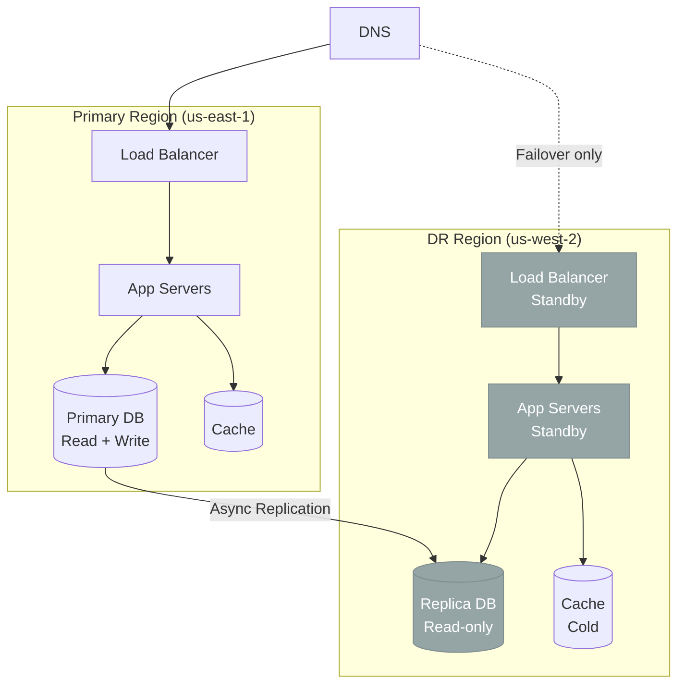
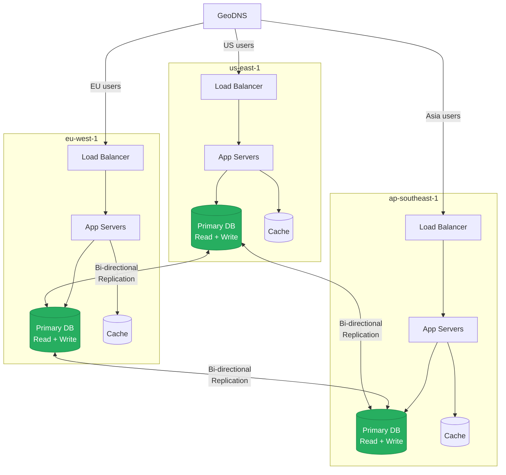
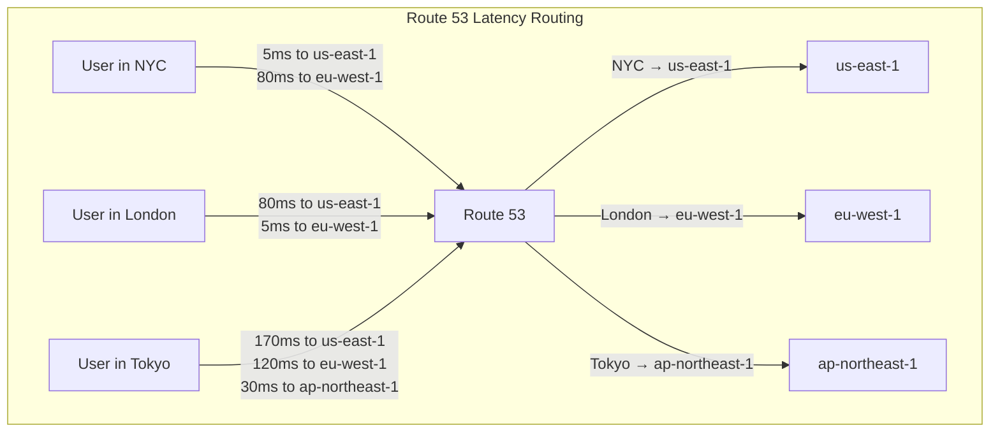
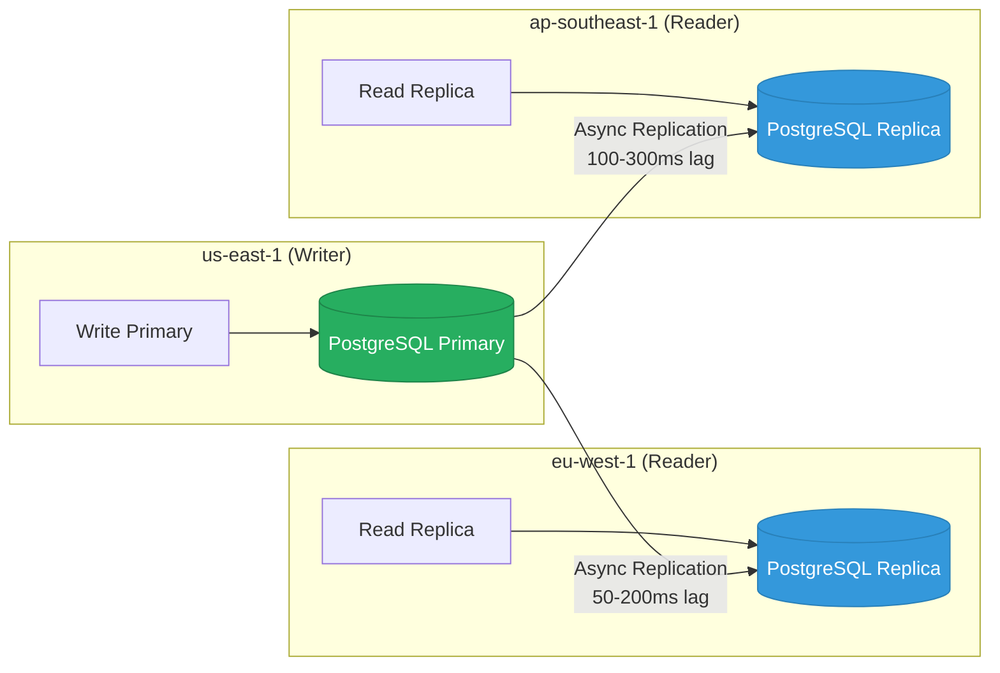
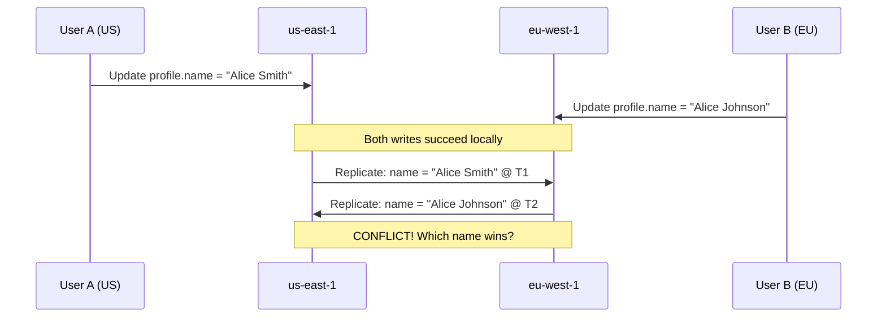
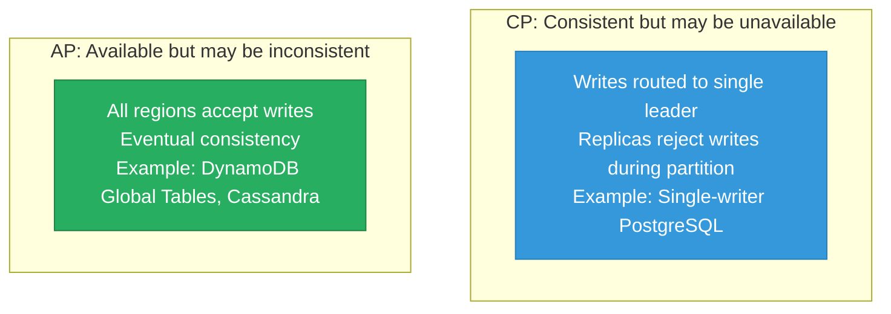

# Multi-Region Architecture Design

A multi-region architecture deploys your application across multiple geographic regions to achieve low latency for global users, high availability during regional outages, and compliance with data residency regulations. Going multi-region is one of the most complex infrastructure decisions you can make. It transforms every simple problem — caching, sessions, database writes, deployments — into a distributed systems problem with no clean answers.

## Why Go Multi-Region?

| Motivation | Single-Region Risk | Multi-Region Benefit |
|-----------|-------------------|---------------------|
| **Availability** | Regional AWS outage takes you offline | Traffic shifts to healthy region |
| **Latency** | Users in Asia get 200ms+ to us-east-1 | Users hit nearest region, < 50ms |
| **Compliance** | EU data stored in US violates GDPR | Data stays in eu-west-1 |
| **Disaster recovery** | Single region failure = total outage | RPO/RTO measured in minutes, not hours |
| **Traffic distribution** | Single region absorbs all load | Load split across regions |

## Active-Passive vs Active-Active

The two fundamental multi-region strategies have drastically different complexity and cost profiles.

### Active-Passive



| Aspect | Details |
|--------|---------|
| **How it works** | All traffic goes to primary. DR region is warm standby. |
| **Failover** | DNS or load balancer switches traffic to DR region |
| **RTO** | 5-30 minutes (DNS propagation + cache warming) |
| **RPO** | Seconds to minutes (depends on replication lag) |
| **Cost** | ~1.3-1.5x single region (standby infra is underutilized) |
| **Complexity** | Moderate — replication + failover automation |

**Failover process:**

```typescript
// Automated failover with health checks
class FailoverController {
  private consecutiveFailures = 0;
  private readonly failoverThreshold = 3;

  async checkPrimaryHealth(): Promise<void> {
    try {
      const response = await fetch('https://primary.example.com/health', {
        signal: AbortSignal.timeout(5000),
      });

      if (response.ok) {
        this.consecutiveFailures = 0;
        return;
      }

      this.consecutiveFailures++;
    } catch {
      this.consecutiveFailures++;
    }

    if (this.consecutiveFailures >= this.failoverThreshold) {
      await this.initiateFailover();
    }
  }

  private async initiateFailover(): Promise<void> {
    console.log('Initiating failover to DR region...');

    // 1. Promote DB replica to primary
    await this.promoteReplica('us-west-2');

    // 2. Update DNS to point to DR region
    await this.updateDNS('api.example.com', 'dr-lb.us-west-2.example.com');

    // 3. Warm caches in DR region
    await this.warmCaches('us-west-2');

    // 4. Alert on-call team
    await this.notify('FAILOVER EXECUTED: traffic now in us-west-2');
  }
}
```

### Active-Active



| Aspect | Details |
|--------|---------|
| **How it works** | All regions serve traffic simultaneously. Writes accepted everywhere. |
| **Failover** | Automatic — DNS removes unhealthy region |
| **RTO** | Near-zero (other regions already serving traffic) |
| **RPO** | Depends on conflict resolution strategy |
| **Cost** | ~2-3x single region (all regions fully active) |
| **Complexity** | Very high — write conflicts, data consistency, split-brain |

### Comparison Matrix

| Factor | Active-Passive | Active-Active |
|--------|:-------------:|:-------------:|
| **Latency** | High for remote users | Low globally |
| **Availability** | 99.95% (with fast failover) | 99.99%+ |
| **Cost** | 1.3-1.5x | 2-3x |
| **Complexity** | Moderate | Very high |
| **Data consistency** | Strong (single writer) | Eventual (multi-writer) |
| **Write conflicts** | None | Must be resolved |
| **Failover time** | 5-30 minutes | Seconds |
| **Operational burden** | Medium | Very high |

## DNS Routing Strategies

DNS is the front door of multi-region architecture. The routing strategy determines which region serves each user.

### Latency-Based Routing

Route users to the region with the lowest measured latency. AWS Route 53 continuously measures latency from its global network to each region.



```hcl
# Terraform — Route 53 latency-based routing
resource "aws_route53_record" "api_us" {
  zone_id        = aws_route53_zone.main.zone_id
  name           = "api.example.com"
  type           = "A"
  set_identifier = "us-east-1"

  latency_routing_policy {
    region = "us-east-1"
  }

  alias {
    name                   = aws_lb.us_east.dns_name
    zone_id                = aws_lb.us_east.zone_id
    evaluate_target_health = true
  }
}

resource "aws_route53_record" "api_eu" {
  zone_id        = aws_route53_zone.main.zone_id
  name           = "api.example.com"
  type           = "A"
  set_identifier = "eu-west-1"

  latency_routing_policy {
    region = "eu-west-1"
  }

  alias {
    name                   = aws_lb.eu_west.dns_name
    zone_id                = aws_lb.eu_west.zone_id
    evaluate_target_health = true
  }
}
```

### Geolocation-Based Routing

Route based on the geographic location of the DNS resolver. Useful for compliance (GDPR) and content localization.

| Strategy | Route by | Best For |
|----------|---------|---------|
| **Latency** | Measured network latency | Performance optimization |
| **Geolocation** | Country/continent of user | Compliance, localization |
| **Weighted** | Configured percentages | Gradual migration, canary |
| **Failover** | Primary + secondary with health checks | Active-passive DR |

### Weighted Routing for Gradual Migration

```hcl
# Gradually shift traffic from old to new region
resource "aws_route53_record" "api_old" {
  zone_id        = aws_route53_zone.main.zone_id
  name           = "api.example.com"
  type           = "A"
  set_identifier = "old-region"

  weighted_routing_policy {
    weight = 90  # Start at 90%, reduce over time
  }

  alias {
    name    = aws_lb.old_region.dns_name
    zone_id = aws_lb.old_region.zone_id
    evaluate_target_health = true
  }
}

resource "aws_route53_record" "api_new" {
  zone_id        = aws_route53_zone.main.zone_id
  name           = "api.example.com"
  type           = "A"
  set_identifier = "new-region"

  weighted_routing_policy {
    weight = 10  # Start at 10%, increase over time
  }

  alias {
    name    = aws_lb.new_region.dns_name
    zone_id = aws_lb.new_region.zone_id
    evaluate_target_health = true
  }
}
```

## Data Replication Strategies

### Strategy 1: Single-Writer with Read Replicas



**Replication lag handling:**

```typescript
// Read-your-writes consistency with replication lag
class MultiRegionReadService {
  constructor(
    private primaryDb: Database,  // us-east-1
    private localReplica: Database, // local region replica
  ) {}

  async getUser(userId: string, afterVersion?: number): Promise<User> {
    // If the client specifies a minimum version (from a recent write),
    // check if the local replica has caught up
    if (afterVersion) {
      const localVersion = await this.localReplica.query(
        'SELECT version FROM users WHERE id = $1',
        [userId]
      );

      if (localVersion < afterVersion) {
        // Replica hasn't caught up — read from primary
        return this.primaryDb.query(
          'SELECT * FROM users WHERE id = $1',
          [userId]
        );
      }
    }

    // Read from local replica (low latency)
    return this.localReplica.query(
      'SELECT * FROM users WHERE id = $1',
      [userId]
    );
  }
}
```

### Strategy 2: Multi-Writer with Conflict Resolution

When both regions accept writes, conflicts are inevitable. Two users updating the same record simultaneously in different regions creates a conflict that must be resolved.



## Conflict Resolution Strategies

### Last-Writer-Wins (LWW)

The write with the latest timestamp wins. Simple but can lose data.

```typescript
// Last-Writer-Wins with Lamport timestamps
interface VersionedRecord {
  data: any;
  timestamp: number;     // Lamport timestamp
  regionId: string;      // Tiebreaker
}

function resolveConflict(local: VersionedRecord, remote: VersionedRecord): VersionedRecord {
  if (local.timestamp > remote.timestamp) return local;
  if (remote.timestamp > local.timestamp) return remote;
  // Tiebreaker: lexicographic comparison of region IDs
  return local.regionId > remote.regionId ? local : remote;
}
```

**When to use LWW:** User profile updates, preferences, non-critical data where "last update wins" is acceptable.

**When to avoid LWW:** Counters, inventory, financial data — losing a write means losing money.

### CRDTs (Conflict-Free Replicated Data Types)

CRDTs are data structures designed to merge concurrent updates without conflicts. Every update can be applied in any order and the result converges to the same state. See our [CRDT Fundamentals](/system-design/distributed-systems/crdt-fundamentals) for a deep dive.

```typescript
// G-Counter (Grow-only Counter) CRDT
class GCounter {
  // Each region maintains its own counter
  private counts: Map<string, number> = new Map();

  constructor(private regionId: string) {}

  increment(amount: number = 1): void {
    const current = this.counts.get(this.regionId) || 0;
    this.counts.set(this.regionId, current + amount);
  }

  value(): number {
    let total = 0;
    for (const count of this.counts.values()) {
      total += count;
    }
    return total;
  }

  // Merge with another replica — always converges
  merge(other: GCounter): void {
    for (const [region, count] of other.counts) {
      const current = this.counts.get(region) || 0;
      this.counts.set(region, Math.max(current, count));
    }
  }
}

// Usage: page view counter across regions
const usCounter = new GCounter('us-east-1');
const euCounter = new GCounter('eu-west-1');

usCounter.increment(); // US visitor
usCounter.increment(); // US visitor
euCounter.increment(); // EU visitor

// After replication, both converge to 3
usCounter.merge(euCounter);
euCounter.merge(usCounter);
// usCounter.value() === 3
// euCounter.value() === 3
```

```typescript
// LWW-Element-Set CRDT for shopping carts
class LWWSet<T> {
  private addSet: Map<string, { value: T; timestamp: number }> = new Map();
  private removeSet: Map<string, { value: T; timestamp: number }> = new Map();

  add(key: string, value: T, timestamp: number): void {
    const existing = this.addSet.get(key);
    if (!existing || timestamp > existing.timestamp) {
      this.addSet.set(key, { value, timestamp });
    }
  }

  remove(key: string, timestamp: number): void {
    const existing = this.removeSet.get(key);
    if (!existing || timestamp > existing.timestamp) {
      this.removeSet.set(key, { value: this.addSet.get(key)!.value, timestamp });
    }
  }

  lookup(key: string): T | undefined {
    const addEntry = this.addSet.get(key);
    const removeEntry = this.removeSet.get(key);

    if (!addEntry) return undefined;
    if (!removeEntry) return addEntry.value;
    // Added after removed? Item is in the set
    return addEntry.timestamp > removeEntry.timestamp ? addEntry.value : undefined;
  }

  merge(other: LWWSet<T>): void {
    for (const [key, entry] of other.addSet) {
      this.add(key, entry.value, entry.timestamp);
    }
    for (const [key, entry] of other.removeSet) {
      this.remove(key, entry.timestamp);
    }
  }
}
```

### Custom Merge Functions

For domain-specific conflicts, define a custom merge strategy.

```typescript
// Custom merge for an inventory system
interface InventoryRecord {
  productId: string;
  stock: number;
  reservations: Reservation[];
  lastModified: number;
}

function mergeInventory(
  local: InventoryRecord,
  remote: InventoryRecord,
): InventoryRecord {
  return {
    productId: local.productId,
    // Stock: take the lower value (conservative approach)
    stock: Math.min(local.stock, remote.stock),
    // Reservations: union of both sets (no lost reservations)
    reservations: mergeReservations(local.reservations, remote.reservations),
    lastModified: Math.max(local.lastModified, remote.lastModified),
  };
}

function mergeReservations(a: Reservation[], b: Reservation[]): Reservation[] {
  const merged = new Map<string, Reservation>();
  for (const r of [...a, ...b]) {
    const existing = merged.get(r.id);
    if (!existing || r.updatedAt > existing.updatedAt) {
      merged.set(r.id, r);
    }
  }
  return Array.from(merged.values());
}
```

### Conflict Resolution Strategy Selection

| Strategy | Data Safety | Complexity | Best For |
|----------|:----------:|:----------:|---------|
| **LWW** | Low (lossy) | Low | Preferences, profiles, settings |
| **CRDTs** | High (lossless) | Medium | Counters, sets, collaborative editing |
| **Custom merge** | High | High | Domain-specific business rules |
| **Region-pinning** | High | Low | Avoid conflicts entirely — route user to owner region |

## Consistency Tradeoffs

### CAP Theorem in Multi-Region

In a multi-region deployment, you are always choosing between consistency and availability during a network partition between regions.



### Database Options for Multi-Region

| Database | Multi-Region Model | Consistency | Write Latency |
|----------|-------------------|:-----------:|:-------------:|
| **Aurora Global** | Single writer + read replicas | Strong (single writer) | Low in writer region |
| **DynamoDB Global Tables** | Multi-writer | Eventual (LWW) | Low in all regions |
| **CockroachDB** | Multi-writer with consensus | Strong (serializable) | Higher (cross-region consensus) |
| **Cassandra** | Multi-writer | Tunable (per-query) | Low in all regions |
| **Spanner** | Multi-writer with TrueTime | Strong (external consistency) | Higher (GPS-synchronized) |
| **PostgreSQL (Citus)** | Sharded, distributed | Strong per shard | Low for shard-local |

## Testing Multi-Region

Testing multi-region systems requires simulating conditions that are hard to reproduce in development.

### What to Test

```typescript
// Multi-region test scenarios
describe('Multi-Region System', () => {
  it('should failover within 30 seconds when primary region is unavailable', async () => {
    // Simulate region failure
    await blockRegionTraffic('us-east-1');

    const startTime = Date.now();

    // Wait for health check to detect failure
    await waitForCondition(async () => {
      const response = await fetch('https://api.example.com/health');
      const region = response.headers.get('X-Served-By-Region');
      return region === 'eu-west-1'; // Failover detected
    }, { timeout: 30_000 });

    const failoverTime = Date.now() - startTime;
    expect(failoverTime).toBeLessThan(30_000);

    // Verify data is consistent
    const data = await fetch('https://api.example.com/orders/recent');
    expect(data.status).toBe(200);
  });

  it('should handle replication lag gracefully', async () => {
    // Write to primary
    const order = await createOrder({ region: 'us-east-1' });

    // Read from replica immediately — may not be there yet
    const result = await getOrder(order.id, {
      region: 'eu-west-1',
      afterVersion: order.version, // Read-your-writes header
    });

    expect(result.id).toBe(order.id);
  });

  it('should resolve write conflicts correctly', async () => {
    // Concurrent writes to different regions
    const [resultUS, resultEU] = await Promise.all([
      updateProfile('user-1', { name: 'Alice' }, { region: 'us-east-1' }),
      updateProfile('user-1', { name: 'Bob' }, { region: 'eu-west-1' }),
    ]);

    // Wait for replication convergence
    await sleep(5000);

    // Both regions should agree on the same value
    const usProfile = await getProfile('user-1', { region: 'us-east-1' });
    const euProfile = await getProfile('user-1', { region: 'eu-west-1' });
    expect(usProfile.name).toBe(euProfile.name);
  });
});
```

### Chaos Engineering for Multi-Region

| Test | Simulates | Tool |
|------|----------|------|
| Block inter-region traffic | Network partition between regions | AWS VPC NACLs, Chaos Monkey |
| Kill primary database | Primary region DB failure | AWS FIS |
| Inject replication lag | Degraded network between regions | tc netem |
| DNS resolution failure | DNS outage | Modify Route 53 health checks |
| Saturate cross-region bandwidth | Bandwidth contention | iperf3 + tc |

## Cost Considerations

| Component | 2 Regions (Active-Passive) | 3 Regions (Active-Active) |
|-----------|:-------------------------:|:-------------------------:|
| **Compute** | 1.3x (standby at reduced capacity) | 3x (full capacity in each) |
| **Database** | 1.5x (replica cost) | 3x (full instances) |
| **Data transfer** | $0.02/GB cross-region replication | $0.02/GB x replication factor |
| **Load balancers** | 2x | 3x |
| **Monitoring** | 1.5x | 3x |
| **Estimated multiplier** | **1.3-1.5x single region** | **2.5-3x single region** |

See our [Cost of Scale](/system-design/advanced/cost-of-scale) page for detailed cost breakdowns.

## Key Takeaways

1. **Start with active-passive** — it gives you DR without the complexity of multi-writer conflicts
2. **Active-active is for companies that need 99.99%+ availability** and can afford the engineering investment
3. **DNS routing strategy matters** — latency-based routing is the best default for performance
4. **Choose your conflict resolution strategy before you write code** — retrofitting is painful
5. **CRDTs are underused** — they solve many multi-writer problems without custom conflict logic
6. **Test the failover** regularly — untested failover plans fail when you need them most
7. **Data transfer costs are significant** — cross-region replication at TB scale adds up fast

## Related Pages

- [CRDT Fundamentals](/system-design/distributed-systems/crdt-fundamentals) — deep dive into conflict-free data types
- [Consistency Models](/system-design/distributed-systems/consistency-models) — CAP, PACELC, linearizability
- [Replication](/system-design/databases/replication) — database replication strategies
- [Global Load Balancing](/system-design/load-balancing/global-load-balancing) — routing users to regions
- [Multi-Region Infrastructure](/infrastructure/multi-region) — Terraform multi-region setup
- [DNS Deep Dive](/system-design/networking/dns-deep-dive) — how DNS routing works
- [Traffic Routing](/infrastructure/multi-region/traffic-routing) — infra-level routing configuration
- [Failover Strategies](/infrastructure/multi-region/failover-strategies) — automated failover implementation
- [Cost of Scale](/system-design/advanced/cost-of-scale) — multi-region cost analysis
