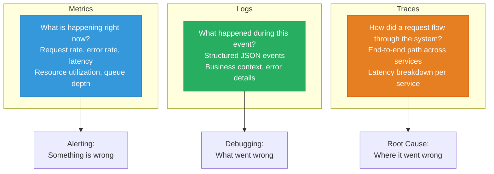
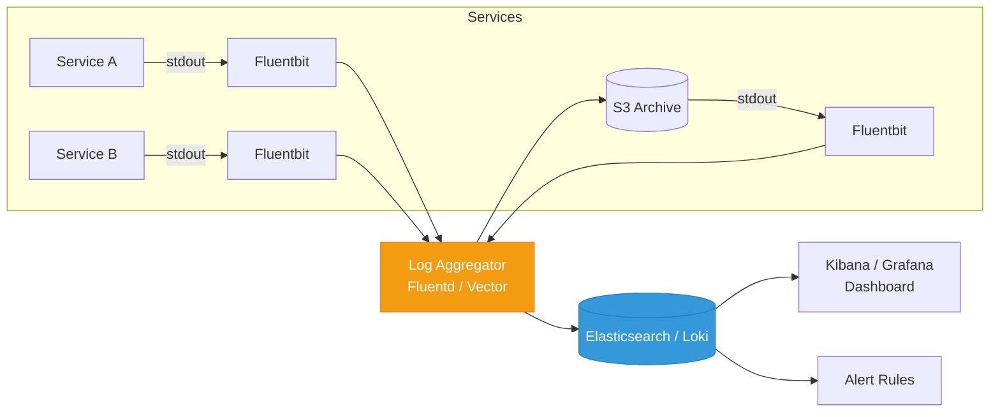
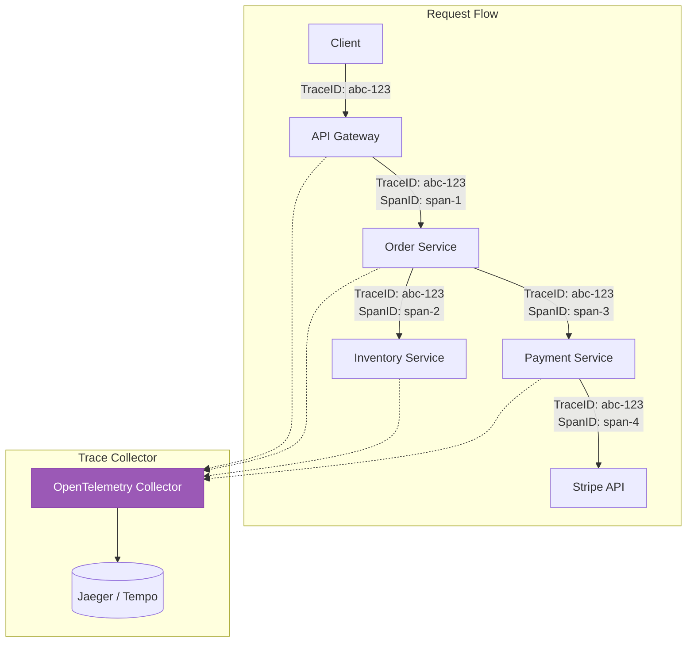
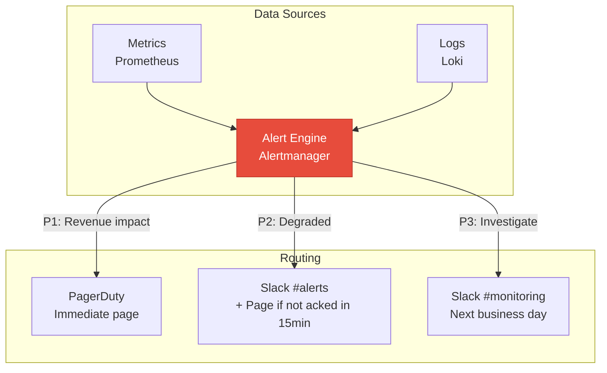

# Observability in System Design

Observability is not something you add after deployment. It is a design requirement that shapes your architecture from day one. If you design a system and cannot explain how you will know it is healthy, how you will detect a problem, and how you will find the root cause, your design is incomplete. In system design interviews, mentioning observability as an integral part of your design — not an afterthought — demonstrates senior-level thinking.

## The Three Pillars as Design Decisions



### When Each Pillar Matters in Design

| Design Decision | Metrics | Logs | Traces |
|----------------|:-------:|:----:|:------:|
| "Is the service healthy?" | Yes | No | No |
| "Why did this request fail?" | No | Yes | Yes |
| "Where is the bottleneck?" | Partial | No | Yes |
| "Are we meeting SLOs?" | Yes | No | No |
| "What happened to order X?" | No | Yes | Yes |
| "How much capacity do we need?" | Yes | No | No |

## Designing Metrics Into Your System

### The Four Golden Signals

Google's SRE book defines four signals every service must have. Design these into every service from the start.

| Signal | What It Measures | How to Expose | Alert Threshold |
|--------|-----------------|--------------|-----------------|
| **Latency** | Time to serve a request | Histogram (p50, p95, p99) | p99 > 500ms |
| **Traffic** | Requests per second | Counter | N/A (for capacity planning) |
| **Errors** | Failed requests / total | Counter (by type) | Error rate > 1% |
| **Saturation** | How full your resources are | Gauge (CPU, memory, connections) | CPU > 80%, conn pool > 90% |

```typescript
// Instrumenting the four golden signals in a service
import { Counter, Histogram, Gauge, Registry } from 'prom-client';

const registry = new Registry();

// Latency: histogram with buckets
const httpLatency = new Histogram({
  name: 'http_request_duration_seconds',
  help: 'Request duration in seconds',
  labelNames: ['method', 'route', 'status_code'],
  buckets: [0.01, 0.05, 0.1, 0.25, 0.5, 1, 2.5, 5, 10],
  registers: [registry],
});

// Traffic: counter
const httpRequests = new Counter({
  name: 'http_requests_total',
  help: 'Total HTTP requests',
  labelNames: ['method', 'route', 'status_code'],
  registers: [registry],
});

// Errors: counter (subset of traffic)
const httpErrors = new Counter({
  name: 'http_errors_total',
  help: 'Total HTTP errors (4xx and 5xx)',
  labelNames: ['method', 'route', 'status_code', 'error_type'],
  registers: [registry],
});

// Saturation: gauges
const activeConnections = new Gauge({
  name: 'db_active_connections',
  help: 'Number of active database connections',
  registers: [registry],
});

const connectionPoolSize = new Gauge({
  name: 'db_connection_pool_size',
  help: 'Total connection pool size',
  registers: [registry],
});

// Middleware to instrument every request
function metricsMiddleware(req: Request, res: Response, next: Next) {
  const start = process.hrtime.bigint();

  res.on('finish', () => {
    const durationMs = Number(process.hrtime.bigint() - start) / 1e6;
    const durationSeconds = durationMs / 1000;
    const labels = {
      method: req.method,
      route: req.route?.path || 'unknown',
      status_code: res.statusCode.toString(),
    };

    httpLatency.observe(labels, durationSeconds);
    httpRequests.inc(labels);

    if (res.statusCode >= 400) {
      httpErrors.inc({ ...labels, error_type: res.statusCode >= 500 ? 'server' : 'client' });
    }
  });

  next();
}
```

### Business Metrics (Beyond Technical)

Technical metrics tell you the system is healthy. Business metrics tell you the system is working.

```typescript
// Business metrics to design into every system
const businessMetrics = {
  // E-commerce
  ordersCreated: new Counter({ name: 'business_orders_created_total' }),
  orderValue: new Histogram({ name: 'business_order_value_dollars', buckets: [10, 50, 100, 500, 1000] }),
  paymentSuccessRate: new Gauge({ name: 'business_payment_success_rate' }),
  cartAbandonmentRate: new Gauge({ name: 'business_cart_abandonment_rate' }),

  // SaaS
  activeUsers: new Gauge({ name: 'business_active_users_current' }),
  signupsTotal: new Counter({ name: 'business_signups_total' }),
  featureUsage: new Counter({ name: 'business_feature_usage_total', labelNames: ['feature'] }),
  apiQuotaUtilization: new Gauge({ name: 'business_api_quota_utilization', labelNames: ['customer'] }),
};
```

## Designing Logs Into Your System

### Structured Logging from Day One

Unstructured logs are useless at scale. Design structured logging into every service.

```typescript
// Structured log format — every log entry has these fields
interface LogEntry {
  timestamp: string;      // ISO 8601
  level: 'debug' | 'info' | 'warn' | 'error';
  message: string;
  service: string;        // Which service emitted this
  traceId: string;        // Correlation across services
  spanId: string;         // This specific operation
  requestId: string;      // Unique request identifier
  userId?: string;        // Who triggered this (if known)
  duration_ms?: number;   // For timing operations
  error?: {
    type: string;
    message: string;
    stack: string;
  };
  metadata?: Record<string, unknown>;
}

// Example structured log output
// {
//   "timestamp": "2026-03-25T14:30:00.123Z",
//   "level": "error",
//   "message": "Payment processing failed",
//   "service": "payment-service",
//   "traceId": "abc-123-def-456",
//   "spanId": "span-789",
//   "requestId": "req-101112",
//   "userId": "user-42",
//   "duration_ms": 2340,
//   "error": {
//     "type": "StripeCardError",
//     "message": "Card declined: insufficient funds",
//     "stack": "..."
//   },
//   "metadata": {
//     "orderId": "ord-555",
//     "amount": 99.99,
//     "currency": "USD",
//     "retryAttempt": 2
//   }
// }
```

### What to Log at Each Level

| Level | When to Use | Example |
|-------|------------|---------|
| **ERROR** | Something failed that should not have | Payment processing failed, database connection lost |
| **WARN** | Something concerning but not failing | High latency detected, retry succeeded, nearing rate limit |
| **INFO** | Normal business events | Order created, user logged in, deployment started |
| **DEBUG** | Development details | SQL query executed, cache hit/miss, function input/output |

### Log Architecture



See our [Structured Logging](/devops/logging/structured-logging) and [Log Aggregation](/devops/logging/log-aggregation) pages.

## Designing Traces Into Your System

### Distributed Tracing Architecture



```typescript
// OpenTelemetry instrumentation
import { trace, context, SpanStatusCode } from '@opentelemetry/api';

const tracer = trace.getTracer('order-service');

async function createOrder(input: CreateOrderInput): Promise<Order> {
  // Create a span for this operation
  return tracer.startActiveSpan('createOrder', async (span) => {
    try {
      span.setAttribute('order.userId', input.userId);
      span.setAttribute('order.productCount', input.items.length);

      // Child span for inventory check
      const inventory = await tracer.startActiveSpan('checkInventory', async (childSpan) => {
        const result = await inventoryService.checkStock(input.items);
        childSpan.setAttribute('inventory.allInStock', result.allInStock);
        childSpan.end();
        return result;
      });

      // Child span for payment processing
      const payment = await tracer.startActiveSpan('processPayment', async (childSpan) => {
        const result = await paymentService.charge(input.userId, input.total);
        childSpan.setAttribute('payment.id', result.id);
        childSpan.setAttribute('payment.status', result.status);
        childSpan.end();
        return result;
      });

      const order = await orderRepo.save({ ...input, paymentId: payment.id });
      span.setAttribute('order.id', order.id);
      span.setStatus({ code: SpanStatusCode.OK });
      span.end();
      return order;
    } catch (error) {
      span.setStatus({ code: SpanStatusCode.ERROR, message: error.message });
      span.recordException(error);
      span.end();
      throw error;
    }
  });
}
```

### Where to Add Trace Spans

| Location | What to Trace | Why |
|----------|:-------------|-----|
| **API endpoint** | Every incoming HTTP request | Track end-to-end latency |
| **Database queries** | Query type, duration, table | Find slow queries |
| **External API calls** | URL, duration, status code | Identify slow dependencies |
| **Cache operations** | Hit/miss, key prefix, duration | Measure cache effectiveness |
| **Queue operations** | Publish/consume, queue name | Track async processing |
| **Business operations** | Order creation, payment, signup | Correlate technical with business |

## SLI/SLO in Design Documents

Every system design document should include Service Level Indicators and Objectives.

### Defining SLIs

```typescript
// Service Level Indicators — what you measure
interface SLI {
  name: string;
  description: string;
  measurement: string;
  goodEventCriteria: string;
}

const slis: SLI[] = [
  {
    name: 'Availability',
    description: 'Proportion of successful requests',
    measurement: 'successful_requests / total_requests',
    goodEventCriteria: 'HTTP status < 500',
  },
  {
    name: 'Latency',
    description: 'Proportion of fast requests',
    measurement: 'requests_under_threshold / total_requests',
    goodEventCriteria: 'Response time < 200ms (p99 < 500ms)',
  },
  {
    name: 'Correctness',
    description: 'Proportion of correct responses',
    measurement: 'correct_responses / total_responses',
    goodEventCriteria: 'Response body matches expected schema',
  },
];
```

### SLO Examples by Service Type

| Service Type | SLI | SLO Target | Error Budget |
|-------------|-----|:----------:|:------------:|
| **User-facing API** | Availability | 99.9% | 43.8 min/month |
| **User-facing API** | Latency (p99) | < 500ms for 99% of requests | 1% can be slow |
| **Payment processing** | Availability | 99.99% | 4.4 min/month |
| **Payment processing** | Correctness | 100% (no wrong charges) | Zero tolerance |
| **Batch processing** | Throughput | Process 1M records in < 1 hour | N/A |
| **Real-time messaging** | Latency (p99) | < 200ms delivery | 1% can be slower |
| **Search** | Latency (p95) | < 100ms | 5% can be slower |
| **Background jobs** | Completion rate | 99.5% complete within SLA | 0.5% can be late |

### SLO in Design Doc Template

```markdown
## Service Level Objectives

### Primary SLOs
| SLI | Target | Measurement Window | Consequence of Breach |
|-----|--------|-------------------|----------------------|
| Availability | 99.9% | Rolling 30 days | Page on-call, freeze deploys |
| Latency p99 | < 500ms | Rolling 7 days | Investigate, optimize |
| Error rate | < 0.1% | Rolling 24 hours | Alert, investigate |

### Error Budget Policy
- Above 50% budget remaining: Ship features normally
- 25-50% budget remaining: Reduce deploy frequency, increase testing
- Below 25% budget remaining: Freeze features, focus on reliability
- Budget exhausted: All engineering effort goes to reliability
```

See our [SLI/SLO/SLA](/devops/sre/sli-slo-sla) and [Error Budgets](/devops/sre/error-budgets) pages.

## Alerting Strategy as Design

### Alert Design Principles

| Principle | Description |
|-----------|-------------|
| **Alert on symptoms, not causes** | Alert "error rate > 1%" not "server CPU > 80%" |
| **Every alert must be actionable** | If nobody can do anything, it should not wake someone up |
| **Severity matches impact** | P1: revenue impact. P2: degraded experience. P3: investigate next business day |
| **Alert on SLO burn rate** | Sustained error rate that will exhaust error budget |

### Alert Architecture



```yaml
# Prometheus alerting rules
groups:
  - name: slo-alerts
    rules:
      # Alert when error budget burn rate threatens SLO
      - alert: HighErrorRate
        expr: |
          (
            sum(rate(http_requests_total{status_code=~"5.."}[5m]))
            /
            sum(rate(http_requests_total[5m]))
          ) > 0.01
        for: 5m
        labels:
          severity: critical
        annotations:
          summary: "Error rate > 1% for 5 minutes"
          description: "Service {​{ $labels.service }} error rate is {​{ $value | humanizePercentage }}"
          runbook: "https://wiki.example.com/runbooks/high-error-rate"

      # Alert when latency SLO is at risk
      - alert: HighLatency
        expr: |
          histogram_quantile(0.99,
            sum(rate(http_request_duration_seconds_bucket[5m])) by (le, service)
          ) > 0.5
        for: 10m
        labels:
          severity: warning
        annotations:
          summary: "P99 latency > 500ms for 10 minutes"
```

## Observability in System Design Interviews

When presenting a system design, include observability at these points:

1. **After the architecture diagram:** "For observability, every service exports metrics via Prometheus, structured logs via Fluentbit to Elasticsearch, and traces via OpenTelemetry to Jaeger."

2. **For each critical path:** "The payment flow has a dedicated dashboard tracking success rate, latency by payment provider, and error breakdown by type."

3. **For SLOs:** "Our availability SLO is 99.9%, measured as successful requests / total requests over a 30-day window. We alert when the burn rate suggests we will exhaust our error budget."

4. **For failure modes:** "If the payment service goes down, the circuit breaker dashboard shows the open state, and we alert the on-call engineer within 2 minutes."

## The Observability Stack Decision

| Need | Open Source | Managed |
|------|-----------|---------|
| **Metrics** | Prometheus + Grafana | Datadog, New Relic, CloudWatch |
| **Logs** | ELK/EFK, Loki + Grafana | Datadog Logs, CloudWatch Logs |
| **Traces** | Jaeger, Tempo | Datadog APM, X-Ray, Honeycomb |
| **Alerting** | Alertmanager + PagerDuty | Datadog, OpsGenie |
| **All-in-one** | Grafana Stack (Mimir + Loki + Tempo) | Datadog, New Relic |

| Factor | Open Source | Managed |
|--------|:-----------:|:-------:|
| **Cost** | Infrastructure + engineering time | Per-host/per-GB pricing |
| **Ops burden** | High (you run the stack) | Low (vendor runs it) |
| **Customization** | Full control | Limited |
| **Data retention** | Unlimited (your storage) | Usually 15-30 days included |
| **Best for** | Cost-sensitive, large scale | Teams that value speed, < 100 services |

## Key Takeaways

1. **Observability is a design requirement**, not an ops task — include it in every architecture document
2. **Four Golden Signals** (latency, traffic, errors, saturation) should be instrumented in every service from day one
3. **Structured logging** makes debug possible at scale — unstructured text logs are useless across 50 services
4. **Distributed tracing** is essential for microservices — you cannot debug cross-service issues without it
5. **Define SLOs before you build** — they drive alerting, error budgets, and prioritization decisions
6. **Alert on symptoms** (error rate, latency) not causes (CPU, memory) — symptoms tell you users are impacted
7. **Business metrics alongside technical metrics** — "orders per minute" matters as much as "requests per second"

## Related Pages

- [SLI/SLO/SLA](/devops/sre/sli-slo-sla) — defining and measuring service levels
- [Error Budgets](/devops/sre/error-budgets) — managing reliability vs velocity
- [Prometheus Deep Dive](/devops/monitoring/prometheus-deep-dive) — metrics collection and querying
- [Grafana Dashboards](/devops/monitoring/grafana-dashboards) — visualization best practices
- [Structured Logging](/devops/logging/structured-logging) — log format and strategy
- [Correlation IDs](/devops/logging/correlation-ids) — tracing requests across services
- [Alert Design](/devops/alerting/alert-design) — effective alerting patterns
- [Observability Tools](/devops/observability-tools) — tool comparison and selection
- [Metrics Design](/devops/monitoring/metrics-design) — designing good metrics
