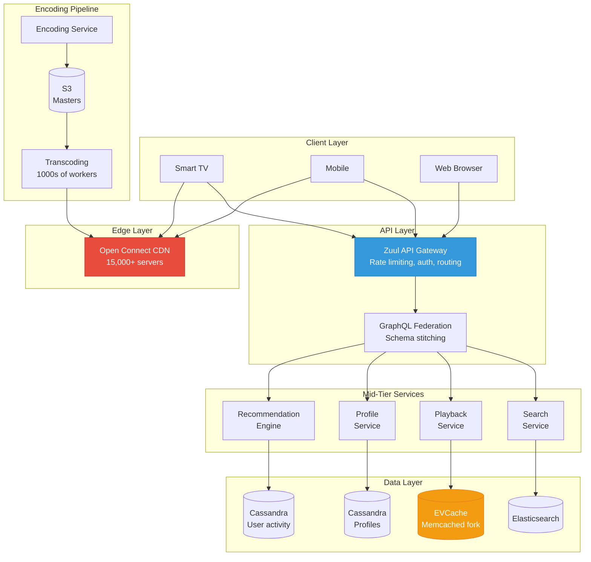
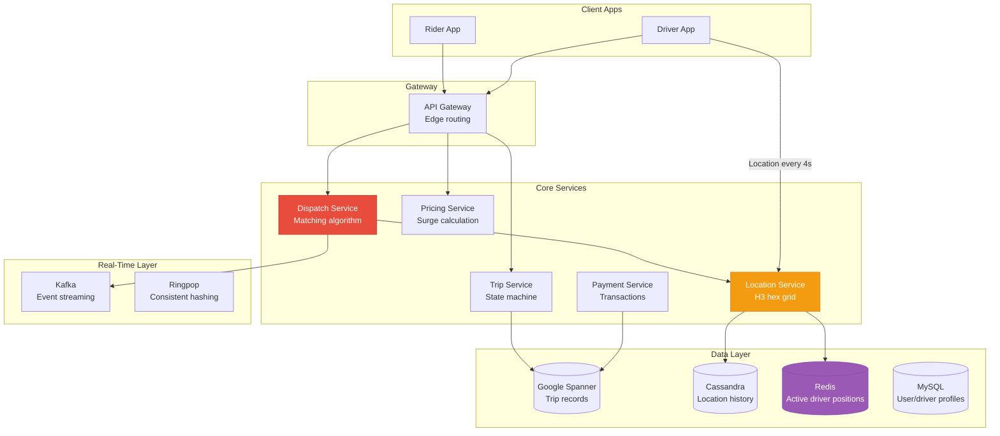
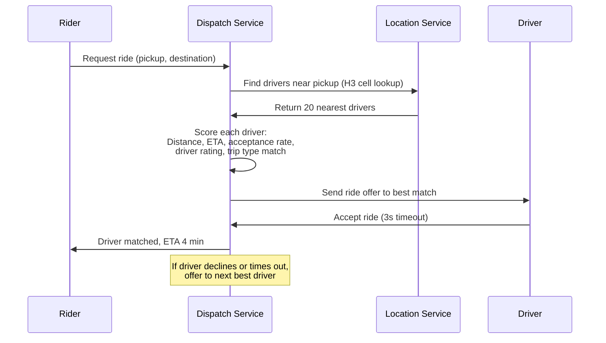
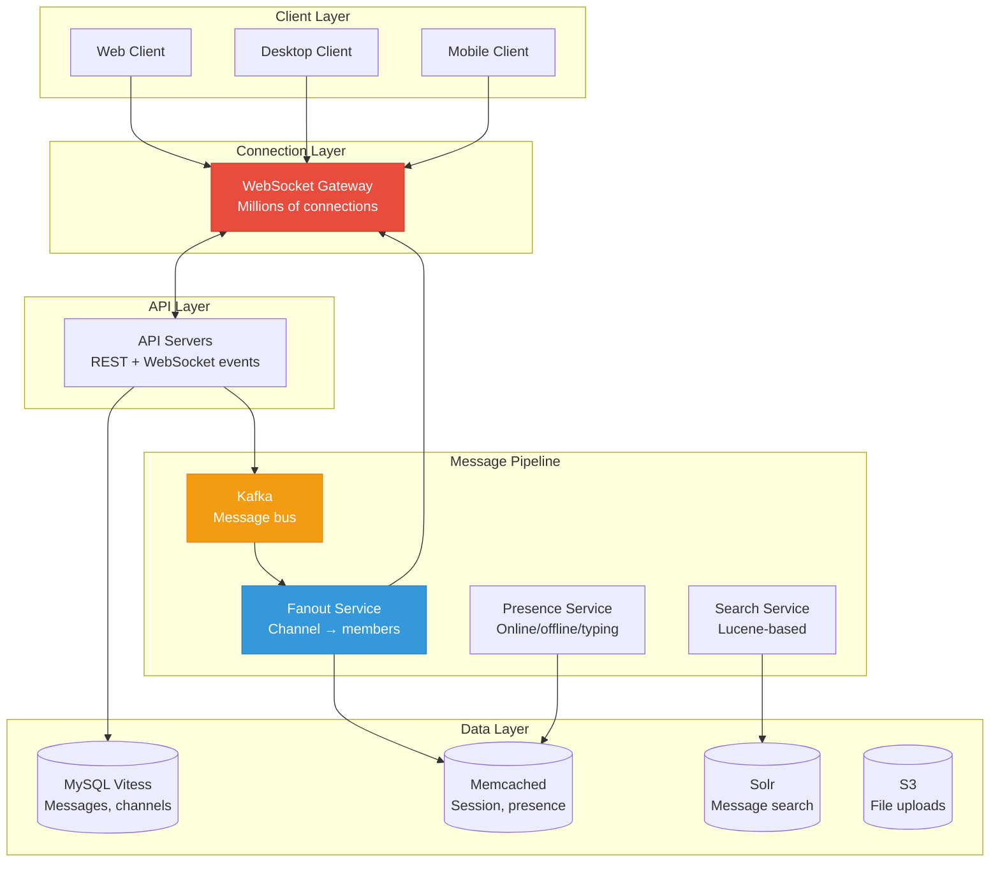
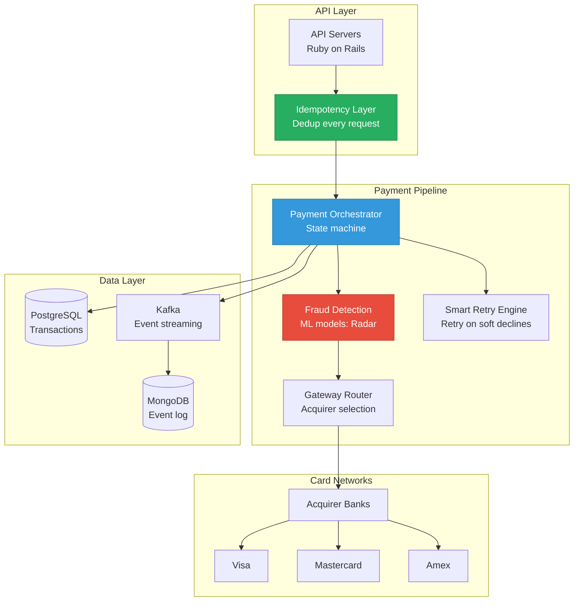
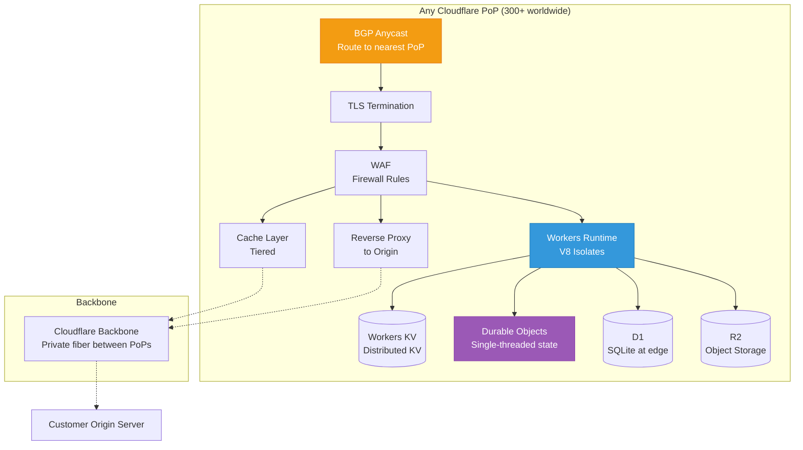

# Real-World Architectures

Studying real-world architectures teaches you patterns that textbooks cannot. Each system below was designed under unique constraints — Netflix optimizes for throughput, Uber for real-time dispatch, Slack for persistent connections, Stripe for correctness, and Cloudflare for edge latency. Understanding why they made specific choices is more valuable than memorizing the diagrams.

## 1. Netflix: Streaming Pipeline

Netflix serves 250+ million subscribers across 190 countries. Their architecture handles 20+ billion API requests per day and streams over 100 million hours of video daily.

### Architecture Overview



### Key Architectural Decisions

| Decision | What They Did | Why |
|----------|--------------|-----|
| **Own CDN (Open Connect)** | Built their own CDN with 15,000+ servers in ISP networks | Delivering video over third-party CDNs was too expensive at their scale |
| **Cassandra for everything** | Cassandra stores user profiles, viewing history, ratings | Need multi-region writes with eventual consistency at massive scale |
| **EVCache (Memcached fork)** | Custom in-memory cache layer | Needed lower latency than Cassandra for hot paths (30 billion reads/day) |
| **Chaos Engineering** | Invented Chaos Monkey, runs in production daily | In a system this distributed, failures are constant — must be resilient |
| **Multiple video encodes** | Each title encoded in 1000+ variants (bitrate x resolution x codec) | Optimize quality per device and network condition |

### What Makes It Special

**The Open Connect CDN** is Netflix's biggest competitive advantage. When you press play, the video streams from a server inside your ISP's data center — not from AWS. Netflix places hardware appliances with ISPs worldwide. Each appliance stores the most popular content for that region. This means video data rarely crosses the internet backbone, resulting in better quality and lower ISP costs.

**The recommendation engine** drives 80% of what users watch. It runs hundreds of A/B tests simultaneously, using a massive Spark + Flink pipeline that processes billions of events daily into personalized recommendations.

### Key Insight

> Netflix's architecture is not about serving video — it is about getting the right content to the right cache, as close to the user as possible, before they even press play.

## 2. Uber: Real-Time Dispatch

Uber matches millions of riders with drivers in real-time, processing 1+ million dispatches per minute at peak. The system must handle constant location updates (every 4 seconds from every active driver) and match supply with demand across thousands of cities.

### Architecture Overview



### Key Architectural Decisions

| Decision | What They Did | Why |
|----------|--------------|-----|
| **H3 hexagonal grid** | Spatial indexing using Uber's open-source H3 library | Hexagons tile the globe evenly — better than squares for geospatial queries |
| **Google Spanner** | Globally consistent database for trip records | Need strong consistency for financial records across regions |
| **Ringpop** | Custom consistent hashing ring for dispatch | Stateful dispatch workers — each owns a geographic area |
| **Kafka as backbone** | All events flow through Kafka | Decouples 2000+ microservices from real-time event processing |
| **Schemaless (MySQL sharding)** | Custom sharding layer over MySQL | Built before CockroachDB/Spanner were mature |

### The Dispatch Algorithm



### What Makes It Special

**The Location Service** processes 50+ million location updates per minute (every driver pings every 4 seconds). These are indexed in H3 hexagonal cells in Redis. When a rider requests a ride, the dispatch service queries the H3 cell and adjacent cells, getting all nearby drivers in under 5ms.

**Surge pricing** is a real-time supply/demand balancing system. It monitors rider requests and driver availability per geographic zone, adjusting prices to incentivize more drivers to enter high-demand areas.

### Key Insight

> Uber's architecture is a geospatial matching engine. Everything revolves around answering one question in under 100ms: "Which available driver should serve this rider right now?"

See our [Uber Dispatch deep dive](/company-architecture/uber-dispatch) for more details.

## 3. Slack: Real-Time Messaging

Slack handles 12+ billion messages per year with millions of concurrent WebSocket connections. Messages must be delivered to all participants within 200ms, while maintaining message ordering and handling offline users.

### Architecture Overview



### Key Architectural Decisions

| Decision | What They Did | Why |
|----------|--------------|-----|
| **Vitess (MySQL sharding)** | Sharded MySQL with Vitess | Needed horizontal scale but wanted to keep MySQL's mature tooling |
| **Channel fanout** | Dedicated service to expand "message to #general" into individual deliveries | A message to a 10K-member channel must reach 10K connections |
| **WebSocket gateway** | Dedicated connection-management layer | Separates stateful connections from stateless API logic |
| **Presence via heartbeat** | Clients send heartbeats every 30s to indicate "online" | Distributed presence tracking for millions of users |
| **Message ordering per channel** | Monotonically increasing IDs per channel | Users must see messages in order within a channel |

### The Fanout Problem

When a user sends a message to a channel with 10,000 members, that single write becomes 10,000 deliveries:

```mermaid
graph LR
    MSG[Message: "Hello #general"] --> FAN[Fanout Service]
    FAN --> |"10,000 members"| WSG[WebSocket Gateway]
    WSG --> W1[Connection 1]
    WSG --> W2[Connection 2]
    WSG --> W3[...]
    WSG --> W4[Connection 10,000]
    FAN --> |"Offline members"| PUSH[Push Notification<br/>Service]

    style FAN fill:#e74c3c,stroke:#c0392b,color:#fff
```

### What Makes It Special

**The connection gateway** manages millions of persistent WebSocket connections, sharded across hundreds of gateway servers. Each gateway server maintains an in-memory registry of which users are connected to it. When the fanout service needs to deliver a message, it looks up which gateway server each recipient is connected to and routes the message directly.

### Key Insight

> Slack's core challenge is not storing messages — it is delivering them in real-time to thousands of recipients across millions of persistent connections with sub-200ms latency.

## 4. Stripe: Payment Processing

Stripe processes hundreds of billions of dollars in payments annually. The architecture must prioritize correctness above everything else — a lost payment or double charge destroys trust.

### Architecture Overview



### Key Architectural Decisions

| Decision | What They Did | Why |
|----------|--------------|-----|
| **Idempotency keys** | Every API request requires an idempotency key | Network retries must never double-charge a customer |
| **State machine for payments** | Every payment transitions through defined states | Payments have complex lifecycle: auth → capture → settle → refund |
| **Smart retries** | Automatically retry soft declines with different parameters | Increases payment success rate by 5-10% |
| **Multi-acquirer routing** | Route payments to acquirer with best success rate per card type/region | Optimizes authorization rates globally |
| **PostgreSQL with strong consistency** | Financial data in PostgreSQL with serializable isolation | Money requires ACID — no eventual consistency |

### Idempotency Implementation

```typescript
// Stripe's idempotency model (simplified)
class PaymentController {
  async createCharge(req: Request): Promise<Response> {
    const idempotencyKey = req.headers['Idempotency-Key'];

    // Check if this request was already processed
    const existing = await this.idempotencyStore.get(idempotencyKey);
    if (existing) {
      // Return the same response — no duplicate charge
      return existing.response;
    }

    // Lock the idempotency key to prevent concurrent duplicates
    const lock = await this.idempotencyStore.lock(idempotencyKey);

    try {
      const result = await this.paymentOrchestrator.charge(req.body);

      // Store the response for future duplicate requests
      await this.idempotencyStore.set(idempotencyKey, {
        response: result,
        expiresAt: Date.now() + 24 * 60 * 60 * 1000, // 24 hours
      });

      return result;
    } finally {
      await lock.release();
    }
  }
}
```

### What Makes It Special

**Stripe's API design** is legendary. Every endpoint is idempotent, every response includes pagination cursors, every error has a structured error code. The API consistency is achieved through a custom API framework that enforces conventions at the framework level — individual engineers cannot accidentally break the contract.

**Radar (fraud detection)** processes every payment through ML models trained on Stripe's entire network. Because Stripe sees payments across millions of businesses, their fraud models have more data than any individual merchant.

### Key Insight

> Stripe's architecture is built on one principle: financial operations must be correct, even at the cost of latency. Every write is idempotent, every state transition is logged, and every failure mode has a defined recovery path.

## 5. Cloudflare: Edge Network

Cloudflare runs one of the world's largest edge networks — 300+ data centers in 100+ countries. Every data center runs every service. There is no "origin" or "primary" data center. This is the purest form of edge computing.

### Architecture Overview



### Key Architectural Decisions

| Decision | What They Did | Why |
|----------|--------------|-----|
| **BGP Anycast** | Same IP announced from every PoP — network routes to nearest | No DNS-based routing needed; network layer handles it automatically |
| **Every PoP is identical** | No special "primary" or "origin" data centers | Any PoP can handle any request; failure of one PoP is invisible |
| **V8 Isolates (not containers)** | Workers run in V8 isolates, not Docker containers | Isolates start in < 5ms (vs 100ms+ for containers), 100x less memory |
| **Tiered caching** | If local cache misses, check a regional "upper-tier" cache before origin | Reduces origin load while keeping edge cache small |
| **Quicksilver** | Custom KV replication system — propagates config to all PoPs in < 5s | WAF rules, DNS records, Workers code must deploy globally in seconds |

### What Makes It Special

**BGP Anycast** is the foundation. When a user's browser resolves `example.com`, every Cloudflare data center advertises the same IP address via BGP. The internet's routing protocols naturally send the user's packets to the nearest data center. No DNS tricks, no latency-based routing — the network does it.

**Quicksilver** propagates configuration changes to 300+ data centers in under 5 seconds. When a customer updates a WAF rule, it is active worldwide almost instantly. This is built on a custom distributed KV store optimized for write-heavy, read-heavy global distribution.

**V8 Isolates** are why Workers have near-zero cold starts. Instead of booting a container (100ms+), Cloudflare creates a V8 isolate (< 5ms) that shares the same runtime process with thousands of other customers' isolates. Memory isolation is enforced by V8, not by OS-level containers.

### Key Insight

> Cloudflare's architecture proves that you do not need a "primary" or "origin" for your infrastructure. Every edge location is a full-stack deployment — compute, storage, security, and networking — running the exact same software.

## Cross-Architecture Comparison

| Dimension | Netflix | Uber | Slack | Stripe | Cloudflare |
|-----------|---------|------|-------|--------|------------|
| **Primary DB** | Cassandra | Spanner + MySQL | MySQL (Vitess) | PostgreSQL | Custom KV |
| **Cache** | EVCache (Memcached) | Redis | Memcached | Redis | In-memory |
| **Message bus** | Kafka | Kafka | Kafka | Kafka | Custom |
| **Key constraint** | Throughput | Real-time latency | Connection count | Correctness | Edge latency |
| **Scale unit** | Hours of video/day | Dispatches/minute | Messages/second | Payments/second | Requests/second |
| **Special sauce** | Own CDN network | H3 spatial index | WebSocket fanout | Idempotency | Anycast + Isolates |

## Lessons Across All Five

1. **Each company built custom infrastructure** for their unique bottleneck — generic solutions were not enough at their scale
2. **Kafka is universal** — all five use event streaming as the backbone
3. **Caching is not optional** — every architecture has a caching layer (EVCache, Redis, Memcached)
4. **The database choice follows the workload** — Cassandra for scale, Spanner for consistency, PostgreSQL for correctness
5. **Observability is built in** — at this scale, you cannot debug without distributed tracing, metrics, and alerting

## Related Pages

- [Uber Dispatch Architecture](/company-architecture/uber-dispatch) — detailed Uber dispatch design
- [Discord Scaling](/company-architecture/discord-scaling) — another real-time messaging architecture
- [Shopify Black Friday](/company-architecture/shopify-black-friday) — handling extreme traffic spikes
- [Edge Computing](/system-design/advanced/edge-computing) — Cloudflare Workers in depth
- [Kafka Internals](/system-design/message-queues/kafka-internals) — the event bus all five companies use
- [Cassandra Internals](/system-design/databases/cassandra-internals) — Netflix's primary database
- [Consistent Hashing](/system-design/distributed-systems/consistent-hashing) — used by Uber and Slack for sharding
